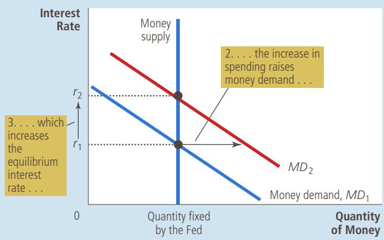
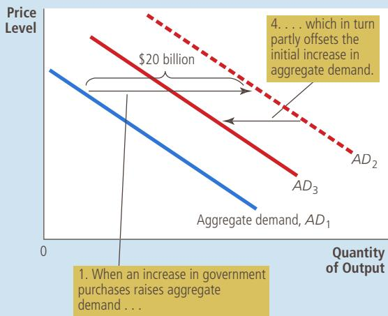

## FIGURE 5

The Crowding-Out Effect

(a) The Money Market  

(b) The Shift in Aggregate Demand  

To sum up: When the government increases its purchases by \$20 billion, the aggregate demand for goods and services could rise by more or less than \$20 billion depending on the sizes of the multiplier and crowding-out effects. The multiplier effect makes the shift in aggregate demand greater than \$20 billion. The crowding-out effect pushes the aggregate-demand curve in the opposite direction and, if large enough, could result in an aggregate-demand shift of less than \$20 billion.

## 21-2f Changes in Taxes

The other important instrument of fiscal policy, besides the level of government purchases, is the level of taxation. When the government cuts personal income taxes, for instance, it increases households’ take-home pay. Households will save some of this additional income, but they will also spend some of it on consumer goods. Because it increases consumer spending, the tax cut shifts the aggregate-demand curve to the right. Similarly, a tax increase depresses consumer spending and shifts the aggregate-demand curve to the left.

The size of the shift in aggregate demand resulting from a tax change is also affected by the multiplier and crowding-out effects. When the government cuts taxes and stimulates consumer spending, earnings and profits rise, which further stimulates consumer spending. This is the multiplier effect. At the same time, higher income leads to higher money demand, which tends to raise interest rates. Higher interest rates make borrowing more costly, which reduces investment spending. This is the crowding-out effect. Depending on the sizes of the multiplier and crowding-out effects, the shift in aggregate demand could be larger or smaller than the tax change that causes it.

FYI

## How Fiscal Policy Might Affect Aggregate Supply

o far, our discussion of fiscal policy has stressed how changes in government purchases and changes in taxes influence the quantity of goods and services demanded. Most economists believe that the shortrun macroeconomic effects of fiscal policy work primarily through aggregate demand. Yet fiscal policy can potentially influence the quantity of goods and services supplied as well.

For instance, consider the effects of tax changes on aggregate supply. One of the Ten Principles of Economics in Chapter 1 is that people respond to incentives. When government policymakers cut tax rates, workers get to keep more of each dollar they earn, so they have a greater incentive to work and produce goods and services. If they respond to this incentive, the quantity of goods and services supplied will be greater at each price level, and the aggregate-supply curve will shift to the right.

Some economists, called supply siders, have argued that the influence of tax cuts on aggregate supply is large. According to some supply siders, the influence is so large that a cut in tax rates will stimulate enough additional production and income that tax revenue will actually increase. This is certainly a theoretical possibility, but most economists do not consider

it the normal case. While the supply-side effects of taxes are important to consider, they are usually not large enough to cause tax revenue to rise when tax rates fall.

Like changes in taxes, changes

in government purchases can also potentially affect aggregate supply. Suppose, for instance, that the government increases expenditure on a form of government-provided capital, such as roads. Roads are used by private businesses to make deliveries to their customers; an increase in the quantity of roads increases these businesses’ productivity. Hence, when the government spends more on roads, it increases the quantity of goods and services supplied at any given price level and, thus, shifts the aggregate-supply curve to the right. This effect on aggregate supply is probably more important in the long run than in the short run, however, because it takes time for the government to build new roads and put them into use. ■

In addition to the multiplier and crowding-out effects, there is another important determinant of the size of the shift in aggregate demand that results from a tax change: households’ perceptions about whether the tax change is permanent or temporary. For example, suppose that the government announces a tax cut of \$1,000 per household. In deciding how much of this \$1,000 to spend, households must ask themselves how long this extra income will last. If they expect the tax cut to be permanent, they will view it as adding substantially to their financial resources and, therefore, increase their spending by a large amount. In this case, the tax cut will have a large impact on aggregate demand. By contrast, if households expect the tax change to be temporary, they will view it as adding only slightly to their financial resources and, therefore, will increase their spending by only a small amount. In this case, the tax cut will have a small impact on aggregate demand.

An extreme example of a temporary tax cut was the one announced in 1992. In that year, President George H. W. Bush faced a lingering recession and an upcoming reelection campaign. He responded to these circumstances by announcing a reduction in the amount of income tax that the federal government was withholding from workers’ paychecks. Because legislated income tax rates did not change, however, every dollar of reduced withholding in 1992 meant an extra dollar of taxes due on April 15, 1993, when income tax returns for 1992 were to be filed. Thus, this “tax cut” actually represented only a short-term loan from the government. Not surprisingly, the impact of the policy on consumer spending and aggregate demand was relatively small.

Suppose that the government reduces spending on highway construction QuickQuiz by \$10 billion. Which way does the aggregate-demand curve shift? Explain why the shift might be larger or smaller than \$10 billion.

## 21-3 Using Policy to Stabilize the Economy

We have seen how monetary and fiscal policy can affect the economy’s aggregate demand for goods and services. These theoretical insights raise some important policy questions: Should policymakers use these instruments to control aggregate demand and stabilize the economy? If so, when? If not, why not?

## 21-3a The Case for Active Stabilization Policy

Let’s return to the question that began this chapter: When the president and Congress raise taxes, how should the Federal Reserve respond? As we have seen, the level of taxation is one determinant of the position of the aggregate-demand curve. When the government raises taxes, aggregate demand will fall, depressing production and employment in the short run. If the Federal Reserve wants to prevent this adverse effect of the fiscal policy, it can expand aggregate demand by increasing the money supply. A monetary expansion would reduce interest rates, stimulate investment spending, and expand aggregate demand. If monetary policy is set appropriately, the combined changes in monetary and fiscal policy could leave the aggregate demand for goods and services unaffected.

This analysis is exactly the sort followed by members of the Federal Open Market Committee. They know that monetary policy is an important determinant of aggregate demand. They also know that there are other important determinants as well, including fiscal policy set by the president and Congress. As a result, the FOMC watches the debates over fiscal policy with a keen eye.

This response of monetary policy to the change in fiscal policy is an example of a more general phenomenon: the use of policy instruments to stabilize aggregate demand and, as a result, production and employment. Economic stabilization has been an explicit goal of U.S. policy since the Employment Act of 1946. This act states that “it is the continuing policy and responsibility of the federal government to . . . promote full employment and production.” In essence, the government has chosen to hold itself accountable for short-run macroeconomic performance.

The Employment Act has two implications. The first, more modest, implication is that the government should avoid being a cause of economic fluctuations. Thus, most economists advise against large and sudden changes in monetary and fiscal policy, for such changes are likely to cause fluctuations in aggregate demand. Moreover, when large changes do occur, it is important that monetary and fiscal policymakers be aware of and respond to each others’ actions.

The second, more ambitious, implication of the Employment Act is that the government should respond to changes in the private economy to stabilize aggregate demand. The act was passed not long after the publication of Keynes’s The General Theory of Employment, Interest, and Money, which has been one of the most influential books ever written about economics. In it, Keynes emphasized the key role of aggregate demand in explaining short-run economic fluctuations. Keynes

IN THE NEWS
