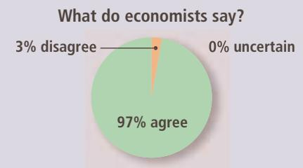
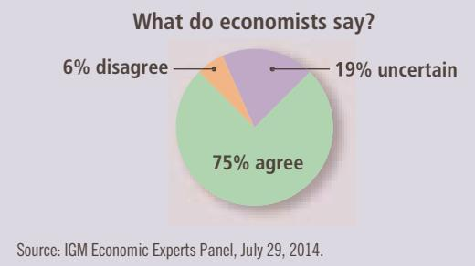
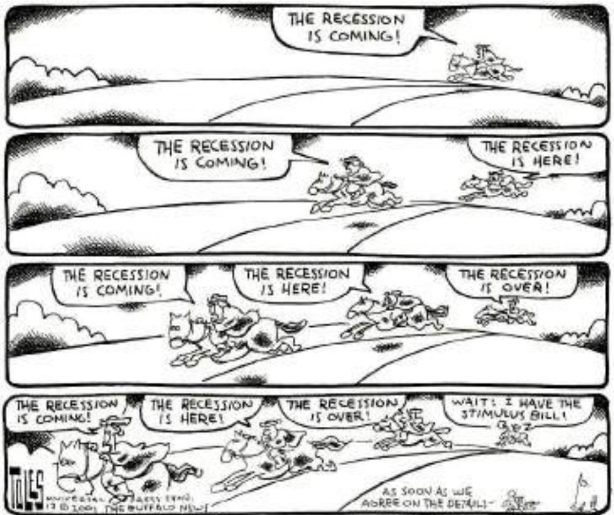

# How Large Is the Fiscal Policy Multiplier?

In the global economic downturn of 2008 and 2009, governments around the world turned to fiscal policy to prop up aggregate demand. This episode ignited a debate about the size of the multipliers, which remains a topic of much research.

## Much Ado about Multipliers

t is the biggest peacetime fiscal expansion in history. Across the globe countries have countered the recession by cutting taxes and by boosting government spending. The G20 group of economies, whose leaders meet this week in Pittsburgh, have introduced stimulus packages worth an average of 2% of GDP this year [2009] and 1.6% of GDP in 2010. Coordinated action on this scale might suggest a consensus about the effects of fiscal stimulus. But economists are in fact deeply divided about how well, or indeed whether, such stimulus works.

The debate hinges on the scale of the “fiscal multiplier.” This measure, first formalised in 1931 by Richard Kahn, a student of John Maynard Keynes, captures how effectively tax cuts or increases in government spending stimulate output. A multiplier of one means that a \$1 billion increase in government spending will increase a country’s GDP by \$1 billion.

The size of the multiplier is bound to vary according to economic conditions. For an economy operating at full capacity, the fiscal multiplier should be zero. Since there are no spare resources, any increase in government demand would just replace spending elsewhere. But in a recession, when workers and factories lie idle, a fiscal boost can increase overall demand. And if the initial stimulus triggers a cascade of expenditure among consumers and businesses, the multiplier can be well above one.

The multiplier is also likely to vary according to the type of fiscal action. Government spending on building a bridge may have a bigger multiplier than a tax cut if consumers save a portion of their tax windfall. A tax cut targeted at poorer people may have a bigger impact on spending than one for the affluent, since poorer folk tend to spend a higher share of their income.

Crucially, the overall size of the fiscal multiplier also depends on how people react to higher government borrowing. If the government’s actions bolster confidence and revive animal spirits, the multiplier could rise as demand goes up and private investment is “crowded in.” But if interest rates climb in response to government borrowing then some private investment that would otherwise have occurred could get “crowded out.” And if consumers expect higher future taxes in order to finance new government borrowing, they could spend less today. All that would reduce the fiscal multiplier, potentially to below zero.

claimed that the government should actively stimulate aggregate demand when aggregate demand appeared insufficient to maintain production at its full-employment level.

Keynes (and his many followers) argued that aggregate demand fluctuates because of largely irrational waves of pessimism and optimism. He used the term “animal spirits” to refer to these arbitrary changes in attitude. When pessimism reigns, households reduce consumption spending and firms reduce investment spending. The result is reduced aggregate demand, lower production, and higher unemployment. Conversely, when optimism reigns, households and firms increase spending. The result is higher aggregate demand, higher production, and inflationary pressure. Notice that these changes in attitude are, to some extent, self-fulfilling.

In principle, the government can adjust its monetary and fiscal policy in response to these waves of optimism and pessimism and, thereby, stabilize the economy. For example, when people are excessively pessimistic, the Fed can expand the money supply to lower interest rates and expand aggregate demand. When they are excessively optimistic, it can contract the money supply to raise interest rates and dampen aggregate demand. Former Fed Chairman William McChesney Martin described this view of monetary policy very simply: “The Federal Reserve’s job is to take away the punch bowl just as the party gets going.”

Different assumptions about the impact of higher government borrowing on interest rates and private spending explain wild variations in the estimates of multipliers from today’s stimulus spending. Economists in the Obama administration, who assume that the federal funds rate stays constant for a four-year period, expect a multiplier of 1.6 for government purchases and 1.0 for tax cuts from America’s fiscal stimulus. An alternative assessment by John Cogan, Tobias Cwik, John Taylor and Volker Wieland uses models in which interest rates and taxes rise more quickly in response to higher public borrowing. Their multipliers are much smaller. They think America’s stimulus will boost GDP by only one-sixth as much as the Obama team expects.

When forward-looking models disagree so dramatically, careful analysis of previous fiscal stimuli ought to help settle the debate. Unfortunately, it is extremely tricky to isolate the impact of changes in fiscal policy. One approach is to use microeconomic case studies to examine consumer behaviour in response to specific tax rebates and cuts. These studies, largely based on tax changes in America, find that permanent cuts have a bigger impact on consumer spending than temporary ones and that consumers who find it hard to borrow, such as those close to their credit-card limit, tend to spend more of their tax windfall. But case studies do not measure the overall impact of tax cuts or spending increases on output.

An alternative approach is to try to tease out the statistical impact of changes in government spending or tax cuts on GDP. The difficulty here is to isolate the effects of fiscal-stimulus measures from the rises in social-security spending and falls in tax revenues that naturally accompany recessions. This empirical approach has narrowed the range of estimates in some areas. It has also yielded interesting cross-country comparisons. Multipliers are bigger in closed economies than open ones (because less of the stimulus leaks abroad via imports). They have traditionally been bigger in rich countries than emerging ones (where investors tend to take fright more quickly, pushing interest rates up). But overall economists find as big a range of multipliers from empirical estimates as they do from theoretical models.

To add to the confusion, the post-war experiences from which statistical analyses are drawn differ in vital respects from the current situation. Most of the evidence on multipliers for government spending is based on military outlays, but today’s stimulus packages are heavily focused on infrastructure. Interest rates in many rich countries are now close to zero, which may increase the potency of, as well as the need for, fiscal stimulus. Because of the financial crisis relatively more people face borrowing constraints, which would increase the effectiveness of a tax cut. At the same time, highly indebted consumers may now be keen to cut their borrowing, leading to a lower multiplier. And investors today have more reason to be worried about rich countries’ fiscal positions than those of emerging markets.

Add all this together and the truth is that economists are flying blind. They can make relative judgments with some confidence. Temporary tax cuts pack less punch than permanent ones, for instance. Fiscal multipliers will probably be lower in heavily indebted economies than in prudent ones. But policymakers looking for precise estimates are deluding themselves. ■

S o u r c e : The Economist, September 24, 2009.

Source: IGM Economic Experts Panel, July 29, 2014.

## KEYNESIANS IN THE WHITE HOUSE

When a reporter in 1961 asked President John F. Kennedy why he advocated a tax cut, Kennedy replied, “To stimulate the economy. Don’t you remember your Economics 101?” Kennedy’s policy was, in fact, based on the analysis of fiscal policy we have developed in this chapter. His goal was to enact a tax cut, which would raise consumer spending, expand aggregate demand, and increase the economy’s production and employment.

In choosing this policy, Kennedy was relying on his team of economic advisers. This team included such prominent economists as James Tobin and Robert Solow, both of whom would later win Nobel Prizes for their contributions to the field. As students in the 1940s, these economists had closely studied John Maynard Keynes’s General Theory, which was then only a few years old. When the Kennedy advisers proposed cutting taxes, they were putting Keynes’s ideas into action.

## ASK THE EXPERTS

## Economic Stimulus

“Because of the American Recovery and Reinvestment Act of 2009, the U.S. unemployment rate was lower at the end of 2010 than it would have been without the stimulus bill.”

  
“Taking into account all of the ARRA’s economic consequences—including the economic costs of raising taxes to pay for the spending, its effects on future spending, and any other likely future effects—the benefits of the stimulus will end up exceeding its costs.”

Although tax changes can have a potent influence on aggregate demand, they have other effects as well. In particular, by changing the incentives that people face, taxes can alter the aggregate supply of goods and services. Part of the Kennedy proposal was an investment tax credit, which gives a tax break to firms that invest in new capital. Higher investment would not only stimulate aggregate demand immediately but also increase the economy’s productive capacity over time. Thus, the shortrun goal of increasing production through higher aggregate demand was coupled with a long-run goal of increasing production through higher aggregate supply. And indeed, when the tax cut Kennedy proposed was finally enacted in 1964, it helped usher in a period of robust economic growth.

Since the 1964 tax cut, policymakers have from time to time used fiscal policy as a tool for controlling aggregate demand. For example, when President Barack Obama moved into the Oval Office in 2009, he faced an economy in the midst of a recession. One of his first policy initiatives was a stimulus bill, called the American Recovery and Reinvestment Act (ARRA), which included substantial increases in government spending. The In the News box on the preceding two pages discusses some of the debate over this policy initiative.

## 21-3b The Case against Active Stabilization Policy

Some economists argue that the government should avoid active use of monetary and fiscal policy to try to stabilize the economy. They claim that these policy instruments should be set to achieve long-run goals, such as rapid economic growth and low inflation, and that the economy should be left to deal with short-run fluctuations on its own. These economists may admit that monetary and fiscal policy can stabilize the economy in theory, but they doubt whether it can do so in practice.

The primary argument against active monetary and fiscal policy is that these policies affect the economy with a long lag. As we have seen, monetary policy works by changing interest rates, which in turn influence investment spending. But many firms make investment plans far in advance. Thus, most economists believe that it takes at least 6 months for changes in monetary policy to have much effect on output and employment. Moreover, once these effects occur, they can last for several years. Critics of stabilization policy argue that because of this lag, the Fed should not try to fine-tune the economy. They claim that the Fed often reacts too late to changing economic conditions and, as a result, ends up being a cause of rather than a cure for economic fluctuations. These critics advocate a passive monetary policy, such as slow and steady growth in the money supply.

Fiscal policy also works with a lag, but unlike the lag in monetary policy, the lag in fiscal policy is largely attributable to the political process. In the United States, most changes in government spending and taxes must go through congressional committees in both the House and the Senate, be passed by both legislative bodies, and then be signed by the president. Completing this process can take months or, in some cases, years. By the time the change in fiscal policy is passed and ready to implement, the condition of the economy may have changed.

These lags in monetary and fiscal policy are a problem in part because economic forecasting is so imprecise. If forecasters could accurately predict the condition of the economy a year in advance, then monetary and fiscal policymakers could look ahead when making policy decisions. In this case, policymakers could stabilize the economy despite the lags they face. In practice, however, major recessions and depressions arrive without much advance warning. The best that policymakers can do is to respond to economic changes as they occur.

  
TOLES © 2001 THE WASHINGTON POST. REPRINTED WITH PERMISSION OF UNIVERSAL PRESS SYNDICATE. ALLRIGHTSRESERVED.

automatic stabilizers changes in fiscal policy that stimulate aggregate demand when the economy goes into a recession without policymakers having to take any deliberate action

## 21-3c Automatic Stabilizers

All economists—both advocates and critics of stabilization policy—agree that the lags in implementation reduce the efficacy of policy as a tool for short-run stabilization. The economy would be more stable, therefore, if policymakers could find a way to avoid some of these lags. In fact, they have. Automatic stabilizers are changes in fiscal policy that stimulate aggregate demand when the economy goes into a recession without policymakers having to take any deliberate action.

The most important automatic stabilizer is the tax system. When the economy goes into a recession, the amount of taxes collected by the government falls automatically because almost all taxes are closely tied to economic activity. The personal income tax depends on households’ incomes, the payroll tax depends on workers’ earnings, and the corporate income tax depends on firms’ profits. Because incomes, earnings, and profits all fall in a recession, the government’s tax revenue falls as well. This automatic tax cut stimulates aggregate demand and, thereby, reduces the magnitude of economic fluctuations.

Some government spending also acts as an automatic stabilizer. In particular, when the economy goes into a recession and workers are laid off, more people apply for unemployment insurance benefits, welfare benefits, and other forms of income support. This automatic increase in government spending stimulates aggregate demand at exactly the time when aggregate demand is insufficient to maintain full employment. Indeed, when the unemployment insurance system was first enacted in the 1930s, economists who advocated this policy did so in part because of its power as an automatic stabilizer.

The automatic stabilizers in the U.S. economy are not sufficiently strong to prevent recessions completely. Nonetheless, without these automatic stabilizers, output and employment would probably be more volatile than they are. For this reason, many economists oppose a constitutional amendment that would require the federal government always to run a balanced budget, as some politicians have proposed. When the economy goes into a recession, taxes fall, government spending rises, and the government’s budget moves toward deficit. If the government faced a strict balanced-budget rule, it would be forced to look for ways to raise taxes or cut spending in a recession. In other words, a strict balanced-budget rule would eliminate the automatic stabilizers inherent in our current system of taxes and government spending.

QuickQuiz Suppose a wave of negative “animal spirits” overruns the economy, andpeople become pessimistic about the future. What happens to aggregate demand? If the Fed wants to stabilize aggregate demand, how should it alter the money supply? If it does this, what happens to the interest rate? Why might the Fed choose not to respond in this way?

## 21-4 Conclusion

Before policymakers make any change in policy, they need to consider all the effects of their decisions. Earlier in the book, we examined classical models of the economy, which describe the long-run effects of monetary and fiscal policy. There we saw how fiscal policy influences saving, investment, and long-run growth and how monetary policy influences the price level and the inflation rate.

In this chapter, we examined the short-run effects of monetary and fiscal policy. We saw how these policy instruments can change the aggregate demand for goods and services and alter the economy’s production and employment in the short run. When Congress reduces government spending to balance the budget, it needs to consider both the long-run effects on saving and growth and the shortrun effects on aggregate demand and employment. When the Fed reduces the growth rate of the money supply, it must take into account the long-run effect on inflation as well as the short-run effect on production. In all parts of government, policymakers must keep in mind both long-run and short-run goals.

## CHAPTER QuickQuiz

1. If the central bank wants to expand aggregate demand, it can the money supply, which would the interest rate. a. increase, increase b. increase, decrease c. decrease, increase d. decrease, decrease

2. If the government wants to contract aggregate demand, it can government purchases or taxes. a. increase, increase b. increase, decrease c. decrease, increase d. decrease, decrease

3. The Federal Reserve’s target rate for the federal funds rate

a. is an extra policy tool for the central bank, in addition to and independent of the money supply.

b. commits the Fed to set a particular money supply so that it hits the announced target.

c. is a goal that is rarely achieved, because the Fed can determine only the money supply.

d. matters to banks that borrow and lend federal funds but does not influence aggregate demand.

In developing a theory of short-run economic fluctuations, Keynes proposed the theory of liquidity preference to explain the determinants of the interest rate. According to this theory, the interest rate adjusts to balance the supply and demand for money.

An increase in the price level raises money demand and increases the interest rate that brings the money market into equilibrium. Because the interest rate represents the cost of borrowing, a higher interest rate reduces investment and, thereby, the quantity of goods and services demanded. The downward-sloping

## SUMMARY

4. With the economy in a recession because of inadequate aggregate demand, the government increases its purchases by \$1,200. Suppose the central bank adjusts the money supply to hold the interest rate constant, investment spending is fixed, and the marginal propensity to consume is ${ } ^ { 2 } I _ { 3 } ,$ . How large is the increase in aggregate demand?

a. \$400

b. \$800

c. \$1,800

d. \$3,600

5. If the central bank in the preceding question instead holds the money supply constant and allows the interest rate to adjust, the change in aggregate demand resulting from the increase in government purchases will be a. larger.

b. the same.

c. smaller but still positive.

d. negative.

6. Which of the following is an example of an automatic stabilizer? When the economy goes into a recession,

a. more people become eligible for unemployment insurance benefits.

b. stock prices decline, particularly for firms in cyclical industries.

c. Congress begins hearings about a possible stimulus package.

d. the Federal Reserve changes its target for the federal funds rate.

aggregate-demand curve expresses this negative relationship between the price level and the quantity demanded.

Policymakers can influence aggregate demand with monetary policy. An increase in the money supply reduces the equilibrium interest rate for any given price level. Because a lower interest rate stimulates investment spending, the aggregate-demand curve shifts to the right. Conversely, a decrease in the money supply raises the equilibrium interest rate for any given price level and shifts the aggregate-demand curve to the left.

Policymakers can also influence aggregate demand with fiscal policy. An increase in government purchases or a cut in taxes shifts the aggregate-demand curve to the right. A decrease in government purchases or an increase in taxes shifts the aggregate-demand curve to the left.

When the government alters spending or taxes, the resulting shift in aggregate demand can be larger or smaller than the fiscal change. The multiplier effect tends to amplify the effects of fiscal policy on aggregate demand. The crowding-out effect tends to dampen the effects of fiscal policy on aggregate demand.

Because monetary and fiscal policy can influence aggregate demand, the government sometimes uses these policy instruments in an attempt to stabilize the economy. Economists disagree about how active the government should be in this effort. According to advocates of active stabilization policy, changes in attitudes by households and firms shift aggregate demand; if the government does not respond, the result is undesirable and unnecessary fluctuations in output and employment. According to critics of active stabilization policy, monetary and fiscal policy work with such long lags that attempts at stabilizing the economy often end up being destabilizing.

## KEY CONCEPTS

theory of liquidity preference, p. 455 fiscal policy, p. 463

multiplier effect, p. 464 crowding-out effect, p. 467 automatic stabilizers, p. 474

## QUESTIONS FOR REVIEW

1. What is the theory of liquidity preference? How does it help explain the downward slope of the aggregate-demand curve?

2. Use the theory of liquidity preference to explain how a decrease in the money supply affects the aggregatedemand curve.

3. The government spends \$3 billion to buy police cars. Explain why aggregate demand might increase by more or less than \$3 billion.

4. Suppose that survey measures of consumer confidence indicate a wave of pessimism is sweeping the country. If policymakers do nothing, what will happen to aggregate demand? What should the Fed do if it wants to stabilize aggregate demand? If the Fed does nothing, what might Congress do to stabilize aggregate demand?

5. Give an example of a government policy that acts as an automatic stabilizer. Explain why the policy has this effect.

## PROBLEMS AND APPLICATIONS

1. Explain how each of the following developments would affect the supply of money, the demand for money, and the interest rate. Illustrate your answers with diagrams.

a. The Fed’s bond traders buy bonds in open-market operations.

b. An increase in credit-card availability reduces the amount of cash people want to hold.

c. The Federal Reserve reduces banks’ reserve requirements.

d. Households decide to hold more money to use for holiday shopping.

e. A wave of optimism boosts business investment and expands aggregate demand.

2. The Federal Reserve expands the money supply by 5 percent.

a. Use the theory of liquidity preference to illustrate in a graph the impact of this policy on the interest rate.

b. Use the model of aggregate demand and aggregate supply to illustrate the impact of this change in the interest rate on output and the price level in the short run.

c. When the economy makes the transition from its short-run equilibrium to its new long-run equilibrium, what will happen to the price level?

d. How will this change in the price level affect the demand for money and the equilibrium interest rate?

e. Is this analysis consistent with the proposition that money has real effects in the short run but is neutral in the long run?

3. Suppose a computer virus disables the nation’s automatic teller machines, making withdrawals from bank accounts less convenient. As a result, people want to keep more cash on hand, increasing the demand for money.

a. Assume the Fed does not change the money supply. According to the theory of liquidity preference, what happens to the interest rate? What happens to aggregate demand?

b. If instead the Fed wants to stabilize aggregate demand, how should it change the money supply?

c. If it wants to accomplish this change in the money supply using open-market operations, what should it do?

4. Consider two policies—a tax cut that will last for only one year and a tax cut that is expected to be permanent. Which policy will stimulate greater spending by consumers? Which policy will have the greater impact on aggregate demand? Explain.

5. The economy is in a recession with high unemployment and low output.

a. Draw a graph of aggregate demand and aggregate supply to illustrate the current situation. Be sure to include the aggregate-demand curve, the shortrun aggregate-supply curve, and the long-run aggregate-supply curve.

b. Identify an open-market operation that would restore the economy to its natural rate.

c. Draw a graph of the money market to illustrate the effect of this open-market operation. Show the resulting change in the interest rate.

d. Draw a graph similar to the one in part a to show the effect of the open-market operation on output and the price level. Explain in words why the policy has the effect that you have shown in the graph.

6. In the early 1980s, new legislation allowed banks to pay interest on checking deposits, which they could not do previously.

a. If we define money to include checking deposits, what effect did this legislation have on money demand? Explain.

b. If the Federal Reserve had maintained a constant money supply in the face of this change, what would have happened to the interest rate? What would have happened to aggregate demand and aggregate output?

c. If the Federal Reserve had maintained a constant market interest rate (the interest rate on nonmonetary assets) in the face of this change, what change in the money supply would have been necessary? What would have happened to aggregate demand and aggregate output?

7. Suppose economists observe that an increase in government spending of \$10 billion raises the total demand for goods and services by \$30 billion.

a. If these economists ignore the possibility of crowding out, what would they estimate the marginal propensity to consume (MPC) to be?

b. Now suppose the economists allow for crowding out. Would their new estimate of the MPC be larger or smaller than their initial one?

8. An economy is operating with output that is \$400 billion below its natural level, and fiscal policymakers want to close this recessionary gap. The central bank agrees to adjust the money supply to hold the interest rate constant, so there is no crowding out. The marginal propensity to consume is ${ ^ { 4 } \mathrm { / } } _ { 5 } ,$ and the price level is completely fixed in the short run. In what direction and by how much would government spending need to change to close the recessionary gap? Explain your thinking.

9. Suppose government spending increases. Would the effect on aggregate demand be larger if the Federal Reserve held the money supply constant in response or if the Fed were committed to maintaining a fixed interest rate? Explain.

10. In which of the following circumstances is expansionary fiscal policy more likely to lead to a short-run increase in investment? Explain.

a. When the investment accelerator is large or when it is small?

b. When the interest sensitivity of investment is large or when it is small?

11. Consider an economy described by the following equations:

$$
\begin{array}{l} {Y = C + I + G} \\ {C = 1 0 0 + 0. 7 5 (Y - T)} \\ {I = 5 0 0 - 5 0 r} \\ {G = 1 2 5} \\ {T = 1 0 0} \end{array}
$$

where Y is GDP, C is consumption, I is investment, G is government purchases, T is taxes, and r is the interest rate. If the economy were at full employment (that is, at its natural rate), GDP would be 2,000.

a. Explain the meaning of each of these equations.

b. What is the marginal propensity to consume in this economy?

c. Suppose the central bank’s policy is to adjust the money supply to maintain the interest rate at 4 percent, so r = 4. Solve for GDP. How does it compare to the full-employment level?

d. Assuming no change in monetary policy, what change in government purchases would restore full employment?

e. Assuming no change in fiscal policy, what change in the interest rate would restore full employment?

To find additional study resources, visit cengagebrain.com, and search for “Mankiw.”
