# The Short-Run Trade-off between Inflation and Unemployment

CHAPTER

wo closely watched indicators of economic performance are inflation and unemployment. When the Bureau of Labor Statistics releases data on these variables each month, policymakers are eager to hear the news. Some commentators have added together the inflation rate and the unemployment rate to produce a misery index, which they use to gauge the health of the economy.

How are these two measures of economic performance related to each other? Earlier in the book, we discussed the long-run determinants of unemployment and the long-run determinants of inflation. We saw that the natural rate of

Phillips curve a curve that shows the short-run trade-off between inflation and unemployment

unemployment depends on various features of the labor market, such as minimum-wage laws, the market power of unions, the role of efficiency wages, and the effectiveness of job search. By contrast, the inflation rate depends primarily on growth in the money supply, which a nation’s central bank controls. In the long run, therefore, inflation and unemployment are largely unrelated problems.

In the short run, just the opposite is true. One of the Ten Principles of Economics discussed in Chapter 1 is that society faces a short-run trade-off between inflation and unemployment. If monetary and fiscal policymakers expand aggregate demand and move the economy up along the short-run aggregate-supply curve, they can expand output and reduce unemployment for a while, but only at the cost of a more rapidly rising price level. If policymakers contract aggregate demand and move the economy down the short-run aggregate-supply curve, they can reduce inflation, but only at the cost of temporarily lower output and higher unemployment.

In this chapter, we examine the inflation–unemployment trade-off more closely. The relationship between inflation and unemployment has attracted the attention of some of the most brilliant economists of the last half century. The best way to understand this relationship is to see how thinking about it has evolved. As we will see, the history of thought regarding inflation and unemployment since the 1950s is inextricably connected to the history of the U.S. economy. These two histories will show why the trade-off between inflation and unemployment holds in the short run, why it does not hold in the long run, and what issues the trade-off raises for economic policymakers.

## 22-1 The Phillips Curve

“Probably the single most important macroeconomic relationship is the Phillips curve.” These are the words of economist George Akerlof from the lecture he gave when he received the Nobel Prize in 2001. The Phillips curve is the short-run relationship between inflation and unemployment. We begin our story with the discovery of the Phillips curve and its migration to America.

## 22-1a Origins of the Phillips Curve

In 1958, economist A. W. Phillips published an article in the British journal Economica that would make him famous. The article was titled “The Relationship between Unemployment and the Rate of Change of Money Wages in the United Kingdom, 1861–1957.” In it, Phillips showed a negative correlation between the rate of unemployment and the rate of inflation. That is, Phillips showed that years with low unemployment tend to have high inflation, and years with high unemployment tend to have low inflation. (Phillips examined inflation in nominal wages rather than inflation in prices. For our purposes, the distinction is not important because these two measures of inflation usually move together.) Phillips concluded that two important macroeconomic variables—inflation and unemployment—were linked in a way that economists had not previously appreciated.

Although Phillips’s discovery was based on data for the United Kingdom, researchers quickly extended his finding to other countries. Two years after Phillips published his article, economists Paul Samuelson and Robert Solow published an article in the American Economic Review called “Analytics of Anti-Inflation Policy” in which they showed a similar negative correlation between inflation and unemployment in data for the United States. They reasoned that this

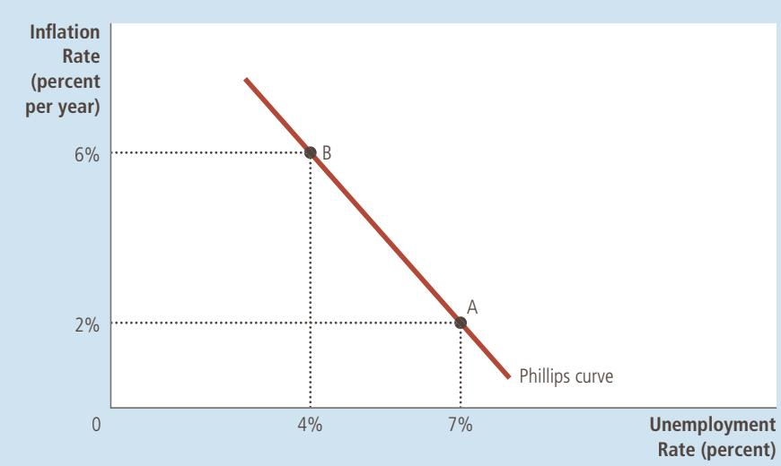

## FIGURE 1

## The Phillips Curve

The Phillips curve illustrates a negative association between the inflation rate and the unemployment rate. At point A, inflation is low and unemployment is high. At point B, inflation is high and unemployment is low.

correlation arose because low unemployment was associated with high aggregate demand, which in turn put upward pressure on wages and prices throughout the economy. Samuelson and Solow dubbed the negative association between inflation and unemployment the Phillips curve. Figure 1 shows an example of a Phillips curve like the one found by Samuelson and Solow.

As the title of their paper suggests, Samuelson and Solow were interested in the Phillips curve because they believed it held important lessons for policymakers. In particular, they suggested that the Phillips curve offers policymakers a menu of possible economic outcomes. By altering monetary and fiscal policy to influence aggregate demand, policymakers could choose any point on this curve. Point A offers high unemployment and low inflation. Point B offers low unemployment and high inflation. Policymakers might prefer both low inflation and low unemployment, but the historical data as summarized by the Phillips curve indicate that this combination is impossible. According to Samuelson and Solow, policymakers face a trade-off between inflation and unemployment, and the Phillips curve illustrates that trade-off.

## 22-1b Aggregate Demand, Aggregate Supply, and the Phillips Curve

The model of aggregate demand and aggregate supply provides an easy explanation for the menu of possible outcomes described by the Phillips curve. The Phillips curve shows the combinations of inflation and unemployment that arise in the short run as shifts in the aggregate-demand curve move the economy along the short-run aggregate-supply curve. As we saw in the preceding two chapters, an increase in the aggregate demand for goods and services leads, in the short run, to a larger output of goods and services and a higher price level. Larger output means greater employment and, thus, a lower rate of unemployment. In addition, a higher price level translates into a higher rate of inflation. Thus, shifts in aggregate demand push inflation and unemployment in opposite directions in the short run—a relationship illustrated by the Phillips curve.

To see more fully how this works, let’s consider an example. To keep the numbers simple, imagine that the price level (as measured, for instance, by the

## FIGURE 2

How the Phillips Curve Is Related to the Model of Aggregate Demand and Aggregate Supply

This figure assumes a price level of 100 for the year 2020 and charts possible outcomes for the year 2021. Panel (a) shows the model of aggregate demand and aggregate supply. If aggregate demand is low, the economy is at point A; output is low (15,000), and the price level is low (102). If aggregate demand is high, the economy is at point B; output is high (16,000), and the price level is high (106). Panel (b) shows the implications for the Phillips curve. Point A, which arises when aggregate demand is low, has high unemployment (7 percent) and low inflation (2 percent). Point B, which arises when aggregate demand is high, has low unemployment (4 percent) and high inflation (6 percent).

(a) The Model of Aggregate Demand and Aggregate Supply  
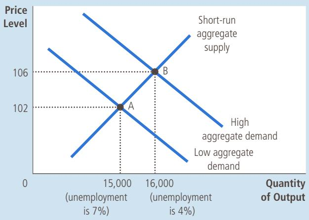

(b) The Phillips Curve  
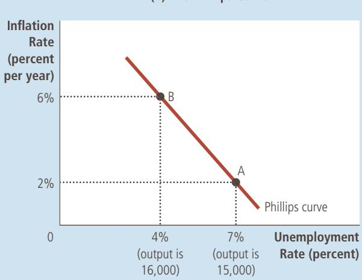

consumer price index) equals 100 in the year 2020. Figure 2 shows two possible outcomes that might occur in the year 2021 depending of the strength of aggregate demand. One outcome occurs if aggregate demand is high, and the other occurs if aggregate demand is low. Panel (a) shows these two outcomes using the model of aggregate demand and aggregate supply. Panel (b) illustrates the same two outcomes using the Phillips curve.

Panel (a) of the figure shows what happens to output and the price level in the year 2021. If the aggregate demand for goods and services is low, the economy experiences outcome A. The economy produces output of 15,000, and the price level is 102. By contrast, if aggregate demand is high, the economy experiences outcome B. Output is 16,000, and the price level is 106. This is an example of a familiar conclusion: Higher aggregate demand moves the economy to an equilibrium with higher output and a higher price level.

Panel (b) shows what these two possible outcomes mean for unemployment and inflation. Because firms need more workers when they produce a greater output of goods and services, unemployment is lower in outcome B than in outcome A. In this example, when output rises from 15,000 to 16,000, unemployment falls from 7 percent to 4 percent. Moreover, because the price level is higher at outcome B than at outcome A, the inflation rate (the percentage change in the price level from the previous year) is also higher. In particular, since the price level was 100 in the year 2020, outcome A has an inflation rate of 2 percent and outcome B has an inflation rate of 6 percent. The two possible outcomes for the economy can be compared either in terms of output and the price level (using the model of aggregate demand and aggregate supply) or in terms of unemployment and inflation (using the Phillips curve).

Because monetary and fiscal policy can shift the aggregate-demand curve, they can move an economy along the Phillips curve. Increases in the money supply, increases in government spending, or cuts in taxes expand aggregate demand and move the economy to a point on the Phillips curve with higher inflation and lower unemployment. Decreases in the money supply, cuts in government spending, or increases in taxes contract aggregate demand and move the economy to a point on the Phillips curve with lower inflation and higher unemployment. In this sense, the Phillips curve offers policymakers a menu of combinations of inflation and unemployment.

Draw the Phillips curve. Use the model of aggregate demand and aggre-QuickQuiz gate supply to show how policy can move the economy from a point on this curve with high inflation to a point with low inflation.

## 22-2 Shifts in the Phillips Curve: The Role of Expectations

Although the Phillips curve seems to offer policymakers a menu of inflation– unemployment outcomes, it raises a crucial question: Does this set of possible choices remain the same over time? In other words, is the downward-sloping Phillips curve a stable relationship on which policymakers can rely? Economists took up this issue in the late 1960s, shortly after Samuelson and Solow had introduced the Phillips curve into the macroeconomic policy debate.

## 22-2a The Long-Run Phillips Curve

In 1968, economist Milton Friedman published a paper in the American Economic Review based on an address he had recently given as president of the American Economic Association. The paper, titled “The Role of Monetary Policy,” contained sections on “What Monetary Policy Can Do” and “What Monetary Policy Cannot Do.” Friedman argued that one thing monetary policy cannot do, other than for a short time, is lower unemployment by raising inflation. At about the same time, another economist, Edmund Phelps, also published a paper denying the existence of a long-run trade-off between inflation and unemployment.

Both Friedman and Phelps based their conclusions on classical principles of macroeconomics. Classical theory points to growth in the money supply as the primary determinant of inflation. But classical theory also states that monetary growth does not affect real variables such as output and employment; it merely alters all prices and nominal incomes proportionately. In particular, monetary growth does not influence those factors that determine the economy’s unemployment rate, such as the market power of unions, the role of efficiency wages, or the process of job search. As a result, Friedman and Phelps concluded that, in the long run, the rate of inflation and the rate of unemployment would not be related.

Here, in his own words, is Friedman’s view about what the Federal Reserve can hope to accomplish for the economy in the long run:

The monetary authority controls nominal quantities—directly, the quantity of its own liabilities [currency plus bank reserves]. In principle, it can use this control to peg a nominal quantity—an exchange rate, the price level, the nominal level of national income, the quantity of money by one denition or another—or to peg the change in a nominal quantity—the rate of ination or deation, the rate of growth or decline in nominal national income, the rate of growth of the quantity of money. It cannot use its control over nominal quantities to peg a real quantity—the real rate of interest, the rate of unemployment, the level of real national income, the real quantity of money, the rate of growth of real national income, or the rate of growth of the real quantity of money.

According to Friedman, monetary policymakers face a long-run Phillips curve that is vertical, as in Figure 3. If the Fed increases the money supply slowly, the inflation rate is low and the economy finds itself at point A. If the Fed increases the money supply quickly, the inflation rate is high and the economy finds itself at point B. In either case, the unemployment rate tends toward its normal level, called the natural rate of unemployment. The vertical long-run Phillips curve illustrates the conclusion that unemployment does not depend on money growth and inflation in the long run.

The vertical long-run Phillips curve is, in essence, one expression of the classical idea of monetary neutrality. Previously, we expressed monetary neutrality with a vertical long-run aggregate-supply curve. Figure 4 shows that the vertical long-run Phillips curve and the vertical long-run aggregate-supply curve are two sides of the same coin. In panel (a) of this figure, an increase in the money supply shifts the aggregate-demand curve to the right from $A D _ { 1 }$ to $A D _ { 2 } .$ As a result of this shift, the long-run equilibrium moves from point A to point B. The price level rises from $P _ { 1 }$ to $P _ { 2 } ,$ but because the aggregate-supply curve is vertical, output remains the same. In panel (b), more rapid growth in the money supply raises the inflation rate by moving the economy from point A to point B. But because the Phillips curve is vertical, the rate of unemployment is the same at these two points. Thus, the vertical long-run aggregate-supply curve and the vertical long-run Phillips curve both imply that monetary policy influences nominal variables (the price level and the inflation rate) but not real variables (output and unemployment). In the long run, regardless of the monetary policy pursued by the Fed, output is at its natural level and unemployment is at its natural rate.

## FIGURE 3

## The Long-Run Phillips Curve

According to Friedman and Phelps, there is no trade-off between inflation and unemployment in the long run. Growth in the money supply determines the inflation rate. Regardless of the inflation rate, the unemployment rate gravitates toward its natural rate. As a result, the long-run Phillips curve is vertical.

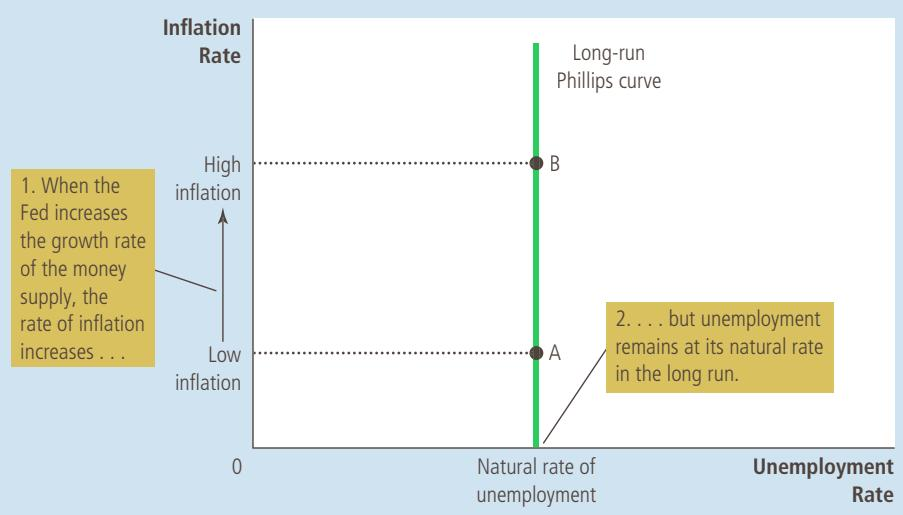

Panel (a) shows the model of aggregate demand and aggregate supply with a vertical aggregate-supply curve. When expansionary monetary policy shifts the aggregatedemand curve to the right from $A D _ { 1 }$ to $A D _ { 2 } ,$ the equilibrium moves from point A to point B. The price level rises from $P _ { 1 }$ to $P _ { 2 } ,$ while output remains the same. Panel (b) shows the long-run Phillips curve, which is vertical at the natural rate of unemployment. In the long run, expansionary monetary policy moves the economy from lower inflation (point A) to higher inflation (point B) without changing the rate of unemployment.

## FIGURE 4

How the Long-Run Phillips Curve Is Related to the Model of Aggregate Demand and Aggregate Supply

(a) The Model of Aggregate Demand and Aggregate Supply  
(b) The Phillips Curve  
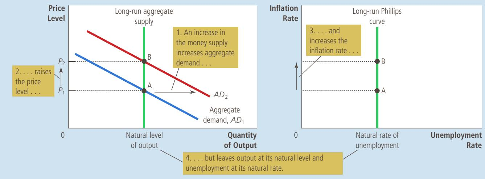

## 22-2b The Meaning of “Natural”

What is so “natural” about the natural rate of unemployment? Friedman and Phelps used this adjective to describe the unemployment rate toward which the economy gravitates in the long run. Yet the natural rate of unemployment is not necessarily the socially desirable rate of unemployment. Nor is the natural rate of unemployment constant over time.

For example, suppose that a newly formed union uses its market power to raise the real wages of some workers above the equilibrium level. The result is an excess supply of workers and, therefore, a higher natural rate of unemployment. This unemployment is natural not because it is good but because it is beyond the influence of monetary policy. More rapid money growth would reduce neither the market power of the union nor the level of unemployment; it would lead only to more inflation.

Although monetary policy cannot influence the natural rate of unemployment, other types of policy can. To reduce the natural rate of unemployment, policymakers should look to policies that improve the functioning of the labor market. Earlier in the book, we discussed how various labor-market policies, such as minimum-wage laws, collective-bargaining laws, unemployment insurance, and job-training programs, affect the natural rate of unemployment. A policy change that reduced the natural rate of unemployment would shift the long-run Phillips curve to the left. In addition, because lower unemployment means more workers are producing goods and services, the quantity of goods and services supplied would be larger at any given price level and the long-run aggregate-supply curve would shift to the right. The economy could then enjoy lower unemployment and higher output for any given rate of money growth and inflation.

## 22-2c Reconciling Theory and Evidence

At first, Friedman and Phelps’s conclusion that there is no long-run trade-off between inflation and unemployment might not seem persuasive. Their argument was based on an appeal to theory, specifically classical theory’s prediction of monetary neutrality. By contrast, the negative correlation between inflation and unemployment documented by Phillips, Samuelson, and Solow was based on actual evidence from the real world. Why should anyone believe that policymakers faced a vertical Phillips curve when the world seemed to offer a downwardsloping one? Shouldn’t the findings of Phillips, Samuelson, and Solow lead us to reject monetary neutrality?

Friedman and Phelps were well aware of these questions, and they offered a way to reconcile classical macroeconomic theory with the finding of a downward-sloping Phillips curve in data from the United Kingdom and the United States. They claimed that a negative relationship between inflation and unemployment exists in the short run but that it cannot be used by policymakers as a menu of outcomes in the long run. Policymakers can pursue expansionary monetary policy to achieve lower unemployment for a while, but eventually, unemployment will return to its natural rate. In the long run, more expansionary monetary policy leads only to higher inflation.

Friedman and Phelps’s work was the basis of our discussion of the difference between the short-run and long-run aggregate-supply curves in Chapter 20. As you may recall, the long-run aggregate-supply curve is vertical, indicating that the price level does not influence quantity supplied in the long run. But the short-run aggregate-supply curve slopes upward, indicating that an increase in the price level raises the quantity of goods and services that firms supply. According to the sticky-wage theory of aggregate supply, for instance, nominal wages are set in advance based on the price level that workers and firms expected to prevail. When prices are higher than expected, firms have an incentive to increase production and employment; when prices are lower than expected, firms reduce production and employment. Yet because the expected price level and nominal wages will eventually adjust, the positive relationship between the actual price level and quantity supplied exists only in the short run.

Friedman and Phelps applied this same logic to the Phillips curve. Just as the aggregate-supply curve slopes upward only in the short run, the trade-off between inflation and unemployment holds only in the short run. And just as the long-run aggregate-supply curve is vertical, the long-run Phillips curve is also vertical. Once again, expectations are the key for understanding how the short run and the long run are related.

Friedman and Phelps introduced a new variable into the analysis of the inflation–unemployment trade-off: expected inflation. Expected inflation measures how much people expect the overall price level to change. Because the expected price level affects nominal wages, expected inflation is one factor that determines the position of the short-run aggregate-supply curve. In the short run, the Fed can take expected inflation (and, thus, the short-run aggregate-supply curve) as already determined. When the money supply changes, the aggregate-demand curve shifts and the economy moves along a given short-run aggregate-supply curve. In the short run, therefore, monetary changes lead to unexpected fluctuations in output, prices, unemployment, and inflation. In this way, Friedman and

Phelps explained the downward-sloping Phillips curve that Phillips, Samuelson, and Solow had documented.

The Fed’s ability to create unexpected inflation by increasing the money supply exists only in the short run. In the long run, people come to expect whatever inflation rate the Fed chooses to produce and nominal wages will adjust to keep pace with inflation. As a result, the long-run aggregate-supply curve is vertical. Changes in aggregate demand, such as those due to changes in the money supply, affect neither the economy’s output of goods and services nor the number of workers that firms need to hire to produce those goods and services. Friedman and Phelps concluded that unemployment returns to its natural rate in the long run.

## 22-2d The Short-Run Phillips Curve

The analysis of Friedman and Phelps can be summarized by the following equation:

$$
\begin{array}{l} \text {Unemployment} \\ \text {rate} \end{array} = \begin{array}{l} \text {Natural rate of} \\ \text {unemployment} \end{array} - a \left( \begin{array}{c} \text {Actual} \\ \text {inflation} \end{array} - \begin{array}{c} \text {Expected} \\ \text {inflation} \end{array} \right)
$$

This equation (which is, in essence, another expression of the aggregate-supply equation we have seen previously) relates the unemployment rate to the natural rate of unemployment, actual inflation, and expected inflation. In the short run, expected inflation is given, so higher actual inflation is associated with lower unemployment. (The variable a is a parameter that measures how much unemployment responds to unexpected inflation.) In the long run, people come to expect whatever inflation the Fed produces, so actual inflation equals expected inflation, and unemployment is at its natural rate.

This equation implies there can be no stable short-run Phillips curve. Each short-run Phillips curve reflects a particular expected rate of inflation. (To be precise, if you graph the equation, you’ll find that the downward-sloping short-run Phillips curve intersects the vertical long-run Phillips curve at the expected rate of inflation.) When expected inflation changes, the short-run Phillips curve shifts.

According to Friedman and Phelps, it is dangerous to view the Phillips curve as a menu of options available to policymakers. To see why, imagine an economy that starts with low inflation, with an equally low rate of expected inflation, and with unemployment at its natural rate. In Figure 5, the economy is at point A. Now suppose that policymakers try to take advantage of the trade-off between inflation and unemployment by using monetary or fiscal policy to expand aggregate demand. In the short run, when expected inflation is given, the economy goes from point A to point B. Unemployment falls below its natural rate, and the actual inflation rate rises above expected inflation. As the economy moves from point A to point B, policymakers might think they have achieved permanently lower unemployment at the cost of higher inflation—a bargain that, if possible, might be worth making.

This situation, however, will not persist. Over time, people get used to this higher inflation rate, and they raise their expectations of inflation. When expected inflation rises, firms and workers start taking higher inflation into account when setting wages and prices. The short-run Phillips curve then shifts to the right, as shown in the figure. The economy ends up at point C, with higher inflation than at point A but with the same level of unemployment. Thus, Friedman and Phelps concluded that policymakers face only a temporary trade-off between inflation

## FIGURE 5

## How Expected Inflation Shifts the Short-Run Phillips Curve

The higher the expected rate of inflation, the higher the curve representing the short-run trade-off between inflation and unemployment. At point A, expected inflation and actual inflation are equal at a low rate and unemployment is at its natural rate. If the Fed pursues an expansionary monetary policy, the economy moves from point A to point B in the short run. At point B, expected inflation is still low, but actual inflation is high. Unemployment is below its natural rate. In the long run, expected inflation rises, and the economy moves to point C. At point C, expected inflation and actual inflation are both high, and unemployment is back to its natural rate.

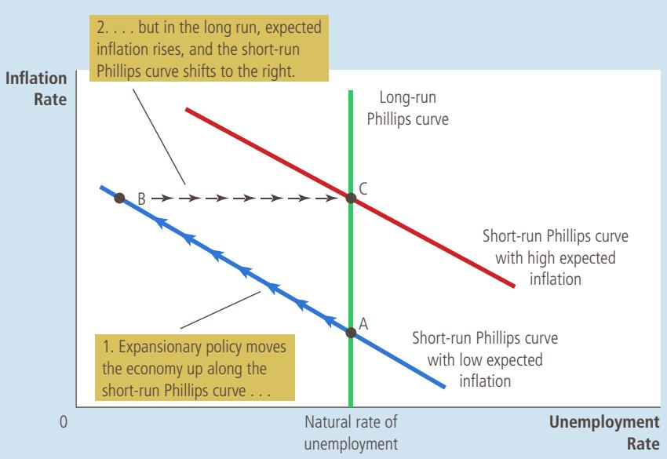

and unemployment. In the long run, expanding aggregate demand more rapidly will yield higher inflation without any reduction in unemployment.

## 22-2e The Natural Experiment for the Natural-Rate Hypothesis

natural-rate hypothesis the claim that unemployment eventually returns to its normal, or natural, rate, regardless of the rate of inflation

Friedman and Phelps had made a bold prediction in 1968: If policymakers try to take advantage of the Phillips curve by choosing higher inflation to reduce unemployment, they will succeed at reducing unemployment only temporarily. This view—that unemployment eventually returns to its natural rate, regardless of the rate of inflation—is called the natural-rate hypothesis. A few years after Friedman and Phelps proposed this hypothesis, monetary and fiscal policymakers inadvertently created a natural experiment to test it. Their laboratory was the U.S. economy.

Before we examine the outcome of this test, however, let’s look at the data that Friedman and Phelps had when they made their prediction in 1968. Figure 6 shows the unemployment and inflation rates for the period from 1961 to 1968. These data trace out an almost perfect Phillips curve. As inflation rose over these 8 years, unemployment fell. The economic data from this era seemed to confirm that policymakers faced a trade-off between inflation and unemployment.

The apparent success of the Phillips curve in the 1960s made the prediction of Friedman and Phelps all the bolder. In 1958, Phillips had suggested a negative association between inflation and unemployment. In 1960, Samuelson and Solow had shown that it existed in U.S. data. Another decade of data had confirmed the relationship. To some economists at the time, it seemed ridiculous to claim that the historically reliable Phillips curve would start shifting once policymakers tried to take advantage of it.

In fact, that is exactly what happened. Beginning in the late 1960s, the government followed policies that expanded the aggregate demand for goods and services. In part, this expansion was due to fiscal policy: Government spending rose as the Vietnam War heated up. In part, it was due to monetary policy: Because the

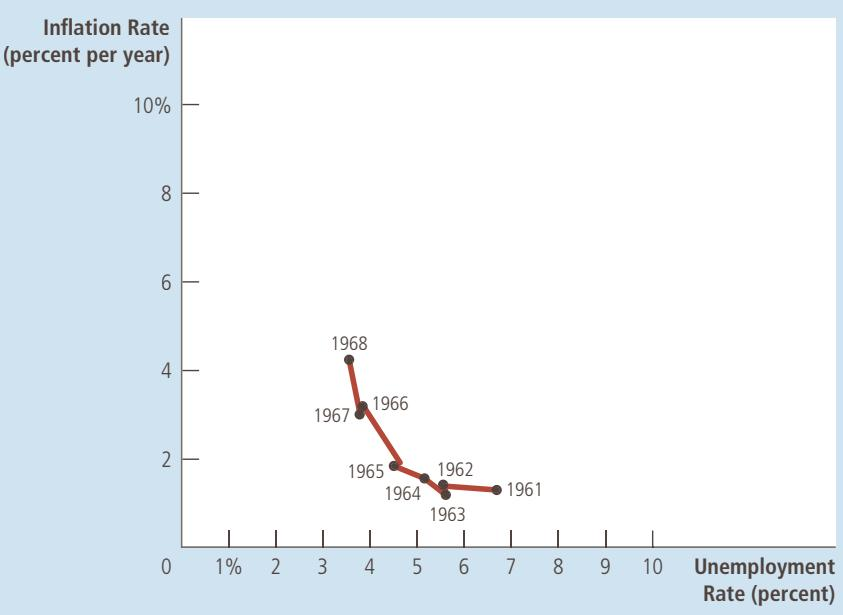

## FIGURE 6

## The Phillips Curve in the 1960s

This figure uses annual data from 1961 to 1968 on the unemployment rate and on the inflation rate (as measured by the GDP deflator) to show the negative relationship between inflation and unemployment.

S o u r c e : U.S. Department of Labor; U.S. Department of Commerce.

Fed was trying to hold down interest rates in the face of expansionary fiscal policy, the money supply (as measured by M2) rose about 13 percent per year during the period from 1970 to 1972, compared to 7 percent per year in the early 1960s. As a result, inflation stayed high (about 5 to 6 percent per year in the late 1960s and early 1970s, compared to about 1 to 2 percent per year in the early 1960s). But as Friedman and Phelps had predicted, unemployment did not stay low.

Figure 7 displays the history of inflation and unemployment from 1961 to 1973. It shows that the simple negative relationship between these two variables started to break down around 1970. In particular, as inflation remained high in the early 1970s, people’s expectations of inflation caught up with reality, and the unemployment rate reverted to the 5 percent to 6 percent range that had prevailed in the early 1960s. Notice that the history illustrated in Figure 7 resembles the theory of a shifting short-run Phillips curve shown in Figure 5. By 1973, policymakers had learned that Friedman and Phelps were right: There is no trade-off between inflation and unemployment in the long run.

QuickQuiz

Draw the short-run Phillips curve and the long-run Phillips curve. Explain why they are different.

## 22-3 Shifts in the Phillips Curve: The Role of Supply Shocks

Friedman and Phelps had suggested in 1968 that changes in expected inflation shift the short-run Phillips curve, and the experience of the early 1970s convinced most economists that Friedman and Phelps were right. Within a few years, however, the economics profession would turn its attention to a different source of shifts in the short-run Phillips curve: shocks to aggregate supply.

This time, the change in focus came not from two American economics professors but from a group of Arab sheiks. In 1974, the Organization of Petroleum

## FIGURE 7

## The Breakdown of the Phillips Curve

This figure shows annual data from 1961 to 1973 on the unemployment rate and on the inflation rate (as measured by the GDP deflator). The Phillips curve of the 1960s breaks down in the early 1970s, just as Friedman and Phelps had predicted. Notice that the points labeled A, B, and C in this figure correspond roughly to the points in Figure 5.

S o u r c e : U.S. Department of Labor; U.S. Department of Commerce.

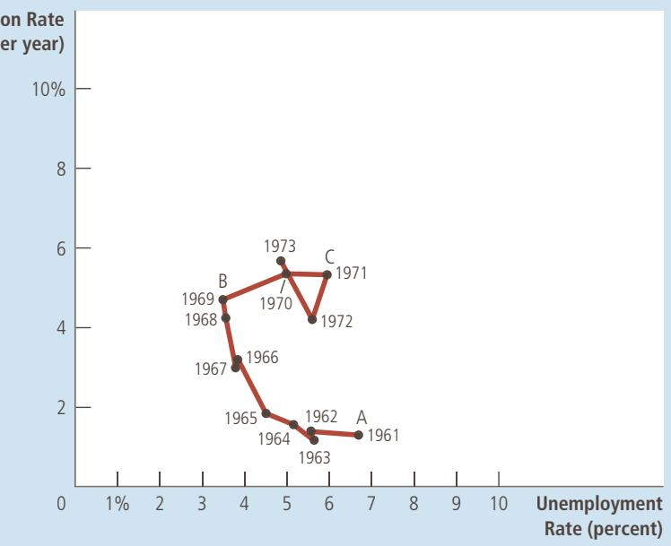

Exporting Countries (OPEC) began to exert its market power as a cartel in the world oil market to increase its members’ profits. The countries of OPEC, including Saudi Arabia, Kuwait, and Iraq, restricted the amount of crude oil they pumped and sold on world markets. Within a few years, this reduction in supply caused the world price of oil to almost double.

supply shock an event that directly alters firms’ costs and prices, shifting the economy’s aggregate-supply curve and thus the Phillips curve

A large increase in the world price of oil is an example of a supply shock. A supply shock is an event that directly affects firms’ costs of production and thus the prices they charge; it shifts the economy’s aggregate-supply curve and, as a result, the Phillips curve. For example, when an oil price increase raises the cost of producing gasoline, heating oil, tires, and many other products, it reduces the quantity of goods and services supplied at any given price level. As panel (a) of Figure 8 shows, this reduction in supply is represented by the leftward shift in the aggregate-supply curve from $A S _ { 1 }$ to $A S _ { 2 }$ . Output falls from $Y _ { 1 }$ to $Y _ { 2 } ,$ and the price level rises from $P _ { 1 }$ to $P _ { 2 } .$ The economy experiences stagflation—the combination of falling output (stagnation) and rising prices (inflation).

This shift in aggregate supply is associated with a similar shift in the shortrun Phillips curve, shown in panel (b). Because firms need fewer workers to produce the smaller output, employment falls and unemployment rises. Because the price level is higher, the inflation rate—the percentage change in the price level from the previous year—is also higher. Thus, the shift in aggregate supply leads to higher unemployment and higher inflation. The short-run trade-off between inflation and unemployment shifts to the right from $P C _ { \mathrm { 1 } }$ to $P C _ { 2 }$

Confronted with an adverse shift in aggregate supply, policymakers face a difficult choice between fighting inflation and fighting unemployment. If they contract aggregate demand to fight inflation, they will raise unemployment further. If they expand aggregate demand to fight unemployment, they will raise inflation further. In other words, policymakers face a less favorable trade-off between inflation and unemployment than they did before the shift in aggregate supply: They

Panel (a) shows the model of aggregate demand and aggregate supply. When the aggregate-supply curve shifts to the left from $A S _ { 1 }$ to $A S _ { 2 }$ the equilibrium moves from point A to point B. Output falls from $Y _ { 1 }$ to $Y _ { 2 } ,$ and the price level rises from $P _ { 1 }$ to $P _ { 2 } .$ Panel (b) shows the short-run trade-off between inflation and unemployment. The adverse shift in aggregate supply moves the economy from a point with lower unemployment and lower inflation (point A) to a point with higher unemployment and higher inflation (point B). The shortrun Phillips curve shifts to the right from $P C _ { 1 }$ to $P C _ { 2 } .$ . Policymakers now face a worse set of options for inflation and unemployment.

An Adverse Shock to Aggregate Supply

(a) The Model of Aggregate Demand and Aggregate Supply  
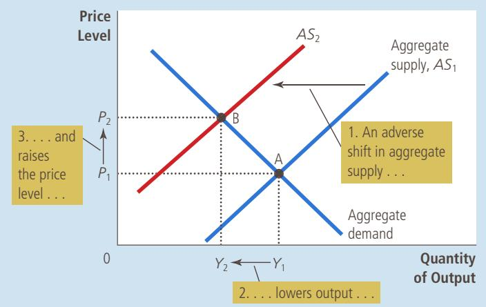

(b) The Phillips Curve  
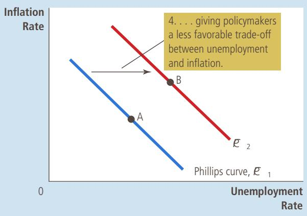

have to live with a higher rate of inflation for a given rate of unemployment, a higher rate of unemployment for a given rate of inflation, or some combination of higher unemployment and higher inflation.

Faced with such an adverse shift in the Phillips curve, policymakers will ask whether the shift is temporary or permanent. The answer depends on how people adjust their expectations of inflation. If people view the rise in inflation due to the supply shock as a temporary aberration, expected inflation will not change and the Phillips curve will soon revert to its former position. But if people believe the shock will lead to a new era of higher inflation, then expected inflation will rise and the Phillips curve will remain at its new, less desirable position.

In the United States during the 1970s, expected inflation did rise substantially. This rise in expected inflation was partly attributable to the Fed’s decision to accommodate the supply shock with higher money growth. (Recall that policymakers are said to accommodate an adverse supply shock when they respond to it by increasing aggregate demand in an effort to keep output from falling.) Because of this policy decision, the recession that resulted from the supply shock was smaller than it otherwise might have been, but the U.S. economy faced an unfavorable trade-off between inflation and unemployment for many years. The problem was compounded in 1979 when OPEC once again started to exert its market power, more than doubling the price of oil. Figure 9 shows inflation and unemployment in the U.S. economy during this period.

In 1980, after two OPEC supply shocks, the U.S. economy had an inflation rate of more than 9 percent and an unemployment rate of about 7 percent. This combination of inflation and unemployment was not at all near the trade-off that seemed possible in the 1960s. (In the 1960s, the Phillips curve suggested that an unemployment rate of 7 percent would be associated with an inflation rate of only 1 percent. Inflation of more than 9 percent was unthinkable.) With the misery index in 1980 near a historic high, the public was widely dissatisfied with the performance of the economy. Largely because of this dissatisfaction, President Jimmy Carter lost his bid for reelection in November 1980 and was replaced by Ronald Reagan. Something had to be done, and soon it would be.

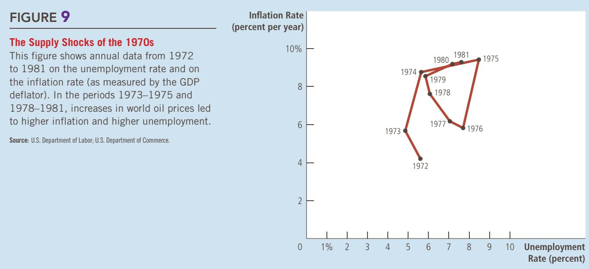

Give an example of a favorable shock to aggregate supply. Use the model QuickQuiz of aggregate demand and aggregate supply to explain the effects of such a shock. How does it affect the Phillips curve?

## 22-4 The Cost of Reducing Inflation

In October 1979, as OPEC was imposing adverse supply shocks on the world’s economies for the second time in a decade, Fed Chairman Paul Volcker decided that the time for action had come. Volcker had been appointed chairman by President Carter only two months earlier, and he had taken the job knowing that inflation had reached unacceptable levels. As guardian of the nation’s monetary system, he felt he had little choice but to pursue a policy of disinflation. Disinflation is a reduction in the rate of inflation, and it should not be confused with deflation, a reduction in the price level. To draw an analogy to a car’s motion, disinflation is like slowing down, whereas deflation is like going in reverse. Chairman Volcker, along with many other Americans, wanted the economy’s rising level of prices to slow down.

Volcker had no doubt that the Fed could reduce inflation through its ability to control the quantity of money. But what would be the short-run cost of disinflation? The answer to this question was much less certain.

## 22-4a The Sacrifice Ratio

To reduce the inflation rate, the Fed has to pursue contractionary monetary policy. Figure 10 shows some of the effects of such a decision. When the Fed slows the rate at which the money supply is growing, it contracts aggregate demand. The fall in aggregate demand, in turn, reduces the quantity of goods and services that firms produce, and this fall in production leads to a rise in unemployment. The economy begins at point A in the figure and moves along the short-run Phillips curve to point B, which has lower inflation and higher unemployment. Over time, as people come to understand that prices are rising more slowly, expected inflation falls, and the short-run Phillips curve shifts downward. The economy moves from point B to point C. Inflation is lower than it was initially at point A, and unemployment is back at its natural rate.

Thus, if a nation wants to reduce inflation, it must endure a period of high unemployment and low output. In Figure 10, this cost is represented by the movement of the economy through point B as it travels from point A to point C. The size of this cost depends on the slope of the Phillips curve and how quickly expectations of inflation adjust to the new monetary policy.

Many studies have examined the data on inflation and unemployment to estimate the cost of reducing inflation. The findings of these studies are often summarized in a statistic called the sacrifice ratio. The sacrifice ratio is the number of percentage points of annual output lost in the process of reducing inflation by 1 percentage point. A typical estimate of the sacrifice ratio is 5. That is, for each percentage point that inflation is reduced, 5 percent of annual output must be sacrificed in the transition.

Such estimates surely must have made Paul Volcker apprehensive as he confronted the task of reducing inflation. Inflation was running at almost 10 percent per year. To reach moderate inflation of, say, 4 percent per year would mean reducing inflation by 6 percentage points. If each percentage point costs 5 percent

sacrifice ratio the number of percentage points of annual output lost in the process of reducing inflation by 1 percentage point

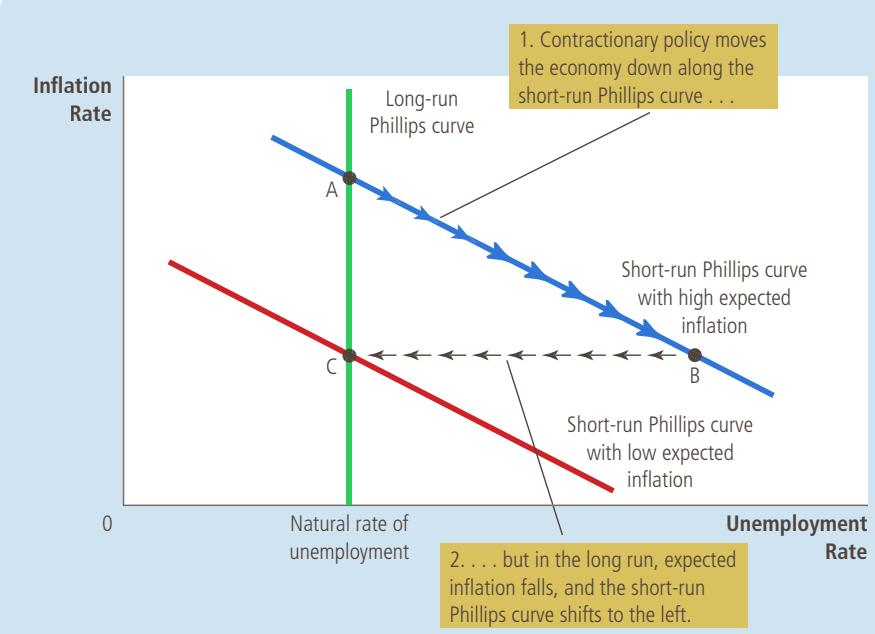

## FIGURE 10

## Disinflationary Monetary Policy in the Short Run and Long Run

When the Fed pursues contractionary monetary policy to reduce inflation, the economy moves along a short-run Phillips curve from point A to point B. Over time, expected inflation falls, and the short-run Phillips curve shifts downward. When the economy reaches point C, unemployment is back at its natural rate.

of the economy’s annual output, then reducing inflation by 6 percentage points would require sacrificing 30 percent of annual output.

According to studies of the Phillips curve and the cost of disinflation, this sacrifice could be paid in various ways. An immediate reduction in inflation would depress output by 30 percent for a single year, but that outcome was surely too harsh even for an inflation hawk like Paul Volcker. It would be better, many argued, to spread out the cost over several years. If the reduction in inflation took place over 5 years, for instance, then output would have to average only 6 percent below trend during that period to add up to a sacrifice of 30 percent. An even more gradual approach would be to reduce inflation slowly over a decade so that output would have to be only 3 percent below trend. Whatever path was chosen, however, it seemed that reducing inflation would not be easy.

## 22-4b Rational Expectations and the Possibility of Costless Disinflation

rational expectations the theory that people optimally use all the information they have, including information about government policies, when forecasting the future

Just as Paul Volcker was pondering how costly reducing inflation might be, a group of economics professors was leading an intellectual revolution that would challenge the conventional wisdom on the sacrifice ratio. This group included such prominent economists as Robert Lucas, Thomas Sargent, and Robert Barro. Their revolution was based on a new approach to economic theory and policy called rational expectations. According to the theory of rational expectations, people optimally use all the information they have, including information about government policies, when forecasting the future.

This new approach has had profound implications for many areas of macroeconomics, but none is more important than its application to the trade-off between inflation and unemployment. As Friedman and Phelps had first emphasized, expected inflation is an important variable that explains why there is a trade-off between inflation and unemployment in the short run but not in the long run. How quickly the short-run trade-off disappears depends on how quickly people adjust their expectations of inflation. Proponents of rational expectations expanded upon the Friedman-Phelps analysis to argue that when economic policies change, people adjust their expectations of inflation accordingly. The studies of inflation and unemployment that had tried to estimate the sacrifice ratio had failed to take account of the direct effect of the policy regime on expectations. As a result, estimates of the sacrifice ratio were, according to the rational-expectations theorists, unreliable guides for policy.

In a 1981 paper titled “The End of Four Big Inflations,” Thomas Sargent described this new view as follows:

An alternative “rational expectations” view denies that there is any inherent momentum to the present process of ination. This view maintains that rms and workers have now come to expect high rates of ination in the future and that they strike inationary bargains in light of these expectations. However, it is held that people expect high rates of ination in the future precisely because the government’s current and prospective monetary and scal policies warrant those expectations. . . . An implication of this view is that ination can be stopped much more quickly than advocates of the “momentum” view have indicated and that their estimates of the length of time and the costs of stopping ination in terms of forgone output are erroneous. . . . This is not to say that it would be easy to eradicate ination. On the contrary, it would require more than a few temporary restrictive scal and monetary actions. It would require a change in the policy regime. . . . How costly such a move would be in terms of forgone output and how long it would be in taking effect would depend partly on how resolute and evident the government’s commitment was.

According to Sargent, the sacrifice ratio could be much smaller than suggested by previous estimates. Indeed, in the most extreme case, it could be zero: If the government made a credible commitment to a policy of low inflation, people would be rational enough to lower their expectations of inflation immediately. The short-run Phillips curve would shift downward, and the economy would reach low inflation quickly without the cost of temporarily high unemployment and low output.

## 22-4c The Volcker Disinflation

As we have seen, when Paul Volcker faced the prospect of reducing inflation from its peak of about 10 percent, the economics profession offered two conflicting predictions. One group of economists offered estimates of the sacrifice ratio and concluded that reducing inflation would have great cost in terms of lost output and high unemployment. Another group offered the theory of rational expectations and concluded that reducing inflation could be much less costly and, perhaps, could even have no cost at all. Who was right?

Figure 11 shows inflation and unemployment from 1979 to 1987. As you can see, Volcker did succeed at reducing inflation. Inflation came down from almost 10 percent in 1981 and 1982 to about 4 percent in 1983 and 1984. Credit for this reduction in inflation goes completely to monetary policy. Fiscal policy at this time was acting in the opposite direction: The increases in the budget deficit during the Reagan administration were expanding aggregate demand, which tends to raise inflation. The fall in inflation from 1981 to 1984 is attributable to the tough antiinflation policies of Fed Chairman Paul Volcker.

The figure shows that the Volcker disinflation did come at the cost of high unemployment. In 1982 and 1983, the unemployment rate was about 10 percent— about 4 percentage points above its level when Paul Volcker was appointed Fed

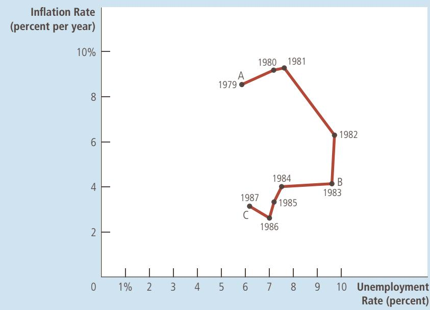

## FIGURE 11
