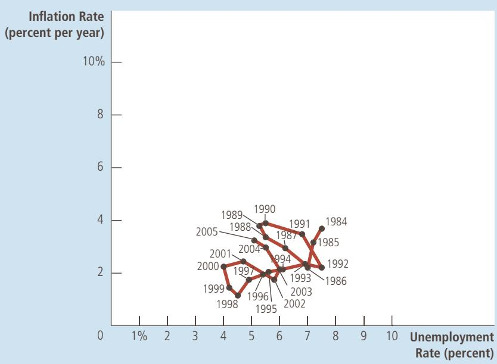
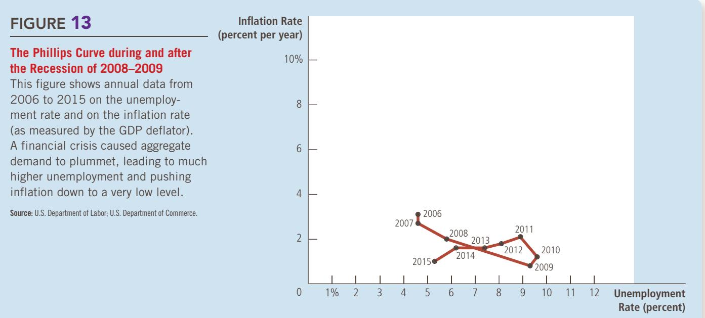
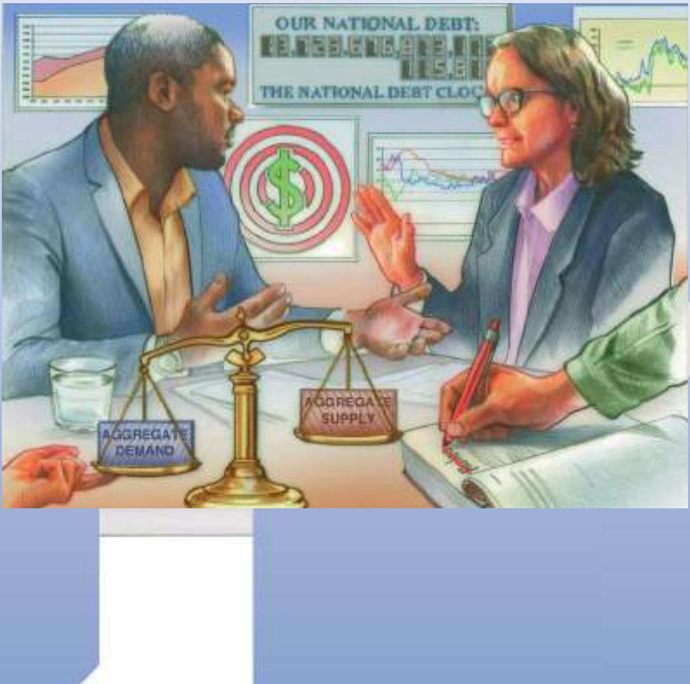

## The Volcker Disinflation

This figure shows annual data from 1979 to 1987 on the unemployment rate and on the inflation rate (as measured by the GDP deflator). The reduction in inflation during this period came at the cost of very high unemployment in 1982 and 1983. Note that the points labeled A, B, and C in this figure correspond roughly to the points in Figure 10.

S o u r c e : U.S. Department of Labor; U.S. Department of Commerce.

chairman. At the same time, the production of goods and services as measured by real GDP was well below its trend level. The Volcker disinflation produced a recession that was, at the time, the deepest the United States had experienced since the Great Depression of the 1930s.

Does this episode refute the possibility of costless disinflation as suggested by the rational-expectations theorists? Some economists have argued that the answer to this question is a resounding yes. Indeed, the pattern of disinflation shown in Figure 11 is similar to the pattern predicted in Figure 10. To make the transition from high inflation (point A in both figures) to low inflation (point C), the economy had to experience a painful period of high unemployment (point B).

Yet there are two reasons not to reject the conclusions of the rational-expectations theorists so quickly. First, even though the Volcker disinflation did impose a cost of temporarily high unemployment, the cost was not as large as many economists had predicted. Most estimates of the sacrifice ratio based on the Volcker disinflation are smaller than estimates that had been obtained from previous data. Perhaps Volcker’s tough stand on inflation did have some direct effect on expectations, as the rational-expectations theorists claimed.

Second, and more important, even though Volcker announced that he would aim monetary policy to lower inflation, much of the public did not believe him. Because few people thought Volcker would reduce inflation as quickly as he did, expected inflation did not fall immediately; as a result, the short-run Phillips curve did not shift down as quickly as it might have. Some evidence for this hypothesis comes from the forecasts made by commercial forecasting firms: Their forecasts of inflation fell more slowly in the 1980s than did actual inflation. Thus, the Volcker disinflation does not necessarily refute the rational-expectations view that credible disinflation can be costless. It does show, however, that policymakers cannot count on people to immediately believe them when they announce a policy of disinflation.

## 22-4d The Greenspan Era

Since the OPEC inflation of the 1970s and the Volcker disinflation of the 1980s, the U.S. economy has experienced relatively mild fluctuations in inflation and unemployment. Figure 12 shows inflation and unemployment from 1984 to 2005. This period is called the Greenspan era, after Alan Greenspan who in 1987 followed Paul Volcker as chairman of the Federal Reserve.

This period began with a favorable supply shock. In 1986, OPEC members started arguing over production levels, and their long-standing agreement to restrict supply broke down. Oil prices fell by about half. As the figure shows, this favorable supply shock led to falling inflation and falling unemployment from 1984 to 1986.

Throughout the Greenspan era, the Fed was careful to avoid repeating the policy mistakes of the 1960s, when excessive aggregate demand pushed unemployment below the natural rate and raised inflation. When unemployment fell and inflation rose in 1989 and 1990, the Fed raised interest rates and contracted aggregate demand, leading to a small recession in 1991 and 1992. Unemployment then rose above most estimates of the natural rate, and inflation fell once again.

The rest of the 1990s witnessed a period of economic prosperity. Inflation gradually drifted downward, approaching zero by the end of the decade. Unemployment also drifted downward, leading many observers to believe that the natural rate of unemployment had fallen. Part of the credit for this good economic performance goes to Alan Greenspan and his colleagues at the Fed, for low inflation can be achieved only with prudent monetary policy. But good luck in the form of favorable supply shocks is also part of the story.

## FIGURE 12

## The Greenspan Era

This figure shows annual data from 1984 to 2005 on the unemployment rate and on the inflation rate (as measured by the GDP deflator). During most of this period, Alan Greenspan was chairman of the Federal Reserve. Fluctuations in inflation and unemployment were relatively small.

S o u r c e : U.S. Department of Labor; U.S. Department of Commerce.

In 2001, however, the economy ran into problems. The end of the dot-com stock market bubble, the 9/11 terrorist attacks, and corporate accounting scandals all depressed aggregate demand. Unemployment rose as the economy experienced its first recession in a decade. But a combination of expansionary monetary and fiscal policies helped end the downturn, and by early 2005, unemployment was close to most estimates of the natural rate.

In 2005, President Bush nominated Ben Bernanke to follow Alan Greenspan as the chairman of the Fed. Bernanke was sworn in on February 1, 2006. In 2009, Bernanke was reappointed by President Obama. At the time of his initial nomination, Bernanke said, “My first priority will be to maintain continuity with the policies and policy strategies established during the Greenspan years.”

## 22-4e A Financial Crisis Takes Us for a Ride along the Phillips Curve

Ben Bernanke may have hoped to continue the policies of the Greenspan era and to enjoy the relative calm of those years, but his wishes would not be fulfilled. During his first few years on the job, the new Fed chairman faced some significant and daunting economic challenges.

As we have seen in previous chapters, the main challenge arose from problems in the housing market and financial system. From 1995 to 2006, the U.S. housing market boomed and average U.S. house prices more than doubled. But this housing boom proved unsustainable, and from 2006 to 2009 house prices fell by about one-third. This large fall led to declines in household wealth and difficulties for many financial institutions that had bet (through the purchase of mortgage-backed securities) that house prices would continue to rise. The resulting financial crisis resulted in a large decline in aggregate demand and a steep increase in unemployment.

We have already looked at the story of the crisis and the policy responses to it in previous chapters, but Figure 13 shows what these events meant for inflation and unemployment. From 2007 to 2010, as the decline in aggregate demand raised unemployment from below 5 percent to about 10 percent, it also reduced the rate of inflation from about 3 percent to about 1 percent. In essence, the economy rode down the short-run Phillips curve.

From 2010 to 2015, the economy slowly recovered. Unemployment fell back to about 5 percent, while the rate of inflation remained between 1 and 2 percent. One notable feature of this period is that the very low inflation of 2009 and 2010 does not appear to have substantially reduced expected inflation and shifted the short-run Phillips curve downward. Instead, expected inflation appears to have remained steady at about 2 percent, which kept the short-run Phillips curve relatively stable. A common explanation for this phenomenon is that the Federal Reserve had, over the previous 20 years, established a lot of credibility in its commitment to keep inflation at about 2 percent. As a result, expected inflation and the position of the short-run Phillips curve reacted less to the dramatic short-run events.

What is the sacrifice ratio? How might the credibility of the Fed’s commitment to reduce inflation affect the sacrifice ratio?

## 22-5 Conclusion

This chapter has examined how economists’ thinking about inflation and unemployment has evolved. We have discussed the ideas of many of the best economists of the 20th century: from the Phillips curve of Phillips, Samuelson, and Solow, to the natural-rate hypothesis of Friedman and Phelps, to the rationalexpectations theory of Lucas, Sargent, and Barro. Six members of this group won Nobel Prizes for their work in economics.

Although the trade-off between inflation and unemployment has generated much intellectual turmoil, certain principles have developed that command consensus. Here is how Milton Friedman expressed the relationship between inflation and unemployment in 1968:

There is always a temporary tradeoff between ination and unemployment; there is no permanent tradeoff. The temporary tradeoff comes not from ination per se, but from unanticipated ination, which generally means, from a rising rate of ination. The widespread belief that there is a permanent tradeoff is a sophisticated version of the confusion between “high” and “rising” that we all recognize in simpler forms. A rising rate of ination may reduce unemployment, a high rate will not.

But how long, you will say, is “temporary”? . . . I can at most venture a personal judgment, based on some examination of the historical evidence, that the initial effects of a higher and unanticipated rate of ination last for something like two to ve years.

Today, about a half century later, this statement still summarizes the view of most macroeconomists.

## CHAPTER QuickQuiz

1. When the Federal Reserve increases the money supply and expands aggregate demand, it moves the economy along the Phillips curve to a point with inflation and unemployment. a. higher, higher b. higher, lower c. lower, higher d. lower, lower

2. If the Federal Reserve increases the rate of money growth and maintains it at the new higher rate, eventually expected inflation will and the short-run Phillips curve will shift a. decrease, downward b. decrease, upward c. increase, downward d. increase, upward

3. When an adverse supply shock shifts the short-run aggregate-supply curve to the left, it also

a. moves the economy along the short-run Phillips curve to a point with higher inflation and lower unemployment.

b. moves the economy along the short-run Phillips curve to a point with lower inflation and higher unemployment.

c. shifts the short-run Phillips curve to the right.

d. shifts the short-run Phillips curve to the left.

4. Advocates of the theory of rational expectations believe that

a. the sacrifice ratio can be much smaller if policymakers make a credible commitment to low inflation.

b. if disinflation catches people by surprise, it will have minimal impact on unemployment.

c. wage and price setters never expect the central bank to follow through on its announcements.

d. expected inflation depends on the rates of inflation that people have recently observed.

5. From one year to the next, inflation falls from 5 to 4 percent, while unemployment rises from 6 to 7 percent. Which of the following events could be responsible for this change?

a. The central bank increases the growth rate of the money supply.

b. The government cuts spending and raises taxes to reduce the budget deficit.

c. Newly discovered oil reserves cause world oil prices to plummet.

d. The appointment of a new Fed chair increases expected inflation.

6. From one year to the next, inflation rises from 4 to 5 percent, while unemployment rises from 6 to 7 percent. Which of the following events could be responsible for this change?

a. The central bank increases the growth rate of the money supply.

b. The government cuts spending and raises taxes to reduce the budget deficit.

c. Newly discovered oil reserves cause world oil prices to plummet.

d. The appointment of a new Fed chair increases expected inflation.

## SUMMARY

The Phillips curve describes a negative relationship between inflation and unemployment. By expanding aggregate demand, policymakers can choose a point on the Phillips curve with higher inflation and lower unemployment. By contracting aggregate demand, policymakers can choose a point on the Phillips curve with lower inflation and higher unemployment.

The trade-off between inflation and unemployment described by the Phillips curve holds only in the short run. In the long run, expected inflation adjusts to changes in actual inflation, and the short-run Phillips curve shifts. As a result, the long-run Phillips curve is vertical at the natural rate of unemployment.

The short-run Phillips curve also shifts because of shocks to aggregate supply. An adverse supply shock, such as an increase in world oil prices, gives policymakers a less favorable trade-off between inflation and unemployment. That is, after an adverse supply shock, policymakers have to accept a higher rate of inflation for any given rate of unemployment or a higher rate of unemployment for any given rate of inflation.

When the Fed contracts growth in the money supply to reduce inflation, it moves the economy along the short-run Phillips curve, which results in temporarily high unemployment. The cost of disinflation depends on how quickly expectations of inflation fall. Some economists argue that a credible commitment to low inflation can reduce the cost of disinflation by inducing a quick adjustment of expectations.

## KEY CONCEPTS

Phillips curve, p. 480

natural-rate hypothesis, p. 488

supply shock, p. 490 sacrifice ratio, p. 493 rational expectations, p. 494

## QUESTIONS FOR REVIEW

1. Draw the short-run trade-off between inflation and unemployment. How might the Fed move the economy from one point on this curve to another?

2. Draw the long-run trade-off between inflation and unemployment. Explain how the short-run and long-run trade-offs are related.

3. What is “natural” about the natural rate of unemployment? Why might the natural rate of unemployment differ across countries?

## PROBLEMS AND APPLICATIONS

1. Suppose the natural rate of unemployment is 6 percent. On one graph, draw two Phillips curves that describe the four situations listed here. Label the point that shows the position of the economy in each case.

a. Actual inflation is 5 percent, and expected inflation is 3 percent.

b. Actual inflation is 3 percent, and expected inflation is 5 percent.

c. Actual inflation is 5 percent, and expected inflation is 5 percent.

d. Actual inflation is 3 percent, and expected inflation is 3 percent.

4. Suppose a drought destroys farm crops and drives up the price of food. What is the effect on the short-run trade-off between inflation and unemployment?

5. The Fed decides to reduce inflation. Use the Phillips curve to show the short-run and long-run effects of this policy. How might the short-run costs be reduced?

2. Illustrate the effects of the following developments on both the short-run and long-run Phillips curves. Give the economic reasoning underlying your answers.

a. a rise in the natural rate of unemployment

b. a decline in the price of imported oil

c. a rise in government spending

d. a decline in expected inflation

3. Suppose that a fall in consumer spending causes a recession.

a. Illustrate the immediate change in the economy using both an aggregate-supply/aggregatedemand diagram and a Phillips-curve diagram.

On both graphs, label the initial long-run equilibrium as point A and the resulting short-run equilibrium as point B. What happens to inflation and unemployment in the short run?

b. Now suppose that over time expected inflation changes in the same direction that actual inflation changes. What happens to the position of the short-run Phillips curve? After the recession is over, does the economy face a better or worse set of inflation–unemployment combinations? Explain.

4. Suppose the economy is in a long-run equilibrium.

a. Draw the economy’s short-run and long-run Phillips curves.

b. Suppose a wave of business pessimism reduces aggregate demand. Show the effect of this shock on your diagram from part a. If the Fed undertakes expansionary monetary policy, can it return the economy to its original inflation rate and original unemployment rate?

c. Now suppose the economy is back in long-run equilibrium and then the price of imported oil rises. Show the effect of this shock with a new diagram like that in part a. If the Fed undertakes expansionary monetary policy, can it return the economy to its original inflation rate and original unemployment rate? If the Fed undertakes contractionary monetary policy, can it return the economy to its original inflation rate and original unemployment rate? Explain why this situation differs from that in part b.

5. The inflation rate is 10 percent, and the central bank is considering slowing the rate of money growth to reduce inflation to 5 percent. Economist Milton believes that expectations of inflation change quickly in response to new policies, whereas economist James believes that expectations are very sluggish. Which economist is more likely to favor the proposed change in monetary policy? Why?

6. Suppose the Federal Reserve’s policy is to maintain low and stable inflation by keeping unemployment at its natural rate. However, the Fed believes that the natural rate of unemployment is 4 percent when the actual natural rate is 5 percent. If the Fed based its policy decisions on its belief, what would happen to the economy? How might the Fed come to realize that its belief about the natural rate was mistaken?

7. Suppose the Federal Reserve announced that it would pursue contractionary monetary policy to reduce the inflation rate. Would the following conditions make the ensuing recession more or less severe? Explain.

a. Wage contracts have short durations.

b. There is little confidence in the Fed’s determination to reduce inflation.

c. Expectations of inflation adjust quickly to actual inflation.

8. As described in the chapter, the Federal Reserve in 2008 faced a decrease in aggregate demand caused by the housing and financial crises and a decrease in short-run aggregate supply caused by rising commodity prices.

a. Starting from a long-run equilibrium, illustrate the effects of these two changes using both an aggregate-supply/aggregate-demand diagram and a Phillips-curve diagram. On both diagrams, label the initial long-run equilibrium as point A and the resulting short-run equilibrium as point B. For each of the following variables, state whether it rises or falls or whether the impact is ambiguous: output, unemployment, the price level, the inflation rate.

b. Suppose the Fed responds quickly to these shocks and adjusts monetary policy to keep unemployment and output at their natural rates. What action would it take? On the same set of graphs from part a, show the results. Label the new equilibrium as point C.

c. Why might the Fed choose not to pursue the course of action described in part b?

To find additional study resources, visit cengagebrain.com, and search for “Mankiw.”

## PART IX Final Thoughts

