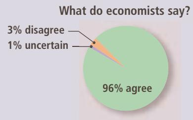
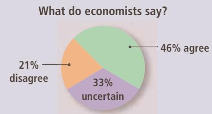
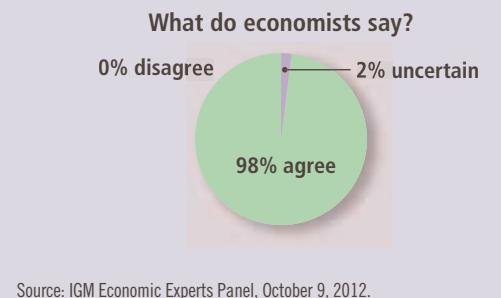

# On Kiwis and Currencies

How do central bankers choose a rate of inflation to target?

## The Goal of 2% Inflation, Rethought

By Neil Irwin

ometimes, decisions that shape the world’s economic future are made with great pomp and gain widespread attention. Other times, they are made through a quick, unanimous vote by members of the New Zealand Parliament who were eager to get home for Christmas.

That is what happened 25 years ago this Sunday, when New Zealand became the first country to set a formal target for how much prices should rise each year—zero to 2 percent in its initial action. The practice was so successful in making the high inflation of the 1970s and ’80s a thing of the past that all of the world’s most advanced nations have emulated it in one form or another. A 2 percent inflation target is now the norm across much of the world, having become virtually an economic religion….

Yet even as the idea of a 2 percent target has become the orthodoxy, a worrying possibility is becoming clear: What if it’s wrong? What if it is one of the reasons that the global economy has been locked in five years of slow growth?

Some economists are beginning to consider the possibility that 2 percent inflation at all times leaves central banks with too little flexibility to adequately fight a deep economic malaise.

To understand that thinking, it’s worth understanding how New Zealand’s 2 percent target became so entrenched in the world economic order to begin with. The story starts in that Southern Hemisphere nation in the summer of 1989, with a kiwi farmer and banker named Don Brash.

When Mr. Brash stepped down as managing director of the New Zealand Kiwifruit Authority to lead the country’s central bank in 1988, he was taking the helm of an economy that had been through a rough two decades, with high inflation and disappointing growth.

Mr. Brash tells the story of an uncle who sold an apple orchard in 1971 and put the money into long-term government bonds to finance his retirement, only to see inflation wipe out 90 percent of his life savings by the time the bonds matured.

In the years before Mr. Brash took the helm of the central bank—the Reserve Bank of New Zealand—his predecessor had made progress in bringing down inflation and making the bank more independent from the whims of politicians. But that independence had not been codified in law.

That’s what the Reserve Bank Act of 1989 was supposed to do. It directed the finance minister and the head of the central bank to arrive at a formal target for how high inflation should be, and granted the central bank political independence to guide interest rates to achieve that inflation level. The head of the central bank could be dismissed for failure to reach the inflation goal.

For David Caygill, New Zealand’s finance minister at the time, the essential part of the law was establishing the bank’s independence from the political process. “Inflation targeting wasn’t from our point of view the main point of the act,” he said in an interview this month.

The debate over the legislation was contentious. Labor unions feared that focusing so pointedly on inflation would lead to higher unemployment. Some business interests agreed….

Ultimately, however, the leaders of the majority party in Parliament decided to brush off the concerns. It helped the cause that one of the bill’s strongest opponents was laid up in the hospital. And Christmas was around the corner.

Once the law was enacted, though, there was the difficult question of what the inflation target should be. Zero percent? Two percent? Five percent?

Mr. Brash and Mr. Caygill got a head start on an answer from an offhand comment made during a television interview in 1988. Roger Douglas, Mr. Caygill’s predecessor as finance minister, had been seeking to dissuade New Zealanders from thinking that the central bank would be content with high inflation, and so he said in an interview that he was aiming for inflation of around zero to 1 percent.

“It was almost a chance remark,” Mr. Brash said in a recent interview. “The figure was plucked out of the air to influence the public’s expectations.”

With Mr. Douglas’s figures as a starting point, Mr. Brash and Mr. Caygill agreed that it would be best to expand the range to give them more room to maneuver, but only a bit. New Zealand would aim for inflation between zero and 2 percent.

Not surprisingly, the passage of a law to reform the central bank governance of an archipelago of 3.4 million people received no coverage in the major American papers. But across the close-knit world of global central bankers, people started to notice the Kiwis’ monetary policy experiment.

At the time, the idea of a central bank simply announcing how much inflation it was aiming for was an almost radical idea. After all, central bankers had long considered a certain man-behind-the-curtain mystique as one of their tools of power.

The inflation goal may have reduced that mystique, but it created a kind of magic of its own. Merely by announcing its goals for inflation, and giving the central bank the independent authority to reach that goal, New Zealand made that result a reality. In negotiations over wages or making plans for price increases, businesses and labor unions across New Zealand started assuming that inflation would indeed be around 2 percent. It thus became self-fulfilling, with wages and prices rising more slowly.

Inflation was 7.6 percent at the end of 1989 when the law was passed. By the end of 1991, it was 2 percent. Mr. Brash did a bit of a global campaigning, describing New Zealand’s success to his fellow central bankers at a conference in Jackson Hole, Wyo.—and to anyone else who would listen.

One by one, more countries adopted the approach. Canada, grappling with persistently high inflation, set an inflation target of 2 percent in 1991. Countries including Sweden and Britain soon followed….

But the more that countries set about announcing a target, the more keen was the discussion about the actual number.

One view was that zero inflation should be the goal—that a dollar today should have the same buying power as a dollar in a decade, or two or three. That was the view embraced by, among others, Paul A. Volcker, the former Fed chairman. Alan Greenspan, Mr. Volcker’s successor at the Fed, argued that inflation needed to be low enough that it didn’t have to be factored into business decisions.

Either of those approaches would imply that a proper target would be zero, or perhaps 0.5 percent or 1 percent, given the difficulty of measuring inflation precisely.

But there was an alternate view—that keeping inflation that low might be dangerous. And the person mounting that argument most forcefully within the Federal Reserve in the 1990s was a Fed governor named Janet L. Yellen.

Behind the oversize doors of the Federal Reserve’s boardroom on Constitution Avenue in Washington, the fight over whether the world’s largest economy should emulate the likes of Canada and New Zealand took place in 1995 and 1996.

Ms. Yellen, who now runs the institution, worried that announcing an inflation target would make the Fed focus only on inflation and neglect its responsibilities to bolster growth and jobs. She worried that zero inflation could paralyze the economy, particularly during slumps, and felt that some inflation was necessary.

“To my mind the most important argument for some low inflation rate is the ‘greasing-thewheels argument,’” Ms. Yellen said in a closeddoor meeting of Fed policy makers in July 1996.

When businesses run into rough times, they may be inclined to cut workers’ pay. But in practice, that doesn’t happen much. Even in a severe downturn, businesses are more likely to cut hours, conduct layoffs or keep positions vacant than cut pay. That’s one reason recessions tend to lead to higher unemployment instead of lower wages.

Inflation helps deal with this problem. When there is a bit of inflation, employers can hold workers’ pay steady during a downturn yet have it decline in inflation-adjusted terms. Inflation creates an adjustment mechanism: An assembly line worker may keep making exactly \$20 an hour through a downturn, but in inflation-adjusted terms that pay falls by 2 percent a year, which could make the factory less likely to resort to layoffs.

In that 1996 debate, another argument that Ms. Yellen raised against a zero percent target was particularly prescient. The higher the level of inflation, the more that central banks can stimulate the economy during a downturn.

Imagine that there is a severe recession and the Fed cuts interest rates to zero, so that when you put money in the bank you get no return. If there is no inflation, your money will retain its purchasing power and be worth the same when you withdraw it. But if there is inflation, the value of your money sitting in the bank becomes steadily less valuable, meaning that you have more incentive to spend or invest it.

“A little inflation permits real interest rates to become negative on the rare occasions when required to counter a recession,” Ms. Yellen said in 1996. “This could be important.”

She, along with her colleagues across the world of central banking, had no idea just how important.

Ms. Yellen’s argument—that some inflation would help grease the economy’s wheels and give central banks more flexibility to respond to a downturn—prevailed, in the sense that 2 percent became the widespread target of global central banks.

But even as that target was embraced, signs started to emerge that it wasn’t high enough to avoid the kinds of problems that Ms. Yellen and others had described.

Starting in the late 1990s, Japan found itself stuck in a pattern of falling prices, or deflation, even after it cut interest rates all the way to zero. The United States suffered a mild recession in 2001, and the Fed cut interest rates to 1 percent to help spur a recovery. Then came the global financial crisis of 2007 to 2009, spurring a steep downturn across the planet and causing central banks to slash interest rates.

© BAO DANDAN/XINHUA/ALAMY LIVE NEWS

  
Janet Yellen

All of this has quite a few smart economists wondering whether the central bankers got the target number wrong. If they had set it a bit higher, perhaps at 3 or 4 percent, they might have been better able to combat the Great Recession because they could cut inflation-adjusted interest rates by more.

“Should policy makers therefore aim for a higher target inflation rate in normal times, in order to increase the room for monetary policy to react to such shocks?” asked Olivier Blanchard, the chief economist of the International Monetary Fund, in a 2010 paper with two co-authors. “To be concrete, are the net costs of inflation much higher at, say, 4 percent than at 2 percent, the current target range?”…

Such a shift would come at a cost. At 2 percent inflation, it is easy to enter into many financial transactions without really having to adjust for inflation. At 2 percent inflation, the value of a dollar falls by half over 35 years, whereas at 4 percent it falls in half every 18 years. On the other hand, inflation also hovered in the range of 3 to 4 percent through the mid-1980s, hardly remembered as an economic nightmare.

A shift in the target, furthermore, could well cause disruptions in financial markets and potentially a sharp, sudden rise in longer-term interest rates that could slow growth.

Current central bankers view the cost of raising the target as too high to pay. The Fed’s vice chairman, Stanley Fischer, reasserted his support of a 2 percent target earlier this month. And Ms. Yellen has given no indication that she wishes to rethink the target. ■

Source: New York Times, December 21, 2014.

In addition, inflation allows for the possibility of negative real interest rates. Nominal interest rates can never fall below zero, because lenders can always hold on to their money rather than lending it out at a negative return. If inflation is zero, real interest rates can also never be negative. However, if inflation is positive, then a cut in nominal interest rates below the inflation rate produces negative real interest rates. Sometimes the economy may need negative real interest rates to provide sufficient stimulus to aggregate demand—an option ruled out by zero inflation.

In light of all these arguments, why should policymakers put the economy through a costly and inequitable disinflationary recession to achieve zero inflation? Economist Alan Blinder, who was once vice chairman of the Federal Reserve, argued in his book Hard Heads, Soft Hearts that policymakers should not make this choice:

The costs that attend the low and moderate ination rates experienced in the United States and in other industrial countries appear to be quite modest— more like a bad cold than a cancer on society. . . . As rational individuals, we do not volunteer for a lobotomy to cure a head cold. Yet, as a collectivity, we routinely prescribe the economic equivalent of lobotomy (high unemployment) as a cure for the inationary cold.

Blinder concludes that it is better to learn to live with moderate inflation.

QuickQuiz

Explain the costs and benefits of reducing inflation to zero. Which are temporary and which are permanent?

## 23-5 Should the Government Balance Its Budget?

A persistent macroeconomic debate concerns the government’s finances. Whenever the government spends more than it collects in tax revenue, it covers this budget deficit by issuing government debt. In our study of financial markets, we saw how budget deficits affect saving, investment, and interest rates. But how big a problem are budget deficits? Our next debate concerns whether fiscal policymakers should make balancing the government’s budget a high priority.

## 23-5a Pro: The Government Should Balance Its Budget

The U.S. federal government is far more indebted today than it was three decades ago. In 1980, the federal debt was \$712 billion; in 2015, it was \$13.1 trillion. If we divide today’s debt by the size of the population, we learn that each person’s share of the government debt is about \$41,000.

The most direct effect of the government debt is to place a burden on future generations of taxpayers. When these debts and accumulated interest come due, future taxpayers will face a difficult choice. They can choose some combination of higher taxes and less government spending to make resources available to pay off the debt and accumulated interest. Or, instead, they can delay the day of reckoning and put the government into even deeper debt by borrowing once again to pay off the old debt and interest. In essence, when the government runs a budget deficit and issues government debt, it allows current taxpayers to pass the bill for some of their government spending on to future taxpayers. Inheriting such a large debt will lower the living standard of future generations.

In addition to this direct effect, budget deficits have various macroeconomic effects. Because budget deficits represent negative public saving, they lower national saving (the sum of private and public saving). Reduced national saving causes real interest rates to rise and investment to fall. Reduced investment leads over time to a smaller stock of capital. A lower capital stock reduces labor productivity, real wages, and the economy’s production of goods and services. Thus, when the government increases its debt, future generations are born into an economy with lower incomes as well as higher taxes.

TOMMASO LIZZUL/SHUTTERSTOCK

There are, nevertheless, situations in which running a budget deficit is justifiable. Throughout history, the most common cause of increased government debt has been war. When a military conflict raises government spending temporarily, it is reasonable to finance this extra spending by borrowing. Otherwise, taxes during wartime would have to rise precipitously. Such high tax rates would greatly distort the incentives faced by those who are taxed, leading to large deadweight losses. In addition, such high tax rates would be unfair to current citizens who are making the sacrifice of fighting the war to ensure security and freedom not only for themselves but also for future generations.

  
“What?!? My share of the government debt is \$41,000?”

Similarly, it is reasonable to allow a budget deficit during a temporary downturn in economic activity. When the economy goes into a recession, tax revenue falls automatically because the income tax and the payroll tax are levied on measures of income. If the government tried to balance its budget during a recession, it would have to raise taxes or cut spending at a time of high unemployment. Such a policy would tend to depress aggregate demand at precisely the time it needed to be stimulated and, therefore, would tend to increase the magnitude of economic fluctuations.

Yet not all budget deficits can be justified as a result of war or recession. U.S. government debt as a percentage of GDP increased from 26 percent in 1980 to 50 percent in 1995. During this period, the United States experienced neither a major military conflict nor a major economic downturn. Yet the government consistently ran a sizable budget deficit, largely because the president and Congress found it easier to increase government spending than to increase taxes.

The budget deficits that the U.S. government has run in recent years can, perhaps, be rationalized by the wars in Iraq and Afghanistan and the effects of the recessions in 2001 and 2008–2009. But it is imperative that this deficit not signal a return to the unsustainable fiscal policy of an earlier era. As the economy recovers from the most recent recession and unemployment returns to its natural rate, the government should bring spending in line with tax revenue. Compared to the alternative of ongoing budget deficits, a balanced budget means greater national saving, investment, and economic growth. It means that future college graduates will enter a more prosperous economy.

## 23-5b Con: The Government Should Not Balance Its Budget

The problem of government debt is often exaggerated. Although the government debt does represent a tax burden on younger generations, it is not large compared to the average person’s lifetime income. The debt of the U.S. federal government is about \$41,000 per person. A person who works 40 years for \$50,000 a year will earn \$2 million over his lifetime. His share of the government debt represents only about 2 percent of his lifetime resources.

Moreover, it is misleading to view the effects of budget deficits in isolation. The budget deficit is just one piece of a large picture of how the government chooses to raise and spend money. In making these decisions about fiscal policy, policymakers affect different generations of taxpayers in many ways. The government’s budget deficit or surplus should be considered together with these other policies.

For example, suppose the government reduces the budget deficit by cutting spending on public investments, such as education. Does this policy make younger generations better off? The government debt will be smaller when they enter the labor force, which means a smaller tax burden. Yet if they are less edu cated than they could be, their productivity and incomes will be lower. Many estimates of the return from schooling (the increase in a worker’s wage that results from an additional year in school) find that it is quite large. Reducing the budget deficit rather than funding more education spending could, all things considered, make future generations worse off.

Single-minded concern about the budget deficit is also dangerous because it draws attention away from various other policies that redistribute income across generations. For example, in the 1960s and 1970s, the U.S. federal government raised Social Security benefits for the elderly. It financed this higher spending by increasing the payroll tax on the working-age population. This policy redistributed income away from younger generations toward older generations, even though it did not affect the government debt. Thus, the budget deficit is only a small part of the larger issue of how government policy affects the welfare of different generations.

To some extent, forward-looking parents can reverse the adverse effects of government debt. Parents can offset the impact simply by saving and leaving a larger bequest. The bequest would enhance their children’s ability to bear the burden of future taxes. Some economists claim that people do in fact behave this way. If this were true, higher private saving by parents would offset the public dissaving of budget deficits; as a result, deficits would not affect the economy. Most economists doubt that parents are so farsighted, but some people probably do act this way, and anyone could. Deficits give people the opportunity to consume at the expense of their children, but deficits do not require them to do so. If the government debt were actually a great problem facing future generations, some parents would help to solve it.

Critics of budget deficits sometimes assert that the government debt cannot continue to rise forever, but in fact, it can. Just as a bank evaluating a loan application would compare a person’s debts to his income, we should judge the burden of the government debt relative to the size of the nation’s income. Population growth and technological progress cause the total income of the U.S. economy to grow over time. As a result, the nation’s ability to pay the interest on the government debt grows over time as well. As long as the government debt grows more slowly than the nation’s income, there is nothing to prevent the government debt from growing forever.

Some numbers can put this into perspective. The real output of the U.S. economy grows on average about 3 percent per year. If the inflation rate is 2 percent per year, then nominal income grows at a rate of 5 percent per year. The government debt, therefore, can rise by 5 percent per year without increasing the ratio of debt to income. In 2015, the federal government debt was \$13.1 trillion; 5 percent of this figure is \$655 billion. As long as the federal budget deficit is smaller than \$655 billion, the policy is sustainable.

To be sure, very large budget deficits cannot persist forever. From 2009 to 2012, the federal budget deficit was over \$1 trillion every year, but this astonishing number was driven by extraordinary circumstances: a major financial crisis, a deep economic downturn, and the policy responses to these events. No one suggests that a deficit of this magnitude can continue. But zero is the wrong target for fiscal policymakers. As long as the deficit is only moderate in size, there will never be a day of reckoning that forces government borrowing to end or the economy to collapse.

Explain how reducing a government budget deficit makes future generations better off. What fiscal policy might improve the lives of future generhan reducing a government budget deficit?

## 23-6 Should the Tax Laws Be Reformed to Encourage Saving?

A nation’s standard of living depends on its ability to produce goods and services. This was one of the Ten Principles of Economics in Chapter 1. As we saw in the chapter on production and growth, a nation’s productive capability, in turn, is determined largely by how much it saves and invests for the future. Our last debate is whether policymakers should reform the tax laws to encourage greater saving and investment.

## 23-6a Pro: The Tax Laws Should Be Reformed to Encourage Saving

A nation’s saving rate is a key determinant of its long-run economic prosperity. When the saving rate is higher, more resources are available for investment in new plant and equipment. A larger stock of plant and equipment, in turn, raises labor productivity, wages, and incomes. It is, therefore, no surprise that international data show a strong correlation between national saving rates and measures of economic well-being.

Another of the Ten Principles of Economics presented in Chapter 1 is that people respond to incentives. This lesson should apply to people’s decisions about how much to save. If a nation’s laws make saving attractive, people will save a higher fraction of their incomes, and this higher saving will lead to a more prosperous future.

Unfortunately, the U.S. tax system discourages saving by taxing the return to saving quite heavily. For example, consider a 25-year-old worker who saves \$1,000 of his income to have a more comfortable retirement at the age of 70. If he buys a bond that pays an interest rate of 10 percent, the \$1,000 will accumulate at the end of 45 years to \$72,900 in the absence of taxes on interest. But suppose he faces a marginal tax rate on interest income of 40 percent, which is typical for many workers once federal and state income taxes are added together. In this case, his after-tax interest rate is only 6 percent, and the \$1,000 will accumulate at the end of 45 years to only \$13,800. That is, accumulated over this long span of time, the tax rate on interest income reduces the benefit of saving \$1,000 from \$72,900 to \$13,800—or by about 80 percent.

The tax code further discourages saving by taxing some forms of capital income twice. Suppose a person uses some of his saving to buy stock in a corporation. When the corporation earns a profit from its capital investments, it first pays tax on this profit in the form of the corporate income tax. If the corporation pays out the rest of the profit to the stockholder in the form of dividends, the stockholder pays tax on this income a second time in the form of the individual income tax. This double taxation substantially reduces the return to the stockholder, thereby reducing the incentive to save.

Source: IGM Economic Experts Panel, October 9, 2012.

ASK THE EXPERTS

## Taxing Capital and Labor

“One drawback of taxing capital income at a lower rate than labor income is that it gives people incentives to relabel income that policymakers find hard to categorize as ‘capital’ rather than ‘labor’.”

“Despite relabeling concerns, taxing capital income at a permanently lower rate than labor income would result in higher average long-term prosperity, relative to an alternative that generated the same amount of tax revenue by permanently taxing capital and labor income at equal rates instead.”

“Although they do not always agree about the precise likely effects of different tax policies, another reason why economists often give disparate advice on tax policy is because they hold differing views about choices between raising average prosperity and redistributing income.”

The tax laws again discourage saving if a person wants to leave his accumulated wealth to his children (or anyone else) rather than consuming it during his lifetime. Parents can bequeath some money to their children tax-free, but if the bequest becomes large, the estate tax rate can be as high as 40 percent. To a large extent, concern about national saving is motivated by a desire to ensure economic prosperity for future generations. It is odd, therefore, that the tax laws discourage the most direct way in which one generation can help the next.

In addition to the tax code, many other policies and institutions in our society reduce the incentive for households to save. Some government benefits, such as welfare and Medicaid, are means-tested; that is, the benefits are reduced for those who in the past have been prudent enough to save some of their income. Colleges and universities grant financial aid as a function of the wealth of the students and their parents. Such a policy is like a tax on wealth and, as such, discourages students and parents from saving.

There are various ways in which the tax code could provide an incentive to save, or at least reduce the disincentive that households now face. Already the tax laws give preferential treatment to some types of retirement saving. When a taxpayer puts income into an Individual Retirement Account (IRA), for instance, that income and the interest it earns are not taxed until the funds are withdrawn at retirement. The tax code gives a similar tax advantage to retirement accounts that go by other names, such as 401(k), 403(b), and profit-sharing plans. There are, however, limits to who is eligible to use these plans and, for those who are eligible, limits on the amount that can be put in them. Moreover, because there are penalties for withdrawal before retirement age, these retirement plans provide little incentive for other types of saving, such as saving to buy a house or pay for college. A small step to encourage greater saving would be to expand the ability of households to use such tax-advantaged savings accounts.

A more comprehensive approach would be to reconsider the entire basis by which the government collects revenue. The centerpiece of the U.S. tax system is the income tax. A dollar earned is taxed the same whether it is spent or saved. An alternative advocated by many economists is a consumption tax. Under a consumption tax, a household pays taxes only on the basis of what it spends. Income that is saved is exempt from taxation until the saving is later withdrawn and spent on consumption goods. In essence, a consumption tax automatically puts all saving into a tax-advantaged savings account, much like an IRA. A switch from income to consumption taxation would greatly increase the incentive to save.

## 23-6b Con: The Tax Laws Should Not Be Reformed to Encourage Saving

Increasing saving may be desirable, but it is not the only goal of tax policy. Policymakers also must be sure to distribute the tax burden fairly. The problem with proposals to increase the incentive to save is that they increase the tax burden on those who can least afford it.

It is undeniable that high-income households save a greater fraction of their income than low-income households. As a result, any tax change that favors people who save will also tend to favor people with high income. Policies such as tax-advantaged retirement accounts may seem appealing, but they lead to a less egalitarian society. By reducing the tax burden on the wealthy who can take advantage of these accounts, they force the government to raise the tax burden on the poor.

Moreover, tax policies designed to encourage saving may not be effective at achieving that goal. Economic theory does not give a clear prediction about whether a higher rate of return would increase saving. The outcome depends on the relative size of two conflicting forces, called the substitution effect and the income effect. On the one hand, a higher rate of return raises the benefit of saving: Each dollar saved today produces more consumption in the future. This substitution effect tends to increase saving. On the other hand, a higher rate of return lowers the need for saving: A household has to save less to achieve any target level of consumption in the future. This income effect tends to reduce saving. If the substitution and income effects approximately cancel each other, as some studies suggest, then saving will not change when lower taxation of capital income raises the rate of return.

There are ways to increase national saving other than by giving tax breaks to the rich. National saving is the sum of private and public saving. Instead of trying to alter the tax code to encourage greater private saving, policymakers can simply raise public saving by reducing the budget deficit, perhaps by raising taxes on the wealthy. This offers a direct way of raising national saving and increasing prosperity for future generations.

Indeed, once public saving is taken into account, tax provisions to encourage saving might backfire. Tax changes that reduce the taxation of capital income reduce government revenue and, thereby, lead to a larger budget deficit. To increase national saving, such a change in the tax code must stimulate private saving by more than the decline in public saving. If this is not the case, so-called saving incentives can potentially make matters worse.

QuickQuiz

Give three examples of how our society discourages saving. What are the drawbacks of eliminating these disincentives?

## 23-7 Conclusion

This chapter has considered six classic debates over macroeconomic policy. For each, it began with a controversial proposition and then offered the arguments pro and con. If you find it hard to choose a side in these debates, you may find some comfort in the fact that you are not alone. The study of economics does not always make it easy to choose among alternative policies. Indeed, by clarifying the inevitable trade-offs that policymakers face, it can make the choice more difficult.

Difficult choices, however, have no right to seem easy. When you hear politicians or commentators proposing something that sounds too good to be true, it probably is. If they sound like they are offering you a free lunch, you should look for the hidden price tag. Few if any policies come with benefits but no costs. By helping you see through the fog of rhetoric so common in political discourse, the study of economics should make you a better participant in our national debates.

## CHAPTER QuickQuiz

1. Approximately how long does it take a change in monetary policy to influence aggregate demand? a. 1 month b. 6 months c. 2 years d. 5 years

2. According to traditional Keynesian analysis, which of the following will increase aggregate demand the most?

a. \$100 billion increase in taxation

b. \$100 billion decrease in taxation

c. \$100 billion increase in government spending

d. \$100 billion decrease in government spending

3. Advocates for setting monetary policy by rule rather than discretion often argue that

a. central bankers with discretion are tempted to renege on their announced commitments to low inflation.

b. central bankers following a rule will be more responsive to the needs of the political process.

c. fiscal policy is a much better tool for economic stabilization than is monetary policy.

d. it is sometimes useful to give the economy a burst of surprise inflation.

4. Which of the following is NOT an argument for maintaining a positive rate of inflation?

a. It permits real interest rates to be negative.

b. It allows real wages to fall without cuts in nominal wages.

c. It increases the variability of relative prices.

d. It would be costly to reduce inflation to zero.

5. Throughout U.S. history, what has been the most common cause of substantial increases in government debt?

a. recessions

b. wars

c. financial crises

d. tax cuts

6. Advocates of taxing consumption rather than income argue that

a. a consumption tax is a better automatic stabilizer.

b. taxing consumption does not cause any deadweight losses.

c. the rich consume a higher fraction of income than the poor.

d. the current tax code discourages people from saving.

## SUMMARY

Advocates of active monetary and fiscal policies view the economy as inherently unstable and believe that policy can manage aggregate demand to offset the inherent instability. Critics of active monetary and fiscal policies emphasize that policy affects the economy with a lag and that our ability to forecast future economic conditions is poor. As a result, attempts to stabilize the economy can end up being destabilizing.

Advocates of increased government spending to fight recessions argue that because tax cuts may be saved rather than spent, direct government spending does more to increase aggregate demand, which is key to promoting production and employment. Critics of spending hikes argue that tax cuts can expand both aggregate demand and aggregate supply and that hasty increases in government spending may lead to wasteful public projects.

Advocates of rules for monetary policy argue that discretionary policy can suffer from incompetence, the abuse of power, and time inconsistency. Critics of rules for monetary policy argue that discretionary policy is more flexible in responding to changing economic circumstances.

Advocates of a zero-inflation target emphasize that inflation has many costs and few if any benefits. Moreover, the cost of eliminating inflation— depressed output and employment—is only temporary. Even this cost can be reduced if the central bank announces a credible plan to reduce inflation, thereby directly lowering expectations of inflation. Critics of a zero-inflation target claim that moderate inflation imposes only small costs on society, whereas the recession necessary to reduce inflation is quite costly. The critics also point out several ways in which moderate inflation may be helpful to an economy.

Advocates of a balanced government budget argue that budget deficits impose an unjustifiable burden on future generations by raising their taxes and lowering their incomes. Critics of a balanced government budget argue that the deficit is only one small piece of fiscal policy. Single-minded concern about the budget deficit can obscure the many ways in which policy, including various spending programs, affects different generations.

Advocates of tax incentives for saving point out that our society discourages saving in many ways, such as by heavily taxing capital income and by reducing benefits for those who have accumulated wealth. They endorse reforming the tax laws to encourage saving, perhaps by switching from an income tax to a consumption tax. Critics of tax incentives for saving argue that many proposed changes to stimulate saving would primarily benefit the wealthy, who do not need a tax break. They also argue that such changes might have only a small effect on private saving. Raising public saving by decreasing the government’s budget deficit would provide a more direct and equitable way to increase national saving.

## QUESTIONS FOR REVIEW

1. What causes the lags in the effect of monetary and fiscal policies on aggregate demand? What are the implications of these lags for the debate over active versus passive policy?

2. According to traditional Keynesian analysis, why does a tax cut have a smaller effect on GDP than a similarly sized increase in government spending? Why might the opposite be the case?

3. What might motivate a central banker to cause a political business cycle? What does the political business cycle imply for the debate over policy rules?

4. Explain how credibility might affect the cost of reducing inflation.

5. Why are some economists against a target of zero inflation?

6. Explain two ways in which a government budget deficit hurts a future worker.

7. What are two situations in which most economists view a budget deficit as justifiable?

8. Some economists say that the government can continue running a budget deficit forever. How is that possible?

9. Some income from capital is taxed twice. Explain.

10. What adverse effect might be caused by tax incentives to increase saving?

## PROBLEMS AND APPLICATIONS

1. The chapter suggests that the economy, like the human body, has “natural restorative powers.”

a. Illustrate the short-run effect of a fall in aggregate demand using an aggregate-demand/aggregatesupply diagram. What happens to total output, income, and employment?

b. If the government does not use stabilization policy, what happens to the economy over time? Illustrate this adjustment on your diagram. Does it generally occur in a matter of months or a matter of years?

c. Do you think the “natural restorative powers” of the economy mean that policymakers should be passive in response to the business cycle?

2. Policymakers who want to stabilize the economy must decide how much to change the money supply, government spending, or taxes. Why is it difficult for policymakers to choose the appropriate strength of their actions?

3. The problem of time inconsistency applies to fiscal policy as well as to monetary policy. Suppose the government announced a reduction in taxes on income from capital investments, like new factories.

a. If investors believed that capital taxes would remain low, how would the government’s action affect the level of investment?

b. After investors have responded to the announced tax reduction, does the government have an incentive to renege on its policy? Explain.

c. Given your answer to part b, would investors believe the government’s announcement? What can the government do to increase the credibility of announced policy changes?

d. Explain why this situation is similar to the time-inconsistency problem faced by monetary policymakers.

4. Chapter 2 explains the difference between positive analysis and normative analysis. In the debate about whether the central bank should aim for zero inflation, which areas of disagreement involve positive statements and which involve normative judgments?

5. Why are the benefits of reducing inflation permanent and the costs temporary? Why are the costs of increasing inflation permanent and the benefits temporary? Use Phillips-curve diagrams in your answer.

6. Suppose the federal government cuts taxes and increases spending, raising the budget deficit to

12 percent of GDP. If nominal GDP is rising 5 percent per year, are such budget deficits sustainable forever? Explain. If budget deficits of this size are maintained for 20 years, what is likely to happen to your taxes and your children’s taxes in the future? Can you personally do something today to offset this future effect?

7. Explain how each of the following policies redistributes income across generations. Is the redistribution from young to old or from old to young? a. an increase in the budget deficit

b. more generous subsidies for education loans

c. greater investments in highways and bridges

d. an increase in Social Security benefits

8. What is the fundamental trade-off that society faces if it chooses to save more? How might the government increase national saving?

To find additional study resources, visit cengagebrain.com, and search for “Mankiw.”

## A

absolute advantage the ability to produce a good using fewer inputs than another producer

