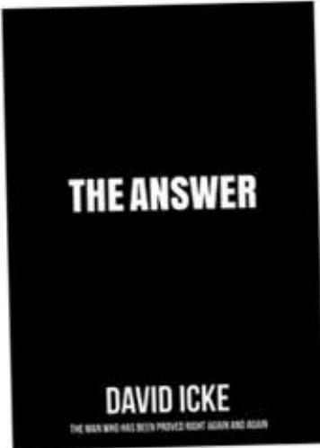

# DAVID ICKE THEANSWER

We live in extraordinary times with billions bewildered and seeking answers for what is happening. David Icke, the man who has been proved right again and again, has spent 30 years uncovering the truth behind world affairs and in a stream of previous books he predicted current events

The Answer will change your every perception of life and the world and set you free of the illusions that control human society. There is nothing more vital for our collective freedom than humanity becoming aware of what is in this book.

Available now at davidicke.com.

TRIGGER

DAVIDICKE

## EVERYTHING YOUNEED TOKNOW BUT HAVE NEVER BEEN TOLD

DAVIDICKE

## DAVIDICKE.COM

DAVID ICKE STORELATEST NEWS ARTICLESDAVID ICKE VIDEOSWEEKLY DOT-CONNECTOR PODCASTSLIVE EVENTSWWW.DAVIDICKE.COM
