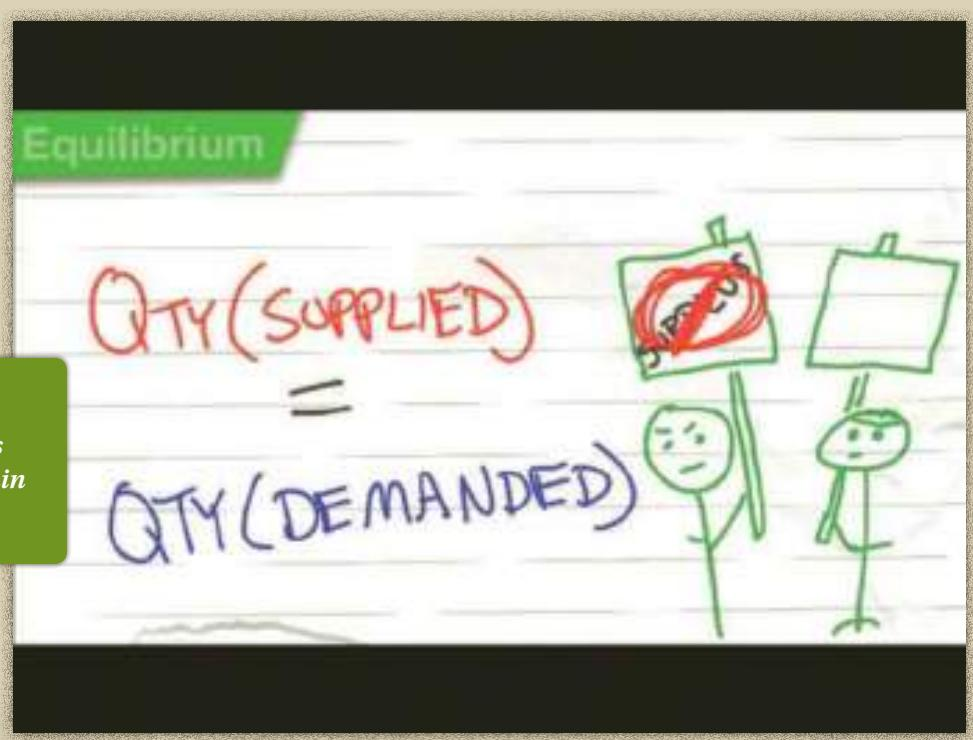
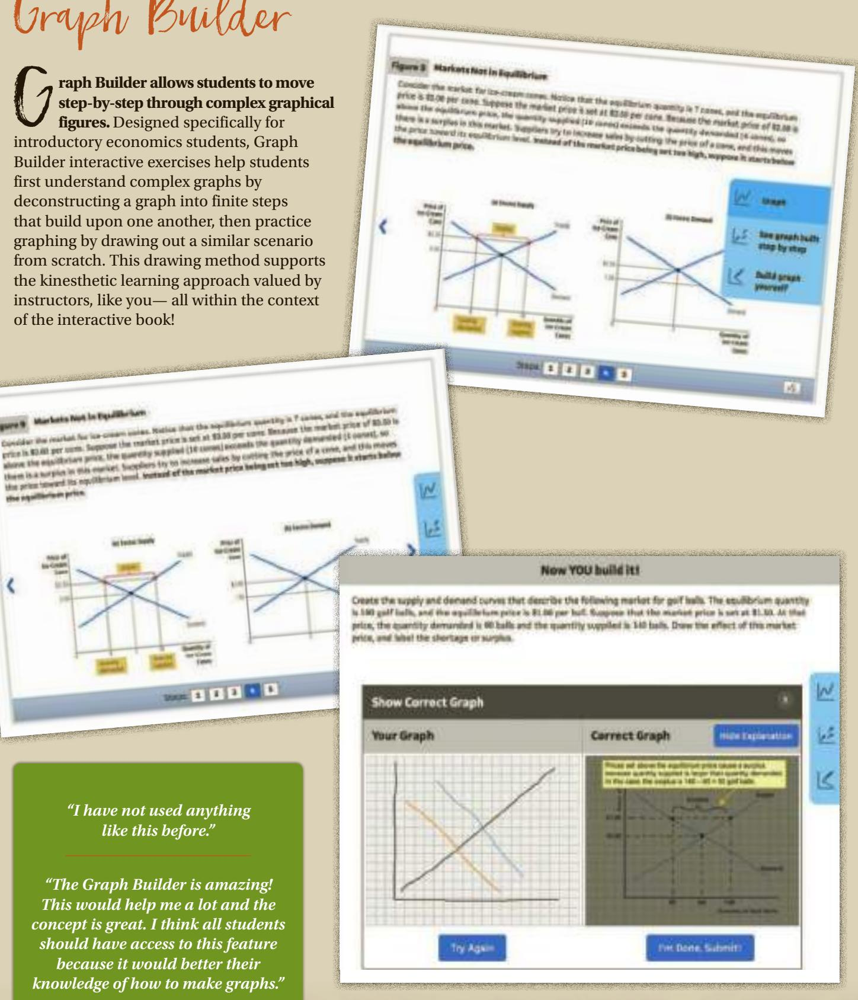

# Brief ContentsBrief Contents

## PART I Introduction 1

1 Ten Principles of Economics 3

2 Thinking Like an Economist 19

3 Interdependence and the Gains from Trade 47

## PART II How Markets Work 63

4 The Market Forces of Supply and Demand 65

5 Elasticity and Its Application 89

6 Supply, Demand, and Government Policies 111

## PART III Markets and Welfare 131

7 Consumers, Producers, and the Efficiency of Markets 133

8 Application: The Costs of Taxation 153

9 Application: International Trade 167

## PART IV The Economics of the Public Sector 187

10 Externalities 189

11 Public Goods and Common Resources 211

12 The Design of the Tax System 227

## PART V Firm Behavior and the Organization

## of Industry 245

13 The Costs of Production 247

14 Firms in Competitive Markets 267

15 Monopoly 289

16 Monopolistic Competition 319

17 Oligopoly 337

## PART VI The Economics of Labor Markets 359

18 The Markets for the Factors of Production 361

19 Earnings and Discrimination 383

20 Income Inequality and Poverty 401

## PART VII Topics for Further Study 423

21 The Theory of Consumer Choice 425

22 Frontiers of Microeconomics 451

## Preface: To the Student

“ conomics is a study of mankind in the ordinary business of life.” So wroteAlfred Marshall, the great 19th-century economist, in his textbook, PrinciplesE Alfred Marshall, the great 19th-century economist, in his textbook, Principles of Economics. We have learned much about the economy since Marshall’s time, but this definition of economics is as true today as it was in 1890, when the first edition of his text was published.

Why should you, as a student in the 21st century, embark on the study of economics? There are three reasons.

The first reason to study economics is that it will help you understand the world in which you live. There are many questions about the economy that might spark your curiosity. Why are apartments so hard to find in New York City? Why do airlines charge less for a round-trip ticket if the traveler stays over a Saturday night? Why is Robert Downey, Jr., paid so much to star in movies? Why are living standards so meager in many African countries? Why do some countries have high rates of inflation while others have stable prices? Why are jobs easy to find in some years and hard to find in others? These are just a few of the questions that a course in economics will help you answer.

The second reason to study economics is that it will make you a more astute participant in the economy. As you go about your life, you make many economic decisions. While you are a student, you decide how many years to stay in school. Once you take a job, you decide how much of your income to spend, how much to save, and how to invest your savings. Someday you may find yourself running a small business or a large corporation, and you will decide what prices to charge for your products. The insights developed in the coming chapters will give you a new perspective on how best to make these decisions. Studying economics will not by itself make you rich, but it will give you some tools that may help in that endeavor.

The third reason to study economics is that it will give you a better understanding of both the potential and the limits of economic policy. Economic questions are always on the minds of policymakers in mayors’ offices, governors’ mansions, and the White House. What are the burdens associated with alternative forms of taxation? What are the effects of free trade with other countries? What is the best way to protect the environment? How does a government budget deficit affect the economy? As a voter, you help choose the policies that guide the allocation of society’s resources. An understanding of economics will help you carry out that responsibility. And who knows: Perhaps someday you will end up as one of those policymakers yourself.

Thus, the principles of economics can be applied in many of life’s situations. Whether the future finds you following the news, running a business, or sitting in the Oval Office, you will be glad that you studied economics.

N. Gregory Mankiw December 2016

## Video Aplication

ideo application features the book’s author introducing chapter content. Author Greg Mankiw introduces the important themes in every chapter by delivering a highly relevant deposition on the real-world context to the economic principles that will be appearing in the upcoming chapter. These videos are intended to motivate students to better understand how economics relates to their day-to-day lives and in the world around them.

## ConceptClip Videos

onceptClip videos help students master economics terms. These high-energy videos, embedded throughout the interactive book, address the known student challenge of understanding economics terminology when initially introduced to the subject matter. Developed by Professor Mike Brandl of The Ohio State University, these concept-based animations provide students with

memorable context to the key terminology required for your introductory economics course.

“I have always wanted supplemental material such as this to help me understand certain concepts in economics.”

## Graph Builder

G raph Builder allows students to movestep-by-step through complex graphi step-by-step through complex graphical figures. Designed specifically for introductory economics students, Graph Builder interactive exercises help students first understand complex graphs by deconstructing a graph into finite steps that build upon one another, then practice graphing by drawing out a similar scenario from scratch. This drawing method supports the kinesthetic learning approach valued by instructors, like you— all within the context of the interactive book!

Creats the supply ané denand curvis thet dercribe the following markot for goif hala. The etulibrum quantity 1 gal ia, an e aquilllum peee e   por hut Spoe tht she maot pri  s at  o. d sl price, the suandity demunted is we balle and the squantity sugplet l in bals. Dhew te efect of ths martat price, and sbel the slortage or surpha

## “I have not used anything like this before.”

“The Graph Builder is amazing! This would help me a lot and the concept is great. I think all students should have access to this feature because it would better their knowledge of how to make graphs.”
