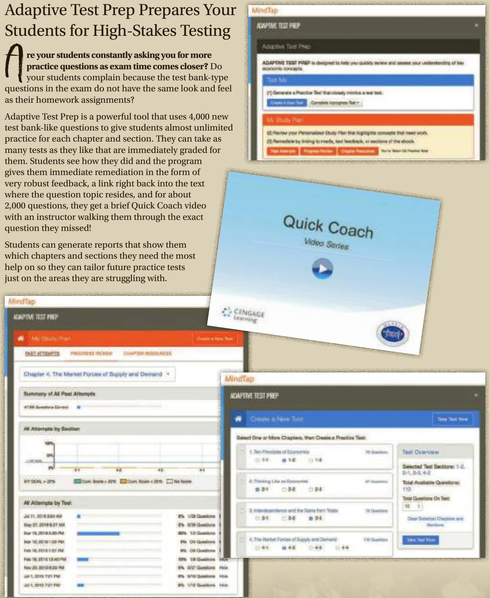

# Study and Test Prep

# The Mankiw Study Guide is now a part of MindTap!

he study guide by David Hakes for Mankiw’s Principles of Economics has long been the standard of what a print study guide could be. Students like how it reinforces the text and improves understanding of the chapter content. Now for the eighth edition, the study guide is integrated right into the MindTap course at no additional charge!

For each chapter, students get the same great resources that users of the print Study Guide have always received:

• The Chapter Overview

• Problems and Short Answers

• Self-Test

• Advanced Critical Thinking

• Solutions for All Study Guide Questions

  
David Hakes and Greg Mankiw

#

“Additional practice with problems is extremely helpful, especially when combined with the immediate feedback that I received via the online server.”

“The adaptive feedback system was incredibly useful, because by the time the test rolled around I didn’t always remember what I had struggled with in previous weeks.”

## Adaptive Test Prep Prepares Your Students for High-Stakes Testing

re your students constantly asking you for more practice questions as exam time comes closer? Do your students complain because the test bank-type questions in the exam do not have the same look and feel as their homework assignments?

Adaptive Test Prep is a powerful tool that uses 4,000 new test bank-like questions to give students almost unlimited practice for each chapter and section. They can take as many tests as they like that are immediately graded for them. Students see how they did and the program gives them immediate remediation in the form of very robust feedback, a link right back into the text where the question topic resides, and for about 2,000 questions, they get a brief Quick Coach video with an instructor walking them through the exact question they missed!

Students can generate reports that show them which chapters and sections they need the most help on so they can tailor future practice tests just on the areas they are struggling with.

  
Copyright 2018 Cengage Learning. All Rights Reserved. May not be copied, scanned, or duplicated, in whole or in part. WCN 02-200-203

