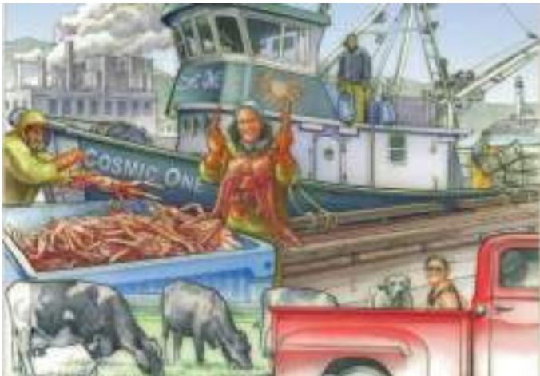

# PART III Markets and Welfare 131

CHAPTER 7

Consumers, Producers, and the Efficiency of Markets 133

## 7-1 Consumer Surplus 134

7-1a Willingness to Pay 134

7-1b Using the Demand Curve to Measure Consumer Surplus 135

7-1c How a Lower Price Raises Consumer Surplus 136 7-1d What Does Consumer Surplus Measure? 137

## 7-2 Producer Surplus 139

7-2a Cost and the Willingness to Sell 139 7-2b Using the Supply Curve to Measure Producer Surplus 140 7-2c How a Higher Price Raises Producer Surplus 141

## 7-3 Market Efficiency 142

7-3a The Benevolent Social Planner 143 7-3b Evaluating the Market Equilibrium 144 IN THE NEWS: The Invisible Hand Can Park Your Car 146 CASE STUDY: Should There Be a Market for Organs? 147 ASK THE EXPERTS: Supplying Kidneys 148

7-4 Conclusion: Market Efficiency and Market Failure 148 Summary 150 Key Concepts 150 Questions for Review 150 Problems and Applications 150

## CHAPTER 8

## Application: The Costs of Taxation 153

8-1 The Deadweight Loss of Taxation 154 8-1a How a Tax Affects Market Participants 155 8-1b Deadweight Losses and the Gains from Trade 157

8-2 The Determinants of the Deadweight Loss 158 CASE STUDY: The Deadweight Loss Debate 160

8-3 Deadweight Loss and Tax Revenue as Taxes Vary 161 CASE STUDY: The Laffer Curve and Supply-Side Economics 162 ASK THE EXPERTS: The Laffer Curve 163

8-4 Conclusion 164 Summary 165 Key Concept 165 Questions for Review 165 Problems and Applications 165

## CHAPTER 9

## Application: International Trade 167

## 9-1 The Determinants of Trade 168

9-1a The Equilibrium without Trade 168 9-1b The World Price and Comparative Advantage 169

## 9-2 The Winners and Losers from Trade 170

9-2a The Gains and Losses of an Exporting Country 170 9-2b The Gains and Losses of an Importing Country 171 9-2c Effects of a Tariff 173 FYI: Import Quotas: Another Way to Restrict Trade 175 9-2d The Lessons for Trade Policy 175 9-2e Other Benefits of International Trade 176 IN THE NEWS: Trade as a Tool for Economic Development 177

## 9-3 The Arguments for Restricting Trade 178

9-3a The Jobs Argument 178 IN THE NEWS: Should the Winners from Free Trade Compensate the Losers? 179 9-3b The National-Security Argument 180 9-3c The Infant-Industry Argument 180 9-3d The Unfair-Competition Argument 181 9-3e The Protection-as-a-Bargaining-Chip Argument 181

CASE STUDY: Trade Agreements and the World Trade Organization 181 ASK THE EXPERTS: Trade Deals 182

9-4 Conclusion 182 Summary 184 Key Concepts 184 Questions for Review 184 Problems and Applications 185

