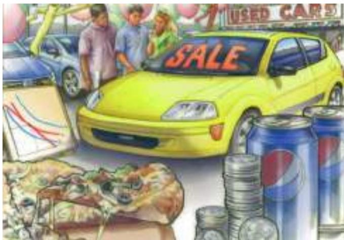

# PART VI The Economics of Labor Markets 359

CHAPTER 18

The Markets for the Factors of Production 361

8-1 The Demand for Labor 362 18-1a The Competitive Profit-Maximizing Firm 363 18-1b The Production Function and the Marginal Product of Labor 363 18-1c The Value of the Marginal Product and the Demand for Labor 365 18-1d What Causes the Labor-Demand Curve to Shift? 366 FYI: Input Demand and Output Supply: Two Sides of the Same Coin 367

18-2 The Supply of Labor 368 18-2a The Trade-off between Work and Leisure 368

18-2b What Causes the Labor-Supply Curve to Shift? 368 ASK THE EXPERTS: Immigration 369

18-3 Equilibrium in the Labor Market 369 18-3a Shifts in Labor Supply 370 18-3b Shifts in Labor Demand 371 IN THE NEWS: The Economics of Immigration 372 CASE STUDY: Productivity and Wages 373 FYI: Monopsony 374

18-4 The Other Factors of Production: Land and Capital 375 18-4a Equilibrium in the Markets for Land and Capital 375 FYI: What Is Capital Income? 376 18-4b Linkages among the Factors of Production 377 CASE STUDY: The Economics of the Black Death 377

18-5 Conclusion 378 Summary 379 Key Concepts 379 Questions for Review 379 Problems and Applications 380

## CHAPTER 19

## Earnings and Discrimination 383

19-1 Some Determinants of Equilibrium Wages 384 19-1a Compensating Differentials 384 19-1b Human Capital 385 CASE STUDY: The Increasing Value of Skills 385 ASK THE EXPERTS: Inequality and Skills 386 IN THE NEWS: Schooling as a Public Investment 387 19-1c Ability, Effort, and Chance 388 CASE STUDY: The Benefits of Beauty 388 19-1d An Alternative View of Education: Signaling 389 19-1e The Superstar Phenomenon 390 19-1f Above-Equilibrium Wages: Minimum-Wage Laws, Unions, and Efficiency Wages 390

19-2 The Economics of Discrimination 391 19-2a Measuring Labor-Market Discrimination 391 CASE STUDY: Is Emily More Employable than Lakisha? 393 19-2b Discrimination by Employers 393 CASE STUDY: Segregated Streetcars and the Profit Motive 394 19-2c Discrimination by Customers and Governments 395 CASE STUDY: Discrimination in Sports 395

19-3 Conclusion 396 Summary 397 Key Concepts 398 Questions for Review 398 Problems and Applications 398

## CHAPTER 20

## Income Inequality and Poverty 401

20-1 The Measurement of Inequality 402

20-1a U.S. Income Inequality 402 20-1b Inequality around the World 403 IN THE NEWS: A Worldwide View of the Income Distribution 405 20-1c The Poverty Rate 406 20-1d Problems in Measuring Inequality 407 CASE STUDY: Alternative Measures of Inequality 408 20-1e Economic Mobility 409

20-2 The Political Philosophy of Redistributing Income 409 20-2a Utilitarianism 410 20-2b Liberalism 411 20-2c Libertarianism 412

20-3 Policies to Reduce Poverty 413 20-3a Minimum-Wage Laws 413 20-3b Welfare 414 20-3c Negative Income Tax 414 20-3d In-Kind Transfers 415 20-3e Antipoverty Programs and Work Incentives 415 IN THE NEWS: International Differences in Income Redistribution 416

20-4 Conclusion 418 Summary 419 Key Concepts 420 Questions for Review 420 Problems and Applications 420

