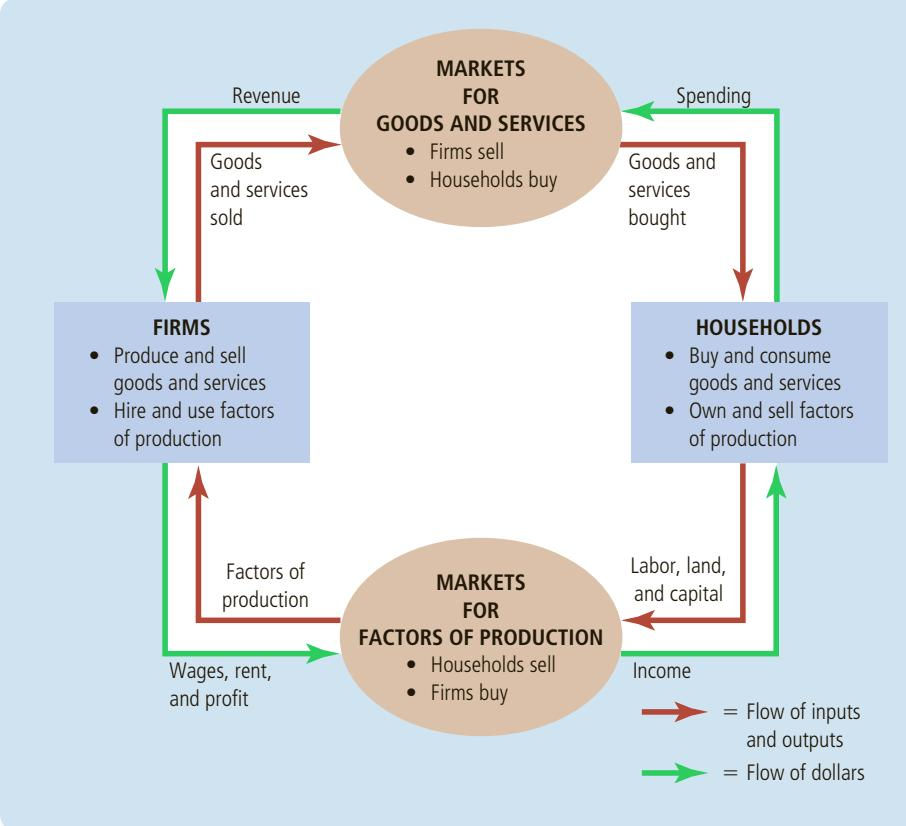
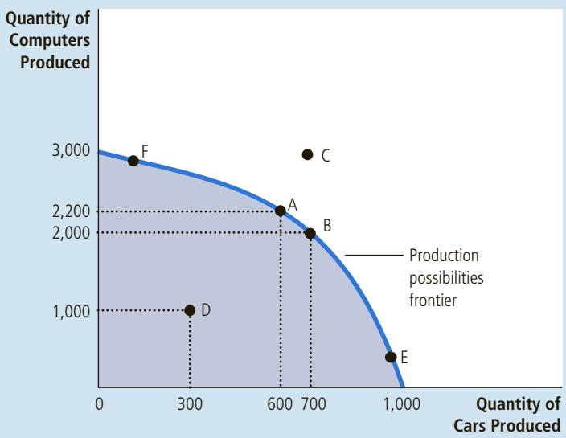
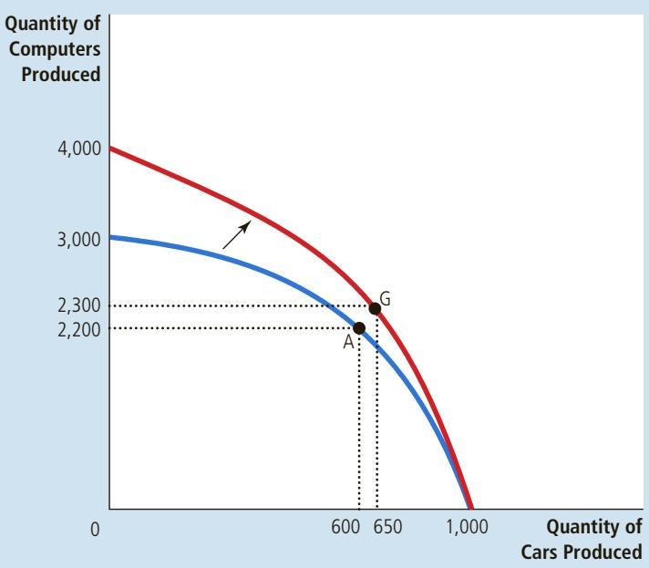

# Thinking Like an Economist

very field of study has its own language and its own way of thinking. Mathematicians talk about axioms, integrals, and vector spaces. Psychologists talk about ego, id, and cognitive dissonance. Lawyers talk about venue, torts, and promissory estoppel.

Economics is no different. Supply, demand, elasticity, comparative advantage, consumer surplus, deadweight loss—these terms are part of the economist’s language. In the coming chapters, you will encounter many new terms and some familiar words that economists use in specialized ways. At first, this new language may seem needlessly arcane. But as you will see, its value lies in its ability to provide you with a new and useful way of thinking about the world in which you live.

The purpose of this book is to help you learn the economist’s way of thinking. Just as you cannot become a mathematician, psychologist, or lawyer overnight, learning to think like an economist will take some time. Yet with a combination of theory, case studies, and examples of economics in the news, this book will give you ample opportunity to develop and practice this skill.

Before delving into the substance and details of economics, it is helpful to have an overview of how economists approach the world. This chapter discusses the field’s methodology. What is distinctive about how economists confront a question? What does it mean to think like an economist?

## 2-1 The Economist as Scientist

WWW.CARTOONBANK.COM © J.B. HANDELSMAN/ THE NEW YORKER COLLECTION/

  
“I’m a social scientist, Michael. That means I can’t explain electricity or anything like that, but if you ever want to know about people, I’m your man.”

Economists try to address their subject with a scientist’s objectivity. They approach the study of the economy in much the same way a physicist approaches the study of matter and a biologist approaches the study of life: They devise theories, collect data, and then analyze these data in an attempt to verify or refute their theories.

To beginners, the claim that economics is a science can seem odd. After all, economists do not work with test tubes or telescopes. The essence of science, however, is the scientific method—the dispassionate development and testing of theories about how the world works. This method of inquiry is as applicable to studying a nation’s economy as it is to studying the earth’s gravity or a species’ evolution. As Albert Einstein once put it, “The whole of science is nothing more than the refinement of everyday thinking.”

Although Einstein’s comment is as true for social sciences such as economics as it is for natural sciences such as physics, most people are not accustomed to looking at society through a scientific lens. Let’s discuss some of the ways economists apply the logic of science to examine how an economy works.

## 2-1a The Scientific Method: Observation, Theory, and More Observation

Isaac Newton, the famous 17th-century scientist and mathematician, allegedly became intrigued one day when he saw an apple fall from a tree. This observation motivated Newton to develop a theory of gravity that applies not only to an apple falling to the earth but to any two objects in the universe. Subsequent testing of Newton’s theory has shown that it works well in many circumstances (albeit not in all circumstances, as Einstein would later show). Because Newton’s theory has been so successful at explaining observation, it is still taught in undergraduate physics courses around the world.

This interplay between theory and observation also occurs in economics. An economist might live in a country experiencing rapidly increasing prices and be moved by this observation to develop a theory of inflation. The theory might assert that high inflation arises when the government prints too much money. To test this theory, the economist could collect and analyze data on prices and money from many different countries. If growth in the quantity of money were completely unrelated to the rate of price increase, the economist would start to doubt the validity of this theory of inflation. If money growth and inflation were strongly correlated in international data, as in fact they are, the economist would become more confident in the theory.

Although economists use theory and observation like other scientists, they face an obstacle that makes their task especially challenging: In economics, conducting experiments is often impractical. Physicists studying gravity can drop many objects in their laboratories to generate data to test their theories. By contrast, economists studying inflation are not allowed to manipulate a nation’s monetary policy simply to generate useful data. Economists, like astronomers and evolutionary biologists, usually have to make do with whatever data the world happens to give them.

To find a substitute for laboratory experiments, economists pay close attention to the natural experiments offered by history. When a war in the Middle East interrupts the supply of crude oil, for instance, oil prices skyrocket around the world. For consumers of oil and oil products, such an event depresses living standards. For economic policymakers, it poses a difficult choice about how best to respond. But for economic scientists, the event provides an opportunity to study the effects of a key natural resource on the world’s economies. Throughout this book, therefore, we consider many historical episodes. These episodes are valuable to study because they give us insight into the economy of the past and, more important, because they allow us to illustrate and evaluate economic theories of the present.

## 2-1b The Role of Assumptions

If you ask a physicist how long it would take a marble to fall from the top of a ten-story building, he will likely answer the question by assuming that the marble falls in a vacuum. Of course, this assumption is false. In fact, the building is surrounded by air, which exerts friction on the falling marble and slows it down. Yet the physicist will point out that the friction on the marble is so small that its effect is negligible. Assuming the marble falls in a vacuum simplifies the problem without substantially affecting the answer.

Economists make assumptions for the same reason: Assumptions can simplify the complex world and make it easier to understand. To study the effects of international trade, for example, we might assume that the world consists of only two countries and that each country produces only two goods. In reality, there are numerous countries, each of which produces thousands of different types of goods. But by considering a world with only two countries and two goods, we can focus our thinking on the essence of the problem. Once we understand international trade in this simplified imaginary world, we are in a better position to understand international trade in the more complex world in which we live.

The art in scientific thinking—whether in physics, biology, or economics— is deciding which assumptions to make. Suppose, for instance, that instead of dropping a marble from the top of the building, we were dropping a beach ball of the same weight. Our physicist would realize that the assumption of no friction is less accurate in this case: Friction exerts a greater force on the beach ball because it is much larger than a marble. The assumption that gravity works in a vacuum is reasonable when studying a falling marble but not when studying a falling beach ball.

Similarly, economists use different assumptions to answer different questions. Suppose that we want to study what happens to the economy when the government changes the number of dollars in circulation. An important piece of this analysis, it turns out, is how prices respond. Many prices in the economy change infrequently: The newsstand prices of magazines, for instance, change only once every few years. Knowing this fact may lead us to make different assumptions when studying the effects of the policy change over different time horizons. For studying the short-run effects of the policy, we may assume that prices do not change much. We may even make the extreme and artificial assumption that all prices are completely fixed. For studying the long-run effects of the policy, however, we may assume that all prices are completely flexible. Just as a physicist uses different assumptions when studying falling marbles and falling beach balls, economists use different assumptions when studying the short-run and long-run effects of a change in the quantity of money.

## 2-1c Economic Models

High school biology teachers teach basic anatomy with plastic replicas of the human body. These models have all the major organs—the heart, the liver, the kidneys, and so on—which allow teachers to show their students very simply how the important parts of the body fit together. Because these plastic models are stylized and omit many details, no one would mistake one of them for a real person. Despite this lack of realism—indeed, because of this lack of realism— studying these models is useful for learning how the human body works.

Economists also use models to learn about the world, but unlike plastic manikins, their models mostly consist of diagrams and equations. Like a biology teacher’s plastic model, economic models omit many details to allow us to see what is truly important. Just as the biology teacher’s model does not include all the body’s muscles and capillaries, an economist’s model does not include every feature of the economy.

As we use models to examine various economic issues throughout this book, you will see that all the models are built with assumptions. Just as a physicist begins the analysis of a falling marble by assuming away the existence of friction, economists assume away many details of the economy that are irrelevant to the question at hand. All models—in physics, biology, and economics—simplify reality to improve our understanding of it.

## 2-1d Our First Model: The Circular-Flow Diagram

The economy consists of millions of people engaged in many activities—buying, selling, working, hiring, manufacturing, and so on. To understand how the economy works, we must find some way to simplify our thinking about all these activities. In other words, we need a model that explains, in general terms, how the economy is organized and how participants in the economy interact with one another.

circular-flow diagram a visual model of the economy that shows how dollars flow through markets among households and firms

Figure 1 presents a visual model of the economy called a circular-flow diagram. In this model, the economy is simplified to include only two types of decision makers—firms and households. Firms produce goods and services using inputs, such as labor, land, and capital (buildings and machines). These inputs are called the factors of production. Households own the factors of production and consume all the goods and services that the firms produce.

Households and firms interact in two types of markets. In the markets for goods and services, households are buyers, and firms are sellers. In particular, households buy the output of goods and services that firms produce. In the markets for the factors of production, households are sellers, and firms are buyers. In these markets, households provide the inputs that firms use to produce goods and services. The circular-flow diagram offers a simple way of organizing the economic transactions that occur between households and firms in the economy.

The two loops of the circular-flow diagram are distinct but related. The inner loop represents the flows of inputs and outputs. The households sell the use of their labor, land, and capital to the firms in the markets for the factors of production. The firms then use these factors to produce goods and services, which in turn are sold to households in the markets for goods and services. The outer

## FIGURE 1

## The Circular Flow

This diagram is a schematic representation of the organization of the economy. Decisions are made by households and firms. Households and firms interact in the markets for goods and services (where households are buyers and firms are sellers) and in the markets for the factors of production (where firms are buyers and households are sellers). The outer set of arrows shows the flow of dollars, and the inner set of arrows shows the corresponding flow of inputs and outputs.

loop of the diagram represents the corresponding flow of dollars. The households spend money to buy goods and services from the firms. The firms use some of the revenue from these sales to pay for the factors of production, such as the wages of their workers. What’s left is the profit of the firm owners, who are themselves members of households.

Let’s take a tour of the circular flow by following a dollar bill as it makes its way from person to person through the economy. Imagine that the dollar begins at a household—say, in your wallet. If you want to buy a cup of coffee, you take the dollar (along with a few of its brothers and sisters) to one of the economy’s markets for goods and services, such as your local Starbucks coffee shop. There, you spend it on your favorite drink. When the dollar moves into the Starbucks cash register, it becomes revenue for the firm. The dollar doesn’t stay at Starbucks for long, however, because the firm uses it to buy inputs in the markets for the factors of production. Starbucks might use the dollar to pay rent to its landlord for the space it occupies or to pay the wages of its workers. In either case, the dollar enters the income of some household and, once again, is back in someone’s wallet. At that point, the story of the economy’s circular flow starts once again.

The circular-flow diagram in Figure 1 is a very simple model of the economy. A more complex and realistic circular-flow model would include, for instance, the roles of government and international trade. (A portion of that dollar you gave to Starbucks might be used to pay taxes or to buy coffee beans from a farmer in Brazil.) Yet these details are not crucial for a basic understanding of how the economy is organized. Because of its simplicity, this circular-flow diagram is useful to keep in mind when thinking about how the pieces of the economy fit together.

## 2-1e Our Second Model: The Production Possibilities Frontier

Most economic models, unlike the circular-flow diagram, are built using the tools of mathematics. Here we use one of the simplest such models, called the production possibilities frontier, to illustrate some basic economic ideas.

## production possibilities frontier

a graph that shows the combinations of output that the economy can possibly produce given the available factors of production and the available production technology

Although real economies produce thousands of goods and services, let’s consider an economy that produces only two goods—cars and computers. Together, the car industry and the computer industry use all of the economy’s factors of production. The production possibilities frontier is a graph that shows the various combinations of output—in this case, cars and computers— that the economy can possibly produce given the available factors of production and the available production technology that firms use to turn these factors into output.

Figure 2 shows this economy’s production possibilities frontier. If the economy uses all its resources in the car industry, it produces 1,000 cars and no computers. If it uses all its resources in the computer industry, it produces 3,000 computers and no cars. The two endpoints of the production possibilities frontier represent these extreme possibilities.

More likely, the economy divides its resources between the two industries, producing some cars and some computers. For example, it can produce 600 cars and 2,200 computers, shown in the figure by point A. Or, by moving some of the factors of production to the car industry from the computer industry, the economy can produce 700 cars and 2,000 computers, represented by point B.

Because resources are scarce, not every conceivable outcome is feasible. For example, no matter how resources are allocated between the two industries, the economy cannot produce the amount of cars and computers represented by point C. Given the technology available for manufacturing cars and computers, the economy does not have enough of the factors of production to support that level of output. With the resources it has, the economy can produce at any point on or

## FIGURE 2

## The Production Possibilities Frontier

The production possibilities frontier shows the combinations of output—in this case, cars and computers—that the economy can possibly produce. The economy can produce any combination on or inside the frontier. Points outside the frontier are not feasible given the economy’s resources. The slope of the production possibilities frontier measures the opportunity cost of a car in terms of computers. This opportunity cost varies, depending on how much of the two goods the economy is producing.

inside the production possibilities frontier, but it cannot produce at points outside the frontier.

An outcome is said to be efficient if the economy is getting all it can from the scarce resources it has available. Points on (rather than inside) the production possibilities frontier represent efficient levels of production. When the economy is producing at such a point, say point A, there is no way to produce more of one good without producing less of the other. Point D represents an inefficient outcome. For some reason, perhaps widespread unemployment, the economy is producing less than it could from the resources it has available: It is producing only 300 cars and 1,000 computers. If the source of the inefficiency is eliminated, the economy can increase its production of both goods. For example, if the economy moves from point D to point A, its production of cars increases from 300 to 600, and its production of computers increases from 1,000 to 2,200.

One of the Ten Principles of Economics discussed in Chapter 1 is that people face trade-offs. The production possibilities frontier shows one trade-off that society faces. Once we have reached an efficient point on the frontier, the only way of producing more of one good is to produce less of the other. When the economy moves from point A to point B, for instance, society produces 100 more cars at the expense of producing 200 fewer computers.

This trade-off helps us understand another of the Ten Principles of Economics: The cost of something is what you give up to get it. This is called the opportunity cost. The production possibilities frontier shows the opportunity cost of one good as measured in terms of the other good. When society moves from point A to point B, it gives up 200 computers to get 100 additional cars. That is, at point A, the opportunity cost of 100 cars is 200 computers. Put another way, the opportunity cost of each car is two computers. Notice that the opportunity cost of a car equals the slope of the production possibilities frontier. (If you don’t recall what slope is, you can refresh your memory with the graphing appendix to this chapter.)

The opportunity cost of a car in terms of the number of computers is not constant in this economy but depends on how many cars and computers the economy is producing. This is reflected in the shape of the production possibilities frontier. Because the production possibilities frontier in Figure 2 is bowed outward, the opportunity cost of a car is highest when the economy is producing many cars and few computers, such as at point E, where the frontier is steep. When the economy is producing few cars and many computers, such as at point F, the frontier is flatter, and the opportunity cost of a car is lower.

Economists believe that production possibilities frontiers often have this bowed shape. When the economy is using most of its resources to make computers, the resources best suited to car production, such as skilled autoworkers, are being used in the computer industry. Because these workers probably aren’t very good at making computers, increasing car production by one unit will cause only a slight reduction in the number of computers produced. Thus, at point F, the opportunity cost of a car in terms of computers is small, and the frontier is relatively flat. By contrast, when the economy is using most of its resources to make cars, such as at point E, the resources best suited to making cars are already at work in the car industry. Producing an additional car means moving some of the best computer technicians out of the computer industry and turning them into autoworkers. As a result, producing an additional car requires a substantial loss of computer output. The opportunity cost of a car is high, and the frontier is steep.

The production possibilities frontier shows the trade-off between the outputs of different goods at a given time, but the trade-off can change over time. For

## FIGURE 3

A Shift in the Production Possibilities Frontier A technological advance in the computer industry enables the economy to produce more computers for any given number of cars. As a result, the production possibilities frontier shifts outward. If the economy moves from point A to point G, then the production of both cars and computers increases.

example, suppose a technological advance in the computer industry raises the number of computers that a worker can produce per week. This advance expands society’s set of opportunities. For any given number of cars, the economy can now make more computers. If the economy does not produce any computers, it can still produce 1,000 cars, so one endpoint of the frontier stays the same. But if the economy devotes some of its resources to the computer industry, it will produce more computers from those resources. As a result, the production possibilities frontier shifts outward, as in Figure 3.

This figure illustrates what happens when an economy grows. Society can move production from a point on the old frontier to a point on the new frontier. Which point it chooses depends on its preferences for the two goods. In this example, society moves from point A to point G, enjoying more computers (2,300 instead of 2,200) and more cars (650 instead of 600).

The production possibilities frontier simplifies a complex economy to highlight some basic but powerful ideas: scarcity, efficiency, trade-offs, opportunity cost, and economic growth. As you study economics, these ideas will recur in various forms. The production possibilities frontier offers one simple way of thinking about them.

## 2-1f Microeconomics and Macroeconomics

Many subjects are studied on various levels. Consider biology, for example. Molecular biologists study the chemical compounds that make up living things. Cellular biologists study cells, which are made up of many chemical compounds and, at the same time, are themselves the building blocks of living organisms. Evolutionary biologists study the many varieties of animals and plants and how species change gradually over the centuries.

Economics is also studied on various levels. We can study the decisions of individual households and firms. Or we can study the interaction of households and firms in markets for specific goods and services. Or we can study the operation of the economy as a whole, which is the sum of the activities of all these decision makers in all these markets.

The field of economics is traditionally divided into two broad subfields. Microeconomics is the study of how households and firms make decisions and how they interact in specific markets. Macroeconomics is the study of economy-wide phenomena. A microeconomist might study the effects of rent control on housing in New York City, the impact of foreign competition on the U.S. auto industry, or the effects of compulsory school attendance on workers earnings. A macroeconomist might study the effects of borrowing by the federal government, the changes over time in the economy’s rate of unemployment, or alternative policies to promote growth in national living standards.

Microeconomics and macroeconomics are closely intertwined. Because changes in the overall economy arise from the decisions of millions of individuals, it is impossible to understand macroeconomic developments without considering the associated microeconomic decisions. For example, a macroeconomist might study the effect of a federal income tax cut on the overall production of goods and services. But to analyze this issue, he must consider how the tax cut affects households’ decisions about how much to spend on goods and services.

Despite the inherent link between microeconomics and macroeconomics, the two fields are distinct. Because they address different questions, each field has its own set of models, which are often taught in separate courses.

In what sense is economics like a science? • Draw a production possi-QuickQuiz bilities frontier for a society that produces food and clothing. Show an efficient point, an inefficient point, and an infeasible point. Show the effects of a drought. • Define microeconomics and macroeconomics.

## 2-2 The Economist as Policy Adviser

Often, economists are asked to explain the causes of economic events. Why, for example, is unemployment higher for teenagers than for older workers? Sometimes, economists are asked to recommend policies to improve economic outcomes. What, for instance, should the government do to improve the economic well-being of teenagers? When economists are trying to explain the world, they are scientists. When they are trying to help improve it, they are policy advisers.

## 2-2a Positive versus Normative Analysis

To help clarify the two roles that economists play, let’s examine the use of language. Because scientists and policy advisers have different goals, they use language in different ways.

For example, suppose that two people are discussing minimum-wage laws. Here are two statements you might hear:

portia: Minimum-wage laws cause unemployment.

noah: The government should raise the minimum wage.

Ignoring for now whether you agree with these statements, notice that Portia and Noah differ in what they are trying to do. Portia is speaking like a scientist: She

macroeconomics the study of economywide phenomena, including inflation, unemployment, and economic growth

is making a claim about how the world works. Noah is speaking like a policy adviser: He is making a claim about how he would like to change the world.

In general, statements about the world come in two types. One type, such as Portia’s, is positive. Positive statements are descriptive. They make a claim about how the world is. A second type of statement, such as Noah’s, is normative. Normative statements are prescriptive. They make a claim about how the world ought to be.

A key difference between positive and normative statements is how we judge their validity. We can, in principle, confirm or refute positive statements by examining evidence. An economist might evaluate Portia’s statement by analyzing data on changes in minimum wages and changes in unemployment over time. By contrast, evaluating normative statements involves values as well as facts. Noah’s statement cannot be judged using data alone. Deciding what is good or bad policy is not just a matter of science. It also involves our views on ethics, religion, and political philosophy.

Positive and normative statements are fundamentally different, but within a person’s set of beliefs, they are often intertwined. In particular, positive views about how the world works affect normative views about what policies are desirable. Portia’s claim that the minimum wage causes unemployment, if true, might lead her to reject Noah’s conclusion that the government should raise the minimum wage. Yet normative conclusions cannot come from positive analysis alone; they involve value judgments as well.

As you study economics, keep in mind the distinction between positive and normative statements because it will help you stay focused on the task at hand. Much of economics is positive: It just tries to explain how the economy works. Yet those who use economics often have normative goals: They want to learn how to improve the economy. When you hear economists making normative statements, you know they are speaking not as scientists but as policy advisers.

COLLECTION/ WWW.CARTOONBANK.COM © JAMES STEVENSON/ THE NEW YORKER

## 2-2b Economists in Washington

  
“Let’s switch. I’ll make the policy, you implement it, and he’ll explain it. “

President Harry Truman once said that he wanted to find a one-armed economist. When he asked his economists for advice, they always answered, “On the one hand, . . . . On the other hand, . . . .“

Truman was right in realizing that economists’ advice is not always straightforward. This tendency is rooted in one of the Ten Principles of Economics: People face trade-offs. Economists are aware that trade-offs are involved in most policy decisions. A policy might increase efficiency at the cost of equality. It might help future generations but hurt current generations. An economist who says that all policy decisions are easy or clear-cut is an economist not to be trusted.

Truman was not the only president who relied on the advice of economists. Since 1946, the president of the United States has received guidance from the Council of Economic Advisers, which consists of three members and a staff of a few dozen economists. The council, whose offices are just a few steps from the White House, has no duty other than to advise the president and to write the annual Economic Report of the President, which discusses recent developments in the economy and presents the council’s analysis of current policy issues.

The president also receives input from economists in many administrative departments. Economists at the Office of Management and Budget help formulate spending plans and regulatory policies. Economists at the Department of the Treasury help design tax policy. Economists at the Department of Labor analyze data on workers and those looking for work to help formulate labor-market policies. Economists at the Department of Justice help enforce the nation’s antitrust laws.

Economists are also found outside the administrative branch of government. To obtain independent evaluations of policy proposals, Congress relies on the advice of the Congressional Budget Office, which is staffed by economists. The Federal Reserve, the institution that sets the nation’s monetary policy, employs hundreds of economists to analyze economic developments in the United States and throughout the world.

The influence of economists on policy goes beyond their role as advisers: Their research and writings often affect policy indirectly. Economist John Maynard Keynes offered this observation:

The ideas of economists and political philosophers, both when they are right and when they are wrong, are more powerful than is commonly understood. Indeed, the world is ruled by little else. Practical men, who believe themselves to be quite exempt from intellectual influences, are usually the slaves of some defunct economist. Madmen in authority, who hear voices in the air, are distilling their frenzy from some academic scribbler of a few years back.

These words were written in 1935, but they remain true today. Indeed, the “academic scribbler” now influencing public policy is often Keynes himself.

## 2-2c Why Economists’ Advice Is Not Always Followed

Any economist who advises presidents or other elected leaders knows that his recommendations are not always heeded. Frustrating as this can be, it is easy to understand. The process by which economic policy is actually made differs in many ways from the idealized policy process assumed in economics textbooks.

Throughout this text, whenever we discuss economic policy, we often focus on one question: What is the best policy for the government to pursue? We act as if policy were set by a benevolent king. Once the king figures out the right policy, he has no trouble putting his ideas into action.

In the real world, figuring out the right policy is only part of a leader’s job, sometimes the easiest part. After a president hears from his economic advisers about what policy is best from their perspective, he turns to other advisers for related input. His communications advisers will tell him how best to explain the proposed policy to the public, and they will try to anticipate any misunderstandings that might make the challenge more difficult. His press advisers will tell him how the news media will report on his proposal and what opinions will likely be expressed on the nation’s editorial pages. His legislative affairs advisers will tell him how Congress will view the proposal, what amendments members of Congress will suggest, and the likelihood that Congress will pass some version of the president’s proposal into law. His political advisers will tell him which groups will organize to support or oppose the proposed policy, how this proposal will affect his standing among different groups in the electorate, and whether it will change support for any of the president’s other policy initiatives. After hearing and weighing all this advice, the president then decides how to proceed.

Making economic policy in a representative democracy is a messy affair— and there are often good reasons why presidents (and other politicians) do not advance the policies that economists advocate. Economists offer crucial input to the policy process, but their advice is only one ingredient of a complex recipe.

Give an example of a positive statement and an example of a normative statement that somehow relates to your daily life. • Name three parts of that regularly rely on advice from economists.

## 2-3 Why Economists Disagree

“If all economists were laid end to end, they would not reach a conclusion.” This quip from George Bernard Shaw is revealing. Economists as a group are often criticized for giving conflicting advice to policymakers. President Ronald Reagan once joked that if the game Trivial Pursuit were designed for economists, it would have 100 questions and 3,000 answers.

Why do economists so often appear to give conflicting advice to policymakers? There are two basic reasons:

• Economists may disagree about the validity of alternative positive theories of how the world works.

• Economists may have different values and therefore different normative views about what government policy should aim to accomplish.

Let’s discuss each of these reasons.

## 2-3a Differences in Scientific Judgments

Several centuries ago, astronomers debated whether the earth or the sun was at the center of the solar system. More recently, climatologists have debated whether the earth is experiencing global warming and, if so, why. Science is an ongoing search to understand the world around us. It is not surprising that as the search continues, scientists sometimes disagree about the direction in which truth lies.

Economists often disagree for the same reason. Economics is a young science, and there is still much to be learned. Economists sometimes disagree because they have different hunches about the validity of alternative theories or about the size of important parameters that measure how economic variables are related.

For example, economists disagree about whether the government should tax a household’s income or its consumption (spending). Advocates of a switch from the current income tax to a consumption tax believe that the change would encourage households to save more because income that is saved would not be taxed. Higher saving, in turn, would free resources for capital accumulation, leading to more rapid growth in productivity and living standards. Advocates of the current income tax system believe that household saving would not respond much to a change in the tax laws. These two groups of economists hold different normative views about the tax system because they have different positive views about saving’s responsiveness to tax incentives.

## 2-3b Differences in Values

Suppose that Peter and Paula both take the same amount of water from the town well. To pay for maintaining the well, the town taxes its residents. Peter has income of \$150,000 and is taxed \$15,000, or 10 percent of his income. Paula has income of \$30,000 and is taxed \$6,000, or 20 percent of her income.

Is this policy fair? If not, who pays too much and who pays too little? Does it matter whether Paula’s low income is due to a medical disability or to her decision to pursue an acting career? Does it matter whether Peter’s high income is due to a large inheritance or to his willingness to work long hours at a dreary job?

These are difficult questions about which people are likely to disagree. If the town hired two experts to study how it should tax its residents to pay for the well, we would not be surprised if they offered conflicting advice.

This simple example shows why economists sometimes disagree about public policy. As we know from our discussion of normative and positive analysis, policies cannot be judged on scientific grounds alone. Sometimes, economists give conflicting advice because they have different values. Perfecting the science of economics will not tell us whether Peter or Paula pays too much.

## 2-3c Perception versus Reality

Because of differences in scientific judgments and differences in values, some disagreement among economists is inevitable. Yet one should not overstate the amount of disagreement. Economists agree with one another to a much greater extent than is sometimes understood.

Table 1 contains twenty propositions about economic policy. In surveys of professional economists, these propositions were endorsed by an overwhelming

## Proposition (and percentage of economists who agree)

1. A ceiling on rents reduces the quantity and quality of housing available. (93%)

2. Tariffs and import quotas usually reduce general economic welfare. (93%)

3. Flexible and floating exchange rates offer an effective international monetary arrangement. (90%)

4. Fiscal policy (for example, tax cut and/or government expenditure increase) has a significant stimulative impact on a less than fully employed economy. (90%)

5. The United States should not restrict employers from outsourcing work to foreign countries. (90%)

6. Economic growth in developed countries like the United States leads to greater levels of well-being. (88%)

7. The United States should eliminate agricultural subsidies. (85%)

8. An appropriately designed fiscal policy can increase the long-run rate of capital formation. (85%)

9. Local and state governments should eliminate subsidies to professional sports franchises. (85%)

10. If the federal budget is to be balanced, it should be done over the business cycle rather than yearly. (85%)

11. The gap between Social Security funds and expenditures will become unsustainably large within the next 50 years if current policies remain unchanged. (85%)

12. Cash payments increase the welfare of recipients to a greater degree than do transfers-inkind of equal cash value. (84%)

13. A large federal budget deficit has an adverse effect on the economy. (83%)

14. The redistribution of income in the United States is a legitimate role for the government. (83%)

15. Inflation is caused primarily by too much growth in the money supply. (83%)

16. The United States should not ban genetically modified crops. (82%)

17. A minimum wage increases unemployment among young and unskilled workers. (79%)

18. The government should restructure the welfare system along the lines of a “negative income tax.” (79%)

19. Effluent taxes and marketable pollution permits represent a better approach to pollution control than the imposition of pollution ceilings. (78%)

20. Government subsidies on ethanol in the United States should be reduced or eliminated. (78%)

## TABLE 1

Propositions about Which Most Economists Agree

