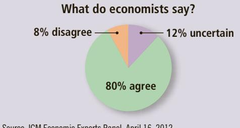

# ASK THE EXPERTS

## Ticket Resale

“Laws that limit the resale of tickets for entertainment and sports events make potential audience members for those events worse off on average.”

  
Source: IGM Economic Experts Panel, April 16, 2012.

majority of respondents. Most of these propositions would fail to command a similar consensus among the public.

The first proposition in the table is about rent control, a policy that sets a legal maximum on the amount landlords can charge for their apartments. Almost all economists believe that rent control adversely affects the availability and quality of housing and is a costly way of helping the neediest members of society. Nonetheless, many city governments ignore the advice of economists and place ceilings on the rents that landlords may charge their tenants.

The second proposition in the table concerns tariffs and import quotas, two policies that restrict trade among nations. For reasons we discuss more fully later in this text, almost all economists oppose such barriers to free trade. Nonetheless, over the years, presidents and Congress have chosen to restrict the import of certain goods.

Why do policies such as rent control and trade barriers persist if the experts are united in their opposition? It may be that the realities of the political process stand as immovable obstacles. But it also may be that economists have not yet convinced enough of the public that these policies are undesirable. One purpose of this book is to help you understand the economist’s view on these and other subjects and, perhaps, to persuade you that it is the right one.

As you read the book, you will occasionally see small boxes called “Ask the Experts.” These are based on the IGM Economics Experts Panel, an ongoing survey of several dozen of the world’s most prominent economists. Every few weeks, these experts are offered a proposition and then asked whether they agree with it, disagree with it, or are uncertain. The results in these boxes will give you a sense of when economists are united, when they are divided, and when they just don’t know what to think.

You can see an example here regarding the resale of tickets to entertainment and sporting events. Lawmakers sometimes try to prohibit reselling tickets, or “scalping” as it is sometimes called. The survey results show that many economists side with the scalpers rather than the lawmakers.

QuickQuiz

Why might economic advisers to the president disagree about a question of policy?

## 2-4 Let’s Get Going

The first two chapters of this book have introduced you to the ideas and methods of economics. We are now ready to get to work. In the next chapter, we start learning in more detail the principles of economic behavior and economic policy.

As you proceed through this book, you will be asked to draw on many of your intellectual skills. You might find it helpful to keep in mind some advice from the great economist John Maynard Keynes:

The study of economics does not seem to require any specialized gifts of an unusually high order. Is it not . . . a very easy subject compared with the higher branches of philosophy or pure science? An easy subject, at which very few
