# IN THE NEWS

# Why You Should Study Economics

In this excerpt from a commencement address, the former president of the Federal Reserve Bank of Dallas makes the case for studying economics.

## The Dismal Science? Hardly!

By Robert D. McTeer, Jr.

y take on training in economics is that it becomes increasingly valuable as you move up the career ladder. I can’t imagine a better major for corporate CEOs, congressmen, or American presidents. You’ve learned a systematic, disciplined way of thinking that will serve you well. By contrast, the economically challenged must be perplexed about how it is that economies work better the fewer people they have in charge. Who does the planning? Who makes decisions? Who decides what to produce?

For my money, Adam Smith’s invisible hand is the most important thing you’ve learned by studying economics. You understand how we can each work for our own self-interest and still produce a desirable social outcome. You know how uncoordinated activity gets coordinated by the market to enhance the wealth of nations. You understand the magic of markets and the dangers of tampering with them too much. You know better what you first learned in kindergarten: that you shouldn’t kill or cripple the goose that lays the golden eggs. . . .

Economics training will help you understand fallacies and unintended consequences. In fact, I am inclined to define economics as the study of how to anticipate unintended consequences. . . .

Little in the literature seems more relevant to contemporary economic debates than what usually is called the broken window fallacy. Whenever a government program is justified not on its merits but by the jobs it will create, remember the broken window: Some teenagers, being the little beasts that they are, toss a brick through a bakery window. A crowd gathers and laments, “What a shame.” But before you know it, someone suggests a silver lining to the situation: Now the baker will have to spend money to have the window repaired. This will add to the income of the repairman, who will spend his additional income, which will add to another seller’s income, and so on. You know the drill. The chain of spending will multiply and generate higher income and employment. If the broken window is large enough, it might produce an economic boom! . . .

Most voters fall for the broken window fallacy, but not economics majors. They will say, “Hey, wait a minute!” If the baker hadn’t spent his money on window repair, he would have spent it on the new suit he was saving to buy. Then the tailor would have the new income to spend, and so on. The broken window didn’t create net new spending; it just diverted spending from somewhere else. The broken window does not create new activity, just different activity. People see the activity that takes place. They don’t see the activity that would have taken place.

The broken window fallacy is perpetuated in many forms. Whenever job creation or retention is the primary objective I call it the job-counting fallacy. Economics majors understand the non-intuitive reality that real progress comes from job destruction. It once took 90 percent of our population to grow our food. Now it takes 3 percent. Pardon me, Willie, but are we worse off because of the job losses in agriculture? The would-have-been farmers are now college professors and computer gurus. . . .

So instead of counting jobs, we should make every job count. We will occasionally hit a soft spot when we have a mismatch of supply and demand in the labor market. But that is temporary. Don’t become a Luddite and destroy the machinery, or become a protectionist and try to grow bananas in New York City. ■

Source: The Wall Street Journal, June 4, 2003.

excel! The paradox finds its explanation, perhaps, in that the master-economist must possess a rare combination of gifts. He must be mathematician, historian, statesman, philosopher—in some degree. He must understand symbols and speak in words. He must contemplate the particular in terms of the general, and touch abstract and concrete in the same flight of thought. He must study the present in the light of the past for the purposes of the future. No part of man’s nature or his institutions must lie entirely outside his regard. He must be purposeful and disinterested in a simultaneous mood; as aloof and incorruptible as an artist, yet sometimes as near the earth as a politician.

This is a tall order. But with practice, you will become more and more accustomed to thinking like an economist.

## Chapter QuickQuiz

## 1. An economic model is

a. a mechanical machine that replicates the functioning of the economy.

b. a fully detailed, realistic description of the economy.

c. a simplified representation of some aspect of the economy.

d. a computer program that predicts the future of the economy.

2. The circular-flow diagram illustrates that, in markets for the factors of production,

a. households are sellers, and firms are buyers.

b. households are buyers, and firms are sellers.

c. households and firms are both buyers.

d. households and firms are both sellers.

3. A point inside the production possibilities frontier is a. efficient but not feasible.

b. feasible but not efficient.

c. both efficient and feasible.

d. neither efficient nor feasible.

4. An economy produces hot dogs and hamburgers. If a discovery of the remarkable health benefits of hot dogs were to change consumers’ preferences, it would a. expand the production possibilities frontier.

b. contract the production possibilities frontier.

c. move the economy along the production possibilities frontier.

d. move the economy inside the production possibilities frontier.

5. All of the following topics fall within the study of microeconomics EXCEPT

a. the impact of cigarette taxes on the smoking behavior of teenagers.

b. the role of Microsoft’s market power in the pricing of software.

c. the effectiveness of antipoverty programs in reducing homelessness.

d. the influence of the government budget deficit on economic growth.

6. Which of the following is a positive, rather than a normative, statement?

a. Law X will reduce national income.

b. Law X is a good piece of legislation.

c. Congress ought to pass law X.

d. The president should veto law X.

## SUMMARY

Economists try to address their subject with a scientist’s objectivity. Like all scientists, they make appropriate assumptions and build simplified models to understand the world around them. Two simple economic models are the circular-flow diagram and the production possibilities frontier.

The field of economics is divided into two subfields: microeconomics and macroeconomics. Microeconomists study decision making by households and firms and the interactions among households and firms in the marketplace. Macroeconomists study the forces and trends that affect the economy as a whole.

## KEY CONCEPTS

A positive statement is an assertion about how the world is. A normative statement is an assertion about how the world ought to be. When economists make normative statements, they are acting more as policy advisers than as scientists.

Economists who advise policymakers sometimes offer conflicting advice either because of differences in scientific judgments or because of differences in values. At other times, economists are united in the advice they offer, but policymakers may choose to ignore the advice because of the many forces and constraints imposed by the political process.

circular-flow diagram, p. 22 production possibilities frontier, p. 24

## QUESTIONS FOR REVIEW

1. In what ways is economics a science?

2. Why do economists make assumptions?

3. Should an economic model describe reality exactly?

4. Name a way that your family interacts in the factor market and a way that it interacts in the product market.

5. Name one economic interaction that isn’t covered by the simplified circular-flow diagram.

6. Draw and explain a production possibilities frontier for an economy that produces milk and cookies. What happens to this frontier if a disease kills half of the economy’s cows?

7. Use a production possibilities frontier to describe the idea of “efficiency.”

8. What are the two subfields into which economics is divided? Explain what each subfield studies.

9. What is the difference between a positive and a normative statement? Give an example of each.

10. Why do economists sometimes offer conflicting advice to policymakers?

## PROBLEMS AND APPLICATIONS

1. Draw a circular-flow diagram. Identify the parts of the model that correspond to the flow of goods and services and the flow of dollars for each of the following activities.

a. Selena pays a storekeeper \$1 for a quart of milk.

b. Stuart earns \$8 per hour working at a fast-food restaurant.

c. Shanna spends \$40 to get a haircut.

d. Salma earns \$20,000 from her 10 percent ownership of Acme Industrial.

2. Imagine a society that produces military goods and consumer goods, which we’ll call “guns” and “butter.”

a. Draw a production possibilities frontier for guns and butter. Using the concept of opportunity cost, explain why it most likely has a bowed-out shape.

b. Show a point that is impossible for the economy to achieve. Show a point that is feasible but inefficient.

c. Imagine that the society has two political parties, called the Hawks (who want a strong military) and the Doves (who want a smaller military). Show a point on your production possibilities frontier that the Hawks might choose and a point that the Doves might choose.

d. Imagine that an aggressive neighboring country reduces the size of its military. As a result, both the Hawks and the Doves reduce their desired production of guns by the same amount. Which party would get the bigger “peace dividend,” measured by the increase in butter production? Explain.

3. The first principle of economics discussed in Chapter 1 is that people face trade-offs. Use a production possibilities frontier to illustrate society’s trade-off between two “goods”—a clean environment and the quantity of industrial output. What do you suppose determines the shape and position of the frontier? Show what happens to the frontier if engineers develop a new way of producing electricity that emits fewer pollutants.

4. An economy consists of three workers: Larry, Moe, and Curly. Each works 10 hours a day and can produce two services: mowing lawns and washing cars. In an hour, Larry can either mow one lawn or wash one car; Moe can either mow one lawn or wash two cars; and Curly can either mow two lawns or wash one car.

a. Calculate how much of each service is produced under the following circumstances, which we label A, B, C, and D:

• All three spend all their time mowing lawns. (A)

• All three spend all their time washing cars. (B)

All three spend half their time on each activity. (C)

Larry spends half his time on each activity, while Moe only washes cars and Curly only mows lawns. (D)

b. Graph the production possibilities frontier for this economy. Using your answers to part a, identify points A, B, C, and D on your graph.

c. Explain why the production possibilities frontier has the shape it does.

d. Are any of the allocations calculated in part a inefficient? Explain.

5. Classify the following topics as relating to microeconomics or macroeconomics.

a. a family’s decision about how much income to save

b. the effect of government regulations on auto emissions

c. the impact of higher national saving on economic growth

d. a firm’s decision about how many workers to hire

e. the relationship between the inflation rate and changes in the quantity of money

6. Classify each of the following statements as positive or normative. Explain.

a. Society faces a short-run trade-off between inflation and unemployment.

b. A reduction in the rate of money growth will reduce the rate of inflation.

c. The Federal Reserve should reduce the rate of money growth.

d. Society ought to require welfare recipients to look for jobs.

e. Lower tax rates encourage more work and more saving.

To find additional study resources, visit cengagebrain.com, and search for “Mankiw.”

## Graphing: A Brief Review

Many of the concepts that economists study can be expressed with numbers—the price of bananas, the quantity of bananas sold, the cost of growing bananas, and so on. Often, these economic variables are related to one another: When the price of bananas rises, people buy fewer bananas. One way of expressing the relationships among variables is with graphs.

Graphs serve two purposes. First, when developing economic theories, graphs offer a visual way to express ideas that might be less clear if described with equations or words. Second, when analyzing economic data, graphs provide a powerful way of finding and interpreting patterns. Whether we are working with theory or with data, graphs provide a lens through which a recognizable forest emerges from a multitude of trees.

Numerical information can be expressed graphically in many ways, just as there are many ways to express a thought in words. A good writer chooses words that will make an argument clear, a description pleasing, or a scene dramatic. An effective economist chooses the type of graph that best suits the purpose at hand.

In this appendix, we discuss how economists use graphs to study the mathematical relationships among variables. We also discuss some of the pitfalls that can arise in the use of graphical methods.

## Graphs of a Single Variable

Three common graphs are shown in Figure A-1. The pie chart in panel (a) shows how total income in the United States is divided among the sources of income, including compensation of employees, corporate profits, and so on. A slice of the pie represents each source’s share of the total. The bar graph in panel (b) compares income in four countries. The height of each bar represents the average income in each country. The time-series graph in panel (c) traces the rising productivity in the U.S. business sector over time. The height of the line shows output per hour in each year. You have probably seen similar graphs in newspapers and magazines.

## Graphs of Two Variables: The Coordinate System

The three graphs in Figure A-1 are useful in showing how a variable changes over time or across individuals, but they are limited in how much they can tell us. These graphs display information only about a single variable. Economists are often concerned with the relationships between variables. Thus, they need to display two variables on a single graph. The coordinate system makes this possible.

Suppose you want to examine the relationship between study time and grade point average. For each student in your class, you could record a pair of numbers: hours per week spent studying and grade point average. These numbers could then be placed in parentheses as an ordered pair and appear as a single point on the graph. Albert E., for instance, is represented by the ordered pair (25 hours/week, 3.5 GPA),

## FIGURE A-1

Types of Graphs

The pie chart in panel (a) shows how U.S. national income is derived from various sources. The bar graph in panel (b) compares the average income in four countries. The time-series graph in panel (c) shows the productivity of labor in U.S. businesses over time.

(a) Pie Chart

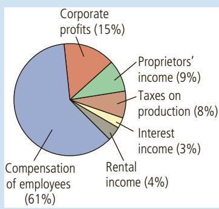

(b) Bar Graph  
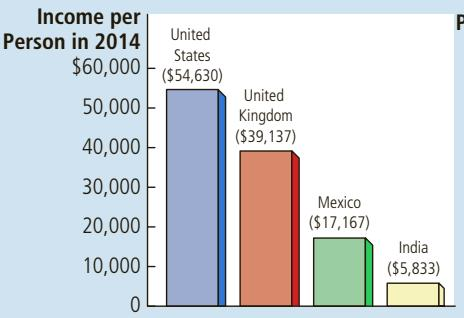

(c) Time-Series Graph  
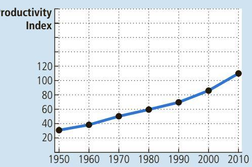

while his “what-me-worry?” classmate Alfred E. is represented by the ordered pair (5 hours/week, 2.0 GPA).

We can graph these ordered pairs on a two-dimensional grid. The first number in each ordered pair, called the x-coordinate, tells us the horizontal location of the point. The second number, called the y-coordinate, tells us the vertical location of the point. The point with both an x-coordinate and a y-coordinate of zero is known as the origin. The two coordinates in the ordered pair tell us where the point is located in relation to the origin: x units to the right of the origin and y units above it.

Figure A-2 graphs grade point average against study time for Albert E., Alfred E., and their classmates. This type of graph is called a scatter plot because it plots

## FIGURE A-2

## Using the Coordinate System

Grade point average is measured on the vertical axis and study time on the horizontal axis. Albert E., Alfred E., and their classmates are represented by various points. We can see from the graph that students who study more tend to get higher grades.

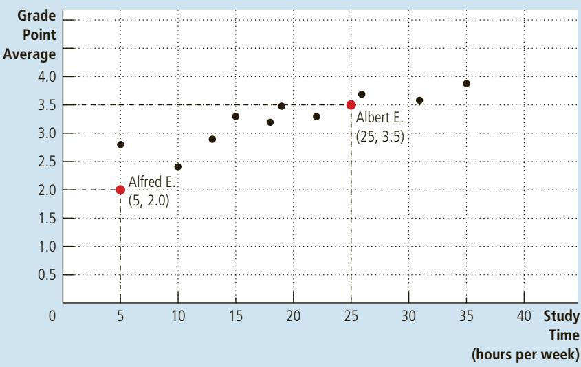

scattered points. Looking at this graph, we immediately notice that points farther to the right (indicating more study time) also tend to be higher (indicating a better grade point average). Because study time and grade point average typically move in the same direction, we say that these two variables have a positive correlation. By contrast, if we were to graph party time and grades, we would likely find that higher party time is associated with lower grades. Because these variables typically move in opposite directions, we say that they have a negative correlation. In either case, the coordinate system makes the correlation between two variables easy to see.

## Curves in the Coordinate System

Students who study more do tend to get higher grades, but other factors also influence a student’s grades. Previous preparation is an important factor, for instance, as are talent, attention from teachers, even eating a good breakfast. A scatter plot like Figure A-2 does not attempt to isolate the effect that studying has on grades from the effects of other variables. Often, however, economists prefer looking at how one variable affects another, holding everything else constant.

To see how this is done, let’s consider one of the most important graphs in economics: the demand curve. The demand curve traces out the effect of a good’s price on the quantity of the good consumers want to buy. Before showing a demand curve, however, consider Table A-1, which shows how the number of novels that Emma buys depends on her income and on the price of novels. When novels are cheap, Emma buys them in large quantities. As they become more expensive, she instead borrows books from the library or chooses to go to the movies rather than read. Similarly, at any given price, Emma buys more novels when she has a higher income. That is, when her income increases, she spends part of the additional income on novels and part on other goods.

We now have three variables—the price of novels, income, and the number of novels purchased—which is more than we can represent in two dimensions. To put the information from Table A-1 in graphical form, we need to hold one of the three variables constant and trace out the relationship between the other two. Because the demand curve represents the relationship between price and quantity demanded, we hold Emma’s income constant and show how the number of novels she buys varies with the price of novels.

<table><tr><td>Price</td><td>For $30,000 Income:</td><td>For $40,000 Income:</td><td>For $50,000 Income:</td></tr><tr><td>$10</td><td>2 novels</td><td>5 novels</td><td>8 novels</td></tr><tr><td>9</td><td>6</td><td>9</td><td>12</td></tr><tr><td>8</td><td>10</td><td>13</td><td>16</td></tr><tr><td>7</td><td>14</td><td>17</td><td>20</td></tr><tr><td>6</td><td>18</td><td>21</td><td>24</td></tr><tr><td>5</td><td>22</td><td>25</td><td>28</td></tr><tr><td></td><td>Demand curve,  $D_3$ </td><td>Demand curve,  $D_1$ </td><td>Demand curve,  $D_2$ </td></tr></table>

## TABLE A-1

## Novels Purchased by Emma

This table shows the number of novels Emma buys at various incomes and prices. For any given level of income, the data on price and quantity demanded can be graphed to produce Emma’s demand curve for novels, as shown in Figures A-3 and A-4.

## FIGURE A-3

## Demand Curve

The line $D _ { 1 }$ shows how Emma’s purchases of novels depend on the price of novels when her income is held constant. Because the price and the quantity demanded are negatively related, the demand curve slopes downward.

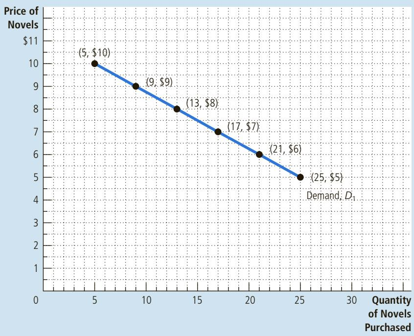

Suppose that Emma’s income is \$40,000 per year. If we place the number of novels Emma purchases on the x-axis and the price of novels on the y-axis, we can graphically represent the middle column of Table A-1. When the points that represent these entries from the table—(5 novels, \$10), (9 novels, \$9), and so on—are connected, they form a line. This line, pictured in Figure A-3, is known as Emma’s demand curve for novels; it tells us how many novels Emma purchases at any given price, holding income constant. The demand curve is downward-sloping, indicating that a higher price reduces the quantity of novels demanded. Because the quantity of novels demanded and the price move in opposite directions, we say that the two variables are negatively related. (Conversely, when two variables move in the same direction, the curve relating them is upward-sloping, and we say that the variables are positively related.)

Now suppose that Emma’s income rises to \$50,000 per year. At any given price, Emma will purchase more novels than she did at her previous level of income. Just as earlier we drew Emma’s demand curve for novels using the entries from the middle column of Table A-1, we now draw a new demand curve using the entries from the right column of the table. This new demand curve (curve $D _ { 2 } )$ is pictured alongside the old one (curve $D _ { 1 } )$ in Figure A-4; the new curve is a similar line drawn farther to the right. We therefore say that Emma’s demand curve for novels shifts to the right when her income increases. Likewise, if Emma’s income were to fall to \$30,000 per year, she would buy fewer novels at any given price and her demand curve would shift to the left (to curve $D _ { 3 } )$

In economics, it is important to distinguish between movements along a curve and shifts of a curve. As we can see from Figure A-3, if Emma earns \$40,000 per year and novels cost \$8 apiece, she will purchase 13 novels per year. If the price of

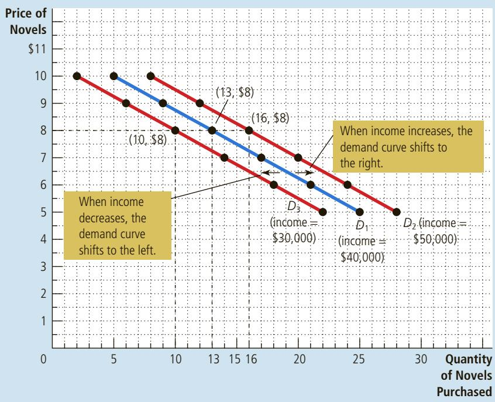

## FIGURE A-4

## Shifting Demand Curves

The location of Emma’s demand curve for novels depends on how much income she earns. The more she earns, the more novels she will purchase at any given price, and the farther to the right her demand curve will lie. Curve $D _ { 1 }$ represents Emma’s original demand curve when her income is \$40,000 per year. If her income rises to \$50,000 per year, her demand curve shifts to $D _ { 2 } .$ If her income falls to \$30,000 per year, her demand curve shifts to $D _ { 3 } .$

novels falls to \$7, Emma will increase her purchases of novels to 17 per year. The demand curve, however, stays fixed in the same place. Emma still buys the same number of novels at each price, but as the price falls, she moves along her demand curve from left to right. By contrast, if the price of novels remains fixed at \$8 but her income rises to \$50,000, Emma increases her purchases of novels from 13 to 16 per year. Because Emma buys more novels at each price, her demand curve shifts out, as shown in Figure A-4.

There is a simple way to tell when it is necessary to shift a curve: When a relevant variable that is not named on either axis changes, the curve shifts. Income is on neither the x-axis nor the y-axis of the graph, so when Emma’s income changes, her demand curve must shift. The same is true for any change that affects Emma’s purchasing habits, with the sole exception of a change in the price of novels. If, for instance, the public library closes and Emma must buy all the books she wants to read, she will demand more novels at each price, and her demand curve will shift to the right. Or if the price of movies falls and Emma spends more time at the movies and less time reading, she will demand fewer novels at each price, and her demand curve will shift to the left. By contrast, when a variable on an axis of the graph changes, the curve does not shift. We read the change as a movement along the curve.

## Slope

One question we might want to ask about Emma is how much her purchasing habits respond to price. Look at the demand curve pictured in Figure A-5. If this curve is very steep, Emma purchases nearly the same number of novels regardless

## FIGURE A-5

## Calculating the Slope of a Line

To calculate the slope of the demand curve, we can look at the changes in the x- and y-coordinates as we move from the point (21 novels, \$6) to the point (13 novels, \$8). The slope of the line is the ratio of the change in the y-coordinate (−2) to the change in the x-coordinate (+8), which equals −¼.

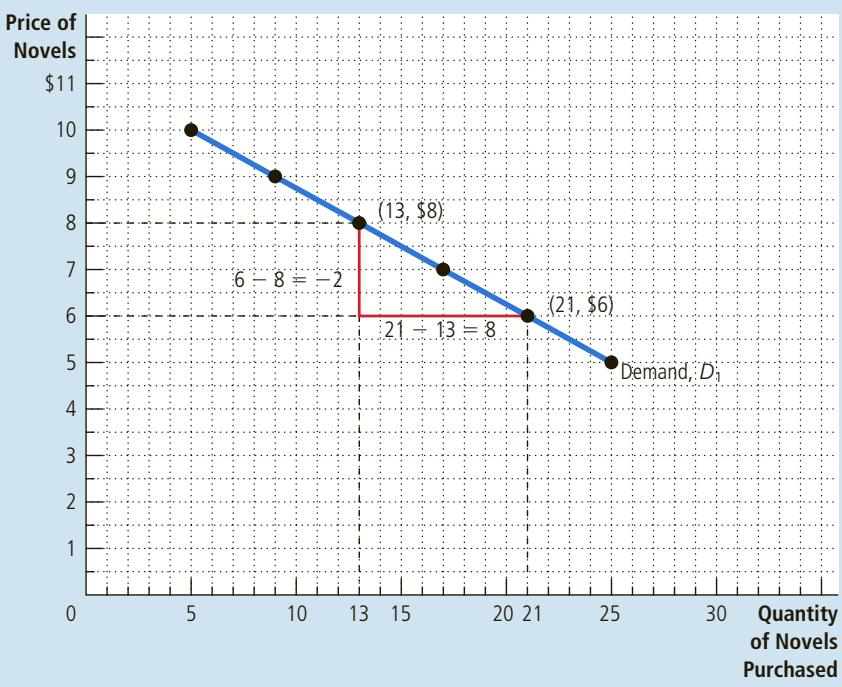

of whether they are cheap or expensive. If this curve is much flatter, the number of novels Emma purchases is more sensitive to changes in the price. To answer questions about how much one variable responds to changes in another variable, we can use the concept of slope.

The slope of a line is the ratio of the vertical distance covered to the horizontal distance covered as we move along the line. This definition is usually written out in mathematical symbols as follows:

$$
\text {slope} = \frac {\Delta y}{\Delta x},
$$

where the Greek letter Δ (delta) stands for the change in a variable. In other words, the slope of a line is equal to the “rise” (change in y) divided by the “run” (change in x). The slope will be a small positive number for a fairly flat upward-sloping line, a large positive number for a steep upward-sloping line, and a negative number for a downward-sloping line. A horizontal line has a slope of zero because in this case the y-variable never changes; a vertical line is said to have an infinite slope because the y-variable can take any value without the x-variable changing at all.

What is the slope of Emma’s demand curve for novels? First of all, because the curve slopes down, we know the slope will be negative. To calculate a numerical value for the slope, we must choose two points on the line. With Emma’s income at \$40,000, she will purchase 21 novels at a price of \$6 or 13 novels at a price of \$8. When we apply the slope formula, we are concerned with the change between these two points. In other words, we are concerned with the difference between them, which lets us know that we will have to subtract one set of values from the other, as follows:

$$
\text {slope} = \frac {\Delta y}{\Delta x} = \frac {\text {first} y \text {-coordinate - second} y \text {-coordinate}}{\text {first} x \text {-coordinate - second} x \text {-coordinate}} = \frac {6 - 8}{2 1 - 1 3} = \frac {- 2}{8} = \frac {- 1}{4}
$$

Figure A-5 shows graphically how this calculation works. Try computing the slope of Emma’s demand curve using two different points. You should get exactly the same result, −¼. One of the properties of a straight line is that it has the same slope everywhere. This is not true of other types of curves, which are steeper in some places than in others.

The slope of Emma’s demand curve tells us something about how responsive her purchases are to changes in the price. A small slope (a number close to zero) means that Emma’s demand curve is relatively flat; in this case, she adjusts the number of novels she buys substantially in response to a price change. A larger slope (a number farther from zero) means that Emma’s demand curve is relatively steep; in this case, she adjusts the number of novels she buys only slightly in response to a price change.

## Cause and Effect

Economists often use graphs to advance an argument about how the economy works. In other words, they use graphs to argue about how one set of events causes another set of events. With a graph like the demand curve, there is no doubt about cause and effect. Because we are varying price and holding all other variables constant, we know that changes in the price of novels cause changes in the quantity Emma demands. Remember, however, that our demand curve came from a hypothetical example. When graphing data from the real world, it is often more difficult to establish how one variable affects another.

The first problem is that it is difficult to hold everything else constant when studying the relationship between two variables. If we are not able to hold other variables constant, we might decide that one variable on our graph is causing changes in the other variable when those changes are actually being caused by a third omitted variable not pictured on the graph. Even if we have identified the correct two variables to look at, we might run into a second problem—reverse causality. In other words, we might decide that A causes B when in fact B causes A. The omitted-variable and reverse-causality traps require us to proceed with caution when using graphs to draw conclusions about causes and effects.

Omitted Variables To see how omitting a variable can lead to a deceptive graph, let’s consider an example. Imagine that the government, spurred by public

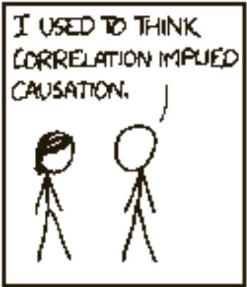

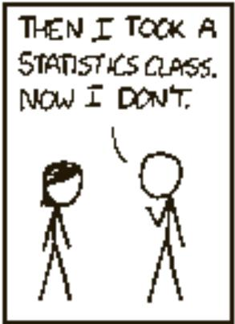

  
COURTESY OF RANDALL MUNROE/XKCD.COM

## FIGURE A-6

## Graph with an Omitted Variable

The upward-sloping curve shows that members of households with more cigarette lighters are more likely to develop cancer. Yet we should not conclude that ownership of lighters causes cancer because the graph does not take into account the number of cigarettes smoked.

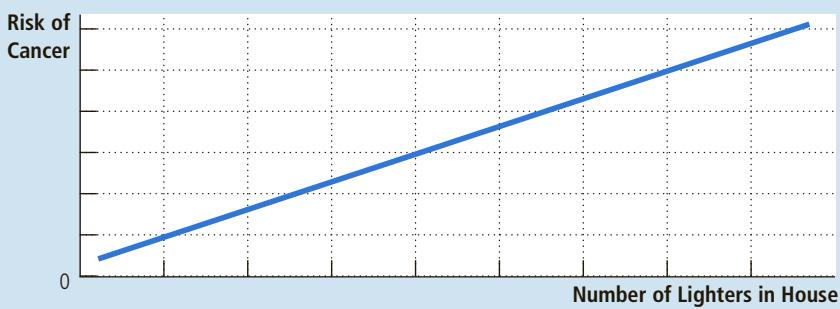

concern about the large number of deaths from cancer, commissions an exhaustive study from Big Brother Statistical Services, Inc. Big Brother examines many of the items found in people’s homes to see which of them are associated with the risk of cancer. Big Brother reports a strong relationship between two variables: the number of cigarette lighters that a household owns and the probability that someone in the household will develop cancer. Figure A-6 shows this relationship.

What should we make of this result? Big Brother advises a quick policy response. It recommends that the government discourage the ownership of cigarette lighters by taxing their sale. It also recommends that the government require warning labels: “Big Brother has determined that this lighter is dangerous to your health.”

In judging the validity of Big Brother’s analysis, one question is key: Has Big Brother held constant every relevant variable except the one under consideration? If the answer is no, the results are suspect. An easy explanation for Figure A-6 is that people who own more cigarette lighters are more likely to smoke cigarettes and that cigarettes, not lighters, cause cancer. If Figure A-6 does not hold constant the amount of smoking, it does not tell us the true effect of owning a cigarette lighter.

This story illustrates an important principle: When you see a graph used to support an argument about cause and effect, it is important to ask whether the movements of an omitted variable could explain the results you see.

Reverse Causality Economists can also make mistakes about causality by misreading its direction. To see how this is possible, suppose the Association of American Anarchists commissions a study of crime in America and arrives at Figure A-7, which plots the number of violent crimes per thousand people in major cities against the number of police officers per thousand people. The anarchists note the curve’s upward slope and argue that because police increase rather than decrease the amount of urban violence, law enforcement should be abolished.

If we could run a controlled experiment, we would avoid the danger of reverse causality. To run an experiment, we would randomly assign different numbers of police to different cities and then examine the correlation between police and crime. Figure A-7, however, is not based on such an experiment. We simply

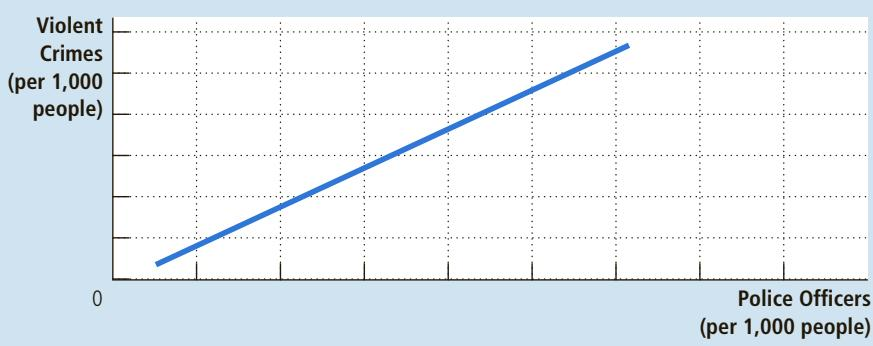

## FIGURE A-7

## Graph Suggesting Reverse Causality

The upward-sloping curve shows that cities with a higher concentration of police are more dangerous. Yet the graph does not tell us whether police cause crime or crime-plagued cities hire more police.

observe that more dangerous cities have more police officers. The explanation for this may be that more dangerous cities hire more police. In other words, rather than police causing crime, crime may cause police. Nothing in the graph itself allows us to establish the direction of causality.

It might seem that an easy way to determine the direction of causality is to examine which variable moves first. If we see crime increase and then the police force expand, we reach one conclusion. If we see the police force expand and then crime increase, we reach the other. This approach, however, is also flawed: Often, people change their behavior not in response to a change in their present conditions but in response to a change in their expectations of future conditions. A city that expects a major crime wave in the future, for instance, might hire more police now. This problem is even easier to see in the case of babies and minivans. Couples often buy a minivan in anticipation of the birth of a child. The minivan comes before the baby, but we wouldn’t want to conclude that the sale of minivans causes the population to grow!

There is no complete set of rules that says when it is appropriate to draw causal conclusions from graphs. Yet just keeping in mind that cigarette lighters don’t cause cancer (omitted variable) and that minivans don’t cause larger families (reverse causality) will keep you from falling for many faulty economic arguments.
