# The Market Forces of Supply and Demand

CHAPTER

When a cold snap hits Florida, the price of orange juice rises in supermarketsthroughout the country. When the weather turns warm in New England throughout the country. When the weather turns warm in New England every summer, the price of hotel rooms in the Caribbean plummets. When a war breaks out in the Middle East, the price of gasoline in the United States rises and the price of a used Cadillac falls. What do these events have in common? They all show the workings of supply and demand.

Supply and demand are the two words economists use most often—and for good reason. Supply and demand are the forces that make market economies work. They determine the quantity of each good produced and the price at which it

is sold. If you want to know how any event or policy will affect the economy, you must think first about how it will affect supply and demand.

This chapter introduces the theory of supply and demand. It considers how buyers and sellers behave and how they interact with one another. It shows how supply and demand determine prices in a market economy and how prices, in turn, allocate the economy’s scarce resources.

## market

## 4-1 Markets and Competition

The terms supply and demand refer to the behavior of people as they interact with one another in competitive markets. Before discussing how buyers and sellers behave, let’s first consider more fully what we mean by the terms market and competition.

## 4-1a What Is a Market?

A market is a group of buyers and sellers of a particular good or service. The buyers as a group determine the demand for the product, and the sellers as a group determine the supply of the product.

Markets take many forms. Some markets are highly organized, such as the markets for many agricultural commodities. In these markets, buyers and sellers meet at a specific time and place where an auctioneer helps set prices and arrange sales.

More often, markets are less organized. For example, consider the market for ice cream in a particular town. Buyers of ice cream do not meet together at any one time. The sellers of ice cream are in different locations and offer somewhat different products. There is no auctioneer calling out the price of ice cream. Each seller posts a price for an ice-cream cone, and each buyer decides how much ice cream to buy at each store. Nonetheless, these consumers and producers of ice cream are closely connected. The ice-cream buyers are choosing from the various ice-cream sellers to satisfy their cravings, and the ice-cream sellers are all trying to appeal to the same ice-cream buyers to make their businesses successful. Even though it is not as organized, the group of ice-cream buyers and ice-cream sellers forms a market.

## 4-1b What Is Competition?

The market for ice cream, like most markets in the economy, is highly competitive. Each buyer knows that there are several sellers from which to choose, and each seller is aware that his product is similar to that offered by other sellers. As a result, the price and quantity of ice cream sold are not determined by any single buyer or seller. Rather, price and quantity are determined by all buyers and sellers as they interact in the marketplace.

Economists use the term competitive market to describe a market in which there are so many buyers and so many sellers that each has a negligible impact on the market price. Each seller of ice cream has limited control over the price because other sellers are offering similar products. A seller has little reason to charge less than the going price, and if he charges more, buyers will make their purchases elsewhere. Similarly, no single buyer of ice cream can influence the price of ice cream because each buyer purchases only a small amount.

In this chapter, we assume that markets are perfectly competitive. To reach this highest form of competition, a market must have two characteristics: (1) The goods offered for sale are all exactly the same, and (2) the buyers and sellers are so numerous that no single buyer or seller has any influence over the market price.

Because buyers and sellers in perfectly competitive markets must accept the price the market determines, they are said to be price takers. At the market price, buyers can buy all they want, and sellers can sell all they want.

There are some markets in which the assumption of perfect competition applies perfectly. In the wheat market, for example, there are thousands of farmers who sell wheat and millions of consumers who use wheat and wheat products. Because no single buyer or seller can influence the price of wheat, each takes the market price as given.

Not all goods and services, however, are sold in perfectly competitive markets. Some markets have only one seller, and this seller sets the price. Such a seller is called a monopoly. Your local cable television company, for instance, may be a monopoly. Residents of your town probably have only one company from which to buy cable service. Other markets fall between the extremes of perfect competition and monopoly.

Despite the diversity of market types we find in the world, assuming perfect competition is a useful simplification and, therefore, a natural place to start. Perfectly competitive markets are the easiest to analyze because everyone participating in the market takes the price as given by market conditions. Moreover, because some degree of competition is present in most markets, many of the lessons that we learn by studying supply and demand under perfect competition apply in more complicated markets as well.

QuickQuiz

What is a market? • What are the characteristics of a perfectly competitive market?

## 4-2 Demand

We begin our study of markets by examining the behavior of buyers. To focus our thinking, let’s keep in mind a particular good—ice cream.

## 4-2a The Demand Curve: The Relationship between Price and Quantity Demanded

The quantity demanded of any good is the amount of the good that buyers are willing and able to purchase. As we will see, many things determine the quantity demanded of any good, but in our analysis of how markets work, one determinant plays a central role: the price of the good. If the price of ice cream rose to \$20 per scoop, you would buy less ice cream. You might buy frozen yogurt instead. If the price of ice cream fell to \$0.20 per scoop, you would buy more. This relationship between price and quantity demanded is true for most goods in the economy and, in fact, is so pervasive that economists call it the law of demand: Other things being equal, when the price of a good rises, the quantity demanded of the good falls, and when the price falls, the quantity demanded rises.

The table in Figure 1 shows how many ice-cream cones Catherine buys each month at different prices. If ice cream is free, Catherine eats 12 cones per month. At \$0.50 per cone, Catherine buys 10 cones each month. As the price rises further, she buys fewer and fewer cones. When the price reaches \$3.00, Catherine doesn’t buy any cones at all. This table is a demand schedule, a table that shows the relationship between the price of a good and the quantity demanded, holding constant everything else that influences how much of the good consumers want to buy.

The graph in Figure 1 uses the numbers from the table to illustrate the law of demand. By convention, the price of ice cream is on the vertical axis, and the

quantity demanded the amount of a good that buyers are willing and able to purchase

law of demand the claim that, other things being equal, the quantity demanded of a good falls when the price of the good rises

demand schedule a table that shows the relationship between the price of a good and the quantity demanded

## FIGURE 1

Catherine’s Demand Schedule and Demand Curve  
The demand schedule is a table that shows the quantity demanded at each price. The demand curve, which graphs the demand schedule, illustrates how the quantity demanded of the good changes as its price varies. Because a lower price increases the quantity demanded, the demand curve slopes downward.

<table><tr><td>Price of Ice-Cream Cone</td><td>Quantity of Cones Demanded</td></tr><tr><td>$0.00</td><td>12 cones</td></tr><tr><td>0.50</td><td>10</td></tr><tr><td>1.00</td><td>8</td></tr><tr><td>1.50</td><td>6</td></tr><tr><td>2.00</td><td>4</td></tr><tr><td>2.50</td><td>2</td></tr><tr><td>3.00</td><td>0</td></tr></table>

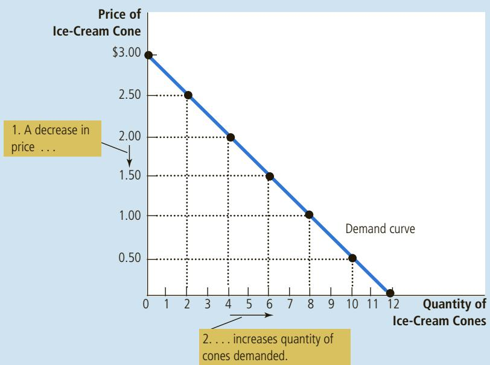  
demand curve a graph of the relationship between the price of a good and the quantity demanded

quantity of ice cream demanded is on the horizontal axis. The line relating price and quantity demanded is called the demand curve. The demand curve slopes downward because, other things being equal, a lower price means a greater quantity demanded.

## 4-2b Market Demand versus Individual Demand

The demand curve in Figure 1 shows an individual’s demand for a product. To analyze how markets work, we need to determine the market demand, the sum of all the individual demands for a particular good or service.

The table in Figure 2 shows the demand schedules for ice cream of the two individuals in this market—Catherine and Nicholas. At any price, Catherine’s demand schedule tells us how much ice cream she buys, and Nicholas’s demand schedule tells us how much ice cream he buys. The market demand at each price is the sum of the two individual demands.

The graph in Figure 2 shows the demand curves that correspond to these demand schedules. Notice that we sum the individual demand curves horizontally to obtain the market demand curve. That is, to find the total quantity demanded at any price, we add the individual quantities, which are found on the horizontal axis of the individual demand curves. Because we are interested in analyzing how markets function, we work most often with the market demand curve. The market demand curve shows how the total quantity demanded of a good varies as the price of the good varies, while all other factors that affect how much consumers want to buy are held constant.

The quantity demanded in a market is the sum of the quantities demanded by all the buyers at each price. Thus, the market demand curve is found by adding horizontally the individual demand curves. At a price of \$2.00, Catherine demands 4 ice-cream cones and Nicholas demands 3 ice-cream cones. The quantity demanded in the market at this price is 7 cones.

## FIGURE 2

Market Demand as the Sum of Individual Demands

<table><tr><td>Price of Ice-Cream Cone</td><td>Catherine</td><td></td><td>Nicholas</td><td></td><td>Market</td></tr><tr><td>$0.00</td><td>12</td><td>+</td><td>7</td><td>=</td><td>19 cones</td></tr><tr><td>0.50</td><td>10</td><td></td><td>6</td><td></td><td>16</td></tr><tr><td>1.00</td><td>8</td><td></td><td>5</td><td></td><td>13</td></tr><tr><td>1.50</td><td>6</td><td></td><td>4</td><td></td><td>10</td></tr><tr><td>2.00</td><td>4</td><td></td><td>3</td><td></td><td>7</td></tr><tr><td>2.50</td><td>2</td><td></td><td>2</td><td></td><td>4</td></tr><tr><td>3.00</td><td>0</td><td></td><td>1</td><td></td><td>1</td></tr></table>

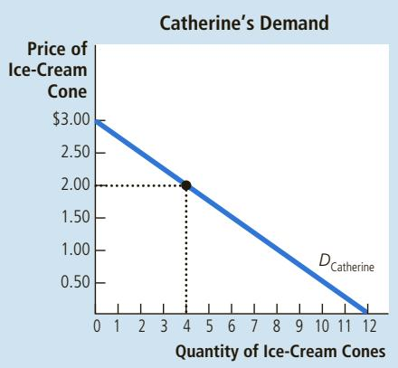

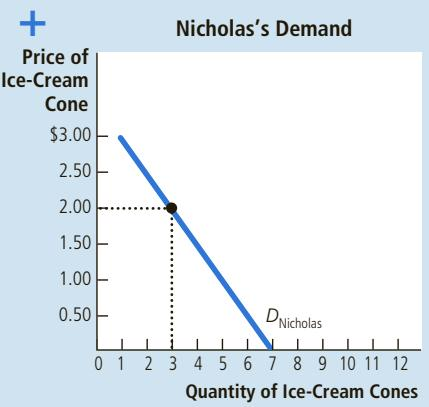

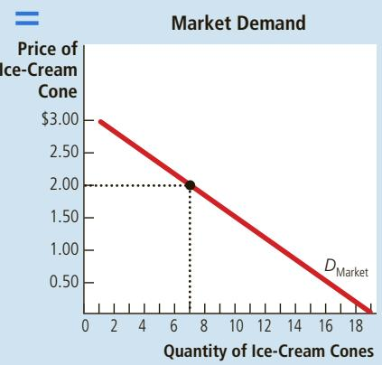

## 4-2c Shifts in the Demand Curve

Because the market demand curve holds other things constant, it need not be stable over time. If something happens to alter the quantity demanded at any given price, the demand curve shifts. For example, suppose the American Medical Association discovered that people who regularly eat ice cream live longer, healthier lives. The discovery would raise the demand for ice cream. At any given price, buyers would now want to purchase a larger quantity of ice cream, and the demand curve for ice cream would shift.

Figure 3 illustrates shifts in demand. Any change that increases the quantity demanded at every price, such as our imaginary discovery by the American Medical Association, shifts the demand curve to the right and is called an increase in demand. Any change that reduces the quantity demanded at every price shifts the demand curve to the left and is called a decrease in demand.

There are many variables that can shift the demand curve. Let’s consider the most important.

Income What would happen to your demand for ice cream if you lost your job one summer? Most likely, it would fall. A lower income means that you have

## FIGURE 3

## Shifts in the Demand Curve

Any change that raises the quantity that buyers wish to purchase at any given price shifts the demand curve to the right. Any change that lowers the quantity that buyers wish to purchase at any given price shifts the demand curve to the left.

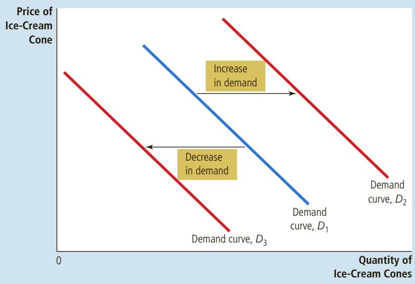

## normal good

a good for which, other things being equal, an increase in income leads to an increase in demand

## inferior good

a good for which, other things being equal, an increase in income leads to a decrease in demand

## substitutes

two goods for which an increase in the price of one leads to an increase in the demand for the other

less to spend in total, so you would have to spend less on some—and probably most—goods. If the demand for a good falls when income falls, the good is called a normal good.

two goods for which an increase in the price of one leads to a decrease in the demand for the other

## complements

Normal goods are the norm, but not all goods are normal goods. If the demand for a good rises when income falls, the good is called an inferior good. An example of an inferior good might be bus rides. As your income falls, you are less likely to buy a car or take a cab and more likely to ride a bus.

Prices of Related Goods Suppose that the price of frozen yogurt falls. The law of demand says that you will buy more frozen yogurt. At the same time, you will probably buy less ice cream. Because ice cream and frozen yogurt are both cold, sweet, creamy desserts, they satisfy similar desires. When a fall in the price of one good reduces the demand for another good, the two goods are called substitutes. Substitutes are often pairs of goods that are used in place of each other, such as hot dogs and hamburgers, sweaters and sweatshirts, and cinema tickets and film streaming services.

Now suppose that the price of hot fudge falls. According to the law of demand, you will buy more hot fudge. Yet in this case, you will likely buy more ice cream as well because ice cream and hot fudge are often used together. When a fall in the price of one good raises the demand for another good, the two goods are called complements. Complements are often pairs of goods that are used together, such as gasoline and automobiles, computers and software, and peanut butter and jelly.

Tastes The most obvious determinant of your demand is your tastes. If you like ice cream, you buy more of it. Economists normally do not try to explain people’s tastes because tastes are based on historical and psychological forces that are beyond the realm of economics. Economists do, however, examine what happens when tastes change.

Expectations Your expectations about the future may affect your demand for a good or service today. If you expect to earn a higher income next month, you may choose to save less now and spend more of your current income buying ice cream. If you expect the price of ice cream to fall tomorrow, you may be less willing to buy an ice-cream cone at today’s price.

Number of Buyers In addition to the preceding factors, which influence the behavior of individual buyers, market demand depends on the number of these buyers. If Peter were to join Catherine and Nicholas as another consumer of ice cream, the quantity demanded in the market would be higher at every price, and market demand would increase.

Summary The demand curve shows what happens to the quantity demanded of a good when its price varies, holding constant all the other variables that influence buyers. When one of these other variables changes, the demand curve shifts. Table 1 lists the variables that influence how much of a good consumers choose to buy.

If you have trouble remembering whether you need to shift or move along the demand curve, it helps to recall a lesson from the appendix to Chapter 2. A curve shifts when there is a change in a relevant variable that is not measured on either axis. Because the price is on the vertical axis, a change in price represents a movement along the demand curve. By contrast, income, the prices of related goods, tastes, expectations, and the number of buyers are not measured on either axis, so a change in one of these variables shifts the demand curve.

<table><tr><td>Variable</td><td>A Change in This Variable . . .</td></tr><tr><td>Price of the good itself</td><td>Represents a movement along the demand curve</td></tr><tr><td>Income</td><td>Shifts the demand curve</td></tr><tr><td>Prices of related goods</td><td>Shifts the demand curve</td></tr><tr><td>Tastes</td><td>Shifts the demand curve</td></tr><tr><td>Expectations</td><td>Shifts the demand curve</td></tr><tr><td>Number of buyers</td><td>Shifts the demand curve</td></tr></table>

## TABLE 1

## Variables That Influence Buyers

This table lists the variables that affect how much of any good consumers choose to buy. Notice the special role that the price of the good plays: A change in the good’s price represents a movement along the demand curve, whereas a change in one of the other variables shifts the demand curve.

## TWO WAYS TO REDUCE THE QUANTITY OF SMOKING DEMANDED

Because smoking can lead to various illnesses, public policymakers often want to reduce the amount that people smoke. There are two ways that they can attempt to achieve this goal.

One way to reduce smoking is to shift the demand curve for cigarettes and other tobacco products. Public service announcements, mandatory health warnings on cigarette packages, and the prohibition of cigarette advertising on television are all policies aimed at reducing the quantity of cigarettes demanded at any given price. If successful, these policies shift the demand curve for cigarettes to the left, as in panel (a) of Figure 4.

Alternatively, policymakers can try to raise the price of cigarettes. If the government taxes the manufacture of cigarettes, for example, cigarette companies pass much of this tax on to consumers in the form of higher prices. A higher price encourages smokers to reduce the numbers of cigarettes they smoke. In this case, the reduced amount of smoking does not represent a shift in the demand curve.

## FIGURE 4

Shifts in the Demand Curve versus Movements along the Demand Curve

If warnings on cigarette packages convince smokers to smoke less, the demand curve for cigarettes shifts to the left. In panel (a), the demand curve shifts from $D _ { 1 }$ to $D _ { 2 } .$ At a price of \$4.00 per pack, the quantity demanded falls from 20 to 10 cigarettes per day, as reflected by the shift from point A to point B. By contrast, if a tax raises the price of cigarettes, the demand curve does not shift. Instead, we observe a movement to a different point on the demand curve. In panel (b), when the price rises from \$4.00 to \$8.00, the quantity demanded falls from 20 to 12 cigarettes per day, as reflected by the movement from point A to point C.

(a) A Shift in the Demand Curve  
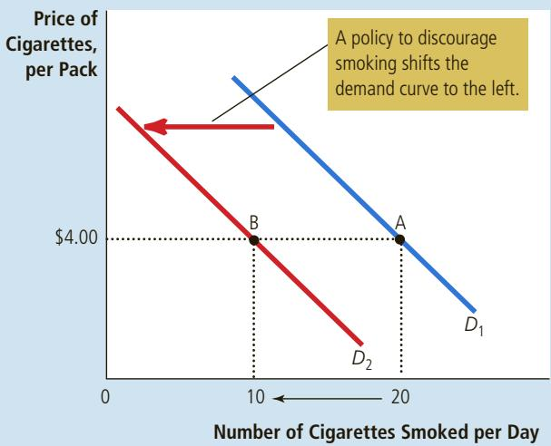

(b) A Movement along the Demand Curve  
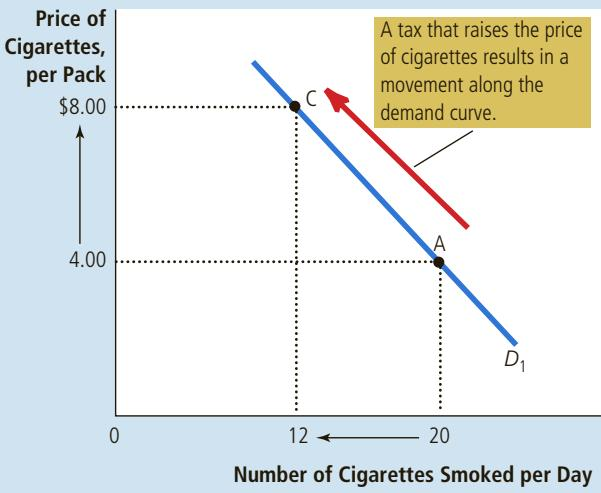

  
What is the best way to stop this?  
EDYTA PAWLOWSKA/SHUTTERSTOCK.COM

Instead, it represents a movement along the same demand curve to a point with a higher price and lower quantity, as in panel (b) of Figure 4.

How much does the amount of smoking respond to changes in the price of cigarettes? Economists have attempted to answer this question by studying what happens when the tax on cigarettes changes. They have found that a 10 percent increase in the price causes a 4 percent reduction in the quantity demanded. Teenagers are especially sensitive to the price of cigarettes: A 10 percent increase in the price causes a 12 percent drop in teenage smoking.

A related question is how the price of cigarettes affects the demand for illicit drugs, such as marijuana. Opponents of cigarette taxes often argue that tobacco and marijuana are substitutes so that high cigarette prices encourage marijuana use. By contrast, many experts on substance abuse view tobacco as a “gateway drug” leading young people to experiment with other harmful substances. Most studies of the data are consistent with this latter view: They find that lower cigarette prices are associated with greater use of marijuana. In other words, tobacco and marijuana appear to be complements rather than substitutes. ●

Make up an example of a monthly demand schedule for pizza, and graph QuickQuiz the implied demand curve. Give an example of something that would shift this demand curve, and briefly explain your reasoning. Would a change in the price of pizza shift this demand curve?

## 4-3 Supply

We now turn to the other side of the market and examine the behavior of sellers. Once again, to focus our thinking, let’s consider the market for ice cream.

## 4-3a The Supply Curve: The Relationship between Price and Quantity Supplied

The quantity supplied of any good or service is the amount that sellers are willing and able to sell. There are many determinants of quantity supplied, but once again, price plays a special role in our analysis. When the price of ice cream is high, selling ice cream is profitable, and so the quantity supplied is large. Sellers of ice cream work long hours, buy many ice-cream machines, and hire many workers. By contrast, when the price of ice cream is low, the business is less profitable, so sellers produce less ice cream. At a low price, some sellers may even choose to shut down, and their quantity supplied falls to zero. This relationship between price and quantity supplied is called the law of supply: Other things being equal, when the price of a good rises, the quantity supplied of the good also rises, and when the price falls, the quantity supplied falls as well.

The table in Figure 5 shows the quantity of ice-cream cones supplied each month by Ben, an ice-cream seller, at various prices of ice cream. At a price below \$1.00, Ben does not supply any ice cream at all. As the price rises, he supplies a greater and greater quantity. This is the supply schedule, a table that shows the relationship between the price of a good and the quantity supplied, holding constant everything else that influences how much of the good producers want to sell.

The supply schedule is a table that shows the quantity supplied at each price. This supply curve, which graphs the supply schedule, illustrates how the quantity supplied of the good changes as its price varies. Because a higher price increases the quantity supplied, the supply curve slopes upward.

## quantity supplied

the amount of a good that sellers are willing and able to sell

law of supply the claim that, other things being equal, the quantity supplied of a good rises when the price of the good rises

## supply schedule

a table that shows the relationship between the price of a good and the quantity supplied

## FIGURE 5

Ben’s Supply Schedule and Supply Curve  
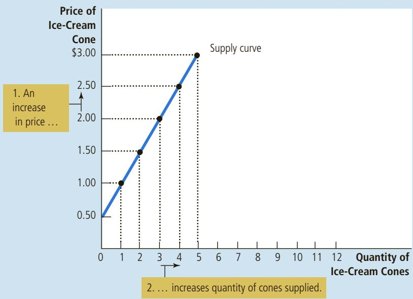

<table><tr><td>Price of Ice-Cream Cone</td><td>Quantity of Cones Demanded</td></tr><tr><td>$0.00</td><td>0 cones</td></tr><tr><td>0.50</td><td>0</td></tr><tr><td>1.00</td><td>1</td></tr><tr><td>1.50</td><td>2</td></tr><tr><td>2.00</td><td>3</td></tr><tr><td>2.50</td><td>4</td></tr><tr><td>3.00</td><td>5</td></tr></table>

The graph in Figure 5 uses the numbers from the table to illustrate the law of supply. The curve relating price and quantity supplied is called the supply curve. The supply curve slopes upward because, other things being equal, a higher price means a greater quantity supplied.

## 4-3b Market Supply versus Individual Supply

Just as market demand is the sum of the demands of all buyers, market supply is the sum of the supplies of all sellers. The table in Figure 6 shows the supply schedules for the two ice-cream producers in the market—Ben and Jerry. At any price, Ben’s supply schedule tells us the quantity of ice cream that Ben supplies, and Jerry’s supply schedule tells us the quantity of ice cream that Jerry supplies. The market supply is the sum of the two individual supplies.

The graph in Figure 6 shows the supply curves that correspond to the supply schedules. As with demand curves, we sum the individual supply curves horizontally to obtain the market supply curve. That is, to find the total quantity supplied at any price, we add the individual quantities, which are found on the horizontal axis of the individual supply curves. The market supply curve shows how the total quantity supplied varies as the price of the good varies, holding constant all other factors that influence producers’ decisions about how much to sell.

## FIGURE 6

Market Supply as the Sum of Individual Supplies  
The quantity supplied in a market is the sum of the quantities supplied by all the sellers at each price. Thus, the market supply curve is found by adding horizontally the individual supply curves. At a price of \$2.00, Ben supplies 3 ice-cream cones and Jerry supplies 4 ice-cream cones. The quantity supplied in the market at this price is 7 cones.

<table><tr><td>Price of Ice-Cream Cone</td><td>Ben</td><td></td><td>Jerry</td><td></td><td>Market</td></tr><tr><td>$0.00</td><td>0</td><td>+</td><td>0</td><td>=</td><td>0 cones</td></tr><tr><td>0.50</td><td>0</td><td></td><td>0</td><td></td><td>0</td></tr><tr><td>1.00</td><td>1</td><td></td><td>0</td><td></td><td>1</td></tr><tr><td>1.50</td><td>2</td><td></td><td>2</td><td></td><td>4</td></tr><tr><td>2.00</td><td>3</td><td></td><td>4</td><td></td><td>7</td></tr><tr><td>2.50</td><td>4</td><td></td><td>6</td><td></td><td>10</td></tr><tr><td>3.00</td><td>5</td><td></td><td>8</td><td></td><td>13</td></tr></table>

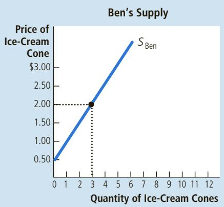

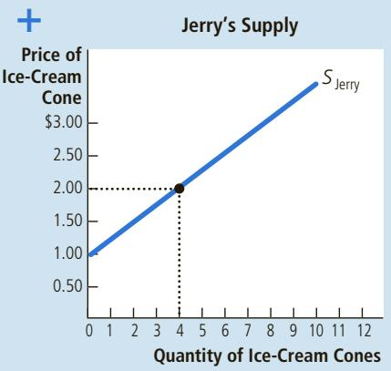

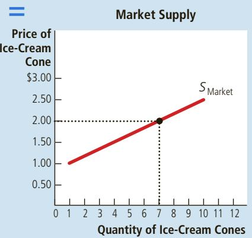

## 4-3c Shifts in the Supply Curve

Because the market supply curve is drawn holding other things constant, when one of these factors changes, the supply curve shifts. For example, suppose the price of sugar falls. Sugar is an input in the production of ice cream, so the fall in the price of sugar makes selling ice cream more profitable. This raises the supply of ice cream: At any given price, sellers are now willing to produce a larger quantity. As a result, the supply curve for ice cream shifts to the right.

Figure 7 illustrates shifts in supply. Any change that raises quantity supplied at every price, such as a fall in the price of sugar, shifts the supply curve to the right and is called an increase in supply. Any change that reduces the quantity supplied at every price shifts the supply curve to the left and is called a decrease in supply.

There are many variables that can shift the supply curve. Let’s consider the most important.

Input Prices To produce their output of ice cream, sellers use various inputs: cream, sugar, flavoring, ice-cream machines, the buildings in which the ice cream is made, and the labor of workers who mix the ingredients and operate the machines. When the price of one or more of these inputs rises, producing ice cream is less profitable, and firms supply less ice cream. If input prices rise substantially, a firm might shut down and supply no ice cream at all. Thus, the supply of a good is negatively related to the price of the inputs used to make the good.

Technology The technology for turning inputs into ice cream is another determinant of supply. The invention of the mechanized ice-cream machine, for example, reduced the amount of labor necessary to make ice cream. By reducing firms’ costs, the advance in technology raised the supply of ice cream.

Expectations The amount of ice cream a firm supplies today may depend on its expectations about the future. For example, if a firm expects the price of ice cream to rise in the future, it will put some of its current production into storage and supply less to the market today.

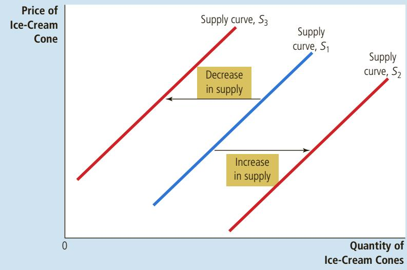

## FIGURE 7

## Shifts in the Supply Curve

Any change that raises the quantity that sellers wish to produce at any given price shifts the supply curve to the right. Any change that lowers the quantity that sellers wish to produce at any given price shifts the supply curve to the left.

<table><tr><td colspan="3">TABLE 2</td></tr><tr><td></td><td>Variable</td><td>A Change in This Variable . . .</td></tr><tr><td rowspan="5">Variables That Influence SellersThis table lists the variables that affect how much of any good producers choose to sell.Notice the special role that the price of the good plays: A change in the good&#x27;s price represents a movement along the supply curve, whereas a change in one of the other variables shifts the supply curve.</td><td>Price of the good itself</td><td>Represents a movement along the supply curve</td></tr><tr><td>Input prices</td><td>Shifts the supply curve</td></tr><tr><td>Technology</td><td>Shifts the supply curve</td></tr><tr><td>Expectations</td><td>Shifts the supply curve</td></tr><tr><td>Number of sellers</td><td>Shifts the supply curve</td></tr></table>

Number of Sellers In addition to the preceding factors, which influence the behavior of individual sellers, market supply depends on the number of these sellers. If Ben or Jerry were to retire from the ice-cream business, the supply in the market would fall.

Summary The supply curve shows what happens to the quantity supplied of a good when its price varies, holding constant all the other variables that influence sellers. When one of these other variables changes, the supply curve shifts. Table 2 lists the variables that influence how much of a good producers choose to sell.

Once again, to remember whether you need to shift or move along the supply curve, keep in mind that a curve shifts only when there is a change in a relevant variable that is not named on either axis. The price is on the vertical axis, so a change in price represents a movement along the supply curve. By contrast, because input prices, technology, expectations, and the number of sellers are not measured on either axis, a change in one of these variables shifts the supply curve.

QuickQuiz Make up an example of a monthly supply schedule for pizza, and graph the implied supply curve. Give an example of something that would shift this supply curve, and briefly explain your reasoning. Would a change in the price of pizza shift this supply curve?

## 4-4 Supply and Demand Together

## equilibrium

a situation in which the market price has reached the level at which quantity supplied equals quantity demanded

equilibrium price the price that balances quantity supplied and quantity demanded

equilibrium quantity the quantity supplied and the quantity demanded at the equilibrium price

Having analyzed supply and demand separately, we now combine them to see how they determine the price and quantity of a good sold in a market.

## 4-4a Equilibrium

Figure 8 shows the market supply curve and market demand curve together. Notice that there is one point at which the supply and demand curves intersect. This point is called the market’s equilibrium. The price at this intersection is called the equilibrium price, and the quantity is called the equilibrium quantity. Here the equilibrium price is \$2.00 per cone, and the equilibrium quantity is 7 ice-cream cones.

The dictionary defines the word equilibrium as a situation in which various forces are in balance. This definition applies to a market’s equilibrium as well. At the equilibrium price, the quantity of the good that buyers are willing and able to buy exactly balances the quantity that sellers are willing and able to sell. The equilibrium price is sometimes called the market-clearing price because, at this price, everyone

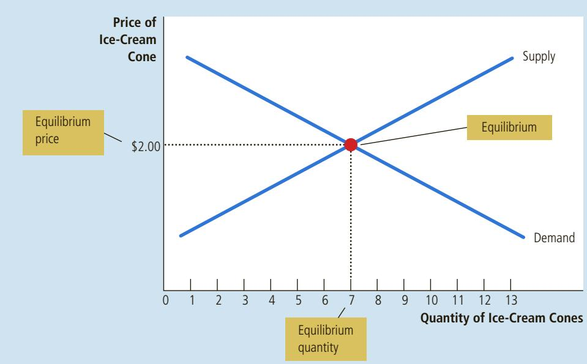

## FIGURE 8

## The Equilibrium of Supply and Demand

The equilibrium is found where the supply and demand curves intersect. At the equilibrium price, the quantity supplied equals the quantity demanded. Here the equilibrium price is \$2.00: At this price, 7 ice-cream cones are supplied and 7 ice-cream cones are demanded.

in the market has been satisfied: Buyers have bought all they want to buy, and sellers have sold all they want to sell.

The actions of buyers and sellers naturally move markets toward the equilibrium of supply and demand. To see why, consider what happens when the market price is not equal to the equilibrium price.

Suppose first that the market price is above the equilibrium price, as in panel (a) of Figure 9. At a price of \$2.50 per cone, the quantity of the good supplied (10 cones) exceeds the quantity demanded (4 cones). There is a surplus of the good: Suppliers are unable to sell all they want at the going price. A surplus is sometimes called a situation of excess supply. When there is a surplus in the ice-cream market, sellers of ice cream find their freezers increasingly full of ice cream they would like to sell but cannot. They respond to the surplus by cutting their prices. Falling prices, in turn, increase the quantity demanded and decrease the quantity supplied. These changes represent movements along the supply and demand curves, not shifts in the curves. Prices continue to fall until the market reaches the equilibrium.

Suppose now that the market price is below the equilibrium price, as in panel (b) of Figure 9. In this case, the price is \$1.50 per cone, and the quantity of the good demanded exceeds the quantity supplied. There is a shortage of the good: Demanders are unable to buy all they want at the going price. A shortage is sometimes called a situation of excess demand. When a shortage occurs in the icecream market, buyers have to wait in long lines for a chance to buy one of the few cones available. With too many buyers chasing too few goods, sellers can respond to the shortage by raising their prices without losing sales. These price increases cause the quantity demanded to fall and the quantity supplied to rise. Once again, these changes represent movements along the supply and demand curves, and they move the market toward the equilibrium.

surplus a situation in which quantity supplied is greater than quantity demanded

Thus, regardless of whether the price starts off too high or too low, the activities of the many buyers and sellers automatically push the market price toward the equilibrium price. Once the market reaches its equilibrium, all buyers and sellers

shortage a situation in which quantity demanded is greater than quantity supplied

## FIGURE 9

Markets Not in Equilibrium

In panel (a), there is a surplus. Because the market price of \$2.50 is above the equilibrium price, the quantity supplied (10 cones) exceeds the quantity demanded (4 cones). Suppliers try to increase sales by cutting the price of a cone, and this moves the price toward its equilibrium level. In panel (b), there is a shortage. Because the market price of \$1.50 is below the equilibrium price, the quantity demanded (10 cones) exceeds the quantity supplied (4 cones). With too many buyers chasing too few goods, suppliers can take advantage of the shortage by raising the price. Hence, in both cases, the price adjustment moves the market toward the equilibrium of supply and demand.

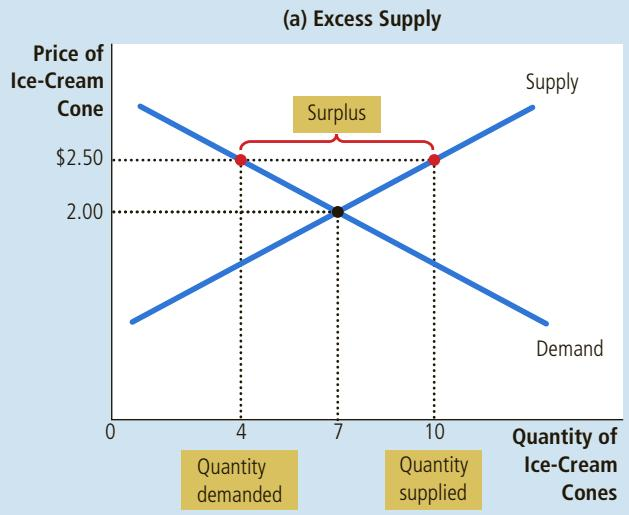

(b) Excess Demand  
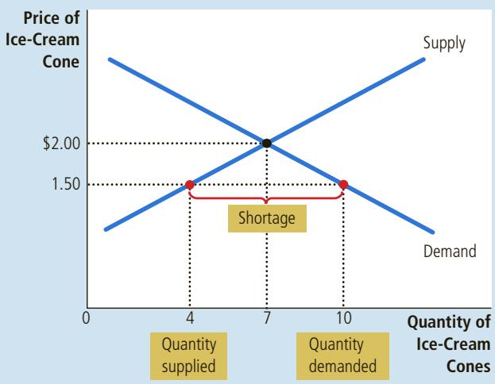

## law of supply and demand

the claim that the price of any good adjusts to bring the quantity supplied and the quantity demanded for that good into balance

are satisfied, and there is no upward or downward pressure on the price. How quickly equilibrium is reached varies from market to market depending on how quickly prices adjust. In most free markets, surpluses and shortages are only temporary because prices eventually move toward their equilibrium levels. Indeed, this phenomenon is so pervasive that it is called the law of supply and demand: The price of any good adjusts to bring the quantity supplied and quantity demanded for that good into balance.

## 4-4b Three Steps to Analyzing Changes in Equilibrium

So far, we have seen how supply and demand together determine a market’s equilibrium, which in turn determines the price and quantity of the good that buyers purchase and sellers produce. The equilibrium price and quantity depend on the position of the supply and demand curves. When some event shifts one of these curves, the equilibrium in the market changes, resulting in a new price and a new quantity exchanged between buyers and sellers.

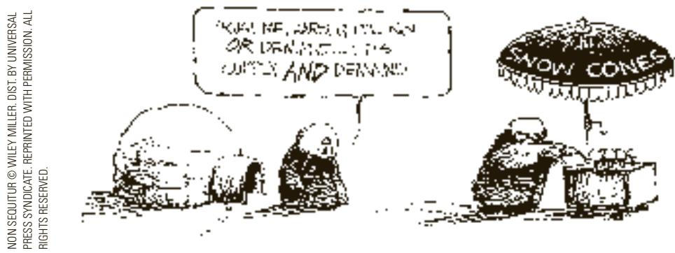

When analyzing how some event affects the equilibrium in a market, we proceed in three steps. First, we decide whether the event shifts the supply curve, the demand curve, or, in some cases, both. Second, we decide whether the curve shifts to the right or to the left. Third, we use the supply-and-demand diagram to compare the initial equilibrium with the new one, which shows how the shift affects the equilibrium price and quantity. Table 3 summarizes these three steps. To see how this recipe is used, let’s consider various events that might affect the market for ice cream.

1. Decide whether the event shifts the supply or demand curve (or perhaps both).

2. Decide in which direction the curve shifts.

3. Use the supply-and-demand diagram to see how the shift changes the equilibrium price and quantity.

## TABLE 3

Three Steps for Analyzing Changes in Equilibrium

Example: A Change in Market Equilibrium Due to a Shift in Demand Suppose that one summer the weather is very hot. How does this event affect the market for ice cream? To answer this question, let’s follow our three steps.

1. The hot weather affects the demand curve by changing people’s taste for ice cream. That is, the weather changes the amount of ice cream that people want to buy at any given price. The supply curve is unchanged because the weather does not directly affect the firms that sell ice cream.

2. Because hot weather makes people want to eat more ice cream, the demand curve shifts to the right. Figure 10 shows this increase in demand as a shift in the demand curve from $D _ { 1 }$ to $D _ { 2 } .$ This shift indicates that the quantity of ice cream demanded is higher at every price.

3. At the old price of \$2, there is now an excess demand for ice cream, and this shortage induces firms to raise the price. As Figure 10 shows, the increase in demand raises the equilibrium price from \$2.00 to \$2.50 and the equilibrium quantity from 7 to 10 cones. In other words, the hot weather increases both the price of ice cream and the quantity of ice cream sold.

Shifts in Curves versus Movements along Curves Notice that when hot weather increases the demand for ice cream and drives up the price, the quantity of ice cream that firms supply rises, even though the supply curve remains the same. In this case, economists say there has been an increase in “quantity supplied” but no change in “supply.”

Supply refers to the position of the supply curve, whereas the quantity supplied refers to the amount suppliers wish to sell. In this example, supply does not change because the weather does not alter firms’ desire to sell at any given price. Instead, the hot weather alters consumers’ desire to buy at any given price and thereby shifts the demand curve to the right. The increase in demand

## FIGURE 10
