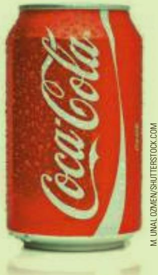
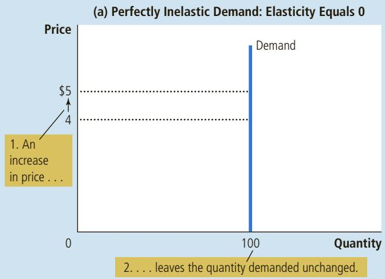
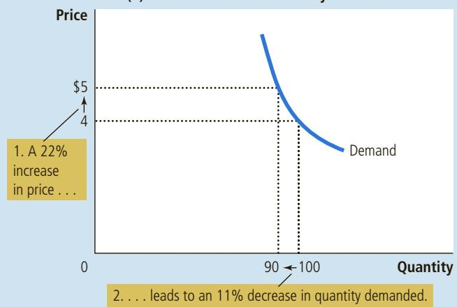
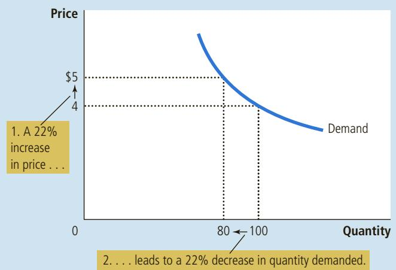
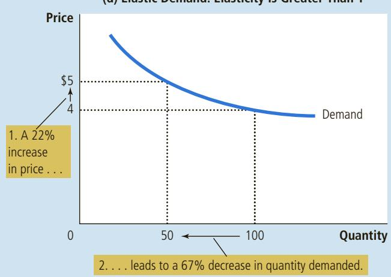
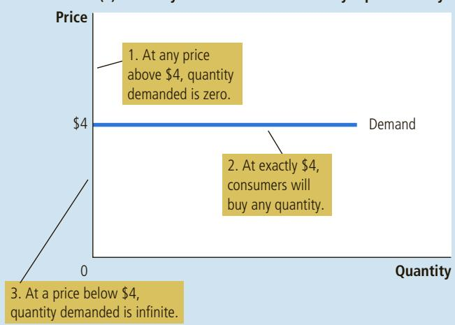
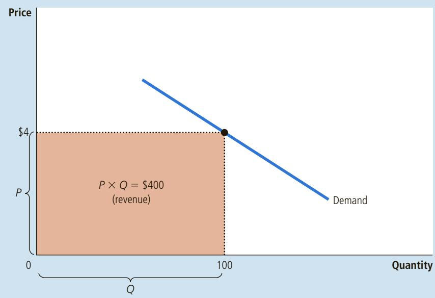
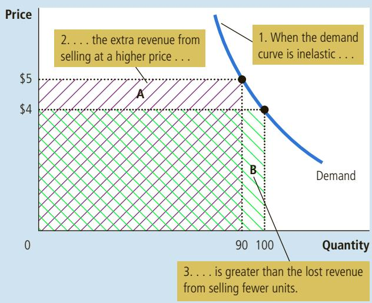
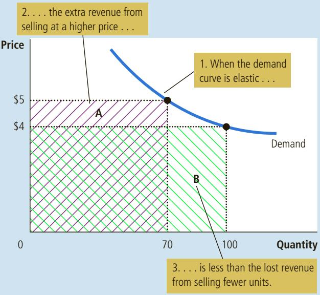
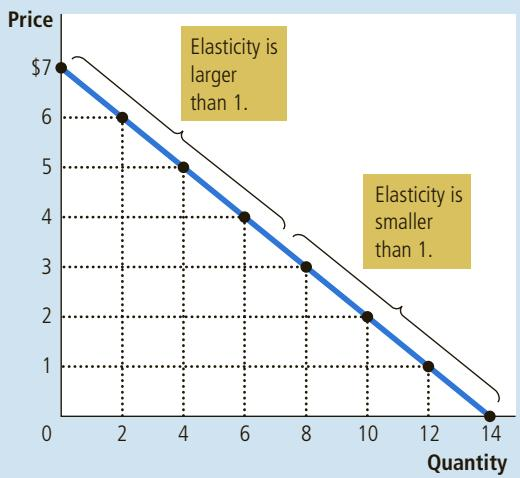

# Price Increases after Disasters

When a disaster such as a hurricane strikes a region, many goods experience an increase in demand or a decrease in supply, putting upward pressure on prices. Policymakers often object to these price hikes, but this opinion piece endorses the market’s natural response.

## Is Price Gouging Reverse Looting?

By John Carney

our dollars for a can of coke. Five hundred dollars a night for a hotel in downtown Brooklyn. A pair of D-batteries for \$6.99.

These are just a few of the examples of price hikes I or friends of mine have personally come across in the run-up and aftermath of hurricane Sandy. Price gouging, as this is often called, is a common occurrence during emergencies.

Price gouging around natural disasters is one of the things politicians on the left and right agree is a terrible, no good, very bad thing. New York Attorney General Eric Schneiderman sent out a press release warning “against price inflation of necessary goods and services during hurricane Sandy.” New Jersey Governor Chris Christie issued a “forceful reminder” that price gouging “will result in significant penalties.” Hotlines have been established to allow consumers to report gouging.

New Jersey’s law is very specific. Price increases of more than 10 percent during a declared state of emergency are considered excessive. A New Jersey gas station paid a \$50,000 fine last year for hiking gasoline prices by 16 percent during tropical storm Irene.

New York’s law may be even stricter. According to AG Schneiderman’s release, all price increases on “necessary goods and items” count as gouging.

“General Business Law prohibits such increase in costs of essential items like food, water, gas, generators, batteries and flashlights, and services like transportation, during natural disasters or other events that disrupt the market,” the NY AG release said.

These laws are built on the quite conventional view that it is unethical for a business to take advantage of a disaster in pursuit of profits. It just seems wrong for business owners to make money on the misery of their neighbors. Merchants earning larger profits because of a disaster seem to be rewarded for doing nothing more than raising their prices.

“It’s reverse looting,” a neighbor of mine in Brooklyn said about the price of batteries at a local electronic store.

Unfortunately, ethics runs into economics in a way that can make these laws positively harmful. Price gouging can occur only when there is a shortage of the goods in demand. If there were no shortage, normal market processes would prevent sudden price spikes. A deli owner charging \$4 for a can of Pepsi would discover he was just driving customers to the deli a block away, which charges a buck.

But when everyone starts suddenly buying batteries or bottles of water for fear of a blackout, shortages can arise. Sometimes there simply is not enough of a particular good to satisfy a sharp spike in demand. And so the question arises: how do we decide

farms. What determines who is a farmer and who is not? In a free society, there is no government planning agency making this decision and ensuring an adequate supply of food. Instead, the allocation of workers to farms is based on the job decisions of millions of workers. This decentralized system works well because these decisions depend on prices. The prices of food and the wages of farmworkers (the price of their labor) adjust to ensure that enough people choose to be farmers.

If a person had never seen a market economy in action, the whole idea might seem preposterous. Economies are enormous groups of people engaged in a multitude of interdependent activities. What prevents decentralized decision making from degenerating into chaos? What coordinates the actions of the millions of people with their varying abilities and desires? What ensures that what needs to be done is in fact done? The answer, in a word, is prices. If an invisible hand guides market economies, as Adam Smith famously suggested, then the price system is the baton that the invisible hand uses to conduct the economic orchestra.

which customers get the batteries, the groceries, the gasoline?

We could hold a lottery. Perhaps people could receive a ticket at the grocery store. Winners would get to shop at the usual prices. Losers would just go hungry. Or, more likely, they would be forced to buy the food away from the lottery winners—at elevated prices no doubt, since no one would buy food just to sell it at the same price. So the gouging would just pass from merchant to lottery winning customer.

We could have some sort of rationing program. Each person could be assigned a portion of the necessary goods according to their household need. This is something the U.S. resorted to during World War II. The problem is that rationing requires an immense amount of planning—and an impossible level of knowledge. The rationing bureaucrat would have to know precisely how much of each good was available in a given area and how many people would need it. Good luck getting that in place as a hurricane bears down on your city.

We could simply sell goods on a first come, first serve basis. This is, in fact, what anti-gouging laws encourage. The result is all too familiar. People hoard goods. Store shelves are emptied. And you have to wonder, why is a first to the register race a fairer system than the alternative of market prices? Speed seems a poor proxy for justice.

  
Would you pay \$4 for this?

Allowing prices to rise at times of extreme demand discourages overconsumption. People consider their purchases more carefully. Instead of buying a dozen batteries (or bottles of water or gallons of gas), perhaps they buy half that. The result is that goods under extreme demand are available to more

M. UNAL OZMEN/SHUTTERSTOCK.COM

customers. The market process actually results in a more equitable distribution than the anti-gouging laws.

Once we understand this, it’s easy to see that merchants aren’t really profiting from disaster. They are profiting from managing their prices, which has the socially beneficial effect of broadening distribution and discouraging hoarding. In short, they are being justly rewarded for performing an important public service.

One objection is that a system of freefloating, legal gouging would allow the wealthy to buy everything and leave the poor out altogether. But this concern is overrated. For the most part, price hikes during disasters do not actually put necessary goods and services out of reach of even the poorest people. They just put the budgets of the poor under additional strain. This is a problem better resolved through transfer payments to alleviate the household budgetary effects of the prices after the fact, rather than trying to control the price in the first place….

Instead of cracking down on price gougers, we should be using our experience of shortages during this time of crisis to spark a reform of our counter-productive laws. Next time disaster strikes, we should hope for a bit more gouging and a lot fewer empty store shelves. ■

## CHAPTER QuickQuiz

3. Movie tickets and film streaming services are substitutes. If the price of film streaming increases, what happens in the market for movie tickets?

a. The supply curve shifts to the left.

b. The supply curve shifts to the right.

c. The demand curve shifts to the left.

d. The demand curve shifts to the right.

4. The discovery of a large new reserve of crude oil will shift the curve for gasoline, leading to a equilibrium price. a. supply, higher b. supply, lower c. demand, higher d. demand, lower

5. If the economy goes into a recession and incomes fall, what happens in the markets for inferior goods?

a. Prices and quantities both rise.

b. Prices and quantities both fall.

c. Prices rise and quantities fall.

d. Prices fall and quantities rise.

6. Which of the following might lead to an increase in the equilibrium price of jelly and a decrease in the equilibrium quantity of jelly sold?

a. an increase in the price of peanut better, a complement to jelly

b. an increase in the price of Marshmallow Fluff, a substitute for jelly

c. an increase in the price of grapes, an input into jelly

d. an increase in consumers’ incomes, as long as jelly is a normal good

## SUMMARY

Economists use the model of supply and demand to analyze competitive markets. In a competitive market, there are many buyers and sellers, each of whom has little or no influence on the market price.

The demand curve shows how the quantity of a good demanded depends on the price. According to the law of demand, as the price of a good falls, the quantity demanded rises. Therefore, the demand curve slopes downward.

In addition to price, other determinants of how much consumers want to buy include income, the prices of substitutes and complements, tastes, expectations, and the number of buyers. If one of these factors changes, the demand curve shifts.

The supply curve shows how the quantity of a good supplied depends on the price. According to the law of supply, as the price of a good rises, the quantity supplied rises. Therefore, the supply curve slopes upward.

In addition to price, other determinants of how much producers want to sell include input prices, technology, expectations, and the number of sellers. If one of these factors changes, the supply curve shifts.

• The intersection of the supply and demand curves determines the market equilibrium. At the equilibrium price, the quantity demanded equals the quantity supplied.

The behavior of buyers and sellers naturally drives markets toward their equilibrium. When the market price is above the equilibrium price, there is a surplus of the good, which causes the market price to fall. When the market price is below the equilibrium price, there is a shortage, which causes the market price to rise.

To analyze how any event influences a market, we use the supply-and-demand diagram to examine how the event affects the equilibrium price and quantity. To do this, we follow three steps. First, we decide whether the event shifts the supply curve or the demand curve (or both). Second, we decide in which direction the curve shifts. Third, we compare the new equilibrium with the initial equilibrium.

In market economies, prices are the signals that guide economic decisions and thereby allocate scarce resources. For every good in the economy, the price ensures that supply and demand are in balance. The equilibrium price then determines how much of the good buyers choose to consume and how much sellers choose to produce.

## KEY CONCEPTS

market, p. 66 competitive market, p. 66 quantity demanded, p. 67 law of demand, p. 67 demand schedule, p. 67 demand curve, p. 68 normal good, p. 70

inferior good, p. 70 substitutes, p. 70 complements, p. 70 quantity supplied, p. 73 law of supply, p. 73 supply schedule, p. 73 supply curve, p. 74

equilibrium, p. 76 equilibrium price, p. 76 equilibrium quantity, p. 76 surplus, p. 77 shortage, p. 77 law of supply and demand, p. 78

## QUESTIONS FOR REVIEW

1. What is a competitive market? Briefly describe a type of market that is not perfectly competitive.

2. What are the demand schedule and the demand curve, and how are they related? Why does the demand curve slope downward?

3. Does a change in consumers’ tastes lead to a movement along the demand curve or to a shift in the demand curve? Does a change in price lead to a movement along the demand curve or to a shift in the demand curve? Explain your answers.

4. Harry’s income declines, and as a result, he buys more pumpkin juice. Is pumpkin juice an inferior or a normal good? What happens to Harry’s demand curve for pumpkin juice?

5. What are the supply schedule and the supply curve, and how are they related? Why does the supply curve slope upward?

6. Does a change in producers’ technology lead to a movement along the supply curve or to a shift in the supply curve? Does a change in price lead to a movement along the supply curve or to a shift in the supply curve?

7. Define the equilibrium of a market. Describe the forces that move a market toward its equilibrium.

8. Beer and pizza are complements because they are often enjoyed together. When the price of beer rises, what happens to the supply, demand, quantity supplied, quantity demanded, and price in the market for pizza?

9. Describe the role of prices in market economies.

## PROBLEMS AND APPLICATIONS

1. Explain each of the following statements using supply-and-demand diagrams.

a. “When a cold snap hits Florida, the price of orange juice rises in supermarkets throughout the country.”

b. “When the weather turns warm in New England every summer, the price of hotel rooms in Caribbean resorts plummets.”

c. “When a war breaks out in the Middle East, the price of gasoline rises and the price of a used Cadillac falls.”

2. “An increase in the demand for notebooks raises the quantity of notebooks demanded but not the quantity supplied.” Is this statement true or false? Explain.

3. Consider the market for minivans. For each of the events listed here, identify which of the determinants of demand or supply are affected. Also indicate whether demand or supply increases or decreases. Then draw a diagram to show the effect on the price and quantity of minivans.

a. People decide to have more children.

b. A strike by steelworkers raises steel prices.

c. Engineers develop new automated machinery for the production of minivans.

d. The price of sports utility vehicles rises.

e. A stock market crash lowers people’s wealth.

4. Consider the markets for film streaming services, TV screens, and tickets at movie theaters.

a. For each pair, identify whether they are complements or substitutes:

• Film streaming and TV screens

• Film streaming and movie tickets

• TV screens and movie tickets

b. Suppose a technological advance reduces the cost of manufacturing TV screens. Draw a diagram to show what happens in the market for TV screens.

c. Draw two more diagrams to show how the change in the market for TV screens affects the markets for film streaming and movie tickets.

5. Over the past 40 years, technological advances have reduced the cost of computer chips. How do you think this has affected the market for computers? For computer software? For typewriters?

6. Using supply-and-demand diagrams, show the effect of the following events on the market for sweatshirts.

a. A hurricane in South Carolina damages the cotton crop.

b. The price of leather jackets falls.

c. All colleges require morning exercise in appropriate attire.

d. New knitting machines are invented.

7. Ketchup is a complement (as well as a condiment) for hot dogs. If the price of hot dogs rises, what happens in the market for ketchup? For tomatoes? For tomato juice? For orange juice?

8. The market for pizza has the following demand and supply schedules:

<table><tr><td>Price</td><td>Quantity Demanded</td><td>Quantity Supplied</td></tr><tr><td>$4</td><td>135 pizzas</td><td>26 pizzas</td></tr><tr><td>5</td><td>104</td><td>53</td></tr><tr><td>6</td><td>81</td><td>81</td></tr><tr><td>7</td><td>68</td><td>98</td></tr><tr><td>8</td><td>53</td><td>110</td></tr><tr><td>9</td><td>39</td><td>121</td></tr></table>

a. Graph the demand and supply curves. What are the equilibrium price and quantity in this market?

b. If the actual price in this market were above the equilibrium price, what would drive the market toward the equilibrium?

c. If the actual price in this market were below the equilibrium price, what would drive the market toward the equilibrium?

9. Consider the following events: Scientists reveal that eating oranges decreases the risk of diabetes, and at the same time, farmers use a new fertilizer that makes orange trees produce more oranges. Illustrate and explain what effect these changes have on the equilibrium price and quantity of oranges.

10. Because bagels and cream cheese are often eaten together, they are complements.

a. We observe that both the equilibrium price of cream cheese and the equilibrium quantity of bagels have risen. What could be responsible for this pattern—a fall in the price of flour or a fall in the price of milk? Illustrate and explain your answer.

b. Suppose instead that the equilibrium price of cream cheese has risen but the equilibrium quantity of bagels has fallen. What could be responsible for this pattern—a rise in the price of flour or a rise in the price of milk? Illustrate and explain your answer.

11. Suppose that the price of basketball tickets at your college is determined by market forces. Currently, the demand and supply schedules are as follows:

<table><tr><td>Price</td><td>Quantity Demanded</td><td>Quantity Supplied</td></tr><tr><td>$4</td><td>10,000 tickets</td><td>8,000 tickets</td></tr><tr><td>8</td><td>8,000</td><td>8,000</td></tr><tr><td>12</td><td>6,000</td><td>8,000</td></tr><tr><td>16</td><td>4,000</td><td>8,000</td></tr><tr><td>20</td><td>2,000</td><td>8,000</td></tr></table>

a. Draw the demand and supply curves. What is unusual about this supply curve? Why might this be true?

b. What are the equilibrium price and quantity of tickets?

c. Your college plans to increase total enrollment next year by 5,000 students. The additional students will have the following demand schedule:

<table><tr><td>Price</td><td>Quantity Demanded</td></tr><tr><td>$4</td><td>4,000 tickets</td></tr><tr><td>8</td><td>3,000</td></tr><tr><td>12</td><td>2,000</td></tr><tr><td>16</td><td>1,000</td></tr><tr><td>20</td><td>0</td></tr></table>

Now add the old demand schedule and the demand schedule for the new students to calculate the new demand schedule for the entire college. What will be the new equilibrium price and quantity?

To find additional study resources, visit cengagebrain.com, and search for “Mankiw.”

## Elasticity and Its Application

magine that some event drives up the price of gasoline in the United States. It could be a war in the Middle East that disrupts the world supply of oil, a booming Chinese economy that boosts the world demand for oil, or a new tax on gasoline passed by Congress. How would U.S. consumers respond to the higher price?

It is easy to answer this question in a broad fashion: Consumers would buy less. This conclusion follows from the law of demand, which we learned in the previous chapter. But you might want a precise answer. By how much would consumption of gasoline fall? This question can be answered using a concept called elasticity, which we develop in this chapter.

Elasticity is a measure of how much buyers and sellers respond to changes in market conditions. When studying how some event or policy affects a market, we can discuss not only the direction of the effects but also their magnitude. Elasticity is useful in many applications, as we see toward the end of this chapter.

Before proceeding, however, you might be curious about the answer to the gasoline question. Many studies have examined consumers’ response to changes in gasoline prices, and they typically find that the quantity demanded responds more in the long run than it does in the short run. A 10 percent increase in gasoline prices reduces gasoline consumption by about 2.5 percent after a year and by about 6 percent after 5 years. About half of the long-run reduction in quantity demanded arises because people drive less, and half arises because they switch to more fuel-efficient cars. Both responses are reflected in the demand curve and its elasticity.

## 5-1 The Elasticity of Demand

When we introduced demand in Chapter 4, we noted that consumers usually buy more of a good when its price is lower, when their incomes are higher, when the prices of its substitutes are higher, or when the prices of its complements are lower. Our discussion of demand was qualitative, not quantitative. That is, we discussed the direction in which quantity demanded moves but not the size of the change. To measure how much consumers respond to changes in these variables, economists use the concept of elasticity.

## elasticity

a measure of the responsiveness of quantity demanded or quantity supplied to a change in one of its determinants

price elasticity of demand a measure of how much the quantity demanded of a good responds to a change in the price of that good, computed as the percentage change in quantity demanded divided by the percentage change in price

## 5-1a The Price Elasticity of Demand and Its Determinants

The law of demand states that a fall in the price of a good raises the quantity demanded. The price elasticity of demand measures how much the quantity demanded responds to a change in price. Demand for a good is said to be elastic if the quantity demanded responds substantially to changes in the price. Demand is said to be inelastic if the quantity demanded responds only slightly to changes in the price.

The price elasticity of demand for any good measures how willing consumers are to buy less of the good as its price rises. Because a demand curve reflects the many economic, social, and psychological forces that shape consumer preferences, there is no simple, universal rule for what determines a demand curve’s elasticity. Based on experience, however, we can state some rules of thumb about what influences the price elasticity of demand.

Availability of Close Substitutes Goods with close substitutes tend to have more elastic demand because it is easier for consumers to switch from that good to others. For example, butter and margarine are easily substitutable. A small increase in the price of butter, assuming the price of margarine is held fixed, causes the quantity of butter sold to fall by a large amount. By contrast, because eggs are a food without a close substitute, the demand for eggs is less elastic than the demand for butter. A small increase in the price of eggs does not cause a sizable drop in the quantity of eggs sold.

Necessities versus Luxuries Necessities tend to have inelastic demands, whereas luxuries have elastic demands. When the price of a doctor’s visit rises, people do not dramatically reduce the number of times they go to the doctor, although they might go somewhat less often. By contrast, when the price of sailboats rises, the quantity of sailboats demanded falls substantially. The reason is that most people view doctor visits as a necessity and sailboats as a luxury. Whether a good is a necessity or a luxury depends not on the intrinsic properties of the good but on the preferences of the buyer. For avid sailors with little concern about their health, sailboats might be a necessity with inelastic demand and doctor visits a luxury with elastic demand.

Definition of the Market The elasticity of demand in any market depends on how we draw the boundaries of the market. Narrowly defined markets tend to have more elastic demand than broadly defined markets because it is easier to find close substitutes for narrowly defined goods. For example, food, a broad category, has a fairly inelastic demand because there are no good substitutes for food. Ice cream, a narrower category, has a more elastic demand because it is easy to substitute other desserts for ice cream. Vanilla ice cream, a very narrow category, has a very elastic demand because other flavors of ice cream are almost perfect substitutes for vanilla.

Time Horizon Goods tend to have more elastic demand over longer time horizons. When the price of gasoline rises, the quantity of gasoline demanded falls only slightly in the first few months. Over time, however, people buy more fuel-efficient cars, switch to public transportation, and move closer to where they work. Within several years, the quantity of gasoline demanded falls more substantially.

## 5-1b Computing the Price Elasticity of Demand

Now that we have discussed the price elasticity of demand in general terms, let’s be more precise about how it is measured. Economists compute the price elasticity of demand as the percentage change in the quantity demanded divided by the percentage change in the price. That is,

$$
\text {price elasticity of demand} = \frac {\text {percentage change in quantity demanded}}{\text {percentage change in price}}
$$

For example, suppose that a 10 percent increase in the price of an ice-cream cone causes the amount of ice cream you buy to fall by 20 percent. We calculate your elasticity of demand as

$$
\text {price elasticity of demand} = \frac {2 0 \text { percent }}{1 0 \text { percent}} = 2
$$

In this example, the elasticity is 2, reflecting that the change in the quantity demanded is proportionately twice as large as the change in the price.

Because the quantity demanded of a good is negatively related to its price, the percentage change in quantity will always have the opposite sign as the percentage change in price. In this example, the percentage change in price is a positive 10 percent (reflecting an increase), and the percentage change in quantity demanded is a negative 20 percent (reflecting a decrease). For this reason, price elasticities of demand are sometimes reported as negative numbers. In this book, we follow the common practice of dropping the minus sign and reporting all price elasticities of demand as positive numbers. (Mathematicians call this the absolute value.) With this convention, a larger price elasticity implies a greater responsiveness of quantity demanded to changes in price.

## 5-1c The Midpoint Method: A Better Way to Calculate

## Percentage Changes and Elasticities

If you try calculating the price elasticity of demand between two points on a demand curve, you will quickly notice an annoying problem: The elasticity from point A to point B seems different from the elasticity from point B to point A. For example, consider these numbers:

$$
\begin{array}{l l} \text {point A:} & \text {price = $4} \\ \text {point B:} & \text {price = $6} \end{array} \quad \begin{array}{l} \text {quantity = 120} \\ \text {quantity = 80} \end{array}
$$

Going from point A to point B, the price rises by 50 percent and the quantity falls by 33 percent, indicating that the price elasticity of demand is 33/50, or 0.66. Going from point B to point A, the price falls by 33 percent and the quantity rises by 50 percent, indicating that the price elasticity of demand is 50/33, or 1.5. This difference arises because the percentage changes are calculated from a different base.

One way to avoid this problem is to use the midpoint method for calculating elasticities. The standard procedure for computing a percentage change is to divide the change by the initial level. By contrast, the midpoint method computes a percentage change by dividing the change by the midpoint (or average) of the initial and final levels. For instance, \$5 is the midpoint between \$4 and \$6. Therefore, according to the midpoint method, a change from \$4 to \$6 is considered a 40 percent rise because $( 6 ^ { \circ } - 4 ) / 5 \times 1 0 0 = 4 0$ . Similarly, a change from \$6 to \$4 is considered a 40 percent fall.

Because the midpoint method gives the same answer regardless of the direction of change, it is often used when calculating the price elasticity of demand between two points. In our example, the midpoint between point A and point B is:

$$
\text {midpoint:} \quad \text {price} = 5 \quad \text {quantity} = 1 0 0
$$

According to the midpoint method, when going from point A to point B, the price rises by 40 percent and the quantity falls by 40 percent. Similarly, when going from point B to point A, the price falls by 40 percent and the quantity rises by 40 percent. In both directions, the price elasticity of demand equals 1.

The following formula expresses the midpoint method for calculating the price elasticity of demand between two points, denoted $( Q _ { 1 } , P _ { 1 } )$ and $( Q _ { 2 } , P _ { 2 } )$

$$
\text {price elasticity of demand} = \frac {(Q _ {2} - Q _ {1}) / [ (Q _ {2} + Q _ {1}) / 2 ]}{(P _ {2} - P _ {1}) / [ (P _ {2} + P _ {1}) / 2 ]}
$$

The numerator is the percentage change in quantity computed using the midpoint method, and the denominator is the percentage change in price computed using the midpoint method. If you ever need to calculate elasticities, you should use this formula.

In this book, however, we rarely perform such calculations. For most of our purposes, what elasticity represents—the responsiveness of quantity demanded to a change in price—is more important than how it is calculated.

## 5-1d The Variety of Demand Curves

Economists classify demand curves according to their elasticity. Demand is considered elastic when the elasticity is greater than 1, which means the quantity moves proportionately more than the price. Demand is considered inelastic when the elasticity is less than 1, which means the quantity moves proportionately less than the price. If the elasticity is exactly 1, the percentage change in quantity equals the percentage change in price, and demand is said to have unit elasticity.

Because the price elasticity of demand measures how much quantity demanded responds to changes in the price, it is closely related to the slope of the demand curve. The following rule of thumb is a useful guide: The flatter the demand curve that passes through a given point, the greater the price elasticity of demand. The steeper the demand curve that passes through a given point, the smaller the price elasticity of demand.

Figure 1 shows five cases. In the extreme case of a zero elasticity, shown in panel (a), demand is perfectly inelastic, and the demand curve is vertical. In this case, regardless of the price, the quantity demanded stays the same. As the elasticity rises, the demand curve gets flatter and flatter, as shown in panels (b), (c), and (d). At the opposite extreme, shown in panel (e), demand is perfectly elastic. This occurs as the price elasticity of demand approaches infinity and the demand curve becomes horizontal, reflecting the fact that very small changes in the price lead to huge changes in the quantity demanded.

Finally, if you have trouble keeping straight the terms elastic and inelastic, here’s a memory trick for you: Inelastic curves, such as in panel (a) of Figure 1, look like the letter I. This is not a deep insight, but it might help on your next exam.

## FYI

## A Few Elasticities from the Real World

e have talked about what elasticity means, what determines it, and how it is calculated. Beyond these general ideas, you might ask for a specific number. How much, precisely, does the price of a particular good influence the quantity demanded?

To answer such a question, economists collect data from market outcomes and apply statistical techniques to estimate the price elasticity of demand. Here are some price elasticities of demand, obtained from various studies, for a range of goods:

Eggs 0.1

Healthcare 0.2

Cigarettes 0.4

Rice 0.5

Housing 0.7

Beef 1.6

Peanut Butter 1.7

Restaurant Meals 2.3

Mountain Dew 4.4

These kinds of numbers are fun to think about, and they can be useful when comparing markets.

N o n e t h e l e s s , o n e should take these estimates

with a grain of salt. One rea-

son is that the statistical techniques used to obtain them require some assumptions about the world, and these assumptions might not be true in practice. (The details of these techniques are beyond the scope of this book, but you will encounter them if you take a course in econometrics.) Another reason is that the price elasticity of demand need not be the same at all points on a demand curve, as we will see shortly in the case of a linear demand curve. For both reasons, you should not be surprised if different studies report different price elasticities of demand for the same good. ■

## FIGURE 1

The price elasticity of demand determines whether the demand curve is steep or flat. Note that all percentage changes are calculated using the midpoint method.

The Price Elasticity of Demand  

(b) Inelastic Demand: Elasticity Is Less Than 1  

(c) Unit Elastic Demand: Elasticity Equals 1  

(d) Elastic Demand: Elasticity Is Greater Than 1  

(e) Perfectly Elastic Demand: Elasticity Equals Innity  

## 5-1e Total Revenue and the Price Elasticity of Demand

When studying changes in supply or demand in a market, one variable we often want to study is total revenue, the amount paid by buyers and received by sellers of a good. In any market, total revenue is $\bar { P } \times Q ,$ , the price of the good times the quantity of the good sold. We can show total revenue graphically, as in Figure 2. The height of the box under the demand curve is P, and the width is Q. The area of this box, $P \times Q ,$ , equals the total revenue in this market. In Figure 2, where P 5 \$4 and Q 5 100, total revenue is $\$ 4\times100,$ , or \$400.

the amount paid by buyers and received by sellers of a good, computed as the price of the good times the quantity sold

How does total revenue change as one moves along the demand curve? The answer depends on the price elasticity of demand. If demand is inelastic, as in panel (a) of Figure 3, then an increase in the price causes an increase in total revenue. Here an increase in price from \$4 to \$5 causes the quantity demanded to fall from 100 to 90, so total revenue rises from \$400 to \$450. An increase in price raises $P \times Q$ because the fall in Q is proportionately smaller than the rise in P. In other words, the extra revenue from selling units at a higher price (represented by area A in the figure) more than offsets the decline in revenue from selling fewer units (represented by area B).

We obtain the opposite result if demand is elastic: An increase in the price causes a decrease in total revenue. In panel (b) of Figure 3, for instance, when the price rises from \$4 to \$5, the quantity demanded falls from 100 to 70, so total revenue falls from \$400 to \$350. Because demand is elastic, the reduction in the quantity demanded is so great that it more than offsets the increase in the price. That is, an increase in price reduces $P \times Q$ because the fall in Q is proportionately greater than the rise in P. In this case, the extra revenue from selling units at a higher price (area A) is smaller than the decline in revenue from selling fewer units (area B).

The examples in this figure illustrate some general rules:

• When demand is inelastic (a price elasticity less than 1), price and total revenue move in the same direction: If the price increases, total revenue also increases.

  
total revenue

## FIGURE 2

## Total Revenue

The total amount paid by buyers, and received as revenue by sellers, equals the area of the box under the demand curve, $P \times Q .$ Here, at a price of \$4, the quantity demanded is 100 and total revenue is \$400.

## FIGURE 3

How Total Revenue Changes When Price Changes

The impact of a price change on total revenue (the product of price and quantity) depends on the elasticity of demand. In panel (a), the demand curve is inelastic. In this case, an increase in the price leads to a decrease in quantity demanded that is proportionately smaller, so total revenue increases. Here an increase in the price from \$4 to \$5 causes the quantity demanded to fall from 100 to 90. Total revenue rises from \$400 to \$450. In panel (b), the demand curve is elastic. In this case, an increase in the price leads to a decrease in quantity demanded that is proportionately larger, so total revenue decreases. Here an increase in the price from \$4 to \$5 causes the quantity demanded to fall from 100 to 70. Total revenue falls from \$400 to \$350.

(a) The Case of Inelastic Demand  

(b) The Case of Elastic Demand  

• When demand is elastic (a price elasticity greater than 1), price and total revenue move in opposite directions: If the price increases, total revenue decreases.

• If demand is unit elastic (a price elasticity exactly equal to 1), total revenue remains constant when the price changes.

## 5-1f Elasticity and Total Revenue along a Linear Demand Curve

Let’s examine how elasticity varies along a linear demand curve, as shown in Figure 4. We know that a straight line has a constant slope. Slope is defined as “rise over run,” which here is the ratio of the change in price (“rise”) to the change in quantity (“run”). This particular demand curve’s slope is constant because each \$1 increase in price causes the same 2-unit decrease in the quantity demanded.

Even though the slope of a linear demand curve is constant, the elasticity is not. This is true because the slope is the ratio of changes in the two variables, whereas the elasticity is the ratio of percentage changes in the two variables. You can see this by looking at the table in Figure 4, which shows the demand schedule for the

## FIGURE 4

## Elasticity along a Linear Demand Curve

The slope of a linear demand curve is constant, but its elasticity is not. The price elasticity of demand is calculated using the demand schedule in the table and the midpoint method. At points with a low price and high quantity, the demand curve is inelastic. At points with a high price and low quantity, the demand curve is elastic.

<table><tr><td>Price</td><td>Quantity</td><td>Total Revenue (Price × Quantity)</td><td>Percentage Change in Price</td><td>Percentage Change in Quantity</td><td>Elasticity</td><td>Description</td></tr><tr><td>$7</td><td>0</td><td>$0</td><td>15</td><td>200</td><td>13.0</td><td>Elastic</td></tr><tr><td>6</td><td>2</td><td>12</td><td>18</td><td>67</td><td>3.7</td><td>Elastic</td></tr><tr><td>5</td><td>4</td><td>20</td><td>22</td><td>40</td><td>1.8</td><td>Elastic</td></tr><tr><td>4</td><td>6</td><td>24</td><td>29</td><td>29</td><td>1.0</td><td>Unit elastic</td></tr><tr><td>3</td><td>8</td><td>24</td><td>40</td><td>22</td><td>0.6</td><td>Inelastic</td></tr><tr><td>2</td><td>10</td><td>20</td><td>67</td><td>18</td><td>0.3</td><td>Inelastic</td></tr><tr><td>1</td><td>12</td><td>12</td><td>200</td><td>15</td><td>0.1</td><td>Inelastic</td></tr><tr><td>0</td><td>14</td><td>0</td><td></td><td></td><td></td><td></td></tr></table>

linear demand curve in the graph. The table uses the midpoint method to calculate the price elasticity of demand. The table illustrates the following: At points with a low price and high quantity, the demand curve is inelastic. At points with a high price and low quantity, the demand curve is elastic.

The explanation for this fact comes from the arithmetic of percentage changes. When the price is low and consumers are buying a lot, a \$1 price increase and 2-unit reduction in quantity demanded constitute a large percentage increase in the price and a small percentage decrease in quantity demanded, resulting in a small elasticity. When the price is high and consumers are not buying much, the same \$1 price increase and 2-unit reduction in quantity demanded constitute a small percentage increase in the price and a large percentage decrease in quantity demanded, resulting in a large elasticity.

The table also presents total revenue at each point on the demand curve. These numbers illustrate the relationship between total revenue and elasticity. When the price is \$1, for instance, demand is inelastic and a price increase to \$2 raises total revenue. When the price is \$5, demand is elastic and a price increase to \$6 reduces total revenue. Between \$3 and \$4, demand is exactly unit elastic and total revenue is the same at these two prices.

The linear demand curve illustrates that the price elasticity of demand need not be the same at all points on a demand curve. A constant elasticity is possible, but it is not always the case.

## income elasticity of demand

a measure of how much the quantity demanded of a good responds to a change in consumers income, computed as the percentage change in quantity demanded divided by the percentage change in income

## cross-price elasticity of demand

a measure of how much the quantity demanded of one good responds to a change in the price of another good, computed as the percentage change in quantity demanded of the first good divided by the percentage change in price of the second good
