## 5-1g Other Demand Elasticities

In addition to the price elasticity of demand, economists use other elasticities to describe the behavior of buyers in a market.

The Income Elasticity of Demand The income elasticity of demand measures how the quantity demanded changes as consumer income changes. It is calculated as the percentage change in quantity demanded divided by the percentage change in income. That is,

$$
\text {income elasticity of demand} = \frac {\text {percentage change in quantity demanded}}{\text {percentage change in income}}
$$

As we discussed in Chapter 4, most goods are normal goods: Higher income raises the quantity demanded. Because quantity demanded and income move in the same direction, normal goods have positive income elasticities. A few goods, such as bus rides, are inferior goods: Higher income lowers the quantity demanded. Because quantity demanded and income move in opposite directions, inferior goods have negative income elasticities.

Even among normal goods, income elasticities vary substantially in size. Necessities, such as food and clothing, tend to have small income elasticities because consumers choose to buy some of these goods even when their incomes are low. Luxuries, such as caviar and diamonds, tend to have large income elasticities because consumers feel that they can do without these goods altogether if their incomes are too low.

The Cross-Price Elasticity of Demand The cross-price elasticity of demand measures how the quantity demanded of one good responds to a change in the price of another good. It is calculated as the percentage change in quantity demanded of good 1 divided by the percentage change in the price of good 2. That is,

$$
\text {cross - price elasticity of demand} = \frac {\text {percentage change in quantity demanded of good 1}}{\text {percentage change in the price of good 2}}
$$

Whether the cross-price elasticity is a positive or negative number depends on whether the two goods are substitutes or complements. As we discussed in Chapter 4, substitutes are goods that are typically used in place of one another, such as hamburgers and hot dogs. An increase in hot dog prices induces people to grill hamburgers instead. Because the price of hot dogs and the quantity of hamburgers demanded move in the same direction, the cross-price elasticity is positive. Conversely, complements are goods that are typically used together, such as computers and software. In this case, the cross-price elasticity is negative, indicating that an increase in the price of computers reduces the quantity of software demanded.

Define the price elasticity of demand. • Explain the relationship between total revenue and the price elasticity of demand.

## 5-2 The Elasticity of Supply

When we introduced supply in Chapter 4, we noted that producers of a good offer to sell more of it when the price of the good rises. To turn from qualitative to quantitative statements about quantity supplied, we once again use the concept of elasticity.

## 5-2a The Price Elasticity of Supply and Its Determinants

The law of supply states that higher prices raise the quantity supplied. The price elasticity of supply measures how much the quantity supplied responds to changes in the price. Supply of a good is said to be elastic if the quantity supplied responds substantially to changes in the price. Supply is said to be inelastic if the quantity supplied responds only slightly to changes in the price.

The price elasticity of supply depends on the flexibility of sellers to change the amount of the good they produce. For example, beachfront land has an inelastic supply because it is almost impossible to produce more of it. Manufactured goods, such as books, cars, and televisions, have elastic supplies because firms that produce them can run their factories longer in response to a higher price.

price elasticity of supply a measure of how much the quantity supplied of a good responds to a change in the price of that good, computed as the percentage change in quantity supplied divided by the percentage change in price

In most markets, a key determinant of the price elasticity of supply is the time period being considered. Supply is usually more elastic in the long run than in the short run. Over short periods of time, firms cannot easily change the size of their factories to make more or less of a good. Thus, in the short run, the quantity supplied is not very responsive to the price. Over longer periods of time, firms can build new factories or close old ones. In addition, new firms can enter a market, and old firms can exit. Thus, in the long run, the quantity supplied can respond substantially to price changes.

## 5-2b Computing the Price Elasticity of Supply

Now that we have a general understanding about the price elasticity of supply, let’s be more precise. Economists compute the price elasticity of supply as the percentage change in the quantity supplied divided by the percentage change in the price. That is,

$$
\text {price elasticity of supply} = \frac {\text {percentage change in quantity supplied}}{\text {percentage change in price}}
$$

For example, suppose that an increase in the price of milk from \$2.85 to \$3.15 a gallon raises the amount that dairy farmers produce from 9,000 to 11,000 gallons per month. Using the midpoint method, we calculate the percentage change in price as

$$
\text {percentage change in price} = (3.15 - 2.85) / 3.00 \times 100 = 10 \text { percent }
$$

Similarly, we calculate the percentage change in quantity supplied as:

$$
\text {Percentage change in quantity supplied} = (11,000 - 9,000) / 10,000 \times 100 = 20 \text { percent.}
$$

In this case, the price elasticity of supply is

$$
\text {price elasticity of supply} = \frac {2 0 \text { percent}}{1 0 \text { percent}} = 2
$$

In this example, the elasticity of 2 indicates that the quantity supplied changes proportionately twice as much as the price.

## 5-2c The Variety of Supply Curves

Because the price elasticity of supply measures the responsiveness of quantity supplied to changes in price, it is reflected in the appearance of the supply curve. Figure 5 (on the facing page) shows five cases. In the extreme case of zero elasticity, as shown in panel (a), supply is perfectly inelastic and the supply curve is vertical. In this case, the quantity supplied is the same regardless of the price. As the elasticity rises, the supply curve gets flatter, which shows that the quantity supplied responds more to changes in the price. At the opposite extreme, shown in panel (e), supply is perfectly elastic. This occurs as the price elasticity of supply approaches infinity and the supply curve becomes horizontal, meaning that very small changes in the price lead to very large changes in the quantity supplied.

In some markets, the elasticity of supply is not constant but varies over the supply curve. Figure 6 (presented below) shows a typical case for an industry in which firms have factories with a limited capacity for production. For low levels of quantity supplied, the elasticity of supply is high, indicating that firms respond substantially to changes in the price. In this region, firms have capacity for production that is not being used, such as plants and equipment that are idle for all or part of the day. Small increases in price make it profitable for firms to begin using this idle capacity. As the quantity supplied rises, firms begin to reach capacity. Once capacity is fully used, further increases in production require the construction of new plants. To induce firms to incur this extra expense, the price must rise substantially, so supply becomes less elastic.

Figure 6 presents a numerical example of this phenomenon. When the price rises from \$3 to \$4 (a 29 percent increase, according to the midpoint method), the quantity supplied rises from 100 to 200 (a 67 percent increase). Because quantity supplied changes proportionately more than the price, the supply curve has an elasticity greater than 1. By contrast, when the price rises from \$12 to \$15 (a 22 percent increase), the quantity supplied rises from 500 to 525 (a 5 percent increase). In this case, quantity supplied moves proportionately less than the price, so the elasticity is less than 1.

QuickQuiz

Define the price elasticity of supply. • Explain why the price elasticity of supply might be different in the long run than in the short run.

## FIGURE 6

## How the Price Elasticity of Supply Can Vary

Because firms often have a maximum capacity for production, the elasticity of supply may be very high at low levels of quantity supplied and very low at high levels of quantity supplied. Here an increase in price from \$3 to \$4 increases the quantity supplied from 100 to 200. Because the 67 percent increase in quantity supplied (computed using the midpoint method) is larger than the 29 percent increase in price, the supply curve is elastic in this range. By contrast, when the price rises from \$12 to \$15, the quantity supplied rises only from 500 to 525. Because the 5 percent increase in quantity supplied is smaller than the 22 percent increase in price, the supply curve is inelastic in this range.

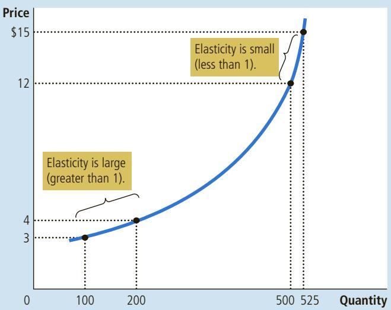

The price elasticity of supply determines whether the supply curve is steep or flat. Note that all percentage changes are calculated using the midpoint method.

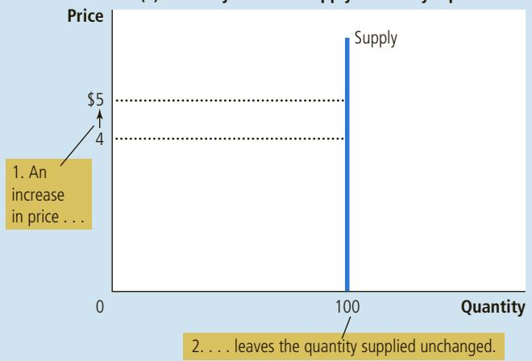  
The Price Elasticity of Supply

## FIGURE 5

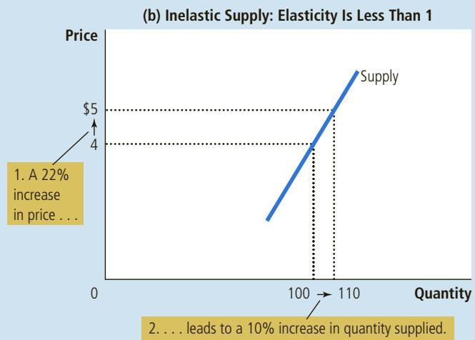

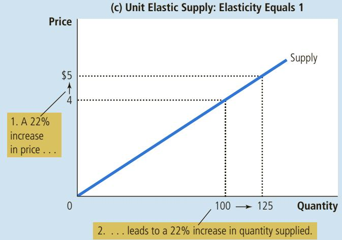

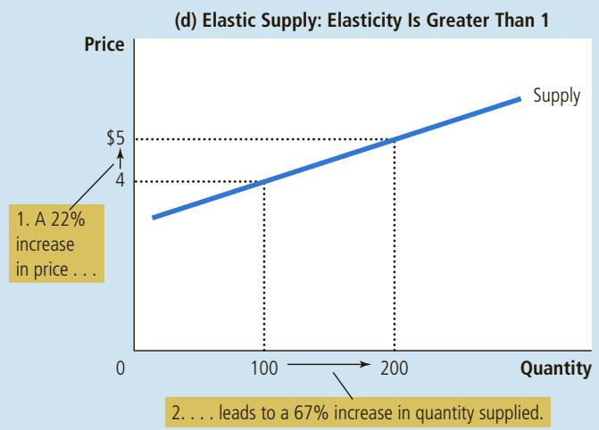

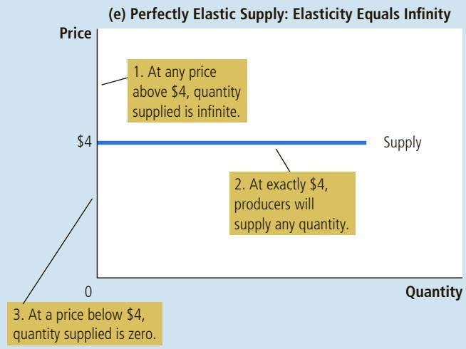

## 5-3 Three Applications of Supply, Demand, and Elasticity

Can good news for farming be bad news for farmers? Why did OPEC, the international oil cartel, fail to keep the price of oil high? Does drug interdiction increase or decrease drug-related crime? At first, these questions might seem to have little in common. Yet all three questions are about markets, and all markets are subject to the forces of supply and demand. Here we apply the versatile tools of supply, demand, and elasticity to answer these seemingly complex questions.

## 5-3a Can Good News for Farming Be Bad News for Farmers?

Imagine you’re a Kansas wheat farmer. Because you earn all your income from selling wheat, you devote much effort to making your land as productive as possible. You monitor weather and soil conditions, check your fields for pests and disease, and study the latest advances in farm technology. You know that the more wheat you grow, the more you will have to sell after the harvest, and the higher your income and standard of living will be.

One day, Kansas State University announces a major discovery. Researchers in its agronomy department have devised a new hybrid of wheat that raises the amount farmers can produce from each acre of land by 20 percent. How should you react to this news? Does this discovery make you better off or worse off than you were before?

Recall from Chapter 4 that we answer such questions in three steps. First, we examine whether the supply or demand curve shifts. Second, we consider the direction in which the curve shifts. Third, we use the supply-and-demand diagram to see how the market equilibrium changes.

In this case, the discovery of the new hybrid affects the supply curve. Because the hybrid increases the amount of wheat that can be produced on each acre of land, farmers are now willing to supply more wheat at any given price. In other words, the supply curve shifts to the right. The demand curve remains the same because consumers’ desire to buy wheat products at any given price is not affected by the introduction of a new hybrid. Figure 7 shows an example of such a change. When the supply curve shifts from $S _ { 1 }$ to $S _ { 2 ^ { \prime } }$ the quantity of wheat sold increases from 100 to 110 and the price of wheat falls from \$3 to \$2.

Does this discovery make farmers better off? As a first cut to answering this question, consider what happens to the total revenue received by farmers. Farmers’ total revenue is $P \times Q ,$ the price of the wheat times the quantity sold. The discovery affects farmers in two conflicting ways. The hybrid allows farmers to produce more wheat (Q rises), but now each bushel of wheat sells for less (P falls).

The price elasticity of demand determines whether total revenue rises or falls. In practice, the demand for basic foodstuffs such as wheat is usually inelastic because these items are relatively inexpensive and have few good substitutes. When the demand curve is inelastic, as it is in Figure 7, a decrease in price causes total revenue to fall. You can see this in the figure: The price of wheat falls substantially, whereas the quantity of wheat sold rises only slightly. Total revenue falls from \$300 to \$220. Thus, the discovery of the new hybrid lowers the total revenue that farmers receive from the sale of their crops.

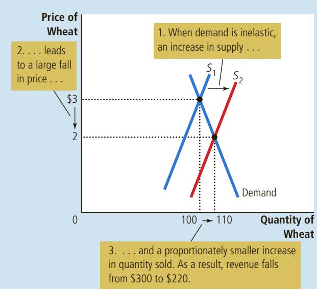

## FIGURE 7

An Increase in Supply in the Market for Wheat When an advance in farm technology increases the supply of wheat from S to S , the price of wheat falls. Because the demand for wheat is inelastic, the increase in the quantity sold from 100 to 110 is proportionately smaller than the decrease in the price from \$3 to \$2. As a result, farmers’ total revenue falls from \$300 (\$3 3 100) to \$220 (\$2 3 110).

If farmers are made worse off by the discovery of this new hybrid, one might wonder why they adopt it. The answer goes to the heart of how competitive markets work. Because each farmer is only a small part of the market for wheat, she takes the price of wheat as given. For any given price of wheat, it is better to use the new hybrid to produce and sell more wheat. Yet when all farmers do this, the supply of wheat increases, the price falls, and farmers are worse off.

This example may at first seem hypothetical, but it helps to explain a major change in the U.S. economy over the past century. Two hundred years ago, most Americans lived on farms. Knowledge about farm methods was sufficiently primitive that most Americans had to be farmers to produce enough food to feed the nation’s population. But over time, advances in farm technology increased the amount of food that each farmer could produce. This increase in food supply, together with the inelastic demand for food, caused farm revenues to fall, which in turn encouraged people to leave farming.

A few numbers show the magnitude of this historic change. As recently as 1950, 10 million people worked on farms in the United States, representing 17 percent of the labor force. Today, fewer than 3 million people work on farms, or 2 percent of the labor force. This change coincided with tremendous advances in farm productivity: Despite the large drop in the number of farmers, U.S. farms now produce about five times as much output as they did in 1950.

This analysis of the market for farm products also explains a seeming paradox of public policy: Certain farm programs try to help farmers by inducing them not to plant crops on all of their land. The purpose of these programs is to reduce the supply of farm products and thereby raise prices. With inelastic demand for their products, farmers as a group receive greater total revenue if they supply a smaller crop to the market. No single farmer would choose to leave her land fallow on her own because each takes the market price as given. But if all farmers do so together, they can all be better off.

OF UNIVERSAL PRESS SYNDICATE. ALL RIGHTS RESERVED. DOONESBURY © 1972 G. B. TRUDEAU. REPRINTED WITH PERMISSION

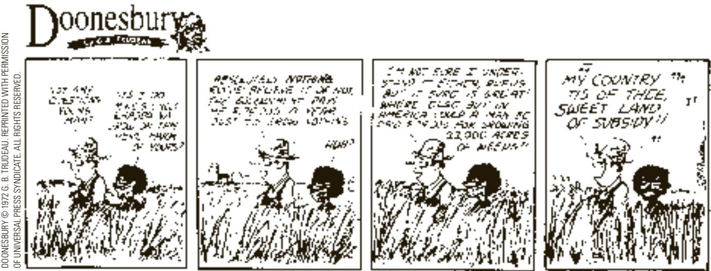

When analyzing the effects of farm technology or farm policy, it is important to keep in mind that what is good for farmers is not necessarily good for society as a whole. Improvement in farm technology can be bad for farmers because it makes farmers increasingly unnecessary, but it is surely good for consumers who pay less for food. Similarly, a policy aimed at reducing the supply of farm products may raise the incomes of farmers, but it does so at the expense of consumers.

## 5-3b Why Did OPEC Fail to Keep the Price of Oil High?

Many of the most disruptive events for the world’s economies over the past several decades have originated in the world market for oil. In the 1970s, members of the Organization of the Petroleum Exporting Countries (OPEC) decided to raise the world price of oil to increase their incomes. These countries accomplished this goal by agreeing to jointly reduce the amount of oil they supplied. As a result, the price of oil (adjusted for overall inflation) rose more than 50 percent from 1973 to 1974. Then, a few years later, OPEC did the same thing again. From 1979 to 1981, the price of oil approximately doubled.

Yet OPEC found it difficult to maintain such a high price. From 1982 to 1985, the price of oil steadily declined about 10 percent per year. Dissatisfaction and disarray soon prevailed among the OPEC countries. In 1986, cooperation among OPEC members completely broke down, and the price of oil plunged 45 percent. In 1990, the price of oil (adjusted for overall inflation) was back to where it began in 1970, and it stayed at that low level throughout most of the 1990s. (In the first decade and a half of the 21st century, the price of oil fluctuated substantially once again, but the main driving force was not OPEC supply restrictions. Instead, booms and busts in economies around the world caused demand to fluctuate, while advances in fracking technology caused large increases in supply.)

The OPEC episodes of the 1970s and 1980s show how supply and demand can behave differently in the short run and in the long run. In the short run, both the supply and demand for oil are relatively inelastic. Supply is inelastic because the quantity of known oil reserves and the capacity for oil extraction cannot be changed quickly. Demand is inelastic because buying habits do not respond immediately to changes in price. Thus, as panel (a) of Figure 8 shows, the short-run

(a) The Oil Market in the Short Run

When the supply of oil falls, the response depends on the time horizon. In the short run, supply and demand are relatively inelastic, as in panel (a). Thus, when the supply curve shifts from $S _ { 1 }$ to ${ \cal S } _ { 2 } ,$ the price rises substantially. In the long run, however, supply and demand are relatively elastic, as in panel (b). In this case, the same size shift in the supply curve (S to S ) causes a smaller increase in the price.

## FIGURE 8

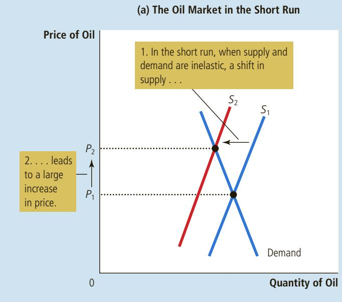  
A Reduction in Supply in the World Market for Oil  
(b) The Oil Market in the Long Run

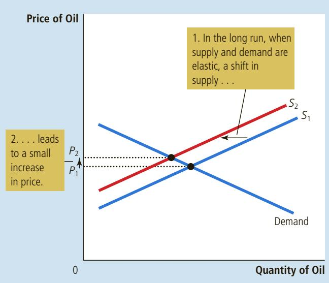

supply and demand curves are steep. When the supply of oil shifts from $S _ { 1 }$ to $S _ { 2 ^ { \prime } }$ the price increase from $P _ { 1 }$ to $P _ { 2 }$ is large.

The situation is very different in the long run. Over long periods of time, producers of oil outside OPEC respond to high prices by increasing oil exploration and by building new extraction capacity. Consumers respond with greater conservation, such as by replacing old inefficient cars with newer efficient ones. Thus, as panel (b) of Figure 8 shows, the long-run supply and demand curves are more elastic. In the long run, the shift in the supply curve from $S _ { 1 }$ to $S _ { 2 }$ causes a much smaller increase in the price.

This analysis shows why OPEC succeeded in maintaining a high price of oil only in the short run. When OPEC countries agreed to reduce their production of oil, they shifted the supply curve to the left. Even though each OPEC member sold less oil, the price rose by so much in the short run that OPEC incomes rose. In the long run, however, supply and demand are more elastic. As a result, the same reduction in supply, measured by the horizontal shift in the supply curve, caused a smaller increase in the price. Thus, OPEC’s coordinated reduction in supply proved less profitable in the long run. The cartel learned that raising prices is easier in the short run than in the long run.

## 5-3c Does Drug Interdiction Increase or Decrease Drug-Related Crime?

A persistent problem facing our society is the use of illegal drugs, such as heroin, cocaine, ecstasy, and methamphetamine. Drug use has several adverse effects. One is that drug dependence can ruin the lives of drug users and their families.

Another is that drug addicts often turn to robbery and other violent crimes to obtain the money needed to support their habit. To discourage the use of illegal drugs, the U.S. government devotes billions of dollars each year to reducing the flow of drugs into the country. Let’s use the tools of supply and demand to examine this policy of drug interdiction.

Suppose the government increases the number of federal agents devoted to the war on drugs. What happens in the market for illegal drugs? As usual, we answer this question in three steps. First, we consider whether the supply or demand curve shifts. Second, we consider the direction of the shift. Third, we see how the shift affects the equilibrium price and quantity.

Although the purpose of drug interdiction is to reduce drug use, its direct impact is on the sellers of drugs rather than on the buyers. When the government stops some drugs from entering the country and arrests more smugglers, it raises the cost of selling drugs and, therefore, reduces the quantity of drugs supplied at any given price. The demand for drugs—the amount buyers want at any given price—remains the same. As panel (a) of Figure 9 shows, interdiction shifts the supply curve to the left from $S _ { 1 }$ to $S _ { 2 }$ without changing the demand curve. The equilibrium price of drugs rises from $P _ { 1 }$ to $P _ { 2 ^ { \prime } }$ and the equilibrium quantity falls from $Q _ { 1 }$ to $\bar { Q _ { 2 } } .$ The fall in the equilibrium quantity shows that drug interdiction does reduce drug use.

But what about the amount of drug-related crime? To answer this question, consider the total amount that drug users pay for the drugs they buy. Because few

## FIGURE 9

Policies to Reduce the Use of Illegal Drugs

Drug interdiction reduces the supply of drugs from $S _ { 1 }$ to $S _ { 2 }$ , as in panel (a). If the demand for drugs is inelastic, then the total amount paid by drug users rises, even as the amount of drug use falls. By contrast, drug education reduces the demand for drugs from $D _ { 1 }$ to $D _ { 2 } ,$ as in panel (b). Because both price and quantity fall, the amount paid by drug users falls.

(a) Drug Interdiction  
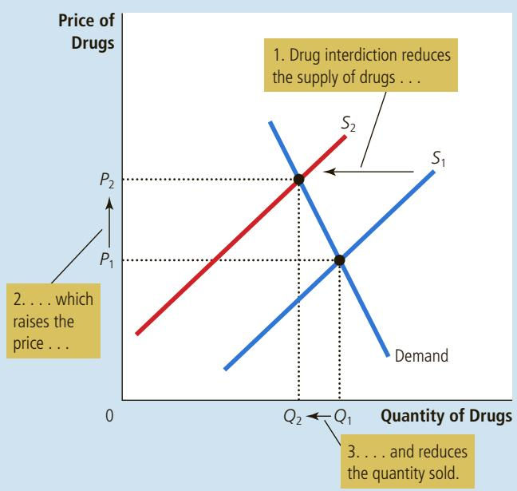

(b) Drug Education  
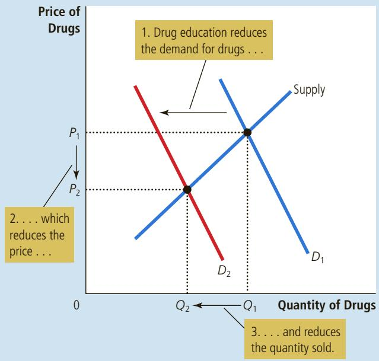

drug addicts are likely to break their destructive habits in response to a higher price, it is likely that the demand for drugs is inelastic, as it is drawn in the figure. If demand is inelastic, then an increase in price raises total revenue in the drug market. That is, because drug interdiction raises the price of drugs proportionately more than it reduces drug use, it raises the total amount of money that drug users pay for drugs. Addicts who already had to steal to support their habits would have an even greater need for quick cash. Thus, drug interdiction could increase drug-related crime.

Because of this adverse effect of drug interdiction, some analysts argue for alternative approaches to the drug problem. Rather than trying to reduce the supply of drugs, policymakers might try to reduce the demand by pursuing a policy of drug education. Successful drug education has the effects shown in panel (b) of Figure 9. The demand curve shifts to the left from $D _ { 1 }$ to $D _ { 2 } .$ As a result, the equilibrium quantity falls from $Q _ { 1 }$ to $Q _ { 2 ^ { \prime } }$ and the equilibrium price falls from $P _ { 1 }$ to $P _ { 2 } .$ Total revenue, $\vert P \times Q \vert$ , also falls. Thus, in contrast to drug interdiction, drug education can reduce both drug use and drug-related crime.

Advocates of drug interdiction might argue that the long-run effects of this policy are different from the short-run effects because the elasticity of demand depends on the time horizon. The demand for drugs is probably inelastic over short periods because higher prices do not substantially affect drug use by established addicts. But demand may be more elastic over longer periods because higher prices would discourage experimentation with drugs among the young and, over time, lead to fewer drug addicts. In this case, drug interdiction would increase drug-related crime in the short run but decrease it in the long run.

QuickQuiz How might a drought that destroys half of all farm crops be good for farmers? If such a drought is good for farmers, why don’t farmers destroy their own crops in the absence of a drought?

## 5-4 Conclusion

According to an old quip, even a parrot can become an economist simply by learning to say “supply and demand.” These last two chapters should have convinced you that there is much truth to this statement. The tools of supply and demand allow you to analyze many of the most important events and policies that shape the economy. You are now well on your way to becoming an economist (or at least a well-educated parrot).

## CHAPTER QuickQuiz

1. A life-saving medicine without any close substitutes will tend to have a. a small elasticity of demand. b. a large elasticity of demand. c. a small elasticity of supply. d. a large elasticity of supply.

2. The price of a good rises from \$8 to \$12, and the quantity demanded falls from 110 to 90 units. Calculated with the midpoint method, the price elasticity of demand is a. 1/5. b. 1/2. c. 2. d. 5.

3. A linear, downward-sloping demand curve is a. inelastic b. unit elastic. c. elastic. d. inelastic at some points, and elastic at others.

4. The ability of firms to enter and exit a market over time means that, in the long run, a. the demand curve is more elastic. b. the demand curve is less elastic. c. the supply curve is more elastic. d. the supply curve is less elastic.

5. An increase in the supply of a good will decrease the total revenue producers receive if a. the demand curve is inelastic. b. the demand curve is elastic. c. the supply curve is inelastic. d. the supply curve is elastic.

6. Over time, technological advance increases consumers’ incomes and reduces the price of smartphones. Each of these forces increases the amount consumers spend on smartphones if the income elasticity of demand is greater than and if the price elasticity of demand is greater than a. zero, zero b. zero, one c. one, zero d. one, one

## SUMMARY

The price elasticity of demand measures how much the quantity demanded responds to changes in the price. Demand tends to be more elastic if close substitutes are available, if the good is a luxury rather than a necessity, if the market is narrowly defined, or if buyers have substantial time to react to a price change.

The price elasticity of demand is calculated as the percentage change in quantity demanded divided by the percentage change in price. If quantity demanded moves proportionately less than the price, then the elasticity is less than 1 and demand is said to be inelastic. If quantity demanded moves proportionately more than the price, then the elasticity is greater than 1 and demand is said to be elastic.

Total revenue, the total amount paid for a good, equals the price of the good times the quantity sold. For inelastic demand curves, total revenue moves in the same direction as the price. For elastic demand curves, total revenue moves in the opposite direction as the price.

• The income elasticity of demand measures how much the quantity demanded responds to changes in consumers’ income. The cross-price elasticity of demand measures how much the quantity demanded of one good responds to changes in the price of another good.

The price elasticity of supply measures how much the quantity supplied responds to changes in the price. This elasticity often depends on the time horizon under consideration. In most markets, supply is more elastic in the long run than in the short run.

The price elasticity of supply is calculated as the percentage change in quantity supplied divided by the percentage change in price. If quantity supplied moves proportionately less than the price, then the elasticity is less than 1 and supply is said to be inelastic. If quantity supplied moves proportionately more than the price, then the elasticity is greater than 1 and supply is said to be elastic.

The tools of supply and demand can be applied in many different kinds of markets. This chapter uses them to analyze the market for wheat, the market for oil, and the market for illegal drugs.

## KEY CONCEPTS

elasticity, p. 90 price elasticity of demand, p. 90 cross-price elasticity of demand, p. 98 price elasticity of supply, p. 99

total revenue, p. 95 income elasticity of demand, p. 98

## QUESTIONS FOR REVIEW

1. Define the price elasticity of demand and the income elasticity of demand.

2. List and explain the four determinants of the price elasticity of demand discussed in the chapter.

3. If the elasticity is greater than 1, is demand elastic or inelastic? If the elasticity equals zero, is demand perfectly elastic or perfectly inelastic?

4. On a supply-and-demand diagram, show equilibrium price, equilibrium quantity, and the total revenue received by producers.

5. If demand is elastic, how will an increase in price change total revenue? Explain.

6. What do we call a good with an income elasticity less than zero?

7. How is the price elasticity of supply calculated? Explain what it measures.

8. If a fixed quantity of a good is available, and no more can be made, what is the price elasticity of supply?

9. A storm destroys half the fava bean crop. Is this event more likely to hurt fava bean farmers if the demand for fava beans is very elastic or very inelastic? Explain.

## PROBLEMS AND APPLICATIONS

1. For each of the following pairs of goods, which good would you expect to have more elastic demand and why?

a. required textbooks or mystery novels

b. Beethoven recordings or classical music recordings in general

c. subway rides during the next 6 months or subway rides during the next 5 years

d. root beer or water

2. Suppose that business travelers and vacationers have the following demand for airline tickets from New York to Boston:

<table><tr><td>Price</td><td>Quantity Demanded (business travelers)</td><td>Quantity Demanded (vacationers)</td></tr><tr><td>$150</td><td>2,100 tickets</td><td>1,000 tickets</td></tr><tr><td>200</td><td>2,000</td><td>800</td></tr><tr><td>250</td><td>1,900</td><td>600</td></tr><tr><td>300</td><td>1,800</td><td>400</td></tr></table>

a. As the price of tickets rises from \$200 to \$250, what is the price elasticity of demand for (i) business travelers and (ii) vacationers? (Use the midpoint method in your calculations.)

b. Why might vacationers have a different elasticity from business travelers?

3. Suppose the price elasticity of demand for heating oil is 0.2 in the short run and 0.7 in the long run.

a. If the price of heating oil rises from \$1.80 to \$2.20 per gallon, what happens to the quantity of heating oil demanded in the short run? In the long run? (Use the midpoint method in your calculations.)

b. Why might this elasticity depend on the time horizon?

4. A price change causes the quantity demanded of a good to decrease by 30 percent, while the total revenue of that good increases by 15 percent. Is the demand curve elastic or inelastic? Explain.

5. Cups of coffee and donuts are complements. Both have inelastic demand. A hurricane destroys half the coffee bean crop. Use appropriately labeled diagrams to answer the following questions.

a. What happens to the price of coffee beans?

b. What happens to the price of a cup of coffee? What happens to total expenditure on cups of coffee?

c. What happens to the price of donuts? What happens to total expenditure on donuts?

6. The price of coffee rose sharply last month, while the quantity sold remained the same. Five people suggest various explanations:

Leonard: Demand increased, but supply was perfectly inelastic.

Sheldon: Demand increased, but it was perfectly inelastic.

Penny: Demand increased, but supply decreased at the same time.

Howard: Supply decreased, but demand was unit elastic.

Raj: Supply decreased, but demand was perfectly inelastic.

Who could possibly be right? Use graphs to explain your answer.

7. Suppose that your demand schedule for pizza is as follows:

<table><tr><td>Price</td><td>Quantity Demanded (income = $20,000)</td><td>Quantity Demanded (income = $24,000)</td></tr><tr><td>$8</td><td>40 pizza</td><td>50 pizza</td></tr><tr><td>10</td><td>32</td><td>45</td></tr><tr><td>12</td><td>24</td><td>30</td></tr><tr><td>14</td><td>16</td><td>20</td></tr><tr><td>16</td><td>8</td><td>12</td></tr></table>

a. Use the midpoint method to calculate your price elasticity of demand as the price of pizza increases from \$8 to \$10 if (i) your income is \$20,000 and (ii) your income is \$24,000.

b. Calculate your income elasticity of demand as your income increases from \$20,000 to \$24,000 if (i) the price is \$12 and (ii) the price is \$16.

8. The New York Times reported (Feb. 17, 1996) that subway ridership declined after a fare increase: “There were nearly four million fewer riders in December 1995, the first full month after the price of a token increased 25 cents to \$1.50, than in the previous December, a 4.3 percent decline.”

a. Use these data to estimate the price elasticity of demand for subway rides.

b. According to your estimate, what happens to the Transit Authority’s revenue when the fare rises?

c. Why might your estimate of the elasticity be unreliable?

9. Two drivers, Walt and Jessie, each drive up to a gas station. Before looking at the price, each places an order. Walt says, “I’d like 10 gallons of gas.” Jessie says, “I’d like \$10 worth of gas.” What is each driver’s price elasticity of demand?

10. Consider public policy aimed at smoking.

a. Studies indicate that the price elasticity of demand for cigarettes is about 0.4. If a pack of cigarettes currently costs \$5 and the government wants to reduce smoking by 20 percent, by how much should it increase the price?

b. If the government permanently increases the price of cigarettes, will the policy have a larger effect on smoking 1 year from now or 5 years from now?

c. Studies also find that teenagers have a higher price elasticity of demand than adults. Why might this be true?

11. You are the curator of a museum. The museum is running short of funds, so you decide to increase revenue. Should you increase or decrease the price of admission? Explain.

12. Explain why the following might be true: A drought around the world raises the total revenue that farmers receive from the sale of grain, but a drought only in Kansas reduces the total revenue that Kansas farmers receive.

To find additional study resources, visit cengagebrain.com, and search for “Mankiw.”

conomists have two roles. As scientists, they develop and test theories to explain the world around them. As policy advisers, they use these theories to help change the world for the better. The focus of the preceding two chapters has been scientific. We have seen how supply and demand determine the price of a good and the quantity of the good sold. We have also seen how various events shift supply and demand, thereby changing the equilibrium price and quantity. And we have developed the concept of elasticity to gauge the size of these changes.

This chapter offers our first look at policy. Here we analyze various types of government policy using only the tools of supply and demand. As you will see, the analysis yields some surprising insights. Policies often have effects that their architects did not intend or anticipate.

We begin by considering policies that directly control prices. For example, rent-control laws set a maximum rent that landlords may charge tenants. Minimum-wage laws set the lowest wage that firms may pay workers. Price controls are usually enacted when policymakers believe that the market price of a good or service is unfair to buyers or sellers. Yet, as we will see, these policies can generate inequities of their own.

After discussing price controls, we consider the impact of taxes. Policymakers use taxes to raise revenue for public purposes and to influence market outcomes. Although the prevalence of taxes in our economy is obvious, their effects are not. For example, when the government levies a tax on the amount that firms pay their workers, do the firms or the workers bear the burden of the tax? The answer is not at all clear—until we apply the powerful tools of supply and demand.

## 6-1 Controls on Prices

To see how price controls affect market outcomes, let’s look once again at the market for ice cream. As we saw in Chapter 4, if ice cream is sold in a competitive market free of government regulation, the price of ice cream adjusts to balance supply and demand: At the equilibrium price, the quantity of ice cream that buyers want to buy exactly equals the quantity that sellers want to sell. To be concrete, let’s suppose that the equilibrium price is \$3 per cone.

Some people may not be happy with the outcome of this free-market process. The American Association of Ice-Cream Eaters complains that the \$3 price is too high for everyone to enjoy a cone a day (their recommended daily allowance). Meanwhile, the National Organization of Ice-Cream Makers complains that the \$3 price—the result of “cutthroat competition”—is too low and is depressing the incomes of its members. Each of these groups lobbies the government to pass laws that alter the market outcome by directly controlling the price of an ice-cream cone.

Because buyers of any good always want a lower price while sellers want a higher price, the interests of the two groups conflict. If the Ice-Cream Eaters are successful in their lobbying, the government imposes a legal maximum on the price at which ice-cream cones can be sold. Because the price is not allowed to rise above this level, the legislated maximum is called a price ceiling. By contrast, if the Ice-Cream Makers are successful, the government imposes a legal minimum on the price. Because the price cannot fall below this level, the legislated minimum is called a price floor. Let us consider the effects of these policies in turn.

price floor a legal minimum on the price at which a good can be sold

## 6-1a How Price Ceilings Affect Market Outcomes

When the government, moved by the complaints and campaign contributions of the Ice-Cream Eaters, imposes a price ceiling in the market for ice cream, two outcomes are possible. In panel (a) of Figure 1, the government imposes a price ceiling of \$4 per cone. In this case, because the price that balances supply and demand (\$3) is below the ceiling, the price ceiling is not binding. Market forces naturally move the economy to the equilibrium, and the price ceiling has no effect on the price or the quantity sold.

In panel (a), the government imposes a price ceiling of \$4. Because the price ceiling is above the equilibrium price of \$3, the price ceiling has no effect, and the market can reach the equilibrium of supply and demand. In this equilibrium, quantity supplied and quantity demanded both equal 100 cones. In panel (b), the government imposes a price ceiling of \$2. Because the price ceiling is below the equilibrium price of \$3, the market price equals \$2. At this price, 125 cones are demanded and only 75 are supplied, so there is a shortage of 50 cones.

## FIGURE 1

A Market with a Price Ceiling

(a) A Price Ceiling That Is Not Binding  
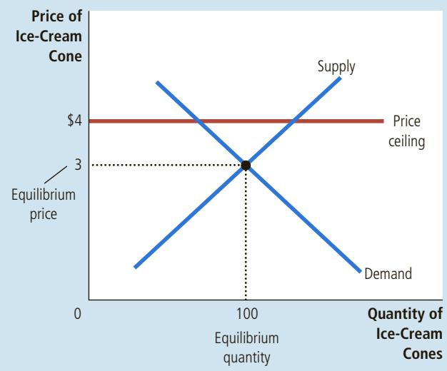

(b) A Price Ceiling That Is Binding  
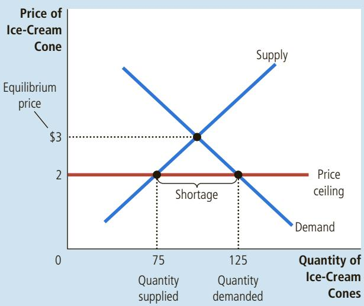

Panel (b) of Figure 1 shows the other, more interesting, possibility. In this case, the government imposes a price ceiling of \$2 per cone. Because the equilibrium price of \$3 is above the price ceiling, the ceiling is a binding constraint on the market. The forces of supply and demand tend to move the price toward the equilibrium price, but when the market price hits the ceiling, it cannot, by law, rise any further. Thus, the market price equals the price ceiling. At this price, the quantity of ice cream demanded (125 cones in the figure) exceeds the quantity supplied (75 cones). Because of this excess demand of 50 cones, some people who want to buy ice cream at the going price are unable to do so. In other words, there is a shortage of ice cream.

In response to this shortage, some mechanism for rationing ice cream will naturally develop. The mechanism could be long lines: Buyers who are willing to arrive early and wait in line get a cone, while those unwilling to wait do not. Alternatively, sellers could ration ice-cream cones according to their own personal biases, selling them only to friends, relatives, or members of their own racial or ethnic group. Notice that even though the price ceiling was motivated by a desire to help buyers of ice cream, not all buyers benefit from the policy. Some buyers do get to pay a lower price, although they may have to wait in line to do so, but other buyers cannot get any ice cream at all.

This example in the market for ice cream shows a general result: When the government imposes a binding price ceiling on a competitive market, a shortage of the good arises, and sellers must ration the scarce goods among the large number of potential buyers. The rationing mechanisms that develop under price ceilings are rarely desirable. Long lines are inefficient because they waste buyers’ time. Discrimination according to seller bias is both inefficient (because the good may not go to the buyer who values it most highly) and often unfair. By contrast, the rationing mechanism in a free, competitive market is both efficient and impersonal. When the market for ice cream reaches its equilibrium, anyone who wants to pay the market price can get a cone. Free markets ration goods with prices.

