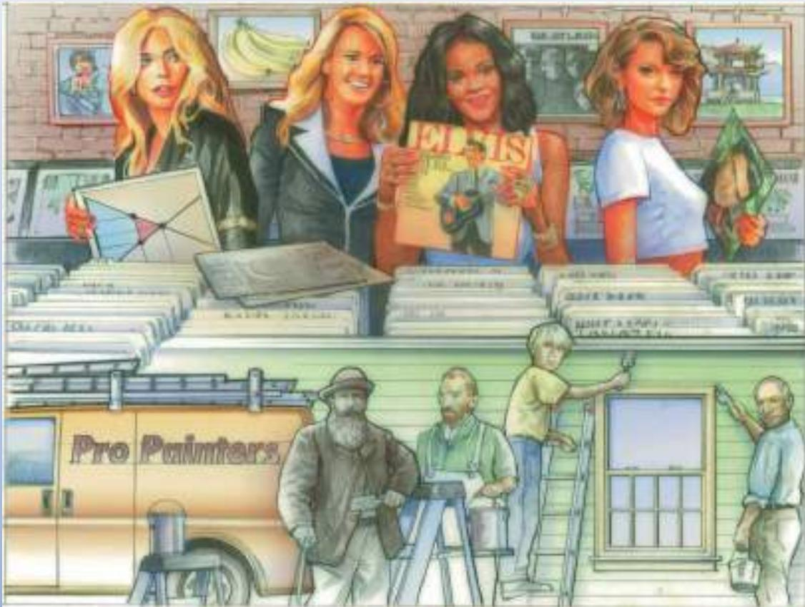

## PROBLEMS AND APPLICATIONS

1. Lovers of classical music persuade Congress to impose a price ceiling of \$40 per concert ticket. As a result of this policy, do more or fewer people attend classical music concerts? Explain.

2. The government has decided that the free-market price of cheese is too low.

a. Suppose the government imposes a binding price floor in the cheese market. Draw a supply-anddemand diagram to show the effect of this policy on the price of cheese and the quantity of cheese sold. Is there a shortage or surplus of cheese?

b. Producers of cheese complain that the price floor has reduced their total revenue. Is this possible? Explain.

c. In response to cheese producers’ complaints, the government agrees to purchase all the surplus cheese at the price floor. Compared to the basic price floor, who benefits from this new policy? Who loses?

3. A recent study found that the demand-and-supply schedules for Frisbees are as follows:

<table><tr><td>Price per Frisbee</td><td>Quantity Demanded</td><td>Quantity Supplied</td></tr><tr><td>$11</td><td>1 million Frisbees</td><td>15 million Frisbees</td></tr><tr><td>10</td><td>2</td><td>12</td></tr><tr><td>9</td><td>4</td><td>9</td></tr><tr><td>8</td><td>6</td><td>6</td></tr><tr><td>7</td><td>8</td><td>3</td></tr><tr><td>6</td><td>10</td><td>1</td></tr></table>

a. What are the equilibrium price and quantity of Frisbees?

b. Frisbee manufacturers persuade the government that Frisbee production improves scientists’ understanding of aerodynamics and thus is important for national security. A concerned Congress votes to impose a price floor \$2 above the equilibrium price. What is the new market price? How many Frisbees are sold?

c. Irate college students march on Washington and demand a reduction in the price of Frisbees. An even more concerned Congress votes to repeal the price floor and impose a price ceiling \$1 below the former price floor. What is the new market price? How many Frisbees are sold?

4. Suppose the federal government requires beer drinkers to pay a \$2 tax on each case of beer purchased. (In fact, both the federal and state governments impose beer taxes of some sort.)

a. Draw a supply-and-demand diagram of the market for beer without the tax. Show the price paid by consumers, the price received by producers, and the quantity of beer sold. What is the difference between the price paid by consumers and the price received by producers?

b. Now draw a supply-and-demand diagram for the beer market with the tax. Show the price paid by consumers, the price received by producers, and the quantity of beer sold. What is the difference between the price paid by consumers and the price received by producers? Has the quantity of beer sold increased or decreased?

5. A senator wants to raise tax revenue and make workers better off. A staff member proposes raising the payroll tax paid by firms and using part of the extra revenue to reduce the payroll tax paid by workers. Would this accomplish the senator’s goal? Explain.

6. If the government places a \$500 tax on luxury cars, will the price paid by consumers rise by more than \$500, less than \$500, or exactly \$500? Explain.

7. Congress and the president decide that the United States should reduce air pollution by reducing its use of gasoline. They impose a \$0.50 tax on each gallon of gasoline sold.

a. Should they impose this tax on producers or consumers? Explain carefully using a supply-and-demand diagram.

b. If the demand for gasoline were more elastic, would this tax be more effective or less effective in reducing the quantity of gasoline consumed? Explain with both words and a diagram.

c. Are consumers of gasoline helped or hurt by this tax? Why?

d. Are workers in the oil industry helped or hurt by this tax? Why?

8. A case study in this chapter discusses the federal minimum-wage law.

a. Suppose the minimum wage is above the equilibrium wage in the market for unskilled labor. Using a supply-and-demand diagram of the market for unskilled labor, show the market wage, the number of workers who are employed, and the number of workers who are unemployed. Also show the total wage payments to unskilled workers.

b. Now suppose the secretary of labor proposes an increase in the minimum wage. What effect would this increase have on employment? Does the change in employment depend on the elasticity of demand, the elasticity of supply, both elasticities, or neither?

c. What effect would this increase in the minimum wage have on unemployment? Does the change in unemployment depend on the elasticity of demand, the elasticity of supply, both elasticities, or neither?

d. If the demand for unskilled labor were inelastic, would the proposed increase in the minimum wage raise or lower total wage payments to unskilled workers? Would your answer change if the demand for unskilled labor were elastic?

9. At Fenway Park, home of the Boston Red Sox, seating is limited to about 38,000. Hence, the number of tickets issued is fixed at that figure. Seeing a golden opportunity to raise revenue, the City of Boston levies a per ticket tax of \$5 to be paid by the ticket buyer. Boston sports fans, a famously civic-minded lot,

dutifully send in the \$5 per ticket. Draw a well-labeled graph showing the impact of the tax. On whom does the tax burden fall—the team’s owners, the fans, or both? Why?

10. A market is described by the following supply and demand curves:

$$
\begin{array}{l} Q ^ {S} = 2 P \\ Q ^ {D} = 3 0 0 - P \end{array}
$$

a. Solve for the equilibrium price and quantity.

b. If the government imposes a price ceiling of \$90, does a shortage or surplus (or neither) develop? What are the price, quantity supplied, quantity demanded, and size of the shortage or surplus?

c. If the government imposes a price floor of \$90, does a shortage or surplus (or neither) develop? What are the price, quantity supplied, quantity demanded, and size of the shortage or surplus?

d. Instead of a price control, the government levies a tax on producers of \$30. As a result, the new supply curve is:

$$
Q ^ {S} = 2 (P - 3 0).
$$

Does a shortage or surplus (or neither) develop? What are the price, quantity supplied, quantity demanded, and size of the shortage or surplus?

To find additional study resources, visit cengagebrain.com, and search for “Mankiw.”

## PART III Markets and Welfare

