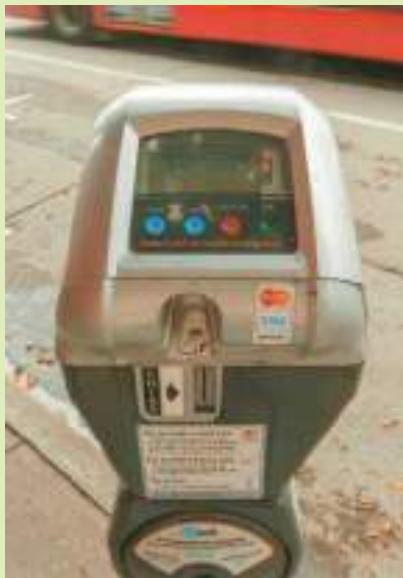
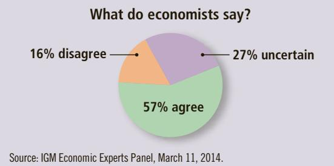
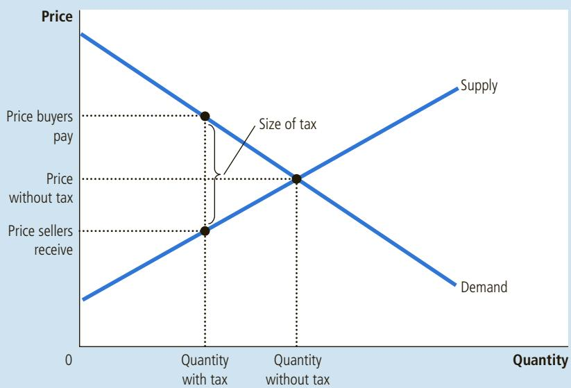
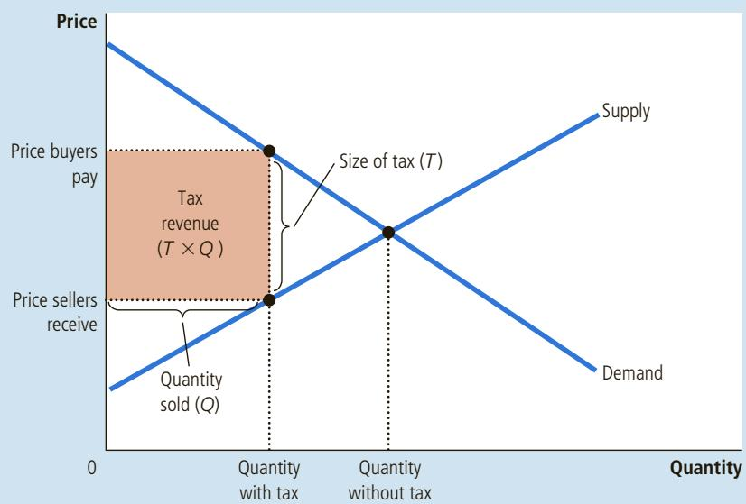
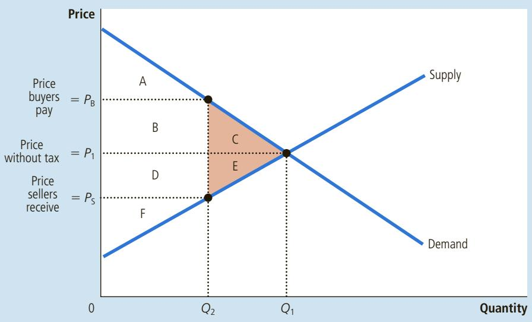
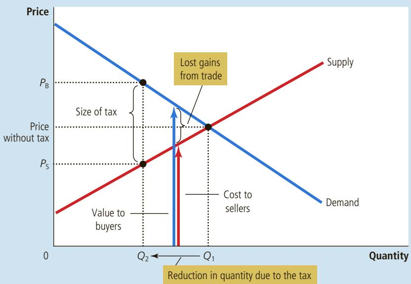
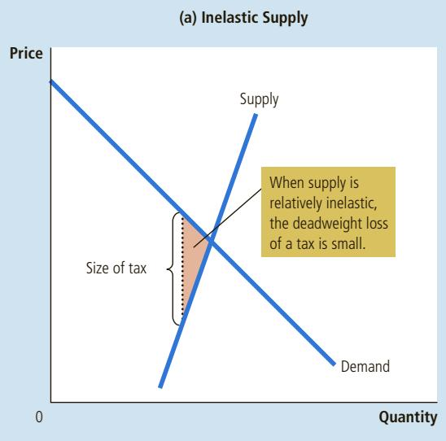
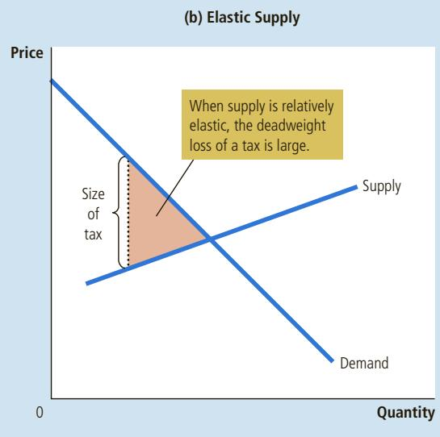
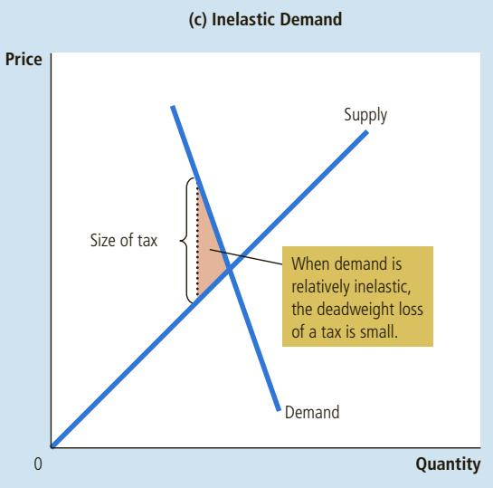
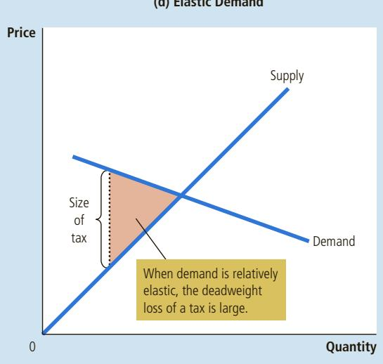

# The Invisible Hand Can Park Your Car

In many cities, finding an available parking spot on the street seems about as likely as winning the lottery. But if local governments relied more on the price system, they might be able to achieve a more efficient allocation of this scarce resource.

## A Meter So Expensive, It Creates Parking Spots

By Michael Cooper and Jo Craven McGinty

AN FRANCISCO—The maddening quest for street parking is not just a tribulation for drivers, but a trial for cities. As much as a third of the traffic in some areas has been attributed to drivers circling as they hunt for spaces. The wearying tradition takes a toll in lost time, polluted air and, when drivers despair, double-parked cars that clog traffic even more.

But San Francisco is trying to shorten the hunt with an ambitious experiment that aims to make sure that there is always at least one empty parking spot available on every block that has meters. The program, which uses new technology and the law of supply and demand, raises the price of parking on the city’s most crowded blocks and lowers it on its emptiest blocks. While the new prices are still being phased in—the most expensive spots have risen to \$4.50 an hour, but could reach \$6— preliminary data suggests that the change may be having a positive effect in some areas.

Change can already be seen on a stretch of Drumm Street downtown near the Embarcadero and the popular restaurants at the Ferry Building. Last summer it was nearly impossible to find spots there. But after the city gradually raised the price of parking to \$4.50 an hour from \$3.50, high-tech sensors embedded in the street showed that spots were available a little more often—leaving a welcome space the other day for the silver Toyota Corolla driven by Victor Chew, a salesman for a commercial dishwasher company who frequently parks in the area.

“There are more spots available now,” said Mr. Chew, 48. “Now I don’t have to walk half a mile.”

San Francisco’s parking experiment is the latest major attempt to improve the uneasy relationship between cities and the internal combustion engine—a century-long saga that has seen cities build highways and tear them down, widen streets and narrow them, and make more parking available at some times and discourage it at others, all to try to make their downtowns accessible but not too congested.

The program here is being closely watched by cities around the country. With the help of a federal grant, San Francisco installed parking sensors and new meters at roughly a quarter of its 26,800 metered spots to track when and where cars are parked. And beginning last

Society is lucky that the planner doesn’t need to intervene. Although it has been a useful exercise imagining what an all-knowing, all-powerful, well-intentioned dictator would do, let’s face it: Such characters are hard to come by. Dictators are rarely benevolent, and even if we found someone so virtuous, she would lack crucial information.

Suppose our social planner tried to choose an efficient allocation of resources on her own, instead of relying on market forces. To do so, she would need to know the value of a particular good to every potential consumer in the market and the cost for every potential producer. And she would need this information not only for this market but for every one of the many thousands of markets in the economy. The task is practically impossible, which explains why centrally planned economies never work very well.

The planner’s job becomes easy, however, once she takes on a partner: Adam Smith’s invisible hand of the marketplace. The invisible hand takes all the information about buyers and sellers into account and guides everyone in the market to the best outcome as judged by the standard of economic efficiency. It is a truly remarkable feat. That is why economists so often advocate free markets as the best way to organize economic activity.

summer, the city began tweaking its prices every two months—giving it the option of raising them 25 cents an hour, or lowering them by as much as 50 cents—in the hope of leaving each block with at least one available spot. The city also has cut prices at many of the garages and parking lots it manages, to lure cars off the street….

The program is the biggest test yet of the theories of Donald Shoup, a professor of urban planning at the University of California, Los Angeles. His 2005 book, “The High Cost of Free Parking,” made him something of a cult figure to city planners—a Facebook group, The Shoupistas, has more than a thousand members. “I think the basic idea is that we will see a lot of benefits if we get the price of curbside parking right, which is the lowest price a city can charge and still have one or two vacant spaces available on every block,” he said.

But raising prices is rarely popular. A chapter in Mr. Shoup’s book opens with a quote from George Costanza, the “Seinfeld” character: “My father didn’t pay for parking, my mother, my brother, nobody. It’s like going to a prostitute. Why should I pay when, if I apply myself, maybe I can get it for free?” Some San Francisco neighborhoods recently objected to a proposal to install meters on streets where parking is now free. And raising prices in the most desirable areas raises concerns that it will make them less accessible to the poor.

CRISTINAMURACA/SHUTTERSTOCK.COM

  
The new San Francisco electronic parking meter helps equilibrate supply and demand.

That was on the minds of some parkers on Drumm Street, where the midday occupancy rate on one block fell to 86 percent from 98 percent after prices rose. Edward Saldate, 55, a hairstylist who paid nearly \$17 for close to four hours of parking there, called it “a big rip-off.”

Tom Randlett, 69, an accountant, said that he was pleased to be able to find a spot there for the first time, but acknowledged that the program was “complicated on the social equity level.”

Officials note that parking rates are cut as often as they are raised. And Professor Shoup said that the program would benefit many poor people, including the many San Franciscans who do not have cars, because all parking revenues are used for mass transit and any reduction in traffic will speed the buses many people here rely on. And he imagined a day when drivers will no longer attribute good parking spots to luck or karma.

“It will be taken for granted,” he said, “the way you take it for granted that when you go to a store you can get fresh bananas or apples.”

Source: New York Times, March 15, 2012.

## SHOULD THERE BE A MARKET FOR ORGANS?

CASE Some years ago, the front page of The Boston Globe ran the head-STUDY line “How a Mother’s Love Helped Save Two Lives.” The newspaper told the story of Susan Stephens, a woman whose son needed a kidney transplant. When the doctor learned that the mother’s kidney was not compatible, he proposed a novel solution: If Stephens donated one of her kidneys to a stranger, her son would move to the top of the kidney waiting list. The mother accepted the deal, and soon two patients had the transplants they were waiting for.

The ingenuity of the doctor’s proposal and the nobility of the mother’s act cannot be doubted. But the story raises some intriguing questions. If the mother could trade a kidney for a kidney, would the hospital allow her to trade a kidney for an expensive, experimental cancer treatment that she could not otherwise afford? Should she be allowed to exchange her kidney for free tuition for her son at the hospital’s medical school? Should she be able to sell her kidney and use the cash to trade in her old Chevy for a new Lexus?

As a matter of public policy, our society makes it illegal for people to sell their organs. In essence, in the market for organs, the government has imposed a price

## ASK THE EXPERTS

## Supplying Kidneys

“A market that allows payment for human kidneys should be established on a trial basis to help extend the lives of patients with kidney disease.”

  
Source: IGM Economic Experts Panel, March 11, 2014.

ceiling of zero. The result, as with any binding price ceiling, is a shortage of the good. The deal in the Stephens case did not fall under this prohibition because no cash changed hands.

Many economists believe that there would be large benefits to allowing a free market for organs. People are born with two kidneys, but they usually need only one. Meanwhile, some people suffer from illnesses that leave them without any working kidney. Despite the obvious gains from trade, the current situation is dire: The typical patient has to wait several years for a kidney transplant, and every year thousands of people die because a compatible kidney cannot be found. If those needing a kidney were allowed to buy one from those who have two, the price would rise to balance supply and demand. Sellers would be better off with the extra cash in their pockets. Buyers would be better off with the organ they need to save their lives. The shortage of kidneys would disappear.

Such a market would lead to an efficient allocation of resources, but critics of this plan worry about fairness. A market for organs, they argue, would benefit the rich at the expense of the poor because organs would then be allocated to those most willing and able to pay. But you can also question the fairness of the current system. Now, most of us walk around with an extra organ that we don’t really need, while some of our fellow citizens are dying to get one. Is that fair?

  
would lower total surplus. surplus.

Draw the supply and demand curves for turkey. In the equilibrium, show producer and consumer surplus. Explain why producing more turkeys

## 7-4 Conclusion: Market Efficiency and Market Failure

This chapter introduced the basic tools of welfare economics—consumer and producer surplus—and used them to evaluate the efficiency of free markets. We showed that the forces of supply and demand allocate resources efficiently. That is, even though each buyer and seller in a market is concerned only about her own welfare, together they are guided by an invisible hand to an equilibrium that maximizes the total benefits to buyers and sellers.

A word of warning is in order. To conclude that markets are efficient, we made several assumptions about how markets work. When these assumptions do not hold, our conclusion that the market equilibrium is efficient may no longer be true. As we close this chapter, let’s briefly consider two of the most important assumptions we made.

First, our analysis assumed that markets are perfectly competitive. In actual economies, however, competition is sometimes far from perfect. In some markets, a single buyer or seller (or a small group of them) may be able to control market prices. This ability to influence prices is called market power. Market power can cause markets to be inefficient because it keeps the price and quantity away from the levels determined by the equilibrium of supply and demand.

Second, our analysis assumed that the outcome in a market matters only to the buyers and sellers who participate in that market. Yet sometimes the decisions of buyers and sellers affect people who are not participants in the market at all. Pollution is the classic example. The use of agricultural pesticides, for instance, affects not only the manufacturers who make them and the farmers who use them but also many others who breathe the air or drink the water contaminated by these pesticides. When a market exhibits such side effects, called externalities, the welfare implications of market activity depend on more than just the value obtained by the buyers and the cost incurred by the sellers. Because buyers and sellers may ignore these side effects when deciding how much to consume and produce, the equilibrium in a market can be inefficient from the standpoint of society as a whole.

Market power and externalities are examples of a general phenomenon called market failure—the inability of some unregulated markets to allocate resources efficiently. When markets fail, public policy can potentially remedy the problem and increase economic efficiency. Microeconomists devote much effort to studying when market failures are likely and how they are best corrected. As you continue your study of economics, you will see that the tools of welfare economics developed here are readily adapted to that endeavor.

Despite the possibility of market failure, the invisible hand of the marketplace is extraordinarily important. In many markets, the assumptions we made in this chapter work well and the conclusion of market efficiency applies directly. Moreover, we can use our analysis of welfare economics and market efficiency to shed light on the effects of various government policies. In the next two chapters, we apply the tools we have just developed to study two important policy issues—the welfare effects of taxation and of international trade.

## CHAPTER QuickQuiz

1. Jen values her time at \$60 an hour. She spends 2 hours giving Colleen a massage. Colleen was willing to pay as much at \$300 for the massage, but they negotiate a price of \$200. In this transaction,

a. consumer surplus is \$20 larger than producer surplus.

b. consumer surplus is \$40 larger than producer surplus.

c. producer surplus is \$20 larger than consumer surplus.

d. producer surplus is \$40 larger than consumer surplus.

2. The demand curve for cookies is downward-sloping. When the price of cookies is \$2, the quantity demanded is 100. If the price rises to \$3, what happens to consumer surplus? a. It falls by less than \$100. b. It falls by more than \$100. c. It rises by less than \$100. d. It rises by more than \$100.

3. John has been working as a tutor for \$300 a semester. When the university raises the price it pays tutors to \$400, Jasmine enters the market and begins tutoring as well. How much does producer surplus rise as a result of this price increase?

a. by less than \$100

b. between \$100 and \$200

c. between \$200 and \$300

d. by more than \$300

4. An efficient allocation of resources maximizes a. consumer surplus. b. producer surplus. c. consumer surplus plus producer surplus. d. consumer surplus minus producer surplus.

5. When a market is in equilibrium, the buyers are those with the willingness to pay and the sellers are those with the costs. a. highest, highest b. highest, lowest c. lowest, highest d. lowest, lowest

6. Producing a quantity larger than the equilibrium of supply and demand is inefficient because the marginal buyer’s willingness to pay is a. negative. b. zero. c. positive but less than the marginal seller’s cost. d. positive and greater than the marginal seller’s co

## SUMMARY

Consumer surplus equals buyers’ willingness to pay for a good minus the amount they actually pay, and it measures the benefit buyers get from participating in a market. Consumer surplus can be computed by finding the area below the demand curve and above the price.

Producer surplus equals the amount sellers receive for their goods minus their costs of production, and it measures the benefit sellers get from participating in a market. Producer surplus can be computed by finding the area below the price and above the supply curve.

An allocation of resources that maximizes total surplus (the sum of consumer and producer surplus) is said to be efficient. Policymakers are often concerned with the efficiency, as well as the equality, of economic outcomes.

The equilibrium of supply and demand maximizes total surplus. That is, the invisible hand of the marketplace leads buyers and sellers to allocate resources efficiently.

Markets do not allocate resources efficiently in the presence of market failures such as market power or externalities.

## KEY CONCEPTS

welfare economics, p. 134 willingness to pay, p. 134 consumer surplus, p. 135 cost, p. 139 producer surplus, p. 139 efficiency, p. 143

equality, p. 143

## QUESTIONS FOR REVIEW

1. Explain how buyers’ willingness to pay, consumer surplus, and the demand curve are related.

2. Explain how sellers’ costs, producer surplus, and the supply curve are related.

3. In a supply-and-demand diagram, show producer and consumer surplus at the market equilibrium.

4. What is efficiency? Is it the only goal of economic policymakers?

5. Name two types of market failure. Explain why each may cause market outcomes to be inefficient.

## PROBLEMS AND APPLICATIONS

1. Melissa buys an iPhone for \$240 and gets consumer surplus of \$160.

a. What is her willingness to pay?

b. If she had bought the iPhone on sale for \$180, what would her consumer surplus have been?

c. If the price of an iPhone were \$500, what would her consumer surplus have been?

2. An early freeze in California sours the lemon crop. Explain what happens to consumer surplus in the market for lemons. Explain what happens to consumer surplus in the market for lemonade. Illustrate your answers with diagrams.

3. Suppose the demand for French bread rises. Explain what happens to producer surplus in the market for French bread. Explain what happens to producer surplus in the market for flour. Illustrate your answers with diagrams.

4. It is a hot day, and Bert is thirsty. Here is the value he places on each bottle of water:

Value of first bottle \$7

Value of second bottle \$5

Value of third bottle \$3

Value of fourth bottle \$1 a. From this information, derive Bert’s demand schedule. Graph his demand curve for bottled water.

b. If the price of a bottle of water is \$4, how many bottles does Bert buy? How much consumer surplus does Bert get from his purchases? Show Bert’s consumer surplus in your graph.

c. If the price falls to \$2, how does quantity demanded change? How does Bert’s consumer surplus change? Show these changes in your graph.

5. Ernie owns a water pump. Because pumping large amounts of water is harder than pumping small amounts, the cost of producing a bottle of water rises as he pumps more. Here is the cost he incurs to produce each bottle of water:

Cost of first bottle \$1 Cost of second bottle \$3 Cost of third bottle \$5 Cost of fourth bottle \$7

a. From this information, derive Ernie’s supply schedule. Graph his supply curve for bottled water.

b. If the price of a bottle of water is \$4, how many bottles does Ernie produce and sell? How much producer surplus does Ernie get from these sales? Show Ernie’s producer surplus in your graph.

c. If the price rises to \$6, how does quantity supplied change? How does Ernie’s producer surplus change? Show these changes in your graph.

6. Consider a market in which Bert from problem 4 is the buyer and Ernie from problem 5 is the seller.

a. Use Ernie’s supply schedule and Bert’s demand schedule to find the quantity supplied and quantity demanded at prices of \$2, \$4, and \$6. Which of these prices brings supply and demand into equilibrium?

b. What are consumer surplus, producer surplus, and total surplus in this equilibrium?

c. If Ernie produced and Bert consumed one fewer bottle of water, what would happen to total surplus?

d. If Ernie produced and Bert consumed one additional bottle of water, what would happen to total surplus?

7. The cost of producing flat-screen TVs has fallen over the past decade. Let’s consider some implications of this fact.

a. Draw a supply-and-demand diagram to show the effect of falling production costs on the price and quantity of flat-screen TVs sold.

b. In your diagram, show what happens to consumer surplus and producer surplus.

c. Suppose the supply of flat-screen TVs is very elastic. Who benefits most from falling production costs—consumers or producers of these TVs?

8. There are four consumers willing to pay the following amounts for haircuts:

Gloria: \$35 Jay: \$10 Claire: \$40 Phil: \$25

There are four haircutting businesses with the following costs:

Firm A: \$15 Firm B: \$30 Firm C: \$20 Firm D: \$10

Each firm has the capacity to produce only one haircut. To achieve efficiency, how many haircuts should be given? Which businesses should cut hair and which consumers should have their hair cut? How large is the maximum possible total surplus?

9. One of the largest changes in the economy over the past several decades is that technological advances have reduced the cost of making computers.

a. Draw a supply-and-demand diagram to show what happened to price, quantity, consumer surplus, and producer surplus in the market for computers.

b. Forty years ago, students used typewriters to prepare papers for their classes; today they use computers. Does that make computers and typewriters complements or substitutes? Use a supply-and-demand diagram to show what happened to price, quantity, consumer surplus, and producer surplus in the market for typewriters. Should typewriter producers have been happy or sad about the technological advance in computers?

c. Are computers and software complements or substitutes? Draw a supply-and-demand diagram to show what happened to price, quantity, consumer surplus, and producer surplus in the market for software. Should software producers have been happy or sad about the technological advance in computers?

d. Does this analysis help explain why software producer Bill Gates is one of the world’s richest people?

10. A friend of yours is considering two cell phone service providers. Provider A charges \$120 per month for the service regardless of the number of phone calls made. Provider B does not have a fixed service fee but instead charges \$1 per minute for calls. Your friend’s monthly demand for minutes of calling is given by the equation $Q ^ { D } = 1 5 0 - 5 0 P ,$ , where P is the price of a minute.

a. With each provider, what is the cost to your friend of an extra minute on the phone?

b. In light of your answer to (a), how many minutes with each provider would your friend talk on the phone?

c. How much would she end up paying each provider every month?

d. How much consumer surplus would she obtain with each provider? (Hint: Graph the demand curve and recall the formula for the area of a triangle.)

e. Which provider would you recommend that your friend choose? Why?

11. Consider how health insurance affects the quantity of healthcare services performed. Suppose that the typical medical procedure has a cost of \$100, yet a person with health insurance pays only \$20 out of pocket. Her insurance company pays the remaining \$80. (The insurance company recoups the \$80 through premiums, but the premium a person pays does not depend on how many procedures that person chooses to undertake.)

a. Draw the demand curve in the market for medical care. (In your diagram, the horizontal axis should represent the number of medical procedures.) Show the quantity of procedures demanded if each procedure has a price of \$100.

b. On your diagram, show the quantity of procedures demanded if consumers pay only \$20 per procedure. If the cost of each procedure to society is truly \$100, and if individuals have health insurance as described above, will the number of procedures performed maximize total surplus? Explain.

c. Economists often blame the health insurance system for excessive use of medical care. Given your analysis, why might the use of care be viewed as “excessive”?

d. What sort of policies might prevent this excessive use?

To find additional study resources, visit cengagebrain.com, and search for “Mankiw.”

axes are often a source of heated political debate. In 1776, the anger of the American colonists over British taxes sparked the American Revolution. More than two centuries later, the American political parties still debate the proper size and shape of the tax system. Yet no one would deny that some level of taxation is necessary. As Oliver Wendell Holmes, Jr., once said, “Taxes are what we pay for civilized society.”

Because taxation has such a major impact on the modern economy, we return to the topic several times throughout this book as we expand the set of tools we have at our disposal. We began our study of taxes in Chapter 6. There we saw how a tax on a good affects its price and quantity sold and how the forces of supply and demand divide the burden of a tax between buyers and sellers. In this chapter, we extend this analysis and look at how taxes affect welfare, the economic well-being of participants in a market. In other words, we see how high the price of civilized society can be.

The effects of taxes on welfare might at first seem obvious. The government enacts taxes to raise revenue, and this revenue must come out of someone’s pocket. As we saw in Chapter 6, both buyers and sellers are worse off when a good is taxed: A tax raises the price buyers pay and lowers the price sellers receive. Yet to fully understand how taxes affect economic well-being, we must compare the reduced welfare of buyers and sellers to the amount of revenue the government raises. The tools of consumer and producer surplus allow us to make this comparison. Our analysis will show that the cost of taxes to buyers and sellers typically exceeds the revenue raised by the government.

## 8-1 The Deadweight Loss of Taxation

We begin by recalling one of the surprising lessons from Chapter 6: The impact of a tax on a market outcome is the same whether the tax is levied on buyers or sellers of a good. When a tax is levied on buyers, the demand curve shifts downward by the size of the tax; when it is levied on sellers, the supply curve shifts upward by that amount. In either case, when the tax is enacted, the price paid by buyers rises, and the price received by sellers falls. In the end, the elasticities of supply and demand determine how the tax burden is distributed between producers and consumers. This distribution is the same regardless of how the tax is levied.

Figure 1 shows these effects. To simplify our discussion, this figure does not show a shift in either the supply or demand curve, although one curve must shift. Which curve shifts depends on whether the tax is levied on sellers (the supply

## FIGURE 1

## The Effects of a Tax

A tax on a good places a wedge between the price that buyers pay and the price that sellers receive. The quantity of the good sold falls.

curve shifts) or buyers (the demand curve shifts). In this chapter, we keep the analysis general and simplify the graphs by not showing the shift. For our purposes here, the key result is that the tax places a wedge between the price buyers pay and the price sellers receive. Because of this tax wedge, the quantity sold falls below the level that would be sold without a tax. In other words, a tax on a good causes the size of the market for the good to shrink. These results should be familiar from Chapter 6.

## 8-1a How a Tax Affects Market Participants

© J.B. HANDELSMAN/THE NEW YORKER COLLECTION/WWW.CARTOONBANK.COM

Let’s use the tools of welfare economics to measure the gains and losses from a tax on a good. To do this, we must take into account how the tax affects buyers, sellers, and the government. The benefit received by buyers in a market is measured by consumer surplus—the amount buyers are willing to pay for the good minus the amount they actually pay for it. The benefit received by sellers in a market is measured by producer surplus—the amount sellers receive for the good minus their costs. These are precisely the measures of economic welfare we used in Chapter 7.

What about the third interested party, the government? If T is the size of the tax and Q is the quantity of the good sold, then the government gets total tax revenue of $T \times Q .$ It can use this tax revenue to provide services, such as roads, police, and public education, or to help the needy. Therefore, to analyze how taxes affect economic well-being, we use the government’s tax revenue to measure the public benefit from the tax. Keep in mind, however, that this benefit actually accrues not to the government but to those on whom the revenue is spent.

  
“You know, the idea of taxation with representation doesn’t appeal to me very much, either.”

Figure 2 shows that the government’s tax revenue is represented by the rectangle between the supply and demand curves. The height of this rectangle is the size of the tax, T, and the width of the rectangle is the quantity of the good sold, Q. Because a rectangle’s area is its height multiplied by its width, this rectangle’s area is $T \times Q ,$ which equals the tax revenue.

## FIGURE 2

## Tax Revenue

The tax revenue that the government collects equals $T \times Q ,$ the size of the tax T times the quantity sold Q. Thus, tax revenue equals the area of the rectangle between the supply and demand curves.

## FIGURE 3

How a Tax Affects Welfare

A tax on a good reduces consumer surplus (by the area $\textsf { B } + \textsf { C } )$ and producer surplus (by the area D 1 E). Because the fall in producer and consumer surplus exceeds tax revenue (area $\textsf { B } + \textsf { D } )$ , the tax is said to impose a deadweight loss (area ${ \mathsf { C } } + { \mathsf { E } } )$

<table><tr><td></td><td>Without Tax</td><td>With Tax</td><td>Change</td></tr><tr><td>Consumer Surplus</td><td>A + B + C</td><td>A</td><td>- (B + C)</td></tr><tr><td>Producer Surplus</td><td>D + E + F</td><td>F</td><td>- (D + E)</td></tr><tr><td>Tax Revenue</td><td>None</td><td>B + D</td><td>+ (B + D)</td></tr><tr><td>Total Surplus</td><td>A + B + C + D + E + F</td><td>A + B + D + F</td><td>- (C + E)</td></tr></table>

The area C 1 E shows the fall in total surplus and is the deadweight loss of the tax.

Welfare without a Tax To see how a tax affects welfare, we begin by considering welfare before the government imposes a tax. Figure 3 shows the supply-anddemand diagram with the key areas marked by the letters A through F.

Without a tax, the equilibrium price and quantity are found at the intersection of the supply and demand curves. The price is $P _ { 1 } ,$ and the quantity sold is $Q _ { 1 } .$ Because the demand curve reflects buyers’ willingness to pay, consumer surplus is the area between the demand curve and the price, $\mathrm { A } + \mathrm { B } + \mathrm { C } .$ . Similarly, because the supply curve reflects sellers’ costs, producer surplus is the area between the supply curve and the price, $\begin{array} { r } { \mathrm { D } + \mathrm { E } + \mathrm { F } . } \end{array}$ In this case, because there is no tax, tax revenue is zero.

Total surplus, the sum of consumer and producer surplus, equals the area $\mathrm { A } + \mathrm { B } + \mathrm { C } \hat { + } \mathrm { D } + \mathrm { E } + \mathrm { F }$ In other words, as we saw in Chapter 7, total surplus is the area between the supply and demand curves up to the equilibrium quantity. The first column of the table in Figure 3 summarizes these conclusions.

Welfare with a Tax Now consider welfare after the tax is enacted. The price paid by buyers rises from $P _ { 1 }$ to $P _ { \mathrm { { B ^ { \prime } } } }$ so consumer surplus now equals only area A (the area below the demand curve and above the buyers’ price). The price received by sellers falls from $P _ { 1 }$ to $P _ { \mathrm { { S ^ { \prime } } } }$ so producer surplus now equals only area F (the area above the supply curve and below the sellers’ price). The quantity sold falls from $Q _ { 1 }$ to $Q _ { 2 ^ { \prime } }$ and the government collects tax revenue equal to the area $\mathrm { \Delta B } + \mathrm { D }$

To compute total surplus with the tax, we add consumer surplus, producer surplus, and tax revenue. Thus, we find that total surplus is area $\bar { \mathbf { A } } + \mathbf { B } \bar { \mathbf { \xi } } + \mathbf { D } + \mathbf { F } .$ The second column of the table summarizes these results.

Changes in Welfare We can now see the effects of the tax by comparing welfare before and after the tax is enacted. The third column of the table in Figure 3 shows the changes. Consumer surplus falls by the area $\mathrm { \Delta B } + \mathrm { C } ,$ and producer surplus falls by the area $\mathrm { ~ D + E ~ }$ . Tax revenue rises by the area B 1 D. Not surprisingly, the tax makes buyers and sellers worse off and the government better off.

The change in total welfare includes the change in consumer surplus (which is negative), the change in producer surplus (which is also negative), and the change in tax revenue (which is positive). When we add these three pieces together, we find that total surplus in the market falls by the area C 1 E. Thus, the losses to buyers and sellers from a tax exceed the revenue raised by the government. The fall in total surplus that results when a tax (or some other policy) distorts a market outcome is called a deadweight loss. The area C 1 E measures the size of the deadweight loss.

To understand why taxes cause deadweight losses, recall one of the Ten Principles of Economics in Chapter 1: People respond to incentives. In Chapter $^ { 7 , }$ we saw that free markets normally allocate scarce resources efficiently. That is, in the absence of any tax, the equilibrium of supply and demand maximizes the total surplus of buyers and sellers in a market. When the government imposes a tax, it raises the price buyers pay and lowers the price sellers receive, giving buyers an incentive to consume less and sellers an incentive to produce less. As buyers and sellers respond to these incentives, the size of the market shrinks below its optimum (as shown in the figure by the movement from $Q _ { 1 }$ to $Q _ { 2 } )$ . Thus, because taxes distort incentives, they cause markets to allocate resources inefficiently.

## 8-1b Deadweight Losses and the Gains from Trade

To better understand why taxes cause deadweight losses, consider an example. Imagine that Mike cleans Mei’s house each week for \$100. The opportunity cost of Mike’s time is \$80, and the value of a clean house to Mei is \$120. Thus, Mike and Mei each receive a \$20 benefit from their deal. The total surplus of \$40 measures the gains from trade in this particular transaction.

Now suppose that the government levies a \$50 tax on the providers of cleaning services. There is now no price that Mei can pay Mike that will leave both of them better off. The most Mei would be willing to pay is \$120, but then Mike would be left with only \$70 after paying the tax, which is less than his \$80 opportunity cost. Conversely, for Mike to receive his opportunity cost of \$80, Mei would need to pay \$130, which is above the \$120 value she places on a clean house. As a result, Mei and Mike cancel their arrangement. Mike loses the income, and Mei lives in a dirtier house.

The tax has made Mike and Mei worse off by a total of \$40 because they have each lost \$20 of surplus. But note that the government collects no revenue from Mike and Mei because they decide to cancel their arrangement. The \$40 is pure deadweight loss: It is a loss to buyers and sellers in a market that is not offset by an increase in government revenue. From this example, we can see the ultimate source of deadweight losses: Taxes cause deadweight losses because they prevent buyers and sellers from realizing some of the gains from trade.

## FIGURE 4

## The Source of a Deadweight Loss

When the government imposes a tax on a good, the quantity sold falls from $Q _ { 1 }$ to $Q _ { 2 }$ At every quantity between $Q _ { 1 }$ and $Q _ { 2 } ,$ the potential gains from trade among buyers and sellers are not realized. These lost gains from trade create the deadweight loss.

The area of the triangle between the supply and demand curves created by the tax wedge (area C 1 E in Figure 3) measures these losses. This conclusion can be seen more easily in Figure 4 by recalling that the demand curve reflects the value of the good to consumers and that the supply curve reflects the costs of producers. When the tax raises the price buyers pay to $P _ { \mathrm { ~ B ~ } }$ and lowers the price sellers receive to $P _ { _ { S ^ { \prime } } }$ the marginal buyers and sellers leave the market, so the quantity sold falls from $Q _ { 1 }$ to $Q _ { 2 } .$ Yet as the figure shows, the value of the good to these buyers still exceeds the cost to these sellers. At every quantity between $Q _ { 1 }$ and $Q _ { 2 ^ { \prime } }$ , the situation is the same as in our example with Mike and Mei. The gains from trade—the difference between buyers’ value and sellers’ cost—are less than the tax. As a result, these trades are not made once the tax is imposed. The deadweight loss is the surplus that is lost because the tax discourages these mutually advantageous trades.

Draw the supply and demand curves for cookies. If the government im-QuickQuiz poses a tax on cookies, show what happens to the price paid by buyers, the price received by sellers, and the quantity of cookies sold. In your diagram, show the deadweight loss from the tax. Explain the meaning of the deadweight loss.

## 8-2 The Determinants of the Deadweight Loss

What determines whether the deadweight loss from a tax is large or small? The answer is the price elasticities of supply and demand, which measure how much the quantity supplied and quantity demanded respond to changes in the price.

Let’s consider first how the elasticity of supply affects the size of the deadweight loss. In the top two panels of Figure 5, the demand curve and the size of the tax are the same. The only difference in these figures is the elasticity of the supply curve. In panel (a), the supply curve is relatively inelastic: Quantity supplied responds only slightly to changes in the price. In panel (b), the supply curve is relatively elastic: Quantity supplied responds substantially to changes in the

In panels (a) and (b), the demand curve and the size of the tax are the same, but the price elasticity of supply is different. Notice that the more elastic the supply curve, the larger the deadweight loss of the tax. In panels (c) and (d), the supply curve and the size of the tax are the same, but the price elasticity of demand is different. Notice that the more elastic the demand curve, the larger the deadweight loss of the tax.

## FIGURE 5

Tax Distortions and Elasticities

price. Notice that the deadweight loss, the area of the triangle between the supply and demand curves, is larger when the supply curve is more elastic.

Similarly, the bottom two panels of Figure 5 show how the elasticity of demand affects the size of the deadweight loss. Here the supply curve and the size of the tax are held constant. In panel (c), the demand curve is relatively inelastic, and the deadweight loss is small. In panel (d), the demand curve is more elastic, and the deadweight loss from the tax is larger.

The lesson from this figure is apparent. A tax has a deadweight loss because it induces buyers and sellers to change their behavior. The tax raises the price paid by buyers, so they consume less. At the same time, the tax lowers the price received by sellers, so they produce less. Because of these changes in behavior, the equilibrium quantity in the market shrinks below the optimal quantity. The more responsive buyers and sellers are to changes in the price, the more the equilibrium quantity shrinks. Hence, the greater the elasticities of supply and demand, the greater the deadweight loss of a tax.

