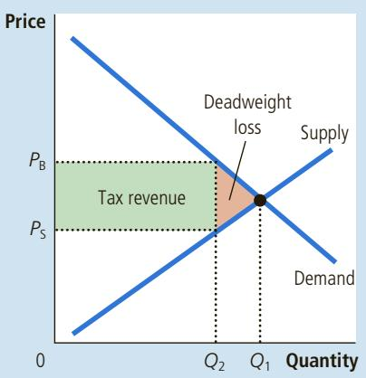
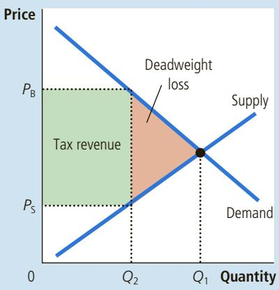
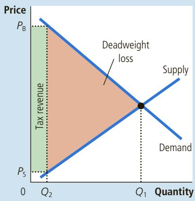
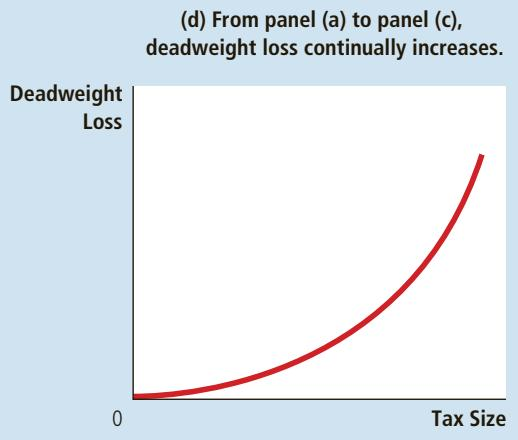
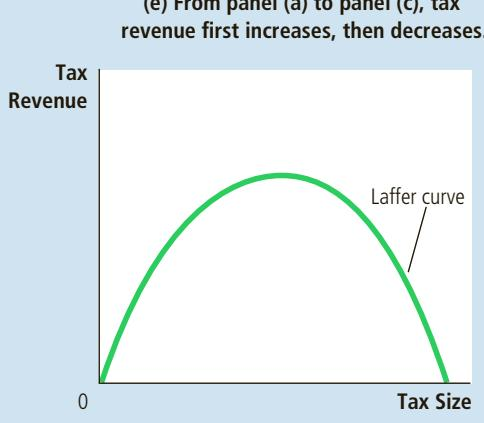
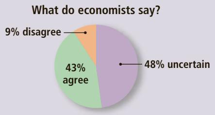
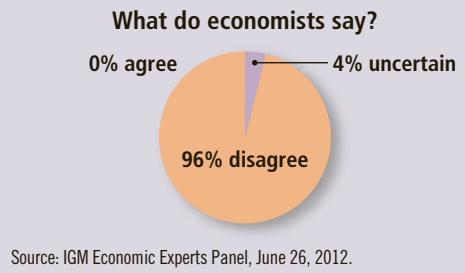

## THE DEADWEIGHT LOSS DEBATE

Supply, demand, elasticity, deadweight loss—all this economic theory is enough to make your head spin. But believe it or not, these ideas are at the heart of a profound political question: How big

should the government be? The debate hinges on these concepts because the larger the deadweight loss of taxation, the larger the cost of any government program. If taxation entails large deadweight losses, then these losses are a strong argument for a leaner government that does less and taxes less. But if taxes impose small deadweight losses, then government programs are less costly than they otherwise might be, which in turn argues for a more expansive government.

So how big are the deadweight losses of taxation? Economists disagree on the answer to this question. To see the nature of this disagreement, consider the most important tax in the U.S. economy: the tax on labor. The Social Security tax, the Medicare tax, and much of the federal income tax are labor taxes. Many state governments also tax labor earnings through state income taxes. A labor tax places a wedge between the wage that firms pay and the wage that workers receive. For a typical worker, if all forms of labor taxes are added together, the marginal tax rate on labor income—the tax on the last dollar of earnings—is about 40 percent.

The size of the labor tax is easy to determine, but calculating the deadweight loss of this tax is less straightforward. Economists disagree about whether this 40 percent labor tax has a small or a large deadweight loss. This disagreement arises because economists hold different views about the elasticity of labor supply.

Economists who argue that labor taxes do not greatly distort market outcomes believe that labor supply is fairly inelastic. Most people, they claim, would work full-time regardless of the wage. If so, the labor supply curve is almost vertical, and a tax on labor has a small deadweight loss. Some evidence suggests that this may be the case for workers who are in their prime working years and who are the main breadwinners of their families.

Economists who argue that labor taxes are highly distortionary believe that labor supply is more elastic. While admitting that some groups of workers may not change the quantity of labor they supply by very much in response to changes in labor taxes, these economists claim that many other groups respond more to incentives. Here are some examples:

• Some workers can adjust the number of hours they work—for instance, by working overtime. The higher the wage, the more hours they choose to work.

• Many families have second earners—often married women with children— with some discretion over whether to do unpaid work at home or paid work in the marketplace. When deciding whether to take a job, these second earners compare the benefits of being at home (including savings on the cost of child care) with the wages they could earn.

• Many of the elderly can choose when to retire, and their decisions are partly based on the wage. Once they are retired, the wage determines their incentive to work part-time.

• Some people consider engaging in illegal economic activity, such as the drug trade, or working at jobs that pay “under the table” to evade taxes. Economists call this the underground economy. In deciding whether to work in the underground economy or at a legitimate job, these potential criminals compare what they can earn by breaking the law with the wage they can earn legally.

EPA EUROPEAN PRESSPHOTO AGENCY B.V. / ALAMY

In each of these cases, the quantity of labor supplied responds to the wage (the price of labor). Thus, these workers’ decisions are distorted when their labor earnings are taxed. Labor taxes encourage workers to work fewer hours, second earners to stay at home, the elderly to retire early, and the unscrupulous to enter the underground economy.

  
“What’s your position on the elasticity of labor supply?”

The debate over the distortionary effects of labor taxation persists to this day. Indeed, whenever you see two political candidates debating whether the government should provide more services or reduce the tax burden, keep in mind that part of the disagreement may rest on different views about the elasticity of labor supply and the deadweight loss of taxation. ●

QuickQuiz

The demand for beer is more elastic than the demand for milk. Would a tax on beer or a tax on milk have a larger deadweight loss? Why?

## 8-3 Deadweight Loss and Tax Revenue as Taxes Vary

Taxes rarely stay the same for long periods of time. Policymakers in local, state, and federal governments are always considering raising one tax or lowering another. Here we consider what happens to the deadweight loss and tax revenue when the size of a tax changes.

Figure 6 shows the effects of a small, medium, and large tax, holding constant the market’s supply and demand curves. The deadweight loss—the reduction in total surplus that results when the tax reduces the size of a market below the optimum— equals the area of the triangle between the supply and demand curves. For the small tax in panel (a), the area of the deadweight loss triangle is quite small. But as the size of the tax rises in panels (b) and (c), the deadweight loss grows larger and larger.

Indeed, the deadweight loss of a tax rises even more rapidly than the size of the tax. This occurs because the deadweight loss is the area of a triangle, and the area of a triangle depends on the square of its size. If we double the size of a tax, for instance, the base and height of the triangle double, so the deadweight loss rises by a factor of 4. If we triple the size of a tax, the base and height triple, so the deadweight loss rises by a factor of 9.

The government’s tax revenue is the size of the tax times the amount of the good sold. As the first three panels of Figure 6 show, tax revenue equals the area of the rectangle between the supply and demand curves. For the small tax in panel (a), tax revenue is small. As the size of the tax increases from panel (a) to panel (b), tax revenue grows. But as the size of the tax increases further from panel (b) to panel (c), tax revenue falls because the higher tax drastically reduces the size of the market. For a very large tax, no revenue would be raised because people would stop buying and selling the good altogether.

The last two panels of Figure 6 summarize these results. In panel (d), we see that as the size of a tax increases, its deadweight loss quickly gets larger. By contrast, panel (e) shows that tax revenue first rises with the size of the tax, but as the tax increases further, the market shrinks so much that tax revenue starts to fall.

## FIGURE 6

How Deadweight Loss and Tax Revenue Vary with the Size of a Tax

The deadweight loss is the reduction in total surplus due to the tax. Tax revenue is the amount of the tax multiplied by the amount of the good sold. In panel (a), a small tax has a small deadweight loss and raises a small amount of revenue. In panel (b), a somewhat larger tax has a larger deadweight loss and raises a larger amount of revenue. In panel (c), a very large tax has a very large deadweight loss, but because it has reduced the size of the market so much, the tax raises only a small amount of revenue. Panels (d) and (e) summarize these conclusions. Panel (d) shows that as the size of a tax grows larger, the deadweight loss grows larger. Panel (e) shows that tax revenue first rises and then falls. This relationship is called the Laffer curve.

(a) Small Tax  

(b) Medium Tax  
  
(c) Large Tax

  
(d) From panel (a) to panel (c), deadweight loss continually increases.

  
(e) From panel (a) to panel (c), tax revenue rst increases, then decreases.

## THE LAFFER CURVE AND SUPPLY-SIDE ECONOMICS

One day in 1974, economist Arthur Laffer sat in a Washington restaurant with some prominent journalists and politicians. He took out a napkin and drew a figure on it to show how tax rates affect tax revenue. It looked much like panel (e) of our Figure 6. Laffer then suggested that the United States was on the downward-sloping side of this curve. Tax rates were so high, he argued, that reducing them might actually increase tax revenue.

Most economists were skeptical of Laffer’s suggestion. They accepted the idea that a cut in tax rates could increase tax revenue as a matter of economic theory, but they doubted whether it would do so in practice. There was scant evidence for Laffer’s view that U.S. tax rates had in fact reached such extreme levels.

Nonetheless, the Laffer curve (as it became known) captured the imagination of Ronald Reagan. David Stockman, budget director in the first Reagan administration, offers the following story:

[Reagan] had once been on the Laffer curve himself. “I came into the Big Money making pictures during World War II,” he would always say. At that time the wartime income surtax hit 90 percent. “You could only make four pictures and then you were in the top bracket,” he would continue. “So we all quit working after four pictures and went off to the country.” High tax rates caused less work. Low tax rates caused more. His experience proved it.

When Reagan ran for president in 1980, he made cutting taxes part of his platform. Reagan argued that taxes were so high that they were discouraging hard work and thereby depressing incomes. He argued that lower taxes would give people more incentive to work, which in turn would raise economic well-being. He suggested that incomes could rise by so much that tax revenue might increase, despite the lower tax rates. Because the cut in tax rates was intended to encourage people to increase the quantity of labor they supplied, the views of Laffer and Reagan became known as supply-side economics.

Economists continue to debate Laffer’s argument. Many believe that subsequent history refuted Laffer’s conjecture that lower tax rates would raise tax revenue. Yet because history is open to alternative interpretations, other economists view the events of the 1980s as more favorable to the supply siders. To evaluate Laffer’s hypothesis definitively, we would need to rerun history without the Reagan tax cuts and see if tax revenues would have been higher or lower. Unfortunately, that experiment is impossible.

Some economists take an intermediate position on this issue. They believe that while an overall cut in tax rates normally reduces revenue, some taxpayers may occasionally find themselves on the wrong side of the Laffer curve. Other things being equal, a tax cut is more likely to raise tax revenue if the cut applies to those taxpayers facing the highest tax rates. In addition, Laffer’s argument may be more compelling for countries with much higher tax rates than the United States. In Sweden in the early 1980s, for instance, the typical worker faced a marginal tax rate of about 80 percent. Such a high tax rate provides a substantial disincentive to work. Studies have suggested that Sweden would have indeed raised more tax revenue if it had lowered its tax rates.

Economists disagree about these issues in part because there is no consensus about the size of the relevant elasticities. The more elastic supply and demand are in any market, the more taxes distort behavior, and the more likely it is that a tax cut will increase tax revenue. There is no debate, however, about the general lesson: How much revenue the government gains or loses from a tax change cannot be computed just by looking at tax rates. It also depends on how the tax change affects people’s behavior.

## ASK THE EXPERTS

## The Laffer Curve

“A cut in federal income tax rates in the United States right now would lead to higher national income within five years than without the tax cut.”

  
“A cut in federal income tax rates in the United States right now would raise taxable income enough so that the annual total tax revenue would be higher within five years than without the tax cut.”

  
Source: IGM Economic Experts Panel, June 26, 2012.

## 8-4 Conclusion

In this chapter, we have used the tools developed in the previous chapter to further our understanding of taxes. One of the Ten Principles of Economics discussed in Chapter 1 is that markets are usually a good way to organize economic activity. In Chapter 7, we used the concepts of producer and consumer surplus to make this principle more precise. Here we have seen that when the government imposes taxes on buyers or sellers of a good, society loses some of the benefits of market efficiency. Taxes are costly to market participants not only because taxes transfer resources from those participants to the government but also because they alter incentives and distort market outcomes.

The analysis presented here and in Chapter 6 should give you a good basis for understanding the economic impact of taxes, but this is not the end of the story. Microeconomists study how best to design a tax system, including how to strike the right balance between equality and efficiency. Macroeconomists study how taxes influence the overall economy and how policymakers can use the tax system to stabilize economic activity and to achieve more rapid economic growth. So as you continue your study of economics, don’t be surprised when the subject of taxation comes up yet again.

## CHAPTER QuickQuiz

1. A tax on a good has a deadweight loss if

a. the reduction in consumer and producer surplus is greater than the tax revenue.

b. the tax revenue is greater than the reduction in consumer and producer surplus.

c. the reduction in consumer surplus is greater than the reduction in producer surplus.

d. the reduction in producer surplus is greater than the reduction in consumer surplus.

2. Sofia pays Sam \$50 to mow her lawn every week. When the government levies a mowing tax of \$10 on Sam, he raises his price to \$60. Sofia continues to hire him at the higher price. What is the change in producer surplus, change in consumer surplus, and deadweight loss? a. \$0, \$0, \$10

b. \$0, 2\$10, \$0

c. 1\$10, 2\$10, \$10

d. 1\$10, 2\$10, \$0

3. Eggs have a supply curve that is linear and upward-sloping and a demand curve that is linear and downward-sloping. If a 2 cent per egg tax is increased to 3 cents, the deadweight loss of the tax

a. increases by less than 50 percent and may even decline.

b. increases by exactly 50 percent.

c. increases by more than 50 percent.

d. The answer depends on whether supply or demand is more elastic.

4. Peanut butter has an upward-sloping supply curve and a downward-sloping demand curve. If a 10 cent per pound tax is increased to 15 cents, the government’s tax revenue

a. increases by less than 50 percent and may even decline.

b. increases by exactly 50 percent.

c. increases by more than 50 percent.

d. The answer depends on whether supply or demand is more elastic.

5. The Laffer curve illustrates that, in some circumstances, the government can reduce a tax on a good and increase the

a. deadweight loss.

b. government’s tax revenue.

c. equilibrium quantity.

d. price paid by consumers.

6. If a policymaker wants to raise revenue by taxing goods while minimizing the deadweight losses, he should look for goods with elasticities of demand and elasticities of supply.

a. small, small

b. small, large

c. large, small

d. large, large

## SUMMARY

A tax on a good reduces the welfare of buyers and sellers of the good, and the reduction in consumer and producer surplus usually exceeds the revenue raised by the government. The fall in total surplus—the sum of consumer surplus, producer surplus, and tax revenue—is called the deadweight loss of the tax.

Taxes have deadweight losses because they cause buyers to consume less and sellers to produce less, and these changes in behavior shrink the size of the market below the level that maximizes total surplus. Because the elasticities of supply and demand measure how much market participants respond to market conditions, larger elasticities imply larger deadweight losses.

As a tax grows larger, it distorts incentives more, and its deadweight loss grows larger. Because a tax reduces the size of the market, however, tax revenue does not continually increase. It first rises with the size of a tax, but if the tax gets large enough, tax revenue starts to fall.

## KEY CONCEPT

deadweight loss, p. 157

## QUESTIONS FOR REVIEW

1. What happens to consumer and producer surplus when the sale of a good is taxed? How does the change in consumer and producer surplus compare to the tax revenue? Explain.

2. Draw a supply-and-demand diagram with a tax on the sale of a good. Show the deadweight loss. Show the tax revenue.

3. How do the elasticities of supply and demand affect the deadweight loss of a tax? Why do they have this effect?

4. Why do experts disagree about whether labor taxes have small or large deadweight losses?

5. What happens to the deadweight loss and tax revenue when a tax is increased?

## PROBLEMS AND APPLICATIONS

1. The market for pizza is characterized by a downward-sloping demand curve and an upward-sloping supply curve.

a. Draw the competitive market equilibrium. Label the price, quantity, consumer surplus, and producer surplus. Is there any deadweight loss? Explain.

b. Suppose that the government forces each pizzeria to pay a \$1 tax on each pizza sold. Illustrate the effect of this tax on the pizza market, being sure to label the consumer surplus, producer surplus, government revenue, and deadweight loss. How does each area compare to the pre-tax case?

c. If the tax were removed, pizza eaters and sellers would be better off, but the government would lose tax revenue. Suppose that consumers and producers voluntarily transferred some of their gains to the government. Could all parties (including the government) be better off than they were with a tax? Explain using the labeled areas in your graph.

2. Evaluate the following two statements. Do you agree? Why or why not?

a. “A tax that has no deadweight loss cannot raise any revenue for the government.”

b. “A tax that raises no revenue for the government cannot have any deadweight loss.”

3. Consider the market for rubber bands.

a. If this market has very elastic supply and very inelastic demand, how would the burden of a tax on rubber bands be shared between consumers and producers? Use the tools of consumer surplus and producer surplus in your answer.

b. If this market has very inelastic supply and very elastic demand, how would the burden of a tax on rubber bands be shared between consumers and producers? Contrast your answer with your answer to part (a).

4. Suppose that the government imposes a tax on heating oil.

a. Would the deadweight loss from this tax likely be greater in the first year after it is imposed or in the fifth year? Explain.

b. Would the revenue collected from this tax likely be greater in the first year after it is imposed or in the fifth year? Explain.

5. After economics class one day, your friend suggests that taxing food would be a good way to raise revenue because the demand for food is quite inelastic. In what sense is taxing food a “good” way to raise revenue? In what sense is it not a “good” way to raise revenue?

6. Daniel Patrick Moynihan, the late senator from New York, once introduced a bill that would levy a 10,000 percent tax on certain hollow-tipped bullets.

a. Do you expect that this tax would raise much revenue? Why or why not?

b. Even if the tax would raise no revenue, why might Senator Moynihan have proposed it?

a. Illustrate the effect of this tax on equilibrium price and quantity in the sock market. Identify the following areas both before and after the imposition of the tax: total spending by consumers, total revenue for producers, and government tax revenue.

b. Does the price received by producers rise or fall? Can you tell whether total receipts for producers rise or fall? Explain.

c. Does the price paid by consumers rise or fall? Can you tell whether total spending by consumers rises or falls? Explain carefully. (Hint: Think about elasticity.) If total consumer spending falls, does consumer surplus rise? Explain.

8. This chapter analyzed the welfare effects of a tax on a good. Now consider the opposite policy. Suppose that the government subsidizes a good: For each unit of the good sold, the government pays \$2 to the buyer. How does the subsidy affect consumer surplus, producer surplus, tax revenue, and total surplus? Does a subsidy lead to a deadweight loss? Explain.

9. Hotel rooms in Smalltown go for \$100, and 1,000 rooms are rented on a typical day.

a. To raise revenue, the mayor decides to charge hotels a tax of \$10 per rented room. After the tax is imposed, the going rate for hotel rooms rises to \$108, and the number of rooms rented falls to 900. Calculate the amount of revenue this tax raises for Smalltown and the deadweight loss of the tax. (Hint: The area of a triangle is ½ 3 base 3 height.)

b. The mayor now doubles the tax to \$20. The price rises to \$116, and the number of rooms rented falls to 800. Calculate tax revenue and deadweight loss with this larger tax. Are they double, more than double, or less than double? Explain.

10. Suppose that a market is described by the following supply and demand equations:

$$
Q ^ {S} = 2 P
$$

$$
Q ^ {D} = 3 0 0 - P
$$

a. Solve for the equilibrium price and the equilibrium quantity.

b. Suppose that a tax of T is placed on buyers, so the new demand equation is

$$
Q ^ {D} = 3 0 0 - (P + T)
$$

Solve for the new equilibrium. What happens to the price received by sellers, the price paid by buyers, and the quantity sold?

c. Tax revenue is $T \times Q$ . Use your answer from part (b) to solve for tax revenue as a function of T. Graph this relationship for T between 0 and 300.

d. The deadweight loss of a tax is the area of the triangle between the supply and demand curves. Recalling that the area of a triangle is ½ 3 base 3 height, solve for deadweight loss as a function of T. Graph this relationship for T between 0 and 300. (Hint: Looking sideways, the base of the deadweight loss triangle is T, and the height is the difference between the quantity sold with the tax and the quantity sold without the tax.)

e. The government now levies a tax of \$200 per unit on this good. Is this a good policy? Why or why not? Can you propose a better policy?

To find additional study resources, visit cengagebrain.com, and search for “Mankiw.”
