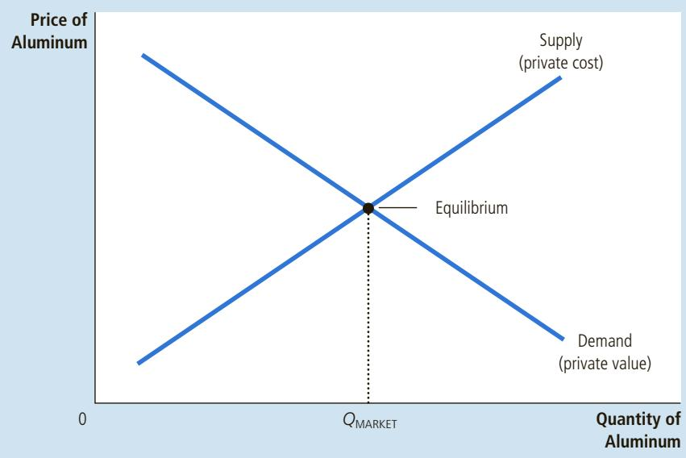
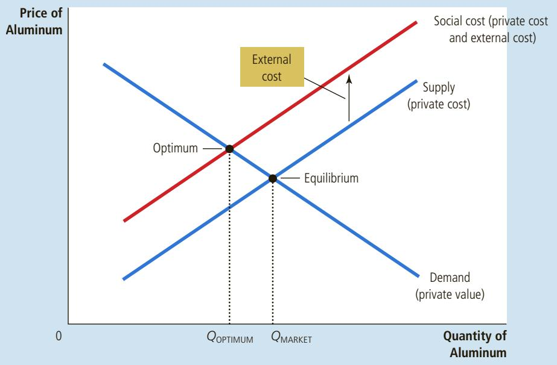
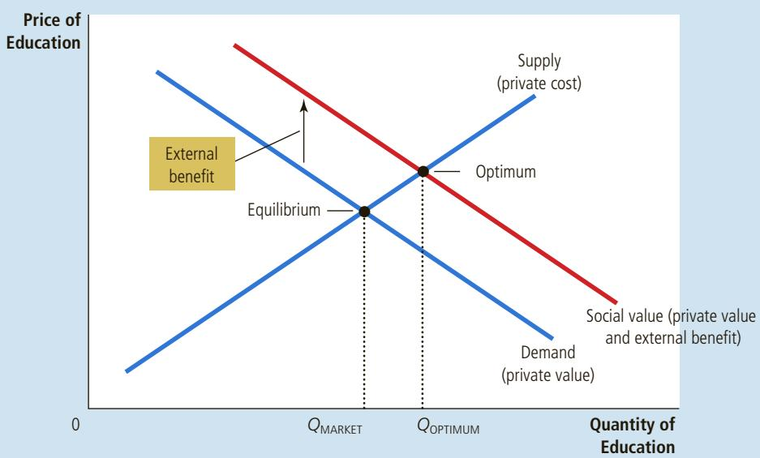

# The Economics of the Public Sector

irms that make and sell paper also create, as a by-product of the manufacturing process, a chemical called dioxin. Scientists believe that once dioxin enters the environment, it raises the population’s risk of cancer, birth defects, and other health problems.

Is the production and release of dioxin a problem for society? In Chapters 4 through 9, we examined how markets allocate scarce resources with the forces of supply and demand, and we saw that the equilibrium of supply and demand is typically an efficient allocation of resources. To use Adam Smith’s famous metaphor, the “invisible hand” of the marketplace leads self-interested buyers and sellers in a market to maximize the total benefit that society derives from that market. This insight is the basis for one of the Ten Principles of Economics in Chapter 1: Markets are usually a good way to organize economic activity. Should we conclude, therefore, that the invisible hand prevents firms in the paper market from emitting too much dioxin?

Markets do many things well, but they do not do everything well. In this chapter, we begin our study of another of the Ten Principles of Economics: Government action can sometimes improve upon market outcomes. We examine why markets sometimes fail to allocate resources efficiently, how government policies can potentially improve the market’s allocation, and what kinds of policies are likely to work best.

The market failures examined in this chapter fall under a general category called externalities. An externality arises when a person engages in an activity that influences the well-being of a bystander but neither pays nor receives compensation for that effect. If the impact on the bystander is adverse, it is called a negative externality. If it is beneficial, it is called a positive externality. In the presence of externalities, society’s interest in a market outcome extends beyond the well-being of buyers and sellers who participate in the market to include the well-being of bystanders who are affected indirectly. Because buyers and sellers neglect the external effects of their actions when deciding how much to demand or supply, the market equilibrium is not efficient when there are externalities. That is, the equilibrium fails to maximize the total benefit to society as a whole. The release of dioxin into the environment, for instance, is a negative externality. Selfinterested paper firms will not consider the full cost of the pollution they create in their production process, and consumers of paper will not consider the full cost of the pollution they contribute to as a result of their purchasing decisions. Therefore, the firms will emit too much pollution unless the government prevents or discourages them from doing so.

Externalities come in many varieties, as do the policy responses that try to deal with the market failure. Here are some examples:

The exhaust from automobiles is a negative externality because it creates smog that other people have to breathe. Because drivers may ignore this externality when deciding what cars to buy and how much to use them, they tend to pollute too much. The federal government addresses this problem by setting emission standards for cars. It also taxes gasoline to reduce the amount that people drive.

• Restored historic buildings convey a positive externality because people who walk or ride by them can enjoy the beauty and sense of history that these buildings provide. Building owners do not get the full benefit of restoration and, therefore, tend to tear down older buildings too quickly. Many local governments respond to this problem by regulating the destruction of historic buildings and by providing tax breaks to owners who restore them.

• Barking dogs create a negative externality because neighbors are disturbed by the noise. Dog owners do not bear the full cost of the noise and, therefore, tend to take too few precautions to prevent their dogs from barking. Local governments address this problem by making it illegal to “disturb the peace.”

• Research into new technologies provides a positive externality because it creates knowledge that other people can use. If individual inventors, firms, and universities cannot capture the benefits of their inventions, they will devote too few resources to research. The federal government addresses this problem partially through the patent system, which gives inventors exclusive use of their inventions for a limited time.

In each of these cases, some decision maker fails to take into account the external effects of his behavior. The government responds by trying to influence this behavior to protect the interests of bystanders.

## 10-1 Externalities and Market Inefficiency

In this section, we use the tools of welfare economics developed in Chapter 7 to examine how externalities affect economic well-being. The analysis shows precisely why externalities cause markets to allocate resources inefficiently. Later in the chapter, we examine various ways private individuals and public policymakers can remedy this type of market failure.

## 10-1a Welfare Economics: A Recap

We begin by recalling the key lessons of welfare economics from Chapter 7. To make our analysis concrete, we consider a specific market—the market for aluminum. Figure 1 shows the supply and demand curves in the market for aluminum.

Recall from Chapter 7 that the supply and demand curves contain important information about costs and benefits. The demand curve for aluminum reflects the value of aluminum to consumers, as measured by the prices they are willing to pay. At any given quantity, the height of the demand curve shows the willingness to pay of the marginal buyer. In other words, it shows the value to the consumer of the last unit of aluminum bought. Similarly, the supply curve reflects the costs of producing aluminum. At any given quantity, the height of the supply curve shows the cost to the marginal seller. In other words, it shows the cost to the producer of the last unit of aluminum sold.

## FIGURE 1

## The Market for Aluminum

The demand curve reflects the value to buyers, and the supply curve reflects the costs of sellers. The equilibrium quantity, $Q _ { \mathrm { { M A R K E T } } } ,$ maximizes the total value to buyers minus the total costs of sellers. In the absence of externalities, therefore, the market equilibrium is efficient.

COLLECTION/ WWW.CARTOONBANK.COM © J.B. HANDELSMAN/ THE NEW YORKER

  
“All I can say is that if being a leading manufacturer means being a leading polluter, so be it.”

In the absence of government intervention, the price adjusts to balance the supply and demand for aluminum. The quantity produced and consumed in the market equilibrium, shown as $Q _ { \mathrm { M A R K E T } }$ in Figure 1, is efficient in the sense that it maximizes the sum of producer and consumer surplus. That is, the market allocates resources in a way that maximizes the total value to the consumers who buy and use aluminum minus the total costs to the producers who make and sell aluminum.

## 10-1b Negative Externalities

Now let’s suppose that aluminum factories emit pollution: For each unit of aluminum produced, a certain amount of smoke enters the atmosphere. Because this smoke creates a health risk for those who breathe the air, it is a negative externality. How does this externality affect the efficiency of the market outcome?

Because of the externality, the cost to society of producing aluminum is larger than the cost to the aluminum producers. For each unit of aluminum produced, the social cost includes the private costs of the aluminum producers plus the costs to those bystanders affected adversely by the pollution. Figure 2 shows the social cost of producing aluminum. The social-cost curve is above the supply curve because it takes into account the external costs imposed on society by aluminum production. The difference between these two curves reflects the cost of the pollution emitted.

What quantity of aluminum should be produced? To answer this question, we once again consider what a benevolent social planner would do. The planner wants to maximize the total surplus derived from the market—the value to consumers of aluminum minus the cost of producing aluminum. The planner understands, however, that the cost of producing aluminum includes the external costs of the pollution.

## FIGURE 2

Pollution and the Social Optimum In the presence of a negative externality, such as pollution, the social cost of the good exceeds the private cost. The optimal quantity, $Q _ { 0 \mathsf { P T I M U M } } , ~ \mathsf { i s }$ therefore smaller than the equilibrium quantity, QMARKET.

The planner would choose the level of aluminum production at which the demand curve crosses the social-cost curve. This intersection determines the optimal amount of aluminum from the standpoint of society as a whole. Below this level of production, the value of the aluminum to consumers (as measured by the height of the demand curve) exceeds the social cost of producing it (as measured by the height of the social-cost curve). Above this level of production, the social cost of producing additional aluminum exceeds the value to consumers.

Note that the equilibrium quantity of aluminum, $Q _ { \mathrm { M A R K E T ^ { \prime } } }$ is larger than the socially optimal quantity, $Q _ { \mathrm { O P T I M U M } } .$ This inefficiency occurs because the market equilibrium reflects only the private costs of production. In the market equilibrium, the marginal consumer values aluminum at less than the social cost of producing it. That is, at $Q _ { \mathrm { M A R K E T ^ { \prime } } }$ the demand curve lies below the social-cost curve. Thus, reducing aluminum production and consumption below the market equilibrium level raises total economic well-being.

How can the social planner achieve the optimal outcome? One way would be to tax aluminum producers for each ton of aluminum sold. The tax would shift the supply curve for aluminum upward by the size of the tax. If the tax accurately reflected the external cost of pollutants released into the atmosphere, the new supply curve would coincide with the social-cost curve. In the new market equilibrium, aluminum producers would produce the socially optimal quantity of aluminum.

The use of such a tax is called internalizing the externality because it gives buyers and sellers in the market an incentive to take into account the external effects of their actions. Aluminum producers would, in essence, take the costs of pollution into account when deciding how much aluminum to supply because the tax would make them pay for these external costs. And, because the market price would reflect the tax on producers, consumers of aluminum would have an incentive to buy a smaller quantity. The policy is based on one of the Ten Principles of Economics: People respond to incentives. Later in this chapter, we consider in more detail how policymakers can deal with externalities.

internalizing the externality altering incentives so that people take into account the external effects of their actions

## 10-1c Positive Externalities

Although some activities impose costs on third parties, others yield benefits. Consider education, for example. To a large extent, the benefit of education is private: The consumer of education becomes a more productive worker and thus reaps much of the benefit in the form of higher wages. Beyond these private benefits, however, education also yields positive externalities. One externality is that a more educated population leads to more informed voters, which means better government for everyone. Another externality is that a more educated population tends to result in lower crime rates. A third externality is that a more educated population may encourage the development and dissemination of technological advances, leading to higher productivity and wages for everyone. Because of these three positive externalities, a person may prefer to have neighbors who are well educated.

The analysis of positive externalities is similar to the analysis of negative externalities. As Figure 3 shows, the demand curve does not reflect the value to society of the good. Because the social value is greater than the private value, the social-value curve lies above the demand curve. The optimal quantity is found where the social-value curve and the supply curve intersect. Hence, the socially optimal quantity is greater than the quantity that the private market would naturally reach on its own.

## FIGURE 3

Education and the Social Optimum In the presence of a positive externality, the social value of the good exceeds the private value. The optimal quantity, $Q _ { \tt O P T I M U M } ,$ is therefore larger than the equilibrium quantity, $Q _ { \mathsf { M A R K E T } } .$

Once again, the government can correct the market failure by inducing market participants to internalize the externality. The appropriate response in the case of positive externalities is exactly the opposite to the case of negative externalities. To move the market equilibrium closer to the social optimum, a positive externality requires a subsidy. In fact, that is exactly the policy the government follows: Education is heavily subsidized through public schools and government scholarships.

To summarize: Negative externalities lead markets to produce a larger quantity than is socially desirable. Positive externalities lead markets to produce a smaller quantity than is socially desirable. To remedy the problem, the government can internalize the externality by taxing goods that have negative externalities and subsidizing goods that have positive externalities.

## TECHNOLOGY SPILLOVERS, INDUSTRIAL POLICY, AND PATENT PROTECTION

STUDY A potentially important type of positive externality is called a technology spillover—the impact of one firm’s research and production efforts on other firms’ access to technological advance. For example, consider the market for industrial robots. Robots are at the frontier of a rapidly changing technology. Whenever a firm builds a robot, there is some chance that the firm will discover a new and better design. This new design may benefit not only this firm but also society as a whole because the design will enter society’s pool of technological knowledge. That is, the new design may have positive externalities for other producers in the economy.

In this case, the government can internalize the externality by subsidizing the production of robots. If the government paid firms a subsidy for each robot produced, the supply curve would shift down by the amount of the subsidy, and this shift would increase the equilibrium quantity of robots. To ensure that the market equilibrium equals the social optimum, the subsidy should equal the value of the technology spillover.

How large are technology spillovers, and what do they imply for public policy? This is an important question because technological progress is the key to raising living standards over time. Yet it is also a difficult question about which economists often disagree.

Some economists believe that technology spillovers are pervasive and that the government should encourage those industries that yield the largest spillovers. For instance, these economists argue that if making computer chips yields greater spillovers than making potato chips, the government should encourage the production of computer chips relative to the production of potato chips. The U.S. tax code does this in a limited way by offering special tax breaks for expenditures on research and development. Some nations go further by subsidizing specific industries that supposedly yield large technology spillovers. Government intervention that aims to promote technology-enhancing industries is sometimes called industrial policy.

Other economists are skeptical about industrial policy. Even if technology spillovers are common, pursuing an industrial policy requires the government to gauge the size of the spillovers from different markets. This measurement problem is difficult at best. Without accurate measurements, the political system may end up subsidizing industries with the most political clout rather than those that yield the largest positive externalities.

Another way to deal with technology spillovers is patent protection. The patent laws protect the rights of inventors by giving them exclusive use of their inventions for a period of time. When a firm makes a technological breakthrough, it can patent the idea and capture much of the economic benefit for itself. The patent internalizes the externality by giving the firm a property right over its invention. If other firms want to use the new technology, they have to obtain permission from the inventing firm and pay it a royalty. Thus, the patent system gives firms a greater incentive to engage in research and other activities that advance technology. ●

Give an example of a negative externality and a positive externality. Explain why market outcomes are inefficient in the presence of these externalities.

## 10-2 Public Policies toward Externalities

We have discussed why externalities lead markets to allocate resources inefficiently but have mentioned only briefly how this inefficiency can be remedied. In practice, both public policymakers and private individuals respond to externalities in various ways. All of the remedies share the goal of moving the allocation of resources closer to the social optimum.

This section considers governmental solutions. As a general matter, the government can respond to externalities in one of two ways. Command-and-control policies regulate behavior directly. Market-based policies provide incentives so that private decision makers will choose to solve the problem on their own.

## 10-2a Command-and-Control Policies: Regulation

The government can remedy an externality by either requiring or forbidding certain behaviors. For example, it is a crime to dump poisonous chemicals into the water supply. In this case, the external costs to society far exceed the benefits to the polluter. The government therefore institutes a command-and-control policy that prohibits this act altogether.

Source: IGM Economic Experts Panel, March 10, 2015.

