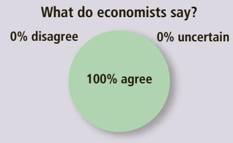
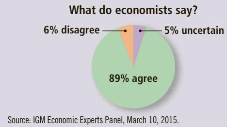
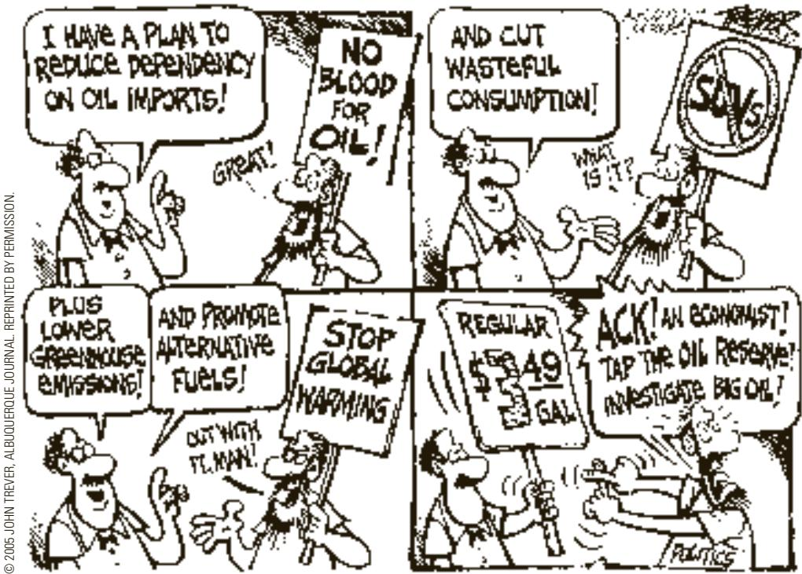

# ASK THE EXPERTS

## Vaccines

“Declining to be vaccinated against contagious diseases such as measles imposes costs on other people, which is a negative externality.”

“Considering the costs of restricting free choice, and the share of people in the US who choose not to vaccinate their children for measles, the social benefit of mandating measles vaccines for all Americans (except those with compelling medical reasons) would exceed the social cost.”

## corrective tax

a tax designed to induce private decision makers to take into account the social costs that arise from a negative externality

In most cases of pollution, however, the situation is not this simple. Despite the stated goals of some environmentalists, it would be impossible to prohibit all polluting activity. For example, virtually all forms of transportation—even the horse— produce some undesirable polluting by-products. But it would not be sensible for the government to ban all transportation. As a result, instead of trying to eradicate pollution entirely, society has to weigh the costs and benefits to decide the kinds and quantities of pollution it will allow. In the United States, the Environmental Protection Agency (EPA) is the government agency tasked with developing and enforcing regulations aimed at protecting the environment.

Environmental regulations can take many forms. Sometimes the EPA dictates a maximum level of pollution that a factory may emit. Other times the EPA requires that firms adopt a particular technology to reduce emissions. In all cases, to design good rules, the government regulators need to know the details about specific industries and about the alternative technologies that those industries could adopt. This information is often difficult for government regulators to obtain.

## 10-2b Market-Based Policy 1: Corrective Taxes and Subsidies

Instead of regulating behavior in response to an externality, the government can use market-based policies to align private incentives with social efficiency. For instance, as we saw earlier, the government can internalize the externality by taxing activities that have negative externalities and subsidizing activities that have positive externalities. Taxes enacted to deal with the effects of negative externalities are called corrective taxes. They are also called Pigovian taxes after economist Arthur Pigou (1877–1959), an early advocate of their use. An ideal corrective tax would equal the external cost from an activity with negative externalities, and an ideal corrective subsidy would equal the external benefit from an activity with positive externalities.

Economists usually prefer corrective taxes to regulations as a way to deal with pollution because they can reduce pollution at a

lower cost to society. To see why, let us consider an example.

Suppose that two factories—a paper mill and a steel mill—are each dumping 500 tons of glop into a river every year. The EPA decides that it wants to reduce the amount of pollution. It considers two solutions:

• Regulation: The EPA could tell each factory to reduce its pollution to 300 tons of glop per year.

• Corrective tax: The EPA could levy a tax on each factory of \$50,000 for each ton of glop it emits.

The regulation would dictate a level of pollution, whereas the tax would give factory owners an economic incentive to reduce pollution. Which solution do you think is better?

Most economists prefer the tax. To explain this preference, they would first point out that a tax is just as effective as regulation in reducing the overall level of pollution. The EPA can achieve whatever level of pollution it wants by setting the tax at the appropriate level. The higher the tax, the larger the reduction in pollution. If the tax is high enough, the factories will close down altogether, reducing pollution to zero.

MARY EVANS PICTURE LIBRARY / ALAMY

Although regulation and corrective taxes are both capable of reducing pollution, the tax accomplishes this goal more efficiently. The regulation requires each factory to reduce pollution by the same amount. An equal reduction, however, is not necessarily the least expensive way to clean up the water. It is possible that the paper mill can reduce pollution at lower cost than the steel mill. If so, the paper mill would respond to the tax by reducing pollution substantially to avoid the tax, whereas the steel mill would respond by reducing pollution less and paying the tax.

  
Arthur Pigou

In essence, the corrective tax places a price on the right to pollute. Just as markets allocate goods to those buyers who value them most highly, a corrective tax allocates pollution to those factories that face the highest cost of reducing it. Thus, the EPA can achieve any level of pollution at the lowest total cost by using a tax.

Economists also argue that corrective taxes are better for the environment. Under the command-and-control policy of regulation, the factories have no reason to reduce emission further once they have reached the target of 300 tons of glop. By contrast, the tax gives the factories an incentive to develop cleaner technologies because a cleaner technology would reduce the amount of tax the factory has to pay.

Corrective taxes are unlike most other taxes. As we discussed in Chapter 8, most taxes distort incentives and move the allocation of resources away from the social optimum. The reduction in economic well-being—that is, in consumer and producer surplus—exceeds the amount of revenue the government raises, resulting in a deadweight loss. By contrast, when externalities are present, society also cares about the well-being of the affected bystanders. Corrective taxes alter incentives that market participants face to account for the presence of externalities and thereby move the allocation of resources closer to the social optimum. Thus, while corrective taxes raise revenue for the government, they also enhance economic efficiency.

## WHY IS GASOLINE TAXED SO HEAVILY?

In many nations, gasoline is among the most heavily taxed goods. The gas tax can be viewed as a corrective tax aimed at addressing three negative externalities associated with driving:

• Congestion: If you have ever been stuck in bumper-to-bumper traffic, you have probably wished that there were fewer cars on the road. A gasoline tax keeps congestion down by encouraging people to take public transportation, carpool more often, and live closer to work.

• Accidents: Whenever people buy large cars or sport utility vehicles, they may make themselves safer but they certainly put their neighbors at risk. According to the National Highway Traffic Safety Administration, a person driving a typical car is five times as likely to die if hit by a sport utility vehicle than if hit by another car. The gas tax is an indirect way of making

© 2005 JOHN TREVER, ALBUQUERQUE JOURNAL. REPRINTED BY PERMISSION.

people pay when their large, gas-guzzling vehicles impose risk on others. It would induce them to take this risk into account when choosing what vehicle to purchase.

• Pollution: Cars cause smog. Moreover, the burning of fossil fuels such as gasoline is widely believed to be the primary cause of global warming. Experts disagree about how dangerous this threat is, but there is no doubt that the gas tax reduces the threat by discouraging the use of gasoline.

So the gas tax, rather than causing deadweight losses like most taxes, actually makes the economy work better. It means less traffic congestion, safer roads, and a cleaner environment.

How high should the tax on gasoline be? Most European countries impose gasoline taxes that are much higher than those in the United States. Many observers have suggested that the United States should also tax gasoline more heavily. A 2007 study published in the Journal of Economic Literature summarized the research on the size of the various externalities associated with driving. It concluded that the optimal corrective tax on gasoline was \$2.28 per gallon in 2005 dollars; after adjusting for inflation, that amount is equivalent to about \$2.78 per gallon in 2015 dollars. By contrast, the actual tax in the United States in 2015 was only about 50 cents per gallon.

The tax revenue from a gasoline tax could be used to lower taxes that distort incentives and cause deadweight losses, such as income taxes. In addition, some of the burdensome government regulations that require automakers to produce more fuel-efficient cars would prove unnecessary. This idea, however, has never been politically popular. ●
