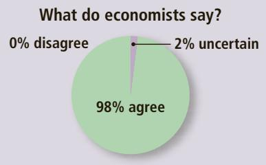
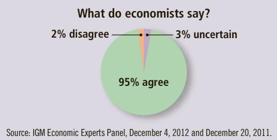
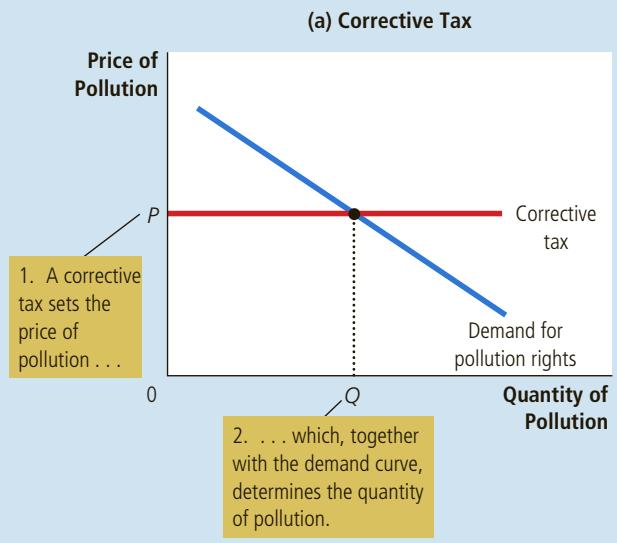
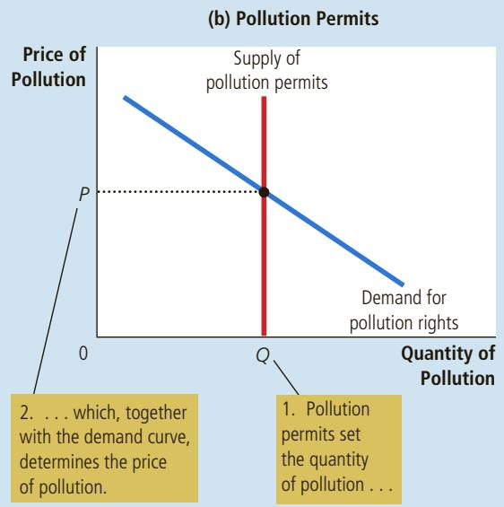

# ASK THE EXPERTS

## Carbon Taxes

“The Brookings Institution recently described a U.S. carbon tax of \$20 per ton, increasing at 4 percent per year, which would raise an estimated \$150 billion per year in federal revenues over the next decade. Given the negative externalities created by carbon dioxide emissions, a federal carbon tax at this rate would involve fewer harmful net distortions to the U.S. economy than a tax increase that generated the same revenue by raising marginal tax rates on labor income across the board.”

“A tax on the carbon content of fuels would be a less expensive way to reduce carbon-dioxide emissions than would a collection of policies such as ‘corporate average fuel economy requirements for automobiles.”

## 10-2c Market-Based Policy 2: Tradable Pollution Permits

Returning to our example of the paper mill and the steel mill, let us suppose that, despite the advice of its economists, the EPA adopts the regulation and requires each factory to reduce its pollution to 300 tons of glop per year. Then one day, after the regulation is in place and both mills have complied, the two firms go to the EPA with a proposal. The steel mill wants to increase its emission of glop from 300 to 400 tons. The paper mill has agreed to reduce its emission from 300 to 200 tons if the steel mill pays it \$5 million. The total emission of glop would remain at 600 tons. Should the EPA allow the two factories to make this deal?

From the standpoint of economic efficiency, allowing the deal is good policy. The deal must make the owners of the two factories better off because they are voluntarily agreeing to it. Moreover, the deal does not have any external effects because the total amount of pollution stays the same. Thus, social welfare is enhanced by allowing the paper mill to sell its pollution rights to the steel mill.

The same logic applies to any voluntary transfer of the right to pollute from one firm to another. If the EPA allows firms to make these deals, it will, in essence, create a new scarce resource: pollution permits. A market to trade these permits will eventually develop, and that market will be governed by the forces of supply and demand. The invisible hand will ensure that this new market allocates the right to pollute efficiently. That is, the permits will end up in the hands of those firms that value them most highly, as judged by their willingness to pay. A firm’s willingness to pay for the right to pollute, in turn, will depend on its cost of reducing pollution: The more costly it is for a firm to cut back on pollution, the more it will be willing to pay for a permit.

An advantage of allowing a market for pollution permits is that the initial allocation of pollution permits among firms does not matter from the standpoint of economic efficiency. Those firms that can reduce pollution at a low cost will sell whatever permits they get, while firms that can reduce pollution only at a high cost will buy whatever permits they need. As long as there is a free market for the pollution rights, the final allocation will be efficient regardless of the initial allocation.

Reducing pollution using pollution permits may seem very different from using corrective taxes, but the two policies have

much in common. In both cases, firms pay for their pollution. With corrective taxes, polluting firms must pay a tax to the government. With pollution permits, polluting firms must pay to buy the permits. (Even firms that already own permits must pay to pollute: The opportunity cost of polluting is what they could have received by selling their permits on the open market.) Both corrective taxes and pollution permits internalize the externality of pollution by making it costly for firms to pollute.

The similarity of the two policies can be seen by considering the market for pollution. Both panels in Figure 4 show the demand curve for the right to pollute.

In panel (a), the EPA sets a price on pollution by levying a corrective tax, and the demand curve determines the quantity of pollution. In panel (b), the EPA limits the quantity of pollution by limiting the number of pollution permits, and the demand curve determines the price of pollution. The price and quantity of pollution are the same in the two cases.

  
The Equivalence of Corrective Taxes and Pollution Permits

## FIGURE 4

This curve shows that the lower the price of polluting, the more firms will choose to pollute. In panel (a), the EPA uses a corrective tax to set a price for pollution. In this case, the supply curve for pollution rights is perfectly elastic (because firms can pollute as much as they want by paying the tax), and the position of the demand curve determines the quantity of pollution. In panel (b), the EPA sets a quantity of pollution by issuing pollution permits. In this case, the supply curve for pollution rights is perfectly inelastic (because the quantity of pollution is fixed by the number of permits), and the position of the demand curve determines the price of pollution. Hence, the EPA can achieve any point on a given demand curve either by setting a price with a corrective tax or by setting a quantity with pollution permits.

In some circumstances, however, selling pollution permits may be better than levying a corrective tax. Suppose the EPA wants no more than 600 tons of glop dumped into the river. But because the EPA does not know the demand curve for pollution, it is not sure what size tax would achieve that goal. In this case, it can simply auction off 600 pollution permits. The auction price would yield the appropriate size of the corrective tax.

The idea of the government auctioning off the right to pollute may at first sound like a creature of some economist’s imagination. And in fact, that is how the idea began. But increasingly, the EPA has used this system as a way to control pollution. A notable success story has been the case of sulfur dioxide $( \mathrm { S O } _ { 2 } ) ,$ a leading cause of acid rain. In 1990, amendments to the Clean Air Act required power plants to reduce ${ \mathrm { S O } } _ { 2 }$ emissions substantially. At the same time, the amendments set up a system that allowed plants to trade their SO allowances. Initially, both industry representatives and environmentalists were skeptical of the proposal, but over time the system reduced pollution with minimal disruption. Pollution permits, like corrective taxes, are now widely viewed as a cost-effective way to keep the environment clean.

## 10-2d Objections to the Economic Analysis of Pollution

“We cannot give anyone the option of polluting for a fee.” This comment from the late Senator Edmund Muskie reflects the view of some environmentalists. Clean air and clean water, they argue, are fundamental human rights that should not be debased by considering them in economic terms. How can you put a price on clean air and clean water? The environment is so important, they claim, that we should protect it as much as possible, regardless of the cost.

Economists have little sympathy for this type of argument. To economists, good environmental policy begins by acknowledging the first of the Ten Principles of Economics in Chapter 1: People face trade-offs. Certainly, clean air and clean water have value. But their value must be compared to their opportunity cost—that is, to what one must give up to obtain them. Eliminating all pollution is impossible. Trying to eliminate all pollution would reverse many of the technological advances that allow us to enjoy a high standard of living. Few people would be willing to accept poor nutrition, inadequate medical care, or shoddy housing to make the environment as clean as possible.

Economists argue that some environmental activists hurt their own cause by not thinking in economic terms. A clean environment can be viewed as simply another good. Like all normal goods, it has a positive income elasticity: Rich countries can afford a cleaner environment than poor ones and, therefore, usually have more rigorous environmental protection. In addition, like most other goods, clean air and clean water obey the law of demand: The lower the price of environmental protection, the more the public will want. The economic approach of using pollution permits and corrective taxes reduces the cost of environmental protection and should, therefore, increase the public’s demand for a clean environment.

A glue factory and a steel mill emit smoke containing a chemical that is QuickQuiz harmful if inhaled in large amounts. Describe three ways the town government might respond to this externality. What are the pros and cons of each solution?

## 10-3 Private Solutions to Externalities

Although externalities tend to cause markets to be inefficient, government action is not always needed to solve the problem. In some circumstances, people can develop private solutions.

## 10-3a The Types of Private Solutions

Sometimes the problem of externalities is solved with moral codes and social sanctions. Consider, for instance, why most people do not litter. Although there are laws against littering, these laws are not rigorously enforced. Most people choose not to litter just because it is the wrong thing to do. The Golden Rule taught to most children says, “Do unto others as you would have them do unto you.” This moral injunction tells us to take account of how our actions affect other people. In economic terms, it tells us to internalize externalities.

Another private solution to externalities involves charities. For example, the Sierra Club, whose goal is to protect the environment, is a nonprofit organization funded with private donations. As another example, colleges and universities receive gifts from alumni, corporations, and foundations in part because education has positive externalities for society. The government encourages this private solution to externalities through the tax system by allowing an income tax deduction for charitable donations.

The private market can often solve the problem of externalities by relying on the self-interest of the relevant parties. Sometimes the solution takes the form of integrating different types of businesses. For example, consider an apple grower and a beekeeper who are located next to each other. Each business confers a positive externality on the other: By pollinating the flowers on the trees, the bees help the orchard produce apples, while the bees use the nectar they get from the apple trees to produce honey. Nonetheless, when the apple grower is deciding how many trees to plant and the beekeeper is deciding how many bees to keep, they neglect the positive externality. As a result, the apple grower plants too few trees and the beekeeper keeps too few bees. These externalities could be internalized if the beekeeper bought the apple orchard or if the apple grower bought the beehives: Both activities would then take place within the same firm, and this single firm could choose the optimal number of trees and bees. Internalizing externalities is one reason that some firms are involved in multiple types of businesses.

Another way for the private market to deal with external effects is for the interested parties to enter into a contract. In the foregoing example, a contract between the apple grower and the beekeeper can solve the problem of too few trees and too few bees. The contract can specify the number of trees, the number of bees, and perhaps a payment from one party to the other. By setting the right number of trees and bees, the contract can solve the inefficiency that normally arises from these externalities and make both parties better off.

## 10-3b The Coase Theorem

How effective is the private market in dealing with externalities? A famous result, called the Coase theorem after economist Ronald Coase, suggests that it can be very effective in some circumstances. According to the Coase theorem, if private parties can bargain over the allocation of resources at no cost, then the private market will always solve the problem of externalities and allocate resources efficiently.

To see how the Coase theorem works, consider an example. Suppose that Dick owns a dog named Spot. Spot barks and disturbs Jane, Dick’s neighbor. Dick gets a benefit from owning the dog, but the dog confers a negative externality on Jane. Should Dick be forced to send Spot to the pound, or should Jane have to suffer sleepless nights because of Spot’s barking?

Consider first what outcome is socially efficient. A social planner, considering the two alternatives, would compare the benefit that Dick gets from the dog to the cost that Jane bears from the barking. If the benefit exceeds the cost, it is efficient for Dick to keep the dog and for Jane to live with the barking. Yet if the cost exceeds the benefit, then Dick should get rid of the dog.

According to the Coase theorem, the private market will reach the efficient outcome on its own. How? Jane can simply offer to pay Dick to get rid of the dog. Dick will accept the deal if the amount of money Jane offers is greater than the benefit of keeping the dog.

By bargaining over the price, Dick and Jane can always reach the efficient outcome. For instance, suppose that Dick gets a \$500 benefit from the dog and Jane bears an \$800 cost from the barking. In this case, Jane can offer Dick \$600 to get rid of the dog, and Dick will gladly accept. Both parties are better off than they were before, and the efficient outcome is reached.

It is possible, of course, that Jane would not be willing to offer any price that Dick would accept. For instance, suppose that Dick gets a \$1,000 benefit from the dog and Jane bears an \$800 cost from the barking. In this case, Dick would turn down any offer below \$1,000, while Jane would not offer any amount above \$800. Therefore, Dick ends up keeping the dog. Given these costs and benefits, however, this outcome is efficient.

So far, we have assumed that Dick has the legal right to keep a barking dog. In other words, we have assumed that Dick can keep Spot unless Jane pays him enough to induce him to give up the dog voluntarily. But how different would the outcome be if Jane had the legal right to peace and quiet?

According to the Coase theorem, the initial distribution of rights does not matter for the market’s ability to reach the efficient outcome. For instance, suppose that Jane can legally compel Dick to get rid of the dog. Having this right works to Jane’s advantage, but it probably will not change the outcome. In this case, Dick can offer to pay Jane to allow him to keep the dog. If the benefit of the dog to Dick exceeds the cost of the barking to Jane, then Dick and Jane will strike a bargain in which Dick keeps the dog.

Although Dick and Jane can reach the efficient outcome regardless of how rights are initially distributed, the distribution of rights is not irrelevant: It determines the distribution of economic well-being. Whether Dick has the right to a barking dog or Jane the right to peace and quiet determines who pays whom in the final bargain. But in either case, the two parties can bargain with each other and solve the externality problem. Dick will end up keeping the dog only if his benefit exceeds Jane’s cost.

To sum up: The Coase theorem says that private economic actors can potentially solve the problem of externalities among themselves. Whatever the initial distribution of rights, the interested parties can reach a bargain in which everyone is better off and the outcome is efficient.

## 10-3c Why Private Solutions Do Not Always Work

Despite the appealing logic of the Coase theorem, private individuals on their own often fail to resolve the problems caused by externalities. The Coase theorem applies only when the interested parties have no trouble reaching and enforcing an agreement. In the real world, however, bargaining does not always work, even when a mutually beneficial agreement is possible.

Sometimes the interested parties fail to solve an externality problem because of transaction costs, the costs that parties incur in the process of agreeing to and following through on a bargain. In our example, imagine that Dick and Jane speak different languages so that, to reach an agreement, they need to hire a translator. If the benefit of solving the barking problem is less than the cost of the translator, Dick and Jane might choose to leave the problem unsolved. In more realistic examples, the transaction costs are the expenses not of translators but of lawyers required to draft and enforce contracts.

At other times, bargaining simply breaks down. The recurrence of wars and labor strikes shows that reaching agreement can be difficult and that failing to reach agreement can be costly. The problem is often that each party tries to hold out for a better deal. For example, suppose that Dick gets a \$500 benefit from having the dog and Jane bears an \$800 cost from the barking. Although it is efficient for Jane to pay
