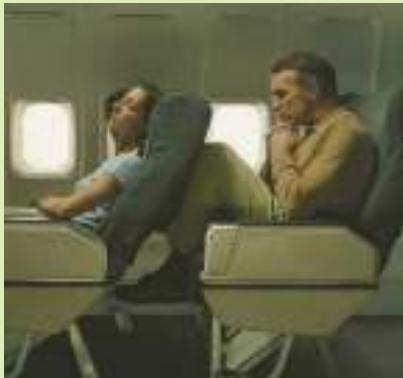

# IN THE NEWS

# The Coase Theorem in Action

Whenever people come in close contact, externalities abound.

## Don’t Want Me to Recline My Airline Seat? You Can Pay Me

By Josh Barro

fly a lot. When I fly, I recline. I don’t feel guilty about it. And I’m going to keep doing it, unless you pay me to stop.

I bring this up because of a dispute you may have heard about: On Sunday, a United Airlines flight from Newark to Denver made an unscheduled stop in Chicago to discharge two passengers who had a dispute over seat reclining. According to The Associated Press, a man in a middle seat installed the Knee Defender, a \$21.95 device that keeps a seat upright, on the seatback in front of him.

A flight attendant asked him to remove the device. He refused. The woman seated in front of him turned around and threw water at him. The pilot landed the plane and booted both passengers off the flight.

Obviously, it’s improper to throw water at another passenger on a flight, even if he deserves it. But I’ve seen a distressing amount of sympathy for Mr. Knee Defender, who wasn’t just instigating a fight but usurping his fellow passenger’s property rights. When you buy an airline ticket, one of the things you’re buying is the right to use your seat’s reclining function. If this passenger so badly wanted the passenger in front of him not to recline, he should have paid her to give up that right.

I wrote an article to that effect in 2011, noting that airline seats are an excellent case study for the Coase Theorem. This is an economic theory holding that it doesn’t matter very much who is initially given a property right; so long as you clearly define it and transaction costs are low, people will trade the right so that it ends up in the hands of whoever values it most. That is, I own the right to recline, and if my reclining bothers you, you can pay me to stop. We could (but don’t) have an alternative system in which the passenger sitting behind me owns the reclining rights. In that circumstance, if I really care about being allowed to recline, I could pay him to let me.

Donald Marron, a former director of the Congressional Budget Office, agrees with this analysis, but with a caveat. Recline negotiations do involve some transaction costs — passengers don’t like bargaining over reclining positions with their neighbors, perhaps because that sometimes ends with water being thrown in someone’s face.

  
THE IMAGE BANK/GETTY IMAGES

Mr. Marron says we ought to allocate the initial property right to the person likely to care most about reclining, in order to reduce the number of transactions that are necessary. He further argues that it’s probably the person sitting behind, as evidenced by the fact people routinely pay for extra-legroom seats.

Mr. Marron is wrong about this last point. I understand people don’t like negotiating with strangers, but in hundreds of flights I have taken, I have rarely had anyone complain to me about my seat recline, and nobody has ever offered me money, or anything else of value, in exchange for sitting upright.

If sitting behind my reclined seat was such misery, if recliners like me are “monsters,” as Mark Hemingway of The Weekly Standard puts it, why is nobody willing to pay me to stop? People talk a big game on social media about the terribleness of reclining, but then people like to complain about all sorts of things; if they really cared that much, someone would have opened his wallet and paid me by now. ■

Source: New York Times, April 27, 2014.

Dick to find another home for the dog, there are many prices that could lead to this outcome. Dick might demand \$750, and Jane might offer only \$550. As they haggle over the price, the inefficient outcome with the barking dog persists.

Reaching an efficient bargain is especially difficult when the number of interested parties is large, because coordinating everyone is costly. For example, consider a factory that pollutes the water of a nearby lake. The pollution confers a negative externality on the local fishermen. According to the Coase theorem, if the pollution is inefficient, then the factory and the fishermen could reach a bargain in which the fishermen pay the factory not to pollute. If there are many fishermen, however, trying to coordinate them all to bargain with the factory may be almost impossible.

When private bargaining does not work, the government can sometimes play a role. The government is an institution designed for collective action. In this example, the government can act on behalf of the fishermen, even when it is impractical for the fishermen to act for themselves.

QuickQuiz Give an example of a private solution to an externality. • What is the Coase theorem? • Why are private economic participants sometimes unable to solve the problems caused by an externality?

## 10-4 Conclusion

The invisible hand is powerful but not omnipotent. A market’s equilibrium maximizes the sum of producer and consumer surplus. When the buyers and sellers in the market are the only interested parties, this outcome is efficient from the standpoint of society as a whole. But when there are external effects, such as pollution, evaluating a market outcome requires taking into account the well-being of third parties as well. In this case, the invisible hand of the marketplace may fail to allocate resources efficiently.

In some cases, people can solve the problem of externalities on their own. The Coase theorem suggests that the interested parties can bargain among themselves and agree on an efficient solution. Sometimes, however, an efficient outcome cannot be reached, perhaps because the large number of interested parties makes bargaining difficult.

When people cannot solve the problem of externalities privately, the government often steps in. Yet even with government intervention, society should not abandon market forces entirely. Rather, the government can address the problem by requiring decision makers to bear the full costs of their actions. Pollution permits and corrective taxes on emissions, for instance, are designed to internalize the externality of pollution. These are increasingly the policies of choice for those interested in protecting the environment. Market forces, properly redirected, are often the best remedy for market failure.

## CHAPTER QuickQuiz

1. Which of the following is an example of a positive externality?

a. Dev mows Hillary’s lawn and is paid \$100 for performing the service.

b. While mowing the lawn, Dev’s lawnmower spews out smoke that Hillary’s neighbor Kristen has to breathe.

c. Hillary’s newly cut lawn makes her neighborhood more attractive.

d. Hillary’s neighbors pay her if she promises to get her lawn cut on a regular basis.

2. If the production of a good yields a negative externality, then the social-cost curve lies the supply curve, and the socially optimal quantity is than the equilibrium quantity.

a. above, greater

b. above, less

c. below, greater

d. below, less

3. When the government levies a tax on a good equal to the external cost associated with the good’s production, it the price paid by consumers and makes the market outcome efficient.

a. increases, more

b. increases, less

c. decreases, more

d. decreases, less

4. Which of the following statements about corrective taxes is generally NOT true?

a. Economists prefer them to command-and-control regulation.

b. They raise government revenue.

c. They cause deadweight losses.

d. They reduce the quantity sold in a market.

5. The government auctions off 500 units of pollution rights. They sell for \$50 per unit, raising total revenue of \$25,000. This policy is equivalent to a corrective tax of \_\_\_\_\_ per unit of pollution.

a. \$10

b. \$50

c. \$450

d. \$500

6. The Coase theorem does NOT apply if

a. there is a significant externality between two parties.

b. the court system vigorously enforces all contracts.

c. transaction costs make negotiating difficult.

d. both parties understand the externality fully.

## SUMMARY

When a transaction between a buyer and seller directly affects a third party, the effect is called an externality. If an activity yields negative externalities, such as pollution, the socially optimal quantity in a market is less than the equilibrium quantity. If an activity yields positive externalities, such as technology spillovers, the socially optimal quantity is greater than the equilibrium quantity.

Governments pursue various policies to remedy the inefficiencies caused by externalities. Sometimes the government prevents socially inefficient activity by regulating behavior. Other times it internalizes an externality using corrective taxes. Another public policy is to issue permits. For example, the government could protect the environment by issuing a limited number of pollution permits. The result of this policy is similar to imposing corrective taxes on polluters.

Those affected by externalities can sometimes solve the problem privately. For instance, when one business imposes an externality on another business, the two businesses can internalize the externality by merging. Alternatively, the interested parties can solve the problem by negotiating a contract. According to the Coase theorem, if people can bargain without cost, then they can always reach an agreement in which resources are allocated efficiently. In many cases, however, reaching a bargain among the many interested parties is difficult, so the Coase theorem does not apply.

## KEY CONCEPTS

externality, p. 190

internalizing the externality, p. 193 corrective tax, p. 196 Coase theorem, p. 203 transaction costs, p. 204

## QUESTIONS FOR REVIEW

1. Give an example of a negative externality and an example of a positive externality.

2. Draw a supply-and-demand diagram to explain the effect of a negative externality that occurs as a result of a firm’s production process.

3. In what way does the patent system help society solve an externality problem?

4. What are corrective taxes? Why do economists prefer them to regulations as a way to protect the environment from pollution?

5. List some of the ways that the problems caused by externalities can be solved without government intervention.

6. Imagine that you are a nonsmoker sharing a room with a smoker. According to the Coase theorem, what determines whether your roommate smokes in the room? Is this outcome efficient? How do you and your roommate reach this solution?

## PROBLEMS AND APPLICATIONS

1. Consider two ways to protect your car from theft. The Club (a steering wheel lock) makes it difficult for a car thief to take your car. Lojack (a tracking system) makes it easier for the police to catch the car thief who has stolen it. Which of these methods conveys a negative externality on other car owners? Which conveys a positive externality? Do you think there are any policy implications of your analysis?

2. Consider the market for fire extinguishers.

a. Why might fire extinguishers exhibit positive externalities?

b. Draw a graph of the market for fire extinguishers, labeling the demand curve, the social-value curve, the supply curve, and the social-cost curve.

c. Indicate the market equilibrium level of output and the efficient level of output. Give an intuitive explanation for why these quantities differ.

d. If the external benefit is \$10 per extinguisher, describe a government policy that would yield the efficient outcome.

3. Greater consumption of alcohol leads to more motor vehicle accidents and, thus, imposes costs on people who do not drink and drive.

a. Illustrate the market for alcohol, labeling the demand curve, the social-value curve, the supply curve, the social-cost curve, the market equilibrium level of output, and the efficient level of output.

b. On your graph, shade the area corresponding to the deadweight loss of the market equilibrium. (Hint: The deadweight loss occurs because some units of alcohol are consumed for which the social cost exceeds the social value.) Explain.

4. Many observers believe that the levels of pollution in our society are too high.

a. If society wishes to reduce overall pollution by a certain amount, why is it efficient to have different amounts of reduction at different firms?

b. Command-and-control approaches often rely on uniform reductions among firms. Why are these approaches generally unable to target the firms that should undertake bigger reductions?

c. Economists argue that appropriate corrective taxes or tradable pollution rights will result in efficient pollution reduction. How do these approaches target the firms that should undertake bigger reductions?

5. The many identical residents of Whoville love drinking Zlurp. Each resident has the following willingness to pay for the tasty refreshment:

<table><tr><td>First bottle</td><td>$5</td></tr><tr><td>Second bottle</td><td>4</td></tr><tr><td>Third bottle</td><td>3</td></tr><tr><td>Fourth bottle</td><td>2</td></tr><tr><td>Fifth bottle</td><td>1</td></tr><tr><td>Further bottles</td><td>0</td></tr></table>

a. The cost of producing Zlurp is \$1.50, and the competitive suppliers sell it at this price. (The supply curve is horizontal.) How many bottles will each Whovillian consume? What is each person’s consumer surplus?

b. Producing Zlurp creates pollution. Each bottle has an external cost of \$1. Taking this additional cost into account, what is total surplus per person in the allocation you described in part (a)?

c. Cindy Lou Who, one of the residents of Whoville, decides on her own to reduce her consumption of Zlurp by one bottle. What happens to Cindy’s welfare (her consumer surplus minus the cost of pollution she experiences)? How does Cindy’s decision affect total surplus in Whoville?

d. Mayor Grinch imposes a \$1 tax on Zlurp. What is consumption per person now? Calculate consumer surplus, the external cost, government revenue, and total surplus per person.

e. Based on your calculations, would you support the mayor’s policy? Why or why not?

6. Bruno loves playing rock ‘n’ roll music at high volume. Placido loves opera and hates rock ‘n’ roll. Unfortunately, they are next-door neighbors in an apartment building with paper-thin walls.

a. What is the externality here?

b. What command-and-control policy might the landlord impose? Could such a policy lead to an inefficient outcome?

c. Suppose the landlord lets the tenants do whatever they want. According to the Coase theorem, how might Bruno and Placido reach an efficient outcome on their own? What might prevent them from reaching an efficient outcome?

7. Figure 4 shows that for any given demand curve for the right to pollute, the government can achieve the same outcome either by setting a price with a corrective tax or by setting a quantity with pollution permits. Suppose there is a sharp improvement in the technology for controlling pollution.

a. Using graphs similar to those in Figure 4, illustrate the effect of this development on the demand for pollution rights.

b. What is the effect on the price and quantity of pollution under each regulatory system? Explain.

8. Suppose that the government decides to issue tradable permits for a certain form of pollution.

a. Does it matter for economic efficiency whether the government distributes or auctions the permits? Why or why not?

b. If the government chooses to distribute the permits, does the allocation of permits among firms matter for efficiency? Explain.

## 9. There are three industrial firms in Happy Valley.

<table><tr><td>Firm</td><td>Initial Pollution Level</td><td>Cost of Reducing Pollution by 1 Unit</td></tr><tr><td>A</td><td>30 units</td><td>$20</td></tr><tr><td>B</td><td>40 units</td><td>$30</td></tr><tr><td>C</td><td>20 units</td><td>$10</td></tr></table>

The government wants to reduce pollution to 60 units, so it gives each firm 20 tradable pollution permits.

a. Who sells permits and how many do they sell? Who buys permits and how many do they buy? Briefly explain why the sellers and buyers are each willing to do so. What is the total cost of pollution reduction in this situation?

b. How much higher would the costs of pollution reduction be if the permits could not be traded?

11
