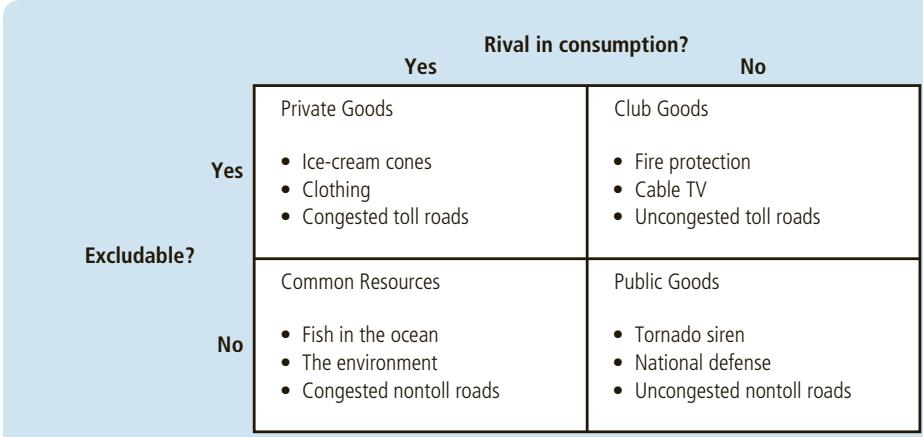
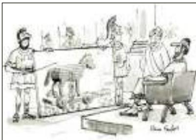
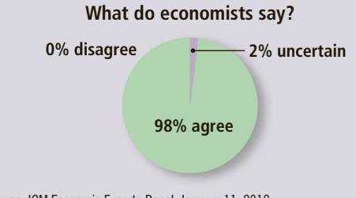

# Public Goods and Common Resources

A n old song lyric maintains that “the best things in life are free.” A moment’sthought reveals a long list of goods that the songwriter could have had in mind. Nature provides some of them, such as rivers, mountains, beaches, lakes, and oceans. The government provides others, such as playgrounds, parks, and parades. In each case, people often do not pay a fee when they choose to enjoy the benefit of the good.

Goods without prices provide a special challenge for economic analysis. Most goods in our economy are allocated through markets, in which buyers pay for what they receive and sellers are paid for what they provide. For these goods, prices are the signals that guide the decisions of buyers and sellers, and these decisions lead to an efficient allocation of resources. When goods are available free of charge, however, the market forces that normally allocate resources in our economy are absent.

In this chapter, we examine the problems that arise for the allocation of resources when there are goods without market prices. Our analysis will shed light on one of the Ten Principles ofEconomics in Chapter 1: Governments can sometimes improve market outcomes. When a good does not have a price attached to it, private markets cannot ensure that the good is produced and consumed in the proper amounts. In such cases, government policy can potentially remedy the market failure and increase economic well-being.

public goods goods that are neither excludable nor rival in consumption

## 11-1 The Different Kinds of Goods

How well do markets work in providing the goods that people want? The answer to this question depends on the good being considered. As we discussed in Chapter 7, a market can provide the efficient number of ice-cream cones: The price of ice-cream cones adjusts to balance supply and demand, and this equilibrium maximizes the sum of producer and consumer surplus. Yet as we discussed in Chapter 10, the market cannot be counted on to prevent aluminum manufacturers from polluting the air we breathe: Buyers and sellers in a market typically do not take into account the external effects of their decisions. Thus, markets work well if the good is ice cream, but they don’t if the good is clean air.

private goods goods that are both excludable and rival in consumption

When thinking about the various goods in the economy, it is useful to group them according to two characteristics:

## excludability

the property of a good whereby a person can be prevented from using it

rivalry in consumption the property of a good whereby one person’s use diminishes other people’s use

• Is the good excludable? That is, can people be prevented from using the good?

• Is the good rival in consumption? That is, does one person’s use of the good reduce another person’s ability to use it?

## Using these two characteristics, Figure 1 divides goods into four categories:

1. Private goods are both excludable and rival in consumption. Consider an ice-cream cone, for example. An ice-cream cone is excludable because it is possible to prevent someone from eating one—you just don’t give it to her. An ice-cream cone is rival in consumption because if one person eats an ice-cream cone, another person cannot eat the same cone. Most goods in the economy are private goods like ice-cream cones: You don’t get one unless you pay for it, and once you have it, you are the only person who benefits. When we analyzed supply and demand in Chapters 4, 5, and 6 and the efficiency of markets in Chapters 7, 8, and 9, we implicitly assumed that goods were both excludable and rival in consumption.

2. Public goods are neither excludable nor rival in consumption. That is, people cannot be prevented from using a public good, and one person’s use of a public good does not reduce another person’s ability to use it. For example, a tornado siren in a small town is a public good. Once the siren sounds, it is impossible to prevent any single person from hearing it (so it is not excludable). Moreover, when one person gets the benefit of the warning, she does not reduce the benefit to anyone else (so it is not rival in consumption).

3. Common resources are rival in consumption but not excludable. For example, fish in the ocean are rival in consumption: When one person catches fish, there are fewer fish for the next person to catch. But these fish are not an excludable good because it is difficult to stop fishermen from taking fish out of a vast ocean.

4. Club goods are excludable but not rival in consumption. For instance, consider fire protection in a small town. It is easy to exclude someone from using this good: The fire department can just let her house burn down. But fire protection is not rival in consumption: Once a town has paid for the fire department, the additional cost of protecting one more house is small. (We discuss club goods again in Chapter 15, where we see that they are one type of a natural monopoly.)

Although Figure 1 offers a clean separation of goods into four categories, the boundaries between the categories are sometimes fuzzy. Whether goods are excludable or rival in consumption is often a matter of degree. Fish in an ocean may not be excludable because monitoring fishing is so difficult, but a large enough coast guard could make fish at least partly excludable. Similarly, although fish are generally rival in consumption, this would be less true if the population of fishermen were small relative to the population of fish. (Think of North American fishing waters before the arrival of European settlers.) For purposes of our analysis, however, it will be helpful to group goods into these four categories.

In this chapter, we examine goods that are not excludable: public goods and common resources. Because people cannot be prevented from using these goods, they are available to everyone free of charge. The study of public goods and common resources is closely related to the study of externalities. For both of these types of goods, externalities arise because something of value has no price attached to it. If one person were to provide a public good, such as a tornado siren, other people would be better off. They would receive a benefit without paying for it—a positive externality. Similarly, when one person uses a common resource such as the fish in the ocean, other people are worse off because there are fewer fish to catch. They suffer a loss but are not compensated for it—a negative externality. Because of these external effects, private decisions about consumption and production can lead to an inefficient allocation of resources, and government intervention can potentially raise economic well-being.

Define public goods and common resources and give an example of each.

## FIGURE 1

## Four Types of Goods

Goods can be grouped into four categories according to two characteristics: (1) A good is excludable if people can be prevented from using it. (2) A good is rival in consumption if one person’s use of the good diminishes other people’s use of it. This diagram gives examples of goods in each category.

club goods goods that are excludable but not rival in consumption

## 11-2 Public Goods

## free rider

To understand how public goods differ from other goods and why they present problems for society, let’s consider an example: a fireworks display. This good is not excludable because it is impossible to prevent someone from seeing fireworks, and it is not rival in consumption because one person’s enjoyment of fireworks does not reduce anyone else’s enjoyment of them.

## 11-2a The Free-Rider Problem

The citizens of Smalltown, U.S.A., like seeing fireworks on the Fourth of July. Each of the town’s 500 residents places a \$10 value on the experience for a total benefit of \$5,000. The cost of putting on a fireworks display is \$1,000. Because the \$5,000 benefit exceeds the \$1,000 cost, it is efficient for Smalltown to have a fireworks display on the Fourth of July.

Would the private market produce the efficient outcome? Probably not. Imagine that Ella, a Smalltown entrepreneur, decided to put on a fireworks display. Ella would surely have trouble selling tickets to the event because her potential customers would quickly figure out that they could see the fireworks even without a ticket. Because fireworks are not excludable, people have an incentive to be free riders. A free rider is a person who receives the benefit of a good but does not pay for it. Because people would have an incentive to be free riders rather than ticket buyers, the market would fail to provide the efficient outcome.

One way to view this market failure is that it arises because of an externality. If Ella puts on the fireworks display, she confers an external benefit on those who see the display without paying for it. When deciding whether to put on the display, however, Ella does not take the external benefits into account. Even though the fireworks display is socially desirable, it is not profitable. As a result, Ella makes the privately rational but socially inefficient decision not to put on the display.

Although the private market fails to supply the fireworks display demanded by Smalltown residents, the solution to Smalltown’s problem is obvious: The local government can sponsor a Fourth of July celebration. The town council can raise everyone’s taxes by \$2 and use the revenue to hire Ella to produce the fireworks. Everyone in Smalltown is better off by \$8—the \$10 at which residents value the fireworks minus the \$2 tax bill. Ella can help Smalltown reach the efficient outcome as a public employee even though she could not do so as a private entrepreneur.

The story of Smalltown is simplified but realistic. In fact, many local governments in the United States pay for fireworks on the Fourth of July. Moreover, the story shows a general lesson about public goods: Because public goods are not excludable, the free-rider problem prevents the private market from supplying them. The government, however, can remedy the problem. If the government decides that the total benefits of a public good exceed its costs, it can provide the public good, pay for it with tax revenue, and potentially make everyone better off.

## 11-2b Some Important Public Goods

There are many examples of public goods. Here we consider three of the most important.

National Defense The defense of a country from foreign aggressors is a classic example of a public good. Once the country is defended, it is impossible to prevent any single person from enjoying the benefit of this defense. And when one person enjoys the benefit of national defense, she does not reduce the benefit to anyone else. Thus, national defense is neither excludable nor rival in consumption.

National defense is also one of the most expensive public goods. In 2014, the U.S. federal government spent a total of \$748 billion on national defense, more than \$2,346 per person. People disagree about whether this amount is too small or too large, but almost no one doubts that some government spending for national defense is necessary. Even economists who advocate small government agree that national defense is a public good the government should provide.

  
COLLECTION/ WWW.CARTOONBANK.COM © DANA FRADON/ THE NEW YORKER  
“I like the concept if we can do it with no new taxes.”

Basic Research Knowledge is created through research. In evaluating the appropriate public policy toward knowledge creation, it is important

to distinguish general knowledge from specific technological knowledge. Specific technological knowledge, such as the invention of a longer-lasting battery, a smaller microchip, or a better digital music player, can be patented. The patent gives the inventor the exclusive right to the knowledge she has created for a period of time. Anyone else who wants to use the patented information must pay the inventor for the right to do so. In other words, the patent makes the knowledge created by the inventor excludable.

By contrast, general knowledge is a public good. For example, a mathematician cannot patent a theorem. Once a theorem is proven, the knowledge is not excludable: The theorem enters society’s general pool of knowledge that anyone can use without charge. The theorem is also not rival in consumption: One person’s use of the theorem does not prevent any other person from using the theorem.

Profit-seeking firms spend a lot on research trying to develop new products that they can patent and sell, but they do not spend much on basic research. Their incentive, instead, is to free ride on the general knowledge created by others. As a result, in the absence of any public policy, society would devote too few resources to creating new knowledge.

The government tries to provide the public good of general knowledge in various ways. Government agencies, such as the National Institutes of Health and the National Science Foundation, subsidize basic research in medicine, mathematics, physics, chemistry, biology, and even economics. Some people justify government funding of the space program on the grounds that it adds to society’s pool of knowledge. Determining the appropriate level of government support for these endeavors is difficult because the benefits are hard to measure. Moreover, the members of Congress who appropriate funds for research usually have little expertise in science and, therefore, are not in the best position to judge what lines of research will produce the largest benefits. So, while basic research is surely a public good, we should not be surprised if the public sector fails to pay for the right amount and the right kinds.

Fighting Poverty Many government programs are aimed at helping the poor. The welfare system (officially called TANF, Temporary Assistance for Needy Families) provides a small income for some poor families. Food stamps (officially called SNAP, Supplemental Nutrition Assistance Program) subsidize the purchase of food for those with low incomes. And various government housing programs make shelter more affordable. These antipoverty programs are financed by taxes paid by families that are financially more successful.

Economists disagree among themselves about what role the government should play in fighting poverty. We discuss this debate more fully in Chapter 20, but here we note one important argument: Advocates of antipoverty programs claim that fighting poverty is a public good. Even if everyone prefers living in a society without poverty, fighting poverty is not a “good” that private actions will adequately provide.

To see why, suppose someone tried to organize a group of wealthy individuals to try to eliminate poverty. They would be providing a public good. This good would not be rival in consumption: One person’s enjoyment of living in a society without poverty would not reduce anyone else’s enjoyment of it. The good would not be excludable: Once poverty is eliminated, no one can be prevented from taking pleasure in this fact. As a result, there would be a tendency for people to free ride on the generosity of others, enjoying the benefits of poverty elimination without contributing to the cause.

Because of the free-rider problem, eliminating poverty through private charity will probably not work. Yet government action can solve this problem. Taxing the wealthy to raise the living standards of the poor can potentially make everyone better off. The poor are better off because they now enjoy a higher standard of living, and those paying the taxes are better off because they enjoy living in a society with less poverty.

## ARE LIGHTHOUSES PUBLIC GOODS?

Some goods can switch between being public goods and being private goods depending on the circumstances. For example, a fireworks display is a public good if performed in a town with many residents. Yet if performed

at a private amusement park, such as Walt Disney World, a fireworks display is more like a private good because visitors to the park pay for admission.

Another example is a lighthouse. Economists have long used lighthouses as an example of a public good. Lighthouses mark specific locations along the coast so

  
What kind of good is this?

that passing ships can avoid treacherous waters. The benefit that the lighthouse provides to the ship captain is neither excludable nor rival in consumption, so each captain has an incentive to free ride by using the lighthouse to navigate without paying for the service. Because of this free-rider problem, private markets usually fail to provide the lighthouses that ship captains need. As a result, most lighthouses today are operated by the government.

In some cases, however, lighthouses have been closer to private goods. On the coast of England in the 19th century, for example, some lighthouses were privately owned and operated. Instead of trying to charge ship captains for the service, however, the owner of the lighthouse charged the owner of the nearby port. If the port owner did not pay, the lighthouse owner turned off the light, and ships avoided that port.

In deciding whether something is a public good, one must determine who the beneficiaries are and whether these beneficiaries can be excluded from using the good. A free-rider problem arises when the number of beneficiaries is large and exclusion of any one of them is impossible. If a lighthouse benefits many ship captains, it is a public good. If it primarily benefits a single port owner, it is more like a private good. ●

## 11-2c The Difficult Job of Cost–Benefit Analysis

So far we have seen that the government provides public goods because the private market on its own will not produce an efficient quantity. Yet deciding that the government must play a role is only the first step. The government must then determine what kinds of public goods to provide and in what quantities.

Suppose that the government is considering a public project, such as building a new highway. To judge whether to build the highway, it must compare the total benefits for all those who would use it to the costs of building and maintaining it. To make this decision, the government might hire a team of economists and engineers to conduct a study, called a cost–benefit analysis, to estimate the total costs and benefits of the project to society as a whole.

Cost–benefit analysts have a tough job. Because the highway will be available to everyone free of charge, there is no price with which to judge the value of the highway. Simply asking people how much they would value the highway is not reliable: Quantifying benefits is difficult using the results from a questionnaire, and respondents have little incentive to tell the truth. Those who would use the highway have an incentive to exaggerate the benefit they receive to get the highway built. Those who would be harmed by the highway have an incentive to exaggerate the costs to them to prevent the highway from being built.

cost–benefit analysis a study that compares the costs and benefits to society of providing a public good

The efficient provision of public goods is, therefore, intrinsically more difficult than the efficient provision of private goods. When buyers of a private good enter a market, they reveal the value they place on it through the prices they are willing to pay. At the same time, sellers reveal their costs with the prices they are willing to accept. The equilibrium is an efficient allocation of resources because it reflects all this information. By contrast, cost–benefit analysts do not have any price signals to observe when evaluating whether the government should provide a public good and how much to provide. Their findings on the costs and benefits of public projects are rough approximations at best.

## HOW MUCH IS A LIFE WORTH?

Imagine that you have been elected to serve as a member of your local town council. The town engineer comes to you with a proposal: The town can spend \$10,000 to install and operate a traffic light at a town

intersection that now has only a stop sign. The benefit of the traffic light is increased safety. The engineer estimates, based on data from similar intersections, that the traffic light would reduce the risk of a fatal traffic accident over the lifetime of the traffic light from 1.6 to 1.1 percent. Should you spend the money for the new light?

To answer this question, you turn to cost–benefit analysis. But you quickly run into an obstacle: The costs and benefits must be measured in the same units if you are to compare them meaningfully. The cost is measured in dollars, but the benefit—the possibility of saving a person’s life—is not directly monetary. To make your decision, you have to put a dollar value on a human life.

At first, you may be tempted to conclude that a human life is priceless. After all, there is probably no amount of money that you could be paid to voluntarily give up your life or that of a loved one. This suggests that a human life has an infinite dollar value.

For the purposes of cost–benefit analysis, however, this answer leads to nonsensical results. If we truly placed an infinite value on human life, we should place traffic lights on every street corner, and we should all drive large cars loaded with the latest safety features. Yet traffic lights are not at every corner, and people sometimes choose to pay less for smaller cars without safety options such as side-impact air bags or antilock brakes. In both our public and private decisions, we are at times willing to risk our lives to save some money.

Once we have accepted the idea that a person’s life has an implicit dollar value, how can we determine what that value is? One approach, sometimes used by courts to award damages in wrongful-death suits, is to look at the total amount of money a person would have earned if she had lived. Economists are often critical of this approach because it ignores other opportunity costs of losing one’s life. It thus has the bizarre implication that the life of a retired or disabled person has no value.

A better way to value human life is to look at the risks that people are voluntarily willing to take and how much they must be paid for taking them. For example, mortality risk varies across jobs. Construction workers in high-rise buildings face greater risk of death on the job than office workers do. By comparing wages in risky and less risky occupations, controlling for education, experience, and other determinants of wages, economists can get some sense about what value people put on their own lives. Studies using this approach conclude that the value of a human life is about \$10 million.

We can now return to our original example and respond to the town engineer. The traffic light reduces the risk of fatality by 0.5 percentage points. Thus, the expected benefit from installing the traffic light is 0.005 3 \$10 million, or \$50,000. This estimate of the benefit exceeds the cost of \$10,000, so you should approve the project. ●

QuickQuiz What is the free-rider problem? Why does the free-rider problem induce the government to provide public goods? • How should the government decide whether to provide a public good?

## 11-3 Common Resources

Common resources, like public goods, are not excludable: They are available free of charge to anyone who wants to use them. Common resources are, however, rival in consumption: One person’s use of the common resource reduces other people’s ability to use it. Thus, common resources give rise to a new problem: Once the good is provided, policymakers need to be concerned about how much it is used. This problem is best understood from the classic parable called the Tragedy of the Commons.

Tragedy of the Commons a parable that illustrates why common resources are used more than is desirable from the standpoint of society as a whole

## 11-3a The Tragedy of the Commons

Consider life in a small medieval town. Of the many economic activities that take place in the town, one of the most important is raising sheep. Many of the town’s families own flocks of sheep and support themselves by selling the sheep’s wool, which is used to make clothing.

As our story begins, the sheep spend much of their time grazing on the land surrounding the town, called the Town Common. No family owns the land. Instead, the town residents own the land collectively, and all the residents are allowed to graze their sheep on it. Collective ownership works well because land is plentiful. As long as everyone can get all the good grazing land they want, the Town Common is not rival in consumption, and allowing residents’ sheep to graze for free causes no problems. Everyone in the town is happy.

As the years pass, the population of the town grows, and so does the number of sheep grazing on the Town Common. With a growing number of sheep and a fixed amount of land, the land starts to lose its ability to replenish itself. Eventually, the land is grazed so heavily that it becomes barren. With no grass left on the Town Common, raising sheep is impossible, and the town’s once prosperous wool industry disappears. Many families lose their source of livelihood.

What causes the tragedy? Why do the shepherds allow the sheep population to grow so large that it destroys the Town Common? The reason is that social and private incentives differ. Avoiding the destruction of the grazing land depends on the collective action of the shepherds. If the shepherds acted together, they could reduce the sheep population to a size that the Town Common can support. Yet no single family has an incentive to reduce the size of its own flock because each flock represents only a small part of the problem.

In essence, the Tragedy of the Commons arises because of an externality. When one family’s flock grazes on the common land, it reduces the quality of the land available for other families. Because people neglect this negative externality when deciding how many sheep to own, the result is an excessive number of sheep.

If the tragedy had been foreseen, the town could have solved the problem in various ways. It could have regulated the number of sheep in each family’s flock, internalized the externality by taxing sheep, or auctioned off a limited number of sheep-grazing permits. That is, the medieval town could have dealt with the problem of overgrazing in the way that modern society deals with the problem of pollution.

In the case of land, however, there is a simpler solution. The town can divide the land among town families. Each family can enclose its parcel of land with a fence and then protect it from excessive grazing. In this way, the land becomes a private good rather than a common resource. This outcome in fact occurred during the enclosure movement in England during the 17th century.

The Tragedy of the Commons is a story with a general lesson: When one person uses a common resource, she diminishes other people’s enjoyment of it. Because of this negative externality, common resources tend to be used excessively. The government can solve the problem by using regulation or taxes to reduce consumption of the common resource. Alternatively, the government can sometimes turn the common resource into a private good.

This lesson has been known for thousands of years. The ancient Greek philosopher Aristotle pointed out the problem with common resources: “What is common to many is taken least care of, for all men have greater regard for what is their own than for what they possess in common with others.”

## 11-3b Some Important Common Resources

ASK THE EXPERTS

There are many examples of common resources. In almost all cases, the same problem arises as in the Tragedy of the Commons: Private decision makers use the common resource too much. As a result, governments often regulate behavior or impose fees to mitigate the problem of overuse.

Clean Air and Water As we discussed in Chapter 10, markets do not adequately protect the environment. Pollution is a negative externality that can be remedied with regulations or with corrective taxes on polluting activities. One can view this market failure as an example of a common-resource problem. Clean air and clean water are common resources like open grazing land, and excessive pollution is like excessive grazing. Environmental degradation is a modern Tragedy of the Commons.

Congested Roads Roads can be either public goods or common resources. If a road is not congested, then one person’s use does not affect anyone else. In this case, use is not rival in

## Congestion Pricing

“In general, using more congestion charges in crowded transportation networks — such as higher tolls during peak travel times in cities, and peak fees for airplane takeoff and landing slots — and using the proceeds to lower other taxes would make citizens on average better off.”

  
Source: IGM Economic Experts Panel, January 11, 2012.

## IN THE NEWS
