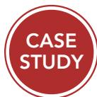
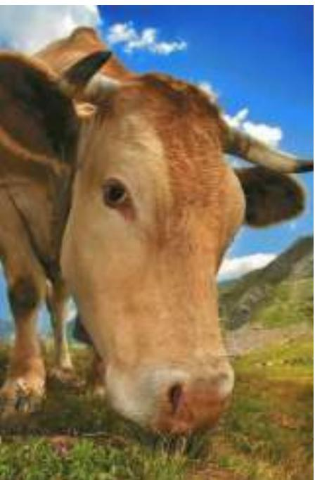

# The Case for Toll Roads

Many economists think drivers should be charged more for using roads. Here is why.

## Why You’ll Love Paying for Roads That Used to Be Free By Eric A. Morris

o end the scourge of traffic congestion, Julius Caesar banned most carts from the streets of Rome during daylight hours. It didn’t work—traffic jams just shifted to dusk. Two thousand years later, we have put a man on the moon and developed garments infinitely more practical than the toga, but we seem little nearer to solving the congestion problem.

If you live in a city, particularly a large one, you probably need little convincing that traffic congestion is frustrating and wasteful. According to the Texas Transportation Institute, the average American urban traveler lost 38 hours, nearly one full work week, to congestion in 2005. And congestion is getting worse, not better; urban travelers in 1982 were delayed only 14 hours that year.

Americans want action, but unfortunately there aren’t too many great ideas about what that action might be. As Anthony Downs’s excellent book Still Stuck in Traffic: Coping With Peak-Hour Traffic Congestion chronicles, most of the proposed solutions are too difficult to implement, won’t work, or both.

Fortunately, there is one remedy which is both doable and largely guaranteed to succeed. In the space of a year or two we could have you zipping along the 405 or the LIE at the height of rush hour at a comfortable 55 miles per hour.

There’s just one small problem with this silver bullet for congestion: many people seem to prefer the werewolf. Despite its merits, this policy, which is known as “congestion pricing,” “value pricing,” or “variable tolling,” is not an easy political sell.

For decades, economists and other transportation thinkers have advocated imposing tolls that vary with congestion levels on roadways. Simply put, the more congestion, the higher the toll, until the congestion goes away.

To many people, this sounds like a scheme by mustache-twirling bureaucrats and their academic apologists to fleece drivers out of their hard-earned cash. Why should drivers have to pay to use roads their tax dollars have already paid for? Won’t the remaining free roads be swamped as drivers are forced off the tolled roads? Won’t the working-class and poor be the victims here, as the tolled routes turn into “Lexus lanes”?

And besides, adopting this policy would mean listening to economists, and who wants to do that?

There’s a real problem with this logic, which is that, on its own terms, it makes perfect sense (except for the listening to economists part). Opponents of tolls are certainly not stupid, and their arguments deserve serious consideration. But in the end, their concerns are largely overblown, and the benefits of tolling swamp the potential costs.

Unfortunately, it can be hard to convey this because the theory behind tolling is somewhat complex and counterintuitive. This is too bad, because variable tolling is an excellent public policy. Here’s why: the basic economic theory is that when you give out something valuable—in this case, road space—for less than its true value, shortages result.

Ultimately, there’s no free lunch; instead of paying with money, you pay with the effort

consumption, and the road is a public good. Yet if a road is congested, then use of that road yields a negative externality. When one person drives on the road, it becomes more crowded, and other people must drive more slowly. In this case, the road is a common resource.

One way for the government to address the problem of road congestion is to charge drivers a toll. A toll is, in essence, a corrective tax on the externality of congestion. Sometimes, as in the case of local roads, tolls are not a practical solution because the cost of collecting them is too high. But several major cities, including London and Stockholm, have found increasing tolls to be a very effective way to reduce congestion.

Sometimes congestion is a problem only at certain times of day. If a bridge is heavily traveled only during rush hour, for instance, the congestion externality is largest during this time. The efficient way to deal with these externalities is

and time needed to acquire the good. Think of Soviet shoppers spending their lives in endless queues to purchase artificially low-priced but exceedingly scarce goods. Then think of Americans who can fulfill nearly any consumerist fantasy quickly but at a monetary cost. Free but congested roads have left us shivering on the streets of Moscow.

eliminate chronic, recurring congestion. No matter how high the demand for a road, there is a level of toll that will keep it flowing freely.

To make tolling truly effective, the price must be right. Too high a price drives away too many cars and the road does not function at its capacity. Too low a price and congestion isn’t licked.

To consider it another way, delay is an externality imposed by drivers on their peers. By driving onto a busy road and contributing to congestion, drivers slow the speeds of others—but they never have to pay for it, at least not directly. In the end, of course, everybody pays, because as we impose congestion on others, others impose it on us. This degenerates into a game that nobody can win.

Markets work best when externalities are internalized: i.e., you pay for the hassle you inflict on others…. Using tolls to help internalize the congestion externality would somewhat reduce the number of trips made on the most congested roads at the peak usage periods; some trips would be moved to less congested times and routes, and others would be foregone entirely. This way we would cut down on the congestion costs we impose on each other.

freeways. But given that elected officials have no burning desire to lose their jobs, a more realistic option, for now, is to toll just some freeway lanes that are either new capacity or underused carpool lanes. The other lanes would be left free—and congested. Drivers will then have a choice: wait or pay. Granted, neither is ideal. But right now drivers have no choice at all.

Granted, tolls cannot fully cope with accidents and other incidents, which are major causes of delay. But pricing can largely

The best solution is to vary the tolls in real time based on an analysis of current traffic conditions. Pilot toll projects on roads (like the I-394 in Minnesota and the I-15 in Southern California) use sensors embedded in the pavement to monitor the number and speeds of vehicles on the facility.

A simple computer program then determines the number of cars that should be allowed in. The computer then calculates the level of toll that will attract that number of cars—and no more. Prices are then updated every few minutes on electronic message signs. Hi-tech transponders and antenna arrays make waiting at toll booths a thing of the past.

The bottom line is that speeds are kept high (over 45 m.p.h.) so that throughput is higher than when vehicles are allowed to crowd all at once onto roadways at rush hour, slowing traffic to a crawl.

To maximize efficiency, economists would like to price all travel, starting with the

What’s the bottom line here? The state of Washington recently opened congestion-priced lanes on its State Route 167. The peak toll in the first month of operation (reached on the evening of Wednesday, May 21) was \$5.75. I know, I know, you would never pay such an exorbitant amount when America has taught you that free roads are your birthright. But that money bought Washington drivers a 27-minute time savings. Is a half hour of your time worth \$6?

I think I already know the answer, and it is “it depends.” Most people’s value of time varies widely depending on their activities on any given day. Late for picking the kids up from daycare? Paying \$6 to save a half hour is an incredible bargain. Have to clean the house? The longer your trip home takes, the better. Tolling will introduce a new level of flexibility and freedom into your life, giving you the power to tailor your travel costs to fit your schedule. ■

Source: Freakonomics blog, January 6, 2009.

to charge higher tolls during rush hour. This toll would provide an incentive for drivers to alter their schedules, reducing traffic when congestion is greatest.

Another policy that responds to the problem of road congestion (discussed in the previous chapter) is the tax on gasoline. A higher gasoline tax increases the price of gasoline, reduces the amount that people drive, and reduces road congestion. The gasoline tax is an imperfect solution to congestion, however, because it affects other decisions besides the amount of driving on congested roads. In particular, the tax also discourages driving on uncongested roads, even though there is no congestion externality for these roads.

Fish, Whales, and Other Wildlife Many species of animals are common resources. Fish and whales, for instance, have commercial value, and anyone can go to the ocean and catch whatever is available. Each person has little incentive to maintain the species for the next year. Just as excessive grazing can destroy the Town Common, excessive fishing and whaling can destroy commercially valuable marine populations.

Oceans remain one of the least regulated common resources. Two problems prevent an easy solution. First, many countries have access to the oceans, so any solution would require international cooperation among countries that hold different values. Second, because the oceans are so vast, enforcing any agreement is difficult. As a result, fishing rights have been a frequent source of international tension among normally friendly countries.

Within the United States, various laws aim to manage the use of fish and other wildlife. For example, the government charges for fishing and hunting licenses, and it restricts the lengths of the fishing and hunting seasons. Fishermen are often required to throw back small fish, and hunters can kill only a limited number of animals. All these laws reduce the use of a common resource and help maintain animal populations.

## WHY THE COW IS NOT EXTINCT

Throughout history, many species of animals have been threatened with extinction. When Europeans first arrived in North America, more than 60 million buffalo roamed the continent. Unfortunately,

however, hunting the buffalo was so popular during the 19th century that by 1900 the animal’s population had fallen to about 400 before the government stepped in to protect the species. In some African countries today, elephants face a similar challenge, as poachers kill them for the ivory in their tusks.

Yet not all animals with commercial value face this threat. The cow, for example, is a valuable source of food, but no one worries that the cow will soon be extinct. Indeed, the great demand for beef seems to ensure that the species will continue to thrive.

Why does the commercial value of ivory threaten the elephant, while the commercial value of beef protects the cow? The reason is that elephants are a common resource, whereas cows are a private good. Elephants roam freely without any owners. Each poacher has a strong incentive to kill as many elephants as she can find. Because poachers are numerous, each poacher has only a slight incentive to preserve the elephant population. By contrast, cattle live on ranches that are privately owned. Each rancher makes a great effort to maintain the cattle population on her ranch because she reaps the benefit.

“Will the market protect me?”

Governments have tried to solve the elephant’s problem in two ways. Some countries, such as Kenya, Tanzania, and Uganda, have made it illegal to kill elephants and sell their ivory. Yet these laws have been hard to enforce, and the battle between the authorities and the poachers has become increasingly violent. Meanwhile, elephant populations have continued to dwindle. By contrast, other countries, such as Botswana, Malawi, Namibia, and Zimbabwe, have made elephants a private good by allowing people to kill elephants, but only those on their own property. Landowners now have an incentive to preserve the species on their own land, and as a result, elephant populations have started to rise. With private ownership and the profit motive now on its side, the African elephant might someday be as safe from extinction as the cow.

Why do governments try to limit the use of common resources?

## 11-4 Conclusion: The Importance of Property Rights

In this and the previous chapter, we have seen there are some “goods” that the market does not provide adequately. Markets do not ensure that the air we breathe is clean or that our country is defended from foreign aggressors. Instead, societies rely on the government to protect the environment and to provide for the national defense.

The problems we considered in these chapters arise in many different markets, but they share a common theme. In all cases, the market fails to allocate resources efficiently because property rights are not well established. That is, some item of value does not have an owner with the legal authority to control it. For example, although no one doubts that the “good” of clean air or national defense is valuable, no one has the right to attach a price to it and profit from its use. A factory pollutes too much because no one charges the factory for the pollution it emits. The market does not provide for national defense because no one can charge those who are defended for the benefit they receive.

When the absence of property rights causes a market failure, the government can potentially solve the problem. Sometimes, as in the sale of pollution permits, the solution is for the government to help define property rights and thereby unleash market forces. Other times, as in restricted hunting seasons, the solution is for the government to regulate private behavior. Still other times, as in the provision of national defense, the solution is for the government to use tax revenue to supply a good that the market fails to supply. In each of these cases, if the policy is well planned and well run, it can make the allocation of resources more efficient and thus raise economic well-being.

## CHAPTER QuickQuiz

<table><tr><td>1. Which categories of goods are excludable?a. private goods and club goodsb. private goods and common resourcesc. public goods and club goodsd. public goods and common resources</td><td>4. Which of the following is an example of a common resource?a. residential housingb. national defensec. restaurant mealsd. fish in the ocean</td></tr><tr><td>2. Which categories of goods are rival in consumption?a. private goods and club goodsb. private goods and common resourcesc. public goods and club goodsd. public goods and common resources</td><td>5. Public goods area. efficiently provided by market forces.b. underprovided in the absence of government.c. overused in the absence of government.d. a type of natural monopoly.</td></tr><tr><td>3. Which of the following is an example of a public good?a. residential housingb. national defensec. restaurant mealsd. fish in the ocean</td><td>6. Common resources area. efficiently provided by market forces.b. underprovided in the absence of government.c. overused in the absence of government.d. a type of natural monopoly.</td></tr></table>

## SUMMARY

Goods differ in whether they are excludable and whether they are rival in consumption. A good is excludable if it is possible to prevent someone from using it. A good is rival in consumption if one person’s use of the good reduces others’ ability to use the same unit of the good. Markets work best for private goods, which are both excludable and rival in consumption. Markets do not work as well for other types of goods.

Public goods are neither rival in consumption nor excludable. Examples of public goods include fireworks displays, national defense, and the discovery of fundamental knowledge. Because people are not charged for their use of the public good, they have an incentive to free ride, making private provision of the good untenable. Therefore, governments provide public goods, basing their decision about the quantity of each good on cost–benefit analysis.

Common resources are rival in consumption but not excludable. Examples include common grazing land, clean air, and congested roads. Because people are not charged for their use of common resources, they tend to use them excessively. Therefore, governments use various methods, such as regulations and corrective taxes, to limit the use of common resources.

## KEY CONCEPTS

excludability, p. 212 rivalry in consumption, p. 212 private goods, p. 212

public goods, p. 212 common resources, p. 213 club goods, p. 213

free rider, p. 214

cost–benefit analysis, p. 217

Tragedy of the Commons, p. 218

## QUESTIONS FOR REVIEW

1. Explain what is meant by a good being “excludable.” Explain what is meant by a good being “rival in consumption.” Is a slice of pizza excludable? Is it rival in consumption?

2. Define and give an example of a public good. Can the private market provide this good on its own? Explain.

## PROBLEMS AND APPLICATIONS

1. Think about the goods and services provided by your local government.

a. Using the classification in Figure 1, explain which category each of the following goods falls into:

• police protection

• snow plowing

• education

• rural roads

• city streets

b. Why do you think the government provides items that are not public goods?

2. Both public goods and common resources involve externalities.

a. Are the externalities associated with public goods generally positive or negative? Use examples in your answer. Is the free-market quantity of public

3. What is cost–benefit analysis of public goods? Why is it important? Why is it hard?

4. Define and give an example of a common resource. Without government intervention, will people use this good too much or too little? Why?

goods generally greater or less than the efficient quantity?

b. Are the externalities associated with common resources generally positive or negative? Use examples in your answer. Is the free-market use of common resources generally greater or less than the efficient use?

3. Fredo loves watching Downton Abbey on his local public TV station, but he never sends any money to support the station during its fund-raising drives.

a. What name do economists have for people like Fredo?

b. How can the government solve the problem caused by people like Fredo?

c. Can you think of ways the private market can solve this problem? How does the existence of cable TV alter the situation?

<table><tr><td>Frank</td><td>$50</td></tr><tr><td>Joe</td><td>$100</td></tr><tr><td>Callie</td><td>$300</td></tr></table>

4. Wireless, high-speed Internet is provided for free in the airport of the city of Communityville.

a. At first, only a few people use the service. What type of a good is this and why?

b. Eventually, as more people find out about the service and start using it, the speed of the connection begins to fall. Now what type of a good is the wireless Internet service?

c. What problem might result and why? What is one possible way to correct this problem?

5. Four roommates are planning to spend the weekend in their dorm room watching old movies, and they are debating how many to watch. Here is their willingness to pay for each film:

<table><tr><td></td><td>Steven</td><td>Peter</td><td>James</td><td>Christopher</td></tr><tr><td>First film</td><td>$7</td><td>$5</td><td>$3</td><td>$2</td></tr><tr><td>Second film</td><td>6</td><td>4</td><td>2</td><td>1</td></tr><tr><td>Third film</td><td>5</td><td>3</td><td>1</td><td>0</td></tr><tr><td>Fourth film</td><td>4</td><td>2</td><td>0</td><td>0</td></tr><tr><td>Fifth film</td><td>3</td><td>1</td><td>0</td><td>0</td></tr></table>

a. Within the dorm room, is the showing of a movie a public good? Why or why not?

b. If it costs \$8 to rent a movie, how many movies should the roommates rent to maximize total surplus?

c. If they choose the optimal number from part (b) and then split the cost of renting the movies equally, how much surplus does each person obtain from watching the movies?

d. Is there any way to split the cost to ensure that everyone benefits? What practical problems does this solution raise?

e. Suppose they agree in advance to choose the efficient number and to split the cost of the movies equally. When Steven is asked his willingness to pay, will he have an incentive to tell the truth? If so, why? If not, what will he be tempted to say?

f. What does this example teach you about the optimal provision of public goods?

6. Some economists argue that private firms will not undertake the efficient amount of basic scientific research.

a. Explain why this might be so. In your answer, classify basic research in one of the categories shown in Figure 1.

b. What sort of policy has the United States adopted in response to this problem?

c. It is often argued that this policy increases the technological capability of American producers relative to that of foreign firms. Is this argument consistent with your classification of basic research in part (a)? (Hint: Can excludability apply to some potential beneficiaries of a public good and not others?)

7. Two towns, each with three members, are deciding whether to put on a fireworks display to celebrate the New Year. Fireworks cost \$360. In each town, some people enjoy fireworks more than others.

a. In the town of Bayport, each of the residents values the public good as follows:

Would fireworks pass a cost–benefit analysis? Explain.

b. The mayor of Bayport proposes to decide by majority rule and, if the fireworks referendum passes, to split the cost equally among all residents. Who would vote in favor, and who would vote against? Would the vote yield the same answer as the cost–benefit analysis?

c. In the town of River Heights, each of the residents values the public good as follows:

Nancy \$20 Bess \$140 Ned \$160

Would fireworks pass a cost–benefit analysis? Explain.

d. The mayor of River Heights also proposes to decide by majority rule and, if the fireworks referendum passes, to split the cost equally among all residents. Who would vote in favor, and who would vote against? Would the vote yield the same answer as the cost–benefit analysis?

e. What do you think these examples say about the optimal provision of public goods?

8. There is often litter along highways but rarely in people’s yards. Provide an economic explanation for this fact.

9. Many transportation systems, such as the Washington, D.C., Metro (subway), charge higher fares during rush hours than during the rest of the day. Why might they do this?

10. High-income people are willing to pay more than lower-income people to avoid the risk of death. For example, they are more likely to pay for safety features on cars. Do you think cost–benefit analysts should take this fact into account when evaluating public projects? Consider, for instance, a rich town and a poor town, both of which are considering the installation of a traffic light. Should the rich town use a higher dollar value for a human life in making this decision? Why or why not?

To find additional study resources, visit cengagebrain.com, and search for “Mankiw.”
