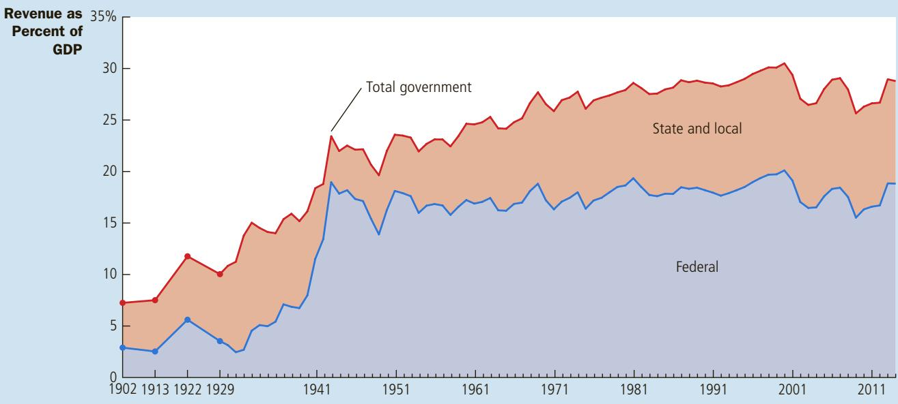
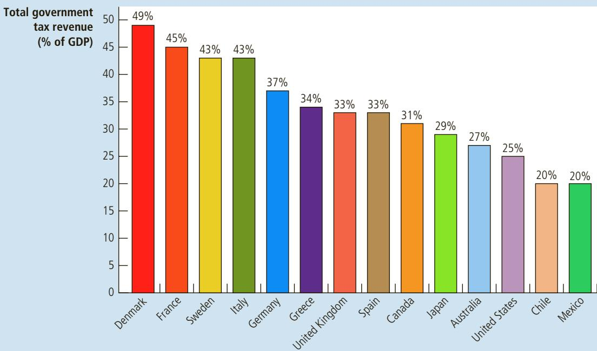

# The Design of the Tax System

Al “Scarface” Capone, the notorious 1920s gangster and crime boss, was neverconvicted for his many violent crimes. Yet, eventually, he did go to jail—for convicted for his many violent crimes. Yet, eventually, he did go to jail—for tax evasion. He had neglected to heed Ben Franklin’s observation that “in this world nothing is certain but death and taxes.”

When Franklin made this claim in 1789, the average American paid less than 5 percent of his income in taxes, and that remained true for the next hundred years. Over the course of the 20th century, however, taxes became ever more important in the life of the typical U.S. citizen. Today, all taxes taken together—including personal income taxes, corporate income taxes, payroll taxes, sales taxes, and property taxes—use up more than a quarter of the average American’s income. In many European countries, the tax bite is even larger.

Taxes are inevitable because citizens expect their governments to provide them with various goods and services. One of the Ten Principles of Economics from Chapter 1 is that markets are usually a good way to organize economic activity. But market economies rely on property rights and the rule of law, and so the government provides police and courts. Another of the Ten Principles of Economics is that the government can sometimes improve market outcomes. When the government remedies an externality (such as air pollution), provides a public good (such as national defense), or regulates the use of a common resource (such as fish in a public lake), it can raise economic well-being. But these activities can be costly. For the government to perform these and its many other functions, it needs to raise revenue through taxation.

We began our study of taxation in earlier chapters, where we saw how a tax on a good affects the supply and demand for that good. In Chapter 6, we saw that a tax reduces the quantity sold in a market, and we examined how the burden of a tax is shared by buyers and sellers depending on the elasticities of supply and demand. In Chapter 8, we examined how taxes affect economic well-being. We learned that taxes can cause deadweight losses: The reduction in consumer and producer surplus resulting from a tax exceeds the revenue raised by the government.

In this chapter, we build on these lessons to discuss the design of a tax system. We begin with some basic facts about how the U.S. government raises money. We then discuss the fundamental principles of taxation. Most people agree that taxes should impose as small a cost on society as possible and that the burden of taxes should be distributed fairly. That is, the tax system should be both efficient and equitable. As we will see, however, stating these goals is easier than achieving them.

## 12-1 An Overview of U.S. Taxation

How much of the nation’s income does the government collect as taxes? Figure 1 shows government revenue, including federal, state, and local, as a percentage of total income for the U.S. economy. It shows that the role of government has grown substantially over the past century. In 1902, the government collected only 7 percent of total income; in recent years, government has collected almost 30 percent. In other words, as the economy’s income has grown, the government’s revenue from taxation has grown even more.

Figure 2 compares the tax burden for several major countries, as measured by the government’s tax revenue as a percentage of the nation’s total income. The United States has a low tax burden compared to most other advanced economies. Many European nations have much higher taxes, which finance a more generous social safety net, including more substantial income support for the poor and unemployed.

## 12-1a Taxes Collected by the Federal Government

The U.S. federal government collects about two-thirds of the taxes in our economy. Table 1 shows the receipts of the federal government in 2014. Total receipts that year were \$3.3 trillion, a number so large that it is hard to comprehend. To bring this astronomical number down to earth, we can divide it by the size of the U.S. population, which was about 319 million in 2014. We then find that the average American paid \$10,235 to the federal government.

This figure shows revenue of the federal government and of state and local governments as a percentage of gross domestic product (GDP), which measures total income in the economy. It shows that the government plays a large role in the U.S. economy and that its role has grown over time. Source: Historical Statistics of the United States; Bureau of Economic Analysis; and author’s calculations.

## FIGURE 1

Government Revenue as a Percentage of GDP: Changes over Time

  
The percentage of income that governments take in taxes varies substantially from country to country. Source: OECD. Data are for 2013.

## FIGURE 2

Government Revenue as a Percentage of GDP: International Comparisons

## TABLE 1

Receipts of the Federal Government: 2014

Source: Bureau of Economic Analysis. Columns may not sum to total due to rounding.

<table><tr><td>Tax</td><td>Amount (billions)</td><td>Amount per Person</td><td>Percent of Receipts</td></tr><tr><td>Personal income taxes</td><td>$1,397</td><td>$4,379</td><td>43%</td></tr><tr><td>Social insurance taxes</td><td>1145</td><td>3,589</td><td>35</td></tr><tr><td>Corporate income taxes</td><td>418</td><td>1,310</td><td>13</td></tr><tr><td>Other</td><td>305</td><td>956</td><td>9</td></tr><tr><td>Total</td><td>$3,265</td><td>$10,235</td><td>100%</td></tr></table>

Personal Income Taxes The largest source of revenue for the federal government is the personal income tax. As April 15 approaches each year, almost every American family fills out a tax form to determine the income tax it owes the government. Each family is required to report its income from all sources: wages from working, interest on savings, dividends from corporations in which it owns shares, profits from any small businesses it operates, and so on. The family’s tax liability (how much it owes) is based on its total income.

A family’s income tax liability is not simply proportional to its income. Instead, the law requires a more complicated calculation. Taxable income is computed as total income minus an amount based on the number of dependents (primarily children) and minus certain expenses that policymakers have deemed “deductible” (such as mortgage interest payments, state and local tax payments, and charitable giving). Then the tax liability is calculated from taxable income using a schedule like the one shown in Table 2.

This table presents the marginal tax rate—the tax rate applied to each additional dollar of income. Because the marginal tax rate rises as income rises, higherincome families pay a larger percentage of their income in taxes. Note that each tax rate in the table applies only to income within the associated range, not to a person’s entire income. For example, a person with an income of \$1 million still pays only 10 percent of the first \$9,075. (Later in this chapter we discuss the concept of the marginal tax rate more fully.)

Payroll Taxes Almost as important to the federal government as the personal income tax are payroll taxes. A payroll tax is a tax on the wages that a firm pays its

## TABLE 2

## The Federal Income Tax Rates: 2014

This table shows the marginal tax rates for an unmarried taxpayer. The taxes owed by a taxpayer depend on all the marginal tax rates up to his income level. For example, a taxpayer with income of \$25,000 pays 10 percent of the first \$9,075 of income, and then 15 percent of the rest.

<table><tr><td>On Taxable Income . . .</td><td>The Tax Rate Is . . .</td></tr><tr><td>From $0 to $9,075</td><td>10%</td></tr><tr><td>From $9,076 to $36,900</td><td>15%</td></tr><tr><td>From $36,901 to $89,350</td><td>25%</td></tr><tr><td>From $89,351 to $186,350</td><td>28%</td></tr><tr><td>From $186,351 to $405,100</td><td>33%</td></tr><tr><td>From $405,101 to $406,750</td><td>35%</td></tr><tr><td>From $406,751 and above</td><td>39.6%</td></tr></table>

workers. Table 1 calls this revenue social insurance taxes because the revenue from these taxes is mostly earmarked to pay for Social Security and Medicare. Social Security is an income-support program designed primarily to maintain the living standards of the elderly. Medicare is the government health program for the elderly. In 2014, the total payroll tax was 15.3 percent for annual earnings up to \$117,000 and 2.9 percent of earnings above \$117,000, together with an additional 0.9 percent for taxpayers with high income (above \$200,000 if single, \$250,000 if married). For many middle-income households, the payroll tax is the largest tax they pay.

Corporate Income Taxes Next in magnitude, but much smaller than either personal income taxes or social insurance taxes, is the corporate income tax. A corporation is a business set up to have its own legal existence, distinct and separate from its owners. The government taxes each corporation based on its profit— the amount the corporation receives for the goods or services it sells minus the costs of producing those goods or services. Notice that corporate profits are, in essence, taxed twice. They are taxed once by the corporate income tax when the corporation earns the profits, and they are taxed again by the personal income tax when the corporation uses its profits to pay dividends to its shareholders. In part to compensate for this double taxation, policymakers have decided to tax dividend income at lower rates than other types of income: In 2014, the top marginal tax rate on dividend income was only 20 percent (plus a 3.8 percent Medicare tax), compared with the top marginal tax rate on ordinary income of 39.6 percent (plus the same 3.8 percent).

Other Taxes The last category, labeled “other” in Table 1, makes up 9 percent of receipts. This category includes excise taxes, which are taxes on specific goods like gasoline, cigarettes, and alcoholic beverages. It also includes various small items, such as estate taxes and customs duties.

## 12-1b Taxes Collected by State and Local Governments

State and local governments collect about a third of all taxes paid. Table 3 shows the receipts of U.S. state and local governments. Total receipts for 2014 were \$2,225 billion, or \$6,975 per person. The table also shows how this total is broken down into different kinds of taxes.

The two most important taxes for state and local governments are sales taxes and property taxes. Sales taxes are levied as a percentage of the total amount spent

<table><tr><td>Tax</td><td>Amount (billions)</td><td>Amount per Person</td><td>Percent of Receipts</td></tr><tr><td>Sales taxes</td><td>$525</td><td>$1,646</td><td>24%</td></tr><tr><td>Property taxes</td><td>456</td><td>1,429</td><td>20</td></tr><tr><td>Personal income taxes</td><td>383</td><td>1,201</td><td>17</td></tr><tr><td>Corporate income taxes</td><td>58</td><td>182</td><td>3</td></tr><tr><td>Federal government</td><td>495</td><td>1,552</td><td>22</td></tr><tr><td>Other</td><td>308</td><td>966</td><td>14</td></tr><tr><td>Total</td><td>$2,225</td><td>$6,975</td><td>100%</td></tr></table>

## TABLE 3

Receipts of State and Local Governments: 2014

Source: Bureau of Economic Analysis. Columns may not sum to total due to rounding.

at retail stores. Every time a customer buys something, he pays the storekeeper an extra amount that the storekeeper remits to the government. (Some states exclude certain items that are considered necessities, such as food and clothing.) Property taxes are levied on property owners as a percentage of the estimated value of land and structures. Together, these two taxes make up more than 40 percent of all receipts of state and local governments.

State and local governments also levy individual and corporate income taxes. In many cases, state and local income taxes are similar to federal income taxes. In other cases, they are quite different. For example, some states tax income from wages less heavily than income earned in the form of interest and dividends. Some states do not tax income at all.

State and local governments also receive substantial funds from the federal government. To some extent, the federal government’s policy of sharing its revenue with state governments redistributes funds from high-income states (which pay more taxes) to low-income states (which receive more benefits). Often, these funds are tied to specific programs that the federal government wants to subsidize. For example, Medicaid provides healthcare for the poor; this program is managed by the states but much of the funding comes from the federal government.

Finally, state and local governments receive receipts from various sources included in the “other” category in Table 3. These include fees for fishing and hunting licenses, tolls from roads and bridges, and fares for public buses and subways.

What are the two most important sources of tax revenue for the federal QuickQuiz government? • What are the two most important sources of tax revenue for state and local governments?

## 12-2 Taxes and Efficiency

Now that we have seen how various levels of the U.S. government raise money in practice, let’s consider how one might design a good tax system in principle. The primary aim of a tax system is to raise revenue for the government, but there are many ways to raise any given amount of money. When choosing among the many alternative taxes, policymakers have two objectives: efficiency and equity.

One tax system is more efficient than another if it raises the same amount of revenue at a smaller cost to taxpayers. What are the costs of taxes to taxpayers? The most obvious cost is the tax payment itself. This transfer of money from the taxpayer to the government is an inevitable feature of any tax system. Yet taxes also impose two other costs, which well-designed tax policy tries to avoid or, at least, minimize:

• The deadweight losses that result when taxes distort the decisions people make;

• The administrative burdens that taxpayers bear as they comply with the tax laws.

An efficient tax system is one that imposes small deadweight losses and small administrative burdens.

## 12-2a Deadweight Losses

One of the Ten Principles of Economics is that people respond to incentives, and this includes incentives provided by the tax system. If the government taxes ice cream, people eat less ice cream and more frozen yogurt. If the government taxes housing, people live in smaller houses and spend more of their income on other things. If the government taxes labor earnings, people work less and enjoy more leisure.

Because taxes distort incentives, they entail deadweight losses. As we first discussed in Chapter 8, the deadweight loss of a tax is the reduction in economic well-being of taxpayers in excess of the amount of revenue raised by the government. The deadweight loss is the inefficiency that a tax creates as people allocate resources according to the tax incentive rather than the true costs and benefits of the goods and services that they buy and sell.

SYNDICATE, INC. BERRY’S WORLD REPRINTED BY PERMISSION OF UNITED FEATURE

To recall how taxes cause deadweight losses, consider an example. Suppose that Jake places an \$8 value on a pizza and Jane places a \$6 value on it. If there is no tax on pizza, the price of pizza will reflect the cost of making it. Let’s suppose that the price of pizza is \$5, so both Jake and Jane choose to buy one. Both consumers get some surplus of value over the amount paid. Jake gets consumer surplus of \$3, and Jane gets consumer surplus of \$1. Total surplus is \$4.

  
“I was gonna fix the place up, but if I did, the city would just raise my taxes!”

Now suppose that the government levies a \$2 tax on pizza and the price of pizza rises to \$7. (This occurs if supply is perfectly elastic.) Jake still buys a pizza, but now he has consumer surplus of only \$1. Jane now decides not to buy a pizza because its price is higher than its value to her. The government collects tax revenue of \$2 on Jake’s pizza. Total consumer surplus has fallen by \$3 (from \$4 to \$1). Because total surplus has fallen by more than the tax revenue, the tax has a deadweight loss. In this case, the deadweight loss is \$1.

Notice that the deadweight loss comes not from Jake, the person who pays the tax, but from Jane, the person who doesn’t. The reduction of \$2 in Jake’s surplus exactly offsets the amount of revenue the government collects. The deadweight loss arises because the tax causes Jane to alter her behavior. When the tax raises the price of pizza, Jane is worse off, and yet there is no offsetting revenue to the government. This reduction in Jane’s welfare is the deadweight loss of the tax.

## SHOULD INCOME OR CONSUMPTION BE TAXED?

When taxes cause people to change their behavior—such as inducing Jane to buy less pizza—the taxes cause deadweight losses and make the allocation of resources less efficient. As we have already

seen, much government revenue comes from the personal income tax. In a case study in Chapter 8, we discussed how this tax discourages people from working as hard as they otherwise might. Another inefficiency caused by this tax is that it discourages people from saving.

Consider a 25-year-old deciding whether to save \$1,000. If he puts this money in a savings account that earns 8 percent and leaves it there, he will have \$21,720 when he retires at age 65. Yet if the government taxes one-fourth of his interest income each year, the effective interest rate is only 6 percent. After 40 years of earning 6 percent, the \$1,000 grows to only \$10,290, less than half of what it would have been without taxation. Thus, because interest income is taxed, saving is much less attractive.

Some economists advocate eliminating the current tax system’s disincentive toward saving by changing the basis of taxation. Rather than taxing the amount of income that people earn, the government could tax the amount that people spend. Under this proposal, all income that is saved would not be taxed until the saving is later spent. This alternative system, called a consumption tax, would not distort people’s saving decisions.

Various provisions of current law already make the tax system a bit like a consumption tax. Taxpayers can put a limited amount of their income into special savings accounts, such as Individual Retirement Accounts and 401(k) plans, and this income and the accumulated interest it earns escape taxation until the money is withdrawn at retirement. For people who do most of their saving through these retirement accounts, their tax bill is, in effect, based on their consumption rather than their income.

European countries tend to rely more on consumption taxes than does the United States. Most of them raise a significant amount of government revenue through a value-added tax, or a VAT. A VAT is like the retail sales tax that many U.S. states use. But rather than collecting all of the tax at the retail level when the consumer buys the final good, the government collects the tax in stages as the good is being produced (that is, as value is added by firms along the chain of production).

Various U.S. policymakers have proposed that the tax code move further in the direction of taxing consumption rather than income. In 2005, economist Alan Greenspan, then Chairman of the Federal Reserve, offered this advice to a presidential commission on tax reform: “As you know, many economists believe that a consumption tax would be best from the perspective of promoting economic growth—particularly if one were designing a tax system from scratch—because a consumption tax is likely to encourage saving and capital formation. However, getting from the current tax system to a consumption tax raises a challenging set of transition issues.”

## 12-2b Administrative Burden

If you ask the typical person on April 15 for an opinion about the tax system, you might get an earful (perhaps peppered with expletives) about the headache of filling out tax forms. The administrative burden of any tax system is part of the inefficiency it creates. This burden includes not only the time spent in early April filling out forms but also the time spent throughout the year keeping records for tax purposes and the resources the government uses to enforce the tax laws.

Many taxpayers—especially those in higher tax brackets—hire tax lawyers and accountants to help them with their taxes. These experts in the complex tax laws fill out tax forms for their clients and help them arrange their affairs in a way that reduces the amount of taxes owed. This behavior is legal tax avoidance, which is different from illegal tax evasion.

Critics of our tax system say that these advisers help their clients avoid taxes by abusing some of the detailed provisions of the tax code, often dubbed “loopholes.” In some cases, loopholes are congressional mistakes: They arise from ambiguities or omissions in the tax laws. More often, they arise because Congress has chosen to give special treatment to specific types of behavior. For example, the U.S. federal tax code gives preferential treatment to investors in municipal bonds because Congress wanted to make it easier for state and local governments to borrow money. To some extent, this provision benefits states and localities, and to some extent, it benefits high-income taxpayers. Most loopholes are well known by those in Congress who make tax policy, but what looks like a loophole to one taxpayer may look like a justifiable tax deduction to another.

The resources devoted to complying with the tax laws are a type of deadweight loss. The government gets only the amount of taxes paid. By contrast, the taxpayer loses not only this amount but also the time and money spent documenting, computing, and avoiding taxes.

The administrative burden of the tax system could be reduced by simplifying the tax laws. Yet simplification is often politically difficult. Most people are ready to simplify the tax code by eliminating the loopholes that benefit others, but few are eager to give up the loopholes that they benefit from themselves. In the end, the complexity of the tax law results from the political process as various taxpayers with their own special interests lobby for their causes.

## 12-2c Marginal Tax Rates versus Average Tax Rates

When discussing the efficiency and equity of income taxes, economists distinguish between two notions of the tax rate: the average and the marginal. The average tax rate is total taxes paid divided by total income. The marginal tax rate is the amount by which taxes increase from an additional dollar of income.

For example, suppose that the government taxes 20 percent of the first \$50,000 of income and 50 percent of all income above \$50,000. Under this tax, a person who makes \$60,000 pays a tax of \$15,000: 20 percent of the first \$50,000 (0.20 3 \$50,000 5 \$10,000) plus 50 percent of the remaining \$10,000 (0.50 3 \$10,000 5 \$5,000). For this person, the average tax rate is \$15,000 / \$60,000, or 25 percent. But the marginal tax rate is 50 percent. If the taxpayer earned an additional dollar of income, that dollar would be subject to the 50 percent tax rate, so the amount the taxpayer would owe to the government would rise by \$0.50.

The marginal and average tax rates each contain a useful piece of information. If we are trying to gauge the sacrifice made by a taxpayer, the average tax rate is more appropriate because it measures the fraction of income paid in taxes. By contrast, if we are trying to gauge how the tax system distorts incentives, the marginal tax rate is more meaningful. One of the Ten Principles of Economics in Chapter 1 is that rational people think at the margin. A corollary to this principle is that the marginal tax rate measures how much the tax system discourages people from working. If you are thinking of working an extra few hours, the marginal tax rate determines how much the government takes of your additional earnings. It is the marginal tax rate, therefore, that determines the deadweight loss of an income tax.

## 12-2d Lump-Sum Taxes

Suppose the government imposes a tax of \$4,000 on everyone. That is, everyone owes the same amount, regardless of earnings or any actions that a person might take. Such a tax is called a lump-sum tax.

A lump-sum tax shows clearly the difference between average and marginal tax rates. For a taxpayer with income of \$20,000, the average tax rate of a \$4,000 lump-sum tax is 20 percent; for a taxpayer with income of \$40,000, the average tax rate is 10 percent. For both taxpayers, the marginal tax rate is zero because no tax is owed on an additional dollar of income.

A lump-sum tax is the most efficient tax possible. Because a person’s decisions do not alter the amount owed, the tax does not distort incentives and, therefore, does not cause deadweight losses. Because everyone can easily compute the amount owed and because there is no benefit to hiring tax lawyers and accountants, the lump-sum tax imposes a minimal administrative burden on taxpayers.

If lump-sum taxes are so efficient, why do we rarely observe them in the real world? The reason is that efficiency is only one goal of the tax system. A lump-sum tax would take the same amount from the poor and the rich, an outcome most people would view as unfair. To understand the tax systems that we observe, we must therefore consider the other major goal of tax policy: equity.

QuickQuiz

What is meant by the efficiency of a tax system? • What can make a tax system inefficient?

## 12-3 Taxes and Equity

Ever since American colonists dumped imported tea into Boston harbor to protest high British taxes, tax policy has generated some of the most heated debates in American politics. The heat is rarely fueled by questions of efficiency. Instead, it arises from disagreements over how the tax burden should be distributed. Senator Russell Long once mimicked the public debate with this ditty:

Don’t tax you.

Don’t tax me.

Tax that fella behind the tree.

Of course, if we rely on the government to provide some of the goods and services we want, then someone must pay taxes to fund those goods and services. In this section, we consider the equity of a tax system. How should the burden of taxes be divided among the population? How do we evaluate whether a tax system is fair? Everyone agrees that the tax system should be equitable, but there is much disagreement about how to judge the equity of a tax system.

## 12-3a The Benefits Principle

One principle of taxation, called the benefits principle, states that people should pay taxes based on the benefits they receive from government services. This principle tries to make public goods similar to private goods. It seems fair that a person who often goes to the movies pays more in total for movie tickets than a person who rarely goes. Similarly, a person who gets great benefit from a public good should pay more for it than a person who gets little benefit.

The gasoline tax, for instance, is sometimes justified using the benefits principle. In some states, revenues from the gasoline tax are used to build and maintain roads. Because those who buy gasoline are the same people who use the roads, the gasoline tax might be viewed as a fair way to pay for this government service.

The benefits principle can also be used to argue that wealthy citizens should pay higher taxes than poorer ones. Why? Simply because the wealthy benefit more from public services. Consider, for example, the benefits of police protection from theft. Citizens with much to protect benefit more from police than do those with less to protect. Therefore, according to the benefits principle, the wealthy should contribute more than the poor to the cost of maintaining the police force.

The same argument can be used for many other public services, such as fire protection, national defense, and the court system.

It is even possible to use the benefits principle to argue for antipoverty programs funded by taxes on the wealthy. As we discussed in Chapter 11, people may prefer living in a society without poverty, suggesting that antipoverty programs are a public good. If the wealthy place a greater dollar value on this public good than members of the middle class do, perhaps just because the wealthy have more to spend, then according to the benefits principle, they should be taxed more heavily to pay for these programs.

## 12-3b The Ability-to-Pay Principle

Another way to evaluate the equity of a tax system is called the ability-to-pay principle, which states that taxes should be levied on a person according to how well that person can shoulder the burden. This principle is sometimes justified by the claim that all citizens should make an “equal sacrifice” to support the government. The magnitude of a person’s sacrifice, however, depends not only on the size of his tax payment but also on his income and other circumstances: A \$1,000 tax paid by a poor person may require a larger sacrifice than a \$10,000 tax paid by a rich one.

The ability-to-pay principle leads to two corollary notions of equity: vertical equity and horizontal equity. Vertical equity states that taxpayers with a greater ability to pay should contribute a larger amount. Horizontal equity states that taxpayers with similar abilities to pay should contribute the same amount. These notions of equity are widely accepted, but applying them to evaluate a tax system is rarely straightforward.

Vertical Equity If taxes are based on ability to pay, then richer taxpayers should pay more than poorer taxpayers. But how much more should the rich pay? The debate over tax policy often focuses on this question.

Consider the three tax systems in Table 4. In each case, taxpayers with higher incomes pay more. Yet the systems differ in how quickly taxes rise with income. The first system is called proportional because all taxpayers pay the same fraction of income. The second system is called regressive because high-income taxpayers pay a smaller fraction of their income, even though they pay a larger amount. The third system is called progressive because high-income taxpayers pay a larger fraction of their income.

Which of these three tax systems is most fair? There is no obvious answer, and economic theory does not offer any help in trying to find one. Equity, like beauty, is in the eye of the beholder.

<table><tr><td rowspan="2">Income</td><td colspan="2">Proportional Tax</td><td colspan="2">Regressive Tax</td><td colspan="2">Progressive Tax</td></tr><tr><td>Amount of Tax</td><td>Percent of Income</td><td>Amount of Tax</td><td>Percent of Income</td><td>Amount of Tax</td><td>Percent of Income</td></tr><tr><td>$50,000</td><td>$12,500</td><td>25%</td><td>$15,000</td><td>30%</td><td>$10,000</td><td>20%</td></tr><tr><td>100,000</td><td>25,000</td><td>25</td><td>25,000</td><td>25</td><td>25,000</td><td>25</td></tr><tr><td>200,000</td><td>50,000</td><td>25</td><td>40,000</td><td>20</td><td>60,000</td><td>30</td></tr></table>

ability-to-pay principle the idea that taxes should be levied on a person according to how well that person can shoulder the burden

## vertical equity

the idea that taxpayers with a greater ability to pay taxes should pay larger amounts

## horizontal equity

the idea that taxpayers with similar abilities to pay taxes should pay the same amount

## proportional tax

a tax for which highincome and low-income taxpayers pay the same fraction of income

## regressive tax

a tax for which highincome taxpayers pay a smaller fraction of their income than do lowincome taxpayers

progressive tax a tax for which highincome taxpayers pay a larger fraction of their income than do lowincome taxpayers

## TABLE 4

Three Tax Systems

The debate over tax policy often concerns whether the wealthy pay their fair share. There is no objective way to make this judgment. In evaluating the issue for yourself, however, it is useful to know how lies with different incomes pay under the current tax system.

Table 5 presents some data on how federal taxes are distributed among income classes. These figures are for 2011, the most recent year available as this book was going to press, and were tabulated by the Congressional Budget Office (CBO). They include all federal taxes—personal income taxes, payroll taxes, corporate income taxes, and excise taxes—but not state and local taxes. When calculating a household’s tax burden, the CBO allocates corporate income taxes to the owners of capital and payroll taxes to workers.

To construct the table, households are ranked according to their income and placed into five groups of equal size, called quintiles. The table also presents data on the richest 1 percent of Americans. The second column of the table shows the average income of each group. Income includes both market income (income that households have earned from their work and savings) and transfer payments from government programs, such as Social Security and welfare. The poorest onefifth of households had average income of \$24,600, and the richest one-fifth had average income of \$245,700. The richest 1 percent had average income of over \$1.4 million.

The third column of the table shows total taxes as a percentage of income. As you can see, the U.S. federal tax system is progressive. The poorest fifth of households paid 1.9 percent of their incomes in taxes, and the richest fifth paid 23.4 percent. The top 1 percent paid 29.0 percent of their incomes.

The fourth and fifth columns compare the distribution of income with the distribution of taxes. The poorest quintile earned 5.3 percent of all income and paid 0.6 percent of all taxes. The richest quintile earned 51.9 percent of all income and paid 68.7 percent of all taxes. The richest 1 percent (which, remember, is ½0 the size of each quintile) earned 14.6 percent of all income and paid 24.0 percent of all taxes.

These numbers on taxes paid are a good starting point for understanding how the burden of government is distributed, but they give an incomplete picture. Money flows not only from households to the government in the form of taxes but also from the government back to households in the form of transfer payments. In some ways, transfer payments are the opposite of taxes. Including transfers as negative taxes substantially changes the distribution of the tax burden.

## TABLE 5

The Burden of Federal Taxes

Source: Congressional Budget Office. Figures are for 2011.

<table><tr><td>Quintile</td><td>Average Income</td><td>Taxes as a Percentage of Income</td><td>Percentage of All Income</td><td>Percentage of All Taxes</td></tr><tr><td>Lowest</td><td>$24,600</td><td>1.9%</td><td>5.3%</td><td>0.6%</td></tr><tr><td>Second</td><td>45,300</td><td>7.0</td><td>9.6</td><td>3.8</td></tr><tr><td>Middle</td><td>66,400</td><td>11.2</td><td>14.1</td><td>8.9</td></tr><tr><td>Fourth</td><td>97,500</td><td>15.2</td><td>20.4</td><td>17.6</td></tr><tr><td>Highest</td><td>245,700</td><td>23.4</td><td>51.9</td><td>68.7</td></tr><tr><td>Top 1%</td><td>1,453,100</td><td>29.0</td><td>14.6</td><td>24.0</td></tr></table>

The richest quintile of households still pays about one-quarter of its income to the government, even after transfers are subtracted, and the top 1 percent still pays almost 30 percent. By contrast, the average tax rate for the poorest quintile becomes a sizeable negative number. That is, typical households in the bottom of the income distribution receive substantially more in transfers than they pay in taxes. The lesson is clear: To understand fully the progressivity of government policies, one must take into account both what people pay and what they receive.

Finally, it is worth noting that the numbers in Table 5 are a bit out of date. In late 2012, the U.S. Congress passed and President Obama signed a tax bill that increased taxes significantly from those that prevailed previously, particularly for taxpayers at the top of the income distribution. As a result, the tax system in place for 2013 and beyond is more progressive than the one shown in the table. The Congressional Budget Office projects that for the top 1 percent, taxes as a percentage of income increased from 29.0 to 33.3 percent. ●

Horizontal Equity If taxes are based on ability to pay, then similar taxpayers should pay similar amounts of taxes. But what determines if two taxpayers are similar? Families differ in many ways. To evaluate whether a tax code is horizontally equitable, one must determine which differences are relevant for a family’s ability to pay and which differences are not.

Suppose the Smith and Jones families each have income of \$100,000. The Smiths have no children, but Mr. Smith has an illness that results in medical expenses of \$40,000. The Joneses are in good health, but they have four children. Two of the Jones children are in college, generating tuition bills of \$60,000. Would it be fair for these two families to pay the same tax because they have the same income? Would it be fair to give the Smiths a tax break to help them offset their high medical expenses? Would it be fair to give the Joneses a tax break to help them with their tuition expenses?

There are no easy answers to these questions. In practice, the U.S. tax code is filled with special provisions that alter a family’s tax obligations based on its specific circumstances.

## 12-3c Tax Incidence and Tax Equity

Tax incidence—the study of who bears the burden of taxes—is central to evaluating tax equity. As we first saw in Chapter 6, the person who bears the burden of a tax is not always the person who gets the tax bill from the government. Because taxes alter supply and demand, they alter equilibrium prices. As a result, they affect people beyond those who, according to statute, actually pay the tax. When evaluating the vertical and horizontal equity of any tax, it is important to take these indirect effects into account.

Many discussions of tax equity ignore the indirect effects of taxes and are based on what economists mockingly call the flypaper theory of tax incidence. According to this theory, the burden of a tax, like a fly on flypaper, sticks wherever it first lands. This assumption, however, is rarely valid.

For example, a person not trained in economics might argue that a tax on expensive fur coats is vertically equitable because most buyers of furs are wealthy. Yet if these buyers can easily substitute other luxuries for furs, then a tax on furs might only reduce the sale of furs. In the end, the burden of the tax will fall more on those who make and sell furs than on those who buy them. Because most workers who make furs are not wealthy, the equity of a fur tax could be quite different from what the flypaper theory indicates.

## IN THE NEWS

## Tax Expenditures

Tax reformers and deficit hawks often suggest reducing the deductions, credits, and exclusions that narrow the tax base.

## The Blur between Spending and Taxes

By N. Gregory Mankiw

hould the government cut spending or raise taxes to deal with its long-term fiscal imbalance? As President Obama’s deficit commission rolls out its final report in the coming weeks, this issue will most likely divide the political right and left. But, in many ways, the question is the wrong one. The distinction between spending and taxation is often murky and sometimes meaningless.

Imagine that there is some activity—say, snipe hunting—that members of Congress want to encourage. Senator Porkbelly proposes a government subsidy. “America needs more snipe hunters,” he says. “I propose that every time an American bags a snipe, the federal government should pay him or her \$100.”

“No, no,” says Congressman Blowhard. “The Porkbelly plan would increase the size of an already bloated government. Let’s instead reduce the burden of taxation. I propose that every time an American tracks down a snipe, the hunter should get a \$100 credit to reduce his or her tax liabilities.”

To be sure, government accountants may treat the Porkbelly and Blowhard plans differently. They would likely deem the subsidy to be a spending increase and the credit to be a tax cut. Moreover, the rhetoric of the two politicians about spending and taxes may appeal to different political bases.

But it hardly takes an economic genius to see how little difference there is between the two plans. Both policies enrich the nation’s snipe hunters. And because the government must balance its books, at least in the long run, the gains of the snipe hunters must come at the cost of higher taxes or lower government benefits for the rest of us.

Economists call the Blowhard plan a “tax expenditure.” The tax code is filled with them —although not yet one for snipe hunting. Every time a politician promises a “targeted tax cut,” he or she is probably offering up a form of government spending in disguise.

Erskine B. Bowles and Alan K. Simpson, the chairmen of President Obama’s deficit reduction commission, have taken at hard look at these tax expenditures —and they don’t like what they see. In their draft proposal, released earlier this month, they proposed doing away with tax expenditures, which together cost the Treasury over \$1 trillion a year.

Such a drastic step would allow Mr. Bowles and Mr. Simpson to move the budget toward fiscal sustainability, while simultaneously reducing all income tax rates. Under their plan, the top tax rate would fall to 23 percent from the 35 percent in today’s law (and the 39.6 percent currently advocated by Democratic leadership).

This approach has long been the basic recipe for tax reform. By broadening the tax base and lowering tax rates, we can increase government revenue and distort incentives less. That should command widespread applause across the ideological spectrum. Unfortunately, the reaction has been less enthusiastic.

Pundits on the left are suspicious of any plan that reduces marginal tax rates on the rich. But, as Mr. Bowles and Mr. Simpson point

