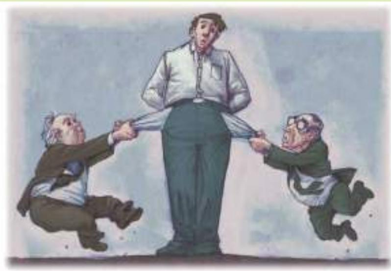

## WHO PAYS THE CORPORATE INCOME TAX?

The corporate income tax provides a good example of the importance of tax incidence for tax policy. The corporate tax is popular among voters. After all, corporations are not people. Voters are always eager x cut and let some impersonal corporation pick up the tab.

But before deciding that the corporate income tax is a good way for the government to raise revenue, we should consider who bears the burden of the corporate tax. This is a difficult question on which economists disagree, but one thing is certain: People pay all taxes. When the government levies a tax on a corporation, the corporation is more like a tax collector than a taxpayer. The burden of the tax ultimately falls on people—the owners, customers, or workers of the corporation.

Many economists believe that workers and customers bear much of the burden of the corporate income tax. To see why, consider an example. Suppose that the U.S. government decides to raise the tax on the income earned by car companies. At first, this tax hurts the owners of the car companies, who receive less profit.

THE NEW YORK TIMES, NOVEMBER 21, 2010/ARTIST DAVID KLEIN

out, tax expenditures disproportionately benefit those at the top of the economic ladder. According to their figures, tax expenditures increase the after-tax income of those in the bottom quintile by about 6 percent. Those in the top 1 percent of the income distribution enjoy about twice that gain. Progressives who are concerned about the gap between rich and poor should be eager to scale back tax expenditures.

Pundits on the right, meanwhile, are suspicious of anything that increases government revenue. But they should recognize that tax expenditures are best viewed as a hidden form of spending. If we eliminate tax expenditures and reduce marginal tax rates, as Mr. Bowles and Mr. Simpson propose, we are essentially doing what economic conservatives have long advocated: cutting spending and taxes.

Yet another political problem is that each tax expenditure has its own political constituency. If Congressman Blowhard ever got his way, the snipe hunters of the world would surely fight to keep their tax break.

One major tax expenditure that the Bowles-Simpson plan would curtail or eliminate is the mortgage interest deduction. Without doubt, many homeowners and the real estate industry will object. But they won’t have the merits on their side.

This subsidy to homeownership is neither economically efficient nor particularly equitable. Economists have long pointed out that tax subsidies to housing, together with the high taxes on corporations, cause too much of the economy’s capital stock to be tied up in residential structures and too little in corporate capital. This misallocation of resources results in lower productivity and reduced real wages.

Moreover, there is nothing particularly ignoble about renting that deserves the scorn of the tax code. But let’s face it: subsidizing homeowners is the same as penalizing renters. In the end, someone has to pick up the tab.

There are certain tax expenditures that I like. My personal favorite is the deduction for charitable giving. It encourages philanthropy and, thus, private rather than governmental solutions to society’s problems.

But I know that solving the long-term fiscal problem won’t be easy. Everyone will have to give a little, and perhaps even more than a little. I am willing to give up my favorite tax expenditure if everyone else is willing to give up theirs.

The Bowles-Simpson proposal is not perfect, but it is far better than the status quo. The question ahead is whether we can get Senator Porkbelly and Congressman Blowhard to agree. ■

Source: New York Times, November 21, 2010.

But over time, these owners will respond to the tax. Because producing cars is less profitable, they invest less in building new car factories. Instead, they invest their wealth in other ways—for example, by buying larger houses or by building factories in other industries or other countries. With fewer car factories, the supply of cars declines, as does the demand for autoworkers. Thus, a tax on corporations making cars causes the price of cars to rise and the wages of autoworkers to fall.

The corporate income tax shows how dangerous the flypaper theory of tax incidence can be. The corporate income tax is popular in part because it appears to be paid by rich corporations. Yet those who bear the ultimate burden of the tax—the customers and workers of corporations—are often not rich. If the true incidence of the corporate tax were more widely known, this tax might be less popular among voters. ●

BILL PUGLIANO/GETTY IMAGES

  
This worker pays part of the corporate income tax.

Explain the benefits principle and the ability-to-pay principle. • What are QuickQuiz vertical equity and horizontal equity? • Why is studying tax incidence important for determining the equity of a tax system?

## 12-4 Conclusion: The Trade-off between Equity and Efficiency

Almost everyone agrees that equity and efficiency are the two most important goals of a tax system. But these two goals often conflict, especially when equity is judged by the progressivity of the tax system. People often disagree about tax policy because they attach different weights to these goals.

The recent history of tax policy shows how political leaders differ in their views on equity and efficiency. When Ronald Reagan was elected president in 1980, the marginal tax rate on the earnings of the richest Americans was 50 percent. On interest income, the marginal tax rate was 70 percent. Reagan argued that such high tax rates greatly distorted economic incentives to work and save. In other words, he claimed that these high tax rates cost too much in terms of economic efficiency. Tax reform was, therefore, a high priority of his administration. Reagan signed into law large cuts in tax rates in 1981 and then again in 1986. When Reagan left office in 1989, the richest Americans faced a marginal tax rate of only 28 percent.

The pendulum of political debate swings both ways. When Bill Clinton ran for president in 1992, he argued that the rich were not paying their fair share of taxes. In other words, the low tax rates on the rich violated his view of vertical equity. In 1993, President Clinton signed into law a bill that raised the tax rates on the richest Americans to about 40 percent. When George W. Bush ran for president, he reprised many of Reagan’s themes, and as president he reversed part of the Clinton tax increase, reducing the highest tax rate to 35 percent. Barack Obama pledged during the 2008 presidential campaign that he would raise taxes on high-income households, and starting in 2013 the top marginal tax rate was back at about 40 percent.

Economics alone cannot determine the best way to balance the goals of efficiency and equity. This issue involves political philosophy as well as economics. But economists have an important role in this debate: They can shed light on the trade-offs that society inevitably faces when designing the tax system and can help us avoid policies that sacrifice efficiency without any benefit in terms of equity.

## CHAPTER QuickQuiz

1. The two largest sources of tax revenue for the U.S. federal government are

a. personal and corporate income taxes.

b. personal income taxes and payroll taxes for social insurance.

c. corporate income taxes and payroll taxes for social insurance.

d. payroll taxes for social insurance and property taxes.

2. Aiden gives piano lessons. He has an opportunity cost of \$50 per lesson and charges \$60. He has two students: Brandon, who has a willingness to pay of \$70, and Chloe, who has a willingness to pay of \$90. When the government puts a \$20 tax on piano lessons and Aiden raises his price to \$80, the deadweight loss is and the tax revenue is

a. \$10, \$20

b. \$10, \$40

c. \$20, \$20

d. \$20, \$40

3. If the tax code exempts the first \$20,000 of income from taxation and then taxes 25 percent of all income above that level, then a person who earns \$50,000 has an average tax rate of \_\_\_\_\_ percent and a marginal tax rate of \_\_\_\_\_ percent. a. 15, 25 b. 25, 15 c. 25, 30 d. 30, 25

4. A toll is a tax on citizens who use toll roads. This policy can be viewed as an application of a. the benefits principle. b. horizontal equity. c. vertical equity. d. tax progressivity.

5. In the United States, taxpayers in the top 1 percent of the income distribution pay about \_\_\_\_\_ percent of their income in federal taxes. a. 5 b. 10 c. 20 d. 30

6. If the corporate income tax induces businesses to reduce their capital investment, then a. the tax does not have any deadweight loss. b. corporate shareholders benefit from the tax. c. workers bear some of the burden of the tax. d. the tax achieves the goal of vertical equity.

## SUMMARY

The U.S. government raises revenue using various taxes. The most important taxes for the federal government are personal income taxes and payroll taxes for social insurance. The most important taxes for state and local governments are sales taxes and property taxes.

The efficiency of a tax system refers to the costs it imposes on taxpayers. There are two costs of taxes beyond the transfer of resources from the taxpayer to the government. The first is the deadweight loss that arises as taxes alter incentives and distort the allocation of resources. The second is the administrative burden of complying with the tax laws.

The equity of a tax system concerns whether the tax burden is distributed fairly among the population. According to the benefits principle, it is fair for people to pay taxes based on the benefits they receive from the government. According to the ability-to-pay principle, it is fair for people to pay taxes based on their capability to handle the financial burden. When evaluating the equity of a tax system, it is important to remember a lesson from the study of tax incidence: The distribution of tax burdens is not the same as the distribution of tax bills.

When considering changes in the tax laws, policymakers often face a trade-off between efficiency and equity. Much of the debate over tax policy arises because people give different weights to these two goals.

## KEY CONCEPTS

average tax rate, p. 235 marginal tax rate, p. 235 lump-sum tax, p. 235 benefits principle, p. 236 ability-to-pay principle, p. 237 vertical equity, p. 237 horizontal equity, p. 237 proportional tax, p. 237

regressive tax, p. 237 progressive tax, p. 237

## QUESTIONS FOR REVIEW

1. Over the past century, has the government’s tax revenue grown more or less slowly than the rest of the economy?

2. Explain how corporate profits are taxed twice.

3. Why is the burden of a tax to taxpayers greater than the revenue received by the government?

4. Why do some economists advocate taxing consumption rather than income?

5. What is the marginal tax rate on a lump-sum tax? How is this related to the efficiency of the tax?

6. Give two arguments why wealthy taxpayers should pay more taxes than poor taxpayers.

7. What is the concept of horizontal equity and why is it hard to apply?

## PROBLEMS AND APPLICATIONS

1. The information in many of the tables in this chapter can be found in the Economic Report of the President, which appears annually. Using a recent issue of the report at your library or on the Internet, answer the following questions and provide some numbers to support your answers. (Hint: The website of the Government Printing Office is http://www.gpo.gov.)

a. Figure 1 shows that government revenue as a percentage of total income has increased over time. Is this increase primarily attributable to changes in federal government revenue or in state and local government revenue?

b. Looking at the combined revenue of the federal government and state and local governments, how has the composition of total revenue changed over time? Are personal income taxes more or less important? Social insurance taxes? Corporate profits taxes?

2. Suppose you are a typical person in the U.S. economy. You pay 4 percent of your income in a state income tax and 15.3 percent of your labor earnings in federal payroll taxes (employer and employee shares combined). You also pay federal income taxes as in Table 2. How much tax of each type do you pay if you earn \$30,000 a year? Taking all taxes into account, what are your average and marginal tax rates? What happens to your tax bill and to your average and marginal tax rates if your income rises to \$60,000?

3. Some states exclude necessities, such as food and clothing, from their sales tax. Other states do not. Discuss the merits of this exclusion. Consider both efficiency and equity.

4. When someone owns an asset (such as a share of stock) that rises in value, he has an “accrued” capital gain. If he sells the asset, he “realizes” the gains that have previously accrued. Under the U.S. income tax system, realized capital gains are taxed, but accrued gains are not.

a. Explain how individuals’ behavior is affected by this rule.

b. Some economists believe that cuts in capital gains tax rates, especially temporary ones, can raise tax revenue. How might this be so?

c. Do you think it is a good rule to tax realized but not accrued capital gains? Why or why not?

5. Suppose that your state raises its sales tax from 5 percent to 6 percent. The state revenue commissioner forecasts a 20 percent increase in sales tax revenue. Is this plausible? Explain.

6. The Tax Reform Act of 1986 eliminated the deductibility of interest payments on consumer debt (mostly credit cards and auto loans) but maintained the deductibility of interest payments on mortgages and home equity loans. What do you think happened to the relative amounts of borrowing through consumer debt and home equity debt?

7. Categorize each of the following funding schemes as examples of the benefits principle or the ability-to-pay principle.

a. Visitors to many national parks pay an entrance fee.

b. Local property taxes support elementary and secondary schools.

c. An airport trust fund collects a tax on each plane ticket sold and uses the money to improve airports and the air traffic control system.

To find additional study resources, visit cengagebrain.com, and search for “Mankiw.”

PART V
