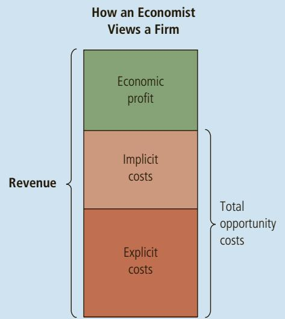
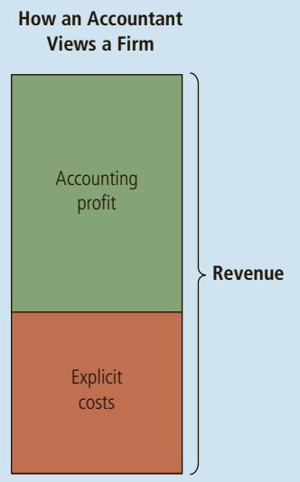
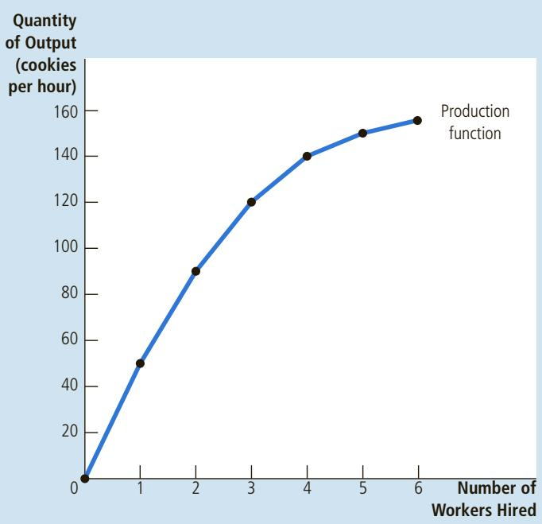
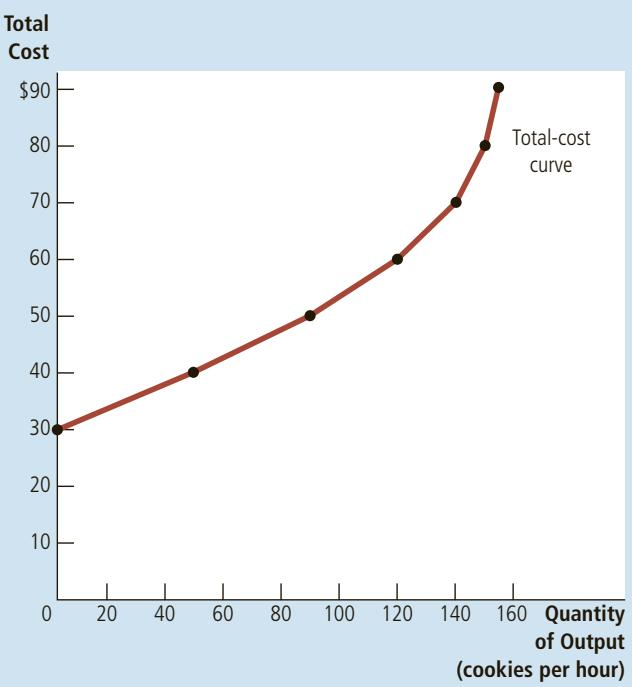
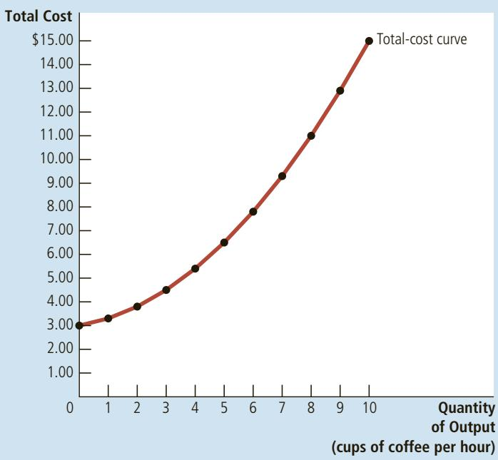
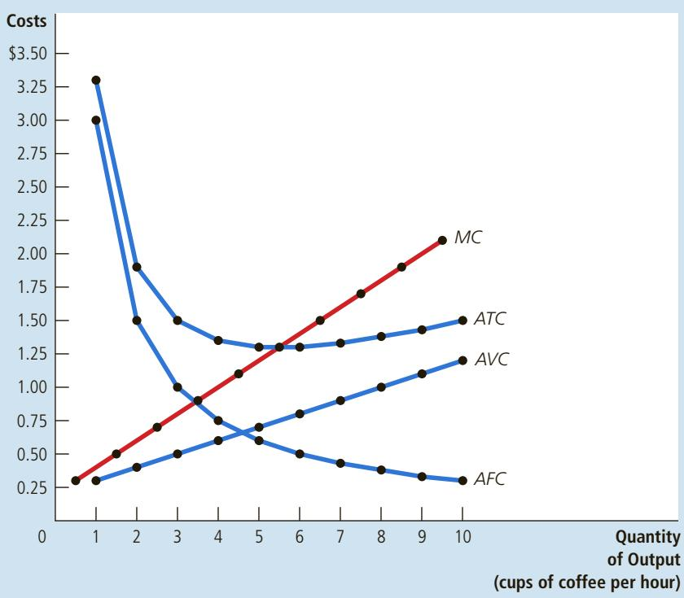
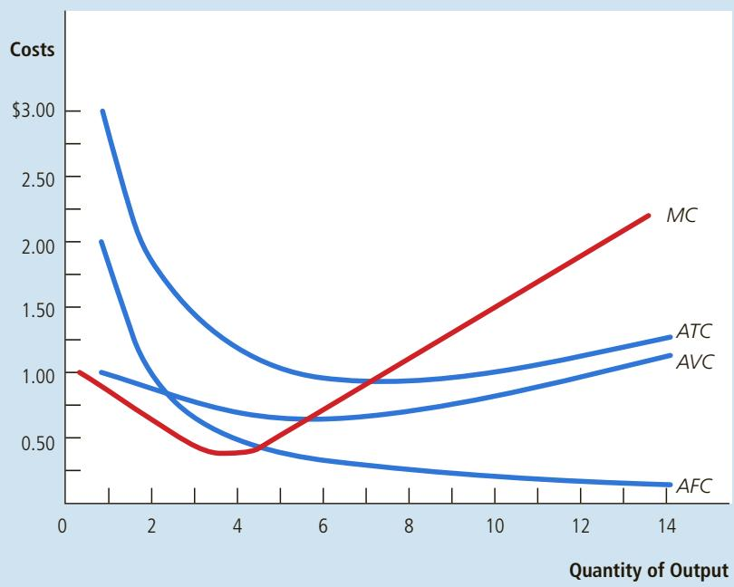
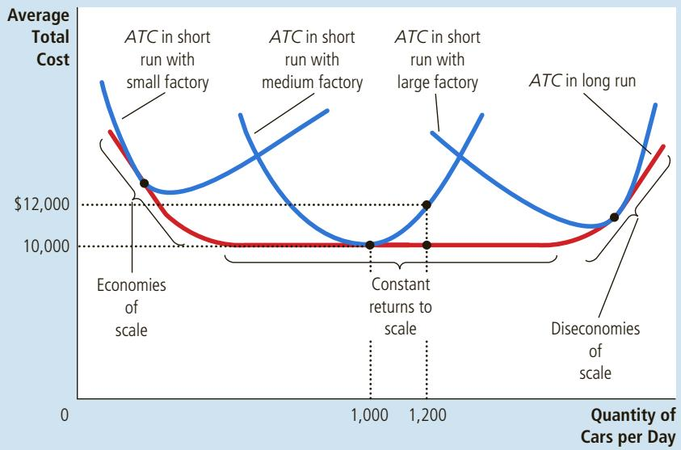

# Firm Behavior and the Organization of Industry

# The Costs of Production

he economy is made up of thousands of firms that produce the goods and services you enjoy every day: General Motors produces automobiles, General Electric produces lightbulbs, and General Mills produces breakfast cereals. Some firms, such as these three, are large; they employ thousands of workers and have thousands of stockholders who share the firms’ profits. Other firms, such as the local barbershop or café, are small; they employ only a few workers and are owned by a single person or family.

In previous chapters, we used the supply curve to summarize firms’ production decisions. According to the law of supply, firms are willing to produce

total revenue the amount a firm receives for the sale of its output

and sell a greater quantity of a good when the price of the good is higher. This response leads to a supply curve that slopes upward. For analyzing many questions, the law of supply is all you need to know about firm behavior.

In this chapter and the ones that follow, we examine firm behavior in more detail. This topic will give you a better understanding of the decisions behind the supply curve. In addition, it will introduce you to a part of economics called industrial organization—the study of how firms’ decisions about prices and quantities depend on the market conditions they face. The town in which you live, for instance, may have several pizzerias but only one cable television company. This raises a key question: How does the number of firms affect the prices in a market and the efficiency of the market outcome? The field of industrial organization addresses exactly this question.

Before turning to these issues, we need to discuss the costs of production. All firms, from Delta Air Lines to your local deli, incur costs while making the goods and services that they sell. As we will see in the coming chapters, a firm’s costs are a key determinant of its production and pricing decisions. In this chapter, we define some of the variables that economists use to measure a firm’s costs, and we consider the relationships among these variables.

A word of warning: This topic is dry and technical. To be honest, one might even call it boring. But this material provides a crucial foundation for the fascinating topics that follow.

## 13-1 What Are Costs?

We begin our discussion of costs at Caroline’s Cookie Factory. Caroline, the owner of the firm, buys flour, sugar, chocolate chips, and other cookie ingredients. She also buys the mixers and ovens and hires workers to run this equipment. She then sells the cookies to consumers. By examining some of the issues that Caroline faces in her business, we can learn some lessons about costs that apply to all firms in an economy.

## 13-1a Total Revenue, Total Cost, and Profit

We begin with the firm’s objective. To understand the decisions a firm makes, we must understand what it is trying to do. Although it is conceivable that Caroline started her firm because of an altruistic desire to provide the world with cookies or, perhaps, out of love for the cookie business, it is more likely that she started the business to make money. Economists normally assume that the goal of a firm is to maximize profit, and they find that this assumption works well in most cases.

total cost the market value of the inputs a firm uses in production

profit total revenue minus total cost

What is a firm’s profit? The amount that the firm receives for the sale of its output (cookies) is called total revenue. The amount that the firm pays to buy inputs (flour, sugar, workers, ovens, and so forth) is called total cost. Caroline gets to keep any revenue that is not needed to cover costs. Profit is a firm’s total revenue minus its total cost:

$$
\text {Profit} = \text {Total revenue} - \text {Total cost}
$$

Caroline’s objective is to make her firm’s profit as large as possible.

To see how a firm goes about maximizing profit, we must consider fully how to measure its total revenue and its total cost. Total revenue is the easy part: It equals the quantity of output the firm produces multiplied by the price at which it sells its output. If Caroline produces 10,000 cookies and sells them at \$2 a cookie, her total revenue is \$20,000. The measurement of a firm’s total cost, however, is more subtle.

## 13-1b Costs as Opportunity Costs

When measuring costs at Caroline’s Cookie Factory or any other firm, it is important to keep in mind one of the Ten Principles of Economics from Chapter 1: The cost of something is what you give up to get it. Recall that the opportunity cost of an item refers to all the things that must be forgone to acquire that item. When economists speak of a firm’s cost of production, they include all the opportunity costs of making its output of goods and services.

While some of a firm’s opportunity costs of production are obvious, others are less so. When Caroline pays \$1,000 for flour, that \$1,000 is an opportunity cost because Caroline can no longer use that \$1,000 to buy something else. Similarly, when Caroline hires workers to make the cookies, the wages she pays are part of the firm’s costs. Because these opportunity costs require the firm to pay out some money, they are called explicit costs. By contrast, some of a firm’s opportunity costs, called implicit costs, do not require a cash outlay. Imagine that Caroline is skilled with computers and could earn \$100 per hour working as a programmer. For every hour that Caroline works at her cookie factory, she gives up \$100 in income, and this forgone income is also part of her costs. The total cost of Caroline’s business is the sum of her explicit and implicit costs.

The distinction between explicit and implicit costs highlights an important difference between how economists and accountants analyze a business. Economists are interested in studying how firms make production and pricing decisions. Because these decisions are based on both explicit and implicit costs, economists include both when measuring a firm’s costs. By contrast, accountants have the job of keeping track of the money that flows into and out of firms. As a result, they measure the explicit costs but usually ignore the implicit costs.

The difference between the methods of economists and accountants is easy to see in the case of Caroline’s Cookie Factory. When Caroline gives up the opportunity to earn money as a computer programmer, her accountant will not count this as a cost of her cookie business. Because no money flows out of the business to pay for this cost, it never shows up on the accountant’s financial statements. An economist, however, will count the forgone income as a cost because it will affect the decisions that Caroline makes in her cookie business. For example, if Caroline’s wage as a computer programmer rises from \$100 to \$500 per hour, she might decide that running her cookie business is too costly. She might choose to shut down the factory so she can take a job as a programmer.

## 13-1c The Cost of Capital as an Opportunity Cost

An important implicit cost of almost every business is the opportunity cost of the financial capital that has been invested in the business. Suppose, for instance, that Caroline used \$300,000 of her savings to buy the cookie factory from its previous owner. If Caroline had instead left this money in a savings account that pays an interest rate of 5 percent, she would have earned \$15,000 per year. To own her cookie factory, therefore, Caroline has given up \$15,000 a year in interest income. This forgone \$15,000 is one of the implicit opportunity costs of Caroline’s business.

As we have already noted, economists and accountants treat costs differently, and this is especially true in their treatment of the cost of capital. An economist views the \$15,000 in interest income that Caroline gives up every year as an implicit cost of her business. Caroline’s accountant, however, will not show this \$15,000 as a cost because no money flows out of the business to pay for it.

To further explore the difference between the methods of economists and accountants, let’s change the example slightly. Suppose now that Caroline did not have the entire \$300,000 to buy the factory but, instead, used \$100,000 of her own savings and borrowed \$200,000 from a bank at an interest rate of 5 percent. Caroline’s accountant, who only measures explicit costs, will now count the \$10,000 interest paid on the bank loan every year as a cost because this amount of money now flows out of the firm. By contrast, according to an economist, the opportunity cost of owning the business is still \$15,000. The opportunity cost equals the interest on the bank loan (an explicit cost of \$10,000) plus the forgone interest on savings (an implicit cost of \$5,000).

## 13-1d Economic Profit versus Accounting Profit

Now let’s return to the firm’s objective: profit. Because economists and accountants measure costs differently, they also measure profit differently. An economist measures a firm’s economic profit as the firm’s total revenue minus all the opportunity costs (explicit and implicit) of producing the goods and services sold. An accountant measures the firm’s accounting profit as the firm’s total revenue minus only the firm’s explicit costs.

accounting profit total revenue minus total explicit cost

Figure 1 summarizes this difference. Notice that because the accountant ignores the implicit costs, accounting profit is usually larger than economic profit. For a business to be profitable from an economist’s standpoint, total revenue must exceed all the opportunity costs, both explicit and implicit.

Economic profit is an important concept because it motivates the firms that supply goods and services. As we will see, a firm making positive economic profit will stay in business. It is covering all its opportunity costs and has some revenue left to reward the firm owners. When a firm is making economic losses (that is, when economic profits are negative), the business owners are failing to earn enough revenue to cover all the costs of production. Unless conditions change,

## FIGURE 1

Economists versus Accountants Economists include all opportunity costs when analyzing a firm, whereas accountants measure only explicit costs. Therefore, economic profit is smaller than accounting profit.

How an Economist Views a Firm

  
How an Accountant Views a Firm

the firm owners will eventually close down the business and exit the industry. To understand business decisions, we need to keep an eye on economic profit.

Farmer McDonald gives banjo lessons for \$20 an hour. One day, he spends QuickQuiz 10 hours planting \$100 worth of seeds on his farm. What opportunity cost has he incurred? What cost would his accountant measure? If these seeds yield \$200 worth of crops, does McDonald earn an accounting profit? Does he earn an economic profit?

## 13-2 Production and Costs

Firms incur costs when they buy inputs to produce the goods and services that they plan to sell. In this section, we examine the link between a firm’s production process and its total cost. Once again, we consider Caroline’s Cookie Factory.

In the analysis that follows, we make an important simplifying assumption: We assume that the size of Caroline’s factory is fixed and that Caroline can vary the quantity of cookies produced only by changing the number of workers she employs. This assumption is realistic in the short run but not in the long run. That is, Caroline cannot build a larger factory overnight, but she could do so over the next year or two. This analysis, therefore, describes the production decisions that Caroline faces in the short run. We examine the relationship between costs and time horizon more fully later in the chapter.

## 13-2a The Production Function

Table 1 shows how the quantity of cookies produced per hour at Caroline’s factory depends on the number of workers. As you can see in columns (1) and (2), if there are no workers in the factory, Caroline produces no cookies.

<table><tr><td>(1)</td><td>(2)</td><td>(3)</td><td>(4)</td><td>(5)</td><td>(6)</td></tr><tr><td>Number of Workers</td><td>Output (quantity of cookies produced per hour)</td><td>Marginal Product of Labor</td><td>Cost of Factory</td><td>Cost of Workers</td><td>Total Cost of Inputs(cost of factory + cost of workers)</td></tr><tr><td>0</td><td>0</td><td></td><td>$30</td><td>$0</td><td>$30</td></tr><tr><td></td><td></td><td>50</td><td></td><td></td><td></td></tr><tr><td>1</td><td>50</td><td></td><td>30</td><td>10</td><td>40</td></tr><tr><td></td><td></td><td>40</td><td></td><td></td><td></td></tr><tr><td>2</td><td>90</td><td></td><td>30</td><td>20</td><td>50</td></tr><tr><td></td><td></td><td>30</td><td></td><td></td><td></td></tr><tr><td>3</td><td>120</td><td></td><td>30</td><td>30</td><td>60</td></tr><tr><td></td><td></td><td>20</td><td></td><td></td><td></td></tr><tr><td>4</td><td>140</td><td></td><td>30</td><td>40</td><td>70</td></tr><tr><td></td><td></td><td>10</td><td></td><td></td><td></td></tr><tr><td>5</td><td>150</td><td></td><td>30</td><td>50</td><td>80</td></tr><tr><td></td><td></td><td>5</td><td></td><td></td><td></td></tr><tr><td>6</td><td>155</td><td></td><td>30</td><td>60</td><td>90</td></tr></table>

## production function the relationship between the quantity of inputs used to make a good and the quantity of output of that good

When there is 1 worker, she produces 50 cookies. When there are 2 workers, she produces 90 cookies and so on. Panel (a) of Figure 2 presents a graph of these two columns of numbers. The number of workers is on the horizontal axis, and the number of cookies produced is on the vertical axis. This relationship between the quantity of inputs (workers) and quantity of output (cookies) is called the production function.

marginal product the increase in output that arises from an additional unit of input

One of the Ten Principles of Economics introduced in Chapter 1 is that rational people think at the margin. As we will see in future chapters, this idea is the key to understanding the decisions a firm makes about how many workers to hire and how much output to produce. To take a step toward understanding these decisions, column (3) in the table gives the marginal product of a worker. The marginal product of any input in the production process is the increase in the quantity of output obtained from one additional unit of that input. When the number of workers goes from 1 to 2, cookie production increases from 50 to 90, so the marginal product of the second worker is 40 cookies. And when the number of

## FIGURE 2

## Caroline’s Production Function and Total-Cost Curve

The production function in panel (a) shows the relationship between the number of workers hired and the quantity of output produced. Here the number of workers hired (on the horizontal axis) is from column (1) in Table 1, and the quantity of output produced (on the vertical axis) is from column (2). The production function gets flatter as the number of workers increases, reflecting diminishing marginal product. The total-cost curve in panel (b) shows the relationship between the quantity of output produced and total cost of production. Here the quantity of output produced (on the horizontal axis) is from column (2) in Table 1, and the total cost (on the vertical axis) is from column (6). The total-cost curve gets steeper as the quantity of output increases because of diminishing marginal product.

(a) Production function  

(b) Total-cost curve  

workers goes from 2 to 3, cookie production increases from 90 to 120, so the marginal product of the third worker is 30 cookies. In the table, the marginal product is shown halfway between two rows because it represents the change in output as the number of workers increases from one level to another.

Notice that as the number of workers increases, the marginal product declines. The second worker has a marginal product of 40 cookies, the third worker has a marginal product of 30 cookies, and the fourth worker has a marginal product of 20 cookies. This property is called diminishing marginal product. At first, when only a few workers are hired, they have easy access to Caroline’s kitchen equipment. As the number of workers increases, additional workers have to share equipment and work in more crowded conditions. Eventually, the kitchen becomes so overcrowded that workers often get in each other’s way. Hence, as more workers are hired, each additional worker contributes fewer additional cookies to total production.

Diminishing marginal product is also apparent in Figure 2. The production function’s slope (“rise over run”) tells us the change in Caroline’s output of cookies (“rise”) for each additional input of labor (“run”). That is, the slope of the production function measures the marginal product. As the number of workers increases, the marginal product declines, and the production function becomes flatter.

## 13-2b From the Production Function to the Total-Cost Curve

Columns (4), (5), and (6) in Table 1 show Caroline’s cost of producing cookies. In this example, the cost of Caroline’s factory is \$30 per hour, and the cost of a worker is \$10 per hour. If she hires 1 worker, her total cost is \$40 per hour. If she hires 2 workers, her total cost is \$50 per hour, and so on. With this information, the table now shows how the number of workers Caroline hires is related to the quantity of cookies she produces and to her total cost of production.

Our goal in the next several chapters is to study firms’ production and pricing decisions. For this purpose, the most important relationship in Table 1 is between quantity produced [in column (2)] and total cost [in column (6)]. Panel (b) of Figure 2 graphs these two columns of data with quantity produced on the horizontal axis and total cost on the vertical axis. This graph is called the total-cost curve.

Now compare the total-cost curve in panel (b) with the production function in panel (a). These two curves are opposite sides of the same coin. The total-cost curve gets steeper as the amount produced rises, whereas the production function gets flatter as production rises. These changes in slope occur for the same reason. High production of cookies means that Caroline’s kitchen is crowded with many workers. Because the kitchen is crowded, each additional worker adds less to production, reflecting diminishing marginal product. Therefore, the production function is relatively flat. But now turn this logic around: When the kitchen is crowded, producing an additional cookie requires a lot of additional labor and is thus very costly. Therefore, when the quantity produced is large, the total-cost curve is relatively steep.

If Farmer Jones plants no seeds on her farm, she gets no harvest. If she QuickQuiz plants 1 bag of seeds, she gets 3 bushels of wheat. If she plants 2 bags, she gets 5 bushels. If she plants 3 bags, she gets 6 bushels. A bag of seeds costs \$100, and seeds are her only cost. Use these data to graph the farmer’s production function and total-cost curve. Explain their shapes.

## 13-3 The Various Measures of Cost

Our analysis of Caroline’s Cookie Factory demonstrated how a firm’s total cost reflects its production function. From data on a firm’s total cost, we can derive several related measures of cost, which will turn out to be useful when we analyze production and pricing decisions in future chapters. To see how these related measures are derived, we consider the example in Table 2. This table presents cost data on Caroline’s neighbor—Conrad’s Coffee Shop.

Column (1) in the table shows the number of cups of coffee that Conrad might produce, ranging from 0 to 10 cups per hour. Column (2) shows Conrad’s total cost of producing coffee. Figure 3 plots Conrad’s total-cost curve. The quantity of coffee [from column (1)] is on the horizontal axis, and total cost [from column (2)] is on the vertical axis. Conrad’s total-cost curve has a shape similar to Caroline’s. In particular, it becomes steeper as the quantity produced rises, which (as we have discussed) reflects diminishing marginal product.

<table><tr><td>(1)</td><td>(2)</td><td>(3)</td><td>(4)</td><td>(5)</td><td>(6)</td><td>(7)</td><td>(8)</td></tr><tr><td>Output (cups of coffee per hour)</td><td>Total Cost</td><td>Fixed Cost</td><td>Variable Cost</td><td>Average Fixed Cost</td><td>Average Variable Cost</td><td>Average Total Cost</td><td>Marginal Cost</td></tr><tr><td>0</td><td>$3.00</td><td>$3.00</td><td>$0.00</td><td>—</td><td>—</td><td>—</td><td>$0.30</td></tr><tr><td>1</td><td>3.30</td><td>3.00</td><td>0.30</td><td>$3.00</td><td>$0.30</td><td>$3.30</td><td>0.50</td></tr><tr><td>2</td><td>3.80</td><td>3.00</td><td>0.80</td><td>1.50</td><td>0.40</td><td>1.90</td><td>0.70</td></tr><tr><td>3</td><td>4.50</td><td>3.00</td><td>1.50</td><td>1.00</td><td>0.50</td><td>1.50</td><td>0.90</td></tr><tr><td>4</td><td>5.40</td><td>3.00</td><td>2.40</td><td>0.75</td><td>0.60</td><td>1.35</td><td>1.10</td></tr><tr><td>5</td><td>6.50</td><td>3.00</td><td>3.50</td><td>0.60</td><td>0.70</td><td>1.30</td><td>1.30</td></tr><tr><td>6</td><td>7.80</td><td>3.00</td><td>4.80</td><td>0.50</td><td>0.80</td><td>1.30</td><td>1.50</td></tr><tr><td>7</td><td>9.30</td><td>3.00</td><td>6.30</td><td>0.43</td><td>0.90</td><td>1.33</td><td>1.70</td></tr><tr><td>8</td><td>11.00</td><td>3.00</td><td>8.00</td><td>0.38</td><td>1.00</td><td>1.38</td><td>1.90</td></tr><tr><td>9</td><td>12.90</td><td>3.00</td><td>9.90</td><td>0.33</td><td>1.10</td><td>1.43</td><td>2.10</td></tr><tr><td>10</td><td>15.00</td><td>3.00</td><td>12.00</td><td>0.30</td><td>1.20</td><td>1.50</td><td></td></tr></table>

## FIGURE 3

## Conrad’s Total-Cost Curve

Here the quantity of output produced (on the horizontal axis) is from column (1) in Table 2, and the total cost (on the vertical axis) is from column (2). As in Figure 2, the total-cost curve gets steeper as the quantity of output increases because of diminishing marginal product.

## 13-3a Fixed and Variable Costs

Conrad’s total cost can be divided into two types. Some costs, called fixed costs, do not vary with the quantity of output produced. They are incurred even if the firm produces nothing at all. Conrad’s fixed costs include any rent he pays because this cost is the same regardless of how much coffee he produces. Similarly, if Conrad needs to hire a full-time bookkeeper to pay bills, regardless of the quantity of coffee produced, the bookkeeper’s salary is a fixed cost. The third column in Table 2 shows Conrad’s fixed cost, which in this example is \$3.00.

fixed costs costs that do not vary with the quantity of output produced

Some of the firm’s costs, called variable costs, change as the firm alters the quantity of output produced. Conrad’s variable costs include the cost of coffee beans, milk, sugar, and paper cups: The more cups of coffee Conrad makes, the more of these items he needs to buy. Similarly, if Conrad has to hire more workers to make more cups of coffee, the salaries of these workers are variable costs. Column (4) in the table shows Conrad’s variable cost. The variable cost is 0 if he produces nothing, \$0.30 if he produces 1 cup of coffee, \$0.80 if he produces 2 cups, and so on.

A firm’s total cost is the sum of fixed and variable costs. In Table 2, total cost in column (2) equals fixed cost in column (3) plus variable cost in column (4).

## 13-3b Average and Marginal Cost

As the owner of his firm, Conrad has to decide how much to produce. One issue he will want to consider when making this decision is how the level of production affects his firm’s costs. Conrad might ask his production supervisor the following two questions about the cost of producing coffee:

• How much does it cost to make the typical cup of coffee?

• How much does it cost to increase production of coffee by 1 cup?

variable costs costs that vary with the quantity of output produced

average variable cost variable cost divided by the quantity of output

marginal cost the increase in total cost that arises from an extra unit of production

These two questions might seem to have the same answer, but they do not. Both answers are important for understanding how firms make production decisions.

To find the cost of the typical unit produced, we divide the firm’s costs by the quantity of output it produces. For example, if the firm produces 2 cups of coffee per hour, its total cost is \$3.80, and the cost of the typical cup is $\$ 3.80/2,$ or \$1.90. Total cost divided by the quantity of output is called average total cost. Because total cost is the sum of fixed and variable costs, average total cost can be expressed as the sum of average fixed cost and average variable cost. Average fixed cost is the fixed cost divided by the quantity of output, and average variable cost is the variable cost divided by the quantity of output.

Average total cost tells us the cost of the typical unit, but it does not tell us how much total cost will change as the firm alters its level of production. Column (8) in Table 2 shows the amount that total cost rises when the firm increases production by 1 unit of output. This number is called marginal cost. For example, if Conrad increases production from 2 to 3 cups, total cost rises from \$3.80 to \$4.50, so the marginal cost of the third cup of coffee is \$4.50 minus \$3.80, or \$0.70. In the table, the marginal cost appears halfway between any two rows because it represents the change in total cost as quantity of output increases from one level to another.

It may be helpful to express these definitions mathematically:

$$
\text {Average total cost} = \text {Total cost / Quantity}
$$

$$
A T C = T C / Q,
$$

and

## Marginal cost 5 Change in total cost/Change in quantity

$$
M C = \Delta T C / \Delta Q
$$

Here ∆, the Greek letter delta, represents the change in a variable. These equations show how average total cost and marginal cost are derived from total cost. Average total cost tells us the cost of a typical unit of output if total cost is divided evenly over all the units produced. Marginal cost tells us the increase in total cost that arises from producing an additional unit of output. As we will see more fully in the next chapter, business managers like Conrad need to keep in mind the concepts of average total cost and marginal cost when deciding how much of their product to supply to the market.

## 13-3c Cost Curves and Their Shapes

Just as we found graphs of supply and demand useful when analyzing the behavior of markets in previous chapters, we will find graphs of average and marginal cost useful when analyzing the behavior of firms. Figure 4 graphs Conrad’s costs using the data from Table 2. The horizontal axis measures the quantity the firm produces, and the vertical axis measures marginal and average costs. The graph shows four curves: average total cost (ATC), average fixed cost (AFC), average variable cost (AVC), and marginal cost (MC).

The cost curves shown here for Conrad’s Coffee Shop have some features that are common to the cost curves of many firms in the economy. Let’s examine three features in particular: the shape of the marginal-cost curve, the shape of the average-total-cost curve, and the relationship between marginal cost and average total cost.

## FIGURE 4

## Conrad’s Average-Cost and Marginal-Cost Curves

This figure shows the average total cost (ATC), average fixed cost (AFC), average variable cost (AVC), and marginal cost (MC) for Conrad’s Coffee Shop. All of these curves are obtained by graphing the data in Table 2. These cost curves show three common features: (1) Marginal cost rises with the quantity of output. (2) The average-total-cost curve is U-shaped. (3) The marginal-cost curve crosses the average-total-cost curve at the minimum of average total cost.

Rising Marginal Cost Conrad’s marginal cost rises as the quantity of output produced increases. This upward slope reflects the property of diminishing marginal product. When Conrad produces a small quantity of coffee, he has few workers, and much of his equipment is not used. Because he can easily put these idle resources to use, the marginal product of an extra worker is large, and the marginal cost of an extra cup of coffee is small. By contrast, when Conrad produces a large quantity of coffee, his shop is crowded with workers, and most of his equipment is fully utilized. Conrad can produce more coffee by adding workers, but these new workers have to work in crowded conditions and may have to wait to use the equipment. Therefore, when the quantity of coffee produced is already high, the marginal product of an extra worker is low, and the marginal cost of an extra cup of coffee is large.

U-Shaped Average Total Cost Conrad’s average-total-cost curve is U-shaped, as shown in Figure 4. To understand why, remember that average total cost is the sum of average fixed cost and average variable cost. Average fixed cost always declines as output rises because the fixed cost is getting spread over a larger number of units. Average variable cost usually rises as output increases because of diminishing marginal product.

Average total cost reflects the shapes of both average fixed cost and average variable cost. At very low levels of output, such as 1 or 2 cups per hour, average total cost is very high. Even though average variable cost is low, average fixed cost is high because the fixed cost is spread over only a few units. As output increases, the fixed cost is spread over more units. Average fixed cost declines, rapidly at first and then more slowly. As a result, average total cost also declines until the firm’s output reaches 5 cups of coffee per hour, when average total cost is \$1.30 per cup. When the firm produces more than 6 cups per hour, however, the increase in average variable cost becomes the dominant force, and average total cost starts rising. The tug of war between average fixed cost and average variable cost generates the U-shape in average total cost.

The bottom of the U-shape occurs at the quantity that minimizes average total cost. This quantity is sometimes called the efficient scale of the firm. For Conrad, the efficient scale is 5 or 6 cups of coffee per hour. If he produces more or less than this amount, his average total cost rises above the minimum of \$1.30. At lower levels of output, average total cost is higher than \$1.30 because the fixed cost is spread over so few units. At higher levels of output, average total cost is higher than \$1.30 because the marginal product of inputs has diminished significantly. At the efficient scale, these two forces are balanced to yield the lowest average total cost.

The Relationship between Marginal Cost and Average Total Cost If you look at Figure 4 (or back at Table 2), you will see something that may be surprising at first. Whenever marginal cost is less than average total cost, average total cost is falling. Whenever marginal cost is greater than average total cost, average total cost is rising. This feature of Conrad’s cost curves is not a coincidence from the particular numbers used in the example: It is true for all firms.

To see why, consider an analogy. Average total cost is like your cumulative grade point average. Marginal cost is like the grade you get in the next course you take. If your grade in your next course is less than your grade point average, your grade point average will fall. If your grade in your next course is higher than your grade point average, your grade point average will rise. The mathematics of average and marginal costs is exactly the same as the mathematics of average and marginal grades.

This relationship between average total cost and marginal cost has an important corollary: The marginal-cost curve crosses the average-total-cost curve at its minimum. Why? At low levels of output, marginal cost is below average total cost, so average total cost is falling. But after the two curves cross, marginal cost rises above average total cost. As a result, average total cost must start to rise at this level of output. Hence, this point of intersection is the minimum of average total cost. As we will see in the next chapter, minimum average total cost plays a key role in the analysis of competitive firms.

## 13-3d Typical Cost Curves

In the examples we have studied so far, the firms have exhibited diminishing marginal product and, therefore, rising marginal cost at all levels of output. This simplifying assumption was useful because it allowed us to focus on the key features of cost curves that are useful in analyzing firm behavior. Yet actual firms are usually more complicated than this. In many firms, marginal product does not start to fall immediately after the first worker is hired. Depending on the production process, the second or third worker might have a higher marginal product than the first because a team of workers can divide tasks and work more productively than a single worker. Firms exhibiting this pattern would experience increasing marginal product for a while before diminishing marginal product set in.

## FIGURE 5

Cost Curves for a Typical Firm Many firms experience increasing marginal product before diminishing marginal product. As a result, they have cost curves shaped like those in this figure. Notice that marginal cost and average variable cost fall for a while before starting to rise.

Figure 5 shows the cost curves for such a firm, including average total cost (ATC), average fixed cost (AFC), average variable cost (AVC), and marginal cost (MC). At low levels of output, the firm experiences increasing marginal product, and the marginal-cost curve falls. Eventually, the firm starts to experience diminishing marginal product, and the marginal-cost curve starts to rise. This combination of increasing then diminishing marginal product also makes the average-variable-cost curve U-shaped.

Despite these differences from our previous example, the cost curves in Figure 5 share the three properties that are most important to remember:

• Marginal cost eventually rises with the quantity of output.

• The average-total-cost curve is U-shaped.

• The marginal-cost curve crosses the average-total-cost curve at the minimum of average total cost.

Suppose Honda’s total cost of producing 4 cars is \$225,000 and its total QuickQuiz cost of producing 5 cars is \$250,000. What is the average total cost of producing 5 cars? What is the marginal cost of the fifth car? • Draw the marginal-cost curve and the average-total-cost curve for a typical firm, and explain why these curves cross where they do.

## 13-4 Costs in the Short Run and in the Long Run

We noted earlier in this chapter that a firm’s costs might depend on the time horizon under consideration. Let’s examine more precisely why this might be the case.

## 13-4a The Relationship between Short-Run and Long-Run Average Total Cost

For many firms, the division of total costs between fixed and variable costs depends on the time horizon. Consider, for instance, a car manufacturer such as Ford Motor Company. Over a period of only a few months, Ford cannot adjust the number or sizes of its car factories. The only way it can produce additional cars is to hire more workers at the factories it already has. The cost of these factories is, therefore, a fixed cost in the short run. By contrast, over a period of several years, Ford can expand the size of its factories, build new factories, or close old ones. Thus, the cost of its factories is a variable cost in the long run.

Because many decisions are fixed in the short run but variable in the long run, a firm’s long-run cost curves differ from its short-run cost curves. Figure 6 shows an example. The figure presents three short-run average-total-cost curves—for a small, medium, and large factory. It also presents the long-run average-total-cost curve. As the firm moves along the long-run curve, it is adjusting the size of the factory to the quantity of production.

This graph shows how short-run and long-run costs are related. The long-run average-total-cost curve has a much flatter U-shape than the short-run averagetotal-cost curve. In addition, all the short-run curves lie on or above the long-run curve. These properties arise because firms have greater flexibility in the long run. In essence, in the long run, the firm gets to choose which short-run curve it wants to use. But in the short run, it has to use whatever short-run curve it has, based on decisions it has made in the past.

The figure shows an example of how a change in production alters costs over different time horizons. When Ford wants to increase production from 1,000 to 1,200 cars per day, it has no choice in the short run but to hire more workers at its existing medium-sized factory. Because of diminishing marginal product, average total cost rises from \$10,000 to \$12,000 per car. In the long run, however, Ford can expand both the size of the factory and its workforce, and average total cost returns to \$10,000.

## FIGURE 6

## Average Total Cost in the Short and Long Runs

Because fixed costs are variable in the long run, the average-total-cost curve in the short run differs from the average-total-cost curve in the long run.

How long does it take a firm to get to the long run? The answer depends on the firm. It can take a year or more for a major manufacturing firm, such as a car company, to build a larger factory. By contrast, a person running a coffee shop can buy another coffee maker within a few days. There is, therefore, no single answer to the question of how long it takes a firm to adjust its production facilities.

## 13-4b Economies and Diseconomies of Scale

The shape of the long-run average-total-cost curve conveys important information about the production processes that a firm has available for manufacturing a good. In particular, it tells us how costs vary with the scale—that is, the size—of a firm’s operations. When long-run average total cost declines as output increases, there are said to be economies of scale. When long-run average total cost rises as output increases, there are said to be diseconomies of scale. When long-run average total cost does not vary with the level of output, there are said to be constant returns to scale. As we can see in Figure 6, Ford has economies of scale at low levels of output, constant returns to scale at intermediate levels of output, and diseconomies of scale at high levels of output.

What might cause economies or diseconomies of scale? Economies of scale often arise because higher production levels allow specialization among workers, which permits each worker to become better at a specific task. For instance, if Ford hires a large number of workers and produces a large number of cars, it can reduce costs using modern assembly-line production. Diseconomies of scale can arise because of coordination problems that are inherent in any large organization. The more cars Ford produces, the more stretched the management team becomes, and the less effective the managers become at keeping costs down.

economies of scale the property whereby long-run average total cost falls as the quantity of output increases

diseconomies of scale the property whereby long-run average total cost rises as the quantity of output increases

constant returns to scale the property whereby long-run average total cost stays the same as the quantity of output changes

FYI
