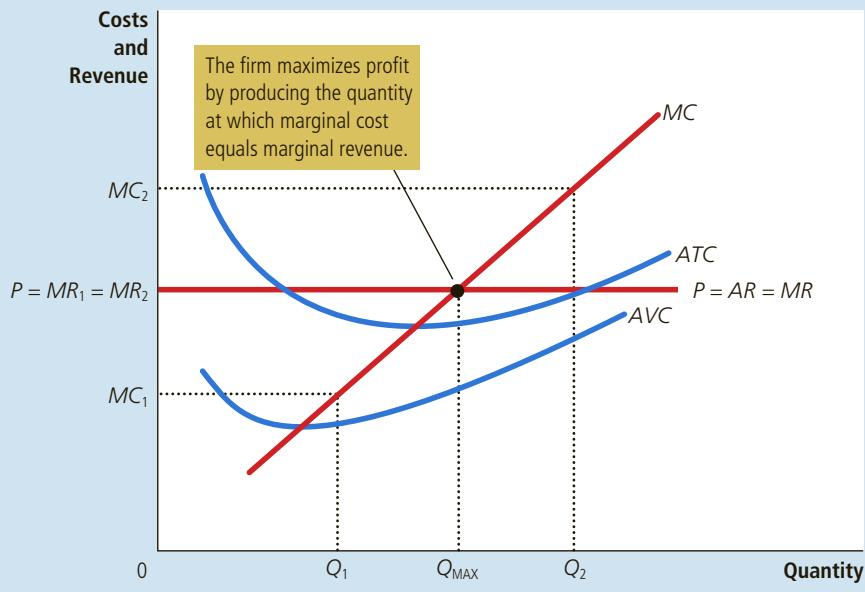
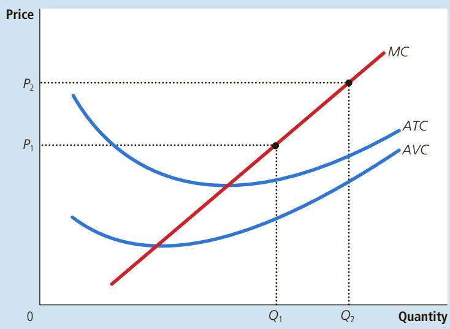

## Lessons from a Pin Factory

ack of all trades, master of none.” This well-known adage sheds light on the nature of cost curves. A person who tries to do everything usually ends up doing nothing very well. If a firm wants its workers to be as productive as they can be, it is often best to give each worker a limited task that she can master. But this organization of work is possible only if a firm employs many workers and produces a large quantity of output.

In his celebrated book An Inquiry into the Nature and Causes of the Wealth of Nations, Adam Smith described a visit he made to a pin factory. Smith was impressed by the specialization among the workers and the resulting economies of scale. He wrote,

One man draws out the wire, another straightens it, a third cuts it, a fourth points it, a fifth grinds it at the top for receiving the head; to make the head requires two or three distinct operations; to put it on is a peculiar business; to whiten it is another; it is even a trade by itself to put them into paper.

Smith reported that because of this specialization, the pin factory produced thousands of pins per worker every day. He conjectured that if the

workers had chosen to work separately, rather than as a team of specialists, “they certainly could not each of them make twenty, perhaps not

one pin a day.” In other words,

because of specialization, a large pin factory could achieve higher output per worker and lower average cost per pin than a small pin factory.

The specialization that Smith observed in the pin factory is prevalent in the modern economy. If you want to build a house, for instance, you could try to do all the work yourself. But most people turn to a builder, who in turn hires carpenters, plumbers, electricians, painters, and many other types of workers. These workers focus their training and experience in particular jobs, and as a result, they become better at their jobs than if they were generalists. Indeed, the use of specialization to achieve economies of scale is one reason modern societies are as prosperous as they are. ■

TABLE 3

This analysis shows why long-run average-total-cost curves are often U-shaped. At low levels of production, the firm benefits from increased size because it can take advantage of greater specialization. Coordination problems, meanwhile, are not yet acute. By contrast, at high levels of production, the benefits of specialization have already been realized, and coordination problems become more severe as the firm grows larger. Thus, long-run average total cost is falling at low levels of production because of increasing specialization and rising at high levels of production because of growing coordination problems.

If Boeing produces 9 jets per month, its long-run total cost is \$9.0 million QuickQuiz per month. If it produces 10 jets per month, its long-run total cost is \$9.5 million per month. Does Boeing exhibit economies or diseconomies of scale?

## 13-5 Conclusion

The purpose of this chapter has been to develop some tools to study how firms make production and pricing decisions. You should now understand what economists mean by the term costs and how costs vary with the quantity of output a firm produces. To refresh your memory, Table 3 summarizes some of the definitions we have encountered.

By themselves, a firm’s cost curves do not tell us what decisions the firm will make. But they are a key component of that decision, as we will see in the next chapter.

<table><tr><td>Term</td><td>Definition</td><td>Mathematical Description</td></tr><tr><td>Explicit costs</td><td>Costs that require an outlay of money by the firm</td><td></td></tr><tr><td>Implicit costs</td><td>Costs that do not require an outlay of money by the firm</td><td></td></tr><tr><td>Fixed costs</td><td>Costs that do not vary with the quantity of output produced</td><td>FC</td></tr><tr><td>Variable costs</td><td>Costs that vary with the quantity of output produced</td><td>VC</td></tr><tr><td>Total cost</td><td>The market value of all the inputs that a firm uses in production</td><td> $TC = FC + VC$ </td></tr><tr><td>Average fixed cost</td><td>Fixed cost divided by the quantity of output</td><td> $AFC = FC / Q$ </td></tr><tr><td>Average variable cost</td><td>Variable cost divided by the quantity of output</td><td> $AVC = VC / Q$ </td></tr><tr><td>Average total cost</td><td>Total cost divided by the quantity of output</td><td> $ATC = TC / Q$ </td></tr><tr><td>Marginal cost</td><td>The increase in total cost that arises from an extra unit of production</td><td> $MC = \Delta TC / \Delta Q$ </td></tr></table>

## CHAPTER QuickQuiz

1. Xavier opens up a lemonade stand for two hours. He spends \$10 for ingredients and sells \$60 worth of lemonade. In the same two hours, he could have mowed his neighbor’s lawn for \$40. Xavier has an accounting profit of \_\_\_\_\_ and an economic profit of

a. \$50, \$10

b. \$90, \$50

c. \$10, \$50

2. Diminishing marginal product explains why, as a firm’s output increases,

d. \$50, \$90

a. the production function and total-cost curve both get steeper.

b. the production function and total-cost curve both get flatter.

c. the production function gets steeper, while the total-cost curve gets flatter.

d. the production function gets flatter, while the total-cost curve gets steeper.

3. A firm is producing 1,000 units at a total cost of \$5,000. If it were to increase production to 1,001 units, its total cost would rise to \$5,008. What does this information tell you about the firm?

4. A firm is producing 20 units with an average total cost of \$25 and a marginal cost of \$15. If it were to increase production to 21 units, which of the following must occur?

a. Marginal cost is \$5, and average variable cost is \$8.

b. Marginal cost is \$8, and average variable cost is \$5.

c. Marginal cost is \$5, and average total cost is \$8.

d. Marginal cost is \$8, and average total cost is \$5.

b. Marginal cost would increase.

a. Marginal cost would decrease.

c. Average total cost would decrease.

d. Average total cost would increase.

5. The government imposes a \$1,000 per year license fee on all pizza restaurants. As a result, which cost curves shift? a. average total cost and marginal cost b. average total cost and average fixed cost c. average variable cost and marginal cost d. average variable cost and average fixed cost

6. If a higher level of production allows workers to specialize in particular tasks, a firm will likely exhibit of scale and average total cost.

a. economies, falling

b. economies, rising

c. diseconomies, falling

d. diseconomies, rising

## SUMMARY

The goal of firms is to maximize profit, which equals total revenue minus total cost.

When analyzing a firm’s behavior, it is important to include all the opportunity costs of production. Some of the opportunity costs, such as the wages a firm pays its workers, are explicit. Other opportunity costs, such as the wages the firm owner gives up by working at the firm rather than taking another job, are implicit. Economic profit takes both explicit and implicit costs into account, whereas accounting profit considers only explicit costs.

A firm’s costs reflect its production process. A typical firm’s production function gets flatter as the quantity of an input increases, displaying the property of diminishing marginal product. As a result, a firm’s total-cost curve gets steeper as the quantity produced rises.

A firm’s total costs can be divided into fixed costs and variable costs. Fixed costs are costs that do not change when the firm alters the quantity of output produced.

Variable costs are costs that change when the firm alters the quantity of output produced.

From a firm’s total cost, two related measures of cost are derived. Average total cost is total cost divided by the quantity of output. Marginal cost is the amount by which total cost rises if output increases by 1 unit.

When analyzing firm behavior, it is often useful to graph average total cost and marginal cost. For a typical firm, marginal cost rises with the quantity of output. Average total cost first falls as output increases and then rises as output increases further. The marginal-cost curve always crosses the averagetotal-cost curve at the minimum of average total cost.

A firm’s costs often depend on the time horizon considered. In particular, many costs are fixed in the short run but variable in the long run. As a result, when the firm changes its level of production, average total cost may rise more in the short run than in the long run.

## KEY CONCEPTS

total revenue, p. 248 total cost, p. 248 profit, p. 248 explicit costs, p. 249 implicit costs, p. 249 economic profit, p. 250 accounting profit, p. 250 average variable cost, p. 256 marginal cost, p. 256 efficient scale, p. 258 economies of scale, p. 261 diseconomies of scale, p. 261 constant returns to scale, p. 261

## QUESTIONS FOR REVIEW

1. What is the relationship between a firm’s total revenue, profit, and total cost?

2. Give an example of an opportunity cost that an accountant would not count as a cost. Why would the accountant ignore this cost?

3. What is marginal product, and what does it mean if it is diminishing?

4. Draw a production function that exhibits diminishing marginal product of labor. Draw the associated total-cost curve. (In both cases, be sure to label the axes.) Explain the shapes of the two curves you have drawn.

5. Define total cost, average total cost, and marginal cost. How are they related?

6. Draw the marginal-cost and average-total-cost curves for a typical firm. Explain why the curves have the shapes that they do and why they intersect where they do.

7. How and why does a firm’s average-total-cost curve differ in the short run compared with the long run?

8. Define economies of scale and explain why they might arise. Define diseconomies of scale and explain why they might arise.

## PROBLEMS AND APPLICATIONS

1. This chapter discusses many types of costs: opportunity cost, total cost, fixed cost, variable cost, average total cost, and marginal cost. Fill in the type of cost that best completes each sentence:

a. What you give up in taking some action is called the

b. is falling when marginal cost is below it and rising when marginal cost is above it.

c. A cost that does not depend on the quantity produced is a(n)

d. In the ice-cream industry in the short run, includes the cost of cream and sugar but not the cost of the factory.

e. Profits equal total revenue minus

f. The cost of producing an extra unit of output is the

2. Your aunt is thinking about opening a hardware store. She estimates that it would cost \$500,000 per year to rent the location and buy the stock. In addition, she would have to quit her \$50,000 per year job as an accountant.

a. Define opportunity cost.

b. What is your aunt’s opportunity cost of running the hardware store for a year? If your aunt thinks she can sell \$510,000 worth of merchandise in a year, should she open the store? Explain.

3. A commercial fisherman notices the following relationship between hours spent fishing and the quantity of fish caught:

<table><tr><td>Hours</td><td>Quantity of Fish (in pounds)</td></tr><tr><td>0 hours</td><td>0 lb.</td></tr><tr><td>1</td><td>10</td></tr><tr><td>2</td><td>18</td></tr><tr><td>3</td><td>24</td></tr><tr><td>4</td><td>28</td></tr><tr><td>5</td><td>30</td></tr></table>

a. What is the marginal product of each hour spent fishing?

b. Use these data to graph the fisherman’s production function. Explain its shape.

c. The fisherman has a fixed cost of \$10 (his pole). The opportunity cost of his time is \$5 per hour. Graph the fisherman’s total-cost curve. Explain its shape.

4. Nimbus, Inc., makes brooms and then sells them doorto-door. Here is the relationship between the number of workers and Nimbus’s output during a given day:

<table><tr><td>Workers</td><td>Output</td><td>Marginal Product</td><td>Total Cost</td><td>Average Total Cost</td><td>Marginal Cost</td></tr><tr><td>0</td><td>0</td><td></td><td>—</td><td>—</td><td></td></tr><tr><td>1</td><td>20</td><td>—</td><td>—</td><td>—</td><td>—</td></tr><tr><td>2</td><td>50</td><td>—</td><td>—</td><td>—</td><td>—</td></tr><tr><td>3</td><td>90</td><td>—</td><td>—</td><td>—</td><td>—</td></tr><tr><td>4</td><td>120</td><td>—</td><td>—</td><td>—</td><td>—</td></tr><tr><td>5</td><td>140</td><td>—</td><td>—</td><td>—</td><td>—</td></tr><tr><td>6</td><td>150</td><td>—</td><td>—</td><td>—</td><td>—</td></tr><tr><td>7</td><td>155</td><td>—</td><td>—</td><td>—</td><td>—</td></tr></table>

a. Fill in the column of marginal products. What pattern do you see? How might you explain it?

b. A worker costs \$100 a day, and the firm has fixed costs of \$200. Use this information to fill in the column for total cost.

c. Fill in the column for average total cost. (Recall that ATC 5 TC/Q.) What pattern do you see?

d. Now fill in the column for marginal cost. (Recall that MC 5 ∆TC/∆Q.) What pattern do you see?

e. Compare the column for marginal product with the column for marginal cost. Explain the relationship.

f. Compare the column for average total cost with the column for marginal cost. Explain the relationship.

5. You are the chief financial officer for a firm that sells digital music players. Your firm has the following average-total-cost schedule:

<table><tr><td>Quantity</td><td>Average Total Cost</td></tr><tr><td>600 players</td><td>$300</td></tr><tr><td>601</td><td>301</td></tr></table>

Your current level of production is 600 devices, all of which have been sold. Someone calls, desperate to buy one of your music players. The caller offers you \$550 for it. Should you accept the offer? Why or why not?

6. Consider the following cost information for a pizzeria:

<table><tr><td>Quantity</td><td>Total Cost</td><td>Variable Cost</td></tr><tr><td>0 dozen pizzas</td><td>$300</td><td>$ 0</td></tr><tr><td>1</td><td>350</td><td>50</td></tr><tr><td>2</td><td>390</td><td>90</td></tr><tr><td>3</td><td>420</td><td>120</td></tr><tr><td>4</td><td>450</td><td>150</td></tr><tr><td>5</td><td>490</td><td>190</td></tr><tr><td>6</td><td>540</td><td>240</td></tr></table>

a. What is the pizzeria’s fixed cost?

b. Construct a table in which you calculate the marginal cost per dozen pizzas using the information on total cost. Also, calculate the marginal cost per dozen pizzas using the information on variable cost. What is the relationship between these sets of numbers? Explain.

7. Your cousin Vinnie owns a painting company with fixed costs of \$200 and the following schedule for variable costs:

<table><tr><td>Quantity of Houses Painted per Month</td><td>1</td><td>2</td><td>3</td><td>4</td><td>5</td><td>6</td><td>7</td></tr><tr><td>Variable Costs</td><td>$10</td><td>$20</td><td>$40</td><td>$80</td><td>$160</td><td>$320</td><td>$640</td></tr></table>

Calculate average fixed cost, average variable cost, and average total cost for each quantity. What is the efficient scale of the painting company?

8. The city government is considering two tax proposals:

• A lump-sum tax of \$300 on each producer of hamburgers.

• A tax of \$1 per burger, paid by producers of hamburgers.

a. Which of the following curves—average fixed cost, average variable cost, average total cost, and marginal cost—would shift as a result of the lump-sum tax? Why? Show this in a graph. Label the graph as precisely as possible.

b. Which of these same four curves would shift as a result of the per-burger tax? Why? Show this in a new graph. Label the graph as precisely as possible.

9. Jane’s Juice Bar has the following cost schedules:

<table><tr><td>Quantity</td><td>Variable Cost</td><td>Total Cost</td></tr><tr><td>0 vats of juice</td><td>$ 0</td><td>$ 30</td></tr><tr><td>1</td><td>10</td><td>40</td></tr><tr><td>2</td><td>25</td><td>55</td></tr><tr><td>3</td><td>45</td><td>75</td></tr><tr><td>4</td><td>70</td><td>100</td></tr><tr><td>5</td><td>100</td><td>130</td></tr><tr><td>6</td><td>135</td><td>165</td></tr></table>

a. Calculate average variable cost, average total cost, and marginal cost for each quantity.

b. Graph all three curves. What is the relationship between the marginal-cost curve and the average-total-cost curve? Between the marginal-cost curve and the average-variablecost curve? Explain.

10. Consider the following table of long-run total costs for three different firms:

<table><tr><td>Quantity</td><td>1</td><td>2</td><td>3</td><td>4</td><td>5</td><td>6</td><td>7</td></tr><tr><td>Firm A</td><td>$60</td><td>$70</td><td>$80</td><td>$90</td><td>$100</td><td>$110</td><td>$120</td></tr><tr><td>Firm B</td><td>11</td><td>24</td><td>39</td><td>56</td><td>75</td><td>96</td><td>119</td></tr><tr><td>Firm C</td><td>21</td><td>34</td><td>49</td><td>66</td><td>85</td><td>106</td><td>129</td></tr></table>

Does each of these firms experience economies of scale or diseconomies of scale?

To find additional study resources, visit cengagebrain.com, and search for “Mankiw.”

f your local gas station raised its price for gasoline by 20 percent, it would see a large drop in the amount of gasoline it sold. Its customers would quickly switch to buying their gasoline at other gas stations. By contrast, if your local water company raised the price of water by 20 percent, it would see only a small decrease in the amount of water it sold. People might water their lawns less often and buy more water-efficient showerheads, but they would be hard-pressed to reduce water consumption greatly or to find another supplier. The difference between the gasoline market and the water market is that many firms supply gasoline to the local market, but only one firm supplies water. As you might expect, this difference in market structure shapes the pricing and production decisions of the firms that operate in these markets.

In this chapter, we examine the behavior of competitive firms, such as your local gas station. You may recall that a market is competitive if each buyer and seller is small compared to the size of the market and, therefore, has little ability to influence market prices. By contrast, if a firm can influence the market price of the good it sells, it is said to have market power. Later in the book, we examine the behavior of firms with market power, such as your local water company.

Our analysis of competitive firms in this chapter sheds light on the decisions that lie behind the supply curve in a competitive market. Not surprisingly, we find that a market supply curve is tightly linked to firms’ costs of production. Less obvious, however, is the question of which among a firm’s many types of cost—fixed, variable, average, and marginal—are most relevant for its supply decisions. We see that all these measures of cost play important and interrelated roles.

## 14-1 What Is a Competitive Market?

Our goal in this chapter is to examine how firms make production decisions in competitive markets. As a background for this analysis, we begin by reviewing what a competitive market is.

competitive market a market with many buyers and sellers trading identical products so that each buyer and seller is a price taker

## 14-1a The Meaning of Competition

A competitive market, sometimes called a perfectly competitive market, has two characteristics:

• There are many buyers and many sellers in the market.

• The goods offered by the various sellers are largely the same.

As a result of these conditions, the actions of any single buyer or seller in the market have a negligible impact on the market price. Each buyer and seller takes the market price as given.

As an example, consider the market for milk. No single consumer of milk can influence the price of milk because each buys a small amount relative to the size of the market. Similarly, each dairy farmer has limited control over the price because many other sellers are offering milk that is essentially identical. Because each seller can sell all he wants at the going price, he has little reason to charge less, and if he charges more, buyers will go elsewhere. Buyers and sellers in competitive markets must accept the price the market determines and, therefore, are said to be price takers.

In addition to the previous two conditions for competition, a third condition is sometimes thought to characterize perfectly competitive markets:

• Firms can freely enter or exit the market.

If, for instance, anyone can start a dairy farm, and if any existing dairy farmer can leave the dairy business, then the dairy industry satisfies this condition. Much of the analysis of competitive firms does not require the assumption of free entry and exit because this condition is not necessary for firms to be price takers. Yet, as we see later in this chapter, when there is free entry and exit in a competitive market, it is a powerful force shaping the long-run equilibrium.

## 14-1b The Revenue of a Competitive Firm

A firm in a competitive market, like most other firms in the economy, tries to maximize profit (total revenue minus total cost). To see how it does this, we first consider the revenue of a competitive firm. To keep matters concrete, let’s consider a specific firm: the Vaca Family Dairy Farm.

The Vaca Farm produces a quantity of milk, Q, and sells each unit at the market price, P. The farm’s total revenue is $\mathbf { \bar { \mathit { P } } } \times \mathbf { \mathit { Q } }$ . For example, if a gallon of milk sells for \$6 and the farm sells 1,000 gallons, its total revenue is \$6,000.

Because the Vaca Farm is small compared to the world market for milk, it takes the price as given by market conditions. This means, in particular, that the price of milk does not depend on the number of gallons that the Vaca Farm produces and sells. If the Vacas double the amount of milk they produce to 2,000 gallons, the price of milk remains the same, and their total revenue doubles to \$12,000. As a result, total revenue is proportional to the amount of output.

Table 1 shows the revenue for the Vaca Family Dairy Farm. Columns (1) and (2) show the amount of output the farm produces and the price at which it sells its output. Column (3) is the farm’s total revenue. The table assumes that the price of milk is \$6 a gallon, so total revenue is \$6 times the number of gallons.

Just as the concepts of average and marginal were useful in the preceding chapter when analyzing costs, they are also useful when analyzing revenue. To see what these concepts tell us, consider these two questions:

• How much revenue does the farm receive for the typical gallon of milk?

• How much additional revenue does the farm receive if it increases production of milk by 1 gallon?

Columns (4) and (5) in Table 1 answer these questions.

<table><tr><td>(1)Quantity(Q)</td><td>(2)Price(P)</td><td>(3)Total Revenue( $TR = P \times Q$ )</td><td>(4)Average Revenue( $AR = TR / Q$ )</td><td>(5)Marginal Revenue( $MR = \Delta TR / \Delta Q$ )</td></tr><tr><td>1 gallon</td><td>$6</td><td>$6</td><td>$6</td><td></td></tr><tr><td>2</td><td>6</td><td>12</td><td>6</td><td>$6</td></tr><tr><td>3</td><td>6</td><td>18</td><td>6</td><td>6</td></tr><tr><td>4</td><td>6</td><td>24</td><td>6</td><td>6</td></tr><tr><td>5</td><td>6</td><td>30</td><td>6</td><td>6</td></tr><tr><td>6</td><td>6</td><td>36</td><td>6</td><td>6</td></tr><tr><td>7</td><td>6</td><td>42</td><td>6</td><td>6</td></tr><tr><td>8</td><td>6</td><td>48</td><td>6</td><td></td></tr></table>

Column (4) in the table shows average revenue, which is total revenue [from column (3)] divided by the amount of output [from column (1)]. Average revenue tells us how much revenue a firm receives for the typical unit sold. In Table 1, you can see that average revenue equals \$6, the price of a gallon of milk. This illustrates a general lesson that applies not only to competitive firms but to other firms as well. Average revenue is total revenue $( P \times \bar { Q } )$ divided by the quantity (Q). Therefore, for all types of firms, average revenue equals the price of the good.

Column (5) shows marginal revenue, which is the change in total revenue from the sale of each additional unit of output. In Table 1, marginal revenue equals \$6, the price of a gallon of milk. This result illustrates a lesson that applies only to competitive firms. Total revenue is $P \times Q$ , and P is fixed for a competitive firm. Therefore, when Q rises by 1 unit, total revenue rises by P dollars. For competitive firms, marginal revenue equals the price of the good.

When a competitive firm doubles the amount it sells, what happens to the price of its output and its total revenue?

## 14-2 Profit Maximization and the Competitive Firm’s Supply Curve

The goal of a firm is to maximize profit, which equals total revenue minus total cost. We have just discussed the competitive firm’s revenue, and in the preceding chapter, we discussed the firm’s costs. We are now ready to examine how a competitive firm maximizes profit and how that decision determines its supply curve.

## 14-2a A Simple Example of Profit Maximization

Let’s begin our analysis of the firm’s supply decision with the example in Table 2. Column (1) in the table shows the number of gallons of milk the Vaca Family Dairy Farm produces. Column (2) shows the farm’s total revenue, which is \$6 times the number of gallons. Column (3) shows the farm’s total cost. Total cost includes fixed costs, which are \$3 in this example, and variable costs, which depend on the quantity produced.

Column (4) shows the farm’s profit, which is computed by subtracting total cost from total revenue. If the farm produces nothing, it has a loss of \$3 (its fixed cost). If it produces 1 gallon, it has a profit of \$1. If it produces 2 gallons, it has a profit of \$4 and so on. Because the Vaca family’s goal is to maximize profit, it chooses to produce the quantity of milk that makes profit as large as possible. In this example, profit is maximized when the farm produces either 4 or 5 gallons of milk, for a profit of \$7.

There is another way to look at Vaca Farm’s decision: The Vacas can find the profit-maximizing quantity by comparing the marginal revenue and marginal cost from each unit produced. Columns (5) and (6) in Table 2 compute marginal revenue and marginal cost from the changes in total revenue and total cost, and column (7) shows the change in profit for each additional gallon produced. The first gallon of milk the farm produces has a marginal revenue of \$6 and a marginal cost of \$2; hence, producing that gallon increases profit by \$4 (from 2\$3 to \$1). The second gallon produced has a marginal revenue of \$6 and a marginal cost of \$3, so that gallon increases profit by \$3 (from \$1 to \$4). As long as marginal revenue exceeds marginal cost, increasing the quantity produced raises profit. Once the Vaca Farm has reached 5 gallons of milk, however, the situation changes. The sixth gallon would have a marginal revenue of \$6 and a marginal cost of \$7, so producing it would reduce profit by \$1 (from \$7 to \$6). As a result, the Vacas would not produce beyond 5 gallons.

<table><tr><td>(1)</td><td>(2)</td><td>(3)</td><td>(4)</td><td>(5)</td><td>(6)</td><td>(7)</td></tr><tr><td>Quantity (Q)</td><td>Total Revenue (TR)</td><td>Total Cost (TC)</td><td>Profit (TR - TC)</td><td>Marginal Revenue (MR =  $\Delta TR / \Delta Q$ )</td><td>Marginal Cost (MC =  $\Delta TR / \Delta Q$ )</td><td>Change in Profit (MR - MC)</td></tr><tr><td>0 gallons</td><td>$ 0</td><td>$ 3</td><td>-$3</td><td></td><td></td><td></td></tr><tr><td></td><td></td><td></td><td></td><td>$6</td><td>$2</td><td>$4</td></tr><tr><td>1</td><td>6</td><td>5</td><td>1</td><td></td><td></td><td></td></tr><tr><td></td><td></td><td></td><td></td><td>6</td><td>3</td><td>3</td></tr><tr><td>2</td><td>12</td><td>8</td><td>4</td><td></td><td></td><td></td></tr><tr><td></td><td></td><td></td><td></td><td>6</td><td>4</td><td>2</td></tr><tr><td>3</td><td>18</td><td>12</td><td>6</td><td></td><td></td><td></td></tr><tr><td></td><td></td><td></td><td></td><td>6</td><td>5</td><td>1</td></tr><tr><td>4</td><td>24</td><td>17</td><td>7</td><td></td><td></td><td></td></tr><tr><td></td><td></td><td></td><td></td><td>6</td><td>6</td><td>0</td></tr><tr><td>5</td><td>30</td><td>23</td><td>7</td><td></td><td></td><td></td></tr><tr><td></td><td></td><td></td><td></td><td>6</td><td>7</td><td>-1</td></tr><tr><td>6</td><td>36</td><td>30</td><td>6</td><td></td><td></td><td></td></tr><tr><td></td><td></td><td></td><td></td><td>6</td><td>8</td><td>-2</td></tr><tr><td>7</td><td>42</td><td>38</td><td>4</td><td></td><td></td><td></td></tr><tr><td></td><td></td><td></td><td></td><td>6</td><td>9</td><td>-3</td></tr><tr><td>8</td><td>48</td><td>47</td><td>1</td><td></td><td></td><td></td></tr></table>

One of the Ten Principles of Economics in Chapter 1 is that rational people think at the margin. We now see how the Vaca Family Dairy Farm can apply this principle. If marginal revenue is greater than marginal cost—as it is at 1, 2, and 3 gallons—the Vacas should increase the production of milk because it will put more money in their pockets (marginal revenue) than it takes out (marginal cost). If marginal revenue is less than marginal cost—as it is at 6, 7, and 8 gallons— the Vacas should decrease production. If the Vacas think at the margin and make incremental adjustments to the level of production, they end up producing the profit-maximizing quantity.

## 14-2b The Marginal-Cost Curve and the Firm’s Supply Decision

To extend this analysis of profit maximization, consider the cost curves in Figure 1. These cost curves have the three features that, as we discussed in the previous chapter, are thought to describe most firms: The marginal-cost curve (MC) is upward-sloping. The average-total-cost curve (ATC) is U-shaped. And the marginal-cost curve crosses the average-total-cost curve at the minimum of average total cost. The figure also shows a horizontal line at the market price (P). The price line is horizontal because a competitive firm is a price taker: The price

## FIGURE 1

Profit Maximization for a Competitive Firm

This figure shows the marginal-cost curve (MC), the average-total-cost curve (ATC), and the average-variable-cost curve (AVC). It also shows the market price $( P ) ,$ which for a competitive firm equals both marginal revenue (MR) and average revenue (AR). At the quantity $Q _ { 1 }$ marginal revenue $M R _ { \mathfrak { I } }$ exceeds marginal cost $M C _ { 1 } ,$ so raising production increases profit. At the quantity $Q _ { 2 } ,$ marginal cost $M C _ { 2 }$ is above marginal revenue $M R _ { 2 } ,$ so reducing production increases profit. The profit-maximizing quantity $Q _ { \mathrm { { M A X } } }$ is found where the horizontal line representing the price intersects the marginal-cost curve.

of the firm’s output is the same regardless of the quantity that the firm decides to produce. Keep in mind that, for a competitive firm, the price equals both the firm’s average revenue (AR) and its marginal revenue (MR).

We can use Figure 1 to find the quantity of output that maximizes profit. Imagine that the firm is producing at $Q _ { 1 }$ . At this level of output, the marginal-revenue curve is above the marginal-cost curve, showing that marginal revenue is greater than marginal cost. This means that if the firm were to raise production by 1 unit, the additional revenue $( M R _ { 1 } )$ would exceed the additional cost $( M C _ { 1 } )$ . Profit, which equals total revenue minus total cost, would increase. Hence, if marginal revenue is greater than marginal cost, as it is at $Q _ { 1 } .$ , the firm can increase profit b increasing production.

A similar argument applies when output is at $Q _ { 2 } .$ . In this case, the marginal-cost curve is above the marginal-revenue curve, showing that marginal cost is greater than marginal revenue. If the firm were to reduce production by 1 unit, the costs saved $( M \bar { C } _ { 2 } )$ would exceed the revenue lost $( M R _ { 2 } )$ . Therefore, if marginal revenue is less than marginal cost, as it is at $Q _ { 2 ^ { \prime } }$ the firm can increase profit by reducing production.

Where do these marginal adjustments to production end? Regardless of whether the firm begins with production at a low level (such as $Q _ { 1 } )$ or at a high level (such as $Q _ { 2 } )$ , the firm will eventually adjust production until the quantity produced reaches $Q _ { \mathrm { M A X } } .$ This analysis yields three general rules for profit maximization:

• If marginal revenue is greater than marginal cost, the firm should increase its output.

• If marginal cost is greater than marginal revenue, the firm should decrease its output.

• At the profit-maximizing level of output, marginal revenue and marginal cost are exactly equal.

These rules are the key to rational decision making by any profit-maximizing firm. They apply not only to competitive firms but, as we will see in the next chapter, to other types of firms as well.

We can now see how the competitive firm decides what quantity of its good to supply to the market. Because a competitive firm is a price taker, its marginal revenue equals the market price. For any given price, the competitive firm’s profit-maximizing quantity of output is found by looking at the intersection of the price with the marginal-cost curve. In Figure 1, that quantity of output is $Q _ { \mathrm { M A X } } .$

Suppose that the price prevailing in this market rises, perhaps because of an increase in market demand. Figure 2 shows how a competitive firm responds to the price increase. When the price is $P _ { 1 } ,$ the firm produces quantity $Q _ { 1 ^ { \prime } }$ the quantity that equates marginal cost to the price. When the price rises to $P _ { 2 ^ { \prime } }$ the firm finds that marginal revenue is now higher than marginal cost at the previous level of output, so the firm increases production. The new profit-maximizing quantity is $Q _ { 2 ^ { \prime } }$ at which marginal cost equals the new, higher price. In essence, because the firm’s marginal-cost curve determines the quantity of the good the firm is willing to supply at any price, the marginal-cost curve is also the competitive firm’s supply curve. There are, however, some caveats to this conclusion, which we examine next.

## 14-2c The Firm’s Short-Run Decision to Shut Down

So far, we have been analyzing the question of how much a competitive firm will produce. In certain circumstances, however, the firm will decide to shut down and not produce anything at all.

## FIGURE 2

## Marginal Cost as the Competitive Firm’s Supply Curve

An increase in the price from $P _ { 1 }$ to $P _ { 2 }$ leads to an increase in the firm’s profit-maximizing quantity from $Q _ { 1 }$ to $Q _ { 2 }$ . Because the marginal-cost curve shows the quantity supplied by the firm at any given price, it is the firm’s supply curve.

Here we need to distinguish between a temporary shutdown of a firm and the permanent exit of a firm from the market. A shutdown refers to a short-run decision not to produce anything during a specific period of time because of current market conditions. Exit refers to a long-run decision to leave the market. The short-run and long-run decisions differ because most firms cannot avoid their fixed costs in the short run but can do so in the long run. That is, a firm that shuts down temporarily still has to pay its fixed costs, whereas a firm that exits the market does not have to pay any costs at all, fixed or variable.

For example, consider the production decision that a farmer faces. The cost of the land is one of the farmer’s fixed costs. If the farmer decides not to produce any crops one season, the land lies fallow, and he cannot recover this cost. When making the short-run decision of whether to shut down for a season, the fixed cost of land is said to be a sunk cost. By contrast, if the farmer decides to leave farming altogether, he can sell the land. When making the long-run decision of whether to exit the market, the cost of land is not sunk. (We return to the issue of sunk costs shortly.)

Now let’s consider what determines a firm’s shutdown decision. If the firm shuts down, it loses all revenue from the sale of its product. At the same time, it saves the variable costs of making its product (but must still pay the fixed costs). Thus, the firm shuts down if the revenue that it would earn from producing is less than its variable costs of production.

A bit of mathematics can make this shutdown rule more useful. If TR stands for total revenue and VC stands for variable cost, then the firm’s decision can be written as

$$
\text { Shut   down   if } T R <   V C.
$$

The firm shuts down if total revenue is less than variable cost. By dividing both sides of this inequality by the quantity Q, we can write it as

$$
\text { Shut   down   if } T R / Q <   V C / Q.
$$

The left side of the inequality, $T R / Q ,$ is total revenue $P \times Q$ divided by quantity Q, which is average revenue, most simply expressed as the good’s price, P. The right side of the inequality, $V C / Q ,$ is average variable cost, AVC. Therefore, the firm’s shutdown rule can be restated as
