## Shut down if P , AVC.

That is, a firm chooses to shut down if the price of the good is less than the average variable cost of production. This rule is intuitive: When choosing to produce, the firm compares the price it receives for the typical unit to the average variable cost that it must incur to produce the typical unit. If the price doesn’t cover the average variable cost, the firm is better off stopping production altogether. The firm still loses money (because it has to pay fixed costs), but it would lose even more money by staying open. The firm can reopen in the future if conditions change so that price exceeds average variable cost.

We now have a full description of a competitive firm’s profit-maximizing strategy. If the firm produces anything, it produces the quantity at which marginal cost equals the good’s price, which the firm takes as given. Yet if the price is less than average variable cost at that quantity, the firm is better off shutting down temporarily and not producing anything. These results are illustrated in Figure 3. The competitive firm’s short-run supply curve is the portion of its marginal-cost curve that lies above average variable cost.

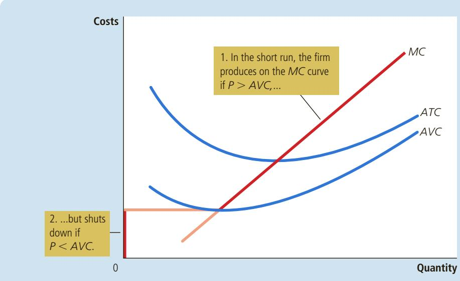

## FIGURE 3

The Competitive Firm’s Short-Run Supply Curve In the short run, the competitive firm’s supply curve is its marginal-cost curve (MC) above average variable cost (AVC). If the price falls below average variable cost, the firm is better off shutting down temporarily.

## 14-2d Spilt Milk and Other Sunk Costs

Sometime in your life you may have been told, “Don’t cry over spilt milk,” or “Let bygones be bygones.” These adages hold a deep truth about rational decision making. Economists say that a cost is a sunk cost when it has already been committed and cannot be recovered. Because nothing can be done about sunk costs, you should ignore them when making decisions about various aspects of life, including business strategy.

sunk cost a cost that has already been committed and cannot be recovered

Our analysis of the firm’s shutdown decision is one example of the irrelevance of sunk costs. We assume that the firm cannot recover its fixed costs by temporarily stopping production. That is, regardless of the quantity of output supplied (even if it is zero), the firm still has to pay its fixed costs. As a result, the fixed costs are sunk in the short run, and the firm should ignore them when deciding how much to produce. The firm’s short-run supply curve is the part of the marginal-cost curve that lies above average variable cost, and the size of the fixed cost does not matter for this supply decision.

The irrelevance of sunk costs is also important when making personal decisions. Imagine, for instance, that you place a \$15 value on seeing a newly released movie. You buy a ticket for \$10, but before entering the theater, you lose the ticket. Should you buy another ticket? Or should you now go home and refuse to pay a total of \$20 to see the movie? The answer is that you should buy another ticket. The benefit of seeing the movie (\$15) still exceeds the opportunity cost (the \$10 for the second ticket). The \$10 you paid for the lost ticket is a sunk cost. As with spilt milk, there is no point in crying about it.

## NEAR-EMPTY RESTAURANTS AND OFF-SEASON MINIATURE GOLF

Have you ever walked into a restaurant for lunch and found it almost empty? Why, you might have asked, does the restaurant even bother to stay open? It might seem that the revenue from so few customers ossibly cover the cost of running the restaurant.

In making the decision of whether to open for lunch, a restaurant owner must keep in mind the distinction between fixed and variable costs. Many of

ADRIAN SHERRATT/ALAMY STOCK PHOTO

  
Staying open can be profitable, even with many tables empty.

a restaurant’s costs—the rent, kitchen equipment, tables, plates, silverware, and so on—are fixed. Shutting down during lunch would not reduce these costs. In other words, these costs are sunk in the short run. When the owner is deciding whether to serve lunch, only the variable costs—the price of the additional food and the wages of the extra staff—are relevant. The owner shuts down the restaurant at lunchtime only if the revenue from the few lunchtime customers would fail to cover the restaurant’s variable costs.

An operator of a miniature-golf course in a summer resort community faces a similar decision. Because revenue varies substantially from season to season, the firm must decide when to open and when to close. Once again, the fixed costs—the costs of buying the land and building the course—are irrelevant in making this short-run decision. The miniature-golf course should be open for business only during those times of year when its revenue exceeds its variable costs. ●

## 14-2e The Firm’s Long-Run Decision to Exit or Enter a Market

A firm’s long-run decision to exit a market is similar to its shutdown decision. If the firm exits, it will again lose all revenue from the sale of its product, but now it will save not only its variable costs of production but also its fixed costs. Thus, the firm exits the market if the revenue it would get from producing is less than its total cost.

We can again make this rule more useful by writing it mathematically. If TR stands for total revenue and TC stands for total cost, then the firm’s exit rule can be written as

$$
\text { Exit   if } T R <   T C.
$$

The firm exits if total revenue is less than total cost. By dividing both sides of this inequality by quantity $Q ,$ we can write it as

$$
\text { Exit   if } T R / Q <   T C / Q.
$$

We can simplify this further by noting that $T R / Q$ is average revenue, which equals the price $P ,$ and that $T C / \dot { Q }$ is average total cost, ATC. Therefore, the firm’s exit rule is

$$
\text { Exit   if } P <   A T C.
$$

That is, a firm chooses to exit if the price of its good is less than the average total cost of production.

A parallel analysis applies to an entrepreneur who is considering starting a firm. He will enter the market if starting the firm would be profitable, which occurs if the price of the good exceeds the average total cost of production. The entry rule is

$$
\text { Enter   if } P > A T C.
$$

The rule for entry is exactly the opposite of the rule for exit.

We can now describe a competitive firm’s long-run profit-maximizing strategy. If the firm produces anything, it chooses the quantity at which marginal cost equals the price of the good. Yet if the price is less than the average total cost at that quantity, the firm chooses to exit (or not enter) the market. These results are illustrated in Figure 4. The competitive firm’s long-run supply curve is the portion of its marginal-cost curve that lies above average total cost.

## 14-2f Measuring Profit in Our Graph for the Competitive Firm

As we study exit and entry, it is useful to analyze the firm’s profit in more detail. Recall that profit equals total revenue (TR) minus total cost (TC):

$$
\text {Profit} = T R - T C.
$$

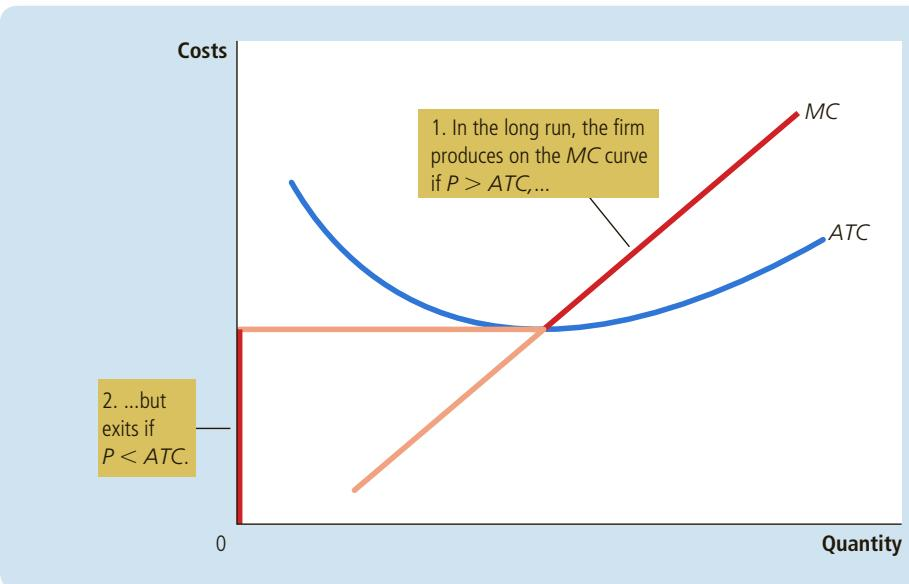

## FIGURE 4

The Competitive Firm’s Long-Run Supply Curve In the long run, the competitive firm’s supply curve is its marginal-cost curve (MC) above average total cost (ATC). If the price falls below average total cost, the firm is better off exiting the market.

We can rewrite this definition by multiplying and dividing the right side by Q:

$$
\text {Profit} = (T R / Q - T C / Q) \times Q.
$$

Note that $T R / Q$ is average revenue, which is the price, P, and $T C / Q$ is average total cost, ATC. Therefore,

$$
\text {Profit} = (P - A T C) \times Q.
$$

This way of expressing the firm’s profit allows us to measure profit in our graphs. Panel (a) of Figure 5 shows a firm earning positive profit. As we have already discussed, the firm maximizes profit by producing the quantity at which price equals marginal cost. Now look at the shaded rectangle. The height of the rectangle is $P - A T C ,$ , the difference between price and average total cost. The width of the rectangle is Q, the quantity produced. Therefore, the area of the rectangle is $( P - A T C ) { \overset { - } { \times } } Q$ , which is the firm’s profit.

Similarly, panel (b) of this figure shows a firm with losses (negative profit). In this case, maximizing profit means minimizing losses, a task accomplished once again by producing the quantity at which price equals marginal cost. Now consider the shaded rectangle. The height of the rectangle is $A T { \bar { C } } - P ,$ and the width is Q. The area is $( A T C - { \bar { P } } ) \times Q ,$ , which is the firm’s loss. Because a firm in this situation is not making enough revenue on each unit to cover its average total cost, it would choose to exit the market in the long run.

How does a competitive firm determine its profit-maximizing level of out-QuickQuiz put? Explain. • When does a profit-maximizing competitive firm decide to shut down? When does it decide to exit a market?

## FIGURE 5

Profit as the Area between Price and Average Total Cost

The area of the shaded box between price and average total cost represents the firm’s profit. The height of this box is price minus average total cost $( P - A T C )$ and the width of the box is the quantity of output (Q). In panel (a), price is above average total cost, so the firm has positive profit. In panel (b), price is less than average total cost, so the firm incurs a loss.

(a) A Firm with Prots  
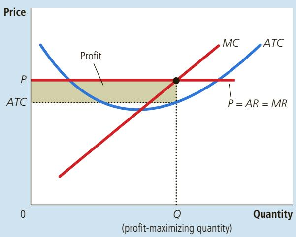

(b) A Firm with Losses  
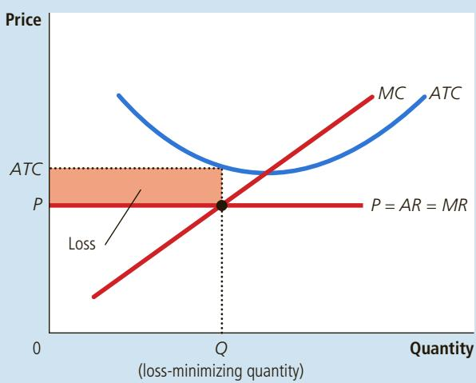

## 14-3 The Supply Curve in a Competitive Market

Now that we have examined the supply decision of a single firm, we can discuss the supply curve for a market. There are two cases to consider. First, we examine a market with a fixed number of firms. Second, we examine a market in which the number of firms can change as old firms exit the market and new firms enter. Both cases are important, for each applies to a specific time horizon. Over short periods of time, it is often difficult for firms to enter and exit, so the assumption of a fixed number of firms is appropriate. But over long periods of time, the number of firms can adjust to changing market conditions.

## 14-3a The Short Run: Market Supply with a Fixed Number of Firms

Consider a market with 1,000 identical firms. For any given price, each firm supplies a quantity of output so that its marginal cost equals the price, as shown in panel (a) of Figure 6. That is, as long as price is above average variable cost, each firm’s marginal-cost curve is its supply curve. The quantity of output supplied to the market equals the sum of the quantities supplied by each of the 1,000 individual firms. Thus, to derive the market supply curve, we add the quantity supplied by each firm in the market. As panel (b) of Figure 6 shows, because the firms are identical, the quantity supplied to the market is 1,000 times the quantity supplied by each firm.

## 14-3b The Long Run: Market Supply with Entry and Exit

Now consider what happens if firms are able to enter and exit the market. Let’s suppose that everyone has access to the same technology for producing the good

In the short run, the number of firms in the market is fixed. As a result, the market supply curve, shown in panel (b), reflects the individual firms’ marginal-cost curves, shown in panel (a). Here, in a market of 1,000 firms, the quantity of output supplied to the market is 1,000 times the quantity supplied by each firm.

Short-Run Market Supply

## FIGURE 6

(a) Individual Firm Supply  
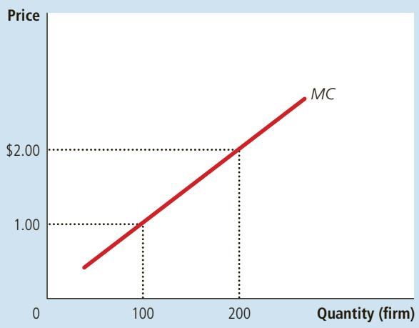

(b) Market Supply  
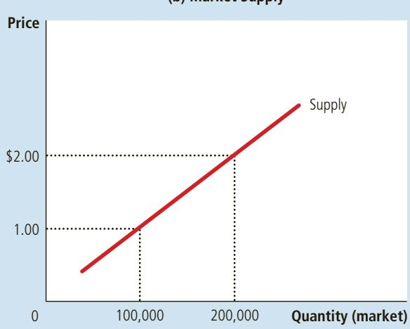

and access to the same markets to buy the inputs for production. Therefore, all current and potential firms have the same cost curves.

Decisions about entry and exit in a market of this type depend on the incentives facing the owners of existing firms and the entrepreneurs who could start new firms. If firms already in the market are profitable, then new firms will have an incentive to enter the market. This entry will expand the number of firms, increase the quantity of the good supplied, and drive down prices and profits. Conversely, if firms in the market are making losses, then some existing firms will exit the market. Their exit will reduce the number of firms, decrease the quantity of the good supplied, and drive up prices and profits. At the end of this process of entry and exit, firms that remain in the market must be making zero economic profit.

Recall that we can write a firm’s profit as

$$
\text {Profit} = (P - A T C) \times Q.
$$

This equation shows that an operating firm has zero profit if and only if the price of the good equals the average total cost of producing that good. If price is above average total cost, profit is positive, which encourages new firms to enter. If price is less than average total cost, profit is negative, which encourages some firms to exit. The process of entry and exit ends only when price and average total cost are driven to equality.

This analysis has a surprising implication. We noted earlier in the chapter that competitive firms maximize profits by choosing a quantity at which price equals marginal cost. We just noted that free entry and exit force price to equal average total cost. But if price is to equal both marginal cost and average total cost, these two measures of cost must equal each other. Marginal cost and average total cost are equal, however, only when the firm is operating at the minimum of average total cost. Recall from the preceding chapter that the level of production with lowest average total cost is called the firm’s efficient scale. Therefore, in the long-run equilibrium of a competitive market with free entry and exit, firms must be operating at their efficient scale.

Panel (a) of Figure 7 shows a firm in such a long-run equilibrium. In this figure, price P equals marginal cost MC, so the firm is maximizing profit. Price also equals average total cost ATC, so profit is zero. New firms have no incentive to enter the market, and existing firms have no incentive to leave the market.

From this analysis of firm behavior, we can determine the long-run supply curve for the market. In a market with free entry and exit, there is only one price consistent with zero profit—the minimum of average total cost. As a result, the long-run market supply curve must be horizontal at this price, as illustrated by the perfectly elastic supply curve in panel (b) of Figure 7. Any price above this level would generate profit, leading to entry and an increase in the total quantity supplied. Any price below this level would generate losses, leading to exit and a decrease in the total quantity supplied. Eventually, the number of firms in the market adjusts so that price equals the minimum of average total cost, and there are enough firms to satisfy all the demand at this price.

## 14-3c Why Do Competitive Firms Stay in Business If They Make Zero Profit?

At first, it might seem odd that competitive firms earn zero profit in the long run. After all, people start businesses to make a profit. If entry eventually drives profit to zero, there might seem to be little reason to stay in business.

In the long run, firms will enter or exit the market until profit is driven to zero. As a result, price equals the minimum of average total cost, as shown in panel (a). The number of firms adjusts to ensure that all demand is satisfied at this price. The long-run market supply curve is horizontal at this price, as shown in panel (b).

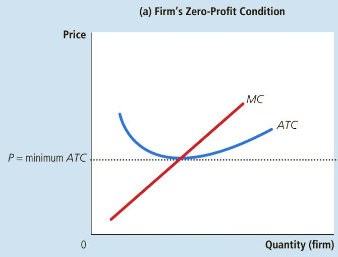

(b) Market Supply  
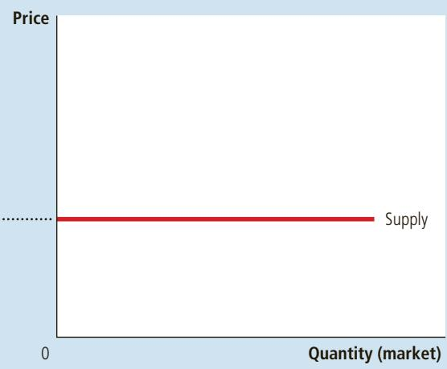

To understand the zero-profit condition more fully, recall that profit equals total revenue minus total cost and that total cost includes all the opportunity costs of the firm. In particular, total cost includes the time and money that the firm owners devote to the business. In the zero-profit equilibrium, the firm’s revenue must compensate the owners for these opportunity costs.

AMERICA SYNDICATE GRIN & BEAT IT @ NORTH

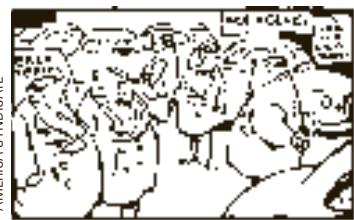

Consider an example. Suppose that, to start his farm, a farmer had to invest \$1 million, which otherwise he could have deposited in a bank and earned \$50,000 a year in interest. In addition, he had to give up another job that would have paid him \$30,000 a year. Then the farmer’s opportunity cost of farming includes both the interest he could have earned and the forgone wages—a total of \$80,000. Even if his profit is driven to zero, his revenue from farming compensates him for these opportunity costs.

“We’re a nonprofit organization—we don’t intend to be, but we are!”

Keep in mind that accountants and economists measure costs differently. As we discussed in the previous chapter, accountants keep track of explicit costs but not implicit costs. That is, they measure costs that require an outflow of money from the firm, but they do not include the opportunity costs of production that do not involve an outflow of money. As a result, in the zero-profit equilibrium, economic profit is zero, but accounting profit is positive. Our farmer’s accountant, for instance, would conclude that the farmer earned an accounting profit of \$80,000, which is enough to keep the farmer in business.

## 14-3d A Shift in Demand in the Short Run and Long Run

Now that we have a more complete understanding of how firms make supply decisions, we can better explain how markets respond to changes in demand. Because firms can enter and exit in the long run but not in the short run, the response of a market to a change in demand depends on the time horizon. To see this, let’s trace the effects of a shift in demand over time.

Suppose the market for milk begins in a long-run equilibrium. Firms are earning zero profit, so price equals the minimum of average total cost. Panel (a) of Figure 8 shows this situation. The long-run equilibrium is point A, the quantity sold in the market is $Q _ { 1 ^ { \prime } }$ and the price is $P _ { 1 }$

Now suppose scientists discover that milk has miraculous health benefits. As a result, the quantity of milk demanded at every price increases, and the demand curve for milk shifts outward from $D _ { 1 }$ to $D _ { 2 ^ { \prime } }$ as in panel (b). The shortrun equilibrium moves from point A to point B; as a result, the quantity rises from $\bar { Q } _ { 1 }$ to $Q _ { 2 ^ { \prime } }$ and the price rises from $P _ { 1 }$ to $P _ { 2 } .$ . All of the existing firms respond to the higher price by raising the amount they produce. Because each firm’s supply curve reflects its marginal-cost curve, how much each firm increases production is determined by the marginal-cost curve. In the new short-run equilibrium, the price of milk exceeds average total cost, so the firms are making positive profit.

Over time, the profit generated in this market encourages new firms to enter. Some farmers may switch to producing milk instead of other farm products, for example. As the number of firms grows, the quantity supplied at every price increases, the short-run supply curve shifts to the right from $S _ { 1 }$ to $S _ { 2 ^ { \prime } }$ as in panel (c), and this shift causes the price of milk to fall. Eventually, the price is driven back down to the minimum of average total cost, profits are zero, and firms stop entering. Thus, the market reaches a new long-run equilibrium, point C. The price of milk has returned to $P _ { 1 } ,$ but the quantity produced has risen to $Q _ { 3 } .$ Each firm is again producing at its efficient scale, but because more firms are in the dairy business, the quantity of milk produced and sold is higher.

## 14-3e Why the Long-Run Supply Curve Might Slope Upward

So far, we have seen that entry and exit can cause the long-run market supply curve to be perfectly elastic. The essence of our analysis is that there are a large number of potential entrants, each of which faces the same costs. As a result, the long-run market supply curve is horizontal at the minimum of average total cost. When the demand for the good increases, the long-run result is an increase in the number of firms and in the total quantity supplied, without any change in the price.

There are, however, two reasons that the long-run market supply curve might slope upward. The first is that some resources used in production may be available only in limited quantities. For example, consider the market for farm products. Anyone can choose to buy land and start a farm, but the quantity of land is limited. As more people become farmers, the price of farmland is bid up, which raises the costs of all farmers in the market. Thus, an increase in demand for farm products cannot induce an increase in quantity supplied without also inducing a rise in farmers’ costs, which in turn means a rise in price. The result is a long-run market supply curve that is upward-sloping, even with free entry into farming.

A second reason for an upward-sloping supply curve is that firms may have different costs. For example, consider the market for painters. Anyone can enter the market for painting services, but not everyone has the same costs. Costs vary in part because some people work faster than others and in part because some people have better alternative uses of their time than others. For any given price, those with lower costs are more likely to enter than those with higher costs. To increase the quantity of painting services supplied, additional entrants must be encouraged to enter the market. Because these new entrants have higher costs,

## FIGURE 8

An Increase in Demand in the Short Run and Long Run

The market starts in a long-run equilibrium, shown as point A in panel (a). In this equilibrium, each firm makes zero profit, and the price equals the minimum average total cost. Panel (b) shows what happens in the short run when demand rises from $D _ { 1 }$ to $D _ { 2 } .$ The equilibrium goes from point A to point B, price rises from $P _ { 1 }$ to $P _ { 2 } ,$ and the quantity sold in the market rises from $Q _ { 1 }$ to $Q _ { 2 }$ . Because price now exceeds average total cost, each firm now makes a profit, which over time encourages new firms to enter the market. This entry shifts the short-run supply curve to the right from $S _ { 1 }$ to $S _ { 2 } ,$ , as shown in panel (c). In the new long-run equilibrium, point C, price has returned to $P _ { 1 }$ but the quantity sold has increased to $Q _ { 3 } .$ Profits are again zero, and price is back to the minimum of average total cost, but the market has more firms to satisfy the greater demand.

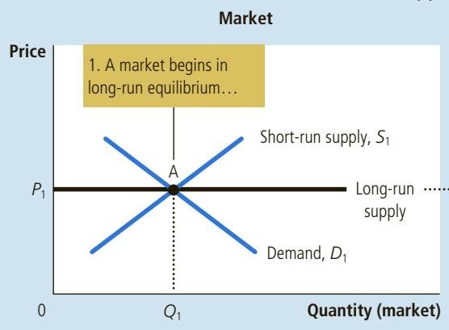

(a) Initial Condition  
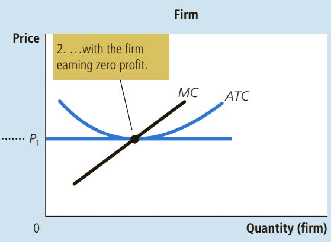

(b) Short-Run Response  
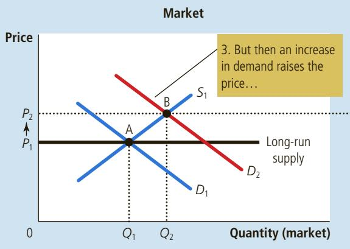

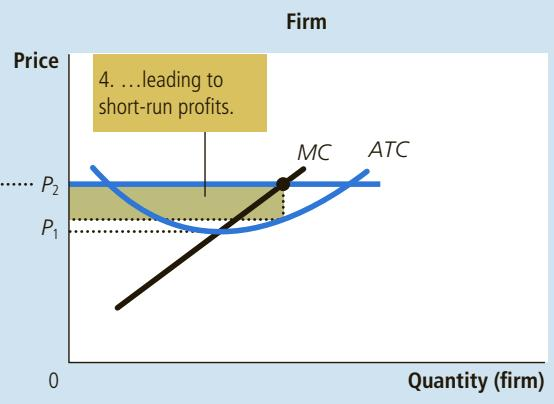

(c) Long-Run Response  
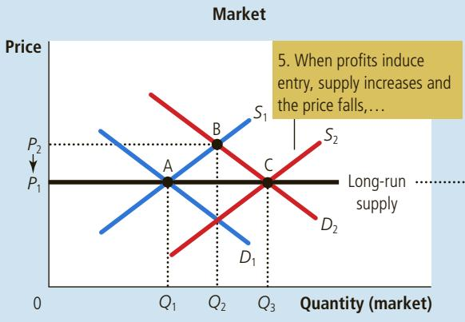

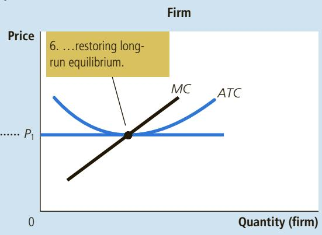

the price must rise to make entry profitable for them. Thus, the long-run market supply curve for painting services slopes upward even with free entry into the market.

Notice that if firms have different costs, some firms earn profit even in the long run. In this case, the price in the market reflects the average total cost of the marginal firm—the firm that would exit the market if the price were any lower. This firm earns zero profit, but firms with lower costs earn positive profit. Entry does not eliminate this profit because would-be entrants have higher costs than firms already in the market. Higher-cost firms will enter only if the price rises, making the market profitable for them.

Thus, for these two reasons, a higher price may be necessary to induce a larger quantity supplied, in which case the long-run supply curve is upward-sloping rather than horizontal. Nonetheless, the basic lesson about entry and exit remains true. Because firms can enter and exit more easily in the long run than in the short run, the long-run supply curve is typically more elastic than the short-run supply curve.

QuickQuiz

In the long run with free entry and exit, is the price in a market equal to marginal cost, average total cost, both, or neither? Explain with a diagram.

## 14-4 Conclusion: Behind the Supply Curve

We have been discussing the behavior of profit-maximizing firms that supply goods in perfectly competitive markets. You may recall from Chapter 1 that one of the Ten Principles of Economics is that rational people think at the margin. This chapter has applied this idea to the competitive firm. Marginal analysis has given us a theory of the supply curve in a competitive market and, as a result, a deeper understanding of market outcomes.

We have learned that when you buy a good from a firm in a competitive market, you can be assured that the price you pay is close to the cost of producing that good. In particular, if firms are competitive and profit-maximizing, the price of a good equals the marginal cost of making that good. In addition, if firms can freely enter and exit the market, the price also equals the lowest possible average total cost of production.

Although we have assumed throughout this chapter that firms are price takers, many of the tools developed here are also useful for studying firms in less competitive markets. We now turn to examining the behavior of firms with market power. Marginal analysis will again be useful, but it will have quite different implications for a firm’s production decisions and for the nature of market outcomes.

## CHAPTER QuickQuiz

1. A perfectly competitive firm

a. chooses its price to maximize profits.

b. sets its price to undercut other firms selling similar products.

c. takes its price as given by market conditions.

d. picks the price that yields the largest market share.

2. A competitive firm maximizes profit by choosing the quantity at which

a. average total cost is at its minimum.

b. marginal cost equals the price.

c. average total cost equals the price.

d. marginal cost equals average total cost.

3. A competitive firm’s short-run supply curve is its cost curve above its cost curve.

a. average total, marginal

b. average variable, marginal

c. marginal, average total

d. marginal, average variable

4. If a profit-maximizing, competitive firm is producing a quantity at which marginal cost is between average variable cost and average total cost, it will

a. keep producing in the short run but exit the market in the long run.

b. shut down in the short run but return to production in the long run.

c. shut down in the short run and exit the market in the long run.

d. keep producing both in the short run and in the long run.

5. In the long-run equilibrium of a competitive market with identical firms, what are the relationships among price $P ,$ marginal cost MC, and average total cost ATC?

a. $P > M C { \mathrm { ~ a n d ~ } } P > A T C .$

b. $P > M C { \mathrm { ~ a n d ~ } } P = A T C .$

c. $P = M C { \mathrm { ~ a n d ~ } } P > A T C .$

d. $P = M C { \mathrm { ~ a n d ~ } } P = A T C .$

6. Pretzel stands in New York City are a perfectly competitive industry in long-run equilibrium. One day, the city starts imposing a \$100 per month tax on each stand. How does this policy affect the number of pretzels consumed in the short run and the long run? a. down in the short run, no change in the long run b. up in the short run, no change in the long run c. no change in the short run, down in the long run d. no change in the short run, up in the long run

## SUMMARY

Because a competitive firm is a price taker, its revenue is proportional to the amount of output it produces. The price of the good equals both the firm’s average revenue and its marginal revenue.

To maximize profit, a firm chooses a quantity of output such that marginal revenue equals marginal cost. Because marginal revenue for a competitive firm equals the market price, the firm chooses quantity so that price equals marginal cost. Thus, the firm’s marginal-cost curve is its supply curve.

In the short run when a firm cannot recover its fixed costs, the firm will choose to shut down temporarily if the price of the good is less than average variable cost. In the long run when the firm can recover both fixed and variable costs, it will choose to exit if the price is less than average total cost.

In a market with free entry and exit, profit is driven to zero in the long run. In this long-run equilibrium, all firms produce at the efficient scale, price equals the minimum of average total cost, and the number of firms adjusts to satisfy the quantity demanded at this price.

Changes in demand have different effects over different time horizons. In the short run, an increase in demand raises prices and leads to profits, and a decrease in demand lowers prices and leads to losses. But if firms can freely enter and exit the market, then in the long run, the number of firms adjusts to drive the market back to the zero-profit equilibrium.

## KEY CONCEPTS

competitive market, p. 268 average revenue, p. 270

marginal revenue, p. 270

sunk cost, p. 275

## QUESTIONS FOR REVIEW

1. What are the main characteristics of a competitive market?

2. Explain the difference between a firm’s revenue and its profit. Which do firms maximize?

3. Draw the cost curves for a typical firm. Explain how a competitive firm chooses the level of output that maximizes profit. At that level of output, show on your graph the firm’s total revenue and total cost.

4. Under what conditions will a firm shut down temporarily? Explain.

5. Under what conditions will a firm exit a market? Explain.

6. Does a competitive firm’s price equal its marginal cost in the short run, in the long run, or both? Explain.

7. Does a competitive firm’s price equal the minimum of its average total cost in the short run, in the long run, or both? Explain.

8. Are market supply curves typically more elastic in the short run or in the long run? Explain.
