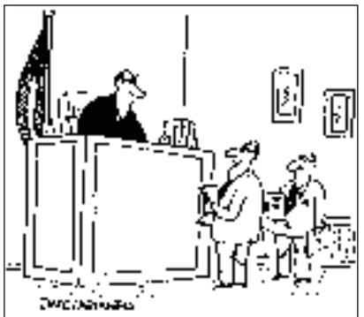
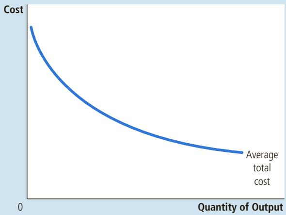
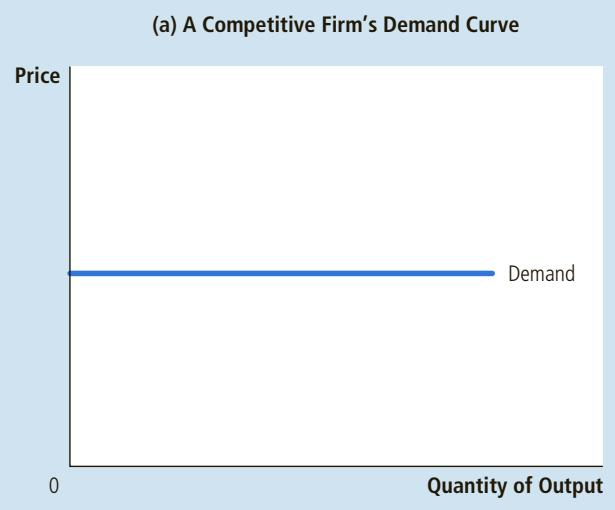
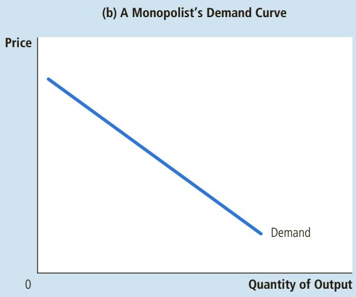
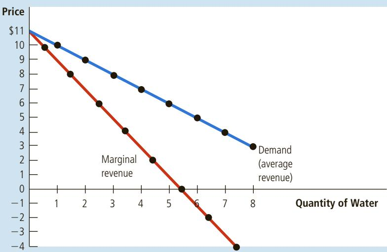
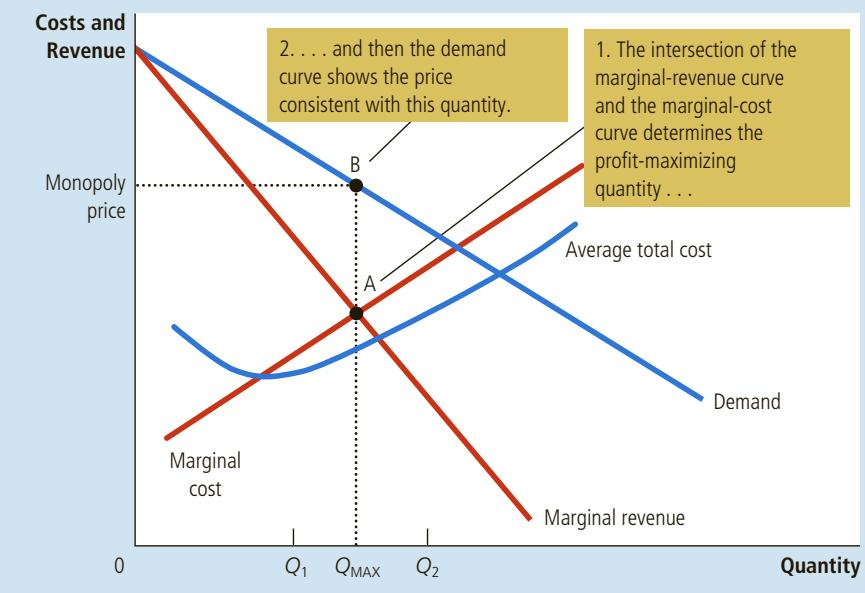
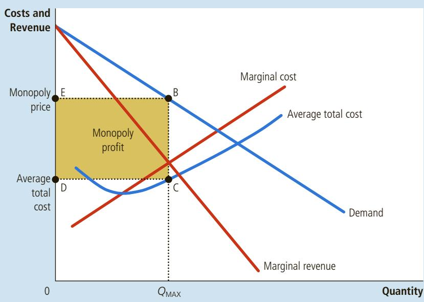
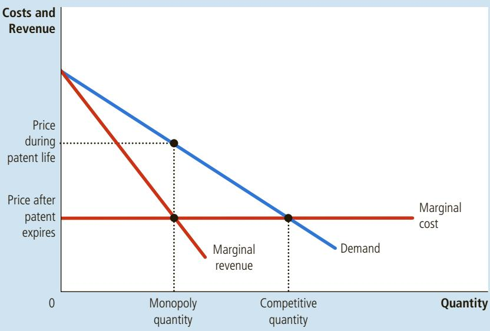

## PROBLEMS AND APPLICATIONS

1. Many small boats are made of fiberglass and a resin derived from crude oil. Suppose that the price of oil rises.

a. Using diagrams, show what happens to the cost curves of an individual boat-making firm and to the market supply curve.

b. What happens to the profits of boat makers in the short run? What happens to the number of boat makers in the long run?

2. Bob’s lawn-mowing service is a profit-maximizing, competitive firm. Bob mows lawns for \$27 each. His total cost each day is \$280, of which \$30 is a fixed cost. He mows 10 lawns a day. What can you say about Bob’s short-run decision regarding shutdown and his long-run decision regarding exit?

3. Consider total cost and total revenue given in the following table:

<table><tr><td>Quantity</td><td>0</td><td>1</td><td>2</td><td>3</td><td>4</td><td>5</td><td>6</td><td>7</td></tr><tr><td>Total cost</td><td>$8</td><td>9</td><td>10</td><td>11</td><td>13</td><td>19</td><td>27</td><td>37</td></tr><tr><td>Total revenue</td><td>$0</td><td>8</td><td>16</td><td>24</td><td>32</td><td>40</td><td>48</td><td>56</td></tr></table>

a. Calculate profit for each quantity. How much should the firm produce to maximize profit?

b. Calculate marginal revenue and marginal cost for each quantity. Graph them. (Hint: Put the points between whole numbers. For example, the marginal cost between 2 and 3 should be graphed at 2½.) At what quantity do these curves cross? How does this relate to your answer to part (a)?

c. Can you tell whether this firm is in a competitive industry? If so, can you tell whether the industry is in a long-run equilibrium?

4. Ball Bearings, Inc., faces costs of production as follows:

<table><tr><td>Quantity</td><td>Total Fixed Cost</td><td>Total Variable Cost</td></tr><tr><td>0</td><td>$100</td><td>$0</td></tr><tr><td>1</td><td>100</td><td>50</td></tr><tr><td>2</td><td>100</td><td>70</td></tr><tr><td>3</td><td>100</td><td>90</td></tr><tr><td>4</td><td>100</td><td>140</td></tr><tr><td>5</td><td>100</td><td>200</td></tr><tr><td>6</td><td>100</td><td>360</td></tr></table>

a. Calculate the company’s average fixed cost, average variable cost, average total cost, and marginal cost at each level of production.

b. The price of a case of ball bearings is \$50. Seeing that he can’t make a profit, the chief executive officer (CEO) decides to shut down operations. What is the firm’s profit/loss? Was this a wise decision? Explain.

c. Vaguely remembering his introductory economics course, the chief financial officer tells the CEO it is better to produce 1 case of ball bearings, because marginal revenue equals marginal cost at that quantity. What is the firm’s profit/loss at that level of production? Was this the best decision? Explain.

5. Suppose the book-printing industry is competitive and begins in a long-run equilibrium.

a. Draw a diagram showing the average total cost, marginal cost, marginal revenue, and supply curve of the typical firm in the industry.

b. Hi-Tech Printing Company invents a new process that sharply reduces the cost of printing books. What happens to Hi-Tech’s profits and to the price of books in the short run when Hi-Tech’s patent prevents other firms from using the new technology?

c. What happens in the long run when the patent expires and other firms are free to use the technology?

6. A firm in a competitive market receives \$500 in total revenue and has marginal revenue of \$10. What is the average revenue, and how many units were sold?

7. A profit-maximizing firm in a competitive market is currently producing 100 units of output. It has average revenue of \$10, average total cost of \$8, and fixed cost of \$200.

a. What is its profit?

b. What is its marginal cost?

c. What is its average variable cost?

d. Is the efficient scale of the firm more than, less than, or exactly 100 units?

8. The market for fertilizer is perfectly competitive. Firms in the market are producing output but are currently incurring economic losses.

a. How does the price of fertilizer compare to the average total cost, the average variable cost, and the marginal cost of producing fertilizer?

b. Draw two graphs, side by side, illustrating the present situation for the typical firm and for the market.

c. Assuming there is no change in either demand or the firms’ cost curves, explain what will happen in the long run to the price of fertilizer, marginal cost, average total cost, the quantity supplied by each firm, and the total quantity supplied to the market.

9. The market for apple pies in the city of Ectenia is competitive and has the following demand schedule:

<table><tr><td>Price</td><td>Quantity Demanded</td></tr><tr><td>$1</td><td>1,200 pies</td></tr><tr><td>2</td><td>1,100</td></tr><tr><td>3</td><td>1,000</td></tr><tr><td>4</td><td>900</td></tr><tr><td>5</td><td>800</td></tr><tr><td>6</td><td>700</td></tr><tr><td>7</td><td>600</td></tr><tr><td>8</td><td>500</td></tr><tr><td>9</td><td>400</td></tr><tr><td>10</td><td>300</td></tr><tr><td>11</td><td>200</td></tr><tr><td>12</td><td>100</td></tr><tr><td>13</td><td>0</td></tr></table>

Each producer in the market has fixed costs of \$9 and the following marginal cost:

<table><tr><td>Quantity</td><td>Marginal Cost</td></tr><tr><td>1 pie</td><td>$2</td></tr><tr><td>2</td><td>4</td></tr><tr><td>3</td><td>6</td></tr><tr><td>4</td><td>8</td></tr><tr><td>5</td><td>10</td></tr><tr><td>6</td><td>12</td></tr></table>

a. Compute each producer’s total cost and average total cost for 1 to 6 pies.

b. The price of a pie is now \$11. How many pies are sold? How many pies does each producer make? How many producers are there? How much profit does each producer earn?

c. Is the situation described in part (b) a long-run equilibrium? Why or why not?

d. Suppose that in the long run there is free entry and exit. How much profit does each producer earn in the long-run equilibrium? What is the market price? How many pies does each producer make? How many pies are sold in the market? How many pie producers are operating?

10. An industry currently has 100 firms, each of which has fixed cost of \$16 and average variable cost as follows:

<table><tr><td>Quantity</td><td>Average Variable Cost</td></tr><tr><td>1</td><td>$1</td></tr><tr><td>2</td><td>2</td></tr><tr><td>3</td><td>3</td></tr><tr><td>4</td><td>4</td></tr><tr><td>5</td><td>5</td></tr><tr><td>6</td><td>6</td></tr></table>

a. Compute a firm’s marginal cost and average total cost for each quantity from 1 to 6.

b. The equilibrium price is currently \$10. How much does each firm produce? What is the total quantity supplied in the market?

c. In the long run, firms can enter and exit the market, and all entrants have the same costs as above. As this market makes the transition to its long-run equilibrium, will the price rise or fall? Will the quantity demanded rise or fall? Will the quantity supplied by each firm rise or fall? Explain your answers.

d. Graph the long-run supply curve for this market, with specific numbers on the axes as relevant.

11. Suppose that each firm in a competitive industry has the following costs:

Total cost:

Marginal cost:

$$
\begin{array}{l} T C = 5 0 + \frac {1}{2} q ^ {2} \\ M C = q \end{array}
$$

where q is an individual firm’s quantity produced. The market demand curve for this product is

Demand:

$$
Q ^ {D} = 1 2 0 - P
$$

where P is the price and Q is the total quantity of the good. Currently, there are 9 firms in the market.

a. What is each firm’s fixed cost? What is its variable cost? Give the equation for average total cost.

b. Graph average-total-cost curve and the marginal-cost curve for q from 5 to 15. At what quantity is average-total-cost curve at its minimum? What is marginal cost and average total cost at that quantity?

c. Give the equation for each firm’s supply curve.

d. Give the equation for the market supply curve for the short run in which the number of firms is fixed.

e. What is the equilibrium price and quantity for this market in the short run?

f. In this equilibrium, how much does each firm produce? Calculate each firm’s profit or loss. Is there incentive for firms to enter or exit?

g. In the long run with free entry and exit, what is the equilibrium price and quantity in this market?

h. In this long-run equilibrium, how much does each firm produce? How many firms are in the market?

To find additional study resources, visit cengagebrain.com, and search for “Mankiw.”

f you own a personal computer, it probably uses some version of Windows, the operating system sold by the Microsoft Corporation. When Microsoft first designed Windows many years ago, it applied for and received a copyright from the government. The copyright gives Microsoft the exclusive right to make and sell copies of the Windows operating system. If a person wants to buy a copy of Windows, she has little choice but to give Microsoft the approximately \$100 that the firm has decided to charge for its product. Microsoft is said to have a monopoly in the market for Windows.

Microsoft’s business decisions are not well described by the model of firm behavior we developed in the previous chapter. In that chapter,

we analyzed competitive markets, in which many firms offer essentially identical products, so each firm has little influence over the price it receives. By contrast, a monopoly such as Microsoft has no close competitors and, therefore, has the power to influence the market price of its product. Whereas a competitive firm is a price taker, a monopoly firm is a price maker.

In this chapter, we examine the implications of this market power. We will see that market power alters the relationship between a firm’s costs and the price at which it sells its product. A competitive firm takes the price of its output as given by the market and then chooses the quantity it will supply so that price equals marginal cost. By contrast, a monopoly charges a price that exceeds marginal cost. Sure enough, we observe this practice in the case of Microsoft’s Windows. The marginal cost of Windows—the extra cost that Microsoft incurs by downloading one more copy of the program onto a CD—is only a few dollars. The market price of Windows is many times its marginal cost.

It is not surprising that monopolies charge high prices for their products. Customers of monopolies might seem to have little choice but to pay whatever the monopoly charges. But if so, why does a copy of Windows not cost \$1,000? Or \$10,000? The reason is that if Microsoft were to set the price that high, fewer people would buy the product. People would buy fewer computers, switch to other operating systems, or make illegal copies. A monopoly firm can control the price of the good it sells, but because a high price reduces the quantity that its customers buy, the monopoly’s profits are not unlimited.

As we examine the production and pricing decisions of monopolies, we also consider the implications of monopoly for society as a whole. Monopoly firms, like competitive firms, aim to maximize profit. But this goal has very different ramifications for competitive and monopoly firms. In competitive markets, self-interested consumers and producers reach an equilibrium that promotes general economic well-being, as if guided by an invisible hand. By contrast, because monopoly firms are unchecked by competition, the outcome in a market with a monopoly is often not in the best interest of society.

One of the Ten Principles of Economics in Chapter 1 is that governments can sometimes improve market outcomes. The analysis in this chapter sheds more light on this principle. As we examine the problems that monopolies raise for society, we discuss the various ways in which government policymakers might respond to these problems. The U.S. government, for example, keeps a close eye on Microsoft’s business decisions. In 1994, it blocked Microsoft from buying Intuit, a leading seller of personal finance software, on the grounds that combining the two firms would concentrate too much market power. Similarly, in 1998, the U.S. Department of Justice objected when Microsoft started integrating its Internet browser into its Windows operating system, claiming that this addition would extend the firm’s market power into new areas. In recent years, regulators in the United States and abroad have shifted their focus to firms with growing market power, such as Google and Samsung, but continue to monitor Microsoft’s compliance with the antitrust laws.

## 15-1 Why Monopolies Arise

monopoly a firm that is the sole seller of a product without any close substitutes

A firm is a monopoly if it is the sole seller of its product and if its product does not have any close substitutes. The fundamental cause of monopoly is barriers to entry: A monopoly remains the only seller in its market because other firms cannot enter the market and compete with it. Barriers to entry, in turn, have three main sources:

• Monopoly resources: A key resource required for production is owned by a single firm.

• Government regulation: The government gives a single firm the exclusive right to produce some good or service.

• The production process: A single firm can produce output at a lower cost than can a larger number of firms.

Let’s briefly discuss each of these.

  
FEATURES SYNDICATE THE WALL STREET JOURNAL - PERMISSION, CARTOON

## 15-1a Monopoly Resources

The simplest way for a monopoly to arise is for a single firm to own a key resource. For example, consider the market for water in a small town. If dozens of town residents have working wells, the model of competitive markets discussed in the preceding chapter describes the behavior of sellers. Competition among suppliers drives the price of a gallon of water to equal the marginal cost of pumping an extra gallon. But if there is only one well in town and it is impossible to get water from anywhere else, then the

“Rather than a monopoly, we like to consider ourselves ‘the only game in town.

owner of the well has a monopoly on water. Not surprisingly, the monopolist has much greater market power than any single firm in a competitive market. In the case of a necessity like water, the monopolist can command quite a high price, even if the marginal cost of pumping an extra gallon is low.

A classic example of market power arising from the ownership of a key resource is DeBeers, the South African diamond company. Founded in 1888 by Cecil Rhodes, an English businessman (and benefactor of the Rhodes scholarship), DeBeers has at times controlled up to 80 percent of the production from the world’s diamond mines. Because its market share is less than 100 percent, DeBeers is not exactly a monopoly, but the company has nonetheless exerted substantial influence over the market price of diamonds.

Although exclusive ownership of a key resource is a potential cause of monopoly, in practice monopolies rarely arise for this reason. Economies are large, and resources are owned by many people. The natural scope of many markets is worldwide, because goods are often traded internationally. There are, therefore, few examples of firms that own a resource for which there are no close substitutes.

## 15-1b Government-Created Monopolies

In many cases, monopolies arise because the government has given one person or firm the exclusive right to sell some good or service. Sometimes the monopoly arises from the sheer political clout of the would-be monopolist. Kings, for example, once granted exclusive business licenses to their friends and allies. At other times, the government grants a monopoly because doing so is viewed to be in the public interest.

The patent and copyright laws are two important examples. When a pharmaceutical company discovers a new drug, it can apply to the government for a patent. If the government deems the drug to be truly original, it approves the patent, which gives the company the exclusive right to manufacture and sell the drug for 20 years. Similarly, when a novelist finishes a book, she can copyright it. The copyright is a government guarantee that no one can print and sell the work without the author’s permission. The copyright makes the novelist a monopolist in the sale of her novel.

The effects of patent and copyright laws are easy to see. Because these laws give one producer a monopoly, they lead to higher prices than would occur under competition. But by allowing these monopoly producers to charge higher prices and earn higher profits, the laws also encourage some desirable behavior. Drug companies are allowed to be monopolists in the drugs they discover to encourage research. Authors are allowed to be monopolists in the sale of their books to encourage them to write more and better books.

Thus, the laws governing patents and copyrights have both benefits and costs. The benefits of the patent and copyright laws are the increased incentives for creative activity. These benefits are offset, to some extent, by the costs of monopoly pricing, which we examine later in this chapter.

## 15-1c Natural Monopolies

natural monopoly a type of monopoly that arises because a single firm can supply a good or service to an entire market at a lower cost than could two or more firms

An industry is a natural monopoly when a single firm can supply a good or service to an entire market at a lower cost than could two or more firms. A natural monopoly arises when there are economies of scale over the relevant range of output. Figure 1 shows the average total costs of a firm with economies of scale. In this case, a single firm can produce any amount of output at the lowest cost. That is, for any given amount of output, a larger number of firms leads to less output per firm and higher average total cost.

An example of a natural monopoly is the distribution of water. To provide water to residents of a town, a firm must build a network of pipes throughout the town. If two or more firms were to compete in the provision of this service, each firm would have to pay the fixed cost of building a network. Thus, the average total cost of water is lowest if a single firm serves the entire market.

We saw other examples of natural monopolies when we discussed public goods and common resources in Chapter 11. We noted that club goods are excludable but not rival in consumption. An example is a bridge used so infrequently that it is never congested. The bridge is excludable because a toll collector can prevent someone from using it. The bridge is not rival in consumption because use of the bridge by one person does not diminish the ability of others to use it. Because there is a large fixed cost of building the bridge and a negligible marginal cost of additional users, the average total cost of a trip across the bridge (the total cost divided by the number of trips) falls as the number of trips rises. Hence, the bridge is a natural monopoly.

## FIGURE 1

## Economies of Scale as a Cause of Monopoly

When a firm’s average-total-cost curve continually declines, the firm has what is called a natural monopoly. In this case, when production is divided among more firms, each firm produces less, and average total cost rises. As a result, a single firm can produce any given amount at the lowest cost.

When a firm is a natural monopoly, it is less concerned about new entrants eroding its monopoly power. Normally, a firm has trouble maintaining a monopoly position without ownership of a key resource or protection from the government. The monopolist’s profit attracts entrants into the market, and these entrants make the market more competitive. By contrast, entering a market in which another firm has a natural monopoly is unattractive. Would-be entrants know that they cannot achieve the same low costs that the monopolist enjoys because, after entry, each firm would have a smaller piece of the market.

In some cases, the size of the market is one determinant of whether an industry is a natural monopoly. Again, consider a bridge across a river. When the population is small, the bridge may be a natural monopoly. A single bridge can satisfy the entire demand for trips across the river at the lowest cost. Yet as the population grows and the bridge becomes congested, satisfying the entire demand may require two or more bridges across the same river. Thus, as a market expands, a natural monopoly can evolve into a more competitive market.

QuickQuiz

What are the three reasons that a market might have a monopoly? • Give two examples of monopolies and explain the reason for each.

## 15-2 How Monopolies Make Production and Pricing Decisions

Now that we know how monopolies arise, we can consider how a monopoly firm decides how much of its product to make and what price to charge for it. The analysis of monopoly behavior in this section is the starting point for evaluating whether monopolies are desirable and what policies the government might pursue in monopoly markets.

## 15-2a Monopoly versus Competition

The key difference between a competitive firm and a monopoly is the monopoly’s ability to influence the price of its output. A competitive firm is small relative to the market in which it operates and, therefore, has no power to influence the price of its output. It takes the price as given by market conditions. By contrast, because a monopoly is the sole producer in its market, it can alter the price of its good by adjusting the quantity it supplies to the market.

One way to view this difference between a competitive firm and a monopoly is to consider the demand curve that each firm faces. When we analyzed profit maximization by competitive firms in the preceding chapter, we drew the market price as a horizontal line. Because a competitive firm can sell as much or as little as it wants at this price, the competitive firm faces a horizontal demand curve, as in panel (a) of Figure 2. In effect, because the competitive firm sells a product with many perfect substitutes (the products of all the other firms in its market), the demand curve that any one firm faces is perfectly elastic.

By contrast, because a monopoly is the sole producer in its market, its demand curve is the market demand curve. Thus, the monopolist’s demand curve slopes downward, as in panel (b) of Figure 2. If the monopolist raises the price of its good, consumers buy less of it. Looked at another way, if the monopolist reduces the quantity of output it produces and sells, the price of its output increases.

The market demand curve provides a constraint on a monopoly’s ability to profit from its market power. A monopolist would prefer, if it were possible, to

## FIGURE 2

Demand Curves for Competitive and Monopoly Firms

Because competitive firms are price takers, they face horizontal demand curves, as in panel (a). Because a monopoly firm is the sole producer in its market, it faces the downward-sloping market demand curve, as in panel (b). As a result, the monopoly has to accept a lower price if it wants to sell more output.

charge a high price and sell a large quantity at that high price. The market demand curve makes that outcome impossible. In particular, the market demand curve describes the combinations of price and quantity that are available to a monopoly firm. By adjusting the quantity produced (or equivalently, the price charged), the monopolist can choose any point on the demand curve, but it cannot choose a point off the demand curve.

What price and quantity of output will the monopolist choose? As with competitive firms, we assume that the monopolist’s goal is to maximize profit. Because the firm’s profit is total revenue minus total costs, our next task in explaining monopoly behavior is to examine a monopolist’s revenue.

## 15-2b A Monopoly’s Revenue

Consider a town with a single producer of water. Table 1 shows how the monopoly’s revenue might depend on the amount of water produced.

Columns (1) and (2) show the monopolist’s demand schedule. If the monopolist produces 1 gallon of water, it can sell that gallon for \$10. If it produces 2 gallons, it must lower the price to \$9 to sell both gallons. If it produces 3 gallons, it must lower the price to \$8. And so on. If you graphed these two columns of numbers, you would get a typical downward-sloping demand curve.

Column (3) of the table presents the monopolist’s total revenue. It equals the quantity sold [from column (1)] times the price [from column (2)]. Column (4) computes the firm’s average revenue, the amount of revenue the firm receives per unit sold. We compute average revenue by taking the number for total revenue in column (3) and dividing it by the quantity of output in column (1). As we discussed in the previous chapter, average revenue always equals the price of the good. This is true for monopolists as well as for competitive firms.

<table><tr><td>(1) Quantity of Water (Q)</td><td>(2) Price (P)</td><td>(3) Total Revenue (TR = P × Q)</td><td>(4) Average Revenue (AR = TR / Q)</td><td>(5) Marginal Revenue (MR = ΔTR / ΔQ)</td></tr><tr><td>0 gallons</td><td>$11</td><td>$ 0</td><td>—</td><td></td></tr><tr><td>1</td><td>10</td><td>10</td><td>$10</td><td>$10</td></tr><tr><td>2</td><td>9</td><td>18</td><td>9</td><td>8</td></tr><tr><td>3</td><td>8</td><td>24</td><td>8</td><td>6</td></tr><tr><td>4</td><td>7</td><td>28</td><td>7</td><td>4</td></tr><tr><td>5</td><td>6</td><td>30</td><td>6</td><td>2</td></tr><tr><td>6</td><td>5</td><td>30</td><td>5</td><td>0</td></tr><tr><td>7</td><td>4</td><td>28</td><td>4</td><td>-2</td></tr><tr><td>8</td><td>3</td><td>24</td><td>3</td><td>-4</td></tr></table>

Column (5) of Table 1 computes the firm’s marginal revenue, the amount of revenue that the firm receives for each additional unit of output. We compute marginal revenue by taking the change in total revenue when output increases by 1 unit. For example, when the firm is producing 3 gallons of water, it receives total revenue of \$24. Raising production to 4 gallons increases total revenue to \$28. Thus, marginal revenue from the sale of the fourth gallon is \$28 minus \$24, or \$4.

Table 1 shows a result that is important for understanding monopoly behavior: A monopolist’s marginal revenue is less than the price of its good. For example, if the firm raises production of water from 3 to 4 gallons, it increases total revenue by only \$4, even though it sells each gallon for \$7. For a monopoly, marginal revenue is lower than price because a monopoly faces a downward-sloping demand curve. To increase the amount sold, a monopoly firm must lower the price it charges to all customers. Hence, to sell the fourth gallon of water, the monopolist must earn \$1 less revenue for each of the first 3 gallons. This \$3 loss accounts for the difference between the price of the fourth gallon (\$7) and the marginal revenue of that fourth gallon (\$4).

Marginal revenue for monopolies is very different from marginal revenue for competitive firms. When a monopoly increases the amount it sells, this action has two effects on total revenue (P 3 Q):

• The output effect: More output is sold, so Q is higher, which tends to increase total revenue.

• The price effect: The price falls, so P is lower, which tends to decrease total revenue.

Because a competitive firm can sell all it wants at the market price, there is no price effect. When it increases production by 1 unit, it receives the market price for that unit, and it does not receive any less for the units it was already selling. That is, because the competitive firm is a price taker, its marginal revenue equals the price of its good. By contrast, when a monopoly increases production by 1 unit, it must reduce the price it charges for every unit it sells, and this cut in price reduces revenue on the units it was already selling. As a result, a monopoly’s marginal revenue is less than its price.

Figure 3 graphs the demand curve and the marginal-revenue curve for a monopoly firm. (Because the firm’s price equals its average revenue, the demand curve is also the average-revenue curve.) These two curves always start at the same point on the vertical axis because the marginal revenue of the first unit sold equals the price of the good. But for the reason we just discussed, the monopolist’s marginal revenue on all units after the first is less than the price of the good. Thus, a monopoly’s marginal-revenue curve lies below its demand curve.

You can see in Figure 3 (as well as in Table 1) that marginal revenue can even become negative. Marginal revenue is negative when the price effect on revenue is greater than the output effect. In this case, when the firm produces an extra unit of output, the price falls by enough to cause the firm’s total revenue to decline, even though the firm is selling more units.

## 15-2c Profit Maximization

Now that we have considered the revenue of a monopoly firm, we are ready to examine how such a firm maximizes profit. Recall from Chapter 1 that one of the Ten Principles of Economics is that rational people think at the margin. This lesson is as true for monopolists as it is for competitive firms. Here we apply the logic of marginal analysis to the monopolist’s decision about how much to produce.

Figure 4 graphs the demand curve, the marginal-revenue curve, and the cost curves for a monopoly firm. All these curves should seem familiar: The demand and marginal-revenue curves are like those in Figure 3, and the cost curves are like those we encountered in the last two chapters. These curves contain all the

## FIGURE 3

## Demand and Marginal-Revenue Curves for a Monopoly

The demand curve shows how the quantity sold affects the price of the good. The marginal-revenue curve shows how the firm’s revenue changes when the quantity increases by 1 unit. Because the price on all units sold must fall if the monopoly increases production, marginal revenue is less than the price.

## FIGURE 4

Profit Maximization for a Monopoly A monopoly maximizes profit by choosing the quantity at which marginal revenue equals marginal cost (point A). It then uses the demand curve to find the price that will induce consumers to buy that quantity (point B).

information we need to determine the level of output that a profit-maximizing monopolist will choose.

Suppose, first, that the firm is producing at a low level of output, such as $Q _ { 1 }$ In this case, marginal cost is less than marginal revenue. If the firm increased production by 1 unit, the additional revenue would exceed the additional costs, and profit would rise. Thus, when marginal cost is less than marginal revenue, the firm can increase profit by producing more units.

A similar argument applies at high levels of output, such as $Q _ { 2 } .$ In this case, marginal cost is greater than marginal revenue. If the firm reduced production by 1 unit, the costs saved would exceed the revenue lost. Thus, if marginal cost is greater than marginal revenue, the firm can raise profit by reducing production.

In the end, the firm adjusts its level of production until the quantity reaches $Q _ { \mathrm { M A X } } , \hat { c }$ t which marginal revenue equals marginal cost. Thus, the monopolist’s profit-maximizing quantity of output is determined by the intersection of the marginal-revenue curve and the marginal-cost curve. In Figure 4, this intersection occurs at point A.

You might recall from the previous chapter that competitive firms also choose the quantity of output at which marginal revenue equals marginal cost. In following this rule for profit maximization, competitive firms and monopolies are alike. But there is also an important difference between these types of firms: The marginal revenue of a competitive firm equals its price, whereas the marginal revenue of a monopoly is less than its price. That is,

$$
\text { For   a   competitive   firm: } P = M R = M C.
$$

For a monopoly firm: P . MR 5 MC.

The equality of marginal revenue and marginal cost determines the profitmaximizing quantity for both types of firm. What differs is how the price is related to marginal revenue and marginal cost.

How does the monopoly find the profit-maximizing price for its product? The demand curve answers this question because the demand curve relates the amount that customers are willing to pay to the quantity sold. Thus, after the monopoly firm chooses the quantity of output that equates marginal revenue and marginal cost, it uses the demand curve to find the highest price it can charge for that quantity. In Figure 4, the profit-maximizing price is found at point B.

We can now see a key difference between markets with competitive firms and markets with a monopoly firm: In competitive markets, price equals marginal cost. In monopolized markets, price exceeds marginal cost. As we will see in a moment, this finding is crucial to understanding the social cost of monopoly.

## 15-2d A Monopoly’s Profit

How much profit does a monopoly make? To see a monopoly firm’s profit in a graph, recall that profit equals total revenue (TR) minus total costs (TC):

$$
\text {Profit} = T R - T C.
$$

We can rewrite this as

$$
\text {Profit} = (T R / Q - T C / Q) \times Q.
$$

$T R / Q$ is average revenue, which equals the price, P, and $T C / Q$ is average total cost, ATC. Therefore,

$$
\text {Profit} = (P - A T C) \times Q.
$$

This equation for profit (which also holds for competitive firms) allows us to measure the monopolist’s profit in our graph.

Consider the shaded box in Figure 5. The height of the box (the segment BC) is price minus average total cost, ${ \overset { \smile } { P } } - A T C$ which is the profit on the typical unit sold. The width of the box (the segment DC) is the quantity sold, $Q _ { \mathrm { M A X } } .$ Therefore, the area of this box is the monopoly firm’s total profit.

## FYI

## Why a Monopoly Does Not Have a Supply Curve

ou may have noticed that we have analyzed the price in a monopoly market using the market demand curve and the firm’s cost curves. We have not made any mention of the market supply curve. By contrast, when we analyzed prices in competitive markets beginning in Chapter 4, the two most important words were always supply and demand.

What happened to the supply curve? Although monopoly firms make decisions about what quantity to supply, a monopoly does not have a supply curve. A supply curve tells us the quantity that firms choose to supply at any given price. This concept makes sense when we are analyzing competitive firms, which are price takers. But a monopoly firm is a price maker, not a price taker. It is not meaningful to ask what amount such a firm would produce at any given price because it cannot take the price as given. Instead, when the firm chooses the quantity to supply, that

decision (along with the demand curve) determines the price.

Indeed, the monopolist’s decision about how much to supply is impossible to separate from the demand curve

it faces. The shape of the demand curve determines the shape of the marginal-revenue curve, which in turn determines the monopolist’s profit-maximizing quantity. In a competitive market, each firm’s supply decisions can be analyzed without knowing the demand curve, but that is not true in a monopoly market. Therefore, we never talk about a monopoly’s supply curve. ■

## FIGURE 5

## The Monopolist’s Profit

The area of the box BCDE equals the profit of the monopoly firm. The height of the box (BC) is price minus average total cost, which equals profit per unit sold. The width of the box (DC) is the number of units sold.

## MONOPOLY DRUGS VERSUS GENERIC DRUGS

According to our analysis, prices are determined differently in monopolized markets and competitive markets. A natural place to test this theory is the market for pharmaceutical drugs because this

market takes on both market structures. When a firm discovers a new drug, patent laws give the firm a monopoly on the sale of that drug. But eventually, the firm’s patent runs out, and any company can make and sell the drug. At that time, the market switches from being monopolistic to being competitive.

What should happen to the price of a drug when the patent runs out? Figure 6 shows the market for a typical drug. In this figure, the marginal cost of producing the drug is constant. (This is approximately true for many drugs.) During the life of the patent, the monopoly firm maximizes profit by producing the quantity at which marginal revenue equals marginal cost and charging a price well above marginal cost. But when the patent runs out, the profit from making the drug should encourage new firms to enter the market. As the market becomes more competitive, the price should fall to equal marginal cost.

Experience is, in fact, consistent with our theory. When the patent on a drug expires, other companies quickly enter and begin selling generic products that are chemically identical to the former monopolist’s brand-name product. Just as our analysis predicts, the price of the competitively produced generic drug is well below the price that the monopolist was charging.

The expiration of a patent, however, does not cause the monopolist to lose all of its market power. Some consumers remain loyal to the brand-name drug, perhaps out of fear that the new generic drugs are not actually the same as the drug they have been using for years. As a result, the former monopolist can continue to charge a price above the price charged by its new competitors.

For example, one of the most widely used antidepressants is the drug fluoxetine, which is taken by millions of Americans. Because the patent on this drug expired in 2001, a consumer today has the choice between the original drug, sold under the

## FIGURE 6

## The Market for Drugs

When a patent gives a firm a monopoly over the sale of a drug, the firm charges the monopoly price, which is well above the marginal cost of making the drug. When the patent on a drug runs out, new firms enter the market, making it more competitive. As a result, the price falls from the monopoly price to marginal cost.

brand name Prozac, and a generic version of the same medicine. Prozac sells for about three times the price of generic fluoxetine. This price differential can persist because some consumers are not convinced that the two pills are perfect substitutes. ●

QuickQuiz

Explain how a monopolist chooses the quantity of output to produce and the price to charge.

## 15-3 The Welfare Cost of Monopolies

Is monopoly a good way to organize a market? We have seen that a monopoly, in contrast to a competitive firm, charges a price above marginal cost. From the standpoint of consumers, this high price makes monopoly undesirable. At the same time, however, the monopoly is earning profit from charging this high price. From the standpoint of the owners of the firm, the high price makes monopoly very desirable. Is it possible that the benefits to the firm’s owners exceed the costs imposed on consumers, making monopoly desirable from the standpoint of society as a whole?

We can answer this question using the tools of welfare economics. Recall from Chapter 7 that total surplus measures the economic well-being of buyers and sellers in a market. Total surplus is the sum of consumer surplus and producer surplus. Consumer surplus is consumers’ willingness to pay for a good minus the amount they actually pay for it. Producer surplus is the amount producers receive for a good minus their costs of producing it. In this case, there is a single producer—the monopolist.

You can probably guess the result of this analysis. In Chapter 7, we concluded that the equilibrium of supply and demand in a competitive market is not only a natural outcome but also a desirable one. The invisible hand of the market leads to an allocation of resources that makes total surplus as large as it can be. Because a monopoly leads to an allocation of resources different from that in a competitive market, the outcome must, in some way, fail to maximize total economic well-being.
