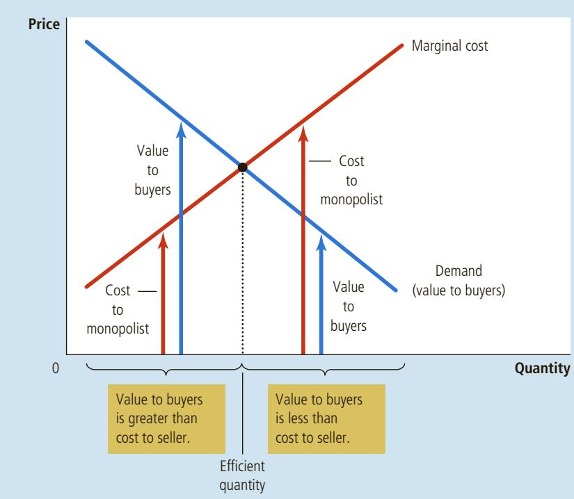
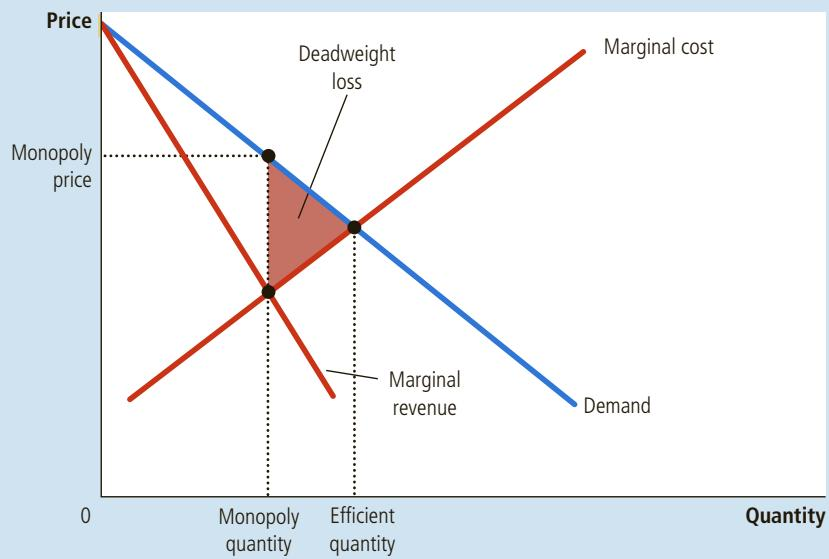
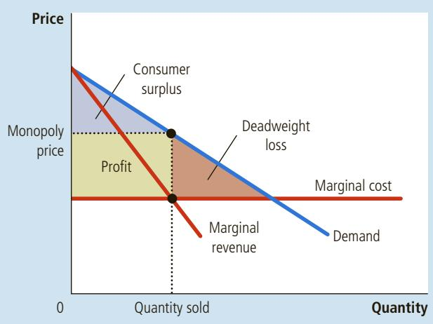
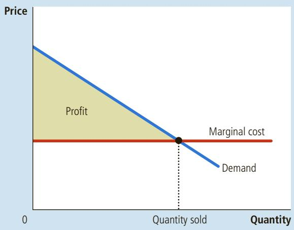
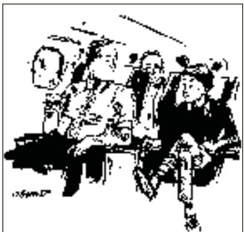

## 15-3a The Deadweight Loss

We begin by considering what the monopoly firm would do if it were run by a benevolent social planner. The social planner cares not only about the profit earned by the firm’s owners but also about the benefits received by the firm’s consumers. The planner tries to maximize total surplus, which equals producer surplus (profit) plus consumer surplus. Keep in mind that total surplus equals the value of the good to consumers minus the costs of making the good incurred by the monopoly producer.

Figure 7 analyzes how a benevolent social planner would choose the monopoly’s level of output. The demand curve reflects the value of the good to consumers, as measured by their willingness to pay for it. The marginal-cost curve reflects the costs of the monopolist. Thus, the socially efficient quantity is found where the demand curve and the marginal-cost curve intersect. Below this quantity, the value of an extra unit to consumers exceeds the cost of providing it, so increasing output would raise total surplus. Above this quantity, the cost of producing an extra unit exceeds the value of that unit to consumers, so decreasing output would raise total surplus. At the optimal quantity, the value of an extra unit to consumers exactly equals the marginal cost of production.

If the social planner were running the monopoly, the firm could achieve this efficient outcome by charging the price found at the intersection of the demand and marginal-cost curves. Thus, like a competitive firm and unlike a profitmaximizing monopoly, a social planner would charge a price equal to marginal cost. Because this price would give consumers an accurate signal about the cost of producing the good, consumers would buy the efficient quantity.

We can evaluate the welfare effects of monopoly by comparing the level of output that the monopolist chooses to the level of output that a social planner would

## FIGURE 7

## The Efficient Level of Output

A benevolent social planner maximizes total surplus in the market by choosing the level of output where the demand curve and marginal-cost curve intersect. Below this level, the value of the good to the marginal buyer (as reflected in the demand curve) exceeds the marginal cost of making the good. Above this level, the value to the marginal buyer is less than marginal cost.

choose. As we have seen, the monopolist chooses to produce and sell the quantity of output at which the marginal-revenue and marginal-cost curves intersect; the social planner would choose the quantity at which the demand and marginal-cost curves intersect. Figure 8 shows the comparison. The monopolist produces less than the socially efficient quantity of output.

We can also view the inefficiency of monopoly in terms of the monopolist’s price. Because the market demand curve describes a negative relationship between the price and quantity of the good, a quantity that is inefficiently low is equivalent to a price that is inefficiently high. When a monopolist charges a price above marginal cost, some potential consumers value the good at more than its marginal cost but less than the monopolist’s price. These consumers do not buy the good. Because the value these consumers place on the good is greater than the cost of providing it to them, this result is inefficient. Thus, monopoly pricing prevents some mutually beneficial trades from taking place.

The inefficiency of monopoly can be measured with a deadweight loss triangle, as illustrated in Figure 8. Because the demand curve reflects the value to consumers and the marginal-cost curve reflects the costs to the monopoly producer, the area of the deadweight loss triangle between the demand curve and the marginal-cost curve equals the total surplus lost because of monopoly pricing. It represents the reduction in economic well-being that results from the monopoly’s use of its market power.

The deadweight loss caused by a monopoly is similar to the deadweight loss caused by a tax. Indeed, a monopolist is like a private tax collector. As we saw in Chapter 8, a tax on a good places a wedge between consumers’ willingness to pay (as reflected by the demand curve) and producers’ costs (as reflected by the supply curve). Because a monopoly exerts its market power by charging a price above marginal cost, it creates a similar wedge. In both cases, the wedge causes the quantity sold to fall short of the social optimum. The difference between the two cases is that the government gets the revenue from a tax, whereas a private firm gets the monopoly profit.

## FIGURE 8

## The Inefficiency of Monopoly

Because a monopoly charges a price above marginal cost, not all consumers who value the good at more than its cost buy it. Thus, the quantity produced and sold by a monopoly is below the socially efficient level. The deadweight loss is represented by the area of the triangle between the demand curve (which reflects the value of the good to consumers) and the marginal-cost curve (which reflects the costs of the monopoly producer).

## 15-3b The Monopoly’s Profit: A Social Cost?

It is tempting to decry monopolies for “profiteering” at the expense of the public. And indeed, a monopoly firm does earn a profit by virtue of its market power. According to the economic analysis of monopoly, however, the firm’s profit is not in itself necessarily a problem for society.

Welfare in a monopolized market, as in all markets, includes the welfare of both consumers and producers. Whenever a consumer pays an extra dollar to a producer because of a monopoly price, the consumer is worse off by a dollar and the producer is better off by the same amount. This transfer from the consumers of the good to the owners of the monopoly does not affect the market’s total surplus—the sum of consumer and producer surplus. In other words, the monopoly profit itself represents not a reduction in the size of the economic pie but merely a bigger slice for producers and a smaller slice for consumers. Unless consumers are for some reason more deserving than producers—a normative judgment about equity that goes beyond the realm of economic efficiency—the monopoly profit is not a social problem.

The problem in a monopolized market arises because the firm produces and sells a quantity of output below the level that maximizes total surplus. The deadweight loss measures how much the economic pie shrinks as a result. This inefficiency is connected to the monopoly’s high price: Consumers buy fewer units when the firm raises its price above marginal cost. But keep in mind that the profit earned on the units that continue to be sold is not the problem. The problem stems from the inefficiently low quantity of output. Put differently, if the high monopoly price did not discourage some consumers from buying the good, it would raise producer surplus by exactly the amount it reduced consumer surplus, leaving total surplus the same as that achieved by a benevolent social planner.

There is, however, a possible exception to this conclusion. Suppose that a monopoly firm has to incur additional costs to maintain its monopoly position. For example, a firm with a government-created monopoly might need to hire lobbyists to convince lawmakers to continue its monopoly. In this case, the monopoly may use up some of its monopoly profits paying for these additional costs. If so, the social loss from monopoly includes both these costs and the deadweight loss resulting from reduced output.

How does a monopolist’s quantity of output compare to the quantity of QuickQuiz output that maximizes total surplus? How does this difference relate to the deadweight loss?

## 15-4 Price Discrimination

So far, we have been assuming that the monopoly firm charges the same price to all customers. Yet in many cases, firms sell the same good to different customers for different prices, even though the costs of producing for the two customers are the same. This practice is called price discrimination.

Before discussing the behavior of a price-discriminating monopolist, we should note that price discrimination is not possible when a good is sold in a competitive market. In a competitive market, many firms are selling the same good at the market price. No firm is willing to charge a lower price to any customer because the firm can sell all it wants at the market price. And if any firm tried to charge a

price discrimination the business practice of selling the same good at different prices to different customers

higher price to a customer, that customer would buy from another firm. For a firm to price discriminate, it must have some market power.

## 15-4a A Parable about Pricing

To understand why a monopolist would price discriminate, let’s consider an example. Imagine that you are the president of Readalot Publishing Company. Readalot’s best-selling author has just written a new novel. To keep things simple, let’s imagine that you pay the author a flat \$2 million for the exclusive rights to publish the book. Let’s also assume that the cost of printing the book is zero (as it would be, for example, for an e-book). Readalot’s profit, therefore, is the revenue from selling the book minus the \$2 million it has paid to the author. Given these assumptions, how would you, as Readalot’s president, decide the book’s price?

Your first step is to estimate the demand for the book. Readalot’s marketing department tells you that the book will attract two types of readers. The book will appeal to the author’s 100,000 die-hard fans who are willing to pay as much as \$30. In addition, it will appeal to about 400,000 less enthusiastic readers who will pay up to \$5.

If Readalot charges a single price to all customers, what price maximizes profit? There are two natural prices to consider: \$30 is the highest price Readalot can charge and still get the 100,000 die-hard fans, and \$5 is the highest price it can charge and still get the entire market of 500,000 potential readers. Solving Readalot’s problem is a matter of simple arithmetic. At a price of \$30, Readalot sells 100,000 copies, has revenue of \$3 million, and makes profit of \$1 million. At a price of \$5, it sells 500,000 copies, has revenue of \$2.5 million, and makes profit of \$500,000. Thus, Readalot maximizes profit by charging \$30 and forgoing the opportunity to sell to the 400,000 less enthusiastic readers.

Notice that Readalot’s decision causes a deadweight loss. There are 400,000 readers willing to pay \$5 for the book, and the marginal cost of providing it to them is zero. Thus, \$2 million of total surplus is lost when Readalot charges the higher price. This deadweight loss is the inefficiency that arises whenever a monopolist charges a price above marginal cost.

Now suppose that Readalot’s marketing department makes a discovery: These two groups of readers are in separate markets. The die-hard fans live in Australia, and the other readers live in the United States. Moreover, it is hard for readers in one country to buy books in the other.

In response to this discovery, Readalot can change its marketing strategy and increase profits. To the 100,000 Australian readers, it can charge \$30 for the book. To the 400,000 American readers, it can charge \$5 for the book. In this case, revenue is \$3 million in Australia and \$2 million in the United States, for a total of \$5 million. Profit is then \$3 million, which is substantially greater than the \$1 million the company could earn charging the same \$30 price to all customers. Not surprisingly, Readalot chooses to follow this strategy of price discrimination.

The story of Readalot Publishing is hypothetical, but it describes the business practice of many publishing companies. Consider the price differential between hardcover books and paperbacks. When a publisher has a new novel, it initially releases an expensive hardcover edition and later releases a cheaper paperback edition. The difference in price between these two editions far exceeds the difference in printing costs. The publisher is price discriminating by selling the hardcover to die-hard fans and the paperback to less enthusiastic readers, thereby increasing its profit.

## 15-4b The Moral of the Story

Like any parable, the story of Readalot Publishing is stylized. Yet also like any parable, it teaches some general lessons. In this case, three lessons can be learned about price discrimination.

The first and most obvious lesson is that price discrimination is a rational strategy for a profit-maximizing monopolist. That is, by charging different prices to different customers, a monopolist can increase its profit. In essence, a pricediscriminating monopolist charges each customer a price closer to her willingness to pay than is possible with a single price.

The second lesson is that price discrimination requires the ability to separate customers according to their willingness to pay. In our example, customers were separated geographically. But sometimes monopolists choose other differences, such as age or income, to distinguish among customers.

A corollary to this second lesson is that certain market forces can prevent firms from price discriminating. In particular, one such force is arbitrage, the process of buying a good in one market at a low price and selling it in another market at a higher price to profit from the price difference. In our example, if Australian bookstores could buy the book in the United States and resell it to Australian readers, the arbitrage would prevent Readalot from price discriminating, because no Australian would buy the book at the higher price.

The third lesson from our parable is the most surprising: Price discrimination can raise economic welfare. Recall that a deadweight loss arises when Readalot charges a single \$30 price because the 400,000 less enthusiastic readers do not end up with the book, even though they value it at more than its marginal cost of production. By contrast, when Readalot price discriminates, all readers get the book and the outcome is efficient. Thus, price discrimination can eliminate the inefficiency inherent in monopoly pricing.

Note that in this example the increase in welfare from price discrimination shows up as higher producer surplus rather than higher consumer surplus. Consumers are no better off for having bought the book: The price they pay exactly equals the value they place on the book, so they receive no consumer surplus. The entire increase in total surplus from price discrimination accrues to Readalot Publishing in the form of higher profit.

## 15-4c The Analytics of Price Discrimination

Let’s consider a bit more formally how price discrimination affects economic welfare. We begin by assuming that the monopolist can price discriminate perfectly. Perfect price discrimination describes a situation in which the monopolist knows exactly each customer’s willingness to pay and can charge each customer a different price. In this case, the monopolist charges each customer exactly her willingness to pay, and the monopolist gets the entire surplus in every transaction.

Figure 9 illustrates producer and consumer surplus with and without price discrimination. To keep things simple, this figure is drawn assuming constant per unit costs—that is, marginal cost and average total cost are constant and equal. Without price discrimination, the firm charges a single price above marginal cost, as shown in panel (a). Because some potential customers who value the good at more than marginal cost do not buy it at this high price, the monopoly causes a deadweight loss. Yet when a firm can perfectly price discriminate, as shown in panel (b), each customer who values the good at more than marginal cost buys the good and is charged her willingness to pay. All mutually beneficial trades take

## FIGURE 9

Welfare with and without Price Discrimination

Panel (a) shows a monopoly that charges the same price to all customers. Total surplus in this market equals the sum of profit (producer surplus) and consumer surplus. Panel (b) shows a monopoly that can perfectly price discriminate. Because consumer surplus equals zero, total surplus now equals the firm’s profit. Comparing these two panels, you can see that perfect price discrimination raises profit, raises total surplus, and lowers consumer surplus.

(a) Monopolist with Single Price  

(b) Monopolist with Perfect Price Discrimination  

place, no deadweight loss occurs, and the entire surplus derived from the market goes to the monopoly producer in the form of profit.

In reality, of course, price discrimination is not perfect. Customers do not walk into stores with signs displaying their willingness to pay. Instead, firms price discriminate by dividing customers into groups: young versus old, weekday versus weekend shoppers, Americans versus Australians, and so on. Unlike those in our parable of Readalot Publishing, customers within each group differ in their willingness to pay for the product, making perfect price discrimination impossible.

How does this imperfect price discrimination affect welfare? The analysis of these pricing schemes is complicated, and it turns out that there is no general answer to this question. Compared with the single-price monopoly outcome, imperfect price discrimination can raise, lower, or leave unchanged the total surplus in a market. The only certain conclusion is that price discrimination raises the monopoly’s profit; otherwise, the firm would choose to charge all customers the same price.

## 15-4d Examples of Price Discrimination

Firms in our economy use various business strategies aimed at charging different prices to different customers. Now that we understand the economics of price discrimination, let’s consider some examples.

Movie Tickets Many movie theaters charge a lower price for children and senior citizens than for other patrons. This fact is hard to explain in a competitive market. In a competitive market, price equals marginal cost, and the marginal cost of providing a seat for a child or senior citizen is the same as the marginal cost of providing a seat for anyone else. Yet the differential pricing is easily explained if movie theaters have some local monopoly power and if children and senior citizens have a lower willingness to pay for a ticket. In this case, movie theaters raise their profit by price discriminating.

HAMILTON © UNIVERSAL PRESS SYNDICATE.

Airline Prices Seats on airplanes are sold at many different prices. Most airlines charge a lower price for a round-trip ticket between two cities if the traveler stays over a Saturday night. At first, this seems odd. Why should it matter to the airline whether a passenger stays over a Saturday night? The reason is that this rule provides a way to separate business travelers and leisure travelers. A passenger on a business trip has a high willingness to pay and, most likely, does not want to stay over a Saturday night. By contrast, a passenger traveling for personal reasons has a lower willingness to pay and is more likely to be willing to stay over a Saturday night. Thus, the airlines can successfully price discriminate by charging a lower price for passengers who stay over a Saturday night.

  
“Would it bother you to hear how little I paid for this flight?”

Discount Coupons Many companies offer discount coupons to the public in newspapers, magazines, or online. A buyer simply has to clip the coupon to get \$0.50 off her next purchase. Why do companies offer these coupons? Why don’t they just cut the price of the product by \$0.50?

The answer is that coupons allow companies to price discriminate. Companies know that not all customers are willing to spend time clipping coupons. Moreover, the willingness to clip coupons is related to the customer’s willingness to pay for the good. A rich and busy executive is unlikely to spend her time clipping discount coupons out of the newspaper, and she is probably willing to pay a higher price for many goods. A person who is unemployed is more likely to clip coupons and to have a lower willingness to pay. Thus, by charging a lower price only to those customers who clip coupons, firms can successfully price discriminate.

Financial Aid Many colleges and universities give financial aid to needy students. One can view this policy as a type of price discrimination. Wealthy students have greater financial resources and, therefore, a higher willingness to pay than needy students. By charging high tuition and selectively offering financial aid, schools in effect charge prices to customers based on the value they place on going to that school. This behavior is similar to that of any price-discriminating monopolist.

Quantity Discounts So far in our examples of price discrimination, the monopolist charges different prices to different customers. Sometimes, however, monopolists price discriminate by charging different prices to the same customer for different units that the customer buys. For example, many firms offer lower prices to customers who buy large quantities. A bakery might charge \$0.50 for each donut but \$5 for a dozen. This is a form of price discrimination because the customer pays a higher price for the first unit she buys than for the twelfth. Quantity discounts are often a successful way of price discriminating because a customer’s willingness to pay for an additional unit declines as she buys more units.

Give two examples of price discrimination. • Explain how perfect price discrimination affects consumer surplus, producer surplus, and total

surplus.

## IN THE NEWS
