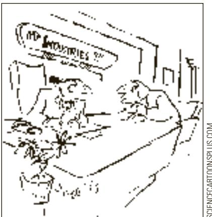
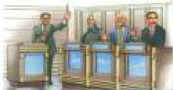
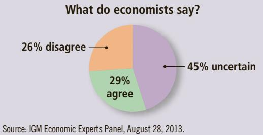
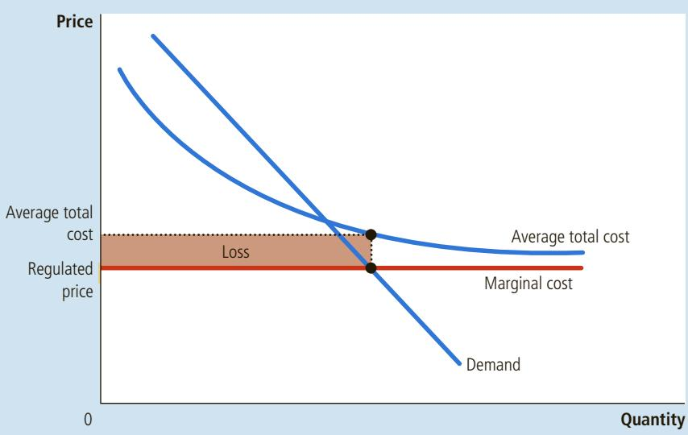
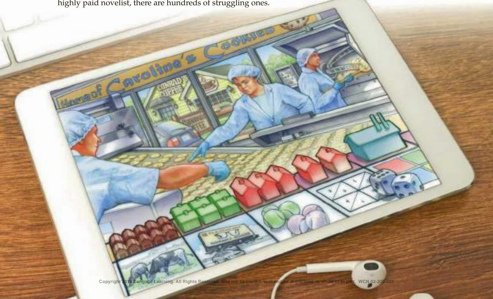
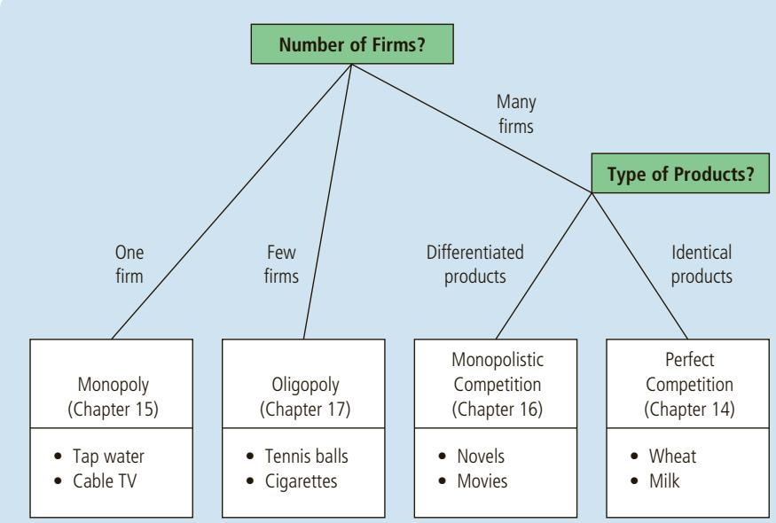

# Price Discrimination in Higher Education

Colleges and universities are increasingly charging different prices to different students, which makes data on the cost of education harder to interpret.

## Misconceptions 101: Why College Costs Aren’t Soaring

By Evan Soltas

Conventional wisdom suggests that U.S. colleges and universities have become sharply more expensive in recent years.

“When kids do graduate, the most daunting challenge can be the cost of college,” President Barack Obama said in his 2012 State of the Union address. “We can’t just keep subsidizing skyrocketing tuition; we’ll run out of money.”

At first, the view that the cost of college is rising appears to have data on its side. Published tuition prices and fees at colleges have risen three times faster than the rate of Consumer Price Index inflation since 1978, according to the Bureau of Labor Statistics….

Real tuition and fees have increased, to be sure, but hardly as significantly as the media often report or the data suggest at face value. The inflation-adjusted net price of college has risen only modestly over the last two decades, according to data from the College Board’s Annual Survey of Colleges.

What has happened is a shift toward price discrimination—offering multiple prices for the same product. Universities have offset the increase in sticker price for most families through an expansion of grant-based financial aid and scholarships. That has caused the BLS measure to rise without increasing the net cost.

Wealthier families now pay more than ever to send their children to college. But for

MICHAELJUNG/SHUTTERSTOCK

much of the middle class, the real net cost of college has not changed significantly; for much of the poor, the expansion of aid has increased the accessibility and affordability of a college education….

The nation’s most selective institutions are leading the trend toward income-based price discrimination. For example, at Harvard University, the majority of students receive financial aid: In 2012, one year of undergraduate education had a sticker price of \$54,496 and came with an average grant of roughly \$41,000.

In other words, the cost burden of college has become significantly more progressive since the 1990s. Students from wealthier families not only now pay more for their own educations but also have come to heavily subsidize the costs of the less fortunate. ■

Source: Bloomberg.com, November 27, 2012.

## 15-5 Public Policy toward Monopolies

We have seen that monopolies, in contrast to competitive markets, fail to allocate resources efficiently. Monopolies produce less than the socially desirable quantity of output and charge prices above marginal cost. Policymakers in the government can respond to the problem of monopoly in one of four ways:

• By trying to make monopolized industries more competitive

• By regulating the behavior of the monopolies

• By turning some private monopolies into public enterprises

• By doing nothing at all

## 15-5a Increasing Competition with Antitrust Laws

If Coca-Cola and PepsiCo wanted to merge, the deal would be closely examined by the federal government before it went into effect. The lawyers and economists in the Department of Justice might well decide that a merger between these two large soft-drink companies would make the U.S. soft-drink market substantially less competitive and, as a result, would reduce the economic well-being of the country as a whole. If so, the Department of Justice would challenge the merger in court, and if the judge agreed, the two companies would not be allowed to merge. It is precisely this kind of challenge that prevented software giant Microsoft from buying Intuit in 1994. Similarly, in 2011, the government blocked the phone giant AT&T from buying its competitor T-Mobile.

The government derives this power over private industry from the antitrust laws, a collection of statutes aimed at curbing monopoly power. The first and most important of these laws was the Sherman Antitrust Act, which Congress passed in 1890 to reduce the market power of the large and powerful “trusts” that were viewed as dominating the economy at the time. The Clayton Antitrust Act, passed in 1914, strengthened the government’s powers and authorized private lawsuits. As the U.S. Supreme Court once put it, the antitrust laws are “a comprehensive charter of economic liberty aimed at preserving free and unfettered competition as the rule of trade.”

SCIENCECARTOONSPLUS.COM

  
“But if we do merge with Amalgamated, we’ll have enough resources to fight antitrust violation caused by the merger.”

The antitrust laws give the government various ways to promote competition. They allow the government to prevent mergers, such as the merger the between AT&T and T-Mobile. At times, they allow the government to break up a large company into a group of smaller ones. Finally, the antitrust laws prevent companies from coordinating their activities in ways that make markets less competitive.

Antitrust laws have costs as well as benefits. Sometimes companies merge not to reduce competition but to lower costs through more efficient joint production. These benefits from mergers are sometimes called synergies. For example, many U.S. banks have merged in recent years and, by combining operations, have been able to reduce administrative staff. The airline industry has experienced a similar consolidation. If antitrust laws are to raise social welfare, the government must be able to determine which mergers are desirable and which are not. That is, it must be able

to measure and compare the social benefit from synergies with the social costs of reduced competition. Critics of the antitrust laws are skeptical that the government can perform the necessary cost–benefit analysis with sufficient accuracy. In the end, the application of antitrust laws is often controversial, even among the experts.

## 15-5b Regulation

Another way the government deals with the problem of monopoly is by regulating the behavior of monopolists. This solution is common in the case of natural monopolies, such as water and electric companies. These companies are not allowed to charge any price they want. Instead, government agencies regulate their prices.

What price should the government set for a natural monopoly? This question is not as easy as it might at first appear. One might conclude that the price should equal the monopolist’s marginal cost. If price equals marginal cost, customers will buy the quantity of the monopolist’s output that maximizes total surplus and the allocation of resources will be efficient.

There are, however, two practical problems with marginalcost pricing as a regulatory system. The first arises from the logic of cost curves. By definition, natural monopolies have

## ASK THE EXPERTS

## Airline Mergers

“If regulators had not approved mergers in the past decade between major networked airlines, travelers would be better off today.”

  
Source: IGM Economic Experts Panel, August 28, 2013.

declining average total cost. As we first discussed in Chapter 13, when average total cost is declining, marginal cost is less than average total cost. This situation is illustrated in Figure 10, which shows a firm with a large fixed cost and then constant marginal cost thereafter. If regulators were to set price equal to marginal cost, that price would be less than the firm’s average total cost and the firm would lose money. Instead of charging such a low price, the monopoly firm would just exit the industry.

Regulators can respond to this problem in various ways, none of which is perfect. One way is to subsidize the monopolist. In essence, the government picks up the losses inherent in marginal-cost pricing. Yet to pay for the subsidy, the government needs to raise money through taxation, which involves its own deadweight losses. Alternatively, the regulators can allow the monopolist to charge a price higher than marginal cost. If the regulated price equals average total cost, the monopolist earns exactly zero economic profit. Yet average-cost pricing leads to deadweight losses because the monopolist’s price no longer reflects the marginal cost of producing the good. In essence, average-cost pricing is like a tax on the good the monopolist is selling.

The second problem with marginal-cost pricing as a regulatory system (and with average-cost pricing as well) is that it gives the monopolist no incentive to reduce costs. Each firm in a competitive market tries to reduce its costs because lower costs mean higher profits. But if a regulated monopolist knows that regulators will reduce prices whenever costs fall, the monopolist will not benefit from lower costs. In practice, regulators deal with this problem by allowing monopolists to keep some of the benefits from lower costs in the form of higher profit, a practice that requires some departure from marginal-cost pricing.

## 15-5c Public Ownership

The third policy used by the government to deal with monopoly is public ownership. That is, rather than regulating a natural monopoly that is run by a private firm, the government can run the monopoly itself. This solution is common in many European countries, where the government owns and operates utilities

## FIGURE 10

## Marginal-Cost Pricing for a Natural Monopoly

Because a natural monopoly has declining average total cost, marginal cost is less than average total cost. Therefore, if regulators require a natural monopoly to charge a price equal to marginal cost, price will be below average total cost, and the monopoly will lose money.

such as telephone, water, and electric companies. In the United States, the government runs the Postal Service. The delivery of ordinary first-class mail is often thought to be a natural monopoly.

Economists usually prefer private to public ownership of natural monopolies. The key issue is how the ownership of the firm affects the costs of production. Private owners have an incentive to minimize costs as long as they reap part of the benefit in the form of higher profit. If the firm’s managers are doing a bad job of keeping costs down, the firm’s owners will fire them. By contrast, if the government bureaucrats who run a monopoly do a bad job, the losers are the customers and taxpayers, whose only recourse is the political system. The bureaucrats may become a special-interest group and attempt to block cost-reducing reforms. Put simply, as a way of ensuring that firms are well run, the voting booth is less reliable than the profit motive.

## 15-5d Doing Nothing

Each of the foregoing policies aimed at reducing the problem of monopoly has drawbacks. As a result, some economists argue that it is often best for the government not to try to remedy the inefficiencies of monopoly pricing. Here is the assessment of economist George Stigler, who won the Nobel Prize for his work in industrial organization:

A famous theorem in economics states that a competitive enterprise economy will produce the largest possible income from a given stock of resources. No real economy meets the exact conditions of the theorem, and all real economies will fall short of the ideal economy—a difference called “market failure.” In my view, however, the degree of “market failure” for the American economy is much smaller than the “political failure” arising from the imperfections of economic policies found in real political systems.

As this quotation makes clear, determining the proper role of the government in the economy requires judgments about politics as well as economics.

QuickQuiz

Describe the ways policymakers can respond to the inefficiencies caused by monopolies. List a potential problem with each of these policy responses.

## 15-6 Conclusion: The Prevalence of Monopolies

This chapter has discussed the behavior of firms that have control over the prices they charge. We have seen that these firms behave very differently from the competitive firms studied in the previous chapter. Table 2 summarizes some of the key similarities and differences between competitive and monopoly markets.

From the standpoint of public policy, a crucial result is that a monopolist produces less than the socially efficient quantity and charges a price above marginal cost. As a result, a monopoly causes deadweight losses. In some cases, these inefficiencies can be mitigated through price discrimination by the monopolist. But other times, they call for policymakers to take an active role.

How prevalent are the problems of monopoly? There are two answers to this question.

In one sense, monopolies are common. Most firms have some control over the prices they charge. They are not forced to charge the market price for their goods because their goods are not exactly the same as those offered by other firms. A Ford Taurus is not the same as a Toyota Camry. Ben and Jerry’s ice cream is not the same as Breyer’s. Each of these goods has a downward-sloping demand curve, which gives each producer some degree of monopoly power.

<table><tr><td></td><td>Competition</td><td>Monopoly</td></tr><tr><td colspan="3">Similarities</td></tr><tr><td>Goal of firms</td><td>Maximize profits</td><td>Maximize profits</td></tr><tr><td>Rule for maximizing</td><td>MR = MC</td><td>MR = MC</td></tr><tr><td>Can earn economic profits in the short run?</td><td>Yes</td><td>Yes</td></tr><tr><td colspan="3">Differences</td></tr><tr><td>Number of firms</td><td>Many</td><td>One</td></tr><tr><td>Marginal revenue</td><td>MR = P</td><td>MR &lt; P</td></tr><tr><td>Price</td><td>P = MC</td><td>P &gt; MC</td></tr><tr><td>Produces welfare-maximizing level of output?</td><td>Yes</td><td>No</td></tr><tr><td>Entry in the long run?</td><td>Yes</td><td>No</td></tr><tr><td>Can earn economic profits in the long run?</td><td>No</td><td>Yes</td></tr><tr><td>Price discrimination possible?</td><td>No</td><td>Yes</td></tr></table>

Yet firms with substantial monopoly power are rare. Few goods are truly unique. Most have substitutes that, even if not exactly the same, are similar. Ben and Jerry can raise the price of their ice cream a little without losing all their sales, but if they raise it a lot, sales will fall substantially as their customers switch to other brands.

In the end, monopoly power is a matter of degree. It is true that many firms have some monopoly power. It is also true that their monopoly power is usually limited. In such a situation, we will not go far wrong assuming that firms operate in competitive markets, even if that is not precisely the case.

## CHAPTER QuickQuiz

1. A firm is a natural monopoly if it exhibits the following as its output increases:

a. decreasing marginal revenue.

b. increasing marginal cost.

c. decreasing average revenue.

d. decreasing average total cost.

2. For a profit-maximizing monopoly that charges the same price to all consumers, what is the relationship between price $P ,$ marginal revenue MR, and marginal cost MC?

a. $P = M R { \mathrm { ~ a n d ~ } } M R = M C .$

b. $P > M R { \mathrm { ~ a n d ~ } } M R = M C .$

c. $P = M R { \mathrm { ~ a n d ~ } } M R > M C$

d. $P > M R$ and $M R > M C .$

3. If a monopoly’s fixed costs increase, its price will and its profit will a. increase, decrease b. decrease, increase c. increase, stay the same d. stay the same, decrease

4. Compared to the social optimum, a monopoly firm chooses

a. a quantity that is too low and a price that is too high.

b. a quantity that is too high and a price that is too low.

c. a quantity and a price that are both too high.

d. a quantity and a price that are both too low.

5. The deadweight loss from monopoly arises because a. the monopoly firm makes higher profits than a competitive firm would.

b. some potential consumers who forgo buying the good value it more than its marginal cost.

c. consumers who buy the good have to pay more than marginal cost, reducing their consumer surplus.

d. the monopoly firm chooses a quantity that fails to equate price and average revenue.

6. When a monopolist switches from charging a single price to practicing perfect price discrimination, it reduces

a. the quantity produced.

b. the firm’s profit.

c. consumer surplus.

d. total surplus.

## SUMMARY

A monopoly is a firm that is the sole seller in its market. A monopoly arises when a single firm owns a key resource, when the government gives a firm the exclusive right to produce a good, or when a single firm can supply the entire market at a lower cost than many firms could.

Because a monopoly is the sole producer in its market, it faces a downward-sloping demand curve for its product. When a monopoly increases production by 1 unit, it causes the price of its good to fall, which reduces the amount of revenue earned on all units produced. As a result, a monopoly’s marginal revenue is always below the price of its good.

Like a competitive firm, a monopoly firm maximizes profit by producing the quantity at which marginal revenue equals marginal cost. The monopoly then sets the price at which that quantity is demanded. Unlike a competitive firm, a monopoly firm’s price exceeds its marginal revenue, so its price exceeds marginal cost.

A monopolist’s profit-maximizing level of output is below the level that maximizes the sum of consumer and producer surplus. That is, when the monopoly charges a price above marginal cost, some consumers

## KEY CONCEPTS

who value the good more than its cost of production do not buy it. As a result, monopoly causes deadweight losses similar to those caused by taxes.

A monopolist can often increase profits by charging different prices for the same good based on a buyer’s willingness to pay. This practice of price discrimination can raise economic welfare by getting the good to some consumers who would otherwise not buy it. In the extreme case of perfect price discrimination, the deadweight loss of monopoly is completely eliminated and the entire surplus in the market goes to the monopoly producer. More generally, when price discrimination is imperfect, it can either raise or lower welfare compared to the outcome with a single monopoly price.

Policymakers can respond to the inefficiency of monopoly behavior in four ways. They can use the antitrust laws to try to make the industry more competitive. They can regulate the prices that the monopoly charges. They can turn the monopolist into a government-run enterprise. Or, if the market failure is deemed small compared to the inevitable imperfections of policies, they can do nothing at all.

## QUESTIONS FOR REVIEW

1. Give an example of a government-created monopoly. Is creating this monopoly necessarily bad public policy? Explain.

2. Define natural monopoly. What does the size of a market have to do with whether an industry is a natural monopoly?

3. Why is a monopolist’s marginal revenue less than the price of its good? Can marginal revenue ever be negative? Explain.

4. Draw the demand, marginal-revenue, averagetotal-cost, and marginal-cost curves for a monopolist. Show the profit-maximizing level of output, the profit-maximizing price, and the amount of profit.

5. In your diagram from the previous question, show the level of output that maximizes total surplus. Show the deadweight loss from the monopoly. Explain your answer.

6. Give two examples of price discrimination. In each case, explain why the monopolist chooses to follow this business strategy.

7. What gives the government the power to regulate mergers between firms? Give a good reason and a bad reason (from the perspective of society’s welfare) that two firms might want to merge.

8. Describe the two problems that arise when regulators tell a natural monopoly that it must set a price equal to marginal cost.

## PROBLEMS AND APPLICATIONS

1. A publisher faces the following demand schedule for the next novel from one of its popular authors:

<table><tr><td>Price</td><td>Quantity Demanded</td></tr><tr><td>$100</td><td>0 novels</td></tr><tr><td>90</td><td>100,000</td></tr><tr><td>80</td><td>200,000</td></tr><tr><td>70</td><td>300,000</td></tr><tr><td>60</td><td>400,000</td></tr><tr><td>50</td><td>500,000</td></tr><tr><td>40</td><td>600,000</td></tr><tr><td>30</td><td>700,000</td></tr><tr><td>20</td><td>800,000</td></tr><tr><td>10</td><td>900,000</td></tr><tr><td>0</td><td>1,000,000</td></tr></table>

The author is paid \$2 million to write the book, and the marginal cost of publishing the book is a constant \$10 per book.

a. Compute total revenue, total cost, and profit at each quantity. What quantity would a profit-maximizing publisher choose? What price would it charge?

b. Compute marginal revenue. (Recall that MR 5 ∆TR/∆Q.) How does marginal revenue compare to the price? Explain.

c. Graph the marginal-revenue, marginal-cost, and demand curves. At what quantity do the marginal-revenue and marginal-cost curves cross? What does this signify?

d. In your graph, shade in the deadweight loss. Explain in words what this means.

e. If the author were paid \$3 million instead of \$2 million to write the book, how would this affect the publisher’s decision regarding what price to charge? Explain.

f. Suppose the publisher was not profit-maximizing but was concerned with maximizing economic efficiency. What price would it charge for the book? How much profit would it make at this price?

2. A small town is served by many competing supermarkets, which have the same constant marginal cost.

a. Using a diagram of the market for groceries, show the consumer surplus, producer surplus, and total surplus.

b. Now suppose that the independent supermarkets combine into one chain. Using a new diagram, show the new consumer surplus, producer surplus, and total surplus. Relative to the competitive market, what is the transfer from consumers to producers? What is the deadweight loss?

3. Johnny Rockabilly has just finished recording his latest CD. His record company’s marketing department determines that the demand for the CD is as follows:

<table><tr><td>Price</td><td>Number of CDs</td></tr><tr><td>$24</td><td>10,000</td></tr><tr><td>22</td><td>20,000</td></tr><tr><td>20</td><td>30,000</td></tr><tr><td>18</td><td>40,000</td></tr><tr><td>16</td><td>50,000</td></tr><tr><td>14</td><td>60,000</td></tr></table>

The company can produce the CD with no fixed cost and a variable cost of \$5 per CD.

a. Find total revenue for quantity equal to 10,000, 20,000, and so on. What is the marginal revenue for each 10,000 increase in the quantity sold?

b. What quantity of CDs would maximize profit? What would the price be? What would the profit be?

c. If you were Johnny’s agent, what recording fee would you advise Johnny to demand from the record company? Why?

4. A company is considering building a bridge across a river. The bridge would cost \$2 million to build and nothing to maintain. The following table shows the company’s anticipated demand over the lifetime of the bridge:

<table><tr><td>Price per Crossing</td><td>Number of Crossings, in Thousands</td></tr><tr><td>$8</td><td>0</td></tr><tr><td>7</td><td>100</td></tr><tr><td>6</td><td>200</td></tr><tr><td>5</td><td>300</td></tr><tr><td>4</td><td>400</td></tr><tr><td>3</td><td>500</td></tr><tr><td>2</td><td>600</td></tr><tr><td>1</td><td>700</td></tr><tr><td>0</td><td>800</td></tr></table>

a. If the company were to build the bridge, what would be its profit-maximizing price? Would that be the efficient level of output? Why or why not?

b. If the company is interested in maximizing profit, should it build the bridge? What would be its profit or loss?

c. If the government were to build the bridge, what price should it charge?

d. Should the government build the bridge? Explain.

5. Consider the relationship between monopoly pricing and price elasticity of demand.

a. Explain why a monopolist will never produce a quantity at which the demand curve is inelastic. (Hint: If demand is inelastic and the firm raises its price, what happens to total revenue and total costs?)

b. Draw a diagram for a monopolist, precisely labeling the portion of the demand curve that is inelastic. (Hint: The answer is related to the marginal-revenue curve.)

c. On your diagram, show the quantity and price that maximize total revenue.

6. You live in a town with 300 adults and 200 children, and you are thinking about putting on a play to entertain your neighbors and make some money. A play has a fixed cost of \$2,000, but selling an extra ticket has zero marginal cost. Here are the demand schedules for your two types of customer:

<table><tr><td>Price</td><td>Adults</td><td>Children</td></tr><tr><td>$10</td><td>0</td><td>0</td></tr><tr><td>9</td><td>100</td><td>0</td></tr><tr><td>8</td><td>200</td><td>0</td></tr><tr><td>7</td><td>300</td><td>0</td></tr><tr><td>6</td><td>300</td><td>0</td></tr><tr><td>5</td><td>300</td><td>100</td></tr><tr><td>4</td><td>300</td><td>200</td></tr><tr><td>3</td><td>300</td><td>200</td></tr><tr><td>2</td><td>300</td><td>200</td></tr><tr><td>1</td><td>300</td><td>200</td></tr><tr><td>0</td><td>300</td><td>200</td></tr></table>

a. To maximize profit, what price would you charge for an adult ticket? For a child’s ticket? How much profit do you make?

b. The city council passes a law prohibiting you from charging different prices to different customers. What price do you set for a ticket now? How much profit do you make?

c. Who is worse off because of the law prohibiting price discrimination? Who is better off? (If you can, quantify the changes in welfare.)

d. If the fixed cost of the play were \$2,500 rather than \$2,000, how would your answers to parts (a), (b), and (c) change?

7. The residents of the town Ectenia all love economics, and the mayor proposes building an economics museum. The museum has a fixed cost of \$2,400,000 and no variable costs. There are 100,000 town residents, and each has the same demand for museum visits: $Q ^ { \mathrm { D } } = 1 0 ^ { \circ } - P ,$ where P is the price of admission.

a. Graph the museum’s average-total-cost curve and its marginal-cost curve. What kind of market would describe the museum?

b. The mayor proposes financing the museum with a lump-sum tax of \$24 and then opening the museum to the public for free. How many times would each person visit? Calculate the benefit each person would get from the museum, measured as consumer surplus minus the new tax.

c. The mayor’s anti-tax opponent says the museum should finance itself by charging an admission fee. What is the lowest price the museum can charge without incurring losses? (Hint: Find the number of visits and museum profits for prices of \$2, \$3, \$4, and \$5.)

d. For the break-even price you found in part (c), calculate each resident’s consumer surplus. Compared with the mayor’s plan, who is better off with this admission fee, and who is worse off? Explain.

e. What real-world considerations absent in the problem above might provide reasons to favor an admission fee?

8. Henry Potter owns the only well in town that produces clean drinking water. He faces the following demand, marginal revenue, and marginal cost curves:

Demand: P 5 70 2 Q

Marginal Revenue: MR 5 70 2 2Q

$$
\text {Marginal Cost:} M C = 1 0 + Q
$$

a. Graph these three curves. Assuming that Mr. Potter maximizes profit, what quantity does he produce? What price does he charge? Show these results on your graph.

b. Mayor George Bailey, concerned about water consumers, is considering a price ceiling that is 10 percent below the monopoly price derived in part (a). What quantity would be demanded at this new price? Would the profit-maximizing Mr. Potter produce that amount? Explain. (Hint: Think about marginal cost.)

c. George’s Uncle Billy says that a price ceiling is a bad idea because price ceilings cause shortages. Is he right in this case? What size shortage would the price ceiling create? Explain.

d. George’s friend Clarence, who is even more concerned about consumers, suggests a price ceiling 50 percent below the monopoly price. What quantity would be demanded at this price? How much would Mr. Potter produce? In this case, is Uncle Billy right? What size shortage would the price ceiling create?

9. Only one firm produces and sells soccer balls in the country of Wiknam, and as the story begins, international trade in soccer balls is prohibited. The following equations describe the monopolist’s demand, marginal revenue, total cost, and marginal cost:

$$
\begin{array}{c} \text {Demand:} P = 1 0 - Q \\ \text {Marginal Revenue:} M R = 1 0 - 2 Q \\ \text {Total Cost:} T C = 3 + Q + 0. 5   Q ^ {2} \\ \text {Marginal Cost:} M C = 1 + Q, \end{array}
$$

where Q is quantity and P is the price measured in Wiknamian dollars.

a. How many soccer balls does the monopolist produce? At what price are they sold? What is the monopolist’s profit?

b. One day, the King of Wiknam decrees that henceforth there will be free trade—either imports or exports—of soccer balls at the world price of \$6. The firm is now a price taker in a competitive market. What happens to domestic production of soccer balls? To domestic consumption? Does Wiknam export or import soccer balls?

c. In our analysis of international trade in Chapter 9, a country becomes an exporter when the price without trade is below the world price and an importer when the price without trade is above the world price. Does that conclusion hold in your answers to parts (a) and (b)? Explain.

d. Suppose that the world price was not \$6 but, instead, happened to be exactly the same as the domestic price without trade as determined in part (a). Would allowing trade have changed anything in the Wiknamian economy? Explain. How does the result here compare with the analysis in Chapter 9?

10. Based on market research, a film production company in Ectenia obtains the following information about the demand and production costs of its new DVD:

$$
\text {Demand:} P = 1,000 - 10Q
$$

$$
\text {Total Revenue:} T R = 1,000Q - 10Q^2
$$

$$
\text {Marginal Revenue:} M R = 1,000 - 20Q
$$

Marginal Cost: MC 5 100 1 10Q, where Q indicates the number of copies sold and P is the price in Ectenian dollars.

a. Find the price and quantity that maximize the company’s profit.

b. Find the price and quantity that would maximize social welfare.

c. Calculate the deadweight loss from monopoly.

d. Suppose, in addition to the costs above, the director of the film has to be paid. The company is considering four options:

i. a flat fee of 2,000 Ectenian dollars.

ii. 50 percent of the profits.

iii. 150 Ectenian dollars per unit sold.

iv. 50 percent of the revenue.

For each option, calculate the profit-maximizing price and quantity. Which, if any, of these compensation schemes would alter the deadweight loss from monopoly? Explain.

11. Larry, Curly, and Moe run the only saloon in town. Larry wants to sell as many drinks as possible without losing money. Curly wants the saloon to bring in as much revenue as possible. Moe wants to make the largest possible profits. Using a single diagram of the saloon’s demand curve and its cost curves, show the price and quantity combinations favored by each of the three partners. Explain. (Hint: Only one of these partners will want to set marginal revenue equal to marginal cost.)

12. Many schemes for price discrimination involve some cost. For example, discount coupons take up the time and resources of both the buyer and the seller. This question considers the implications of costly price discrimination. To keep things simple, let’s assume that our monopolist’s production costs are simply proportional to output so that average total cost and marginal cost are constant and equal to each other.

a. Draw the cost, demand, and marginal-revenue curves for the monopolist. Show the price the monopolist would charge without price discrimination.

b. In your diagram, mark the area equal to the monopolist’s profit and call it X. Mark the area equal to consumer surplus and call it Y. Mark the area equal to the deadweight loss and call it Z.

c. Now suppose that the monopolist can perfectly price discriminate. What is the monopolist’s profit? (Give your answer in terms of X, Y, and Z.)

d. What is the change in the monopolist’s profit from price discrimination? What is the change in total surplus from price discrimination? Which change is larger? Explain. (Give your answer in terms of X, Y, and Z.)

e. Now suppose that there is some cost associated with price discrimination. To model this cost, let’s assume that the monopolist has to pay a fixed cost C to price discriminate. How would a monopolist make the decision whether to pay this fixed cost? (Give your answer in terms of X, Y, Z, and C.)

f. How would a benevolent social planner, who cares about total surplus, decide whether the monopolist should price discriminate? (Give your answer in terms of X, Y, Z, and C.)

g. Compare your answers to parts (e) and (f). How does the monopolist’s incentive to price discriminate differ from the social planner’s? Is it possible that the monopolist will price discriminate even though doing so is not socially desirable?

To find additional study resources, visit cengagebrain.com, and search for “Mankiw.”

## Monopolistic Competition

ou walk into a bookstore to buy a book to read during your next vacation. On the store’s shelves you find a Patricia Cornwell mystery, a Stephen King thriller, a Nathaniel Philbrick history, a Suzanne Collins dystopian survival romance, and many other choices. When you pick out a book and buy it, what kind of market are you participating in?

On the one hand, the market for books seems competitive. As you look over the shelves at your bookstore, you find many authors and many publishers vying for your attention. A buyer in this market has thousands of competing products from which to choose. And because anyone can enter the industry by writing and publishing a book, the book business is not very profitable. For every highly paid novelist, there are hundreds of struggling ones.

On the other hand, the market for books seems monopolistic. Because each book is unique, publishers have some latitude in choosing what price to charge. The sellers in this market are price makers rather than price takers. And indeed, the price of books greatly exceeds marginal cost. The price of a typical hardcover novel, for instance, is about \$25, whereas the cost of printing one additional copy of the novel is less than \$5.

The market for novels fits neither the competitive nor the monopoly model. Instead, it is best described by the model of monopolistic competition, the subject of this chapter. The term “monopolistic competition” might at first seem to be an oxymoron, like “jumbo shrimp.” But as we will see, monopolistically competitive industries are monopolistic in some ways and competitive in others. The model describes not only the publishing industry but also the market for many other goods and services.

## 16-1 Between Monopoly and Perfect Competition

The previous two chapters analyzed markets with many competitive firms and markets with a single monopoly firm. In Chapter 14, we saw that the price in a perfectly competitive market always equals the marginal cost of production. We also saw that, in the long run, entry and exit drive economic profit to zero, so the price also equals average total cost. In Chapter 15, we saw how monopoly firms can use their market power to keep prices above marginal cost, leading to a positive economic profit for the firm and a deadweight loss for society. Competition and monopoly are extreme forms of market structure. Competition occurs when there are many firms in a market offering essentially identical products; monopoly occurs when there is only one firm in a market.

Although the cases of perfect competition and monopoly illustrate some important ideas about how markets work, most markets in the economy include elements of both these cases and, therefore, are not completely described by either of them. The typical firm in the economy faces competition, but the competition is not so rigorous that it makes the firm a price taker like the firms analyzed in Chapter 14. The typical firm also has some degree of market power, but its market power is not so great that the firm can be described exactly by the monopoly model presented in Chapter 15. In other words, many industries fall somewhere between the polar cases of perfect competition and monopoly. Economists call this situation imperfect competition.

a market structure in which only a few sellers offer similar or identical products

One type of imperfectly competitive market is an oligopoly, a market with only a few sellers, each offering a product that is similar or identical to the products offered by other sellers in the market. Economists measure a market’s domination by a small number of firms with a statistic called the concentration ratio, which is the percentage of total output in the market supplied by the four largest firms. In the U.S. economy, most industries have a four-firm concentration ratio under 50 percent, but in some industries, the biggest firms play a more dominant role. Highly concentrated industries include the market for major household appliances (which has a concentration ratio of 90 percent), tires (91 percent), light bulbs (92 percent), soda (94 percent), and wireless telecommunications (95 percent). These industries are best described as oligopolies. In the next chapter we see that the small number of firms in oligopolies makes strategic interactions among them a key part of the analysis. That is, in choosing how much to produce and what price to charge, each firm in an oligopoly is concerned not only with what its competitors are doing but also with how its competitors would react to what it might do.

A second type of imperfectly competitive market is called monopolistic competition. This describes a market structure in which there are many firms selling products that are similar but not identical. In a monopolistically competitive market, each firm has a monopoly over the product it makes, but many other firms make similar products that compete for the same customers.

monopolistic competition a market structure in which many firms sell products that are similar but not identical

To be more precise, monopolistic competition describes a market with the following attributes:

• Many sellers: There are many firms competing for the same group of customers.

• Product differentiation: Each firm produces a product that is at least slightly different from those of other firms. Thus, rather than being a price taker, each firm faces a downward-sloping demand curve.

• Free entry and exit: Firms can enter or exit the market without restriction. Thus, the number of firms in the market adjusts until economic profits are driven to zero.

A moment’s thought reveals a long list of markets with these attributes: books, computer games, restaurants, piano lessons, cookies, clothing, and so on.

Monopolistic competition, like oligopoly, is a market structure that lies between the extreme cases of perfect competition and monopoly. But oligopoly and monopolistic competition are quite different. Oligopoly departs from the perfectly competitive ideal of Chapter 14 because there are only a few sellers in the market. The small number of sellers makes rigorous competition less likely and strategic interactions among them vitally important. By contrast, a monopolistically competitive market has many sellers, each of which is small compared to the market. It departs from the perfectly competitive ideal because each of the sellers offers a somewhat different product.

Figure 1 summarizes the four types of market structure. The first question to ask about any market is how many firms there are. If there is only one firm, the

## FIGURE 1

## The Four Types of Market Structure

Economists who study industrial organization divide markets into four types: monopoly, oligopoly, monopolistic competition, and perfect competition.

market is a monopoly. If there are only a few firms, the market is an oligopoly. If there are many firms, we need to ask another question: Do the firms sell identical or differentiated products? If the many firms sell identical products, the market is perfectly competitive. But if the many firms sell differentiated products, the market is monopolistically competitive.

Because reality is never as clear-cut as theory, at times you may find it hard to decide what structure best describes a market. There is, for instance, no magic number that separates “few” from “many” when counting the number of firms. (Do the approximately dozen companies that now sell cars in the United States make this market an oligopoly, or is the market more competitive? The answer is open to debate.) Similarly, there is no sure way to determine when products are differentiated and when they are identical. (Are different brands of milk really the same? Again, the answer is debatable.) When analyzing actual markets, economists have to keep in mind the lessons learned from studying all types of market structure and then apply each lesson as it seems appropriate.

Now that we understand how economists define the various types of market structure, we can continue our analysis of each of them. In this chapter we examine monopolistic competition. In the next chapter we analyze oligopoly.

QuickQuiz

Define oligopoly and monopolistic competition and give an example of each.

## 16-2 Competition with Differentiated Products

To understand monopolistically competitive markets, we first consider the decisions facing an individual firm. We then examine what happens in the long run as firms enter and exit the industry. Next, we compare the equilibrium under monopolistic competition to the equilibrium under perfect competition that we examined in Chapter 14. Finally, we consider whether the outcome in a monopolistically competitive market is desirable from the standpoint of society as a whole.
