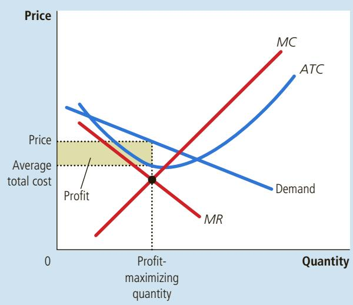
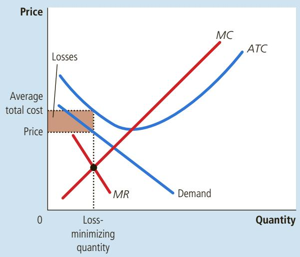
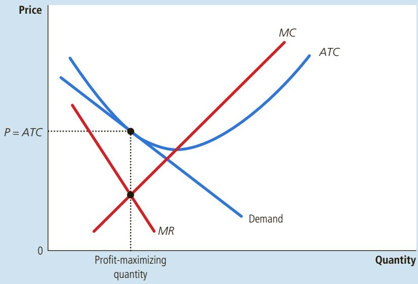
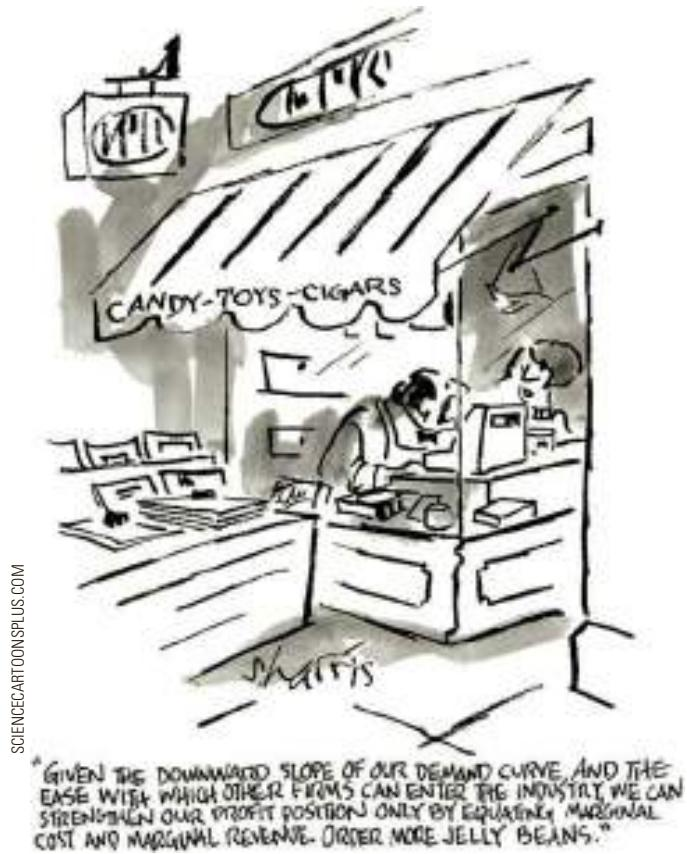
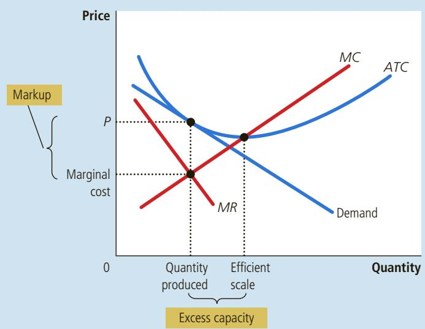
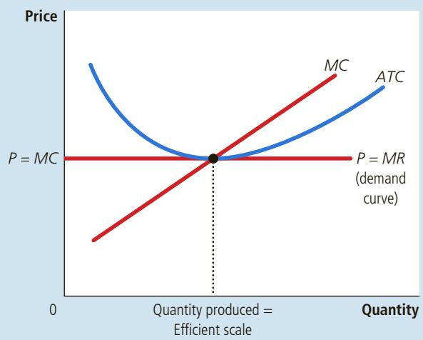
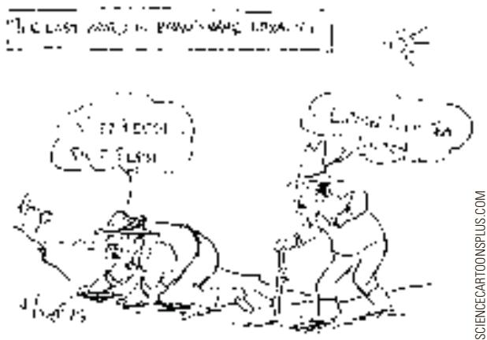

## 16-2a The Monopolistically Competitive Firm in the Short Run

Each firm in a monopolistically competitive market is, in many ways, like a monopoly. Because its product is different from those offered by other firms, it faces a downward-sloping demand curve. (By contrast, a perfectly competitive firm faces a horizontal demand curve at the market price.) Thus, the monopolistically competitive firm follows a monopolist’s rule for profit maximization: It chooses to produce the quantity at which marginal revenue equals marginal cost and then uses its demand curve to find the price at which it can sell that quantity.

Figure 2 shows the cost, demand, and marginal-revenue curves for two typical firms, each in a different monopolistically competitive industry. In both panels of the figure, the profit-maximizing quantity is found at the intersection of the marginal-revenue and marginal-cost curves. The two panels show different outcomes for the firm’s profit. In panel (a), price exceeds average total cost, so the firm makes a profit. In panel (b), price is below average total cost. In this case, the firm is unable to make a positive profit, so the best it can do is to minimize its losses.

(b) Firm Makes Losses

Monopolistic competitors, like monopolists, maximize profit by producing the quantity at which marginal revenue equals marginal cost. The firm in panel (a) makes a profit because, at this quantity, price is greater than average total cost. The firm in panel (b) makes losses because, at this quantity, price is less than average total cost.

(a) Firm Makes Prot  
  
Monopolistic Competitors in the Short Run

## FIGURE 2

All this should seem familiar. A monopolistically competitive firm chooses its quantity and price just as a monopoly does. In the short run, these two types of market structure are similar.

## 16-2b The Long-Run Equilibrium

The situations depicted in Figure 2 do not last long. When firms are making profits, as in panel (a), new firms have an incentive to enter the market. This entry increases the number of products from which customers can choose and, therefore, reduces the demand faced by each firm already in the market. In other words, profit encourages entry, and entry shifts the demand curves faced by the incumbent firms to the left. As the demand for incumbent firms’ products falls, these firms experience declining profit.

Conversely, when firms are making losses, as in panel (b), firms in the market have an incentive to exit. As firms exit, customers have fewer products from which to choose. This decrease in the number of firms expands the demand faced by those firms that stay in the market. In other words, losses encourage exit, and exit shifts the demand curves of the remaining firms to the right. As the demand for the remaining firms’ products rises, these firms experience rising profits (that is, declining losses).

This process of entry and exit continues until the firms in the market are making exactly zero economic profit. Figure 3 depicts the long-run equilibrium. Once the market reaches this equilibrium, new firms have no incentive to enter, and existing firms have no incentive to exit.

## FIGURE 3

## A Monopolistic Competitor in the Long Run

In a monopolistically competitive market, if firms are making profits, new firms enter, causing the demand curves for the incumbent firms to shift to the left. Similarly, if firms are making losses, some of the firms in the market exit, causing the demand curves of the remaining firms to shift to the right. Because of these shifts in demand, monopolistically competitive firms eventually find themselves in the long-run equilibrium shown here. In this long-run equilibrium, price equals average total cost, and each firm earns zero profit.

Notice that the demand curve in this figure just barely touches the average-total-cost curve. Mathematically, we say the two curves are tangent to each other. These two curves must be tangent once entry and exit have driven profit to zero. Because profit per unit sold is the difference between price (found on the demand curve) and average total cost, the maximum profit is zero only if these two curves touch each other without crossing. Also note that this point of tangency occurs at the same quantity where marginal revenue equals marginal cost. That these two points line up is not a coincidence: It is required because this particular quantity maximizes profit and the maximum profit is exactly zero in the long run.

To sum up, two characteristics describe the long-run equilibrium in a monopolistically competitive market:

• As in a monopoly market, price exceeds marginal cost (P . MC). This conclusion arises because profit maximization requires marginal revenue to equal marginal cost (MR 5 MC) and because the downward-sloping demand curve makes marginal revenue less than the price (MR , P).

• As in a competitive market, price equals average total cost (P 5 ATC). This conclusion arises because free entry and exit drive economic profit to zero.

The second characteristic shows how monopolistic competition differs from monopoly. Because a monopoly is the sole seller of a product without close substitutes, it can earn positive economic profit, even in the long run. By contrast, because there is free entry into a monopolistically competitive market, the economic profit of a firm in this type of market is driven to zero.

## 16-2c Monopolistic versus Perfect Competition

Figure 4 compares the long-run equilibrium under monopolistic competition to the long-run equilibrium under perfect competition. (Chapter 14 discussed the equilibrium with perfect competition.) There are two noteworthy differences between monopolistic and perfect competition: excess capacity and the markup.

Excess Capacity As we have just seen, the process of entry and exit drives each firm in a monopolistically competitive market to a point of tangency between its demand and average-total-cost curves. Panel (a) of Figure 4 shows that the quantity of output at this point is smaller than the quantity that minimizes average total cost. Thus, under monopolistic competition, firms produce on the downward-sloping portion of their average-total-cost curves. In this way, monopolistic competition contrasts starkly with perfect competition. As panel (b) of Figure 4 shows, free entry in competitive markets drives firms to produce at the minimum of average total cost.

The quantity that minimizes average total cost is called the efficient scale of the firm. In the long run, perfectly competitive firms produce at the efficient scale, whereas monopolistically competitive firms produce below this level. Firms are said to have excess capacity under monopolistic competition. In other words, a monopolistically competitive firm, unlike a perfectly competitive firm, could increase the quantity it produces and lower the average total cost of production. The firm forgoes this opportunity because it would need to cut its price to sell the additional output. It is more profitable for a monopolistic competitor to continue operating with excess capacity.

## FIGURE 4

Monopolistic versus Perfect Competition

Panel (a) shows the long-run equilibrium in a monopolistically competitive market, and panel (b) shows the long-run equilibrium in a perfectly competitive market. Two differences are notable. (1) The perfectly competitive firm produces at the efficient scale, where average total cost is minimized. By contrast, the monopolistically competitive firm produces at less than the efficient scale. (2) Price equals marginal cost under perfect competition, but price is above marginal cost under monopolistic competition.

(a) Monopolistically Competitive Firm  

(b) Perfectly Competitive Firm  

Markup over Marginal Cost A second difference between perfect competition and monopolistic competition is the relationship between price and marginal cost. For a perfectly competitive firm, such as the one shown in panel (b) of Figure 4, price equals marginal cost. For a monopolistically competitive firm, such as the one shown in panel (a), price exceeds marginal cost because the firm always has some market power.

How is this markup over marginal cost consistent with free entry and zero profit? The zero-profit condition ensures only that price equals average total cost. It does not ensure that price equals marginal cost. Indeed, in the long-run equilibrium, monopolistically competitive firms operate on the declining portion of their average-total-cost curves, so marginal cost is below average total cost. Thus, for price to equal average total cost, price must be above marginal cost.

In this relationship between price and marginal cost, we see a key behavioral difference between perfect competitors and monopolistic competitors. Imagine that you were to ask a firm the following question: “Would you like to see another customer come through your door ready to buy from you at your current price?” A perfectly competitive firm would answer that it didn’t care. Because price exactly equals marginal cost, the profit from an extra unit sold is zero. By contrast, a monopolistically competitive firm is always eager to get another customer. Because its price exceeds marginal cost, an extra unit sold at the posted price means more profit.

According to an old quip, monopolistically competitive markets are those in which sellers send Christmas cards to the buyers. Trying to attract more customers makes sense only if price exceeds marginal cost.

## 16-2d Monopolistic Competition and the Welfare of Society

Is the outcome in a monopolistically competitive market desirable from the standpoint of society as a whole? Can policymakers improve on the market outcome? In previous chapters we evaluated markets from the standpoint of efficiency by asking whether society is getting the most it can out of its scarce resources. We learned that competitive markets lead to efficient outcomes, unless there are externalities, whereas monopoly markets lead to deadweight losses. Monopolistically competitive markets are more complex than either of these polar cases, so evaluating welfare in these markets is a more subtle exercise.

One source of inefficiency in monopolistically competitive markets is the markup of price over marginal cost. Because of the markup, some consumers who value the good at more than the marginal cost of production (but less than the price) will be deterred from buying it. Thus, a monopolistically competitive market has the normal deadweight loss of monopoly pricing.

This outcome is undesirable compared with the efficient quantity that arises when price equals marginal cost, but policymakers don’t have an easy way to fix the problem. To enforce marginal-cost pricing, they would need to regulate all firms that produce differentiated products. Because such products are so common in the economy, the administrative burden of such regulation would be overwhelming.

Moreover, regulating monopolistic competitors entails all the problems of regulating natural monopolies. In particular, because monopolistic competitors are making zero profits already, requiring them to lower their prices to equal marginal cost would cause them to make losses. To keep these firms in business, the government would need to help them cover these losses. Rather than raise taxes to pay for these subsidies, policymakers often decide it is better to live with the inefficiency of monopolistic pricing.

Another source of inefficiency under monopolistic competition is that the number of firms in the market may not be “ideal.” That is, there may be too much or too little entry. One way to think about this problem is in terms of the externalities associated with entry. Whenever a new firm considers entering the market with a new product, it takes into account only the profit it would make. Yet its entry would also have the following two effects that are external to the firm:

• The product-variety externality: Because consumers get some consumer surplus from the introduction of a new product, the entry of a new firm conveys a positive externality on consumers.

• The business-stealing externality: Because other firms lose customers and profits when faced with a new competitor, the entry of a new firm imposes a negative externality on existing firms.

Thus, in a monopolistically competitive market, the entry of new firms entails both positive and negative externalities. Depending on which externality is larger, a monopolistically competitive market could have either too few or too many products.

Both of these externalities are closely related to the conditions for monopolistic competition. The product-variety externality arises because new firms offer products that differ from those of the existing firms. The business-stealing externality arises because firms post a price above marginal cost and, therefore, are always eager to sell additional units. Conversely, because perfectly competitive firms produce identical goods and charge a price equal to marginal cost, neither of these externalities exists under perfect competition.

In the end, we can conclude only that monopolistically competitive markets do not have all the desirable welfare properties of perfectly competitive markets. That is, the invisible hand does not ensure that total surplus is maximized under monopolistic competition. Yet because the inefficiencies are subtle, hard to measure, and hard to fix, there is no easy way for public policy to improve the market outcome.

List the three key attributes of monopolistic competition. • Draw and QuickQuiz explain a diagram to show the long-run equilibrium in a monopolistically competitive market. How does this equilibrium differ from that in a perfectly competitive market?

## 16-3 Advertising

It is nearly impossible to go through a typical day in a modern economy without being bombarded with advertising. Whether you are surfing the Internet, posting on Facebook, reading a magazine, watching television, or driving down the highway, some firm will try to convince you to buy its product. Such behavior is a natural feature of monopolistic competition (as well as some oligopolistic industries). When firms sell differentiated products and charge prices above marginal cost, each firm has an incentive to advertise to attract more buyers to its particular product.

The amount of advertising varies substantially across products. Firms that sell highly differentiated consumer goods, such as over-the-counter drugs, perfumes, soft drinks, razor blades, breakfast cereals, and dog food, typically spend between 10 and 20 percent of their revenue on advertising. Firms that sell industrial products, such as drill presses and communications satellites, typically spend very little on advertising. And firms that sell homogeneous products, such as wheat, salt, sugar, and crude oil, spend nothing at all.

For the economy as a whole, about 2 percent of total firm revenue is spent on advertising. This spending takes many forms, including ads on web sites, social media, television, radio, and billboards and in newspapers, magazines, and direct mail.

## 16-3a The Debate over Advertising

Is society wasting the resources it devotes to advertising? Or does advertising serve a valuable purpose? Assessing the social value of advertising is difficult and often generates heated argument among economists. Let’s consider both sides of the debate.

The Critique of Advertising Critics of advertising argue that firms advertise to manipulate people’s tastes. Much advertising is psychological rather than informational. Consider, for example, the typical television commercial for some brand of soft drink. The commercial most likely does not tell the viewer about the product’s price or quality. Instead, it might show a group of happy people at a party on a beach on a beautiful sunny day. In their hands are cans of the soft drink. The goal of the commercial is to convey a subconscious (if not subtle) message: “You too can have many friends and be happy, if you drink our product.” Critics of advertising argue that such a commercial creates a desire that otherwise might not exist.

Critics also argue that advertising impedes competition. Advertising often tries to convince consumers that products are more different than they truly are. By increasing the perception of product differentiation and fostering brand loyalty, advertising makes buyers less concerned with price differences among similar goods, thereby making the demand for a particular brand less elastic. When a firm faces a less elastic demand curve, it can increase its profits by charging a larger markup over marginal cost.

The Defense of Advertising Defenders of advertising argue that firms use advertising to provide information to customers. Advertising conveys the prices of the goods offered for sale, the existence of new products, and the locations of retail outlets. This information allows customers to make better choices about what to buy and, thus, enhances the ability of markets to allocate resources efficiently.

Defenders also argue that advertising fosters competition. Because advertising allows customers to be more fully informed about all the firms in the market, customers can more easily take advantage of price differences. Thus, each firm has less market power. In addition, advertising allows new firms to enter more easily because it gives entrants a means to attract customers from existing firms.

Over time, policymakers have come to accept the view that advertising can make markets more competitive. One important example is the regulation of advertising for certain professions, such as lawyers, doctors, and pharmacists. In the past, these groups succeeded in getting state governments to prohibit advertising in their fields on the grounds that advertising was “unprofessional.” In recent years, however, the courts have concluded that the primary effect of these restrictions on advertising was to curtail competition. They have, therefore, overturned many of the laws that prohibit advertising by members of these professions.

## ADVERTISING AND THE PRICE OF EYEGLASSES

What effect does advertising have on the price of a good? On the one hand, advertising might make consumers view products as being more different than they otherwise would. If so, it would make markets less competitive and firms’ demand curves less elastic, and this

would lead firms to charge higher prices. On the other hand, advertising might make it easier for consumers to find the firms offering the best prices. In this case, it would make markets more competitive and firms’ demand curves more elastic, which would lead to lower prices.

In an article published in The Journal of Law and Economics in 1972, economist Lee Benham tested these two views of advertising. In the United States during the 1960s, the various state governments had vastly different rules about advertising by optometrists. Some states allowed advertising for eyeglasses and eye examinations. Many states, however, prohibited it. For example, the Florida law read as follows:

It is unlawful for any person, firm, or corporation to . . . advertise either directly or indirectly by any means whatsoever any definite or indefinite price or credit terms on prescriptive or corrective lens, frames, complete prescriptive or corrective glasses, or any optometric service. . . . This section is passed in the interest of public health, safety, and welfare, and its provisions shall be liberally construed to carry out its objects and purposes.

Professional optometrists enthusiastically endorsed these restrictions on advertising.

Benham used the differences in state law as a natural experiment to test the two views of advertising. The results were striking. In those states that prohibited advertising, the average price paid for a pair of eyeglasses was \$33, or \$256 in 2015 dollars. In states that did not restrict advertising, the average price was \$26, or \$202 in 2015 dollars. Thus, advertising reduced average prices by more than 20 percent. In the market for eyeglasses, and probably in many other markets as well, advertising fosters competition and leads to lower prices for consumers. ●

## 16-3b Advertising as a Signal of Quality

Many types of advertising contain little apparent information about the product being advertised. Consider a firm introducing a new breakfast cereal. The firm might saturate the airwaves with advertisements showing some actor eating the cereal and exclaiming how wonderful it tastes. How much information does the advertisement really provide?

The answer is more than you might think. Defenders of advertising argue that even advertising that appears to contain little hard information may in fact tell consumers something about product quality. The willingness of the firm to spend a large amount of money on advertising can itself be a signal to consumers about the quality of the product being offered.

Consider the problem facing two firms—General Mills and Kellogg. Each company has just come up with a recipe for a new cereal, which it would sell for \$3 a box. To keep things simple, let’s assume that the marginal cost of making cereal is zero, so the \$3 is all profit. Each company knows that if it spends \$10 million on advertising, it will get 1 million consumers to try its new cereal. And each company knows that if consumers like the cereal, they will buy it not once but many times.

First consider General Mills’ decision. Based on market research, General Mills knows that its cereal tastes like shredded newspaper with sugar on top. Advertising would sell one box to each of the 1 million consumers, but consumers would quickly learn that the cereal is not very good and stop buying it. General Mills decides it is not worth spending \$10 million on advertising to get only \$3 million in sales. So it does not bother to advertise. It sends its cooks back to the test kitchen to come up with a better recipe.

Kellogg, on the other hand, knows that its cereal is great. Each person who tries it will buy a box a month for the next year. Thus, the \$10 million in advertising will bring in \$36 million in sales. Advertising is profitable here because Kellogg has a good product that consumers will buy repeatedly. Thus, Kellogg chooses to advertise.

Now that we have considered the behavior of the two firms, let’s consider the behavior of consumers. We began by asserting that consumers are inclined to try a new cereal that they see advertised. But is this behavior rational? Should a consumer try a new cereal just because the seller has chosen to advertise it?

In fact, it may be completely rational for consumers to try new products that they see advertised. In our story, consumers decide to try Kellogg’s new cereal because Kellogg advertises. Kellogg chooses to advertise because it knows that its cereal is quite good, while General Mills chooses not to advertise because it knows that its cereal is not good at all. By its willingness to spend money on advertising, Kellogg signals to consumers the quality of its cereal. Each consumer thinks, quite sensibly, “Boy, if the Kellogg Company is willing to spend so much money advertising this new cereal, it must be really good.”

What is most surprising about this theory of advertising is that the content of the advertisement is irrelevant. Kellogg signals the quality of its product by its willingness to spend money on advertising. What the advertisements say is not as important as the fact that consumers know ads are expensive. By contrast, cheap advertising cannot be effective at signaling quality to consumers. In our example, if an advertising campaign cost less than \$3 million, both General Mills and Kellogg would use it to market their new cereals. Because both good and bad cereals would be advertised, consumers could not infer the quality of a new cereal from the fact that it is advertised. Over time, consumers would learn to ignore such cheap advertising.

This theory can explain why firms pay famous actors large amounts of money to make advertisements that, on the surface, appear to convey no information at all. The information is not in the advertisement’s content but simply in its existence and expense.

## 16-3c Brand Names

Advertising is closely related to the existence of brand names. In many markets, there are two types of firms. Some firms sell products with widely recognized brand names, while other firms sell generic substitutes. For example, in a typical drugstore, you can find Bayer aspirin on the shelf next to generic aspirin. In a typical grocery store, you can find Pepsi next to less familiar colas. Most often, the firm with the brand name spends more on advertising and charges a higher price for its product.

IMAGE COURTESY OF THE ADVERTISING ARCHIVES

Just as there is disagreement about the economics of advertising, there is disagreement about the economics of brand names. Let’s consider both sides of the debate.

Critics argue that brand names cause consumers to perceive differences that do not really exist. In many cases, the generic good is almost indistinguishable from the brand-name good. Consumers’ willingness to pay more for the brand-name good, these critics assert, is a form of irrationality fostered by advertising. Economist Edward Chamberlin, one of the early developers of the theory of monopolistic competition, concluded from this argument that brand names were bad for the economy. He proposed that the government discourage their use by refusing to enforce the exclusive trademarks that companies use to identify their products.

Is it rational for consumers to be impressed that Jennifer Aniston is endorsing this product?

More recently, economists have defended brand names as a useful way for consumers to ensure that the goods they buy are of high quality. There are two related arguments. First, brand names provide consumers with information about quality when quality cannot be easily judged in advance of purchase. Second, brand names give firms an incentive to maintain high quality because firms have a financial stake in maintaining the reputation of their brand names.

To see how these arguments work in practice, consider a famous brand name: McDonald’s. Imagine that you are driving through an unfamiliar town and want to stop for lunch. You see a McDonald’s and a local restaurant next to it. Which do you choose? The local restaurant may offer better food at lower prices, but you have no way of knowing that. By contrast, McDonald’s offers a consistent product across many cities. Its brand name is useful to you as a way of judging the quality of what you are about to buy.

The McDonald’s brand name also ensures that the company has an incentive to maintain quality. For example, if some customers were to become ill from spoiled food sold at a McDonald’s, the news would be disastrous for the company. McDonald’s would lose much of the valuable reputation that it has built up with years of expensive advertising. As a result, it would lose sales and profit not only in the outlet that sold the bad food but also in many other McDonald’s outlets throughout the country. By contrast, if some customers were to become ill from bad food at a local restaurant, that restaurant might have to close down, but the lost profits would be much smaller. Hence, McDonald’s has a greater incentive to ensure that its food is safe.

The debate over brand names thus centers on the question of whether consumers are rational in preferring brand names to generic substitutes. Critics argue that brand names are the result of an irrational consumer response to advertising. Defenders argue that consumers have good reason to pay more for brand-name products because they can be more confident in the quality of these products.

QuickQuiz

How might advertising make markets less competitive? How might it make markets more competitive? • Give the arguments for and against brand names.

## 16-4 Conclusion

Monopolistic competition is true to its name: It is a hybrid of monopoly and competition. Like a monopoly, each monopolistic competitor faces a downward-sloping demand curve and, as a result, charges a price above marginal cost. As in a perfectly competitive market, there are many firms, and entry and exit drive the profit of each monopolistic competitor toward zero in the long run. Table 1 summarizes these lessons.

## TABLE 1

Monopolistic Competition: Between Perfect Competition and Monopoly

<table><tr><td rowspan="2"></td><td colspan="3">Market Structure</td></tr><tr><td>Perfect Competition</td><td>Monopolistic Competition</td><td>Monopoly</td></tr><tr><td colspan="4">Features that all three market structures share</td></tr><tr><td>Goal of firms</td><td>Maximize profits</td><td>Maximize profits</td><td>Maximize profits</td></tr><tr><td>Rule for maximizing profit</td><td> $MR = MC$ </td><td> $MR = MC$ </td><td> $MR = MC$ </td></tr><tr><td>Can earn economic profits in the short run?</td><td>Yes</td><td>Yes</td><td>Yes</td></tr><tr><td colspan="4">Features that monopolistic competition shares with monopoly</td></tr><tr><td>Price taker?</td><td>Yes</td><td>No</td><td>No</td></tr><tr><td>Price</td><td> $P = MC$ </td><td> $P > MC$ </td><td> $P > MC$ </td></tr><tr><td>Produces welfare-maximizing level of output?</td><td>Yes</td><td>No</td><td>No</td></tr><tr><td colspan="4">Features that monopolistic competition shares with perfect competition</td></tr><tr><td>Number of firms</td><td>Many</td><td>Many</td><td>One</td></tr><tr><td>Entry in the long run?</td><td>Yes</td><td>Yes</td><td>No</td></tr><tr><td>Can earn economic profits in the long run?</td><td>No</td><td>No</td><td>Yes</td></tr></table>

Because monopolistically competitive firms produce differentiated products, each firm advertises to attract customers to its own brand. To some extent, advertising manipulates consumers’ tastes, promotes irrational brand loyalty, and impedes competition. To a larger extent, advertising provides information, establishes brand names of reliable quality, and fosters competition.

The theory of monopolistic competition seems to describe many markets in the economy. It is somewhat disappointing, therefore, that the theory does not yield simple and compelling advice for public policy. From the standpoint of the economic theorist, the allocation of resources in monopolistically competitive markets is not perfect. Yet from the standpoint of a practical policymaker, there may be little that can be done to improve it.

## CHAPTER QuickQuiz

1. Which of the following conditions does NOT describe a firm in a monopolistically competitive market?

a. It sells a product different from its competitors.

b. It takes its price as given by market conditions.

c. It maximizes profit both in the short run and in the long run.

d. It has the freedom to enter or exit in the long run.

2. Which of the following markets best fits the definition of monopolistic competition?

a. wheat

4. New firms will enter a monopolistically competitive market if

b. marginal revenue is greater than average total cost.

a. marginal revenue is greater than marginal cost.

c. price is greater than marginal cost.

d. price is greater than average total cost.

5. What is true of a monopolistically competitive market in long-run equilibrium?

a. Price is greater than marginal cost.

b. tap water

c. crude oil

b. Price is equal to marginal revenue.

d. haircuts

3. A monopolistically competitive firm will increase its production if

d. price is greater than average total cost.

b. marginal revenue is greater than average total cost.

a. marginal revenue is greater than marginal cost.

c. price is greater than marginal cost.

c. Firms make positive economic profits.

d. Firms produce at the minimum of average total cost.

6. If advertising makes consumers more loyal to particular brands, it could the elasticity of demand and the markup of price over marginal cost.

a. increase, increase

b. increase, decrease

c. decrease, increase

d. decrease, decrease

## SUMMARY

A monopolistically competitive market is characterized by three attributes: many firms, differentiated products, and free entry and exit.

The long-run equilibrium in a monopolistically competitive market differs from that in a perfectly competitive market in two related ways. First, each firm in a monopolistically competitive market has excess capacity. That is, it chooses a quantity that puts it on the downward-sloping portion of the averagetotal-cost curve. Second, each firm charges a price above marginal cost.

• Monopolistic competition does not have all the desirable properties of perfect competition. There is the standard deadweight loss of monopoly caused by the markup of price over marginal cost. In addition, the number of firms (and thus the variety of products) can be too large or too small. In practice, the ability of policymakers to correct these inefficiencies is limited.

The product differentiation inherent in monopolistic competition leads to the use of advertising and brand names. Critics of advertising and brand names argue that firms use them to manipulate consumers’ tastes and to reduce competition. Defenders of advertising and brand names argue that firms use them to inform consumers and to compete more vigorously on price and product quality.

## KEY CONCEPTS

oligopoly, p. 320

monopolistic competition, p. 321

## QUESTIONS FOR REVIEW

1. Describe the three attributes of monopolistic competition. How is monopolistic competition like monopoly? How is it like perfect competition?

2. Draw a diagram depicting a firm that is making a profit in a monopolistically competitive market. Now show what happens to this firm as new firms enter the industry.

3. Draw a diagram of the long-run equilibrium in a monopolistically competitive market. How is price related to average total cost? How is price related to marginal cost?

## PROBLEMS AND APPLICATIONS

1. Among monopoly, oligopoly, monopolistic competition, and perfect competition, how would you classify the markets for each of the following drinks?

a. tap water

b. bottled water

c. cola

d. beer

2. Classify the following markets as perfectly competitive, monopolistic, or monopolistically competitive, and explain your answers.

a. wooden no. 2 pencils

b. copper

c. local electricity service

d. peanut butter

e. lipstick

3. For each of the following characteristics, say whether it describes a perfectly competitive firm, a monopolistically competitive firm, both, or neither.

a. sells a product differentiated from that of its competitors

b. has marginal revenue less than price

c. earns economic profit in the long run

d. produces at the minimum of average total cost in the long run

4. Does a monopolistic competitor produce too much or too little output compared to the most efficient level? What practical considerations make it difficult for policymakers to solve this problem?

5. How might advertising reduce economic well-being? How might advertising increase economic well-being?

6. How might advertising with no apparent informational content in fact convey information to consumers?

7. Explain two benefits that might arise from the existence of brand names.

e. equates marginal revenue and marginal cost f. charges a price above marginal cost

4. For each of the following characteristics, say whether it describes a monopoly firm, a monopolistically competitive firm, both, or neither.

a. faces a downward-sloping demand curve

b. has marginal revenue less than price

c. faces the entry of new firms selling similar products

d. earns economic profit in the long run

e. equates marginal revenue and marginal cost

f. produces the socially efficient quantity of output

5. You are hired as a consultant to a monopolistically competitive firm. The firm reports the following information about its price, marginal cost, and average total cost. Can the firm possibly be maximizing profit? If not, what should it do to increase profit? If the firm is maximizing profit, is the market in a long-run equilibrium? If not, what will happen to restore long-run equilibrium?

a. $P < M C , P > A T C$

b. $P > M C , P < A T C$

$$
\mathrm{c.} P = M C, P > A T C
$$

d. $P > M C , P = A T C$

6. Sparkle is one of the many firms in the market for toothpaste, which is in long-run equilibrium.

a. Draw a diagram showing Sparkle’s demand curve, marginal-revenue curve, average-total-cost curve, and marginal-cost curve. Label Sparkle’s profit-maximizing output and price.

b. What is Sparkle’s profit? Explain.

c. On your diagram, show the consumer surplus derived from the purchase of Sparkle toothpaste. Also show the deadweight loss relative to the efficient level of output.

d. If the government forced Sparkle to produce the efficient level of output, what would happen to the firm? What would happen to Sparkle’s customers?

7. Consider a monopolistically competitive market with N firms. Each firm’s business opportunities are described by the following equations:

Demand: Q 5 100/N 2 P

Marginal Revenue: MR 5 100/N 2 2Q

Total Cost: TC 5 50 1 Q2

Marginal Cost: MC 5 2Q

a. How does N, the number of firms in the market, affect each firm’s demand curve? Why?

b. How many units does each firm produce? (The answers to this and the next two questions depend on N.)

c. What price does each firm charge?

d. How much profit does each firm make?

e. In the long run, how many firms will exist in this market?

8. The market for peanut butter in Nutville is monopolistically competitive and in long-run equilibrium. One day, consumer advocate Skippy Jif discovers that all brands of peanut butter in Nutville are identical. Thereafter, the market becomes perfectly competitive and again reaches its long-run equilibrium. Using an appropriate diagram, explain whether each of the following variables increases, decreases, or stays the same for a typical firm in the market.

a. price

b. quantity

c. average total cost

d. marginal cost

e. profit

9. For each of the following pairs of firms, explain which firm would be more likely to engage in advertising. a. a family-owned farm or a family-owned restaurant

b. a manufacturer of forklifts or a manufacturer of cars

c. a company that invented a very comfortable razor or a company that invented a less comfortable razor

10. Sleek Sneakers Co. is one of many firms in the market for shoes.

a. Assume that Sleek is currently earning short-run economic profit. On a correctly labeled diagram, show Sleek’s profit-maximizing output and price, as well as the area representing profit.

b. What happens to Sleek’s price, output, and profit in the long run? Explain this change in words, and show it on a new diagram.

c. Suppose that over time consumers become more focused on stylistic differences among shoe brands. How would this change in attitudes affect each firm’s price elasticity of demand? In the long run, how will this change in demand affect Sleek’s price, output, and profit?

d. At the profit-maximizing price you identified in part (c), is Sleek’s demand curve elastic or inelastic? Explain.

To find additional study resources, visit cengagebrain.com, and search for “Mankiw.”

## Oligopoly

f you play tennis, you have probably used balls from one of four producers: Penn, Wilson, Prince, or Dunlop Slazenger (two brands from the same company). These four firms make almost all the tennis balls sold in the United States. Together they determine the quantity of tennis balls produced and, given the market demand curve, the price at which tennis balls are sold.

The market for tennis balls is an example of an oligopoly. The essence of an oligopolistic market is that there are only a few sellers. As a result, the actions of any one seller in the market can have a large impact on the profits of all the other sellers. Oligopolistic firms are interdependent in a way that competitive firms are not. Our goal in this chapter is to see how this interdependence shapes the firms’ behavior and what problems it raises for public policy.

oligopoly a market structure in which only a few sellers offer similar or identical products

The analysis of oligopoly offers an opportunity to introduce game theory, the study of how people behave in strategic situations. By “strategic” we mean a situation in which a person, when choosing among alternative courses of action, must consider how others might respond to the action she takes. Strategic thinking is crucial not only in checkers, chess, and tic-tac-toe but also in many business decisions. Because oligopolistic markets have only a small number of firms, each firm must act strategically. Each firm knows that its profit depends on both how much it produces and how much the other firms produce. In making its production decision, each firm in an oligopoly should consider how its decision might affect the production decisions of the other firms in the market.

Game theory is not necessary for understanding competitive or monopoly markets. In a market that is either perfectly competitive or monopolistically competitive, each firm is so small compared to the market that strategic interactions with other firms are not important. In a monopolized market, strategic interactions are absent because the market has only one firm. But, as we will see, game theory is useful for understanding oligopolies and many other situations in which a small number of players interact with one another. Game theory helps explain the strategies that people choose, whether they are playing tennis or selling tennis balls.

## 17-1 Markets with Only a Few Sellers

Because an oligopolistic market has only a small group of sellers, a key feature of oligopoly is the tension between cooperation and self-interest. The oligopolists are best off when they cooperate and act like a monopolist—producing a small quantity of output and charging a price above marginal cost. Yet because each oligopolist cares only about its own profit, there are powerful incentives at work that hinder a group of firms from maintaining the cooperative outcome.

## 17-1a A Duopoly Example

To understand the behavior of oligopolies, let’s consider an oligopoly with only two members, called a duopoly. Duopoly is the simplest type of oligopoly. Oligopolies with three or more members face the same problems as duopolies, so we do not lose much by starting with the simpler case.

Imagine a town in which only two residents, Jack and Jill, own wells that produce water safe for drinking. Each Saturday, Jack and Jill decide how many gallons of water to pump, bring the water to town, and sell it for whatever price the market will bear. To keep things simple, suppose that Jack and Jill can pump as much water as they want without cost. That is, the marginal cost of water equals zero.

Table 1 shows the town’s demand schedule for water. The first column shows the total quantity demanded, and the second column shows the price. If the two well owners sell a total of 10 gallons of water, water goes for \$110 a gallon. If they sell a total of 20 gallons, the price falls to \$100 a gallon. And so on. If you graphed these two columns of numbers, you would get a standard downward-sloping demand curve.

The last column in Table 1 shows total revenue from the sale of water. It equals the quantity sold times the price. Because there is no cost to pumping water, the total revenue of the two producers equals their total profit.

Let’s now consider how the organization of the town’s water industry affects the price of water and the quantity sold.

<table><tr><td rowspan="14">TABLE 1The Demand Schedule for Water</td><td>Quantity</td><td>Price</td><td>Total Revenue (and total profit)</td></tr><tr><td>0 gallons</td><td>$120</td><td>$ 0</td></tr><tr><td>10</td><td>110</td><td>1,100</td></tr><tr><td>20</td><td>100</td><td>2,000</td></tr><tr><td>30</td><td>90</td><td>2,700</td></tr><tr><td>40</td><td>80</td><td>3,200</td></tr><tr><td>50</td><td>70</td><td>3,500</td></tr><tr><td>60</td><td>60</td><td>3,600</td></tr><tr><td>70</td><td>50</td><td>3,500</td></tr><tr><td>80</td><td>40</td><td>3,200</td></tr><tr><td>90</td><td>30</td><td>2,700</td></tr><tr><td>100</td><td>20</td><td>2,000</td></tr><tr><td>110</td><td>10</td><td>1,100</td></tr><tr><td>120</td><td>0</td><td>0</td></tr></table>
