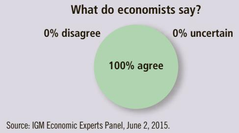
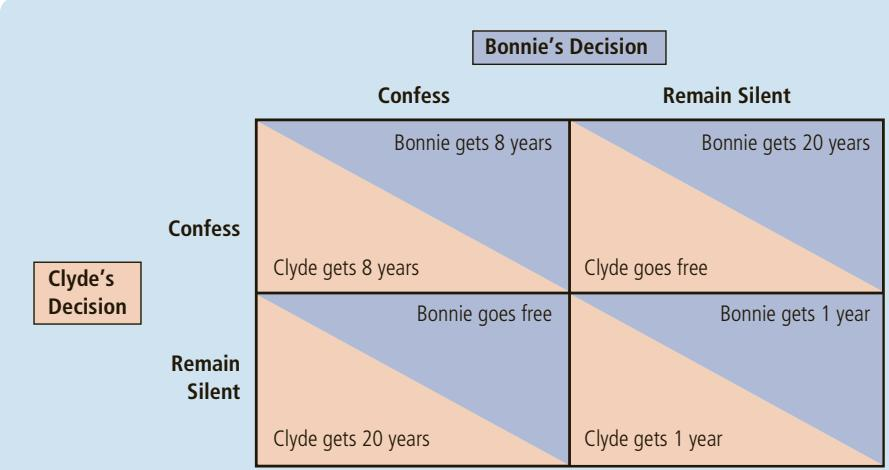
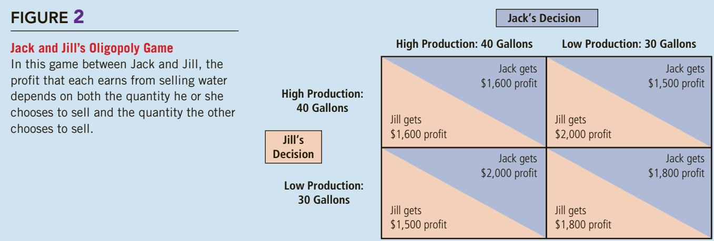
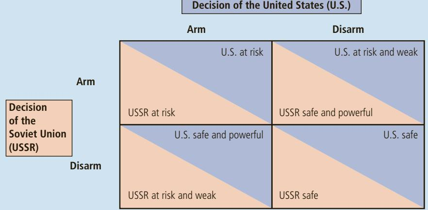
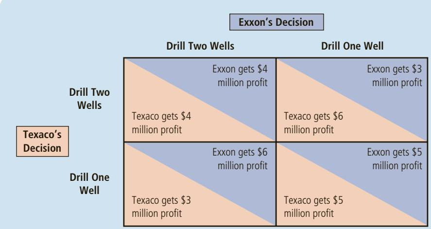

# ASK THE EXPERTS

## Nash Equilibrium

“Behavior in many complex and seemingly intractable strategic settings can be understood more clearly by working out what each party in the game will choose to do if they realize that the other parties will be solving the same problem. This insight has helped us understand behavior as diverse as military conflicts, price setting by competing firms and penalty kicking in soccer.”

  
Source: IGM Economic Experts Panel, June 2, 2015.

the water oligopoly. The demand schedule in Table 1 remains the same, but now more producers are available to satisfy this demand. How would an increase in the number of sellers from two to four affect the price and quantity of water in the town?

If the sellers of water could form a cartel, they would once again try to maximize total profit by producing the monopoly quantity and charging the monopoly price. Just as when there were only two sellers, the members of the cartel would need to agree on production levels for each member and find some way to enforce the agreement. As the cartel grows larger, however, this outcome is less likely. Reaching and enforcing an agreement becomes more difficult as the size of the group increases.

If the oligopolists do not form a cartel—perhaps because the antitrust laws prohibit it—they must each decide on their own how much water to produce. To see how the increase in the number of sellers affects the outcome, consider the decision facing each seller. At any time, each well owner has the option to raise production by one gallon. In making this decision, the well owner weighs the following two effects:

• The output effect: Because price is above marginal cost, selling one more gallon of water at the going price will raise profit.

• The price effect: Raising production will increase the total amount sold, which will lower the price of water and lower the profit on all the other gallons sold.

If the output effect is larger than the price effect, the well owner will increase production. If the price effect is larger than the output effect, the owner will not raise production. (In fact, in this case, it is profitable to reduce production.) Each oligopolist continues to increase production until these two marginal effects exactly balance, taking the other firms’ production as given.

Now consider how the number of firms in the industry affects the marginal analysis of each oligopolist. The larger the number of sellers, the less each seller is concerned about her own impact on the market price. That is, as the oligopoly grows in size, the magnitude of the price effect falls. When the oligopoly grows very large, the price effect disappears altogether. In this extreme case, the production decision of an individual firm no longer affects the market price. Each firm takes the market price as given when deciding how much to produce and, therefore increases production as long as price is above marginal cost.

We can now see that a large oligopoly is essentially a group of competitive firms. A competitive firm considers only the output effect when deciding how much to produce: Because a competitive firm is a price taker, the price effect is absent. Thus, as the number of sellers in an oligopoly grows larger, an oligopolistic market looks more and more like a competitive market. The price approaches marginal cost, and the quantity produced approaches the socially efficient level.

This analysis of oligopoly offers a new perspective on the effects of international trade. Imagine that Toyota and Honda are the only automakers in Japan, Volkswagen and BMW are the only automakers in Germany, and Ford and General Motors are the only automakers in the United States. If these nations prohibited international trade in autos, each would have an auto oligopoly with only two members, and the market outcome would likely depart substantially from the competitive ideal. With international trade, however, the car market is a world market, and the oligopoly in this example has six members. Allowing free trade increases the number of producers from which each consumer can choose, and this increased competition keeps prices closer to marginal cost. Thus, the theory of oligopoly provides another reason, in addition to the theory of comparative advantage discussed in Chapter 3, why countries can benefit from free trade.

If the members of an oligopoly could agree on a total quantity to produce, QuickQuiz what quantity would they choose? • If the oligopolists do not act together but instead make production decisions individually, do they produce a total quantity more or less than in your answer to the previous question? Why?

## 17-2 The Economics of Cooperation

## prisoners’ dilemma

As we have seen, oligopolies would like to reach the monopoly outcome. Doing so, however, requires cooperation, which at times is difficult to establish and maintain. In this section we look more closely at the problems that arise when cooperation among actors is desirable but difficult. To analyze the economics of cooperation, we need to learn a little about game theory.

a particular “game” between two captured prisoners that illustrates why cooperation is difficult to maintain even when it is mutually beneficial

In particular, we focus on a “game” called the prisoners’ dilemma, which provides insight into why cooperation is difficult. Many times in life, people fail to cooperate with one another even when cooperation would make them all better off. An oligopoly is just one example. The story of the prisoners’ dilemma contains a general lesson that applies to any group trying to maintain cooperation among its members.

## 17-2a The Prisoners’ Dilemma

The prisoners’ dilemma is a story about two criminals who have been captured by the police. Let’s call them Bonnie and Clyde. The police have enough evidence to convict Bonnie and Clyde of the minor crime of carrying an unregistered gun, so that each would spend a year in jail. The police also suspect that the two criminals have committed a bank robbery together, but they lack hard evidence to convict them of this major crime. The police question Bonnie and Clyde in separate rooms and offer each of them the following deal:

“Right now, we can lock you up for 1 year. If you confess to the bank robbery and implicate your partner, however, we’ll give you immunity and you can go free. Your partner will get 20 years in jail. But if you both confess to the crime, we won’t need your testimony and we can avoid the cost of a trial, so you will each get an intermediate sentence of 8 years.”

If Bonnie and Clyde, heartless bank robbers that they are, care only about their own individual sentences, what would you expect them to do? Figure 1 shows their choices. Each prisoner has two strategies: confess or remain silent. The sentence each prisoner gets depends on the strategy he or she chooses and the strategy chosen by his or her partner in crime.

Consider first Bonnie’s decision. She reasons as follows: “I don’t know what Clyde is going to do. If he remains silent, my best strategy is to confess, because then I’ll go free rather than spending a year in jail. If he confesses, my best strategy is still to confess, because then I’ll spend 8 years in jail rather than 20. So, regardless of what Clyde does, I am better off confessing.”

In the language of game theory, a strategy is called a dominant strategy if it is the best strategy for a player to follow regardless of the strategies pursued by other players. In this case, confessing is a dominant strategy for Bonnie. She spends less time in jail if she confesses, regardless of whether Clyde confesses or remains silent.

Now consider Clyde’s decision. He faces the same choices as Bonnie, and he reasons in much the same way. Regardless of what Bonnie does, Clyde can reduce his jail time by confessing. In other words, confessing is also a dominant strategy for Clyde.

dominant strategy a strategy that is best for a player in a game regardless of the strategies chosen by the other players

## FIGURE 1

## The Prisoners’ Dilemma

In this game between two criminals suspected of committing a crime, the sentence that each receives depends both on his or her decision whether to confess or remain silent and on the decision made by the other.

In the end, both Bonnie and Clyde confess, and both spend 8 years in jail. This outcome is a Nash equilibrium: Each criminal is choosing the best strategy available, given the strategy the other is following. Yet, from their standpoint, the outcome is terrible. If they had both remained silent, both of them would have been better off, spending only 1 year in jail on the gun charge. Because each pursues his or her own interests, the two prisoners together reach an outcome that is worse for each of them.

You might have thought that Bonnie and Clyde would have foreseen this situation and planned ahead. But even with advanced planning, they would still run into problems. Imagine that, before the police captured Bonnie and Clyde, the two criminals had made a pact not to confess. Clearly, this agreement would make them both better off if they both lived up to it, because they would each spend only 1 year in jail. But would the two criminals in fact remain silent, simply because they had agreed to? Once they are being questioned separately, the logic of self-interest takes over and leads them to confess. Cooperation between the two prisoners is difficult to maintain, because cooperation is individually irrational.

## 17-2b Oligopolies as a Prisoners’ Dilemma

What does the prisoners’ dilemma have to do with markets and imperfect competition? It turns out that the game oligopolists play in trying to reach the monopoly outcome is similar to the game that the two prisoners play in the prisoners’ dilemma.

Consider again the choices facing Jack and Jill. After prolonged negotiation, the two suppliers of water agree to keep production at 30 gallons so that the price will be kept high and together they will earn the maximum profit. After they agree on production levels, however, each of them must decide whether to cooperate and live up to this agreement or to ignore it and produce at a higher level. Figure 2 shows how the profits of the two producers depend on the strategies they choose.

Suppose you are Jack. You might reason as follows: “I could keep production at 30 gallons as we agreed, or I could raise my production and sell 40 gallons. If Jill lives up to the agreement and keeps her production at 30 gallons, then I earn

## FIGURE 2

## Jack and Jill’s Oligopoly Game

In this game between Jack and Jill, the profit that each earns from selling water depends on both the quantity he or she chooses to sell and the quantity the other chooses to sell.

a profit of \$2,000 by selling 40 gallons and \$1,800 by selling 30 gallons. In this case, I am better off with the higher-level production. If Jill fails to live up to the agreement and produces 40 gallons, then I earn \$1,600 by selling 40 gallons and \$1,500 by selling 30 gallons. Once again, I am better off with higher production. So, regardless of what Jill chooses to do, I am better off reneging on our agreement and producing at the higher level.”

Producing 40 gallons is a dominant strategy for Jack. Of course, Jill reasons in exactly the same way, and so both produce at the higher level of 40 gallons. The result is the inferior outcome (from Jack and Jill’s standpoint) with low profits for each of the two producers.

This example illustrates why oligopolies have trouble maintaining monopoly profits. The monopoly outcome is jointly rational, but each oligopolist has an incentive to cheat. Just as self-interest drives the prisoners in the prisoners’ dilemma to confess, self-interest makes it difficult for the oligopolists to maintain the cooperative outcome with low production, high prices, and monopoly profits.

## OPEC AND THE WORLD OIL MARKET

Our story about the town’s market for water is fictional, but if we change water to crude oil, and Jack and Jill to Iran and Iraq, the story is close to being true. Much of the world’s oil is produced by

a few countries, mostly in the Middle East. These countries together make up an oligopoly. Their decisions about how much oil to pump are much the same as Jack and Jill’s decisions about how much water to pump.

The countries that produce most of the world’s oil have formed a cartel, called the Organization of the Petroleum Exporting Countries (OPEC). As originally formed in 1960, OPEC included Iran, Iraq, Kuwait, Saudi Arabia, and Venezuela. By 1973, eight other nations had joined: Qatar, Indonesia, Libya, the United Arab Emirates, Algeria, Nigeria, Ecuador, and Gabon. These countries control about three-fourths of the world’s oil reserves. Like any cartel, OPEC tries to raise the price of its product through a coordinated reduction in quantity produced. OPEC tries to set production levels for each of the member countries.

The problem that OPEC faces is much the same as the problem that Jack and Jill face in our story. The OPEC countries would like to maintain a high price for oil. But each member of the cartel is tempted to increase its production to get a larger share of the total profit. OPEC members frequently agree to reduce production but then cheat on their agreements.

OPEC was most successful at maintaining cooperation and high prices in the period from 1973 to 1985. The price of crude oil rose from \$3 a barrel in 1972 to \$11 in 1974 and then to \$35 in 1981. But in the mid-1980s, member countries began arguing about production levels, and OPEC became ineffective at maintaining cooperation. By 1986 the price of crude oil had fallen back to \$13 a barrel.

In recent years, the members of OPEC have continued to meet regularly, but they have been less successful at reaching and enforcing agreements. As a result, fluctuations in oil prices have been driven more by the natural forces of supply and demand than by the cartel’s artificial restrictions on production. While this lack of cooperation among OPEC nations has reduced the profits of the oil-producing nations below what they might have been, it has benefited consumers around the world. ●

## 17-2c Other Examples of the Prisoners’ Dilemma

We have seen how the prisoners’ dilemma can be used to understand the problem facing oligopolies. The same logic applies to many other situations as well. Here we consider two examples in which self-interest prevents cooperation and leads to an inferior outcome for the parties involved.

Arms Races In the decades after World War II, the world’s two superpowers— the United States and the Soviet Union—were engaged in a prolonged competition over military power. This topic motivated some of the early work on game theory. The game theorists pointed out that an arms race is much like the prisoners’ dilemma.

To see why, consider the decisions of the United States and the Soviet Union about whether to build new weapons or to disarm. Each country prefers to have more arms than the other because a larger arsenal would give it more influence in world affairs. But each country also prefers to live in a world safe from the other country’s weapons.

Figure 3 shows the deadly game. If the Soviet Union chooses to arm, the United States is better off doing the same to prevent the loss of power. If the Soviet Union chooses to disarm, the United States is better off arming because doing so would make it more powerful. For each country, arming is a dominant strategy. Thus, each country chooses to continue the arms race, resulting in the inferior outcome with both countries at risk.

Throughout the Cold War era from about 1945 to 1991, the United States and the Soviet Union attempted to solve this problem through negotiation and agreements over arms control. The problems that the two countries faced were similar to those that oligopolists encounter in trying to maintain a cartel. Just as oligopolists argue over production levels, the United States and the Soviet Union argued over the amount of arms that each country would be allowed. And just as cartels have trouble enforcing production levels, the United States and the Soviet Union each feared that the other country would cheat on any agreement. In both arms races and oligopolies, the relentless logic of self-interest drives the participants toward the noncooperative outcome, which is worse for both parties.

## FIGURE 3

## An Arms-Race Game

In this game between two countries, the safety and power of each country depend on both its decision whether to arm and the decision made by the other country.

  
Decision of the United States (U.S.)

Common Resources In Chapter 11 we saw that people tend to overuse common resources. One can view this problem as an example of the prisoners’ dilemma.

Imagine that two oil companies—Exxon and Texaco—own adjacent oil fields. Under the fields is a common pool of oil worth \$12 million. Drilling a well to recover the oil costs \$1 million. If each company drills one well, each will get half of the oil and earn a \$5 million profit (\$6 million in revenue minus \$1 million in costs).

Because the pool of oil is a common resource, the companies will not use it efficiently. Suppose that either company could drill a second well. If one company has two of the three wells, that company gets two-thirds of the oil, which yields a profit of \$6 million. The other company gets one-third of the oil, for a profit of \$3 million. Yet if each company drills a second well, the two companies again split the oil. In this case, each bears the cost of a second well, so profit is only \$4 million for each company.

Figure 4 shows the game. Drilling two wells is a dominant strategy for each company. Once again, the self-interest of the two players leads them to an inferior outcome.

## 17-2d The Prisoners’ Dilemma and the Welfare of Society

The prisoners’ dilemma describes many of life’s situations, and it shows that cooperation can be difficult to maintain, even when cooperation would make both players in the game better off. Clearly, this lack of cooperation is a problem for those involved in these situations. But is lack of cooperation a problem from the standpoint of society as a whole? The answer depends on the circumstances.

In some cases, the noncooperative equilibrium is bad for society as well as the players. In the arms-race game in Figure 3, both the United States and the Soviet Union end up at risk. In the common-resources game in Figure 4, the extra wells dug by Texaco and Exxon are pure waste. In both cases, society would be better off if the two players could reach the cooperative outcome.

By contrast, in the case of oligopolists trying to maintain monopoly profits, lack of cooperation is desirable from the standpoint of society as a whole. The monopoly outcome is good for the oligopolists, but it is bad for the consumers

## FIGURE 4

## A Common-Resources Game

In this game between firms pumping oil from a common pool, the profit that each earns depends on both the number of wells it drills and the number of wells drilled by the other firm.

of the product. As we first saw in Chapter 7, the competitive outcome is best for society because it maximizes total surplus. When oligopolists fail to cooperate, the quantity they produce is closer to this optimal level. Put differently, the invisible hand guides markets to allocate resources efficiently only when markets are competitive, and markets are competitive only when firms in the market fail to cooperate with one another.

Similarly, consider the case of the police questioning two suspects. Lack of cooperation between the suspects is desirable, for it allows the police to convict more criminals. The prisoners’ dilemma is a dilemma for the prisoners, but it can be a boon to everyone else.

## 17-2e Why People Sometimes Cooperate

The prisoners’ dilemma shows that cooperation is difficult. But is it impossible? Not all prisoners, when questioned by the police, decide to turn in their partners in crime. Cartels sometimes manage to maintain collusive arrangements, despite the incentive for individual members to defect. Very often, players can solve the prisoners’ dilemma because they play the game not once but many times.

To see why cooperation is easier to enforce in repeated games, let’s return to our duopolists, Jack and Jill, whose choices were given in Figure 2. Jack and Jill would like to agree to maintain the monopoly outcome in which each produces 30 gallons. Yet, if Jack and Jill are to play this game only once, neither has any incentive to live up to this agreement. Self-interest drives each of them to renege and choose the dominant strategy of 40 gallons.

Now suppose that Jack and Jill know that they will play the same game every week. When they make their initial agreement to keep production low, they can also specify what happens if one party reneges. They might agree, for instance, that once one of them reneges and produces 40 gallons, both of them will produce 40 gallons forever after. This penalty is easy to enforce, for if one party is producing at a high level, the other has every reason to do the same.

The threat of this penalty may be all that is needed to maintain cooperation. Each person knows that defecting would raise his or her profit from \$1,800 to \$2,000. But this benefit would last for only one week. Thereafter, profit would fall to \$1,600 and stay there. As long as the players care enough about future profits, they will choose to forgo the one-time gain from defection. Thus, in a game of repeated prisoners’ dilemma, the two players may well be able to reach the cooperative outcome.

## THE PRISONERS’ DILEMMA TOURNAMENT

Imagine that you are playing a game of prisoners’ dilemma with a person being “questioned” in a separate room. Moreover, imagine that you are going to play not once but many times. Your score at the

end of the game is the total number of years in jail. You would like to make this score as small as possible. What strategy would you play? Would you begin by confessing or remaining silent? How would the other player’s actions affect your subsequent decisions about confessing?

Repeated prisoners’ dilemma is a complicated game. To encourage cooperation, players must penalize each other for not cooperating. Yet the strategy described earlier for Jack and Jill’s water cartel—defect forever as soon as the other player defects—is not very forgiving. In a game repeated many times, a strategy that allows players to return to the cooperative outcome after a period of noncooperation may be preferable.

To see what strategies work best, political scientist Robert Axelrod held a tournament. People entered by submitting computer programs designed to play repeated prisoners’ dilemma. Each program then played the game against all the other programs. The “winner” was the program that received the fewest total years in jail.

The winning program turned out to be a simple strategy called tit-for-tat. According to tit-for-tat, a player should start by cooperating and then do whatever the other player did last time. Thus, a tit-for-tat player cooperates until the other player defects; then she defects until the other player cooperates again. In other words, this strategy starts out friendly, penalizes unfriendly players, and forgives them if warranted. To Axelrod’s surprise, this simple strategy did better than all the more complicated strategies that people had sent in.

The tit-for-tat strategy has a long history. It is essentially the biblical strategy of “an eye for an eye, a tooth for a tooth.” The prisoners’ dilemma tournament suggests that this may be a good rule of thumb for playing some of the games of life. ●

Tell the story of the prisoners’ dilemma. Write down a table showing the QuickQuiz prisoners’ choices and explain which outcome is likely. • What does the prisoners’ dilemma teach us about oligopolies?

## 17-3 Public Policy toward Oligopolies

One of the Ten Principles of Economics in Chapter 1 is that governments can sometimes improve market outcomes. This principle applies directly to oligopolistic markets. As we have seen, cooperation among oligopolists is undesirable from the standpoint of society as a whole because it leads to production that is too low and prices that are too high. To move the allocation of resources closer to the social optimum, policymakers should try to induce firms in an oligopoly to compete rather than cooperate. Let’s consider how policymakers do this and then examine the controversies that arise in this area of public policy.

## 17-3a Restraint of Trade and the Antitrust Laws

One way that policy discourages cooperation is through the common law. Normally, freedom of contract is an essential part of a market economy. Businesses and households use contracts to arrange mutually advantageous trades. In doing this, they rely on the court system to enforce contracts. Yet, for many centuries, judges in England and the United States have deemed agreements among competitors to reduce quantities and raise prices to be contrary to the public good. They have therefore refused to enforce such agreements.

The Sherman Antitrust Act of 1890 codified and reinforced this policy:

Every contract, combination in the form of trust or otherwise, or conspiracy, in restraint of trade or commerce among the several States, or with foreign nations, is declared to be illegal. . . . Every person who shall monopolize, or attempt to monopolize, or combine or conspire with any person or persons to monopolize any part of the trade or commerce among the several States, or with foreign nations, shall be deemed guilty of a misdemeanor, and on conviction thereof, shall be punished by fine not exceeding fifty thousand dollars, or by imprisonment not exceeding one year, or by both said punishments, in the discretion of the court.

The Sherman Act elevated agreements among oligopolists from unenforceable contracts to criminal conspiracies.

The Clayton Act of 1914 further strengthened the antitrust laws. According to this law, if a person could prove that she was damaged by an illegal arrangement to restrain trade, that person could sue and recover three times the damages she sustained. The purpose of this unusual rule of triple damages is to encourage private lawsuits against conspiring oligopolists.

Today, both the U.S. Justice Department and private parties have the authority to bring legal suits to enforce the antitrust laws. As we discussed in Chapter 15, these laws are used to prevent mergers that would lead to excessive market power in any single firm. In addition, these laws are used to prevent oligopolists from acting together in ways that would make their markets less competitive.

## AN ILLEGAL PHONE CALL

Firms in oligopolies have a strong incentive to collude in order to reduce production, raise prices, and increase profits. The great 18th-century economist Adam Smith was well aware of this poten-

tial market failure. In The Wealth of Nations he wrote, “People of the same trade seldom meet together, but the conversation ends in a conspiracy against the public, or in some diversion to raise prices.”

To see a modern example of Smith’s observation, consider the following excerpt of a phone conversation between two airline executives in the early 1980s. The call was reported in the New York Times on February 24, 1983. Robert Crandall was president of American Airlines, and Howard Putnam was president of Braniff Airways, a major airline at the time.

crandall: I think it’s dumb as hell . . . to sit here and pound the @#\$% out of each other and neither one of us making a #\$%& dime.

putnam: Do you have a suggestion for me?

crandall: Yes, I have a suggestion for you. Raise your \$%\*& fares 20 percent. I’ll raise mine the next morning.

putnam: Robert, we . . .

crandall: You’ll make more money, and I will, too.

putnam: We can’t talk about pricing!

crandall: Oh @#\$%, Howard. We can talk about any &\*#@ thing we want to talk about.

Putnam was right: The Sherman Antitrust Act prohibits competing executives from even talking about fixing prices. When Putnam gave a tape of this conversation to the Justice Department, the Justice Department filed suit against Crandall.

Two years later, Crandall and the Justice Department reached a settlement in which Crandall agreed to various restrictions on his business activities, including his contacts with officials at other airlines. The Justice Department said that the terms of settlement would “protect competition in the airline industry, by preventing American and Crandall from any further attempts to monopolize passenger airline service on any route through discussions with competitors about the prices of airline services.”

## 17-3b Controversies over Antitrust Policy

Over time, much controversy has centered on what kinds of behavior the antitrust laws should prohibit. Most commentators agree that price-fixing agreements among competing firms should be illegal. Yet the antitrust laws have been used to condemn some business practices whose effects are not obvious. Here we consider three examples.

Resale Price Maintenance One example of a controversial business practice is resale price maintenance. Imagine that Superduper Electronics sells Blu-ray disc players to retail stores for \$50. If Superduper requires the retailers to charge customers \$75, it is said to engage in resale price maintenance. Any retailer that charged less than \$75 would violate its contract with Superduper.

At first, resale price maintenance might seem anticompetitive and, therefore, detrimental to society. Like an agreement among members of a cartel, it prevents the retailers from competing on price. For this reason, the courts have at times viewed resale price maintenance as a violation of the antitrust laws.

Yet some economists defend resale price maintenance on two grounds. First, they deny that it is aimed at reducing competition. If Superduper Electronics wanted to exert its market power, it would do so by raising the wholesale price rather than controlling the resale price. Moreover, Superduper has no incentive to discourage competition among its retailers. Indeed, because a cartel of retailers sells less than a group of competitive retailers, Superduper would be worse off if its retailers were a cartel.

Second, economists believe that resale price maintenance has a legitimate goal. Superduper may want its retailers to provide customers a pleasant showroom and a knowledgeable sales force. Yet, without resale price maintenance, some customers would take advantage of one store’s service to learn about the Blu-ray player’s special features and then buy the item at a discount retailer that does not provide this service. Good customer service can be viewed as a public good among the retailers that sell Superduper products. As we discussed in Chapter 11, when one person provides a public good, others are able to enjoy it without paying for it. In this case, discount retailers would free ride on the service provided by other retailers, leading to less service than is desirable. Resale price maintenance is one way for Superduper to solve this free-rider problem.

The example of resale price maintenance illustrates an important principle: Business practices that appear to reduce competition may in fact have legitimate purposes. This principle makes the application of the antitrust laws all the more difficult. The economists, lawyers, and judges in charge of enforcing these laws must determine what kinds of behavior public policy should prohibit as impeding competition and reducing economic well-being. Often that job is not easy.

Predatory Pricing Firms with market power normally use that power to raise prices above the competitive level. But should policymakers ever be concerned that firms with market power might charge prices that are too low? This question is at the heart of a second debate over antitrust policy.

Imagine that a large airline, call it Coyote Air, has a monopoly on some route. Then Roadrunner Express enters and takes 20 percent of the market, leaving Coyote with 80 percent. In response to this competition, Coyote starts slashing its fares. Some antitrust analysts argue that Coyote’s move could be anticompetitive: The price cuts may be intended to drive Roadrunner out of the market so Coyote can recapture its monopoly and raise prices again. Such behavior is called predatory pricing.

Although predatory pricing is a common claim in antitrust suits, some economists are skeptical of this argument and believe that predatory pricing is rarely, if ever, a profitable business strategy. Why? For a price war to drive out a rival, prices have to be driven below cost. Yet if Coyote starts selling cheap tickets at a loss, it had better be ready to fly more planes, because low fares will attract more customers. Roadrunner, meanwhile, can respond to Coyote’s predatory move by cutting back on flights. As a result, Coyote ends up bearing more than 80 percent of the losses, putting Roadrunner in a good position to survive the price war. As in the old Roadrunner–Coyote cartoons, the predator suffers more than the prey.

Economists continue to debate whether predatory pricing should be a concern for antitrust policymakers. Various questions remain unresolved. Is predatory pricing ever a profitable business strategy? If so, when? Are the courts capable of telling which price cuts are competitive and thus good for consumers and which are predatory? There are no simple answers.

Tying A third example of a controversial business practice is tying. Suppose that Makemoney Movies produces two new films—The Avengers and Hamlet. If Makemoney offers theaters the two films together at a single price, rather than separately, the studio is said to be tying its two products.

When the practice of tying movies was challenged, the Supreme Court banned it. The court reasoned as follows: Imagine that The Avengers is a blockbuster and Hamlet is an unprofitable art film. Then the studio could use the high demand for The Avengers to force theaters to buy Hamlet. It seemed that the studio could use tying as a mechanism for expanding its market power.

Many economists are skeptical of this argument. Imagine that theaters are willing to pay \$20,000 for The Avengers and nothing for Hamlet. Then the most that a theater would pay for the two movies together is \$20,000—the same as it would pay for The Avengers by itself. Forcing the theater to accept a worthless movie as part of the deal does not increase the theater’s willingness to pay. Makemoney cannot increase its market power simply by bundling the two movies together.

Why, then, does tying exist? One possibility is that it is a form of price discrimination. Suppose there are two theaters. City Theater is willing to pay \$15,000 for The Avengers and \$5,000 for Hamlet. Country Theater is just the opposite: It is willing to pay \$5,000 for The Avengers and \$15,000 for Hamlet. If Makemoney charges separate prices for the two films, its best strategy is to charge \$15,000 for each film, and each theater chooses to show only one film. Yet if Makemoney offers the two movies as a bundle, it can charge each theater \$20,000 for the movies. Thus, if different theaters value the films differently, tying may allow the studio to increase profit by charging a combined price closer to the buyers’ total willingness to pay.

Tying remains a controversial business practice. The Supreme Court’s argument that tying allows a firm to extend its market power to other goods is not well founded, at least in its simplest form. Yet economists have proposed more elaborate theories for how tying can impede competition. Given our current economic knowledge, it is unclear whether tying has adverse effects for society as a whole.

## THE MICROSOFT CASE

A particularly important and controversial antitrust case was the U.S. government’s suit against the Microsoft Corporation, filed in 1998. The case certainly did not lack drama. It pitted one of the world’s richest men (Bill Gates) against one of the world’s most powerful regulatory agencies (the U.S. Justice Department). Testifying for the government was a prominent economist (MIT professor Franklin Fisher). Testifying for Microsoft was another prominent economist (MIT professor Richard Schmalensee). At stake was the future of one of the world’s most valuable companies (Microsoft) in one of the economy’s fastest-growing industries (computer software).

A central issue in the Microsoft case involved tying—in particular, whether Microsoft should be allowed to integrate its Internet browser into its Windows operating system. The government claimed that Microsoft was bundling these two products together to expand its market power in computer operating systems into the unrelated market of Internet browsers. Allowing Microsoft to incorporate such products into its operating system, the government argued, would deter other software companies from entering the market and offering new products.

Microsoft responded by pointing out that putting new features into old products is a natural part of technological progress. Cars today include CD players and air conditioners, which were once sold separately, and cameras come with built-in flashes. The same is true with operating systems. Over time, Microsoft has added many features to Windows that were previously stand-alone products. This has made computers more reliable and easier to use because consumers can be confident that the pieces work together. The integration of Internet technology, Microsoft argued, was the natural next step.

One point of disagreement concerned the extent of Microsoft’s market power. Noting that more than 80 percent of new personal computers used a Microsoft operating system, the government argued that the company had substantial monopoly power, which it was trying to expand. Microsoft replied that the software market is always changing and that Microsoft’s Windows was constantly being challenged by competitors, such as the Apple Mac and Linux operating systems. It also argued that the low price it charged for Windows—about \$50, or only 3 percent of the price of a typical computer—was evidence that its market power was severely limited.

AP PHOTO/LAURA RAUCH

  
“Me? A monopolist? Now just wait a minute . . .”

Like many large antitrust suits, the Microsoft case became a legal morass. In November 1999, after a long trial, Judge Penfield Jackson ruled that Microsoft had great monopoly power and that it had illegally abused that power. In June 2000, after hearings on possible remedies, he ordered that Microsoft be broken up into two companies—one that sold the operating system and one that sold applications software. A year later, an appeals court overturned Jackson’s breakup order and handed the case to a new judge. In September 2001, the Justice Department announced that it no longer sought a breakup of the company and wanted to settle the case quickly.

A settlement was finally reached in November 2002. Microsoft accepted some restrictions on its business practices, and the government accepted that a browser would remain part of the Windows operating system. But the settlement did not end Microsoft’s antitrust troubles. In recent years, the company has contended with several private antitrust suits, as well as suits brought by the European Union alleging a variety of anticompetitive behaviors. ●

What kind of agreement is illegal for businesses to make? • Why are the antitrust laws controversial?

## IN THE NEWS

## Europe versus Google

Google may be the next big target for antitrust regulators.

## EU Files Formal Antitrust Charges against Google

he European Commission took direct aim at Google Inc. Wednesday, charging the Internet-search giant with skewing results to favor its comparison-shopping service. But the formal complaint may only be the opening salvo in a broader assault that prompts big changes at Google.

European antitrust chief Margrethe Vestager said she continues to examine other domains, such as travel and local services, where Google is accused of favoring its own services over those of others. She also opened a second front, intensifying a separate probe of Google’s conduct with its Android mobileoperating system.

If history is a guide, the European case against Google will grow. The bloc’s last big case against a U.S. tech firm began with charges against Microsoft Corp. in 2000 related to computer servers. The commission later added charges against Microsoft for bundling its media player, and Web browser, with its Windows operating system.

The charges could lead to billions of euros in fines and requirements for Google to change its business practices. Microsoft ultimately paid €2.2 billion (\$2.3 billion). But people inside and outside Microsoft say the case also altered the company’s culture, making it less brash and more cautious.

“There are certain things you know you can’t do that other companies can do,” said Jean-François Bellis, a lawyer who represented Microsoft against the EU. Being labeled “dominant,” as the EU labeled Google on Wednesday, means executives now must worry about pleasing regulators, as well as users.

Inside Google on Wednesday, “the amount of concern over [antitrust enforcement] is enormous,” said one person close to the company….

The complaint marked the first time a regulator has filed formal antitrust charges against Google. U.S. regulators closed their own investigation into Google’s search practices two years ago after the company agreed to voluntary changes.

That European regulators decided to move against Google when their U.S. counterparts held back reflects in part the company’s higher market share on the continent, but also different legal standards. Unlike the U.S., European antitrust law protects competitors, as well as consumers.

Source: The Wall Street Journal, April 15, 2015.

## 17-4 Conclusion

Oligopolies would like to act like monopolies, but self-interest drives them toward competition. Where oligopolies end up on this spectrum depends on the number of firms in the oligopoly and how cooperative the firms are. The story of the prisoners’ dilemma shows why oligopolies can fail to maintain cooperation, even when cooperation is in their best interest.

Policymakers regulate the behavior of oligopolists through the antitrust laws. The proper scope of these laws is the subject of ongoing debate. Although price fixing among competing firms clearly reduces economic welfare and should be illegal, some business practices that appear to reduce competition may have legitimate if subtle purposes. As a result, policymakers need to be careful when they use the substantial powers of the antitrust laws to place limits on firm behavior.

## CHAPTER QuickQuiz

1. The key feature of an oligopolistic market is that a. each firm produces a different product from other firms.

5. The prisoners’ dilemma is a two-person game illustrating that

b. a single firm chooses a point on the market demand curve.

a. the cooperative outcome could be worse for both people than the Nash equilibrium.

c. each firm takes the market price as given.

d. a small number of firms are acting strategically.

b. even if the cooperative outcome is better than the Nash equilibrium for one person, it might be worse for the other.

2. If an oligopolistic industry organizes itself as a cooperative cartel, it will produce a quantity of output that is the competitive level and the monopoly level.

c. even if cooperation is better than the Nash equilibrium, each person might have an incentive not to cooperate.

a. less than, more than

b. more than, less than

d. rational, self-interested individuals will naturally avoid the Nash equilibrium because it is worse for both of them.

c. less than, equal to

d. equal to, more than

3. If an oligopoly does not cooperate and each firm chooses its own quantity, the industry will produce a quantity of output that is the competitive level and the monopoly level.

## 6. The antitrust laws aim to

a. facilitate cooperation among firms in oligopolistic industries.

b. encourage mergers to take advantage of economies of scale.

a. less than, more than

c. discourage firms from moving production facilities overseas.

b. more than, less than

c. less than, equal to

d. prevent firms from acting in ways that reduce competition.

d. equal to, more than

4. As the number of firms in an oligopoly grows large, the industry approaches a level of output that is the competitive level and the monopoly level.

a. less than, more than

b. more than, less than

c. less than, equal to

d. equal to, more than

## SUMMARY

Oligopolists maximize their total profits by forming a cartel and acting like a monopolist. Yet, if oligopolists make decisions about production levels individually, the result is a greater quantity and a lower price than under the monopoly outcome. The larger the number of firms in the oligopoly, the closer the quantity and price will be to the levels that would prevail under perfect competition.

• The prisoners’ dilemma shows that self-interest can prevent people from maintaining cooperation, even when cooperation is in their mutual interest. The logic of the prisoners’ dilemma applies in many situations, including arms races, common-resource problems, and oligopolies.

Policymakers use the antitrust laws to prevent oligopolies from engaging in behavior that reduces competition. The application of these laws can be controversial, because some behavior that can appear to reduce competition may in fact have legitimate business purposes.

## KEY CONCEPTS

oligopoly, p. 337

game theory, p. 338

collusion, p. 339

cartel, p. 339

Nash equilibrium, p. 340

prisoners’ dilemma, p. 342

dominant strategy, p. 343
