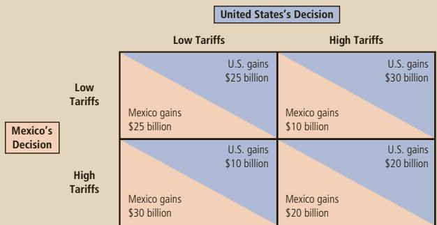
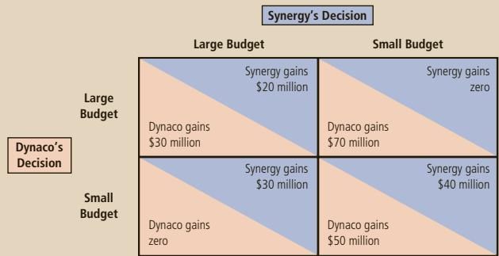
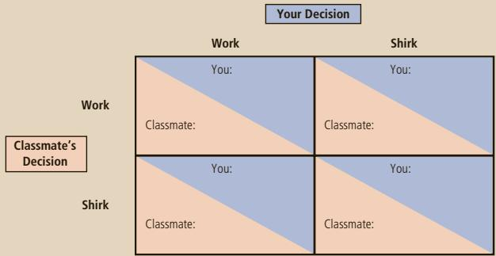
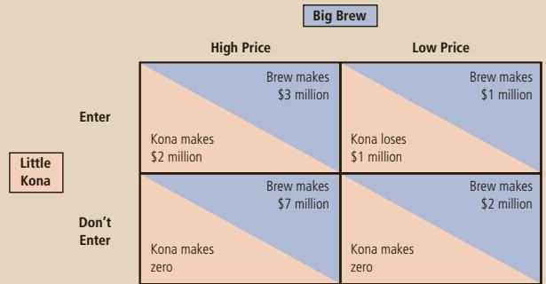

## QUESTIONS FOR REVIEW

1. If a group of sellers could form a cartel, what quantity and price would they try to set?

2. Compare the quantity and price of an oligopoly to those of a monopoly.

3. Compare the quantity and price of an oligopoly to those of a competitive market.

4. How does the number of firms in an oligopoly affect the outcome in the market?

5. What is the prisoners’ dilemma, and what does it have to do with oligopoly?

6. Give two examples other than oligopoly that show how the prisoners’ dilemma helps to explain behavior.

7. What kinds of behavior do the antitrust laws prohibit?

## PROBLEMS AND APPLICATIONS

1. A large share of the world supply of diamonds comes from Russia and South Africa. Suppose that the marginal cost of mining diamonds is constant at \$1,000 per diamond and the demand for diamonds is described by the following schedule:

<table><tr><td>Price</td><td>Quantity</td></tr><tr><td>$8,000</td><td>5,000 diamonds</td></tr><tr><td>7,000</td><td>6,000</td></tr><tr><td>6,000</td><td>7,000</td></tr><tr><td>5,000</td><td>8,000</td></tr><tr><td>4,000</td><td>9,000</td></tr><tr><td>3,000</td><td>10,000</td></tr><tr><td>2,000</td><td>11,000</td></tr><tr><td>1,000</td><td>12,000</td></tr></table>

a. If there were many suppliers of diamonds, what would be the price and quantity?

b. If there were only one supplier of diamonds, what would be the price and quantity?

c. If Russia and South Africa formed a cartel, what would be the price and quantity? If the countries split the market evenly, what would be South Africa’s production and profit? What would happen to South Africa’s profit if it increased its production by 1,000 while Russia stuck to the cartel agreement?

d. Use your answers to part (c) to explain why cartel agreements are often not successful.

2. Some years ago, the New York Times reported that “the inability of OPEC to agree last week to cut production has sent the oil market into turmoil . . . [leading to] the lowest price for domestic crude oil since June 1990.”

a. Why were the members of OPEC trying to agree to cut production?

b. Why do you suppose OPEC was unable to agree on cutting production? Why did the oil market go into “turmoil” as a result?

c. The newspaper also noted OPEC’s view “that producing nations outside the organization, like Norway and Britain, should do their share and cut production.” What does the phrase “do their share” suggest about OPEC’s desired relationship with Norway and Britain?

3. This chapter discusses companies that are oligopolists in the market for the goods they sell. Many of the same ideas apply to companies that are oligopolists in the market for the inputs they buy.

a. If sellers who are oligopolists try to increase the price of goods they sell, what is the goal of buyers who are oligopolists?

b. Major league baseball team owners have an oligopoly in the market for baseball players. What is the owners’ goal regarding players’ salaries? Why is this goal difficult to achieve?

c. Baseball players went on strike in 1994 because they would not accept the salary cap that the owners wanted to impose. If the owners were already colluding over salaries, why did they feel the need for a salary cap?

4. Consider trade relations between the United States and Mexico. Assume that the leaders of the two countries believe the payoffs to alternative trade policies are as follows:

a. What is the dominant strategy for the United States? For Mexico? Explain.

b. Define Nash equilibrium. What is the Nash equilibrium for trade policy?

c. In 1993, the U.S. Congress ratified the North American Free Trade Agreement, in which the United States and Mexico agreed to reduce trade barriers simultaneously. Do the perceived payoffs shown here justify this approach to trade policy? Explain.

d. Based on your understanding of the gains from trade (discussed in Chapters 3 and 9), do you think that these payoffs actually reflect a nation’s welfare under the four possible outcomes?

5. Synergy and Dynaco are the only two firms in a specific high-tech industry. They face the following payoff matrix as they decide upon the size of their research budget:

a. Does Synergy have a dominant strategy? Explain.

b. Does Dynaco have a dominant strategy? Explain.

c. Is there a Nash equilibrium for this scenario? Explain. (Hint: Look closely at the definition of Nash equilibrium.)

6. You and a classmate are assigned a project on which you will receive one combined grade. You each want to receive a good grade, but you also want to avoid hard work. In particular, here is the situation:

• If both of you work hard, you both get an A, which gives each of you 40 units of happiness.

• If only one of you works hard, you both get a B, which gives each of you 30 units of happiness.

• If neither of you works hard, you both get a D, which gives each of you 10 units of happiness.

• Working hard costs 25 units of happiness.

a. Fill in the payoffs in the following decision box:

b. What is the likely outcome? Explain your answer.

c. If you get this classmate as your partner on a series of projects throughout the year, rather than only once, how might that change the outcome you predicted in part (b)?

d. Another classmate cares more about good grades: She gets 50 units of happiness for a B and 80 units of happiness for an A. If this classmate were your partner (but your preferences were unchanged), how would your answers to parts (a) and (b) change? Which of the two classmates would you prefer as a partner? Would she also want you as a partner?

7. A case study in the chapter describes a phone conversation between the presidents of American Airlines and Braniff Airways. Let’s analyze the game between the two companies. Suppose that each company can charge either a high price for tickets or a low price. If one company charges \$300, it earns low profit if the other company also charges \$300 and high profit if the other company charges \$600. On the other hand, if the company charges \$600, it earns very low profit if the other company charges \$300 and medium profit if the other company also charges \$600.

a. Draw the decision box for this game.

b. What is the Nash equilibrium in this game? Explain.

c. Is there an outcome that would be better than the Nash equilibrium for both airlines? How could it be achieved? Who would lose if it were achieved?

8. Two athletes of equal ability are competing for a prize of \$10,000. Each is deciding whether to take a dangerous performance-enhancing drug. If one athlete takes the drug and the other does not, the one who takes the drug wins the prize. If both or neither take the drug, they tie and split the prize. Taking the drug imposes health risks that are equivalent to a loss of X dollars.

a. Draw a 2 3 2 payoff matrix describing the decisions the athletes face.

b. For what X is taking the drug the Nash equilibrium?

c. Does making the drug safer (that is, lowering X) make the athletes better or worse off? Explain.

9. Little Kona is a small coffee company that is considering entering a market dominated by Big Brew. Each company’s profit depends on whether Little Kona enters and whether Big Brew sets a high price or a low price:

a. Does either player in this game have a dominant strategy?

b. Does your answer to part (a) help you figure out what the other player should do?

c. What is the Nash equilibrium? Is there only one?

d. Big Brew threatens Little Kona by saying, “If you enter, we’re going to set a low price, so you had better stay out.” Do you think Little Kona should believe the threat? Why or why not?

e. If the two firms could collude and agree on how to split the total profits, what outcome would they pick?

To find additional study resources, visit cengagebrain.com, and search for “Mankiw.”

PART VI
