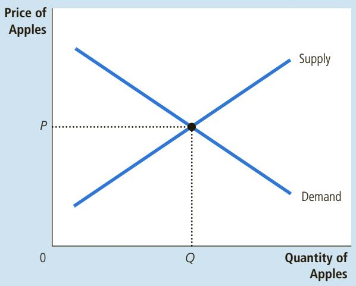
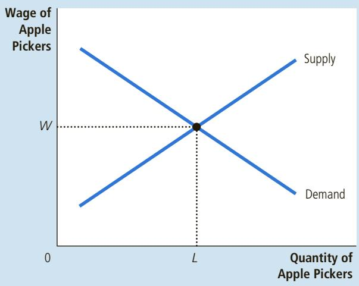
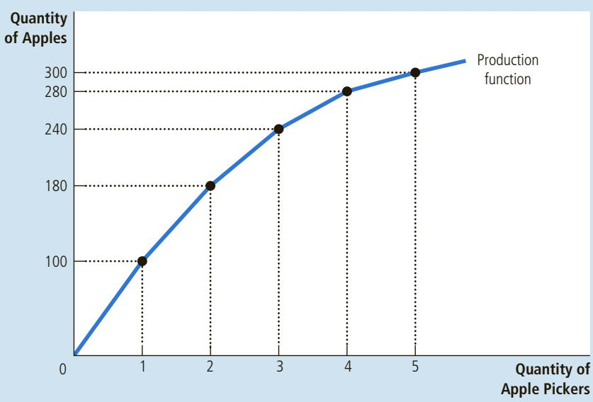
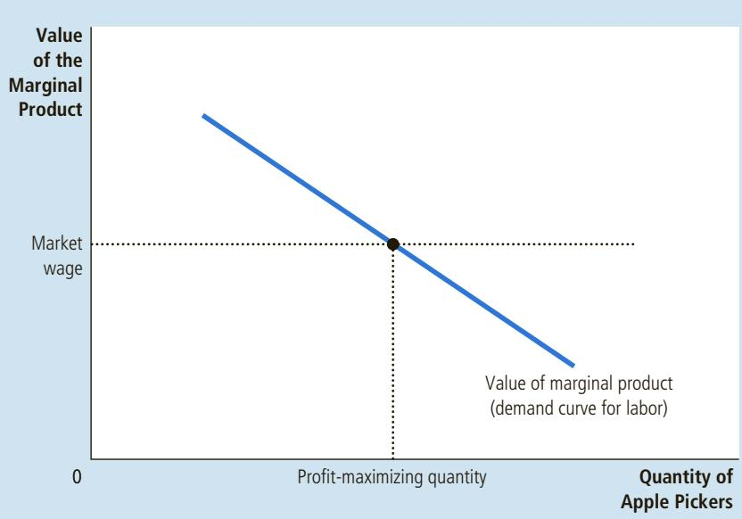

# The Economics of Labor Markets

# The Markets for the Factors of Production

18

When you finish school, your income will be determined largely by what kindof job you take. If you become a computer programmer, you will earn more of job you take. If you become a computer programmer, you will earn more than if you become a gas station attendant. This fact is not surprising, but it is not obvious why it is true. No law requires that computer programmers be paid more than gas station attendants. No ethical principle says that programmers are more deserving. What then determines which job will pay you the higher wage?

Your income, of course, is a small piece of a larger economic picture. In 2015, the total income of all U.S. residents (a statistic called national income) was about \$16 trillion. People earned this income in various ways. Workers earned about two-thirds of it in the form of wages and fringe benefits. The rest went to landowners and to the owners of

capital—the economy’s stock of equipment and structures—in the form of rent, profit, and interest. What determines how much goes to workers? To landowners? To the owners of capital? Why do some workers earn higher wages than others, some landowners higher rental income than others, and some capital owners greater profit than others? Why, in particular, do computer programmers earn more than gas station attendants?

The answers to these questions, like most in economics, hinge on supply and demand. The supply and demand for labor, land, and capital determine the prices paid to workers, landowners, and capital owners. To understand why some people have higher incomes than others, therefore, we need to look more deeply at the markets for the services they provide. That is our job in this and the next two chapters.

This chapter provides the basic theory for the analysis of factor markets. As you may recall from Chapter 2, the factors of production are the inputs used to produce goods and services. Labor, land, and capital are the three most important factors of production. When a computer firm produces a new software program, it uses programmers’ time (labor), the physical space on which its offices are located (land), and an office building and computer equipment (capital). Similarly, when a gas station sells gas, it uses attendants’ time (labor), the physical space (land), and the gas tanks and pumps (capital).

In many ways factor markets resemble the markets for goods and services we analyzed in previous chapters, but they are different in one important way: The demand for a factor of production is a derived demand. That is, a firm’s demand for a factor of production is derived from its decision to supply a good in another market. The demand for computer programmers is inseparably linked to the supply of computer software, and the demand for gas station attendants is inseparably linked to the supply of gasoline.

In this chapter, we analyze factor demand by considering how a competitive, profit-maximizing firm decides how much of any factor to buy. We begin our analysis by examining the demand for labor. Labor is the most important factor of production, because workers receive most of the total income earned in the U.S. economy. Later in the chapter, we will see that our analysis of the labor market also applies to the markets for the other factors of production.

The basic theory of factor markets developed in this chapter takes a large step toward explaining how the income of the U.S. economy is distributed among workers, landowners, and owners of capital. Chapter 19 builds on this analysis to examine in more detail why some workers earn more than others. Chapter 20 examines how much income inequality results from the functioning of factor markets and then considers what role the government should and does play in altering the income distribution.

## 18-1 The Demand for Labor

Labor markets, like other markets in the economy, are governed by the forces of supply and demand. This is illustrated in Figure 1. In panel (a), the supply and demand for apples determine the price of apples. In panel (b), the supply and demand for apple pickers determine the price, or wage, of apple pickers.

As we have already noted, labor markets are different from most other markets because labor demand is a derived demand. Most labor services, rather than being final goods ready to be enjoyed by consumers, are inputs into the production of other goods. To understand labor demand, we need to focus on the firms

The basic tools of supply and demand apply to goods and to labor services. Panel (a) shows how the supply and demand for apples determine the price of apples. Panel (b) shows how the supply and demand for apple pickers determine the wage of apple pickers.

## FIGURE 1

The Versatility of Supply and Demand

(a) The Market for Apples

(b) The Market for Apple Pickers  

that hire the labor and use it to produce goods for sale. By examining the link between the production of goods and the demand for labor to make those goods, we gain insight into the determination of equilibrium wages.

## 18-1a The Competitive Profit-Maximizing Firm

Let’s look at how a typical firm, such as an apple producer, decides what quantity of labor to demand. The firm owns an apple orchard and each week decides how many apple pickers to hire to harvest its crop. After the firm makes its hiring decision, the workers pick as many apples as they can. The firm then sells the apples, pays the workers, and keeps what is left as profit.

We make two assumptions about our firm. First, we assume that our firm is competitive both in the market for apples (where the firm is a seller) and in the market for apple pickers (where the firm is a buyer). A competitive firm is a price taker. Because there are many other firms selling apples and hiring apple pickers, a single firm has little influence over the price it gets for apples or the wage it pays apple pickers. The firm takes the price and the wage as given by market conditions. It only has to decide how many apples to sell and how many workers to hire.

Second, we assume that the firm is profit-maximizing. Thus, the firm does not directly care about the number of workers it employs or the number of apples it produces. It cares only about profit, which equals the total revenue from the sale of apples minus the total cost of producing them. The firm’s supply of apples and its demand for workers are derived from its primary goal of maximizing profit.

## 18-1b The Production Function and the Marginal Product of Labor

To make its hiring decision, a firm must consider how the size of its workforce affects the amount of output produced. In our example, the apple producer must consider how the number of apple pickers affects the quantity of apples it can harvest and

## marginal product of labor the increase in the amount of output from an additional unit of labor

<table><tr><td rowspan="13">TABLE 1How the Competitive FirmDecides How Much Laborto Hire</td><td>(1)</td><td>(2)</td><td rowspan="2">(3)MarginalProductof LaborMPL = ΔQ / ΔL</td><td rowspan="2">(4)Value of theMarginal Productof LaborVMPL = P × MPL</td><td rowspan="2">(5)WageW</td><td rowspan="2">(6)Marginal ProfitΔProfit = VMPL - W</td></tr><tr><td>LaborL</td><td>OutputQ</td></tr><tr><td>0 workers</td><td>0 bushels</td><td></td><td></td><td></td><td></td></tr><tr><td></td><td></td><td>100 bushels</td><td>$1,000</td><td>$500</td><td>$500</td></tr><tr><td>1</td><td>100</td><td></td><td></td><td></td><td></td></tr><tr><td></td><td></td><td>80</td><td>800</td><td>500</td><td>300</td></tr><tr><td>2</td><td>180</td><td></td><td></td><td></td><td></td></tr><tr><td></td><td></td><td>60</td><td>600</td><td>500</td><td>100</td></tr><tr><td>3</td><td>240</td><td></td><td></td><td></td><td></td></tr><tr><td></td><td></td><td>40</td><td>400</td><td>500</td><td>-100</td></tr><tr><td>4</td><td>280</td><td></td><td></td><td></td><td></td></tr><tr><td></td><td></td><td>20</td><td>200</td><td>500</td><td>-300</td></tr><tr><td>5</td><td>300</td><td></td><td></td><td></td><td></td></tr></table>

production function the relationship between the quantity of inputs used to make a good and the quantity of output of that good

## diminishing margina product

the property whereby the marginal product of an input declines as the quantity of the input increases

sell. Table 1 gives a numerical example. Column (1) shows the number of workers. Column (2) shows the quantity of apples the workers harvest each week.

These two columns of numbers describe the firm’s ability to produce apples. Recall that economists use the term production function to describe the relationship between the quantity of the inputs used in production and the quantity of output from production. Here the “input” is the apple pickers and the “output” is the apples. The other inputs—the trees themselves, the land, the firm’s trucks and tractors, and so on—are held fixed for now. This firm’s production function shows that if the firm hires 1 worker, that worker will pick 100 bushels of apples per week. If the firm hires 2 workers, the 2 workers together will pick 180 bushels per week. And so on.

Figure 2 graphs the data on labor and output presented in Table 1. The number of workers is on the horizontal axis, and the amount of output is on the vertical axis. This figure illustrates the production function.

One of the Ten Principles of Economics introduced in Chapter 1 is that rational people think at the margin. This idea is the key to understanding how firms decide what quantity of labor to hire. To take a step toward this decision, column (3) in Table 1 shows the marginal product of labor, the increase in the amount of output produced by an additional unit of labor. When the firm increases the number of workers from 1 to 2, for example, the amount of apples produced rises from 100 to 180 bushels. Therefore, the marginal product of the second worker is 80 bushels.

Notice that as the number of workers increases, the marginal product of labor declines. That is, the production process exhibits diminishing marginal product. At first, when only a few workers are hired, they can pick the low-hanging fruit. As the number of workers increases, additional workers have to climb higher up the ladders to find apples to pick. Hence, as more and more workers are hired, each additional worker contributes less to the production of apples. For this reason, the production function in Figure 2 becomes flatter as the number of workers rises.

## FIGURE 2

## The Production Function

The production function shows how an input into production (apple pickers) influences the output from production (apples). As the quantity of the input increases, the production function gets flatter, reflecting the property of diminishing marginal product.

## 18-1c The Value of the Marginal Product and the Demand for Labor

Our profit-maximizing firm is concerned not about apples themselves but rather about the money it can make by producing and selling them. As a result, when deciding how many workers to hire to pick apples, the firm considers how much profit each worker will bring in. Because profit is total revenue minus total cost, the profit from an additional worker is the worker’s contribution to revenue minus the worker’s wage.

To find the worker’s contribution to revenue, we must convert the marginal product of labor (which is measured in bushels of apples) into the value of the marginal product (which is measured in dollars). We do this using the price of apples. To continue our example, if a bushel of apples sells for \$10 and if an additional worker produces 80 bushels of apples, then the worker produces \$800 of revenue.

The value of the marginal product of any input is the marginal product of that input multiplied by the market price of the output. Column (4) in Table 1 shows the value of the marginal product of labor in our example, assuming the price of apples is \$10 per bushel. Because the market price is constant for a competitive firm while the marginal product declines with more workers, the value of the marginal product diminishes as the number of workers rises. Economists sometimes call this column of numbers the firm’s marginal revenue product: It is the extra revenue the firm gets from hiring an additional unit of a factor of production.

value of the marginal product the marginal product of an input times the price of the output

Now consider how many workers the firm will hire. Suppose that the market wage for apple pickers is \$500 per week. In this case, as you can see in Table 1, the first worker that the firm hires is profitable: The first worker yields \$1,000 in revenue, or \$500 in profit. Similarly, the second worker yields \$800 in additional revenue, or \$300 in profit. The third worker produces \$600 in additional revenue, or \$100 in profit. After the third worker, however, hiring workers is unprofitable. The fourth worker would yield only \$400 of additional revenue. Because the worker’s wage is \$500, hiring the fourth worker would mean a \$100 reduction in profit. Thus, the firm hires only 3 workers.

Figure 3 graphs the value of the marginal product. This curve slopes downward because the marginal product of labor diminishes as the number of workers

## FIGURE 3

## The Value of the Marginal Product of Labor

This figure shows how the value of the marginal product (the marginal product times the price of the output) depends on the number of workers. The curve slopes downward because of diminishing marginal product. For a competitive, profit-maximizing firm, this value-of-marginal-product curve is also the firm’s labor-demand curve.

rises. The figure also includes a horizontal line at the market wage. To maximize profit, the firm hires workers up to the point where these two curves cross. Below this level of employment, the value of the marginal product exceeds the wage, so hiring another worker increases profit. Above this level of employment, the value of the marginal product is less than the wage, so the marginal worker is unprofitable. Thus, a competitive, profit-maximizing firm hires workers up to the point at which the value of the marginal product of labor equals the wage.

Now that we understand the profit-maximizing hiring strategy for a competitive firm, we can offer a theory of labor demand. Recall that a firm’s labordemand curve tells us the quantity of labor that a firm decides to hire at any given wage. Figure 3 shows that the firm makes that decision by choosing the quantity of labor at which the value of the marginal product equals the wage. As a result, the value-of-marginal-product curve is the labor-demand curve for a competitive, profit-maximizing firm.

## 18-1d What Causes the Labor-Demand Curve to Shift?

We now understand that the labor-demand curve reflects the value of the marginal product of labor. With this insight in mind, let’s consider a few of the things that might cause the labor-demand curve to shift.

The Output Price The value of the marginal product is marginal product times the price of the firm’s output. Thus, when the output price changes, the value of the marginal product changes, and the labor-demand curve shifts. An increase in the price of apples, for instance, raises the value of the marginal product of each worker who picks apples and, therefore, increases labor demand from the firms that supply apples. Conversely, a decrease in the price of apples reduces the value of the marginal product and decreases labor demand.

Technological Change Between 1960 and 2015, the output a typical U.S. worker produced in an hour rose by 195 percent. Why? The most important reason is

FYI
