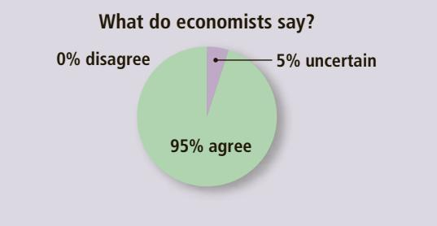
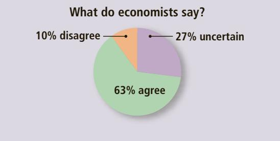
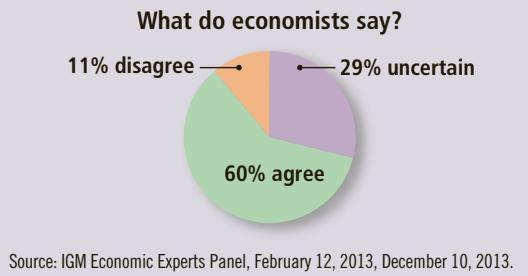
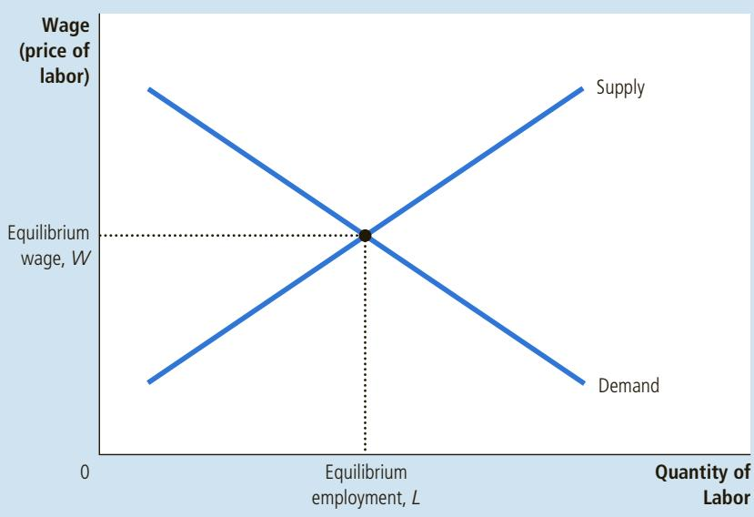
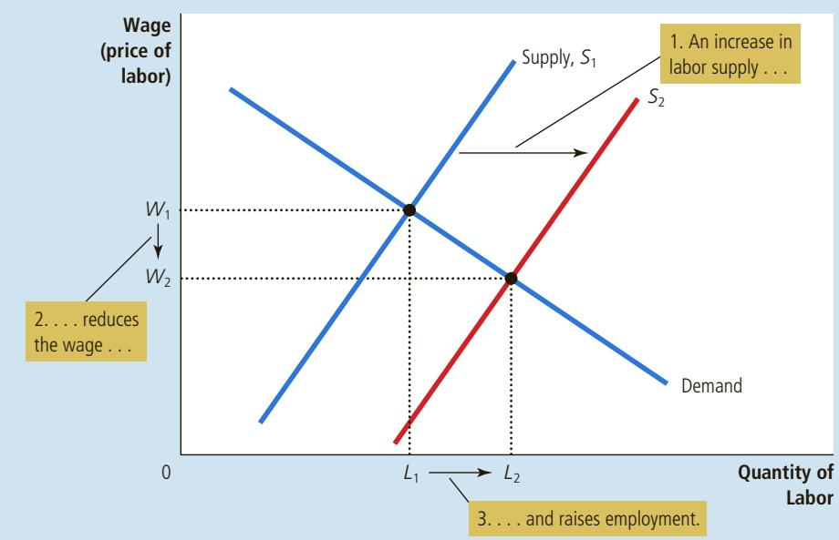

# Input Demand and Output Supply: Two Sides of the Same Coin

n Chapter 14, we saw how a competitive, profit-maximizing firm decides how much of its output to sell: It chooses the quantity of output at which the price of the good equals the marginal cost of production. We have just seen how such a firm decides how much labor to hire: It chooses the quantity of labor at which the wage equals the value of the marginal product. Because the production function links the quantity of inputs to the quantity of output, you should not be surprised to learn that the firm’s decision about input demand is closely linked to its decision about output supply. In fact, these two decisions are two sides of the same coin.

To see this relationship more fully, let’s consider how the marginal product of labor (MPL) and marginal cost (MC) are related. Suppose an additional worker costs \$500 and has a marginal product of 50 bushels of apples. In this case, producing 50 more bushels costs \$500; the marginal cost of a bushel is \$500/50, or \$10. More generally, if W is the wage, and an extra unit of labor produces MPL units of output, then the marginal cost of a unit of output is MC 5 W / MPL.

This analysis shows that diminishing marginal product is closely related to increasing marginal cost. When the apple orchard grows crowded with workers, each additional worker adds less to the production of apples (MPL falls). Similarly, when the apple firm is producing a large quantity of apples, the orchard is already crowded with workers, so it is more costly to produce an additional bushel of apples (MC rises).

Now consider our criterion for profit maximization. We determined earlier that a profit-maximizing firm chooses the quantity of labor so that the value of

the marginal product (P 3 MPL)

equals the wage (W ). We can write this mathematically as

$$
P \times M P L = W.
$$

If we divide both sides of this equation by MPL, we obtain

$$
P = W / M P L.
$$

We just noted that W / MPL equals marginal cost, MC. Therefore, we can substitute to obtain

$$
P = M C.
$$

This equation states that the price of the firm’s output equals the marginal cost of producing a unit of output. Thus, when a competitive firm hires labor up to the point at which the value of the marginal product equals the wage, it also produces up to the point at which the price equals marginal cost. Our analysis of labor demand in this chapter is just another way of looking at the production decision we first saw in Chapter 14. ■

technological progress: Scientists and engineers are constantly figuring out new and better ways of doing things. This has profound implications for the labor market. Advances in technology typically raise the marginal product of labor, which in turn increases the demand for labor and shifts the labor-demand curve to the right.

It is also possible for technological change to reduce labor demand. The invention of a cheap industrial robot, for instance, could conceivably reduce the marginal product of labor, shifting the labor-demand curve to the left. Economists call this labor-saving technological change. History suggests, however, that most technological progress is instead labor-augmenting. For example, a carpenter with a nail gun is more productive than a carpenter with only a hammer. Laboraugmenting technological advance explains persistently rising employment in the face of rising wages: Even though wages (adjusted for inflation) increased by 165 percent from 1960 to 2015, firms nonetheless more than doubled the amount of labor they employed.

The Supply of Other Factors The quantity of one factor of production that is available can affect the marginal product of other factors. The productivity of apple pickers depends, for instance, on the availability of ladders. If the supply

workers to hire.

of ladders declines, the marginal product of apple pickers will decline as well, reducing the demand for apple pickers. We consider the linkage among the factors of production more fully later in the chapter.

Define marginal product of labor and value of the marginal product of labor. • Describe how a competitive, profit-maximizing firm decides how many

## 18-2 The Supply of Labor

Having analyzed labor demand in detail, let’s turn to the other side of the market and consider labor supply. A formal model of labor supply is included in Chapter 21, where we develop the theory of household decision making. Here we informally discuss the decisions that lie behind the labor-supply curve.

## 18-2a The Trade-off between Work and Leisure

One of the Ten Principles of Economics in Chapter 1 is that people face trade-offs. Probably no trade-off in a person’s life is more obvious or more important than the trade-off between work and leisure. The more hours you spend working, the fewer hours you have to watch TV, browse social media, enjoy dinner with friends, or pursue your favorite hobby. The trade-off between labor and leisure lies behind the labor-supply curve.

  
COLLECTION/WWW.CARTOONBANK.COM © PETER C. VEY/ THE NEW YORKER

Another of the Ten Principles of Economics is that the cost of something is what you give up to get it. What do you give up to get an hour of leisure? You give up an hour of work, which in turn means an hour of wages. Thus, if your wage is \$15 per hour, the opportunity cost of an hour of leisure is \$15. And when you get a raise to \$20 per hour, the opportunity cost of enjoying leisure goes up.

The labor-supply curve reflects how workers’ decisions about the labor-leisure trade-off respond to a change in that opportunity cost. An upward-sloping labor-supply curve means that an increase in the wage induces workers to increase the quantity of labor they supply. Because time is limited, more work means less leisure. That is, workers respond to the increase in the opportunity cost of leisure by taking less of it.

“I really didn’t enjoy working five days a week, fifty weeks a year for forty years, but I needed the money.”

It is worth noting that the labor-supply curve need not be upward-sloping. Imagine you got that raise from \$15 to \$20 per hour. The opportunity cost of leisure is now greater, but you are also richer than you were before. You might decide that with your extra wealth you can now afford to enjoy more leisure. That is, at the higher wage, you might choose to work fewer hours. If so, your laborsupply curve would slope backward. In Chapter 21, we discuss this possibility in terms of conflicting effects on your labor-supply decision (called the income and substitution effects). For now, we ignore the possibility of backward-sloping labor supply and assume that the labor-supply curve is upward-sloping.

## 18-2b What Causes the Labor-Supply Curve to Shift?

The labor-supply curve shifts whenever people change the amount they want to work at a given wage. Let’s now consider some of the events that might cause such a shift.

Changes in Tastes In 1950, 34 percent of women were employed at paid jobs or looking for work. By 2015, that number had risen to 57 percent. Although there are many explanations for this development, one of them is changing tastes, or attitudes toward work. Sixty-five years ago, it was the norm for women to stay at home and raise their children. Today, the typical family size is smaller, and more mothers choose to work. The result is an increase in the supply of labor.

Changes in Alternative Opportunities The supply of labor in any one labor market depends on the opportunities available in other labor markets. If the wage earned by pear pickers suddenly rises, some apple pickers may choose to switch occupations, causing the supply of labor in the market for apple pickers to fall.

Immigration Movement of workers from region to region, or country to country, is another important source of shifts in labor supply. When immigrants come to the United States, for instance, the supply of labor in the United States increases and the supply of labor in the immigrants’ home countries falls. In fact, much of the policy debate about immigration centers on its effect on labor supply and, thereby, equilibrium wages in the labor market.

Who has a greater opportunity cost of enjoying QuickQuiz leisure—a janitor or a brain surgeon? Explain. Can this help explain why doctors work such long hours?

## 18-3 Equilibrium in the Labor Market

So far we have established two facts about how wages are determined in competitive labor markets:

• The wage adjusts to balance the supply and demand for labor.

• The wage equals the value of the marginal product of labor.

At first, it might seem surprising that the wage can do both of these things at once. In fact, there is no real puzzle here, but understanding why there is no puzzle is an important step toward understanding wage determination.

Figure 4 shows the labor market in equilibrium. The wage and the quantity of labor have adjusted to balance supply and demand. When the market is in this equilibrium, each firm has bought as much labor as it finds profitable at the equilibrium wage. That is, each firm has followed the rule for profit maximization: It has hired workers until the value of the marginal product equals the wage. Hence, the wage must equal the value of the marginal product of labor once it has brought supply and demand into equilibrium.

## ASK THE EXPERTS

## Immigration

“The average US citizen would be better off if a larger number of highly educated foreign workers were legally allowed to immigrate to the US each year.”

“The average US citizen would be better off if a larger number of low-skilled foreign workers were legally allowed to enter the US each year.”

“Unless they were compensated by others, many low-skilled American workers would be substantially worse off if a larger number of low-skilled foreign workers were legally allowed to enter the US each year.”

## FIGURE 4

Equilibrium in a Labor Market Like all prices, the price of labor (the wage) depends on supply and demand. Because the demand curve reflects the value of the marginal product of labor, in equilibrium workers receive the value of their marginal contribution to the production of goods and services.

This brings us to an important lesson: Any event that changes the supply or demand for labor must change the equilibrium wage and the value of the marginal product by the same amount because these must always be equal. To see how this works, let’s consider some events that shift these curves.

## 18-3a Shifts in Labor Supply

Suppose that immigration increases the number of workers willing to pick apples. As Figure 5 shows, the supply of labor shifts to the right from $S _ { 1 }$ to $S _ { 2 } .$ At the initial wage $W _ { 1 } ,$ the quantity of labor supplied now exceeds the quantity demanded. This surplus of labor puts downward pressure on the wage of apple pickers, and the fall in the wage from $W _ { 1 }$ to $W _ { 2 }$ makes it profitable for firms to hire more workers. As the number of workers employed in each apple orchard rises, the marginal product of a worker falls, and so does the value of the marginal product. In the new equilibrium, both the wage and the value of the marginal product of labor are lower than they were before the influx of new workers.

An episode from Israel, studied by MIT economist Joshua Angrist, illustrates how a shift in labor supply can alter the equilibrium in a labor market. During most of the 1980s, many thousands of Palestinians regularly commuted from their homes in the Israeli-occupied West Bank and Gaza Strip to jobs in Israel, primarily in the construction and agriculture industries. In 1988, however, political unrest in these occupied areas induced the Israeli government to take steps that, as a by-product, reduced this supply of workers. Curfews were imposed, work permits were checked more thoroughly, and a ban on overnight stays of Palestinians in Israel was enforced more rigorously. The economic impact of these steps was exactly as theory predicts: The number of Palestinians with jobs in Israel fell by half, while those who continued to work in Israel enjoyed wage increases of about 50 percent. With a reduced number of Palestinian workers in Israel, the value of the marginal product of the remaining workers was much higher.

When considering the economics of immigration, keep in mind that the economy consists not of a single labor market but rather a variety of labor markets for

## A Shift in Labor Supply

## FIGURE 5

When labor supply increases from $S _ { 1 }$ to $S _ { 2 } ,$ perhaps because of an immigration wave of new workers, the equilibrium wage falls from $W _ { 1 }$ to $W _ { 2 } .$ At this lower wage, firms hire more labor, so employment rises from $L _ { 1 }$ to $L _ { 2 } .$ The change in the wage reflects a change in the value of the marginal product of labor: With more workers, the added output from an extra worker is smaller.

different kinds of workers. A wave of immigration may lower wages in those labor markets in which the new immigrants seek work, but it could have the opposite effect in other labor markets. For example, if the new immigrants look for jobs as apple pickers, the supply of apple pickers increases and the wage of apple pickers declines. But suppose the new immigrants are physicians who use some of their income to buy apples. In this case, the wave of immigration increases the supply of physicians but increases the demand for apples and thus apple pickers. As a result, the wages of physicians decline, and the wages of apple pickers rise. The linkages among various markets—sometimes called general equilibrium effects—make analyzing the full effect of immigration more complex than it first appears.

## 18-3b Shifts in Labor Demand

Now suppose that an increase in the popularity of apples causes their price to rise. This price increase does not change the marginal product of labor for any given number of workers, but it does raise the value of the marginal product. With a higher price for apples, hiring more apple pickers is now profitable. As Figure 6 shows, when the demand for labor shifts to the right from $D _ { 1 }$ to $D _ { 2 } ,$ the equilibrium wage rises from $W _ { 1 }$ to $W _ { 2 }$ and equilibrium employment rises from $L _ { 1 }$ to $L _ { 2 } .$ Once again, the wage and the value of the marginal product of labor move together.

This analysis shows that prosperity for firms in an industry is often linked to prosperity for workers in that industry. When the price of apples rises, apple producers make greater profit and apple pickers earn higher wages. When the price of apples falls, apple producers earn smaller profit and apple pickers earn lower wages. This lesson is well known to workers in industries with highly volatile prices. Workers in oil fields, for instance, know from experience that their earnings are closely linked to the world price of crude oil.

From these examples, you should now have a good understanding of how wages are set in competitive labor markets. Labor supply and labor demand together determine the equilibrium wage, and shifts in the supply or demand curve

## IN THE NEWS
