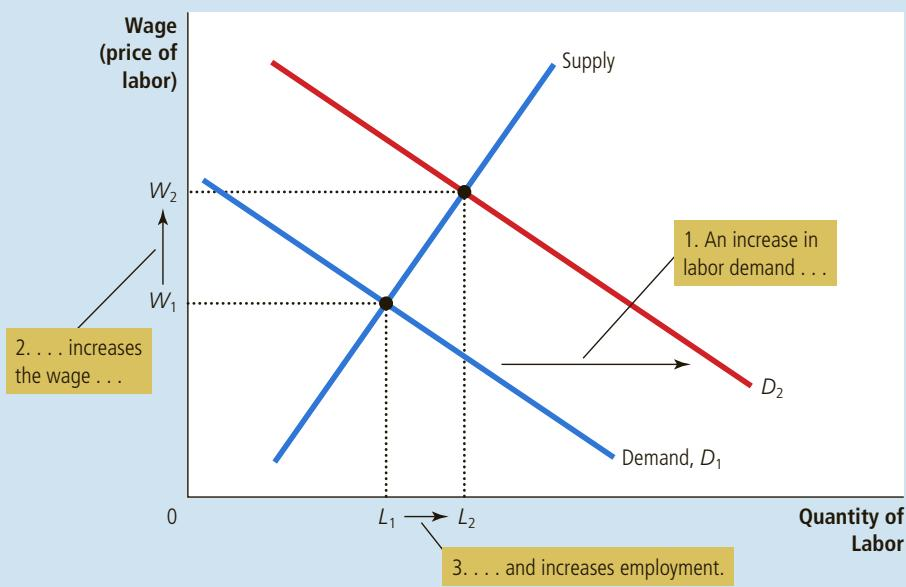
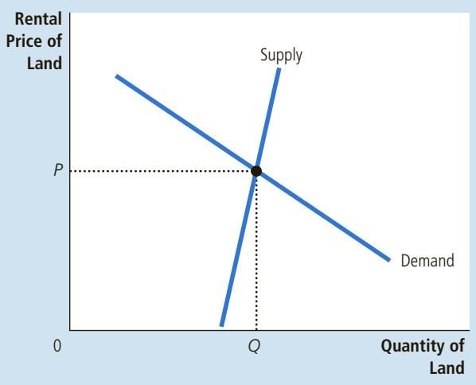
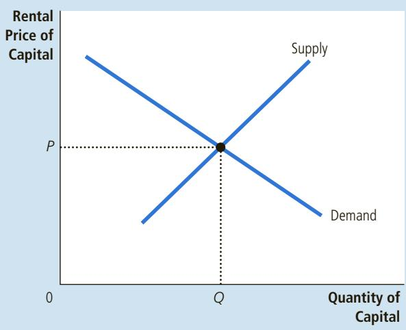

# The Economics of Immigration

Here is an interview with Pia Orrenius, a senior economist at the Federal Reserve Bank of Dallas who studies immigration.

Q: What can you tell us about the size of the immigrant population in the United States?

A: Immigrants make up about 13.3 percent of the overall population, which means about 42 million foreign-born live in the United States. The commonly accepted 2014 estimate for the unauthorized portion of the foreign-born population is 11.3 million. Immigrants come from all parts of the world, but we’ve seen big changes in their origins. In the 1950s and 1960s, 75 percent of immigrants were from Europe. Today, over 80 percent are from Latin America and Asia. Inflows are also much larger today, with 1 million to 2 million newcomers entering each year, although levels were significantly depressed in the aftermath of the Great Recession of 2007–2009, when the housing bust led to a significant decline in illegal immigration.

What’s interesting about the United States is how our economy has been able to absorb immigrants and put them to work. U.S. immigrants are much more likely to be working compared with immigrants in other developed countries. This is partly because we don’t set high entry-level wages or have cumbersome hiring and firing rules. In this type of flexible system, there are more job openings. Workers have more opportunities. Of course, entry-level wages are also lower, but immigrants at least get their foot in the door.

Being in the workforce allows immigrants to interact with the rest of society. They learn the language faster, pay taxes and become stakeholders.

Q: Where do immigrants fit into the U.S. economy?

A: U.S. immigrants are diverse in economic terms. We rely on them to fill both highand low-skilled jobs. Some immigrants do medium-skilled work, but more than anything else they’re found on the low and the high ends of the education distribution.

The economic effects of immigration are positive, but the fiscal impact depends on the group. We have a very important group of high-skilled immigrants. We rely on them to fill high-level jobs in health and STEM [science, technology, engineering, and mathematics] occupations. Each year, over onethird of Ph.D.s in science and engineering are awarded to students who were born abroad. Moreover, research shows that foreign-born workers in STEM fields are more innovative and entrepreneurial than their U.S.-born counterparts, which boosts productivity growth.

High-skilled immigration also contributes positively to government finances. People tend to focus on undocumented or low-skilled immigrants when discussing immigration and often do not recognize the tremendous contributions of high-skilled immigrants.

## FIGURE 6

## A Shift in Labor Demand

When labor demand increases from $D _ { 1 }$ to $D _ { 2 } ,$ perhaps because of an increase in the price of the firm’s output, the equilibrium wage rises from $W _ { 1 }$ to $W _ { 2 }$ and employment rises from $L _ { 1 }$ to $L _ { 2 } .$ The change in the wage reflects a change in the value of the marginal product of labor: With a higher output price, the added output from an extra worker is more valuable.

Q: What about the low-skilled immigration?

A: With low-skilled immigration, the economic benefits of the added labor, such as lower prices for consumers and higher returns to capital, have to be balanced against the fiscal impact, which is likely negative. The fiscal impact is the difference between what families contribute in taxes and what they use up in the form of publicly provided services.

What makes the fiscal issue more difficult is the distribution of the burden. The federal government reaps much of the revenue from immigrants who work and pay employment taxes. State and local governments realize less of that benefit and have to pay more of the costs associated with low-skilled immigration—usually education and health expenses.

ECONOMY, MARCH/APRIL 2006COURTESY OF FEDERAL RESERVE BANK OF DALLAS, SOUTHWEST

  
Pia Orrenius

Q: Does it matter whether the immigration is legal or not?

A: Illegal immigration has helped fuel the U.S. economy for many years. Five percent of the U.S. workforce is made up of unauthorized workers—the outcome of decades of robust labor demand and, until recently, lax enforcement. Nevertheless, from an economic and fiscal perspective, it makes more sense to differentiate among immigrants of various skill levels than it does to focus on legal status.

The economic benefits of low-skilled immigrants aren’t typically going to depend on how they entered the United States. Unauthorized immigrants may pay less in taxes, but they’re also ineligible for most public programs. Lacking legal status doesn’t mean these immigrants have a worse fiscal impact. In fact, a low-skilled unauthorized immigrant likely creates less fiscal burden than a lowskilled legal immigrant because the undocumented get almost no government benefits.

Q: How does immigration affect jobs and earnings for the native-born population?

A: Labor economists have looked long and hard at this question, namely how immigration has affected the wages of Americans, particularly the low-skilled who lack a high school degree. One reason we worry about this is that the real wages of less-educated U.S. men have been falling since the late 1970s.

The studies tend to show that little of the decline is due to immigration. The consensus seems to be that wages overall are about 1 to 3 percent lower today as a result of immigration, although some scholars find larger effects for low-skilled workers. Still, labor economists think it’s a bit of a puzzle that they haven’t been able to systematically identify larger adverse wage effects.

The reason may be the way the economy is constantly adjusting to the inflow of immigrants. On a geographical basis, for example, a large influx of immigrants into an area tends to encourage an inflow of physical capital or a change in technology or production processes which puts new workers to use. So you have an increase in labor supply, but you also have an increase in labor demand, and the wage effects are ameliorated. ■

Source: This interview, updated for this edition by Dr. Orrenius, was originally published in Southwest Economy, March/April 2006.

for labor cause the equilibrium wage to change. At the same time, profit maximization by the firms that demand labor ensures that the equilibrium wage always equals the value of the marginal product of labor.

## PRODUCTIVITY AND WAGES

One of the Ten Principles of Economics in Chapter 1 is that our standard of living depends on our ability to produce goods and services. We can now see how this principle works in the market for labor. In

particular, our analysis of labor demand shows that wages equal productivity as measured by the value of the marginal product of labor. Put simply, highly productive workers are highly paid, and less productive workers are less highly paid.

This lesson is key to understanding why workers today are better off than workers in previous generations. Table 2 presents some data on growth in productivity and growth in real wages (that is, wages adjusted for inflation). From 1960 to 2015, productivity as measured by output per hour of work grew about 2.0 percent per year. Real wages grew at 1.8 percent—almost the same rate. With a growth rate of 2 percent per year, productivity and real wages double about every 35 years.

Productivity growth varies over time. Table 2 also shows the data for three shorter periods that economists have identified as having very different

<table><tr><td colspan="4">TABLE 2</td></tr><tr><td></td><td>Time Period</td><td>Growth Rate of Productivity</td><td>Growth Rate of Real Wages</td></tr><tr><td rowspan="4">Productivity and Wage Growth in the United States</td><td>1960–2015</td><td>2.0%</td><td>1.8%</td></tr><tr><td>1960–1973</td><td>2.7</td><td>2.7</td></tr><tr><td>1973–1995</td><td>1.4</td><td>1.2</td></tr><tr><td>1995–2015</td><td>2.1</td><td>1.8</td></tr></table>

Source: Bureau of Labor Statistics.

productivity experiences. Around 1973, the U.S. economy experienced a significant slowdown in productivity growth that lasted until 1995. The cause of this productivity slowdown is yet to be fully explained, but the link between productivity and real wages is exactly as standard theory predicts. The slowdown in productivity growth from 2.7 to 1.4 percent per year coincided with a slowdown in real wage growth from 2.7 to 1.2 percent per year.

Productivity growth picked up again about 1995, and many observers hailed the arrival of the “new economy.” This productivity acceleration is most often attributed to the spread of computers and information technology. As theory predicts, growth in real wages picked up as well. From 1995 to 2015, productivity grew by 2.1 percent per year and real wages grew by 1.8 percent per year.

The bottom line: Both theory and history confirm the close connection between productivity and real wages. ●

QuickQuiz

How does immigration of workers affect labor supply, labor demand, the marginal product of labor, and the equilibrium wage?

FYI

## Monopsony

On the preceding pages, we built our analysis of the labor market withthe tools of supply and demand. In doing so, we assumed that the labor market was competitive. That is, we assumed that there were many buyers and sellers of labor, so each buyer or seller had a negligible effect on the wage.

Yet that assumption doesn’t always apply. Imagine that the labor market in a small town is dominated by a single, large employer. That employer can exert a large influence on the going wage, and it can use its market power to alter the outcome in the labor market. Such a market in which there is a single buyer is called a monopsony.

A monopsony (a market with one buyer) is in many ways similar to a monopoly (a market with one seller). Recall from Chapter 15 that a monopoly firm produces less of the good than would a competitive firm; by reducing the quantity offered for sale, the monopoly firm moves along the product’s demand curve, raising the price and also its profit.

Similarly, a monopsony firm in a labor market hires fewer workers than would a competitive firm; by reducing the number of jobs available, the monop-

sony firm moves along the labor

supply curve, reducing the wage it pays and raising its profit. Thus, both monopolists and monopsonists reduce economic activity in a market below the socially optimal level. In both cases, the existence of market power distorts the outcome and causes deadweight losses.

This book does not present the formal model of monopsony because monopsonies are rare. In most labor markets, workers have many possible employers, and firms compete with one another to attract workers. In this case, the model of supply and demand is the best one to use. ■

## 18-4 The Other Factors of Production: Land and Capital

We have seen how firms decide how much labor to hire and how these decisions determine workers’ wages. At the same time that firms are hiring workers, they are also deciding about other inputs to production. For example, our appleproducing firm might have to choose the size of its apple orchard and the number of ladders for its apple pickers. We can think of the firm’s factors of production as falling into three categories: labor, land, and capital.

The meaning of the terms labor and land is clear, but the definition of capital is somewhat tricky. Economists use the term capital to refer to the stock of equipment and structures used for production. That is, the economy’s capital represents the accumulation of goods produced in the past that are being used in the present to produce new goods and services. For our apple firm, the capital stock includes the ladders used to climb the trees, the trucks used to transport the apples, the buildings used to store the apples, and even the trees themselves.

## 18-4a Equilibrium in the Markets for Land and Capital

What determines how much the owners of land and capital earn for their contribution to the production process? Before answering this question, we need to distinguish between two prices: the purchase price and the rental price. The purchase price of land or capital is the price a person pays to own that factor of production indefinitely. The rental price is the price a person pays to use that factor for a limited period of time. It is important to keep this distinction in mind because, as we will see, these prices are determined by somewhat different economic forces.

Having defined these terms, we can now apply the theory of factor demand that we developed for the labor market to the markets for land and capital. Because the wage is the rental price of labor, much of what we have learned about wage determination applies also to the rental prices of land and capital. As Figure 7 illustrates,

Supply and demand determine the compensation paid to the owners of land, as shown in panel (a), and the compensation paid to the owners of capital, as shown in panel (b). The demand for each factor, in turn, depends on the value of the marginal product of that factor.

The Markets for Land and Capital

## FIGURE 7

(a) The Market for Land  

(b) The Market for Capital  

the rental price of land, shown in panel (a), and the rental price of capital, shown in panel (b), are determined by supply and demand. Moreover, the demand for land and capital is determined just like the demand for labor. That is, when our apple-producing firm is deciding how much land and how many ladders to rent, it follows the same logic as when deciding how many workers to hire. For both land and capital, the firm increases the quantity hired until the value of the factor’s marginal product equals the factor’s price. Thus, the demand curve for each factor reflects the marginal productivity of that factor.

We can now explain how much income goes to labor, how much goes to landowners, and how much goes to the owners of capital. As long as the firms using the factors of production are competitive and profit-maximizing, each factor’s rental price must equal the value of the marginal product for that factor. Labor, land, and capital each earn the value of their marginal contribution to the production process.

Now consider the purchase price of land and capital. The rental price and the purchase price are related: Buyers are willing to pay more for a piece of land or capital if it produces a valuable stream of rental income. And as we have just seen, the equilibrium rental income at any point in time equals the value of that factor’s marginal product. Therefore, the equilibrium purchase price of a piece of land or capital depends on both the current value of the marginal product and the value of the marginal product expected to prevail in the future.

FYI

## What Is Capital Income?

abor income is an easy concept to understand: It is the paycheck that workers get from their employers. The income earned by capital, however, is less obvious.

In our analysis, we have been implicitly assuming that households own the economy’s stock of capital—ladders, drill presses, warehouses, and so on—and rent it to the firms that use it. Capital income, in this case, is the rent that households receive for the use of their capital. This assumption simplified our analysis of how capital owners are compensated, but it is not entirely realistic. In fact, firms usually own the capital they use, and therefore, they receive the earnings from this capital.

These earnings from capital, however, are paid to households eventually in a variety of forms. Some of the earnings are paid in the form of interest to those households that have lent money to firms. Bondholders and bank depositors are two examples of recipients of interest. Thus, when you receive interest on your bank account, that income is part of the economy’s capital income.

In addition, some of the earnings from capital are paid to households in the form of dividends. Dividends are payments by a firm to the firm’s stockholders. A stockholder is a person who has bought a share in

the ownership of the firm and, therefore, is entitled to a portion of the firm’s profits.

A firm does not have to pay out all its earnings to households in the form of inter-

est and dividends. Instead, it can retain some earnings within the firm and use these earnings to buy additional capital. Unlike dividends, these retained earnings do not yield a direct cash payment to the firm’s stockholders, but the stockholders benefit from them nonetheless. Because retained earnings increase the amount of capital the firm owns, they tend to increase future earnings and, thereby, the value of the firm’s stock.

These institutional details are interesting and important, but they do not alter our conclusion about the income earned by the owners of capital. Capital is paid according to the value of its marginal product, regardless of whether this income is transmitted to households in the form of interest or dividends or whether it is kept within firms as retained earnings. ■

## 18-4b Linkages among the Factors of Production

We have seen that the price paid for any factor of production—labor, land, or capital—equals the value of the marginal product of that factor. The marginal product of any factor, in turn, depends on the quantity of that factor that is available. Because of diminishing marginal product, a factor in abundant supply has a low marginal product and thus a low price, and a factor in scarce supply has a high marginal product and a high price. As a result, when the supply of a factor falls, its equilibrium price rises.

When the supply of any factor changes, however, the effects are not limited to the market for that factor. In most situations, factors of production are used together in a way that makes the productivity of each factor depend on the quantities of the other factors available for use in the production process. Therefore, when some event changes the supply of any one factor of production, it will typically affect not only the earnings of that factor but also the earnings of all the other factors as well.

For example, suppose a hurricane destroys many of the ladders that workers use to pick apples from the orchards. What happens to the earnings of the various factors of production? Most obviously, when the supply of ladders falls, the equilibrium rental price of ladders rises. Those owners who were lucky enough to avoid damage to their ladders now earn a higher return when they rent out their ladders to the firms that produce apples.

Yet the effects of this event do not stop at the ladder market. Because there are fewer ladders with which to work, the workers who pick apples have a smaller marginal product. Thus, the reduction in the supply of ladders reduces the demand for the labor of apple pickers, and this shift in demand causes the equilibrium wage to fall.

This story shows a general lesson: An event that changes the supply of any factor of production can alter the earnings of all the factors. The change in earnings of any factor can be found by analyzing the impact of the event on the value of the marginal product of that factor.

## THE ECONOMICS OF THE BLACK DEATH

In 14th-century Europe, the bubonic plague wiped out about one-third of the population within a few years. This event, called the Black Death, provides a grisly natural experiment to test the theory of factor markets that we have just developed. Consider the effects of the Black Death on those who were lucky enough to survive. What do you think happened to the wages earned by workers and the rents earned by landowners?

To answer this question, let’s examine the effects of a reduced population on the marginal product of labor and the marginal product of land. With a smaller supply of workers, the marginal product of labor rises. (This is diminishing marginal product working in reverse.) Thus, we would expect the Black Death to raise wages.

Because land and labor are used together in production, a smaller supply of workers also affects the market for land, the other major factor of production in medieval Europe. With fewer workers available to farm the land, an additional unit of land produced less additional output. In other words, the marginal product of land fell. Thus, we would expect the Black Death to lower rents.

BETTMANN/CORBIS

In fact, both predictions are consistent with the historical evidence. Wages approximately doubled during this period, and rents declined 50 percent or more.

  
Workers who survived the plague were lucky in more ways than one.

The Black Death led to economic prosperity for the peasant classes and reduced incomes for the landed classes. ●

What determines the income of the owners of land and capital? • How QuickQuiz would an increase in the quantity of capital affect the incomes of those who already own capital? How would it affect the incomes of workers?

## 18-5 Conclusion

This chapter has explained how labor, land, and capital are compensated for the roles they play in the production process. The theory developed here is called the neoclassical theory of distribution. According to the neoclassical theory, the amount paid to each factor of production depends on the supply and demand for that factor. The demand, in turn, depends on that particular factor’s marginal productivity. In equilibrium, each factor of production earns the value of its marginal contribution to the production of goods and services.

The neoclassical theory of distribution is widely accepted. Most economists begin with the neoclassical theory when trying to explain how the U.S. economy’s \$16 trillion of income is distributed among the economy’s various members. In the following two chapters, we consider the distribution of income in more detail. As you will see, the neoclassical theory provides the framework for this discussion.

Even at this point, you can use the theory to answer the question that began this chapter: Why are computer programmers paid more than gas station attendants? It is because programmers can produce a good of greater market value than can gas station attendants. People are willing to pay dearly for a good computer game, but they are willing to pay little to have their gas pumped and their windshield washed. The wages of these workers reflect the market prices of the goods they produce. If people suddenly got tired of using computers and decided to spend more time driving, the prices of these goods would change, and so would the equilibrium wages of these two groups of workers.

## CHAPTER QuickQuiz

1. Approximately what percentage of U.S. national income is paid to workers, as opposed to owners of capital and land? a. 25 percent b. 45 percent c. 65 percent d. 85 percent

2. If firms are competitive and profit-maximizing, the demand curve for labor is determined by a. the opportunity cost of workers’ time. b. the value of the marginal product of labor. c. offsetting income and substitution effects. d. the value of the marginal product of capital.

3. A bakery operating in competitive markets sells its output for \$20 per cake and hires labor at \$10 per hour. To maximize profit, it should hire labor until the marginal product of labor is a. 1/2 cake per hour. b. 2 cakes per hour. c. 10 cakes per hour. d. 15 cakes per hour.

4. A technological advance that increases the marginal product of labor shifts the labor- curve to the a. demand, left b. demand, right c. supply, left d. supply, right

5. Around 1973, the U.S. economy experienced a significant in productivity growth, coupled with a(n) in the growth of real wages.

a. acceleration, acceleration

b. acceleration, slowdown

c. slowdown, acceleration

d. slowdown, slowdown

6. A storm destroys several factories, thereby reducing the stock of capital. What effect does this event have on factor markets?

a. Wages and the rental price of capital both rise.

b. Wages and the rental price of capital both fall.

c. Wages rise and the rental price of capital falls.

d. Wages fall and the rental price of capital rises.

## SUMMARY

The economy’s income is distributed in the markets for the factors of production. The three most important factors of production are labor, land, and capital.

The demand for factors, such as labor, is a derived demand that comes from firms that use the factors to produce goods and services. Competitive, profitmaximizing firms hire each factor up to the point at which the value of the factor’s marginal product equals its price.

The supply of labor arises from individuals’ tradeoff between work and leisure. An upward-sloping labor-supply curve means that people respond to an increase in the wage by working more hours and enjoying less leisure.

The price paid to each factor adjusts to balance the supply and demand for that factor. Because factor demand reflects the value of the marginal product of that factor, in equilibrium each factor is compensated according to its marginal contribution to the production of goods and services.

Because factors of production are used together, the marginal product of any one factor depends on the quantities of all factors that are available. As a result, a change in the supply of one factor alters the equilibrium earnings of all the factors.

## KEY CONCEPTS

factors of production, p. 362 production function, p. 364

marginal product of labor, p. 364 diminishing marginal product, p. 364 value of the marginal product, p. 365 capital, p. 375

## QUESTIONS FOR REVIEW

1. Explain how a firm’s production function is related to its marginal product of labor, how a firm’s marginal product of labor is related to the value of its marginal product, and how a firm’s value of marginal product is related to its demand for labor.

2. Give two examples of events that could shift the demand for labor, and explain why they do so.

3. Give two examples of events that could shift the supply of labor, and explain why they do so.

4. Explain how the wage can adjust to balance the supply and demand for labor while simultaneously equaling the value of the marginal product of labor.

5. If the population of the United States suddenly grew because of a large wave of immigration, what would happen to wages? What would happen to the rents earned by the owners of land and capital?

## PROBLEMS AND APPLICATIONS

<table><tr><td>1. Suppose that the president proposes a new law aimed at reducing healthcare costs: All Americans are required to eat one apple daily.</td><td>Number of Robots</td><td>Total Product</td></tr><tr><td rowspan="2">a. How would this apple-a-day law affect the demand and equilibrium price of apples?</td><td>0</td><td>0 gallons</td></tr><tr><td>1</td><td>50</td></tr><tr><td rowspan="2">b. How would the law affect the marginal product and the value of the marginal product of apple pickers?</td><td>2</td><td>85</td></tr><tr><td>3</td><td>115</td></tr><tr><td rowspan="3">c. How would the law affect the demand and equilibrium wage for apple pickers?</td><td>4</td><td>140</td></tr><tr><td>5</td><td>150</td></tr><tr><td>6</td><td>155</td></tr></table>

2. Show the effect of each of the following events on the market for labor in the computer manufacturing industry.

a. Congress buys personal computers for all U.S. college students.

b. More college students major in engineering and computer science.

c. Computer firms build new manufacturing plants.

3. Suppose that labor is the only input used by a perfectly competitive firm. The firm’s production function is as follows:

<table><tr><td>Days of Labor</td><td>Units of Output</td></tr><tr><td>0 days</td><td>0 units</td></tr><tr><td>1</td><td>7</td></tr><tr><td>2</td><td>13</td></tr><tr><td>3</td><td>19</td></tr><tr><td>4</td><td>25</td></tr><tr><td>5</td><td>28</td></tr><tr><td>6</td><td>29</td></tr><tr><td>7</td><td>29</td></tr></table>

a. Calculate the marginal product for each additional worker.

b. Each unit of output sells for \$10. Calculate the value of the marginal product of each worker.

c. Compute the demand schedule showing the number of workers hired for all wages from zero to \$100 a day.

d. Graph the firm’s demand curve.

e. What happens to this demand curve if the price of output rises from \$10 to \$12 per unit?

4. Smiling Cow Dairy can sell all the milk it wants for \$4 a gallon, and it can rent all the robots it wants to milk the cows at a capital rental price of \$100 a day. It faces the following production schedule:

a. In what kind of market structure does the firm sell its output? How can you tell?

b. In what kind of market structure does the firm rent robots? How can you tell?

c. Calculate the marginal product and the value of the marginal product for each additional robot.

d. How many robots should the firm rent? Explain.

5. The nation of Ectenia has 20 competitive apple orchards, all of which sell apples at the world price of \$2 per apple. The following equations describe the production function and the marginal product of labor in each orchard:

$$
Q = 1 0 0 L - L ^ {2}
$$

$$
M P L = 1 0 0 - 2 L,
$$

where Q is the number of apples produced in a day, L is the number of workers, and MPL is the marginal product of labor.

a. What is each orchard’s labor demand as a function of the daily wage W? What is the market’s labor demand?

b. Ectenia has 200 workers who supply their labor inelastically. Solve for the wage W. How many workers does each orchard hire? How much profit does each orchard owner make?

c. Calculate what happens to the income of workers and orchard owners if the world price doubles to \$4 per apple.

d. Now suppose the price is back at \$2 per apple, but a hurricane destroys half the orchards. Calculate how the hurricane affects the income of each worker and of each remaining orchard owner. What happens to the income of Ectenia as a whole?

6. Your enterprising uncle opens a sandwich shop that employs 7 people. The employees are paid \$12 per hour, and a sandwich sells for \$6. If your uncle is maximizing his profit, what is the value of the marginal product of the last worker he hired? What is that worker’s marginal product?

7. Leadbelly Co. sells pencils in a perfectly competitive product market and hires workers in a perfectly competitive labor market. Assume that the market wage rate for workers is \$150 per day.

a. What rule should Leadbelly follow to hire the profit-maximizing amount of labor?

b. At the profit-maximizing level of output, the marginal product of the last worker hired is 30 boxes of pencils per day. Calculate the price of a box of pencils.

c. Draw a diagram of the labor market for pencil workers (as in Figure 4 of this chapter) next to a diagram of the labor supply and demand for Leadbelly Co. (as in Figure 3). Label the equilibrium wage and quantity of labor for both the market and the firm. How are these diagrams related?

d. Suppose some pencil workers switch to jobs in the growing computer industry. On the side-by-side diagrams from part (c), show how this change affects the equilibrium wage and quantity of labor for both the pencil market and for Leadbelly. How does this change affect the marginal product of labor at Leadbelly?

8. Policymakers sometimes propose laws requiring firms to give workers certain fringe benefits, such as health insurance or paid parental leave. Let’s consider the effects of such a policy on the labor market.

a. Suppose that a law required firms to give each worker \$3 of fringe benefits for every hour that the worker is employed by the firm. How does this law affect the marginal profit that a firm earns from each worker at a given cash wage? How does the law affect the demand curve for labor? Draw your answer on a graph with the cash wage on the vertical axis.

b. If there is no change in labor supply, how would this law affect employment and wages?

c. Why might the labor-supply curve shift in response to this law? Would this shift in labor supply raise or lower the impact of the law on wages and employment?

d. As discussed in Chapter 6, the wages of some workers, particularly the unskilled and inexperienced, are kept above the equilibrium level by minimum-wage laws. What effect would a fringe-benefit mandate have for these workers?

9. Some economists believe that the U.S. economy as a whole can be modeled with the following production function, called the Cobb–Douglas production function:

$$
Y = A K ^ {1 / 3} L ^ {2 / 3},
$$

where Y is the amount of output, K is the amount of capital, L is the amount of labor, and A is a parameter that measures the state of technology. For this production function, the marginal product of labor is

$$
M P L = (2 / 3) A (K / L) ^ {1 / 3}.
$$

Suppose that the price of output P is 2, A is 3, K is 1,000,000, and L is 1,000. The labor market is competitive, so labor is paid the value of its marginal product.

a. Calculate the amount of output produced Y and the dollar value of output PY.

b. Calculate the wage W and the real wage W/P. (Note: The wage is labor compensation measured in dollars, whereas the real wage is labor compensation measured in units of output.)

c. Calculate the labor share (the fraction of the value of output that is paid to labor), which is (WL)/(PY).

d. Calculate what happens to output Y, the wage W, the real wage W/P, and the labor share (WL)/(PY) in each of the following scenarios:

i. Inflation increases P from 2 to 3.

ii. Technological progress increases A from 3 to 9.

iii. Capital accumulation increases K from 1,000,000 to 8,000,000.

iv. A plague decreases L from 1,000 to 125.

e. Despite many changes in the U.S. economy over time, the labor share has been relatively stable. Is this observation consistent with the Cobb–Douglas production function? Explain.

To find additional study resources, visit cengagebrain.com, and search for “Mankiw.”
