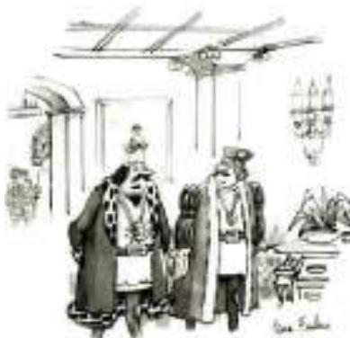
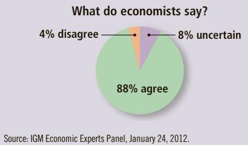

# Earnings and Discrimination

n the United States today, the typical physician earns about \$200,000 a year, the typical police officer about \$60,000, and the typical fast-food cook about \$20,000. These examples illustrate the large differences in earnings in our economy. These differences explain why some people live in mansions, ride in limousines, and vacation on the French Riviera, while other people live in small apartments, ride the bus, and vacation in their own backyards.

Why do earnings vary so much from person to person? Chapter 18, which developed the basic neoclassical theory of the labor market, offers an answer to this question. There we saw that wages are governed by labor supply and labor demand. Labor demand, in turn, reflects the marginal productivity of labor. In equilibrium, each worker is paid the value of her marginal contribution to the economy’s production of goods and services.

This theory of the labor market, though widely accepted by economists, is only the beginning of the story. To understand the wide variation in earnings that we observe, we must go beyond this general framework and examine more precisely what determines the supply and demand for different types of labor. That is our goal in this chapter.

## 19-1 Some Determinants of Equilibrium Wages

  
ROBERT MANKOFF/ THE NEW YORKER COLLECTION/  
WWW.CARTOONBANK.COM  
“On the one hand, I know I could make more money if I left public service for the private sector, but, on the other hand, I couldn’t chop off heads.”

Workers differ from one another in many ways, as do jobs. In this section, we consider how the characteristics of workers and jobs affect labor supply, labor demand, and equilibrium wages.

## 19-1a Compensating Differentials

When a worker is deciding whether to take a job, the wage is only one of many job attributes that the worker takes into account. Some jobs are easy, fun, and safe, while others are hard, dull, and dangerous. The better the job as gauged by these nonmonetary characteristics, the more people there are who are willing to do the job at any given wage. In other words, the supply of labor for easy, fun, and safe jobs is greater than the supply of labor for hard, dull, and dangerous jobs. As a result, “good” jobs will tend to have lower equilibrium wages than “bad” ones.

For example, imagine you are looking for a summer job in a local beach community. Two kinds of jobs are available. You can take a job as a beach-badge checker, or you can take a job as a garbage collector. The beach-badge checkers take leisurely strolls along the beach during the day and check to make sure the tourists have bought the required beach permits. The garbage collectors wake up before dawn to drive dirty, noisy trucks around town to pick up garbage. Which job would you want? If the two jobs paid the same wage, most people would prefer the badge-checker job. To induce people to become garbage collectors, the town has to offer higher wages to garbage collectors than to beach-badge checkers.

compensating differential a difference in wages that arises to offset the nonmonetary characteristics of different jobs

Economists use the term compensating differential to refer to a difference in wages that arises from nonmonetary characteristics of different jobs. Compensating differentials are prevalent in the economy. Here are some examples:

Coal miners are paid more than other workers with similar levels of education. Their higher wage compensates them for the dirty and dangerous nature of coal mining, as well as the long-term health problems that coal miners experience.

• Workers who work the night shift at factories are paid more than similar workers who work the day shift. The higher wage compensates them for having to work at night and sleep during the day, a lifestyle that most people find undesirable.

• Professors are paid less than lawyers and doctors, who have similar amounts of education. The higher wages of lawyers and doctors compensate them for missing out on the great intellectual and personal satisfaction that professors jobs offer. (Indeed, teaching economics is so much fun that it is surprising economics professors are paid anything at all!)

## 19-1b Human Capital

As we discussed in the previous chapter, the word capital usually refers to an economy’s stock of equipment and structures. The capital stock includes the farmer’s tractor, the manufacturer’s factory, and the teacher’s chalkboard. The essence of capital is that it is a factor of production that itself has been produced.

There is another type of capital that, while less tangible than physical capital, is just as important to the economy’s production. Human capital is the accumulation of investments in people. The most important type of human capital is education. Like all forms of capital, education represents an expenditure of resources at one time to raise productivity in the future. But unlike an investment in other forms of capital, an investment in education is tied to a specific person, and this linkage is what makes it human capital.

human capital the accumulation of investments in people, such as education and on-the-job training

Not surprisingly, workers with more human capital earn more on average than those with less human capital. College graduates in the United States, for example, earn almost twice as much as those with only a high school diploma. This large difference has been documented in many countries around the world. It tends to be even larger in less developed countries, where educated workers are in scarce supply.

From the perspective of supply and demand it is easy to see why education raises wages. Firms—the demanders of labor—are willing to pay more for highly educated workers because these workers have higher marginal products. Workers—the suppliers of labor—are willing to pay the cost of becoming educated only if there is a reward for doing so. In essence, the difference in wages between highly educated workers and less educated workers may be considered a compensating differential for the cost of becoming educated.

## THE INCREASING VALUE OF SKILLS

“The rich get richer, and the poor get poorer.” Like many adages, this one is not always true, but it has been in recent years. Many studies have documented that the earnings gap between workers with high skills and workers with low skills has increased over the past several

decades.

Table 1 presents data on the average earnings of college graduates and of high school graduates without any additional education. These data show the increase in the financial reward from education. In 1974, a man on average earned 42 percent more with a college degree than without one; by 2014, this figure had risen to 81 percent. For a woman, the reward for attending college rose from a 35 percent increase in earnings in 1974 to a 71 percent increase in 2014. The incentive to stay in school is as great today as it has ever been.

Why has the gap in earnings between skilled and unskilled workers widened in recent years? No one knows for sure, but economists have proposed two hypotheses to explain this trend. Both hypotheses suggest that the demand for skilled labor has risen over time relative to the demand for unskilled labor. The shift in demand has led to a corresponding change in the wages of both groups, which in turn has led to greater inequality.

<table><tr><td colspan="3">TABLE 1</td></tr><tr><td></td><td>1974</td><td>2014</td></tr><tr><td colspan="3">Men</td></tr><tr><td>High school, no college</td><td>$52,521</td><td>$46,688</td></tr><tr><td>College graduates</td><td>$74,801</td><td>$84,567</td></tr><tr><td>Percent extra for college grads</td><td>+42%</td><td>+81%</td></tr><tr><td colspan="3">Women</td></tr><tr><td>High school, no college</td><td>$30,185</td><td>$34,394</td></tr><tr><td>College graduates</td><td>$40,831</td><td>$58,894</td></tr><tr><td>Percent extra for college grads</td><td>+35%</td><td>+71%</td></tr><tr><td colspan="3">Note: Earnings data are adjusted for inflation and are expressed in 2014 dollars. Data apply to full-time, year-round workers age 18 and over. Data for college graduates exclude workers with additional schooling beyond college, such as a master&#x27;s degree or Ph.D.</td></tr><tr><td colspan="3">Source: U.S. Census Bureau and author&#x27;s calculations.</td></tr></table>

The first hypothesis is that international trade has altered the relative demand for skilled and unskilled labor. In recent years, the amount of trade with other countries has increased substantially. As a percentage of total U.S. production of goods and services, imports have risen from 8 percent in 1974 to 17 percent in 2014, and exports have risen from 8 percent in 1974 to 14 percent in 2014. Because

## ASK THE EXPERTS

## Inequality and Skills

“One of the leading reasons for rising U.S. income inequality over the past three decades is that technological change has affected workers with some skill sets differently than others.”

  
Source: IGM Economic Experts Panel, January 24, 2012.

unskilled labor is plentiful and cheap in many foreign countries, the United States tends to import goods produced with unskilled labor and export goods produced with skilled labor. Thus, when international trade expands, the domestic demand for skilled labor rises and the domestic demand for unskilled labor falls.

The second hypothesis is that changes in technology have altered the relative demand for skilled and unskilled labor. Consider, for instance, the introduction of computers. Computers raise the demand for the skilled workers who can use them and reduce the demand for the unskilled workers whose jobs are replaced by them. For example, many companies now rely more on computer databases, and less on filing cabinets, to keep business records. This change raises the demand for computer programmers and reduces the demand for filing clerks. Thus, as more firms use computers, the demand for skilled labor rises and the demand for unskilled labor falls. Economists call this phenomenon skill-biased technological change.

Economists debate the importance of trade, technology, and other forces on the changing distribution of wages. There is likely not a single answer as to why income inequality has increased. Increasing international trade and skill-biased technological change may share responsibility for the changes we have observed in recent decades. In the next chapter, we discuss the issue of increasing inequality in more detail.
