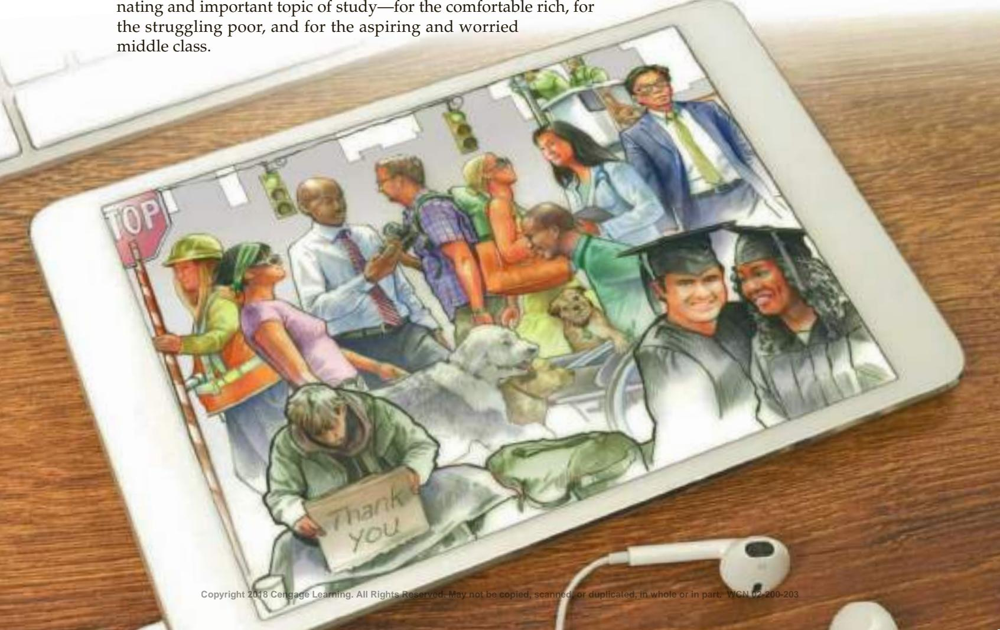
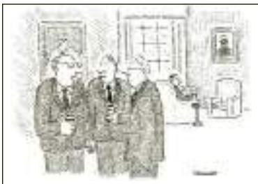
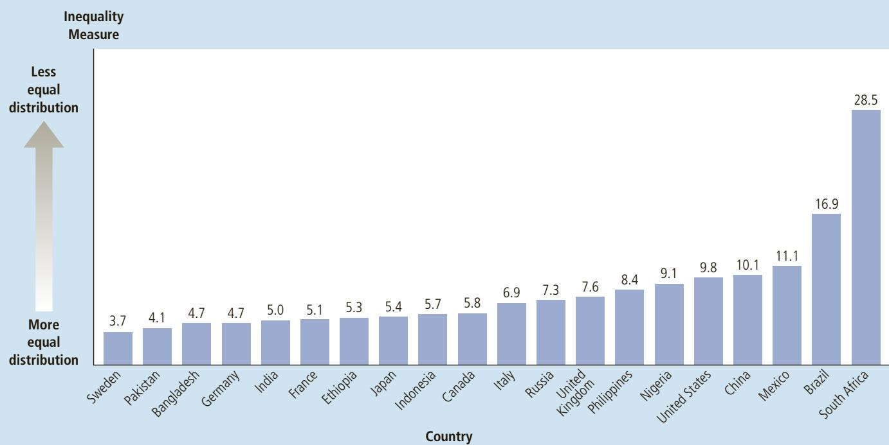

# Income Inequality and Poverty

20

he great British Prime Minister Winston Churchill once summarized alternative economic systems as follows: “The inherent vice of capitalism is the unequal sharing of blessings. The inherent virtue of socialism is the equal sharing of miseries.” Churchill’s quip draws attention to two important facts. First, nations that use market mechanisms to allocate resources usually achieve greater prosperity than those that do not. This is the result of Adam Smith’s invisible hand in action. Second, the prosperity that market economies produce is not shared equally. Incomes can differ greatly between those at the top and those at the bottom of the economic ladder. The gap between rich and poor is a fascinating and important topic of study—for the comfortable rich, for the struggling poor, and for the aspiring and worried middle class.

WWW.CARTOONBANK.COM ROBERT MANKOFF/ THE NEW YORKER COLLECTION/

From the previous two chapters, you should have some understanding about why different people have different incomes. A person’s earnings depend on the supply and demand for that person’s labor, which in turn depend on natural ability, human capital, compensating differentials, discrimination, and so on. Because labor earnings make up about two-thirds of the total income in the U.S. economy, the factors that determine wages are also largely responsible for determining how the economy’s total income is distributed among the various members of society. In other words, they determine who is rich and who is poor.

In this chapter, we discuss the distribution of income—a topic that raises some fundamental questions about the role of economic policy. One of the Ten Principles of Economics introduced in Chapter 1 is that governments can sometimes improve market outcomes. This possibility is particularly important when considering the distribution of income. The invisible hand of the marketplace allocates resources efficiently but does not necessarily allocate them fairly. As a result, many economists—though not all—believe that the government should redistribute income to achieve greater equality. In doing so, however, the government runs into another of the Ten Principles of Economics: People face trade-offs. When the government enacts policies to make the distribution of income more equal, it distorts incentives, alters behavior, and makes the allocation of resources less efficient.

Our discussion of the distribution of income proceeds in three steps. First, we assess how much inequality there is in our society. Second, we consider some different views about the role that government should play in altering the distribution of income. Third, we discuss various public policies aimed at helping society’s poorest members.

## 20-1 The Measurement of Inequality

We begin our study of the distribution of income by addressing four questions of measurement:

• How much inequality is there in our society?

• How many people live in poverty?

• What problems arise in measuring the amount of inequality?

• How often do people move between income classes?

  
“As far as I’m concerned, they can do what they want with the minimum wage, just as long as they keep their hands off the maximum wage.”

These measurement questions are the natural starting point from which to discuss public policies aimed at changing the distribution of income.

## 20-1a U.S. Income Inequality

Imagine that you lined up all the families in the economy according to their annual income. Then you divided the families into five equal groups, called quintiles. Table 1 shows the income ranges for each quintile, as well as for the top 5 percent. You can use this table to find where your family lies in the income distribution.

For examining differences in the income distribution over time, economists find it useful to present the income data as in Table 2. This table shows the share of total income that each group of families received in selected years. In 2014, the bottom quintile received 3.6 percent of all income and the top quintile received 48.9 percent of all income. In other words, even though all the quintiles include the same number of families, the top quintile has more than thirteen times as much income as the bottom quintile.

<table><tr><td>Group</td><td>Annual Family Income</td></tr><tr><td>Bottom Quintile</td><td>$29,100 and below</td></tr><tr><td>Second Quintile</td><td>$29,101–$52,697</td></tr><tr><td>Middle Quintile</td><td>$52,698–$82,032</td></tr><tr><td>Fourth Quintile</td><td>$82,033–$129,006</td></tr><tr><td>Top Quintile</td><td>$129,007 and above</td></tr><tr><td>Top 5 percent</td><td>$230,030 and above</td></tr></table>

## TABLE 1

The Distribution of Income in the United States: 2014

Source: U.S. Bureau of the Census.

<table><tr><td>Year</td><td>Bottom Quintile</td><td>Second Quintile</td><td>Middle Quintile</td><td>Fourth Quintile</td><td>Top Quintile</td><td>Top 5%</td></tr><tr><td>2014</td><td>3.6%</td><td>9.2%</td><td>15.1%</td><td>23.2%</td><td>48.9%</td><td>20.8%</td></tr><tr><td>2010</td><td>3.8</td><td>9.4</td><td>15.4</td><td>23.5</td><td>47.9</td><td>20.0</td></tr><tr><td>2000</td><td>4.3</td><td>9.8</td><td>15.4</td><td>22.7</td><td>47.7</td><td>21.1</td></tr><tr><td>1990</td><td>4.6</td><td>10.8</td><td>16.6</td><td>23.8</td><td>44.3</td><td>17.4</td></tr><tr><td>1980</td><td>5.3</td><td>11.6</td><td>17.6</td><td>24.4</td><td>41.1</td><td>14.6</td></tr><tr><td>1970</td><td>5.4</td><td>12.2</td><td>17.6</td><td>23.8</td><td>40.9</td><td>15.6</td></tr><tr><td>1960</td><td>4.8</td><td>12.2</td><td>17.8</td><td>24.0</td><td>41.3</td><td>15.9</td></tr><tr><td>1950</td><td>4.5</td><td>12.0</td><td>17.4</td><td>23.4</td><td>42.7</td><td>17.3</td></tr><tr><td>1935</td><td>4.1</td><td>9.2</td><td>14.1</td><td>20.9</td><td>51.7</td><td>26.5</td></tr></table>

## TABLE 2

Income Inequality in the United States

This table shows the percentage of total before-tax income received by families in each fifth of the income distribution and by those families in the top 5 percent.

Source: U.S. Bureau of the Census.

The last column in the table shows the share of total income received by the very richest families. In 2014, the top 5 percent of families received 20.8 percent of all income, which was greater than the total income of the poorest 40 percent.

Table 2 also shows the distribution of income in various years beginning in 1935. At first glance, the distribution of income appears to have been remarkably stable over time. Throughout the past several decades, the bottom quintile has received about 4 to 5 percent of income, while the top quintile has received about 40 to 50 percent of income. Closer inspection of the table reveals some trends in the degree of inequality. From 1935 to 1970, the distribution gradually became more equal. The share of the bottom quintile rose from 4.1 to 5.4 percent, and the share of the top quintile fell from 51.7 to 40.9 percent. In more recent years, this trend has reversed itself. From 1970 to 2014, the share of the bottom quintile fell from 5.4 to 3.6 percent, and the share of the top quintile rose from 40.9 to 48.9 percent.

In Chapter 19, we discussed some explanations for this recent rise in inequality. Increases in international trade with low-wage countries and changes in technology have tended to reduce the demand for unskilled labor and raise the demand for skilled labor. As a result, the wages of unskilled workers have fallen relative to the wages of skilled workers, and this change in relative wages has increased inequality in family incomes.

## 20-1b Inequality around the World

How does the amount of inequality in the United States compare to that in other countries? This question is interesting, but answering it is problematic. For some countries, data are not available. Even when they are, not every country collects data in the same way; for example, some countries collect data on individual incomes, whereas other countries collect data on family incomes, and still others collect data on expenditure and use it as a crude measure of income. As a result, whenever we find a difference between two countries, we can never be sure whether it reflects a true difference in the economies or merely a difference in the way data are collected.

With this warning in mind, consider Figure 1, which compares inequality in twenty major countries. The inequality measure used here is the quintile ratio, which is the income of the richest quintile divided by the income of the poorest quintile. The most equality is found in Sweden, where the top quintile receives 3.7 times as much income as the bottom quintile. The least equality is found in South Africa, where the top group receives 28.5 times as much income as the bottom group. All countries have significant disparities between rich and poor, but the degree of inequality varies substantially around the world.

When countries are ranked by inequality, the United States ends up with more inequality than the typical country. The United States has substantially greater income disparity than most other economically advanced countries, such as Japan and Germany. But it has a more equal income distribution than some developing countries, such as South Africa and Brazil. The United States has about the same degree of inequality as China, the world’s most populous nation.

## FIGURE 1

Inequality around the World

This figure shows the ratio of the income of the richest quintile to the income of the poorest quintile. Among these nations, Sweden and Pakistan have the most equal distribution of economic well-being, while South Africa and Brazil have the least equal.

  
Source: Human Development Report 2015.
