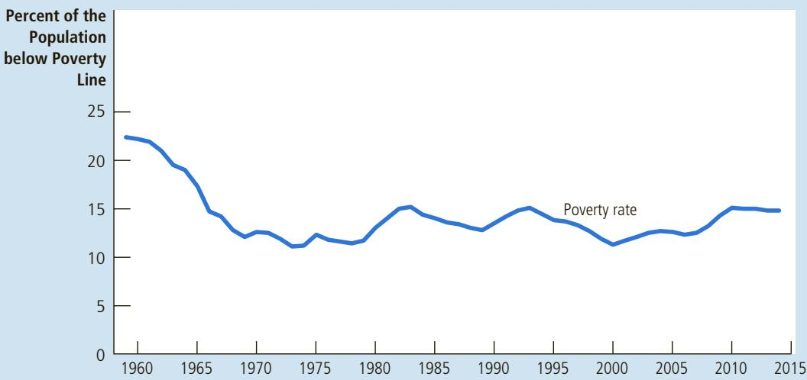

# IN THE NEWS

# A Worldwide View of the Income Distribution

A global perspective reveals some good news about inequality.

## Income Inequality Is Not Rising Globally. It’s Falling.

By Tyler Cowen

ncome inequality has surged as a political and economic issue, but the numbers don’t show that inequality is rising from a global perspective. Yes, the problem has become more acute within most individual nations, yet income inequality for the world as a whole has been falling for most of the last 20 years. It’s a fact that hasn’t been noted often enough.

The finding comes from a recent investigation by Christoph Lakner, a consultant at the World Bank, and Branko Milanovic, senior scholar at the Luxembourg Income Study Center. And while such a framing may sound startling at first, it should be intuitive upon reflection. The economic surges of China, India and some other nations have been among the most egalitarian developments in history.

Of course, no one should use this observation as an excuse to stop helping the less fortunate. But it can help us see that higher income inequality is not always the most relevant problem, even for strict egalitarians. Policies on immigration and free trade, for example, sometimes increase inequality within a nation, yet can make the world a better place and often decrease inequality on the planet as a whole.

International trade has drastically reduced poverty within developing nations, as evidenced by the export-led growth of China and other countries. Yet contrary to what many economists had promised, there is now good evidence that the rise of Chinese exports has held down the wages of some parts of the American middle class. This was demonstrated in a recent paper by the economists David H. Autor of the Massachusetts Institute of Technology, David Dorn of the Center for Monetary and Financial Studies in Madrid, and Gordon H. Hanson of the University of California, San Diego.

At the same time, Chinese economic growth has probably raised incomes of the top 1 percent in the United States, through exports that have increased the value of companies whose shares are often held by wealthy Americans. So while Chinese growth has added to income inequality in the United States, it has also increased prosperity and income equality globally.

The evidence also suggests that immigration of low-skilled workers to the United States has a modestly negative effect on the wages of American workers without a high school diploma, as shown, for instance, in research by George Borjas, a Harvard economics professor. Yet that same immigration greatly benefits those who move to wealthy countries like the United States. (It probably also helps top American earners, who can hire household and child-care workers at cheaper prices.) Again, income inequality within the nation may rise but global inequality probably declines, especially if the new arrivals send money back home.

From a narrowly nationalist point of view, these developments may not be auspicious for the United States. But that narrow viewpoint is the main problem. We have evolved a political debate where essentially nationalistic concerns have been hiding behind the gentler cloak of egalitarianism. To clear up this confusion, one recommendation would be to preface all discussions of inequality with a reminder that global inequality has been falling and that, in this regard, the world is headed in a fundamentally better direction.

The message from groups like Occupy Wall Street has been that inequality is up and that capitalism is failing us. A more correct and nuanced message is this: Although significant economic problems remain, we have been living in equalizing times for the world—a change that has been largely for the good. That may not make for convincing sloganeering, but it’s the truth.

A common view is that high and rising inequality within nations brings political trouble, maybe through violence or even revolution. So one might argue that a nationalistic perspective is important. But it’s hardly obvious that such predictions of political turmoil are true, especially for aging societies like the United States that are showing falling rates of crime.

Furthermore, public policy can adjust to accommodate some egalitarian concerns. We can improve our educational system, for example.

Still, to the extent that political worry about rising domestic inequality is justified, it suggests yet another reframing. If our domestic politics can’t handle changes in income distribution, maybe the problem isn’t that capitalism is fundamentally flawed but rather that our political institutions are inflexible. Our politics need not collapse under the pressure of a world that, over all, is becoming wealthier and fairer. ■

Tyler Cowen is professor of economics at George Mason University.

Source: New York Times, July 20, 2014.

## poverty rate

the percentage of the population whose family income falls below an absolute level called the poverty line

poverty line an absolute level of income set by the federal government for each family size below which a family is deemed to be in poverty

## 20-1c The Poverty Rate

A commonly used gauge of the distribution of income is the poverty rate. The poverty rate is the percentage of the population whose family income falls below an absolute level called the poverty line. The poverty line is set by the federal government at roughly three times the cost of providing an adequate diet. This line depends on family size and is adjusted every year to account for changes in the level of prices.

To get some idea about what the poverty rate tells us, consider the data for 2014. In that year, the median family in the United States had an income of \$66,632, and the poverty line for a family of four was \$24,230. The poverty rate was 14.8 percent. In other words, 14.8 percent of the U.S. population were members of families with incomes below the poverty line for their family size.

Figure 2 shows the poverty rate since 1959, when the official data begin. You can see that the poverty rate fell from 22.4 percent in 1959 to a low of 11.1 percent in 1973. This decline is not surprising, as average income in the economy (adjusted for inflation) rose more than 50 percent during this period. Because the poverty line is an absolute rather than a relative standard, more families are pushed above the poverty line as economic growth pushes the entire income distribution upward. As John F. Kennedy once put it, a rising tide lifts all boats.

Since the early 1970s, however, the economy’s rising tide has left some boats behind. Despite continued growth in average income, the poverty rate has not declined below the level reached in 1973. This lack of progress in reducing poverty in recent decades is closely related to the increasing inequality we saw in Table 2. Although economic growth has raised the income of the typical family, the increase in inequality has prevented the poorest families from sharing in this greater economic prosperity.

Poverty is an economic malady that affects all groups within the population, but it does not affect all groups with equal frequency. Table 3 shows the poverty rates for several groups, and it reveals three striking facts:

• Poverty is correlated with race. Blacks and Hispanics are more than twice as likely to live in poverty as whites.

## FIGURE 2

## The Poverty Rate

The poverty rate measures the percentage of the population with incomes below an absolute level called the poverty line.

  
Source: U.S. Bureau of the Census.

<table><tr><td>Group</td><td>Poverty Rate</td></tr><tr><td>All persons</td><td>14.8%</td></tr><tr><td>White, not Hispanic</td><td>10.1</td></tr><tr><td>Black</td><td>26.2</td></tr><tr><td>Hispanic</td><td>23.6</td></tr><tr><td>Asian</td><td>12.0</td></tr><tr><td>Children (under age 18)</td><td>21.1</td></tr><tr><td>Elderly (over age 64)</td><td>10.0</td></tr><tr><td>Married-couple families</td><td>6.2</td></tr><tr><td>Female household, no spouse present</td><td>33.1</td></tr></table>

## TABLE 3

## Who Is Poor?

This table shows that the poverty rate varies greatly among different groups within the population.

Source: U.S. Bureau of the Census. Data are for 2014.

• Poverty is correlated with age. Children are more likely than average to be members of poor families, and the elderly are less likely than average to be poor.

• Poverty is correlated with family composition. Families headed by a single mother are about five times as likely to live in poverty as families headed by a married couple.

These three facts have described American society for many years, and they show which people are most likely to be poor. These effects also work together: Almost half the children in black and Hispanic female-headed households live in poverty.

## 20-1d Problems in Measuring Inequality

Although data on the income distribution and the poverty rate give us some idea about the degree of inequality in our society, interpreting these data is not always straightforward. The data are based on households’ annual incomes. What people care about, however, is not their incomes but their ability to maintain a good standard of living. For at least three reasons, data on the income distribution and the poverty rate give an incomplete picture of inequality in living standards.

In-Kind Transfers Measurements of the distribution of income and the poverty rate are based on families’ monetary income. Through various government programs, however, the poor receive many nonmonetary items, including free food, housing vouchers, and medical services. Transfers given to the poor in the form of goods and services rather than cash are called in-kind transfers. Standard measurements of the degree of inequality do not include these in-kind transfers.

Because in-kind transfers are received mostly by the poorest members of society, the failure to include in-kind transfers as part of income greatly affects the measured poverty rate. According to a study by the Census Bureau, if in-kind transfers were included in income at their market value, the number of families in poverty would be about 10 percent lower than the standard data indicate.

The Economic Life Cycle Incomes vary predictably over people’s lives. A young worker, especially one in school, has a low income. Income rises as the worker gains maturity and experience, peaks at around age 50, and then falls sharply when the worker retires at around age 65. This regular pattern of income variation is called the life cycle.

Because people can borrow and save to smooth out life cycle changes in income, their standard of living in any year depends more on lifetime income than on that year’s income. The young often borrow, perhaps to go to school or to buy a house, and then repay these loans later when their incomes rise. People have their highest saving rates when they are middle-aged. Because people can save in anticipation of retirement, the large declines in incomes at retirement need not lead to similar declines in the standard of living. This normal life cycle pattern causes inequality in the distribution of annual income, but it does not necessarily represent true inequality in living standards.

Transitory versus Permanent Income Incomes vary over people’s lives not only because of predictable life cycle variation but also because of random and transitory forces. One year a frost kills off the Florida orange crop, and Florida orange growers see their incomes fall temporarily. At the same time, the Florida frost drives up the price of oranges, and California orange growers see their incomes temporarily rise. The next year the reverse might happen.

Just as people can borrow and save to smooth out life cycle variation in income, they can also borrow and save to smooth out transitory variation in income. To the extent that a family saves in good years and borrows (or depletes its savings) in bad years, transitory changes in income need not affect its standard of living. A family’s ability to buy goods and services depends largely on its permanent income, which is its normal, or average, income.

To gauge inequality of living standards, the distribution of permanent income is more relevant than the distribution of annual income. Many economists believe that people base their consumption on their permanent income; as a result, inequality in consumption is one gauge of inequality of permanent income. Because permanent income and consumption are less affected by transitory changes in income, they are more equally distributed than is current income.

## ALTERNATIVE MEASURES OF INEQUALITY

A 2008 study by Michael Cox and Richard Alm of the Federal Reserve Bank of Dallas shows how different measures of inequality lead to dramatically different results. Cox and Alm compared American households in the top fifth of the income distribution to those in the th to see how far apart they are.

According to Cox and Alm, the richest fifth of U.S. households in 2006 had an average income of \$149,963, while the poorest fifth had an average income of \$9,974. Thus, the top group had about 15 times as much income as the bottom group.

The gap between rich and poor shrinks a bit if taxes are taken into account. Because the tax system is progressive, the top group paid a higher percentage of its income in taxes than did the bottom group. Cox and Alm found that the richest fifth had 14 times as much after-tax income as the poorest fifth.

The gap shrinks more if one looks at consumption rather than income. Households having an unusually good year are more likely to be in the top group and are likely to save a high fraction of their incomes. Households having an unusually bad year are more likely to be in the bottom group and are more likely to consume out of their savings. According to Cox and Alm, the consumption of the richest fifth was only 3.9 times as much as the consumption of the poorest fifth.

The consumption gap becomes smaller still if one corrects for differences in the number of people in the household. Because larger families are more likely to have two earners, they are more likely to find themselves near the top of the income distribution. But they also have more mouths to feed. Cox and Alm reported that households in the top fifth had an average of 3.1 people, while those in the bottom fifth had an average of 1.7 people. As a result, consumption per person in the richest fifth of households was only 2.1 times consumption per person in the poorest fifth.

These data show that inequality in material standards of living is much smaller than inequality in annual income. ●

## 20-1e Economic Mobility

People sometimes speak of “the rich” and “the poor” as if these groups consisted of the same families year after year. But this is not at all the case. Economic mobility, the movement of people between income classes, is significant in the U.S. economy. Movements up the income ladder can be due to good luck or hard work, and movements down the ladder can be due to bad luck or laziness. Some of this mobility reflects transitory variation in income, while some reflects more persistent changes in income.

Because family income changes over time, temporary poverty is more common than the poverty rate suggests, but persistent poverty is less common. In a typical 10-year period, about one in four families falls below the poverty line in at least one year. Yet fewer than 3 percent of families are poor for 8 or more years. Because it is likely that the temporarily poor and the persistently poor face different problems, policies that aim to combat poverty need to distinguish between these groups.

Another way to gauge economic mobility is the persistence of economic success from generation to generation. Economists who have studied this topic find that having an above-average income carries over from parents to children, but the persistence is far from perfect, indicating substantial mobility among income classes. If a father earns 20 percent above his generation’s average income, his son will most likely earn 8 percent above his generation’s average income. There is only a small correlation between the income of a grandfather and the income of his grandson.

One result of this intergenerational economic mobility is that the U.S. economy is filled with self-made millionaires (as well as with heirs who have squandered the fortunes they inherited). According to one study, about four out of five millionaires made their money on their own, often by starting and building a business or by climbing the corporate ladder. Only one in five millionaires inherited his fortune.

QuickQuiz

What does the poverty rate measure? • Describe three potential problems in interpreting the measured poverty rate.

## 20-2 The Political Philosophy of Redistributing Income

We have just seen how the economy’s income is distributed and have considered some of the problems in interpreting measured inequality. This discussion was positive in the sense that it merely described the world as it is. We now turn to the normative question facing policymakers: What should the government do about economic inequality?

This question is not just about economics. Economic analysis alone cannot tell us whether policymakers should try to make our society more egalitarian. Our views on this question are, to a large extent, a matter of political philosophy. Yet because the government’s role in redistributing income is central to so many debates over economic policy, let’s digress from economic science to consider a bit of political philosophy.

utilitarianism the political philosophy according to which the government should choose policies to maximize the total utility of everyone in society utility a measure of happiness or satisfaction

## 20-2a Utilitarianism

A prominent school of thought in political philosophy is utilitarianism. The founders of utilitarianism are the English philosophers Jeremy Bentham (1748– 1832) and John Stuart Mill (1806–1873). To a large extent, the goal of utilitarians is to apply the logic of individual decision making to questions concerning morality and public policy.

The starting point of utilitarianism is the notion of utility—the level of happiness or satisfaction that a person receives from his circumstances. Utility is a measure of well-being and, according to utilitarians, is the ultimate objective of all public and private actions. The proper goal of the government, they claim, is to maximize the sum of utility achieved by everyone in society.

The utilitarian case for redistributing income is based on the assumption of diminishing marginal utility. It seems reasonable that an extra dollar of income provides a poor person with more additional utility than an extra dollar would provide to a rich person. In other words, as a person’s income rises, the extra well-being derived from an additional dollar of income falls. This plausible assumption, together with the utilitarian goal of maximizing total utility, implies that the government should try to achieve a more equal distribution of income.

The argument is simple. Imagine that Peter and Paul are the same, except that Peter earns \$80,000 and Paul earns \$20,000. In this case, taking a dollar from Peter to pay Paul will reduce Peter’s utility and raise Paul’s utility. But because of diminishing marginal utility, Peter ’s utility falls by less than Paul’s utility rises. Thus, this redistribution of income raises total utility, which is the utilitarian’s objective.

At first, this utilitarian argument might seem to imply that the government should continue to redistribute income until everyone in society has exactly the same income. Indeed, that would be the case if the total amount of income—\$100,000 in our example—were fixed. But in fact, it is not. Utilitarians reject complete equalization of incomes because they accept one of the Ten Principles of Economics presented in Chapter 1: People respond to incentives.

To take from Peter to pay Paul, the government must pursue policies that redistribute income. The U.S. federal income tax and welfare system are examples. Under these policies, people with high incomes pay high taxes, and people with low incomes receive income transfers. These income transfers are phased out: As a person earns more, he receives less from the government. Yet when Peter faces a higher income tax rate and Paul faces a system of phased-out transfers, both have less incentive to work hard, because each gets to keep only a fraction of any additional earnings. As they both work less, society’s income falls, and so does total utility. The utilitarian government has to balance the gains from greater equality against the losses from distorted incentives. To maximize total utility, therefore, the government stops short of making society fully egalitarian.

A famous parable sheds light on the utilitarian’s logic. Imagine that Peter and Paul are thirsty travelers trapped at different places in the desert. Peter’s oasis has a lot of water; Paul’s has only a little. If the government could transfer water from one oasis to the other without cost, it would maximize total utility from water by equalizing the amount in the two places. But suppose that the government has only a leaky bucket. As it tries to move water from one place to the other, some of the water is lost in transit. In this case, a utilitarian government might still try to move some water from Peter to Paul, depending on the size of Paul’s thirst and the size of the bucket’s leak. But with only a leaky bucket at its disposal, a utilitarian government will stop short of trying to reach complete equality.

## 20-2b Liberalism

A second way of thinking about inequality might be called liberalism. Philosopher John Rawls develops this view in his book A Theory of Justice. This book was first published in 1971, and it quickly became a classic in political philosophy.

Rawls begins with the premise that a society’s institutions, laws, and policies should be just. He then takes up the natural question: How can we, the members of society, ever agree on what justice means? It might seem that every person’s point of view is inevitably based on his particular circumstances—whether he is talented or less talented, diligent or lazy, educated or less educated, born to a wealthy family or a poor one. Could we ever objectively determine what a just society would look like?

liberalism the political philosophy according to which the government should choose policies deemed just, as evaluated by an impartial observer behind a “veil of ignorance”

To answer this question, Rawls proposes the following thought experiment. Imagine that before any of us is born, we all get together in the beforelife (the pre-birth version of the afterlife) for a meeting to design the rules that will govern society. At this point, we are all ignorant about the station in life each of us will end up filling. In Rawls’s words, we are sitting in an “original position” behind a “veil of ignorance.” In this original position, Rawls argues, we can choose a just set of rules for society because we must consider how those rules will affect every person. As Rawls puts it, “Since all are similarly situated and no one is able to design principles to favor his particular conditions, the principles of justice are the result of fair agreement or bargain.” Designing public policies and institutions in this way allows us to be objective about what policies are just.

Rawls then considers what public policy designed behind this veil of ignorance would try to achieve. In particular, he considers what income distribution a person would consider fair if that person did not know whether he would end up at the top, bottom, or middle of the distribution. Rawls argues that a person in the original position would be chiefly concerned about the possibility of being at the bottom of the income distribution. In designing public policies, therefore, we should aim to raise the welfare of the worst-off person in society. That is, rather than maximizing the sum of everyone’s utility, as a utilitarian would do, Rawls would strive to maximize the minimum utility. Rawls’s rule is called the maximin criterion.

Because the maximin criterion emphasizes the least fortunate person in society, it justifies public policies aimed at equalizing the distribution of income. By transferring income from the rich to the poor, society raises the well-being of the least fortunate. The maximin criterion would not, however, lead to a completely egalitarian society. If the government promised to equalize incomes completely, people would have no incentive to work hard, society’s total income would fall substantially, and the least fortunate person would be worse off. Thus, the maximin criterion still allows disparities in income because such disparities can improve incentives and thereby raise society’s ability to help the poor. Nonetheless, because Rawls’s philosophy puts weight on only the least fortunate members of society, it calls for more income redistribution than does utilitarianism.

Rawls’s views are controversial, but the thought experiment he proposes has much appeal. In particular, this thought experiment allows us to consider the redistribution of income as a form of social insurance. That is, from the

maximin criterion the claim that the government should aim to maximize the well-being of the worst-off person in society

perspective of the original position behind the veil of ignorance, income redistribution is like an insurance policy. Homeowners buy fire insurance to protect themselves from the risk of their house burning down. Similarly, when we as a society choose policies that tax the rich to supplement the incomes of the poor, we are all insuring ourselves against the possibility that we might have been members of poor families. Because people generally dislike risk, we should be happy to have been born into a society that provides us this insurance.

It is not at all clear, however, that rational people behind the veil of ignorance would truly be so risk averse that they would follow the maximin criterion. Indeed, because a person in the original position might end up anywhere in the distribution of outcomes, he might treat all possible outcomes equally when designing public policies. In this case, the best policy behind the veil of ignorance would be to maximize the average utility of members of society, and the resulting notion of justice would be more utilitarian than Rawlsian.

## 20-2c Libertarianism

## libertarianism

the political philosophy according to which the government should punish crimes and enforce voluntary agreements but not redistribute income

A third view of inequality is called libertarianism. The two views we have considered so far—utilitarianism and liberalism—both view the total income of society as a shared resource that a social planner can freely redistribute to achieve some social goal. By contrast, libertarians argue that society itself earns no income— only individual members of society earn income. According to libertarians, the government should not take from some individuals and give to others to achieve any particular distribution of income.

For instance, philosopher Robert Nozick writes the following in his famous 1974 book Anarchy, State, and Utopia:

We are not in the position of children who have been given portions of pie by someone who now makes last minute adjustments to rectify careless cutting. There is no central distribution, no person or group entitled to control all the resources, jointly deciding how they are to be doled out. What each person gets, he gets from others who give to him in exchange for something, or as a gift. In a free society, diverse persons control different resources, and new holdings arise out of the voluntary exchanges and actions of persons.

Whereas utilitarians and liberals try to judge what amount of inequality is desirable in a society, Nozick denies the validity of this very question.

The libertarian alternative to evaluating economic outcomes is to evaluate the process by which these outcomes arise. When the distribution of income is achieved unfairly—for instance, when one person steals from another—the government has the right and duty to remedy the problem. But as long as the process determining the distribution of income is just, the resulting distribution is fair, no matter how unequal.

Nozick criticizes Rawls’s liberalism by drawing an analogy between the distribution of income in society and the distribution of grades in a course. Suppose you were asked to judge the fairness of the grades in the economics course you are now taking. Would you imagine yourself behind a veil of ignorance and choose a grade distribution without knowing the talents and efforts of each student? Or would you ensure that the process of assigning grades to students is fair without regard for whether the resulting distribution is equal or unequal? For the case of grades at least, the libertarian emphasis on process over outcomes is compelling.

Libertarians conclude that equality of opportunities is more important than equality of incomes. They believe that the government should enforce individual rights to ensure that everyone has the same opportunity to use his talents and achieve success. Once these rules of the game are established, the government has no reason to alter the resulting distribution of income.

each evaluate this proposal? s proposal?

Petra earns more than Paula. Someone proposes taxing Petra to supplement Paula’s income. How would a utilitarian, a liberal, and a libertarian

## 20-3 Policies to Reduce Poverty

As we have just seen, political philosophers hold various views about what role the government should take in altering the distribution of income. Political debate among the larger population of voters reflects a similar disagreement. Despite these continuing debates, most people believe that, at the very least, the government should try to help those most in need. According to a popular metaphor, the government should provide a “safety net” to prevent any citizen from falling too far.

Poverty is one of the most difficult problems that policymakers face. Poor families are more likely than the overall population to experience homelessness, drug dependence, health problems, teenage pregnancy, illiteracy, unemployment, and low educational attainment. Members of poor families are more likely both to commit crimes and to be victims of crimes. Although it is hard to separate the causes of poverty from the effects, there is no doubt that poverty is associated with various economic and social ills.

Suppose that you were a policymaker in the government and your goal was to reduce the number of people living in poverty. How would you achieve this goal? Here we examine some of the policy options that you might consider. Each of these options helps some people escape poverty, but none of them is perfect, and deciding upon the best combination to use is not easy.

## 20-3a Minimum-Wage Laws

Laws setting a minimum wage that employers can pay workers are a perennial source of debate. Advocates view the minimum wage as a way of helping the working poor without any cost to the government. Critics view it as hurting those it is intended to help.

The minimum wage is easily understood using the tools of supply and demand, as we first saw in Chapter 6. For workers with low levels of skill and experience, a high minimum wage forces the wage above the level that balances supply and demand. It therefore raises the cost of labor to firms and reduces the quantity of labor that those firms demand. The result is higher unemployment among those groups of workers affected by the minimum wage. Those workers who remain employed benefit from a higher wage, but those who might have been employed at a lower wage are worse off.

The magnitude of these effects depends crucially on the elasticity of labor demand. Advocates of a high minimum wage argue that the demand for unskilled labor is relatively inelastic so that a high minimum wage depresses employment only slightly. Critics of the minimum wage argue that labor demand is more elastic, especially in the long run when firms can adjust employment and production more fully. They also note that many minimum-wage workers are teenagers from middle-class families so that a high minimum wage is imperfectly targeted as a policy for helping the poor.

## 20-3b Welfare

One way for the government to raise the living standards of the poor is to supplement their incomes. The primary way the government does this is through the welfare system. Welfare is a broad term that encompasses various government programs. Temporary Assistance for Needy Families (TANF) is a program that assists families with children and no adult able to support the family. In a typical family receiving such assistance, the father is absent and the mother is at home raising small children. Another welfare program is Supplemental Security Income (SSI), which provides assistance to the poor who are sick or disabled. Note that for both of these welfare programs, a poor person cannot qualify for assistance simply by having a low income. He must also establish some additional “need,” such as small children or a disability.

A common criticism of welfare programs is that they create incentives for people to become “needy.” For example, these programs may encourage families to break up, for many families qualify for financial assistance only if the father is absent. The programs may also encourage illegitimate births, for many poor, single women qualify for assistance only if they have children. Because poor, single mothers are such a large part of the poverty problem and because welfare programs seem to raise the number of poor, single mothers, critics of the welfare system assert that these policies exacerbate the very problems they are supposed to cure. As a result of these arguments, the welfare system was revised in a 1996 law that limited the amount of time recipients could stay on welfare.

How severe are these potential problems with the welfare system? No one knows for sure. Proponents of the welfare system point out that being a poor, single mother on welfare is a difficult existence at best, and they do not believe that many people would choose such a life if it were not thrust upon them. Moreover, trends over time do not support the view that the decline of the two-parent family is largely a symptom of the welfare system, as the system’s critics sometimes claim. Since the early 1970s, welfare benefits (adjusted for inflation) have declined, yet the percentage of children living with only one parent has risen.

## 20-3c Negative Income Tax

Whenever the government chooses a system to collect taxes, it affects the distribution of income. This is clearly true in the case of a progressive income tax, whereby high-income families pay a larger percentage of their income in taxes than do low-income families. As we discussed in Chapter 12, equity across income groups is an important goal in the design of a tax system.

Many economists have advocated supplementing the income of the poor using a negative income tax. According to this policy, every family would report its income to the government. High-income families would pay a tax based on their incomes. Low-income families would receive a subsidy. In other words, they would “pay” a “negative tax.”

For example, suppose the government used the following formula to compute a family’s tax liability:

$$
\text {Taxes owed} = \left(\frac{1}{3} \text {of income}\right) - \$ 10,000.
$$

In this case, a family that earned \$60,000 would pay \$10,000 in taxes, and a family that earned \$90,000 would pay \$20,000 in taxes. A family that earned \$30,000 would owe nothing. And a family that earned \$15,000 would “owe” −\$5,000. In other words, the government would send this family a check for \$5,000.

Under a negative income tax, poor families would receive financial assistance without having to demonstrate need. The only qualification required to receive assistance would be a low income. Depending on one’s point of view, this feature can be either an advantage or a disadvantage. On the one hand, a negative income tax does not encourage illegitimate births and the breakup of families, as critics of the welfare system believe current policy does. On the other hand, a negative income tax would subsidize not only the unfortunate but also those who are simply lazy and, in some people’s eyes, undeserving of government support.

One actual tax provision that works much like a negative income tax is the Earned Income Tax Credit (EITC). This credit allows poor working families to receive income tax refunds greater than the taxes they paid during the year. Because the EITC applies only to the working poor, it does not discourage recipients from working, as other antipoverty programs may. For the same reason, however, it also does not help alleviate poverty due to unemployment, sickness, or other inability to work.

## 20-3d In-Kind Transfers

Another way to help the poor is to provide them directly with some of the goods and services they need to raise their living standards. For example, charities provide the needy with food, clothing, shelter, and toys at Christmas. The government gives poor families food through the Supplemental Nutrition Assistance Program, or SNAP. This program, which replaced a similar one called food stamps, gives low-income families a plastic card, like a debit card, that can be used to buy food at stores. The government also gives many poor people healthcare through a program called Medicaid.

Is it better to help the poor with these in-kind transfers or with direct cash payments? There is no clear answer.

Advocates of in-kind transfers argue that such transfers ensure that the poor get what they need most. Among the poorest members of society, alcohol and drug addiction is more common than it is in society as a whole. By providing the poor with food and shelter, society can be more confident that it is not helping to support such addictions. This is one reason in-kind transfers are more politically popular than cash payments to the poor.

Advocates of cash payments, on the other hand, argue that in-kind transfers are inefficient and disrespectful. The government does not know what goods and services the poor need most. Many of the poor are ordinary people down on their luck. Despite their misfortune, they are in the best position to decide how to raise their own living standards. Rather than giving the poor in-kind transfers of goods and services that they may not want, it may be better to give them cash and allow them to buy what they think they need most.

## 20-3e Antipoverty Programs and Work Incentives

Many policies aimed at helping the poor can have the unintended effect of discouraging the poor from escaping poverty on their own. To see why, consider the following example. Suppose that a family needs an income of \$20,000 to maintain a reasonable standard of living. And suppose that, out of concern for the poor, the government promises to guarantee every family that income. Whatever a family earns, the government makes up the difference between that income and \$20,000. What effect would you expect this policy to have?

The incentive effects of this policy are obvious: Any person who would make under \$20,000 by working has little incentive to find and keep a job. For every dollar that the person would earn, the government would reduce the income supplement by a dollar. In effect, the government taxes 100 percent of additional earnings. An effective marginal tax rate of 100 percent is surely a policy with a large deadweight loss.

IN THE NEWS
