# PART VII

# Topics for Further Study

# The Theory of Consumer Choice

CHAPTER

21

When you walk into a store, you are confronted with thousands of goods thatyou might buy. Because your financial resources are limited, however, you you might buy. Because your financial resources are limited, however, you cannot buy everything that you want. You therefore consider the prices of the various goods offered for sale and buy a bundle of goods that, given your resources, best suits your needs and desires.

In this chapter, we develop a theory that describes how consumers make decisions about what to buy. Thus far in this book, we have summarized consumers’ decisions with the demand curve. As we have seen, the demand curve for a good reflects consumers’ willingness to pay for that good. When the price rises, consumers are willing to pay for fewer units, so the quantity demanded falls. We now look more deeply at the decisions that lie behind the demand curve. The theory of consumer choice presented in this chapter provides a more complete understanding of demand, just as the theory of the competitive firm in Chapter 14 provides a more complete understanding of supply.

One of the Ten Principles of Economics discussed in Chapter 1 is that people face trade-offs. The theory of consumer choice examines the trade-offs that people face as consumers. When a consumer buys more of one good, she can afford less of other goods. When she spends more time enjoying leisure and less time working, she has lower income and therefore lower consumption. When she spends more of her income in the present and saves less of it, she reduces the amount she will be able to consume in the future. The theory of consumer choice examines how consumers facing these trade-offs make decisions and how they respond to changes in their environment.

After developing the basic theory of consumer choice, we apply it to three questions about household decisions. In particular, we ask:

• Do all demand curves slope downward?

• How do wages affect labor supply?

• How do interest rates affect household saving?

At first, these questions might seem unrelated. But as we will see, we can use the theory of consumer choice to address each of them.

## 21-1 The Budget Constraint: What the Consumer Can Afford

Most people would like to increase the quantity or quality of the goods they consume—to take longer vacations, drive fancier cars, or eat at better restaurants. People consume less than they desire because their spending is constrained, or limited, by their income. We begin our study of consumer choice by examining this link between income and spending.

To keep things simple, we examine the decision facing a consumer who buys only two goods: pizza and Pepsi. Of course, real people buy thousands of different kinds of goods. Assuming there are only two goods greatly simplifies the problem without altering the basic insights about consumer choice.

We first consider how the consumer’s income constrains the amount she spends on pizza and Pepsi. Suppose the consumer has an income of \$1,000 per month and spends her entire income on pizza and Pepsi. The price of a pizza is \$10, and the price of a liter of Pepsi is \$2.

The table in Figure 1 shows some of the many combinations of pizza and Pepsi that the consumer can buy. The first row in the table shows that if the consumer spends all her income on pizza, she can eat 100 pizzas during the month, but she would not be able to buy any Pepsi at all. The second row shows another possible consumption bundle: 90 pizzas and 50 liters of Pepsi. And so on. Each consumption bundle in the table costs exactly \$1,000.

The graph in Figure 1 illustrates the consumption bundles that the consumer can choose. The vertical axis measures the number of liters of Pepsi, and the horizontal axis measures the number of pizzas. Three points are marked on this

The Consumer’s Budget Constraint

The budget constraint shows the various bundles of goods that the consumer can buy for a given income. Here the consumer buys bundles of pizza and Pepsi. The table and graph show what the consumer can afford if her income is \$1,000, the price of pizza is \$10, and the price of Pepsi is \$2.

<table><tr><td>Number of Pizzas</td><td>Liters of Pepsi</td><td>Spending on Pizza</td><td>Spending on Pepsi</td><td>Total Spending</td></tr><tr><td>100</td><td>0</td><td>$1,000</td><td>$ 0</td><td>$1,000</td></tr><tr><td>90</td><td>50</td><td>900</td><td>100</td><td>1,000</td></tr><tr><td>80</td><td>100</td><td>800</td><td>200</td><td>1,000</td></tr><tr><td>70</td><td>150</td><td>700</td><td>300</td><td>1,000</td></tr><tr><td>60</td><td>200</td><td>600</td><td>400</td><td>1,000</td></tr><tr><td>50</td><td>250</td><td>500</td><td>500</td><td>1,000</td></tr><tr><td>40</td><td>300</td><td>400</td><td>600</td><td>1,000</td></tr><tr><td>30</td><td>350</td><td>300</td><td>700</td><td>1,000</td></tr><tr><td>20</td><td>400</td><td>200</td><td>800</td><td>1,000</td></tr><tr><td>10</td><td>450</td><td>100</td><td>900</td><td>1,000</td></tr><tr><td>0</td><td>500</td><td>0</td><td>1,000</td><td>1,000</td></tr></table>

## FIGURE 1

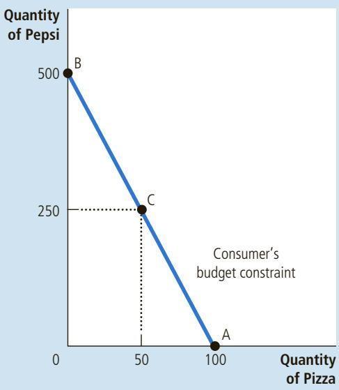

figure. At point A, the consumer buys no Pepsi and consumes 100 pizzas. At point B, the consumer buys no pizza and consumes 500 liters of Pepsi. At point C, the consumer buys 50 pizzas and 250 liters of Pepsi. Point C, which is exactly at the middle of the line from A to B, is the point at which the consumer spends an equal amount (\$500) on pizza and Pepsi. These are only three of the many combinations of pizza and Pepsi that the consumer can choose. All the points on the line from A to B are possible. This line, called the budget constraint, shows the consumption bundles that the consumer can afford. In this case, it shows the trade-off between pizza and Pepsi that the consumer faces.

The slope of the budget constraint measures the rate at which the consumer can trade one good for the other. Recall that the slope between two points is calculated as the change in the vertical distance divided by the change in the horizontal distance (“rise over run”). From point A to point B, the vertical distance is 500 liters, and the horizontal distance is 100 pizzas. Thus, the slope is 5 liters per pizza. (Actually, because the budget constraint slopes downward, the slope is a negative number. But for our purposes we can ignore the minus sign.)

budget constraint the limit on the consumption bundles that a consumer can afford

Notice that the slope of the budget constraint equals the relative price of the two goods—the price of one good compared to the price of the other. A pizza costs five times as much as a liter of Pepsi, so the opportunity cost of a pizza is 5 liters of Pepsi. The budget constraint’s slope of 5 reflects the trade-off the market is offering the consumer: 1 pizza for 5 liters of Pepsi.

Draw the budget constraint for a person with income of \$1,000 if the price of Pepsi is \$5 and the price of pizza is \$10. What is the slope of traint?

## 21-2 Preferences: What the Consumer Wants

Our goal in this chapter is to understand how consumers make choices. The budget constraint is one piece of the analysis: It shows the combinations of goods the consumer can afford given her income and the prices of the goods. The consumer’s choices, however, depend not only on her budget constraint but also on her preferences regarding the two goods. Therefore, the consumer’s preferences are the next piece of our analysis.

## 21-2a Representing Preferences with Indifference Curves

The consumer’s preferences allow her to choose among different bundles of pizza and Pepsi. If you offer the consumer two different bundles, she chooses the bundle that best suits her tastes. If the two bundles suit her tastes equally well, we say that the consumer is indifferent between the two bundles.

indifference curve a curve that shows consumption bundles that give the consumer the same level of satisfaction

Just as we have represented the consumer’s budget constraint graphically, we can also represent her preferences graphically. We do this with indifference curves. An indifference curve shows the various bundles of consumption that make the consumer equally happy. In this case, the indifference curves show the combinations of pizza and Pepsi with which the consumer is equally satisfied.

Figure 2 shows two of the consumer’s many indifference curves. The consumer is indifferent among combinations A, B, and C because they are all on the same curve. Not surprisingly, if the consumer’s consumption of pizza is reduced, say, from point A to point B, consumption of Pepsi must increase to keep her equally happy. If consumption of pizza is reduced again, from point B to point C, the amount of Pepsi consumed must increase yet again.

## marginal rate of substitution

the rate at which a consumer is willing to trade one good for another

The slope at any point on an indifference curve equals the rate at which the consumer is willing to substitute one good for the other. This rate is called the marginal rate of substitution (MRS). In this case, the marginal rate of substitution measures how much Pepsi the consumer requires to be compensated for a oneunit reduction in pizza consumption. Notice that because the indifference curves are not straight lines, the marginal rate of substitution is not the same at all points on a given indifference curve. The rate at which a consumer is willing to trade one good for the other depends on the amounts of the goods she is already consuming. In other words, the rate at which a consumer is willing to trade pizza

## FIGURE 2

## The Consumer’s Preferences

The consumer’s preferences are represented with indifference curves, which show the combinations of pizza and Pepsi that make the consumer equally satisfied. Because the consumer prefers more of a good, points on a higher indifference curve $( I _ { 2 } )$ are preferred to points on a lower indifference curve $( I _ { 1 } ) _ { \cdot }$ . The marginal rate of substitution (MRS) shows the rate at which the consumer is willing to trade Pepsi for pizza. It measures the quantity of Pepsi the consumer must be given in exchange for 1 pizza.

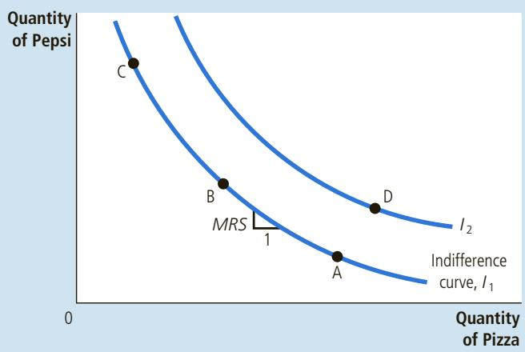

for Pepsi depends on whether she is hungrier or thirstier, which in turn depends on her current consumption of pizza and Pepsi.

The consumer is equally happy at all points on any given indifference curve, but she prefers some indifference curves to others. Because she prefers more consumption to less, higher indifference curves are preferred to lower ones. In Figure $^ { 2 , }$ any point on curve $I _ { 2 }$ is preferred to any point on curve $I _ { 1 }$

A consumer’s set of indifference curves gives a complete ranking of the consumer’s preferences. That is, we can use the indifference curves to rank any two bundles of goods. For example, the indifference curves tell us that point D is preferred to point A because point D is on a higher indifference curve than point A. (That conclusion may be obvious, however, because point D offers the consumer both more pizza and more Pepsi.) The indifference curves also tell us that point D is preferred to point C because point D is on a higher indifference curve. Even though point D has less Pepsi than point C, it has more than enough extra pizza to make the consumer prefer it. By seeing which point is on the higher indifference curve, we can use the set of indifference curves to rank any combination of pizza and Pepsi.

## 21-2b Four Properties of Indifference Curves

Because indifference curves represent a consumer’s preferences, they have certain properties that reflect those preferences. Here we consider four properties that describe most indifference curves:

• Property 1: Higher indifference curves are preferred to lower ones. People usually prefer to consume more rather than less. This preference for greater quantities is reflected in the indifference curves. As Figure 2 shows, higher indifference curves represent larger quantities of goods than lower indifference curves. Thus, the consumer prefers being on higher indifference curves.

• Property 2: Indifference curves are downward-sloping. The slope of an indifference curve reflects the rate at which the consumer is willing to substitute one good for the other. In most cases, the consumer likes both goods. Therefore, if the quantity of one good is reduced, the quantity of the other good must increase for the consumer to be equally happy. For this reason, most indifference curves slope downward.

• Property 3: Indifference curves do not cross. To see why this is true, suppose that two indifference curves did cross, as in Figure 3. Then, because point A

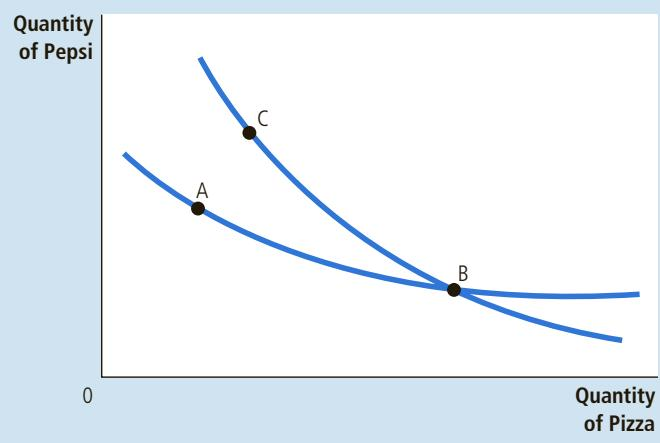

## FIGURE 3

## The Impossibility of Intersecting Indifference Curves

A situation like this can never happen. According to these indifference curves, the consumer would be equally satisfied at points A, B, and C, even though point C has more of both goods than point A.

is on the same indifference curve as point B, the two points would make the consumer equally happy. In addition, because point B is on the same indifference curve as point C, these two points would make the consumer equally happy. But these conclusions imply that points A and C would also make the consumer equally happy, even though point C has more of both goods. This contradicts our assumption that the consumer always prefers more of both goods to less. Thus, indifference curves cannot cross.

Property 4: Indifference curves are bowed inward. The slope of an indifference curve is the marginal rate of substitution—the rate at which the consumer is willing to trade off one good for the other. The marginal rate of substitution (MRS) usually depends on the amount of each good the consumer is currently consuming. In particular, because people are more willing to trade away goods that they have in abundance and less willing to trade away goods of which they have little, the indifference curves are bowed inward toward the graph’s origin. As an example, consider Figure 4. At point A, because the consumer has a lot of Pepsi and only a little pizza, she is very hungry but not very thirsty. To induce the consumer to give up 1 pizza, she has to be given 6 liters of Pepsi: The MRS is 6 liters per pizza. By contrast, at point B, the consumer has little Pepsi and a lot of pizza, so she is very thirsty but not very hungry. At this point, she would be willing to give up 1 pizza to get 1 liter of Pepsi: The MRS is 1 liter per pizza. Thus, the bowed shape of the indifference curve reflects the consumer’s greater willingness to give up a good that she already has a lot of.

## 21-2c Two Extreme Examples of Indifference Curves

The shape of an indifference curve reveals the consumer’s willingness to trade one good for the other. When the goods are easy to substitute for each other, the indifference curves are less bowed; when the goods are hard to substitute, the

## FIGURE 4

Bowed Indifference Curves Indifference curves are usually bowed inward. This shape implies that the marginal rate of substitution (MRS) depends on the quantity of the two goods the consumer is currently consuming. At point A, the consumer has little pizza and much Pepsi, so she requires a lot of extra Pepsi to induce her to give up one of the pizzas: The MRS is 6 liters of Pepsi per pizza. At point B, the consumer has much pizza and little Pepsi, so she requires only a little extra Pepsi to induce her to give up one of the pizzas: The MRS is 1 liter of Pepsi per pizza.

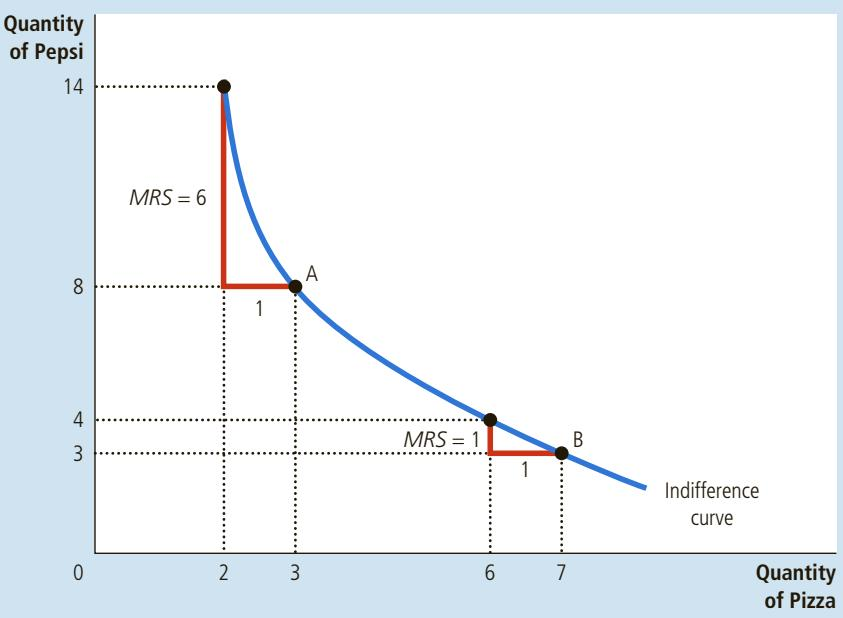

indifference curves are very bowed. To see why this is true, let’s consider the extreme cases.

Perfect Substitutes Suppose that someone offered you bundles of nickels and dimes. How would you rank the different bundles?

Most likely, you would care only about the total monetary value of each bundle. If so, you would always be willing to trade 2 nickels for 1 dime. Your marginal rate of substitution between nickels and dimes would be a fixed number: MRS = 2, regardless of the number of nickels and dimes in the bundle.

We can represent your preferences for nickels and dimes with the indifference curves in panel (a) of Figure 5. Because the marginal rate of substitution is constant, the indifference curves are straight lines. In this extreme case of straight indifference curves, we say that the two goods are perfect substitutes.

Perfect Complements Suppose now that someone offered you bundles of shoes. Some of the shoes fit your left foot, others your right foot. How would you rank these different bundles?

In this case, you might care only about the number of pairs of shoes. In other words, you would judge a bundle based on the number of pairs you could assemble from it. A bundle of 5 left shoes and 7 right shoes yields only 5 pairs. Getting 1 more right shoe has no value if there is no left shoe to go with it.

We can represent your preferences for right and left shoes with the indifference curves in panel (b) of Figure 5. In this case, a bundle with 5 left shoes and 5 right shoes is just as good as a bundle with 5 left shoes and 7 right shoes. It is also just as good as a bundle with 7 left shoes and 5 right shoes. The indifference curves, therefore, are right angles. In this extreme case of right-angle indifference curves, we say that the two goods are perfect complements.

When two goods are easily substitutable, such as nickels and dimes, the indifference curves are straight lines, as shown in panel (a). When two goods are strongly complementary, such as left shoes and right shoes, the indifference curves are right angles, as shown in panel (b).

## FIGURE 5

(a) Perfect Substitutes  
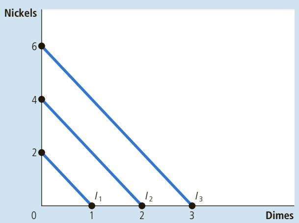

Perfect Substitutes and Perfect Complements

(b) Perfect Complements  
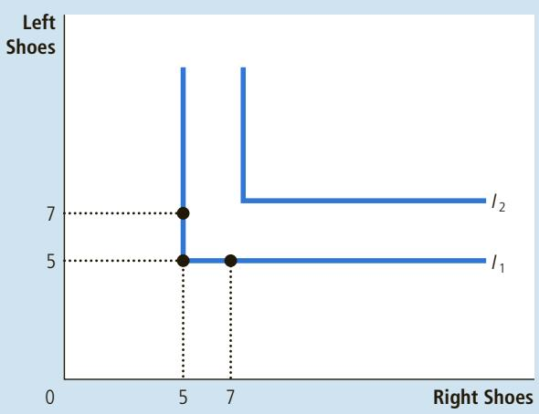

In the real world, of course, most goods are neither perfect substitutes (like nickels and dimes) nor perfect complements (like right shoes and left shoes). More typically, the indifference curves are bowed inward, but not so bowed that they become right angles.

Draw some indifference curves for pizza and Pepsi. Explain the four properties of these indifference curves.

## 21-3 Optimization: What the Consumer Chooses

The goal of this chapter is to understand how a consumer makes choices. We have the two pieces necessary for this analysis: the consumer’s budget constraint (how much she can afford to spend) and the consumer’s preferences (what she wants to spend it on). Now we put these two pieces together and consider the consumer’s decision about what to buy.

## 21-3a The Consumer’s Optimal Choices

Once again, consider our pizza and Pepsi example. The consumer would like to end up with the best possible combination of pizza and Pepsi for her—that is, the combination on her highest possible indifference curve. But the consumer must also end up on or below her budget constraint, which measures the total resources available to her.

Figure 6 shows the consumer’s budget constraint and three of her many indifference curves. The highest indifference curve that the consumer can reach $( I _ { 2 }$ in the figure) is the one that just barely touches her budget constraint. The point at which this indifference curve and the budget constraint touch is called the optimum. The consumer would prefer point A, but she cannot afford that point because it lies above her budget constraint. The consumer can afford point B, but that point is on a lower indifference curve and, therefore, provides the consumer less satisfaction. The optimum represents the best combination of pizza and Pepsi available to the consumer.

## FIGURE 6

## The Consumer’s Optimum

The consumer chooses the point on her budget constraint that lies on the highest indifference curve. At this point, called the optimum, the marginal rate of substitution equals the relative price of the two goods. Here the highest indifference curve the consumer can reach is $I _ { 2 } .$ The consumer prefers point $\mathsf { A } ,$ which lies on indifference curve $I _ { 3 } ,$ but she cannot afford this bundle of pizza and Pepsi. By contrast, point B is affordable, but because it lies on a lower indifference curve, the consumer does not prefer it.

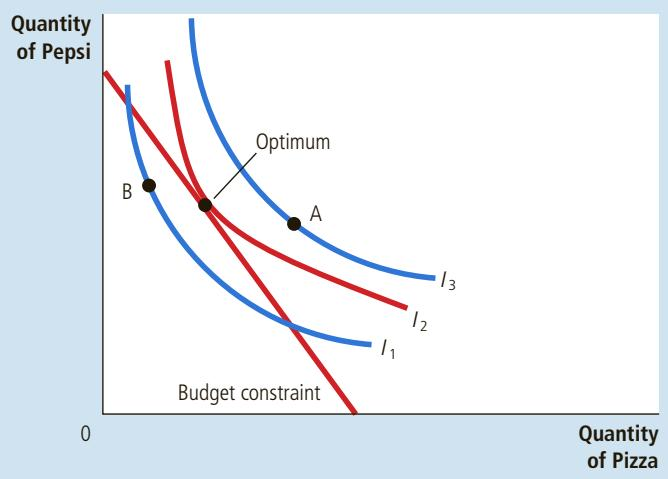

Notice that, at the optimum, the slope of the indifference curve equals the slope of the budget constraint. We say that the indifference curve is tangent to the budget constraint. The slope of the indifference curve is the marginal rate of substitution between pizza and Pepsi, and the slope of the budget constraint is the relative price of pizza and Pepsi. Thus, the consumer chooses consumption of the two goods so that the marginal rate of substitution equals the relative price.

In Chapter 7, we saw how market prices reflect the marginal value that consumers place on goods. This analysis of consumer choice shows the same result in another way. In making her consumption choices, the consumer takes the relative price of the two goods as given and then chooses an optimum at which her marginal rate of substitution equals this relative price. The relative price is the rate at which the market is willing to trade one good for the other, whereas the marginal rate of substitution is the rate at which the consumer is willing to trade one good for the other. At the consumer’s optimum, the consumer’s valuation of the

FYI

## Utility: An Alternative Way to Describe Preferences and Optimization

erences. Another common way to represent preferences is with the concept of utility. Utility is an abstract measure of the satisfaction or happiness that a consumer receives from a bundle of goods. Economists say that a consumer prefers one bundle of goods to another if one provides more utility than the other.

$$
M R S = P _ {\mathrm{X}} / P _ {\mathrm{Y}}.
$$

Indifference curves and utility are closely related. Because the consumer prefers points on higher indifference curves, bundles of goods on higher indifference curves provide higher utility. Because the consumer is equally happy with all points on the same indifference curve, all these bundles provide the same utility. You can think of an indifference curve as an “equal-utility” curve.

The marginal utility of any good is the increase in utility that the consumer gets from an additional unit of that good. Most goods are assumed to exhibit diminishing marginal utility: The more of the good the consumer already has, the lower the marginal utility provided by an extra unit of that good.

The marginal rate of substitution between two goods depends on their marginal utilities. For example, if the marginal utility of good X is twice the marginal utility of good Y, then a person would need 2 units of good Y to compensate for losing 1 unit of good X, and the MRS equals 2. More generally, the marginal rate of substitution (and thus the slope of the indifference curve) equals the marginal utility of one good divided by the marginal utility of the other good.

Utility analysis provides another way to describe consumer optimization. Recall that, at the consumer’s optimum, the marginal rate of substitution equals the ratio of prices. That is,

Because the marginal rate of substitution equals the ratio of marginal utilities, we can write this condition for optimization as

$$
M U _ {\mathrm{X}} / M U _ {\mathrm{Y}} = P _ {\mathrm{X}} / P _ {\mathrm{Y}}.
$$

Now rearrange this expression to become

$$
M U _ {X} / P _ {X} = M U _ {Y} / P _ {Y}.
$$

This equation has a simple interpretation: At the optimum, the marginal utility per dollar spent on good X equals the marginal utility per dollar spent on good Y. If this equality did not hold, the consumer could increase utility by spending less on the good that provided lower marginal utility per dollar and more on the good that provided higher marginal utility per dollar.

When economists discuss the theory of consumer choice, they sometimes express the theory using different words. One economist might say that the goal of the consumer is to maximize utility. Another economist might say that the goal of the consumer is to end up on the highest possible indifference curve. The first economist would conclude that at the consumer’s optimum, the marginal utility per dollar is the same for all goods, whereas the second would conclude that the indifference curve is tangent to the budget constraint. In essence, these are two ways of saying the same thing. ■

two goods (as measured by the marginal rate of substitution) equals the market’s valuation (as measured by the relative price). As a result of this consumer optimization, market prices of different goods reflect the value that consumers place on those goods.

## 21-3b How Changes in Income Affect the Consumer’s Choices

Now that we have seen how the consumer makes a consumption decision, let’s examine how this decision responds to changes in the consumer’s income. To be specific, suppose that income increases. With higher income, the consumer can afford more of both goods. The increase in income, therefore, shifts the budget constraint outward, as in Figure 7. Because the relative price of the two goods has not changed, the slope of the new budget constraint is the same as the slope of the initial budget constraint. That is, an increase in income leads to a parallel shift in the budget constraint.

The expanded budget constraint allows the consumer to choose a better combination of pizza and Pepsi, one that is on a higher indifference curve. Given the shift in the budget constraint and the consumer’s preferences as represented by her indifference curves, the consumer’s optimum moves from the point labeled “initial optimum” to the point labeled “new optimum.”

normal good a good for which an increase in income raises the quantity demanded

Notice that, in Figure 7, the consumer chooses to consume more Pepsi and more pizza. The logic of the model does not require increased consumption of both goods in response to increased income, but this situation is the most common. As you may recall from Chapter 4, if a consumer wants more of a good when her income rises, economists call it a normal good. The indifference curves in Figure 7 are drawn under the assumption that both pizza and Pepsi are normal goods.

## FIGURE 7

## An Increase in Income

When the consumer’s income rises, the budget constraint shifts outward. If both goods are normal goods, the consumer responds to the increase in income by buying more of both of them. Here the consumer buys more pizza and more Pepsi.

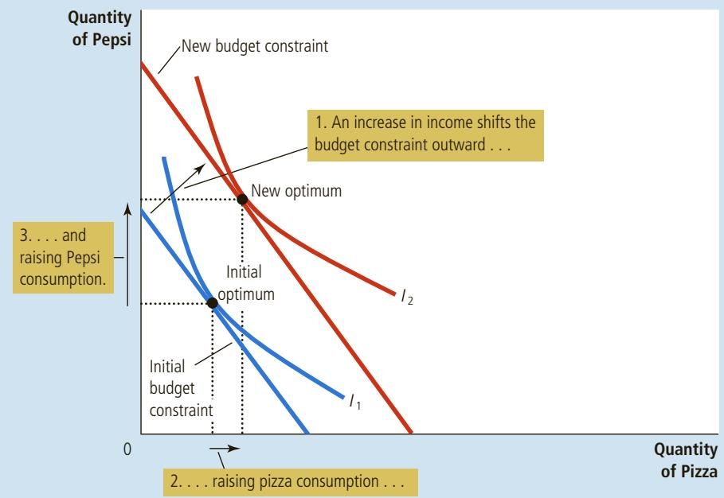

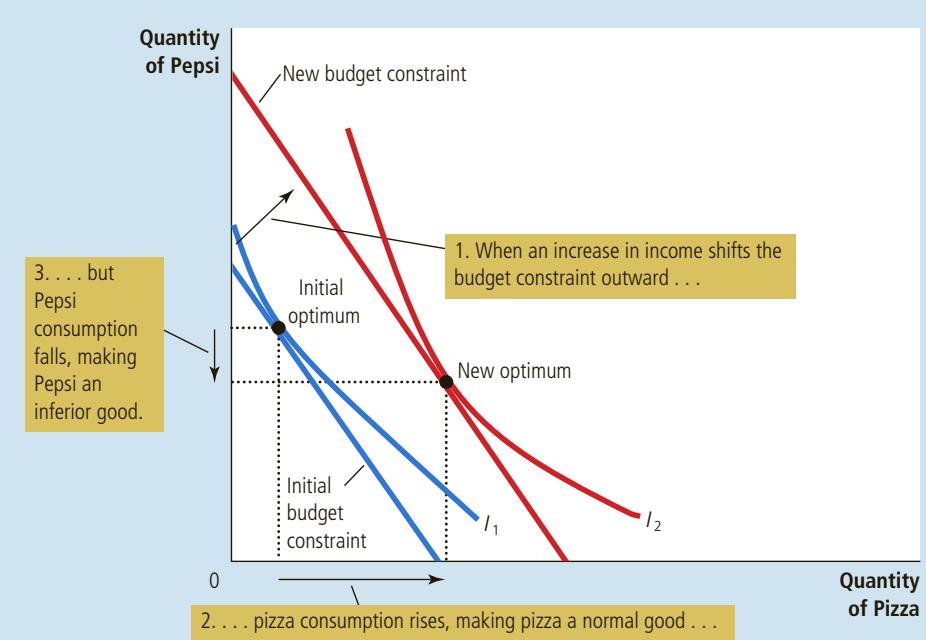

## FIGURE 8

## An Inferior Good

A good is inferior if the consumer buys less of it when her income rises. Here Pepsi is an inferior good: When the consumer’s income increases and the budget constraint shifts outward, the consumer buys more pizza but less Pepsi.

Figure 8 shows an example in which an increase in income induces the consumer to buy more pizza but less Pepsi. If a consumer buys less of a good when her income rises, economists call it an inferior good. Figure 8 is drawn under the assumption that pizza is a normal good and Pepsi is an inferior good.

Although most goods in the world are normal goods, there are some inferior goods as well. An example is bus rides. As income increases, consumers are more likely to own cars or take taxis and less likely to ride the bus. Bus rides, therefore, are an inferior good.

inferior good a good for which an increase in income reduces the quantity demanded

## 21-3c How Changes in Prices Affect the Consumer’s Choices

Let’s now use this model of consumer choice to consider how a change in the price of one of the goods alters the consumer’s choices. Suppose, in particular, that the price of Pepsi falls from \$2 to \$1 per liter. It is no surprise that the lower price expands the consumer’s set of buying opportunities. In other words, a fall in the price of any good shifts the budget constraint outward.

Figure 9 considers more specifically how the fall in price affects the budget constraint. If the consumer spends her entire \$1,000 income on pizza, then the price of Pepsi is irrelevant. Thus, point A in the figure stays the same. Yet if the consumer spends her entire income of \$1,000 on Pepsi, she can now buy 1,000 liters rather than only 500. Thus, the endpoint of the budget constraint moves from point B to point D.

Notice that in this case the outward shift in the budget constraint changes its slope. (This differs from what happened previously when prices stayed the same but the consumer’s income changed.) As we have discussed, the slope of the budget constraint reflects the relative price of pizza and Pepsi. Because the price of Pepsi has fallen to \$1 from \$2, while the price of pizza has remained \$10, the consumer can now trade a pizza for 10 rather than 5 liters of Pepsi. As a result, the new budget constraint has a steeper slope.

## FIGURE 9

## A Change in Price

When the price of Pepsi falls, the consumer’s budget constraint shifts outward and changes slope. The consumer moves from the initial optimum to the new optimum, which changes her purchases of both pizza and Pepsi. In this case, the quantity of Pepsi consumed rises, and the quantity of pizza consumed falls.

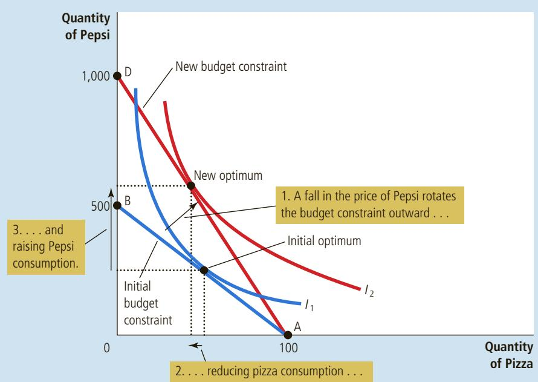

How such a change in the budget constraint alters the consumption of both goods depends on the consumer’s preferences. For the indifference curves drawn in this figure, the consumer buys more Pepsi and less pizza.

income effect the change in consumption that results when a price change moves the consumer to a higher or lower indifference curve

substitution effect the change in consumption that results when a price change moves the consumer along a given indifference curve to a point with a new marginal rate of substitution

## 21-3d Income and Substitution Effects

The impact of a change in the price of a good on consumption can be decomposed into two effects: an income effect and a substitution effect. To see what these two effects are, consider how our consumer might respond when she learns that the price of Pepsi has fallen. She might reason in the following ways:

• “Great news! Now that Pepsi is cheaper, my income has greater purchasing power. I am, in effect, richer than I was. Because I am richer, I can buy both more pizza and more Pepsi.” (This is the income effect.)

• “Now that the price of Pepsi has fallen, I get more liters of Pepsi for every pizza that I give up. Because pizza is now relatively more expensive, I should buy less pizza and more Pepsi.” (This is the substitution effect.)

## Which statement do you find more compelling?

In fact, both of these statements make sense. The decrease in the price of Pepsi makes the consumer better off. If pizza and Pepsi are both normal goods, the consumer will want to spread this improvement in her purchasing power over both goods. This income effect tends to make the consumer buy more pizza and more Pepsi. Yet at the same time, consumption of Pepsi has become less expensive relative to consumption of pizza. This substitution effect tends to make the consumer choose less pizza and more Pepsi.

Now consider the result of these two effects working at the same time. The consumer certainly buys more Pepsi because the income and substitution effects both act to increase purchases of Pepsi. But for pizza, the income and substitution effects work in opposite directions. As a result, whether the consumer buys more or less pizza is not clear. The outcome could go either way, depending on the sizes of the income and substitution effects. Table 1 summarizes these conclusions.

<table><tr><td>Good</td><td>Income Effect</td><td>Substitution Effect</td><td>Total Effect</td></tr><tr><td>Pepsi</td><td>Consumer is richer, so she buys more Pepsi.</td><td>Pepsi is relatively cheaper, so consumer buys more Pepsi.</td><td>Income and substitution effects act in the same direction, so consumer buys more Pepsi.</td></tr><tr><td>Pizza</td><td>Consumer is richer, so she buys more pizza.</td><td>Pizza is relatively more expensive, so consumer buys less pizza.</td><td>Income and substitution effects act in opposite directions, so the total effect on pizza consumption is ambiguous.</td></tr></table>

We can interpret the income and substitution effects using indifference curves. The income effect is the change in consumption that results from the movement to a new indifference curve. The substitution effect is the change in consumption that results from moving to a new point on the same indifference curve with a different marginal rate of substitution.

Figure 10 shows graphically how to decompose the change in the consumer’s decision into the income effect and the substitution effect. When the price of Pepsi falls, the consumer moves from the initial optimum, point A, to the new optimum, point C. We can view this change as occurring in two steps. First, the consumer moves along the initial indifference curve, $I _ { 1 } ,$ from point A to point B. The consumer

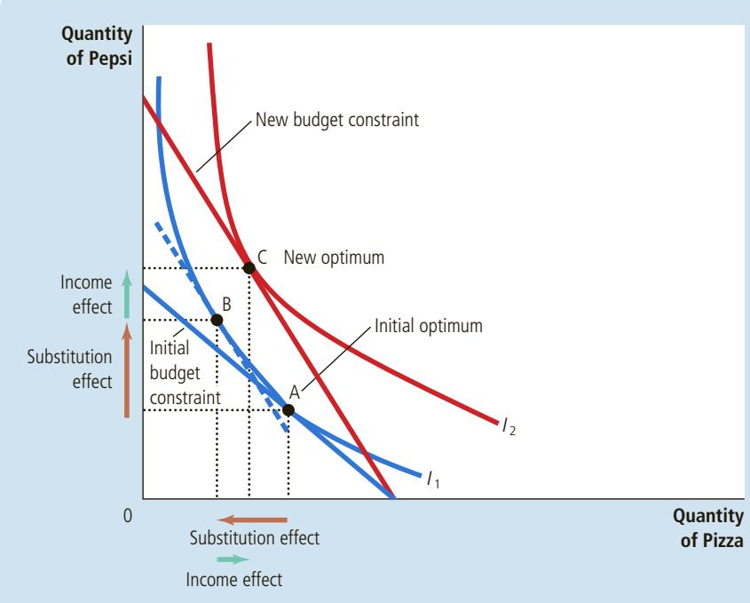

## FIGURE 10

## Income and Substitution Effects

The effect of a change in price can be broken down into an income effect and a substitution effect. The substitution effect—the movement along an indifference curve to a point with a different marginal rate of substitution—is shown here as the change from point A to point B along indifference curve $I _ { 1 } .$ . The income effect—the shift to a higher indifference curve—is shown here as the change from point B on indifference curve $I _ { 1 }$ to point C on indifference curve $I _ { 2 } .$

is equally happy at these two points, but at point B, the marginal rate of substitution reflects the new relative price. (The dashed line through point B is parallel to the new budget constraint and thus reflects the new relative price.) Next, the consumer shifts to the higher indifference curve, $I _ { 2 ^ { \prime } }$ by moving from point B to point C. Even though point B and point C are on different indifference curves, they have the same marginal rate of substitution. That is, the slope of the indifference curve $I _ { 1 }$ at point B equals the slope of the indifference curve $I _ { 2 }$ at point C.

The consumer never actually chooses point B, but this hypothetical point is useful to clarify the two effects that determine the consumer’s decision. Notice that the change from point A to point B represents a pure change in the marginal rate of substitution without any change in the consumer’s welfare. Similarly, the change from point B to point C represents a pure change in welfare without any change in the marginal rate of substitution. Thus, the movement from A to B shows the substitution effect, and the movement from B to C shows the income effect.

## 21-3e Deriving the Demand Curve

We have just seen how changes in the price of a good alter the consumer’s budget constraint and, therefore, the quantities of the two goods that she chooses to buy. The demand curve for any good reflects these consumption decisions. Recall that a demand curve shows the quantity demanded of a good for any given price. We can view a consumer’s demand curve as a summary of the optimal decisions that arise from her budget constraint and indifference curves.

For example, Figure 11 considers the demand for Pepsi. Panel (a) shows that when the price of a liter falls from \$2 to \$1, the consumer’s budget constraint shifts outward. Because of both income and substitution effects, the consumer increases her purchases of Pepsi from 250 to 750 liters. Panel (b) shows the demand curve

## FIGURE 11

Deriving the Demand Curve

Panel (a) shows that when the price of Pepsi falls from \$2 to \$1, the consumer’s optimum moves from point A to point B, and the quantity of Pepsi consumed rises from 250 to 750 liters. The demand curve in panel (b) reflects this relationship between the price and the quantity demanded.

(a) The Consumer’s Optimum  
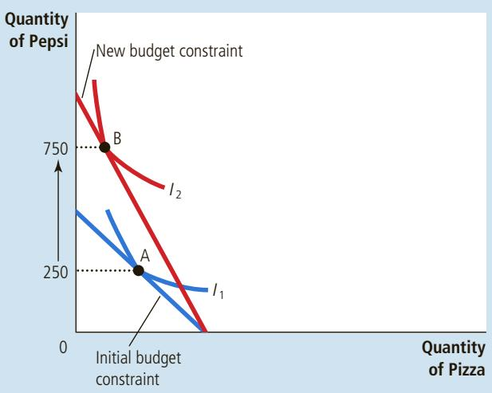

(b) The Demand Curve for Pepsi  
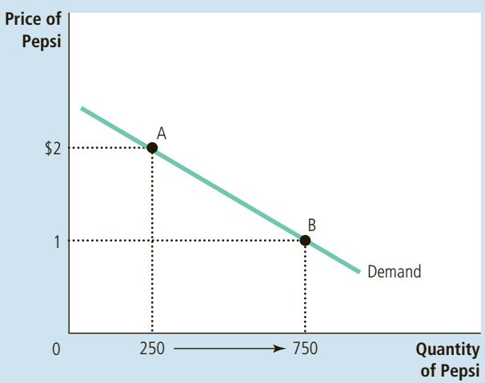

that results from this consumer’s decisions. In this way, the theory of consumer choice provides the theoretical foundation for the consumer’s demand curve.

It may be comforting to know that the demand curve arises naturally from the theory of consumer choice, but this exercise by itself does not justify developing the theory. There is no need for a rigorous, analytic framework just to establish that people respond to changes in prices. The theory of consumer choice is, however, useful in studying various decisions that people make as they go about their lives, as we see in the next section.

Draw a budget constraint and indifference curves for pizza and Pepsi. QuickQuiz Show what happens to the budget constraint and the consumer’s optimum when the price of pizza rises. In your diagram, decompose the change into an income effect and a substitution effect.

## 21-4 Three Applications

Now that we have developed the basic theory of consumer choice, let’s use it to shed light on three questions about how the economy works. These three questions might at first seem unrelated. But because each question involves household decision making, we can address it with the model of consumer behavior we have just developed.

## 21-4a Do All Demand Curves Slope Downward?

Normally, when the price of a good rises, people buy less of it. This typical behavior, called the law of demand, is reflected in the downward slope of the demand curve.

As a matter of economic theory, however, demand curves can sometimes slope upward. In other words, consumers can sometimes violate the law of demand and buy more of a good when the price rises. To see how this can happen, consider Figure 12. In this example, the consumer buys two goods—meat and potatoes.

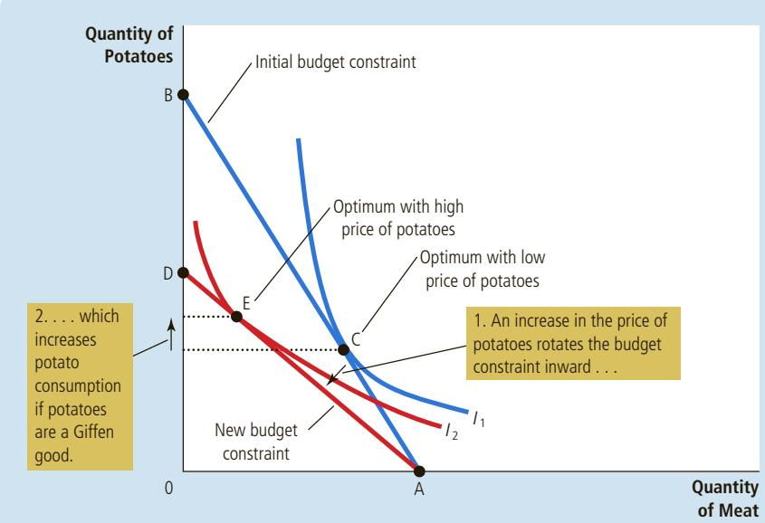

## FIGURE 12

## A Giffen Good

In this example, when the price of potatoes rises, the consumer’s optimum shifts from point C to point E. In this case, the consumer responds to a higher price of potatoes by buying less meat and more potatoes.

Initially, the consumer’s budget constraint is the line from point A to point B. The optimum is point C. When the price of potatoes rises, the budget constraint shifts inward and is now the line from point A to point D. The optimum is now point E. Notice that a rise in the price of potatoes has led the consumer to buy a larger quantity of potatoes.

Why is the consumer responding in this strange way? In this example, potatoes are a strongly inferior good; that is, potatoes are a good that a person buys a lot less of when her income rises and a lot more of when her income falls. In Figure 12, the increase in the price of potatoes makes the consumer poorer; that is, the higher price puts her on a lower indifference curve. Because she is poorer and potatoes are an inferior good, the income effect makes her want to buy less meat and more potatoes. At the same time, because the potatoes have become more expensive relative to meat, the substitution effect makes the consumer want to buy more meat and fewer potatoes. If the income effect is much larger than the substitution effect, as it is in this example, the consumer responds to the higher price of potatoes by buying less meat and more potatoes.

Economists use the term Giffen good to describe a good that violates the law of demand. (The term is named for economist Robert Giffen, who first noted this possibility.) In this example, potatoes are a Giffen good. Giffen goods are inferior goods for which the income effect dominates the substitution effect. Therefore, they have demand curves that slope upward.

## THE SEARCH FOR GIFFEN GOODS

Have any actual Giffen goods ever been observed? Some historians suggest that potatoes were a Giffen good during the Irish potato famine of the 19th century. Potatoes were such a large part of people’s

diet that when the price of potatoes rose, the change had a large income effect. People responded to their reduced living standard by cutting back on the luxury of meat and buying more of the staple food of potatoes. Thus, it is argued that a higher price of potatoes actually raised the quantity of potatoes demanded.

A study by Robert Jensen and Nolan Miller, published in the American Economic Review in 2008, produced similar but more concrete evidence for the existence of Giffen goods. These two economists conducted a field experiment for five months in the Chinese province of Hunan. They gave randomly selected households vouchers that subsidized the purchase of rice, a staple in local diets, and used surveys to measure how consumption of rice responded to changes in the price. They found strong evidence that poor households exhibited Giffen behavior. Lowering the price of rice with the subsidy voucher caused households to reduce their consumption of rice, and removing the subsidy had the opposite effect. Jensen and Miller wrote, “To the best of our knowledge, this is the first rigorous empirical evidence of Giffen behavior.”

Thus, the theory of consumer choice allows demand curves to slope upward, and sometimes that strange phenomenon actually occurs. As a result, the law of demand we first saw in Chapter 4 is not completely reliable. It is safe to say, however, that Giffen goods are very rare. ●
