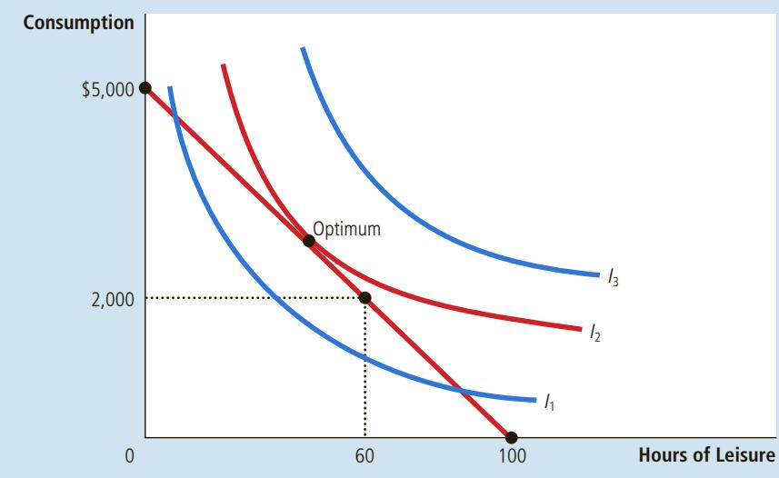
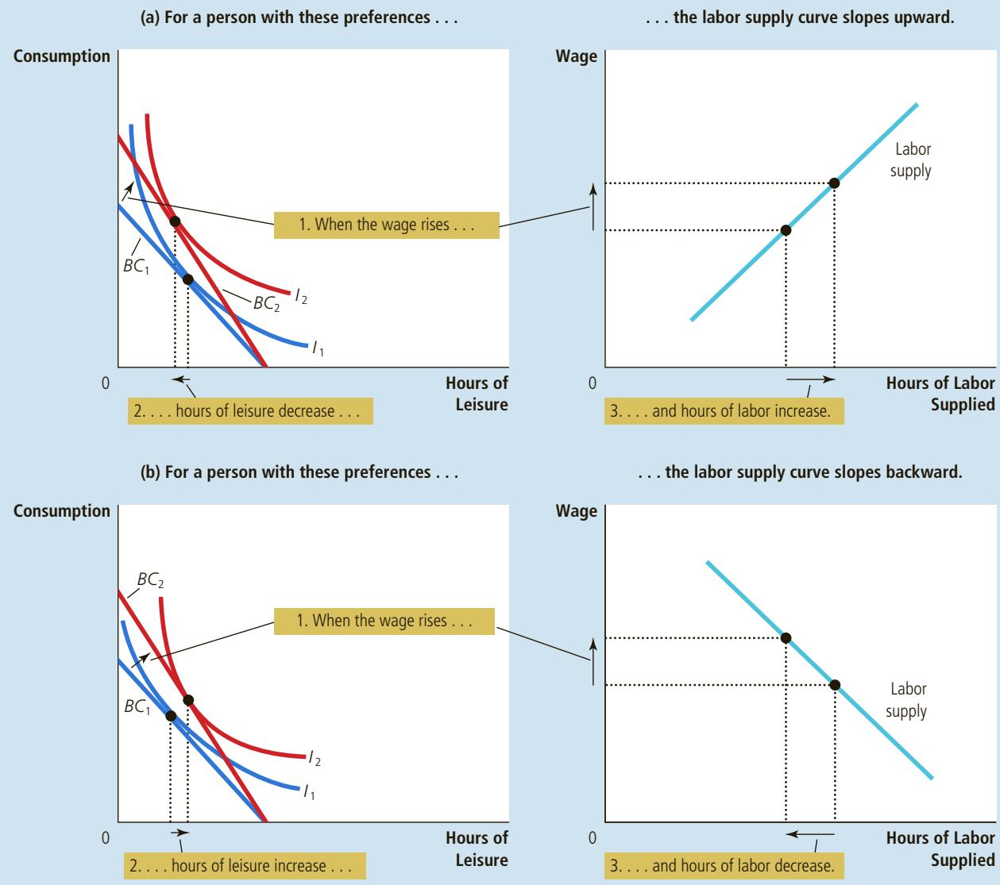
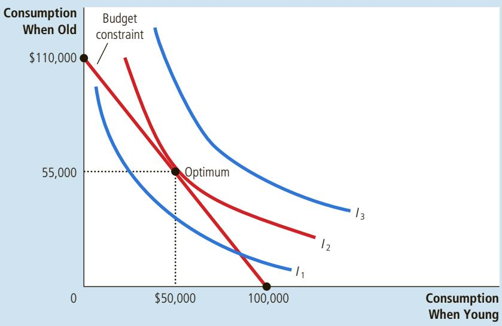
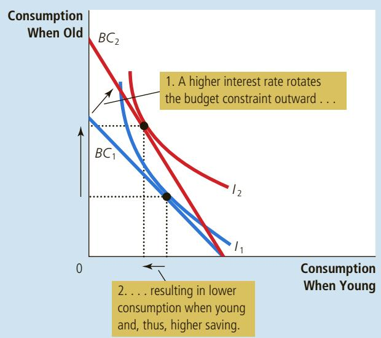
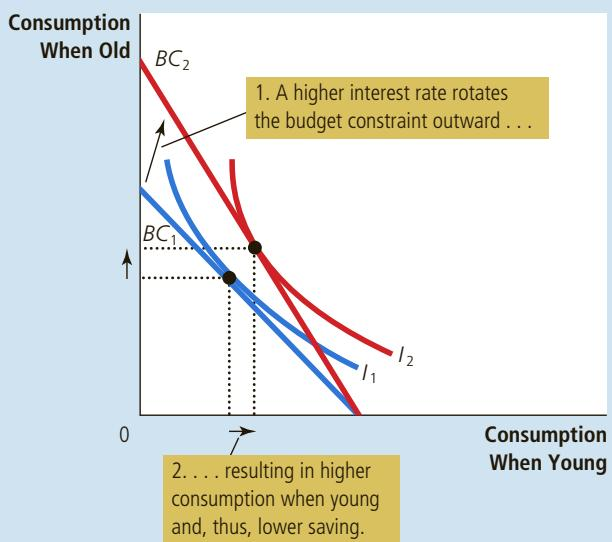

## 21-4b How Do Wages Affect Labor Supply?

So far, we have used the theory of consumer choice to analyze how a person allocates income between two goods. We can apply the same theory to analyze how a person allocates time. People spend some of their time enjoying leisure and some of it working so they can afford to buy consumption goods. The essence of the time-allocation problem is the trade-off between leisure and consumption.

Consider the decision facing Kayla, a freelance software designer. Kayla is awake for 100 hours per week. She spends some of this time enjoying leisure— playing Minecraft, watching The Bachelor on television, and reading this textbook. She spends the rest of this time at her computer developing software. For every hour she works developing software, she earns \$50, which she spends on consumption goods—food, clothing, and music downloads. Her hourly wage of \$50 reflects the trade-off Kayla faces between leisure and consumption. For every hour of leisure she gives up, she works one more hour and gets \$50 of consumption.

Figure 13 shows Kayla’s budget constraint. If she spends all 100 hours enjoying leisure, she has no consumption. If she spends all 100 hours working, she earns a weekly consumption of \$5,000 but has no time for leisure. If she works a 40-hour week, she enjoys 60 hours of leisure and has weekly consumption of \$2,000.

Figure 13 uses indifference curves to represent Kayla’s preferences for consumption and leisure. Here consumption and leisure are the two “goods” between which Kayla is choosing. Because Kayla always prefers more leisure and more consumption, she prefers points on higher indifference curves to points on lower ones. At a wage of \$50 per hour, Kayla chooses a combination of consumption and leisure represented by the point labeled “optimum.” This is the point on the budget constraint that is on the highest possible indifference curve, $I _ { 2 } .$

Now consider what happens when Kayla’s wage increases from \$50 to \$60 per hour. Figure 14 illustrates two possible outcomes. In each case, the budget constraint, shown in the left graphs, shifts outward from $B C _ { 1 }$ to $B C _ { 2 } .$ . In the process, the budget constraint becomes steeper, reflecting the change in relative price: At the higher wage, Kayla earns more consumption for every hour of leisure that she gives up.

Kayla’s preferences, as represented by her indifference curves, determine how her choice regarding consumption and leisure responds to the higher wage. In both panels, consumption rises. Yet the response of leisure to the change in the

## FIGURE 13

## The Work-Leisure Decision

This figure shows Kayla’s budget constraint for deciding how much to work, her indifference curves for consumption and leisure, and her optimum.

## FIGURE 14

The two panels of this figure show how a person might respond to an increase in the wage. The graphs on the left show the consumer’s initial budget constraint, $B C _ { 1 } ,$ and new budget constraint, $B C _ { 2 } ,$ as well as the consumer’s optimal choices over consumption and leisure. The graphs on the right show the resulting labor-supply curve. Because hours worked equal total hours available minus hours of leisure, any change in leisure implies an opposite change in the quantity of labor supplied. In panel (a), when the wage rises, consumption rises and leisure falls, resulting in a labor-supply curve that slopes upward. In panel (b), when the wage rises, both consumption and leisure rise, resulting in a labor-supply curve that slopes backward.

wage is different in the two cases. In panel (a), Kayla responds to the higher wage by enjoying less leisure. In panel (b), Kayla responds by enjoying more leisure.

Kayla’s decision between leisure and consumption determines her supply of labor because the more leisure she enjoys, the less time she has left to work. In each panel of Figure 14, the right graph shows the labor-supply curve implied by Kayla’s decision. In panel (a), a higher wage induces Kayla to enjoy less leisure and work more, so the labor-supply curve slopes upward. In panel (b), a higher wage induces Kayla to enjoy more leisure and work less, so the labor-supply curve slopes “backward.”

At first, the backward-sloping labor-supply curve is puzzling. Why would a person respond to a higher wage by working less? The answer comes from considering the income and substitution effects of a higher wage.

Consider first the substitution effect. When Kayla’s wage rises, leisure becomes more expensive relative to consumption, and this encourages Kayla to substitute away from leisure and toward consumption. In other words, the substitution effect induces Kayla to work more in response to higher wages, which tends to make the labor-supply curve slope upward.

Now consider the income effect. When Kayla’s wage rises, she moves to a higher indifference curve. She is now better off than she was. As long as consumption and leisure are both normal goods, she tends to want to use this increase in well-being to enjoy both higher consumption and greater leisure. In other words, the income effect induces her to work less, which tends to make the labor-supply curve slope backward.

In the end, economic theory does not give a clear prediction about whether an increase in the wage induces Kayla to work more or less. If the substitution effect is greater than the income effect, she works more. If the income effect is greater than the substitution effect, she works less. The labor-supply curve, therefore, could be either upward- or backward-sloping.

## INCOME EFFECTS ON LABOR SUPPLY: HISTORICAL TRENDS, LOTTERY WINNERS, AND THE CARNEGIE CONJECTURE

The idea of a backward-sloping labor-supply curve might at first seem like a mere theoretical curiosity, but in fact it is not. Evidence indicates that the labor-supply curve, considered over long periods, does indeed slope backward. A hundred years ago, many people worked six days a week. Today, five-day workweeks are the norm. At the same time that the length of the workweek has been falling, the wage of the typical worker (adjusted for inflation) has been rising.

Here is how economists explain this historical pattern: Over time, advances in technology raise workers’ productivity and, thereby, the demand for labor. This increase in labor demand raises equilibrium wages. As wages rise, so does the reward for working. Yet rather than responding to this increased incentive by working more, most workers choose to take part of their greater prosperity in the form of more leisure. In other words, the income effect of higher wages dominates the substitution effect.

Further evidence that the income effect on labor supply is strong comes from a very different kind of data: winners of lotteries. Winners of large prizes in the lottery see large increases in their incomes and, as a result, large outward shifts in their budget constraints. Because the winners’ wages have not changed, however, the slopes of their budget constraints remain the same. There is, therefore, no substitution effect. By examining the behavior of lottery winners, we can isolate the income effect on labor supply.

The results from studies of lottery winners are striking. Of those winners who win more than \$50,000, almost 25 percent quit working within a year and another 9 percent reduce the number of hours they work. Of those winners who win more than \$1 million, almost 40 percent stop working. The income effect on labor supply of winning such a large prize is substantial.

GETTY IMAGES NEWS/GETTY IMAGES

  
“No more 9 to 5 for me.”

Similar results were found in a 1993 study, published in the Quarterly Journal of Economics, of how receiving a bequest affects a person’s labor supply. The study found that a single person who inherits more than \$150,000 is four times as likely to stop working as a single person who inherits less than \$25,000. This finding would not have surprised the 19th-century industrialist Andrew Carnegie. Carnegie warned that “the parent who leaves his son enormous wealth generally deadens the talents and energies of the son, and tempts him to lead a less useful and less worthy life than he otherwise would.” That is, Carnegie viewed the income effect on labor supply to be substantial and, from his paternalistic perspective, regrettable. During his life and at his death, Carnegie gave much of his vast fortune to charity. ●

## 21-4c How Do Interest Rates Affect Household Saving?

An important decision that every person faces is how much income to consume today and how much to save for the future. We can use the theory of consumer choice to analyze how people make this decision and how the amount they save depends on the interest rate their savings will earn.

Consider the decision facing Saul, a worker planning for retirement. To keep things simple, let’s divide Saul’s life into two periods. In the first period, Saul is young and working. In the second period, he is old and retired. When young, Saul earns \$100,000. He divides this income between current consumption and saving. When he is old, Saul will consume what he has saved, including the interest that his savings have earned.

Suppose the interest rate is 10 percent. Then for every dollar that Saul saves when young, he can consume \$1.10 when old. We can view “consumption when young” and “consumption when old” as the two goods that Saul must choose between. The interest rate determines the relative price of these two goods.

Figure 15 shows Saul’s budget constraint. If he saves nothing, he consumes \$100,000 when young and nothing when old. If he saves everything, he consumes nothing when young and \$110,000 when old. The budget constraint shows these and all the intermediate possibilities.

## FIGURE 15

## The Consumption-Saving Decision

This figure shows the budget constraint for a person deciding how much to consume in the two periods of his life, the indifference curves representing his preferences, and the optimum.

Figure 15 uses indifference curves to represent Saul’s preferences for consumption in the two periods. Because Saul prefers more consumption in both periods, he prefers points on higher indifference curves to points on lower ones. Given his preferences, Saul chooses the optimal combination of consumption in both periods of life, which is the point on the budget constraint that is on the highest possible indifference curve. At this optimum, Saul consumes \$50,000 when young and \$55,000 when old.

Now consider what happens when the interest rate increases from 10 to 20 percent. Figure 16 shows two possible outcomes. In both cases, the budget constraint shifts outward and becomes steeper. At the new, higher interest rate, Saul gets more consumption when old for every dollar of consumption that he gives up when young.

The two panels show the results given different preferences by Saul. In both cases, consumption when old rises. Yet the response of consumption when young to the change in the interest rate is different in the two cases. In panel (a), Saul responds to the higher interest rate by consuming less when young. In panel (b), Saul responds by consuming more when young.

Saul’s saving is his income when young minus the amount he consumes when young. In panel (a), an increase in the interest rate reduces consumption when young, so saving must rise. In panel (b), an increase in the interest rate induces Saul to consume more when young, so saving must fall.

The case shown in panel (b) might at first seem odd: Saul responds to an increase in the return to saving by saving less. But this behavior is not as peculiar as it might seem. We can understand it by considering the income and substitution effects of a higher interest rate.

In both panels, an increase in the interest rate shifts the budget constraint outward. In panel (a), consumption when young falls, and consumption when old rises. The result is an increase in saving when young. In panel (b), consumption in both periods rises. The result is a decrease in saving when young.

(a) Higher Interest Rate Raises Saving  
  
An Increase in the Interest Rate

## FIGURE 16

(b) Higher Interest Rate Lowers Saving  

Consider first the substitution effect. When the interest rate rises, consumption when old becomes less costly relative to consumption when young. Therefore, the substitution effect induces Saul to consume more when old and less when young. In other words, the substitution effect induces Saul to save more.

Now consider the income effect. When the interest rate rises, Saul moves to a higher indifference curve. He is now better off than he was. As long as consumption in both periods consists of normal goods, he tends to want to use this increase in well-being to enjoy higher consumption in both periods. In other words, the income effect induces him to save less.

The result depends on both the income and substitution effects. If the substitution effect of a higher interest rate is greater than the income effect, Saul saves more. If the income effect is greater than the substitution effect, Saul saves less. Thus, the theory of consumer choice says that an increase in the interest rate could either encourage or discourage saving.

This ambiguous result is interesting from the standpoint of economic theory, but it is disappointing from the standpoint of economic policy. It turns out that an important issue in tax policy hinges in part on how saving responds to interest rates. Some economists have advocated reducing the taxation of interest and other capital income, arguing that such a policy change would raise the after-tax interest rate that savers can earn and thereby encourage people to save more. Other economists have argued that because of offsetting income and substitution effects, such a tax change might not increase saving and could even reduce it. Unfortunately, research has not led to a consensus about how interest rates affect saving. As a result, there remains disagreement among economists about whether changes in tax policy aimed to encourage saving would, in fact, have the intended effect.

QuickQuiz

Explain how an increase in the wage can potentially decrease the amount that a person wants to work.

## 21-5 Conclusion: Do People Really Think This Way?

The theory of consumer choice describes how people make decisions. As we have seen, it has broad applicability. It can explain how a person chooses between pizza and Pepsi, work and leisure, consumption and saving, and so on.

At this point, however, you might be tempted to look upon the theory of consumer choice with some skepticism. After all, you are a consumer. You decide what to buy every time you walk into a store. And you know that you do not decide by writing down budget constraints and indifference curves. Doesn’t this knowledge about your own decision making provide evidence against the theory?

The answer is no. The theory of consumer choice does not try to present a literal account of how people make decisions. It is a model. And as we first discussed in Chapter 2, models are not intended to be completely realistic.

The best way to view the theory of consumer choice is as a metaphor for how consumers make decisions. No consumer (except an occasional economist) goes through the explicit optimization envisioned in the theory. Yet consumers are aware that their choices are constrained by their financial resources. And given those constraints, they do the best they can to achieve the highest level of satisfaction. The theory of consumer choice tries to describe this implicit, psychological process in a way that permits explicit, economic analysis.

Just as the proof of the pudding is in the eating, the test of a theory is in its applications. In the last section of this chapter, we applied the theory of consumer choice to three practical issues about the economy. If you take more advanced courses in economics, you will see that this theory provides the framework for much additional analysis.

## CHAPTER QuickQuiz

1. Emilio buys pizza for \$10 and soda for \$2. He has income of \$100. His budget constraint will experience a parallel outward shift if which of the following events occur?

a. The price of pizza falls to \$5, the price of soda falls to \$1, and his income falls to \$50.

b. The price of pizza rises to \$20, the price of soda rises to \$4, and his income remains the same.

c. The price of pizza falls to \$8, the price of soda falls to \$1, and his income rises to \$120.

d. The price of pizza rises to \$20, the price of soda rises to \$4, and his income rises to \$400.

2. At any point on an indifference curve, the slope of the curve measures the consumer’s income

a. .

b. willingness to trade one good for the other.

c. perception of the two goods as substitutes or complements.

d. elasticity of demand.

3. Matthew and Susan are both optimizing consumers in the markets for shirts and hats, where they pay \$100 for a shirt and \$50 for a hat. Matthew buys 4 shirts and 16 hats, while Susan buys 6 shirts and 12 hats. From this information, we can infer that Matthew’s marginal rate of substitution is hats per shirt, while Susan’s is

a. 2, 1

4. Darius buys only lobster and chicken. Lobster is a normal good, while chicken is an inferior good. When the price of lobster rises, Darius buys

a. less of both goods.

b. more lobster and less chicken.

c. less lobster and more chicken.

d. less lobster, but the impact on chicken is ambiguous.

5. If the price of pasta increases and a consumer buys more pasta, we can infer that

a. pasta is a normal good and the income effect is greater than the substitution effect.

b. pasta is a normal good and the substitution effect is greater than the income effect.

c. pasta is an inferior good and the income effect is greater than the substitution effect.

d. pasta is an inferior good and the substitution effect is greater than the income effect.

## 6. The labor-supply curve slopes upward if

a. leisure is a normal good.

b. consumption is a normal good.

c. the income effect on leisure is greater than the substitution effect.

d. the substitution effect on leisure is greater than the income effect.

b. 2, 2

c. 4, 1

d. 4, 2

## SUMMARY

A consumer’s budget constraint shows the possible combinations of different goods she can buy given her income and the prices of the goods. The slope of the budget constraint equals the relative price of the goods.

The consumer’s indifference curves represent her preferences. An indifference curve shows the various bundles of goods that make the consumer equally happy. Points on higher indifference curves are preferred to points on lower indifference curves. The slope of an indifference curve at any point is the consumer’s marginal rate of substitution—the rate at which the consumer is willing to trade one good for the other.

The consumer optimizes by choosing the point on her budget constraint that lies on the highest indifference curve. At this point, the slope of the indifference curve (the marginal rate of substitution between the goods) equals the slope of the budget constraint (the relative price of the goods), and the consumer’s valuation of the two goods (measured by the marginal rate of substitution) equals the market’s valuation (measured by the relative price).

When the price of a good falls, the impact on the consumer’s choices can be broken down into an income effect and a substitution effect. The income effect is the change in consumption that arises because a lower price makes the consumer better off. The substitution effect is the change in consumption that arises because a price change encourages greater consumption of the good that has become relatively cheaper. The income effect is reflected in the movement from a lower to a

## KEY CONCEPTS

budget constraint, p. 427 indifference curve, p. 428 marginal rate of substitution, p. 428 perfect substitutes, p. 431

perfect complements, p. 431 normal good, p. 434 inferior good, p. 435 income effect, p. 436

higher indifference curve, whereas the substitution effect is reflected by a movement along an indifference curve to a point with a different slope.

The theory of consumer choice can be applied in many situations. It explains why demand curves can potentially slope upward, why higher wages could either increase or decrease the quantity of labor supplied, and why higher interest rates could either increase or decrease saving.

substitution effect, p. 436 Giffen good, p. 440

## QUESTIONS FOR REVIEW

1. A consumer has income of \$3,000. Wine costs \$3 per glass, and cheese costs \$6 per pound. Draw the consumer’s budget constraint with wine on the vertical axis. What is the slope of this budget constraint?

2. Draw a consumer’s indifference curves for wine and cheese. Describe and explain four properties of these indifference curves.

3. Pick a point on an indifference curve for wine and cheese, and show the marginal rate of substitution. What does the marginal rate of substitution tell us?

4. Show a consumer’s budget constraint and indifference curves for wine and cheese. Show the optimal consumption choice. If the price of wine is \$3 per glass and the price of cheese is \$6 per pound, what is the marginal rate of substitution at this optimum?

5. A person who consumes wine and cheese gets a raise, so her income increases from \$3,000 to \$4,000. Show what happens if both wine and cheese are normal goods. Next, show what happens if cheese is an inferior good.

6. The price of cheese rises from \$6 to \$10 per pound, while the price of wine remains \$3 per glass. For a consumer with a constant income of \$3,000, show what happens to consumption of wine and cheese. Decompose the change into income and substitution effects.

7. Can an increase in the price of cheese possibly induce a consumer to buy more cheese? Explain.

## PROBLEMS AND APPLICATIONS

1. Maya divides her income between coffee and croissants (both of which are normal goods). An early frost in Brazil causes a large increase in the price of coffee in the United States.

a. Show the effect of the frost on Maya’s budget constraint.

b. Show the effect of the frost on Maya’s optimal consumption bundle assuming that the substitution effect outweighs the income effect for croissants.

c. Show the effect of the frost on Maya’s optimal consumption bundle assuming that the income effect outweighs the substitution effect for croissants.

2. Compare the following two pairs of goods:

• Coke and Pepsi

• Skis and ski bindings

a. In which case are the two goods complements? In which case are they substitutes?

b. In which case do you expect the indifference curves to be fairly straight? In which case do you expect the indifference curves to be very bowed?

c. In which case will the consumer respond more to a change in the relative price of the two goods?

3. You consume only soda and pizza. One day, the price of soda goes up, the price of pizza goes down, and you are just as happy as you were before the price changes.

a. Illustrate this situation on a graph.

b. How does your consumption of the two goods change? How does your response depend on income and substitution effects?

c. Can you afford the bundle of soda and pizza you consumed before the price changes?

4. Carlos consumes only cheese and crackers.

a. Could cheese and crackers both be inferior goods for Carlos? Explain.

b. Suppose that cheese is a normal good for Carlos while crackers are an inferior good. If the price of cheese falls, what happens to Carlos’s consumption of crackers? What happens to his consumption of cheese? Explain.

5. Jacob buys only milk and cookies.

a. In year 1, Jacob earns \$100, milk costs \$2 per quart, and cookies cost \$4 per dozen. Draw Jacob’s budget constraint.

b. Now suppose that all prices increase by 10 percent in year 2 and that Jacob’s salary increases by 10 percent as well. Draw Jacob’s new budget constraint. How would Jacob’s optimal combination of milk and cookies in year 2 compare to his optimal combination in year 1?

6. State whether each of the following statements is true or false. Explain your answers.

a. “All Giffen goods are inferior goods.”

b. “All inferior goods are Giffen goods.”

7. A college student has two options for meals: eating at the dining hall for \$6 per meal, or eating a Cup O’ Soup for \$1.50 per meal. Her weekly food budget is \$60.

a. Draw the budget constraint showing the trade-off between dining hall meals and Cups O’ Soup. Assuming that she spends equal amounts on both goods, draw an indifference curve showing the optimum choice. Label the optimum as point A.

b. Suppose the price of a Cup O’ Soup now rises to \$2. Using your diagram from part (a), show the consequences of this change in price. Assume that our student now spends only 30 percent of her income on dining hall meals. Label the new optimum as point B.

c. What happened to the quantity of Cups O’ Soup consumed as a result of this price change? What does this result say about the income and substitution effects? Explain.

d. Use points A and B to draw a demand curve for Cup O’ Soup. What is this type of good called?

8. Consider your decision about how many hours to work.

a. Draw your budget constraint assuming that you pay no taxes on your income. On the same diagram, draw another budget constraint assuming that you pay a 15 percent income tax.

b. Show how the tax might lead to more hours of work, fewer hours, or the same number of hours. Explain.

9. Anya is awake for 100 hours per week. Using one diagram, show Anya’s budget constraints if she earns \$12 per hour, \$16 per hour, and \$20 per hour. Now draw indifference curves such that Anya’s labor-supply curve is upward-sloping when the wage is between \$12 and \$16 per hour and backward-sloping when the wage is between \$16 and \$20 per hour.

10. Draw the indifference curve for someone deciding how to allocate time between work and leisure. Suppose the wage increases. Is it possible that the person’s consumption would fall? Is this plausible? Discuss. (Hint: Think about income and substitution effects.)

11. Economist George Stigler once wrote that, according to consumer theory, “if consumers do not buy less of a commodity when their incomes rise, they will surely buy less when the price of the commodity rises.” Explain this statement using the concepts of income and substitution effects.

12. Five consumers have the following marginal utility of apples and pears:

<table><tr><td></td><td>Marginal Utility of Apples</td><td>Marginal Utility of Pears</td></tr><tr><td>Claire</td><td>6</td><td>12</td></tr><tr><td>Phil</td><td>6</td><td>6</td></tr><tr><td>Haley</td><td>6</td><td>3</td></tr><tr><td>Alex</td><td>3</td><td>6</td></tr><tr><td>Luke</td><td>3</td><td>12</td></tr></table>

The price of an apple is \$1, and the price of a pear is \$2. Which, if any, of these consumers are optimizing over their choice of fruit? For those who are not, how should they change their spending?

To find additional study resources, visit cengagebrain.com, and search for “Mankiw.”
