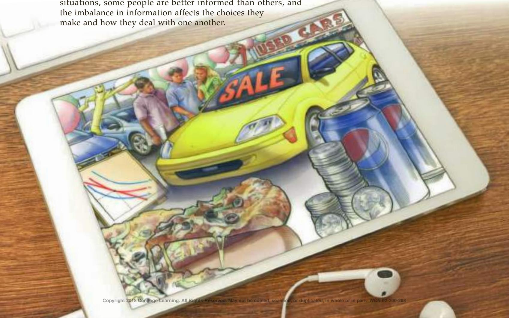
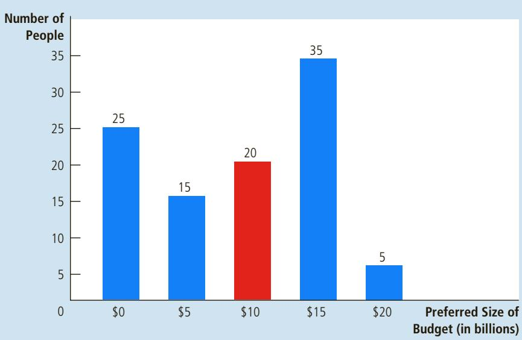
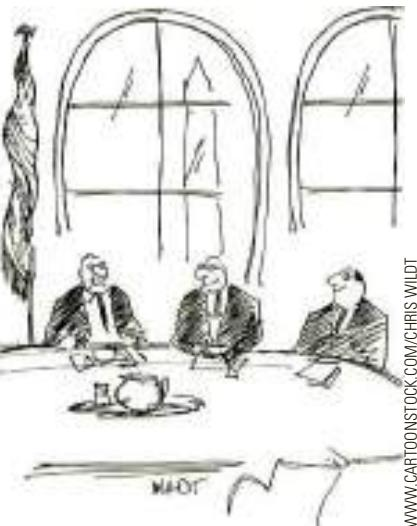

# Frontiers of Microeconomics

conomics is a study of the choices that people make and the resulting interactions they have with one another. As the preceding chapters demonstrate, the field has many facets. Yet it would be a mistake to think that all the facets we have seen make up a finished jewel, perfect and unchanging. Like all scientists, economists are always looking for new areas to study and new phenomena to explain. This final chapter on microeconomics offers an assortment of three topics at the discipline’s frontier to show how economists are trying to expand their understanding of human behavior and society.

The first topic is the economics of asymmetric information. In many different situations, some people are better informed than others, and the imbalance in information affects the choices they make and how they deal with one another.

Thinking about this asymmetry can shed light on many aspects of the world, from the market for used cars to the custom of gift giving.

The second topic we examine in this chapter is political economy. Throughout this book, we have seen many examples in which markets fail and government policy can potentially improve matters. But “potentially” is a necessary qualifier: Whether this potential is realized depends on how well our political institutions work. The field of political economy uses the tools of economics to understand the functioning of government.

The third topic in this chapter is behavioral economics. This field brings some insights from psychology into the study of economic issues. It offers a view of human behavior that is more subtle and complex than the one found in conventional economic theory, a view that may be more realistic.

This chapter covers a lot of ground. To do so, it offers not full helpings of these three topics but, instead, a taste of each. One goal of this chapter is to show a few of the directions economists are heading in their effort to expand knowledge of how the economy works. Another is to whet your appetite for more courses in economics.

## 22-1 Asymmetric Information

“I know something you don’t know.” This statement is a common taunt among children, but it also conveys a deep truth about how people sometimes interact with one another. Many times in life, one person knows more about what is going on than another. A difference in access to knowledge that is relevant to an interaction is called an information asymmetry.

Examples abound. A worker knows more than his employer about how much effort he puts into his job. A seller of a used car knows more than the buyer about the car’s condition. The first is an example of a hidden action, whereas the second is an example of a hidden characteristic. In each case, the uninformed party (the employer, the car buyer) would like to know the relevant information, but the informed party (the worker, the car seller) may have an incentive to conceal it.

Because asymmetric information is so prevalent, economists have devoted much effort in recent decades to studying its effects. Let’s discuss some of the insights that this study has revealed.

## moral hazard

the tendency of a person who is imperfectly monitored to engage in dishonest or otherwise undesirable behavior

## agent

a person who is performing an act for another person, called the principal

## principal

a person for whom another person, called the agent, is performing some act

## 22-1a Hidden Actions: Principals, Agents, and Moral Hazard

Moral hazard is a problem that arises when one person, called the agent, is performing some task on behalf of another person, called the principal. If the principal cannot perfectly monitor the agent’s behavior, the agent tends to undertake less effort than the principal considers desirable. The phrase moral hazard refers to the risk, or “hazard,” of inappropriate or otherwise “immoral” behavior by the agent. In such a situation, the principal tries various ways to encourage the agent to act more responsibly.

The employment relationship is the classic example. The employer is the principal, and the worker is the agent. The moral-hazard problem is the temptation of imperfectly monitored workers to shirk their responsibilities. Employers can respond to this problem in various ways:

Better monitoring. Employers may plant hidden video cameras to record workers’ behavior. The aim is to catch irresponsible actions that might occur when supervisors are absent.

• High wages. According to efficiency-wage theories (discussed in Chapter 19), some employers may choose to pay their workers a wage above the level that balances supply and demand in the labor market. A worker who earns an above-equilibrium wage is less likely to shirk because if he is caught and fired, he might not be able to find another high-paying job.

Delayed payment. Firms can delay part of a worker’s compensation, so if the worker is caught shirking and is fired, he suffers a larger penalty. One example of delayed compensation is the year-end bonus. Similarly, a firm may choose to pay its workers more later in their lives. Thus, the wage increases that workers get as they age may reflect not just the benefits of experience but also a response to moral hazard.

Employers can use any combination of these various mechanisms to reduce the problem of moral hazard.

FYI

## Corporate Management

uch production in the modern economy takes place within corporations. Like other firms, corporations buy inputs in markets for the factors of production and sell their output in markets for goods and services. Also like other firms, they are guided in their decisions by the objective of profit maximization. But a large corporation has to deal with some issues that do not arise in, say, a small family-owned business.

What is distinctive about a corporation? From a legal standpoint, a corporation is an organization that is granted a charter recognizing it as a separate legal entity, with its own rights and responsibilities distinct from those of its owners and employees. From an economic standpoint, the most important feature of the corporate form of organization is the separation of ownership and control. One group of people, called the shareholders, own the corporation and share in its profits. Another group of people, called the managers, are employed by the corporation to make decisions about how to deploy the corporation’s resources.

The separation of ownership and control creates a principal-agent problem. In this case, the shareholders are the principals and the managers are the agents. The chief executive officer and other managers, who are in the best position to know the available business opportunities, are charged with the task of maximizing profits for the shareholders. But ensuring that they carry out this task is not always easy. The managers may have goals of their own, such as taking life easy, having a plush office and a private jet, throwing lavish parties, or presiding over a large business empire. The managers’ goals may not always coincide with the shareholders’ goal of profit maximization.

The corporation’s board of directors is responsible for hiring and firing the top management. The board monitors the managers’

performance, and it designs their compensation packages. These packages often include incentives aimed at aligning the interests of shareholders with the

interests of management. Managers

might be given bonuses based on performance or options to buy the company’s stock, which are more valuable if the company performs well.

Note, however, that the directors are themselves agents of the shareholders. The existence of a board overseeing management only shifts the principal-agent problem. The issue then becomes how to ensure that the board of directors fulfills its own legal obligation of acting in the best interest of the shareholders. If the directors become too friendly with management, they may not provide the required oversight.

The corporation’s principal-agent problem became big news around 2005. The top managers of several prominent companies, including Enron, Tyco, and WorldCom, were found to be engaging in activities that enriched themselves at the expense of their shareholders. In these cases, the actions were so extreme as to be criminal, and the corporate managers were not just fired but also sent to prison. Some shareholders sued the directors for failing to monitor management sufficiently.

Fortunately, criminal activity by corporate managers is rare. But in some ways, it is only the tip of the iceberg. Whenever ownership and control are separated, as they are in most large corporations, there is an inevitable tension between the interests of shareholders and the interests of management. ■

There are also many examples of moral hazard beyond the workplace. A homeowner with fire insurance will likely buy too few fire extinguishers because the homeowner bears the cost of the extinguisher while the insurance company receives much of the benefit. A family may live near a river with a high risk of flooding because the family enjoys the scenic views, while the government bears the cost of disaster relief after a flood. Many regulations are aimed at addressing the problem: An insurance company may require homeowners to buy fire extinguishers, and the government may prohibit building homes on land with high risk of flooding. But the insurance company does not have perfect information about how cautious homeowners are, and the government does not have perfect information about the risk that families undertake when choosing where to live. As a result, the problem of moral hazard persists.

## 22-1b Hidden Characteristics: Adverse Selection and the Lemons Problem

adverse selection the tendency for the mix of unobserved attributes to become undesirable from the standpoint of an uninformed party

Adverse selection is a problem that arises in markets in which the seller knows more about the attributes of the good being sold than the buyer does. In such a situation, the buyer runs the risk of being sold a good of low quality. That is, the “selection” of goods sold may be “adverse” from the standpoint of the uninformed buyer.

The classic example of adverse selection is the market for used cars. Sellers of used cars know their vehicles’ defects while buyers often do not. Because owners of the worst cars are more likely to sell them than are the owners of the best cars, buyers are worried about getting a “lemon.” As a result, many people avoid buying vehicles in the used car market. This lemons problem can explain why a used car only a few weeks old sells for thousands of dollars less than a new car of the same type. A buyer of the used car might surmise that the seller is getting rid of the car quickly because the seller knows something about it that the buyer does not.

A second example of adverse selection occurs in the labor market. According to another efficiency-wage theory, workers vary in their abilities, and they know their own abilities better than do the firms that hire them. When a firm cuts the wage it pays, the more talented workers are more likely to quit, knowing they will be able to find employment elsewhere. Conversely, a firm may choose to pay an above-equilibrium wage to attract a better mix of workers.

A third example of adverse selection occurs in markets for insurance. For example, buyers of health insurance know more about their own health problems than do insurance companies. Because people with greater hidden health problems are more likely to buy health insurance than are other people, the price of health insurance reflects the costs of a sicker-than-average person. As a result, people with average health may observe the high price of insurance and decide not to buy it.

When markets suffer from adverse selection, the invisible hand does not necessarily work its magic. In the used car market, owners of good cars may choose to keep them rather than sell them at the low price that skeptical buyers are willing to pay. In the labor market, wages may be stuck above the level that balances supply and demand, resulting in unemployment. In insurance markets, buyers with low risk may choose to remain uninsured because the policies they are offered fail to reflect their true characteristics. Advocates of government-provided health insurance sometimes point to the problem of adverse selection as one reason not to trust the private market to provide the right amount of health insurance on its own.

## 22-1c Signaling to Convey Private Information

Although asymmetric information is sometimes a motivation for public policy, it also motivates some individual behavior that otherwise might be hard to explain. Markets respond to problems of asymmetric information in many ways. One of them is signaling, which refers to actions taken by an informed party for the sole purpose of credibly revealing his private information.

We have seen examples of signaling in previous chapters. As we saw in Chapter 16, firms may spend money on advertising to signal to potential customers that they have high-quality products. As we saw in Chapter 19, students may earn college degrees merely to signal to potential employers that they are high-ability individuals, rather than to increase their productivity. These two examples of signaling (advertising, education) may seem very different, but below the surface, they are much the same: In both cases, the informed party (the firm, the student) uses the signal to convince the uninformed party (the customer, the employer) that the informed party is offering something of high quality.

What does it take for an action to be an effective signal? Obviously, it must be costly. If a signal were free, everyone would use it and it would convey no information. For the same reason, there is another requirement: The signal must be less costly, or more beneficial, to the person with the higher-quality product. Otherwise, everyone would have the same incentive to use the signal, and the signal would reveal nothing.

Consider again our two examples. In the advertising case, a firm with a good product reaps a larger benefit from advertising because customers who try the product once are more likely to become repeat customers. Thus, it is rational for the firm with a good product to pay for the cost of the signal (advertising), and it is rational for the customer to use the signal as a piece of information about the product’s quality. In the education case, a talented person can get through school more easily than a less talented one. Thus, it is rational for the talented person to pay for the cost of the signal (education), and it is rational for the employer to use the signal as a piece of information about the person’s talent.

The world is replete with instances of signaling. Magazine ads sometimes include the phrase “as seen on TV.” Why does a firm selling a product in a magazine choose to stress this fact? One possibility is that the firm is trying to convey its willingness to pay for an expensive signal (a spot on television) in the hope that you will infer that its product is of high quality. For the same reason, graduates of elite schools are always sure to put that fact on their résumés.

## GIFTS AS SIGNALS

A man is debating what to give his girlfriend for her birthday. “I know,” he says to himself, “I’ll give her cash. After all, I don’t know her tastes as well as she does, and with cash, she can buy anything she wants.” But when he hands her the money, she is offended. Convinced he doesn’t really love her, she breaks off the relationship.

What’s the economics behind this story?

In some ways, gift giving is a strange custom. As the man in our story suggests, people typically know their own preferences better than others do, so we might expect everyone to prefer cash to in-kind transfers. If your employer substituted merchandise of his choosing for your paycheck, you would likely object to this means of payment. But your reaction is very different when someone who (you hope) loves you does the same thing.

signaling an action taken by an informed party to reveal private information to an uninformed party

  
“Now we’ll see how much he loves me.”  
MONKEY BUSINESS IMAGES/SHUTTERSTOCK.COM

One interpretation of gift giving is that it reflects asymmetric information and signaling. The man in our story has private information that the girlfriend would like to know: Does he really love her? Choosing a good gift for her is a signal of his love. Certainly, the act of picking out a gift, rather than giving cash, has the right characteristics to be a signal. It is costly (it takes time), and its cost depends on private information (how much he loves her). If he really loves her, choosing a good gift is easy because he is thinking about her all the time. If he doesn’t love her, finding the right gift is more difficult. Thus, giving a gift that suits his girlfriend is one way for him to convey the private information of his love for her. Giving cash shows that he isn’t even bothering to try.

The signaling theory of gift giving is consistent with another observation: People care most about the custom when the strength of affection is most in question. Thus, giving cash to a girlfriend or boyfriend is usually a bad move. But when college students receive a check from their parents, they are less often offended. The parents’ love is less likely to be in doubt, so the recipient probably won’t interpret the cash gift as a signal of insufficient affection. ●

## 22-1d Screening to Uncover Private Information

## screening

When an informed party takes actions to reveal private information, the phenomenon is called signaling. When an uninformed party takes actions to induce the informed party to reveal private information, the phenomenon is called screening.

an action taken by an uninformed party to induce an informed party to reveal information

Some screening is common sense. A person buying a used car may ask that it be checked by an auto mechanic before the sale. A seller who refuses this request reveals his private information that the car is a lemon. The buyer may decide to offer a lower price or to look for another car.

Other examples of screening are more subtle. For example, consider a firm that sells car insurance. The firm would like to charge a low premium to safe drivers and a high premium to risky drivers. But how can it tell them apart? Drivers know whether they are safe or risky, but the risky ones won’t admit it. A driver’s history is one piece of information (which insurance companies in fact use), but because of the intrinsic randomness of car accidents, history is an imperfect indicator of future risk.

The insurance company might be able to sort out the two kinds of drivers by offering different insurance policies that would induce the drivers to separate themselves. One policy would have a high premium and cover the full cost of any accidents that occur. Another policy would have low premiums but would have, say, a \$1,000 deductible. (That is, the driver would be responsible for the first \$1,000 of damage, and the insurance company would cover the remaining risk.) Notice that the deductible is more of a burden for risky drivers because they are more likely to have an accident. Thus, with a large enough deductible, the low-premium policy with a deductible would attract the safe drivers, while the high-premium policy without a deductible would attract the risky drivers. Faced with these two policies, the two kinds of drivers would reveal their private information by choosing different insurance policies.

## 22-1e Asymmetric Information and Public Policy

We have examined two kinds of asymmetric information: moral hazard and adverse selection. And we have seen how individuals may respond to the problem with signaling or screening. Now let’s consider what the study of asymmetric information suggests about the proper scope of public policy.

The tension between market success and market failure is central in microeconomics. We learned in Chapter 7 that the equilibrium of supply and demand is efficient in the sense that it maximizes the total surplus that society can obtain in a market. Adam Smith’s invisible hand seemed to reign supreme. This conclusion was then tempered with the study of externalities (Chapter 10), public goods (Chapter 11), imperfect competition (Chapters 15 through 17), and poverty (Chapter 20). In those chapters, we saw that government can sometimes improve market outcomes.

The study of asymmetric information gives us a new reason to be wary of markets. When some people know more than others, the market may fail to put resources to their best use. People with high-quality used cars may have trouble selling them because buyers will be afraid of getting a lemon. People with few health problems may have trouble getting low-cost health insurance because insurance companies lump them together with those who have significant (but hidden) health problems.

Asymmetric information may call for government action in some cases, but three facts complicate the issue. First, as we have seen, the private market can sometimes deal with information asymmetries on its own using a combination of signaling and screening. Second, the government rarely has more information than the private parties. Even if the market’s allocation of resources is not ideal, it may be the best that can be achieved. That is, when there are information asymmetries, policymakers may find it hard to improve upon the market’s admittedly imperfect outcome. Third, the government is itself an imperfect institution—a topic we take up in the next section.

QuickQuiz A person who buys a life insurance policy pays a certain amount per year death. Would you expect buyers of life insurance to have higher or lower death rates than the average person? How might this be an example of moral hazard? Of adverse selection? How might a life insurance company deal with these problems?

## 22-2 Political Economy

As we have seen, markets left on their own do not always reach a desirable allocation of resources. When we judge the market’s outcome to be either inefficient or inequitable, there may be a role for the government to step in and improve the situation. Yet before we embrace an activist government, we need to consider one more fact: The government is also an imperfect institution. The field of political economy (sometimes called the field of public choice) uses the methods of economics to study how government works.

## 22-2a The Condorcet Voting Paradox

Most advanced societies rely on democratic principles to set government policy. When a city is deciding between two locations to build a new park, for example, we have a simple way to choose: The majority gets its way. Yet for most policy issues, the number of possible outcomes far exceeds two. A new park could be placed in many possible locations. In this case, as the 18th-century French political theorist Marquis de Condorcet famously noted, democracy might run into some problems trying to choose the best outcome.

For example, suppose there are three possible outcomes, labeled A, B, and C, and there are three voter types with the preferences shown in Table 1. The mayor of our town wants to aggregate these individual preferences into preferences for society as a whole. How should he do it?

At first, he might try some pairwise votes. If he asks voters to choose first between B and C, voter types 1 and 2 will vote for B, giving B the majority. If he then asks voters to choose between A and B, voter types 1 and 3 will vote for A, giving A the majority. Observing that A beats B, and B beats C, the mayor might conclude that A is the voters’ clear choice.

But wait: Suppose the mayor then asks voters to choose between A and C. In this case, voter types 2 and 3 vote for C, giving C the majority. That is, under pairwise majority voting, A beats B, B beats C, and C beats A. Normally, we expect preferences to exhibit a property called transitivity: If A is preferred to B, and B is preferred to C, then we would expect A to be preferred to C. The Condorcet paradox is that democratic outcomes do not always obey this property. Pairwise voting might produce transitive preferences for society in some cases, but as our example in the table shows, it cannot be counted on to do so.

One implication of the Condorcet paradox is that the order in which things are voted on can affect the result. If the mayor suggests choosing first between A and B and then comparing the winner to C, the town ends up choosing C. But if the voters choose first between B and C and then compare the winner to A, the town ends up with A. And if the voters choose first between A and C and then compare the winner to B, the town ends up with B.

The Condorcet paradox teaches two lessons. The narrow lesson is that when there are more than two options, setting the agenda (that is, deciding the order in which items are voted on) can have a powerful influence over the outcome of a democratic election. The broad lesson is that majority voting by itself does not tell us what outcome a society really wants.

## 22-2b Arrow’s Impossibility Theorem

Since political theorists first noticed Condorcet’s paradox, they have spent much energy studying existing voting systems and proposing new ones. For example, as an alternative to pairwise majority voting, the mayor of our town could ask each voter to rank the possible outcomes. For each voter, we could give 1 point for last place, 2 points for second to last, 3 points for third to last, and so on. The outcome that receives the most total points wins. With the preferences in Table 1, outcome B is the winner. (You can do the arithmetic yourself.) This voting method is called a Borda count for the 18th-century French mathematician and political

## TABLE 1

The Condorcet Paradox If voters have these preferences over outcomes A, B, and C, then in pairwise majority voting, A beats B, B beats C, and C beats A.

<table><tr><td rowspan="2"></td><td colspan="3">Voter Type</td></tr><tr><td>Type 1</td><td>Type 2</td><td>Type 3</td></tr><tr><td>Percent of electorate</td><td>35</td><td>45</td><td>20</td></tr><tr><td>First choice</td><td>A</td><td>B</td><td>C</td></tr><tr><td>Second choice</td><td>B</td><td>C</td><td>A</td></tr><tr><td>Third choice</td><td>C</td><td>A</td><td>B</td></tr></table>

theorist, Jean-Charles de Borda, who devised it. It is often used in polls that rank sports teams.

Is there a perfect voting system? Economist Kenneth Arrow took up this question in his 1951 book Social Choice and Individual Values. Arrow started by defining what a perfect voting system would be. He assumes that individuals in society have preferences over the various possible outcomes: A, B, C, and so on. He then assumes that society wants a voting system to choose among these outcomes that satisfies several properties:

• Unanimity: If everyone prefers A to B, then A should beat B.

• Transitivity: If A beats B, and B beats C, then A should beat C.

• Independence of irrelevant alternatives: The ranking between any two outcomes A and B should not depend on whether some third outcome C is also available.

• No dictators: There is no person who always gets his way, regardless of everyone else’s preferences.

These all seem like desirable properties of a voting system. Yet Arrow proved, mathematically and incontrovertibly, that no voting system can satisfy all these properties. This amazing result is called Arrow’s impossibility theorem.

The mathematics needed to prove Arrow’s theorem is beyond the scope of this book, but we can get some sense of why the theorem is true from a couple of examples. We have already seen the problem with the method of majority rule. The Condorcet paradox shows that majority rule fails to produce a ranking of outcomes that always satisfies transitivity.

As another example, the Borda count fails to satisfy the independence of irrelevant alternatives. Recall that, using the preferences in Table 1, outcome B wins with a Borda count. But suppose that suddenly C disappears as an alternative. If the Borda count method is applied only to outcomes A and B, then A wins. (Once again, you can do the arithmetic on your own.) Thus, eliminating alternative C changes the ranking between A and B. This change occurs because the result of the Borda count depends on the number of points that A and B receive, and the number of points depends on whether the irrelevant alternative, C, is also available.

Arrow’s impossibility theorem is a deep and disturbing result. It doesn’t say that we should abandon democracy as a form of government. But it does say that no matter what voting system society adopts for aggregating the preferences of its members, it will in some way be flawed as a mechanism for social choice.

## 22-2c The Median Voter Is King

Despite Arrow’s theorem, voting is how most societies choose their leaders and public policies, often by majority rule. The next step in studying government is to examine how governments run by majority rule work. That is, in a democratic society, who determines what policy is chosen? In some cases, the theory of democratic government yields a surprisingly simple answer.

Let’s consider an example. Imagine that society is deciding how much money to spend on some public good, such as the army or the national parks. Each voter has his own most preferred budget, and he always prefers outcomes closer to his most preferred value to outcomes farther away. Thus, we can line up voters from those who prefer the smallest budget to those who prefer the largest. Figure 1 is an example. Here there are 100 voters, and the budget size varies from zero to \$20

## FIGURE 1

## The Median Voter Theorem: An Example

This bar chart shows how 100 voters’ most preferred budgets are distributed over five options, ranging from zero to \$20 billion. If society makes its choice by majority rule, the median voter, who here prefers \$10 billion, determines the outcome.

median voter theorem a mathematical result showing that if voters are choosing a point along a line and each voter wants the point closest to his most preferred point, then majority rule will pick the most preferred point of the median voter

billion. Given these preferences, what outcome would you expect democracy to produce?

According to a famous result called the median voter theorem, majority rule will produce the outcome most preferred by the median voter. The median voter is the voter exactly in the middle of the distribution. In this example, if you take the line of voters ordered by their preferred budgets and count 50 voters from either end of the line, you will find that the median voter wants a budget of \$10 billion. By contrast, the average preferred outcome (calculated by adding the preferred outcomes and dividing by the number of voters) is \$9 billion, and the modal outcome (the one preferred by the greatest number of voters) is \$15 billion.

The median voter rules the day because his preferred outcome beats any other proposal in a two-way race. In our example, more than half the voters want \$10 billion or more, and more than half want \$10 billion or less. If someone proposes, say, \$8 billion instead of \$10 billion, everyone who prefers \$10 billion or more will vote with the median voter. Similarly, if someone proposes \$12 billion instead of \$10 billion, everyone who wants \$10 billion or less will vote with the median voter. In either case, the median voter has more than half the voters on his side.

What about the Condorcet voting paradox? It turns out that when the voters are picking a point along a line and each voter aims for his own most preferred point, the Condorcet paradox cannot arise. The median voter’s most preferred outcome beats all challengers.

One implication of the median voter theorem is that if two political parties are each trying to maximize their chance of election, they will both move their positions toward the median voter. Suppose, for example, that the Democratic Party advocates a budget of \$15 billion, while the Republican Party advocates a budget of \$10 billion. The Democratic position is more popular in the sense that \$15 billion has more proponents than any other single choice. Nonetheless, the Republicans get more than 50 percent of the vote: They will attract the 20 voters who want \$10 billion, the 15 voters who want \$5 billion, and the 25 voters who want zero.

If the Democrats want to win, they will move their platform toward the median voter. Thus, this theory can explain why the parties in a two-party system are similar to each other: They are both moving toward the median voter.

Another implication of the median voter theorem is that minority views are not given much weight. Imagine that 40 percent of the population want a lot of money spent on the national parks and 60 percent want nothing spent. In this case, the median voter’s preference is zero, regardless of the intensity of the minority’s view. Rather than reaching a compromise that takes everyone’s preferences into account, majority rule looks only to the person in the exact middle of the distribution. Such is the logic of democracy.

## 22-2d Politicians Are People Too

WWW.CARTOONSTOCK.COM/CHRIS WILDT

When economists study consumer behavior, they assume that consumers buy the bundle of goods and services that gives them the greatest level of satisfaction. When economists study firm behavior, they assume that firms produce the quantity of goods and services that yields the greatest level of profits. What should they assume when they study people involved in the practice of politics?

Politicians also have objectives. It would be nice to assume that political leaders are always looking out for the well-being of society as a whole, that they are aiming for an optimal combination of efficiency and equality. Nice, perhaps, but not realistic. Self-interest is as powerful a motive for political actors as it is for consumers and firm owners. Some politicians, motivated by a desire for reelection, are willing to sacrifice the national interest to solidify their base of voters. Others are motivated by simple greed. If you have any doubt, you should look at the world’s poor nations, where corruption among government officials is a common impediment to economic development.

“Isn’t that the real genius of democracy? . . . The VOTERS are ultimately to blame.”

This book is not the place to develop a theory of political behavior. But when thinking about economic policy, remember that this policy is made not by a benevolent king (or even by benevolent economists) but by real people with their own all-too-human desires. Sometimes they are motivated to further the national interest, but sometimes they are motivated by their own political and financial ambitions. We shouldn’t be surprised when economic policy fails to resemble the ideals derived in economics textbooks.

A public school district is deciding on the school budget and the resulting QuickQuiz student–teacher ratio. A poll finds that 20 percent of the voters want a ratio of 9:1, 25 percent want a ratio of 10:1, 15 percent want a ratio of 11:1, and 40 percent want a ratio of 12:1. If the district uses majority-rule voting, what outcome would you expect the district to end up with? Explain.

## 22-3 Behavioral Economics

Economics is a study of human behavior, but it is not the only field that can make that claim. The social science of psychology also sheds light on the choices that people make in their lives. The fields of economics and psychology usually proceed independently, in part because they address a different range of questions. But recently, a field called behavioral economics has emerged in which economists are making use of basic psychological insights. Let’s consider some of these insights here.

behavioral economics the subfield of economics that integrates the insights of psychology

## 22-3a People Aren’t Always Rational

Economic theory is populated by a particular species of organism, sometimes called Homo economicus. Members of this species are always rational. As firm owners, they maximize profits. As consumers, they maximize utility (or equivalently, pick the point on the highest indifference curve). Given the constraints they face, they rationally weigh all the costs and benefits and always choose the best possible course of action.

Real people, however, are Homo sapiens. Although in many ways they resemble the rational, calculating people assumed in economic theory, they are far more complex. They can be forgetful, impulsive, confused, emotional, and shortsighted. These imperfections of human reasoning are the bread and butter of psychologists, but until recently, economists have neglected them.

Herbert Simon, one of the first social scientists to work at the boundary of economics and psychology, suggested that humans should be viewed not as rational maximizers but as satisficers. Instead of always choosing the best course of action, they make decisions that are merely good enough. Similarly, other economists have suggested that humans are only “near rational” or that they exhibit “bounded rationality.”

Studies of human decision making have tried to detect systematic mistakes that people make. Here are a few of the findings:

People are overconfident. Imagine that you were asked some numerical questions, such as the number of African countries in the United Nations, the height of the tallest mountain in North America, and so on. Instead of being asked for a single estimate, however, you were asked to give a 90 percent confidence interval—a range such that you were 90 percent confident the true number falls within it. When psychologists run experiments like this, they find that most people give ranges that are too small: The true number falls within their intervals far less than 90 percent of the time. That is, most people are too sure of their own abilities.

• People give too much weight to a small number of vivid observations. Imagine that you are thinking about buying a car of brand X. To learn about its reliability, you read Consumer Reports, which has surveyed 1,000 owners of car X. Then you run into a friend who owns car X, and he tells you that his car is a lemon. How do you treat your friend’s observation? If you think rationally, you will realize that he has only increased your sample size from 1,000 to 1,001, which does not provide much new information. But because your friend’s story is so vivid, you may be tempted to give it more weight in your decision making than you should.

• People are reluctant to change their minds. People tend to interpret evidence to confirm beliefs they already hold. In one study, subjects were asked to read and evaluate a research report on whether capital punishment deters crime. After reading the report, those who initially favored the death penalty said they were more certain of their view, and those who initially opposed the death penalty also said they were more certain of their view. The two groups interpreted the same evidence in exactly opposite ways. This behavior is sometimes called confirmation bias.

Think about decisions you have made in your own life. Do you exhibit some of these traits?

A hotly debated issue is whether deviations from rationality are important for understanding economic phenomena. An intriguing example arises in the study of 401(k) plans, the tax-advantaged retirement savings accounts that some firms offer their workers. In some firms, workers can choose to participate in the plan by filling out a simple form. In other firms, workers are automatically enrolled and can opt out of the plan by filling out a simple form. It turns out many more workers participate in the second case than in the first. If workers were perfectly rational maximizers, they would choose the optimal amount of retirement saving, regardless of the default offered by their employer. In fact, workers’ behavior appears to exhibit substantial inertia. Understanding their behavior seems easier once we abandon the model of rational man.

Why, you might ask, is economics built on the rationality assumption when psychology and common sense cast doubt on it? One answer is that the assumption, even if not exactly true, may be true enough that it yields reasonably accurate models of behavior. For example, when we studied the differences between competitive and monopoly firms, the assumption that firms rationally maximize profit yielded many important and valid insights. Incorporating complex psychological deviations from rationality into the story might have added realism, but it also would have muddied the waters and made those insights harder to find. Recall from Chapter 2 that economic models are not meant to replicate reality but are supposed to show the essence of the problem at hand.

Another reason economists often assume rationality may be that economists are themselves not rational maximizers. Like most people, they are overconfident and reluctant to change their minds. Their choice among alternative theories of human behavior may exhibit excessive inertia. Moreover, economists may be content with a theory that is not perfect but is good enough. The model of rational man may be the theory of choice for a satisficing social scientist.

## 22-3b People Care about Fairness

Another insight about human behavior is best illustrated with an experiment called the ultimatum game. The game works like this: Two volunteers (who are otherwise strangers to each other) are told that they are going to play a game and could win a total of \$100. Before they play, they learn the rules. The game begins with a coin toss, which is used to assign the volunteers to the roles of player A and player B. Player A’s job is to propose a division of the \$100 prize between himself and the other player. After player A makes his proposal, player B decides whether to accept or reject it. If he accepts it, both players are paid according to the proposal. If player B rejects the proposal, both players walk away with nothing. In either case, the game then ends.

Before proceeding, stop and think about what you would do in this situation. If you were player A, what division of the \$100 would you propose? If you were player B, what proposals would you accept?

Conventional economic theory assumes in this situation that people are rational wealth maximizers. This assumption leads to a simple prediction: Player A should propose that he gets \$99 and player B gets \$1, and player B should accept the proposal. After all, once the proposal is made, player B is better off accepting it as long as he gets something out of it. Moreover, because player A knows that accepting the proposal is in player B’s interest, player A has no reason to offer him more than \$1. In the language of game theory (discussed in Chapter 17), the 99–1 split is the Nash equilibrium.

Yet when experimental economists ask real people to play the ultimatum game, the results differ from this prediction. People in player B’s role usually reject proposals that give them only \$1 or a similarly small amount. Anticipating this, people in the role of player A usually propose giving player B much more than \$1. Some people will offer a 50–50 split, but it is more common for player A to propose giving player B an amount such as \$30 or \$40, keeping the larger share for himself. In this case, player B usually accepts the proposal.

What’s going on here? The natural interpretation is that people are driven in part by some innate sense of fairness. A 99–1 split seems so wildly unfair to many people that they reject it, even to their own detriment. By contrast, a 70–30 split is still unfair, but it is not so unfair that it induces people to abandon their normal self-interest.

Throughout our study of household and firm behavior, the innate sense of fairness has not played any role. But the results of the ultimatum game suggest that
