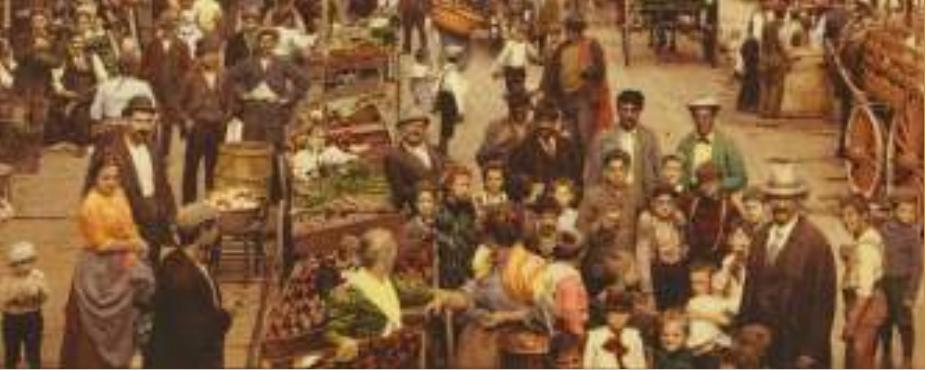

# IN THE NEWS

# Using Deviations from Rationality

A leading behavioral economist makes the case for his field.

## The Importance of Irrelevance

By Richard H. Thaler

arly in my teaching career I managed to get most of the students in my class mad at me. A midterm exam caused the problem.

I wanted the exam to sort out the stars, the average Joes and the duds, so it had to be hard and have a wide dispersion of scores. I succeeded in writing such an exam, but when the students got their results they were in an uproar. Their principal complaint was that the average score was only 72 points out of 100.

What was odd about this reaction was that I had already explained that the average numerical score on the exam had absolutely no effect on the distribution of letter grades. We employed a curve in which the average grade was a B+, and only a tiny number of students received grades below a C. I told the class this, but it had no effect on the students’ mood. They still hated my exam, and they were none too happy with me either. As a young professor worried about keeping my job, I wasn’t sure what to do.

Finally, an idea occurred to me. On the next exam, I raised the points available for a perfect score to 137. This exam turned out to be harder than the first. Students got only 70 percent of the answers right but the average numerical score was 96 points. The students were delighted!

I chose 137 as a maximum score for two reasons. First, it produced an average well into the 90s, and some students scored above 100, generating a reaction approaching ecstasy. Second, because dividing by 137 is not easy to do in your head, I figured that most students wouldn’t convert their scores into percentages.

Striving for full disclosure, in subsequent years I included this statement in my course syllabus: “Exams will have a total of 137 points rather than the usual 100. This scoring system has no effect on the grade you get in the course, but it seems to make you happier.” And, indeed, after I made that change, I never got a complaint that my exams were too hard.

In the eyes of an economist, my students were “misbehaving.” By that I mean that their behavior was inconsistent with the idealized model at the heart of much of economics. Rationally, no one should be happier about a score of 96 out of 137 (70 percent) than 72 out of 100, but my students were. And by realizing this, I was able to set the kind of exam I wanted but still keep the students from grumbling.

This illustrates an important problem with traditional economic theory. Economists discount any factors that would not influence the thinking of a rational person. These things are supposedly irrelevant. But unfortunately for the theory, many supposedly irrelevant factors do matter.

Economists create this problem with their insistence on studying mythical creatures often known as Homo economicus. I prefer to call them “Econs”—highly intelligent beings that are capable of making the most complex of calculations but are totally lacking in emotions.

Think of Mr. Spock in “Star Trek.” In a world of Econs, many things would in fact be irrelevant.

No Econ would buy a larger portion of whatever will be served for dinner on Tuesday because he happens to be hungry when shopping on Sunday. Your hunger on Sunday should be irrelevant in choosing the size of your meal for Tuesday. An Econ would not finish that huge meal on Tuesday, even though he is no longer hungry, just because he had paid for it. To an Econ, the price paid for an item in the past is not relevant in making the decision about how much of it to eat now.

An Econ would not expect a gift on the day of the year in which she happened to get married, or be born. What difference do these arbitrary dates make? In fact, Econs would be perplexed by the idea of gifts. An Econ would know that cash is the best possible gift; it allows the recipient to buy whatever is optimal. But unless you are married to an economist, I don’t advise giving cash on your next anniversary. Come to think of it, even if your spouse is an economist, this is not a great idea.

Of course, most economists know that the people with whom they interact do not resemble Econs. In fact, in private moments, economists are often happy to admit that most of the people they know are clueless about economic matters. But for decades, this realization did not affect the way most economists did their work. They had a justification:

perhaps it should. For example, in Chapters 18 and 19, we discussed how wages were determined by labor supply and labor demand. Some economists have suggested that the perceived fairness of what a firm pays its workers should also enter the picture. Thus, when a firm has an especially profitable year, workers (like player B) may expect to be paid a fair share of the prize, even if the standard equilibrium does not dictate it. The firm (like player A) might well decide to give workers more than the equilibrium wage for fear that the workers might otherwise try to punish the firm with reduced effort, strikes, or even vandalism.

markets. To defenders of economics orthodoxy, markets are thought to have magic powers.

There is a version of this magic market argument that I call the invisible hand wave. It goes something like this. “Yes, it is true that my spouse and my students and members of Congress don’t understand anything about economics, but when they have to interact with markets . . . .” It is at this point that the hand waving comes in. Words and phrases such as high stakes, learning and arbitrage are thrown around to suggest some of the ways that markets can do their magic, but it is my claim that no one has ever finished making the argument with both hands remaining still.

VICKI COUCHMAN/CAMERA PRESS/REDUX

Hand waving is required because there is nothing in the workings of markets that turns otherwise normal human beings into Econs. For example, if you choose the wrong career, select the wrong mortgage or fail to save for retirement, markets do not correct those failings. In fact, quite the opposite often happens. It is much easier to make money by catering to consumers’ biases than by trying to correct them.

Perhaps because of undue acceptance of invisible-hand-wave arguments, economists have been ignoring supposedly irrelevant factors, comforted by the knowledge that in markets these factors just wouldn’t matter. Alas, both the field of economics and society are much worse for it. Supposedly irrelevant factors, or SIFs, matter a lot, and if we economists recognize their importance, we can do our jobs better. Behavioral economics is, to a large extent, standard economics that has been modified to incorporate SIFs.

SIFs matter in more important domains than keeping students happy with test scores. Consider defined-contribution retirement plans like 401(k)’s. Econs would have no trouble figuring out how much to save for retirement and how to invest the money, but mere humans can find it quite tough. So knowledgeable employers have incorporated three SIFs in their plan design: they automatically enroll employees (who can opt out), they automatically increase the saving rate every year, and they offer a sensible default investment choice like a target date fund. These features significantly improve the outcomes of plan participants, but to economists they are SIFs because Econs would just figure out the right thing to do without them.

  
Richard Thaler

These retirement plans also have a supposedly relevant factor: Contributions and capital appreciation are tax-sheltered until retirement. This tax break was created to induce people to save more. But guess what: A recent study using Danish data has compared the relative effectiveness of the SIFs and a similar tax subsidy offered in Denmark. The authors attribute only 1 percent of the saving done in the Danish plans to the tax breaks. The other 99 percent comes from the automatic features.

They conclude: “In sum, the findings of our study call into question whether tax subsidies are the most effective policy to increase retirement savings. Automatic enrollment or default policies that nudge individuals to save more could have larger impacts on national saving at lower social cost.” Irrelevant indeed!

Notice that the irrelevant design features that do all the work are essentially free, whereas a tax break is quite expensive. The Joint Economic Committee estimates that the United States tax break will cost the government \$62 billion in 2015, a number that is predicted to grow rapidly. Furthermore, most of these tax benefits accrue to affluent taxpayers.

Here is another example. In the early years of the Obama administration, Congress passed a law giving taxpayers a temporary tax cut and the administration had to decide how to carry it out. Should taxpayers be given a lump sum check, or should the extra money be spread out over the year via regular paychecks?

In a world of Econs this choice would be irrelevant. A \$1,200 lump sum would have the same effect on consumption as monthly paychecks that are \$100 larger. But while most middle-class taxpayers spend almost their entire paycheck every month, if given a lump sum they are more likely to save some of it or pay off debts. Since the tax cut was intended to stimulate spending, I believe the administration made a wise choice in choosing to spread it out.

The field of behavioral economics has been around for more than three decades, but the application of its findings to societal problems has only recently been catching on. Fortunately, economists open to new ways of thinking are finding novel ways to use supposedly irrelevant factors to make the world a better place. ■

Richard Thaler is a professor of economics at the University of Chicago.

Source: New York Times, May 10, 2015.

## 22-3c People Are Inconsistent over Time

Imagine some dreary task, such as doing your laundry, shoveling snow off your driveway, or filling out your income tax forms. Now consider the following questions:

1. Would you prefer (A) to spend 50 minutes doing the task right now or (B) to spend 60 minutes doing the task tomorrow?

2. Would you prefer (A) to spend 50 minutes doing the task in 90 days or (B) to spend 60 minutes doing the task in 91 days?

When asked questions like these, many people choose B for question 1 and A for question 2. When looking ahead to the future (as in question 2), they minimize the amount of time spent on the dreary task. But faced with the prospect of doing the task immediately (as in question 1), they choose to put it off.

In some ways, this behavior is not surprising: Everyone procrastinates from time to time. But from the standpoint of the theory of rational man, it is puzzling. Suppose that in response to question 2, a person chooses to spend 50 minutes in 90 days. Then, when the 90th day arrives, we allow him to change his mind. In effect, he then faces question 1, so he opts for doing the task the next day. But why should the mere passage of time affect the choices he makes?

Many times in life, people make plans for themselves, but then they fail to follow through. A smoker promises himself that he will quit, but within a few hours of smoking his last cigarette, he craves another and breaks his promise. A person trying to lose weight promises that he will stop eating dessert, but when the waiter brings the dessert cart, the diet goes out the window. In both cases, the desire for instant gratification induces the decision maker to abandon his past plans.

Some economists believe that the consumption–saving decision is an important instance in which people exhibit this inconsistency over time. For many people, spending provides a type of instant gratification. Saving, like passing up the cigarette or the dessert, requires a sacrifice in the present for a reward in the distant future. And just as many smokers wish they could quit and many overweight individuals wish they ate less, many consumers wish they saved more of their income. According to one survey, 76 percent of Americans said they were not saving enough for retirement.

An implication of this inconsistency over time is that people should try to find ways to commit their future selves to following through on their plans. A smoker trying to quit may throw away his cigarettes, and a person on a diet may put a lock on the refrigerator. What can a person who saves too little do? He should find some way to lock up his money before he spends it. Some retirement accounts, such as 401(k) plans, do exactly that. A worker can agree to have some money taken out of his paycheck before he ever sees it. The money is deposited in an account that can be used before retirement only with a penalty. Perhaps that is one reason these retirement accounts are so popular: They protect people from their own desires for instant gratification.

Describe at least three ways in which human decision making differs from that of the rational individual of conventional economic theory.

## 22-4 Conclusion

This chapter examined the frontier of microeconomics. You may have noticed that we sketched out ideas rather than fully developing them. This is no accident. One reason is that you might study these topics in more detail in advanced courses. Another reason is that these topics remain active areas of research and, therefore, are still being fleshed out.

To see how these topics fit into the broader picture, recall the Ten Principles of Economics from Chapter 1. One principle states that markets are usually a good way to organize economic activity. Another principle states that governments can sometimes improve market outcomes. As you study economics, you can more fully appreciate the truth of these principles as well as the caveats that go with them. The study of asymmetric information should make you more wary of market outcomes. The study of political economy should make you more wary of government solutions. And the study of behavioral economics should make you wary of any institution that relies on human decision making, including both the market and the government.

If there is a unifying theme to these topics, it is that life is messy. Information is imperfect, government is imperfect, and people are imperfect. Of course, you knew this long before you started studying economics, but economists need to understand these imperfections as precisely as they can if they are to explain, and perhaps even improve, the world around them.

## CHAPTER QuickQuiz

1. Because Elaine has a family history of significant medical problems, she buys health insurance, whereas her friend Jerry, who has a healthier family, goes without. This is an example of

a. moral hazard.

b. adverse selection.

c. signaling.

d. screening.

2. George has a life insurance policy that pays his family \$1 million if he dies. As a result, he does not hesitate to enjoy his favorite hobby of bungee jumping. This is an example of

a. moral hazard.

b. adverse selection.

c. signaling.

d. screening.

3. Before selling anyone a health insurance policy, the Kramer Insurance Company requires that applicants undergo a medical examination. Those with significant preexisting medical problems are charged more. This is an example of

a. moral hazard.

b. adverse selection.

4. The Condorcet paradox illustrates Arrow’s impossibility theorem by showing that pairwise majority voting a. is inconsistent with the principle of unanimity.

b. leads to social preferences that are not transitive.

c. violates the independence of irrelevant alternatives.

d. makes one person in effect a dictator.

5. Two political candidates are vying for town mayor, and the key issue is how much to spend on the annual Fourth of July fireworks. Among the 100 voters, 40 want to spend \$30,000, 30 want to spend \$10,000, and 30 want to spend nothing at all. What is the winning position on this issue?

a. \$10,000

b. \$15,000

c. \$20,000

d. \$30,000

6. The experiment called the ultimatum game illustrates that people

a. are overconfident in their own abilities.

c. signaling.

b. play the Nash equilibrium in strategic situations.

c. care about fairness, even to their own detriment.

d. make inconsistent decisions over time.

d. screening.

## SUMMARY

In many economic transactions, information is asymmetric. When there are hidden actions, principals may be concerned that agents suffer from the problem of moral hazard. When there are hidden characteristics, buyers may be concerned about the problem of adverse selection among the sellers. Private markets sometimes deal with asymmetric information with signaling and screening.

Although government policy can sometimes improve market outcomes, governments are themselves imperfect institutions. The Condorcet paradox shows that majority rule fails to produce transitive preferences for society, and Arrow’s impossibility theorem shows that no voting system will be perfect. In many situations, democratic institutions will produce the outcome desired by the median voter, regardless of the preferences of the rest of the electorate. Moreover, the individuals who set government policy may be motivated by self-interest rather than the national interest.

The study of psychology and economics reveals that human decision making is more complex than is assumed in conventional economic theory. People are not always rational, they care about the fairness of economic outcomes (even to their own detriment), and they can be inconsistent over time.

## KEY CONCEPTS

moral hazard, p. 452

agent, p. 452

principal, p. 452

adverse selection, p. 454

signaling, p. 455

screening, p. 456

political economy, p. 457

Condorcet paradox, p. 458

Arrow’s impossibility theorem, p. 459 median voter theorem, p. 460 behavioral economics, p. 461

## QUESTIONS FOR REVIEW

1. What is moral hazard? List three things an employer might do to reduce the severity of this problem.

2. What is adverse selection? Give an example of a market in which adverse selection might be a problem.

3. Define signaling and screening and give an example of each.

4. What unusual property of voting did Condorcet notice?

5. Explain why majority rule respects the preferences of the median voter rather than the average voter.

6. Describe the ultimatum game. What outcome from this game would conventional economic theory predict? Do experiments confirm this prediction? Explain.

## PROBLEMS AND APPLICATIONS

1. Each of the following situations involves moral hazard. In each case, identify the principal and the agent and explain why there is asymmetric information. How does the action described reduce the problem of moral hazard?

a. Landlords require tenants to pay security deposits.

b. Firms compensate top executives with options to buy company stock at a given price in the future.

c. Car insurance companies offer discounts to customers who install antitheft devices in their cars.

2. Suppose that the Live-Long-and-Prosper Health Insurance Company charges \$5,000 annually for a family insurance policy. The company’s president suggests that the company raise the annual price to \$6,000 to increase its profits. If the firm followed this suggestion, what economic problem might arise? Would the firm’s pool of customers tend to become more or less healthy on average? Would the company’s profits necessarily increase?

3. A case study in this chapter describes how a boyfriend can signal his love to a girlfriend by giving an appropriate gift. Do you think saying “I love you” can also serve as a signal? Why or why not?

4. The health insurance reform signed into law by President Obama in 2010 included the following two provisions:

i. Insurance companies must offer health insurance to everyone who applies and charge them the same price regardless of a person’s preexisting health condition.

ii. Everyone must buy health insurance or pay a penalty for not doing so.

a. Which of these policies taken on its own makes the problem of adverse selection worse? Explain.

b. Why do you think the policy you identified in part (a) was included in the law?

c. Why do you think the other policy was included in the law?

## 5. Ken walks into an ice-cream parlor.

Waiter: “We have vanilla and chocolate today.” Ken: “I’ll take vanilla.”

Waiter: “I almost forgot. We also have strawberry.” Ken: “In that case, I’ll take chocolate.”

What standard property of decision making is Ken violating? (Hint: Reread the section on Arrow’s impossibility theorem.)

6. Three friends are choosing a restaurant for dinner. Here are their preferences:

<table><tr><td></td><td>Rachel</td><td>Ross</td><td>Joey</td></tr><tr><td>First choice</td><td>Italian</td><td>Italian</td><td>Chinese</td></tr><tr><td>Second choice</td><td>Chinese</td><td>Chinese</td><td>Mexican</td></tr><tr><td>Third choice</td><td>Mexican</td><td>Mexican</td><td>French</td></tr><tr><td>Fourth choice</td><td>French</td><td>French</td><td>Italian</td></tr></table>

a. If the three friends use a Borda count to make their decision, where do they go to eat?

b. On their way to their chosen restaurant, they see that the Mexican and French restaurants are closed, so they use a Borda count again to decide between the remaining two restaurants. Where do they decide to go now?

c. How do your answers to parts (a) and (b) relate to Arrow’s impossibility theorem?

7. Three friends are choosing a TV show to watch. Here are their preferences:

<table><tr><td></td><td>Chandler</td><td>Phoebe</td><td>Monica</td></tr><tr><td>First choice</td><td>Empire</td><td>Supergirl</td><td>Homeland</td></tr><tr><td>Second choice</td><td>Supergirl</td><td>Homeland</td><td>Empire</td></tr><tr><td>Third choice</td><td>Homeland</td><td>Empire</td><td>Supergirl</td></tr></table>

a. If the three friends try using a Borda count to make their choice, what would happen?

b. Monica suggests a vote by majority rule. She proposes that first they choose between Empire and Supergirl, and then they choose between the winner of the first vote and Homeland. If they all vote their preferences honestly, what outcome would occur?

c. Should Chandler agree to Monica’s suggestion? What voting system would he prefer?

d. Phoebe and Monica convince Chandler to go along with Monica’s proposal. In round one, Chandler dishonestly says he prefers Supergirl over Empire. Why might he do this?

8. Five roommates are planning to spend the weekend in their dorm room watching movies, and they are debating how many movies to watch. Here is their willingness to pay:

<table><tr><td></td><td>Quentin</td><td>Spike</td><td>Ridley</td><td>Martin</td><td>Steven</td></tr><tr><td>First film</td><td>$14</td><td>$10</td><td>$8</td><td>$4</td><td>$2</td></tr><tr><td>Second film</td><td>12</td><td>8</td><td>4</td><td>2</td><td>0</td></tr><tr><td>Third film</td><td>10</td><td>6</td><td>2</td><td>0</td><td>0</td></tr><tr><td>Fourth film</td><td>6</td><td>2</td><td>0</td><td>0</td><td>0</td></tr><tr><td>Fifth film</td><td>2</td><td>0</td><td>0</td><td>0</td><td>0</td></tr></table>

Buying a DVD costs \$15, which the roommates split equally, so each pays \$3 per movie.

a. What is the efficient number of movies to watch (that is, the number that maximizes total surplus)?

b. From the standpoint of each roommate, what is the preferred number of movies?

c. What is the preference of the median roommate?

d. If the roommates held a vote on the efficient outcome versus the median voter’s preference, how would each person vote? Which outcome would get a majority?

e. If one of the roommates proposed a different number of movies, could his proposal beat the winner from part (d) in a vote?

f. Can majority rule be counted on to reach efficient outcomes in the provision of public goods?

9. Two ice-cream stands are deciding where to set up along a 1-mile beach. The people are uniformly located along the beach, and each person sitting on the beach buys exactly 1 ice-cream cone per day from the nearest stand. Each ice-cream seller wants the maximum number of customers. Where along the beach will the two stands locate? Of which result in this chapter does this outcome remind you?

10. The government is considering two ways to help the needy: giving them cash or giving them free meals at soup kitchens.

a. Give an argument, based on the standard theory of the rational consumer, for giving cash.

b. Give an argument, based on asymmetric information, for why the soup kitchen may be better than the cash handout.

c. Give an argument, based on behavioral economics, for why the soup kitchen may be better than the cash handout.

To find additional study resources, visit cengagebrain.com, and search for “Mankiw.”

## A

ability-to-pay principle the idea that taxes should be levied on a person according to how well that person can shoulder the burden absolute advantage the ability to produce a good using fewer inputs than another producer accounting profit total revenue minus total explicit cost adverse selection the tendency for the mix of unobserved attributes to become undesirable from the standpoint of an uninformed party agent a person who is performing an act for another person, called the principal Arrow’s impossibility theorem a mathematical result showing that, under certain assumed conditions, there is no scheme for aggregating individual preferences into a valid set of social preferences average fixed cost fixed cost divided by the quantity of output average revenue total revenue divided by the quantity sold average tax rate total taxes paid divided by total income average total cost total cost divided by the quantity of output average variable cost variable cost divided by the quantity of output

## B

behavioral economics the subfield of economics that integrates the insights of psychology benefits principle the idea that people should pay taxes based on the benefits they receive from government services budget constraint the limit on the consumption bundles that a consumer can afford

business cycle fluctuations in economic activity, such as employment and production

## C

capital the equipment and structures used to produce goods and services

cartel a group of firms acting in unison

circular-flow diagram a visual model of the economy that shows how dollars flow through markets among households and firms

club goods goods that are excludable but not rival in consumption

Coase theorem the proposition that if private parties can bargain without cost over the allocation of resources, they can solve the problem of externalities on their own

collusion an agreement among firms in a market about quantities to produce or prices to charge

common resources goods that are rival in consumption but not excludable

comparative advantage the ability to produce a good at a lower opportunity cost than another producer

compensating differential a difference in wages that arises to offset the nonmonetary characteristics of different jobs

competitive market a market with many buyers and sellers trading identical products so that each buyer and seller is a price taker

complements two goods for which an increase in the price of one leads to a decrease in the demand for the other

Condorcet paradox the failure of majority rule to produce transitive preferences for society

constant returns to scale the property whereby longrun average total cost stays the same as the quantity of output changes

consumer surplus the amount a buyer is willing to pay for a good minus the amount the buyer actually pays for it

corrective tax a tax designed to induce private decision makers to take into account the social costs that arise from a negative externality

cost the value of everything a seller must give up to produce a good

cost–benefit analysis a study that compares the costs and benefits to society of providing a public good

cross-price elasticity of demand a measure of how much the quantity demanded of one good responds to a change in the price of another good, computed as the percentage change in quantity demanded of the first good divided by the percentage change in price of the second good

## D

deadweight loss the fall in total surplus that results from a market distortion, such as a tax

demand curve a graph of the relationship between the price of a good and the quantity demanded

demand schedule a table that shows the relationship between the price of a good and the quantity demanded

diminishing marginal product the property whereby the marginal product of an input declines as the quantity of the input increases

discrimination the offering of different opportunities to similar individuals who differ only by race, ethnic group, sex, age, or other personal characteristics

diseconomies of scale the property whereby longrun average total cost rises as the quantity of output increases

dominant strategy a strategy that is best for a player in a game regardless of the strategies chosen by the other players

## E

economic profit total revenue minus total cost, including both explicit and implicit costs

economics the study of how society manages its scarce resources

economies of scale the property whereby long-run average total cost falls as the quantity of output increases

efficiency the property of a resource allocation of maximizing the total surplus received by all members of society

efficiency wages above-equilibrium wages paid by firms to increase worker productivity

efficient scale the quantity of output that minimizes average total cost

elasticity a measure of the responsiveness of quantity demanded or quantity supplied to a change in one of its determinants

equality the property of distributing economic prosperity uniformly among the members of society

equilibrium a situation in which the market price has reached the level at which quantity supplied equals quantity demanded

equilibrium price the price that balances quantity supplied and quantity demanded

equilibrium quantity the quantity supplied and the quantity demanded at the equilibrium price

excludability the property of a good whereby a person can be prevented from using it

explicit costs input costs that require an outlay of money by the firm

exports goods produced domestically and sold abroad externality the uncompensated impact of one person’s actions on the well-being of a bystander

## F

factors of production the inputs used to produce goods and services

fixed costs costs that do not vary with the quantity of output produced

free rider a person who receives the benefit of a good but avoids paying for it

## G

game theory the study of how people behave in strategic situations

Giffen good a good for which an increase in the price raises the quantity demanded

## H

horizontal equity the idea that taxpayers with similar abilities to pay taxes should pay the same amount human capital the accumulation of investments in people, such as education and on-the-job training

##

implicit costs input costs that do not require an outlay of money by the firm

imports goods produced abroad and sold domestically

incentive something that induces a person to act income effect the change in consumption that results when a price change moves the consumer to a higher or lower indifference curve

income elasticity of demand a measure of how much the quantity demanded of a good responds to a change in consumers’ income, computed as the percentage change in quantity demanded divided by the percentage change in income

indifference curve a curve that shows consumption bundles that give the consumer the same level of satisfaction

inferior good a good for which, other things being equal, an increase in income leads to a decrease in demand

inflation an increase in the overall level of prices in the economy

in-kind transfers transfers to the poor given in the form of goods and services rather than cash

internalizing the externality altering incentives so that people take into account the external effects of their actions

## L

law of demand the claim that, other things being equal, the quantity demanded of a good falls when the price of the good rises

law of supply the claim that, other things being equal, the quantity supplied of a good rises when the price of the good rises

law of supply and demand the claim that the price of any good adjusts to bring the quantity supplied and the quantity demanded for that good into balance

liberalism the political philosophy according to which the government should choose policies deemed just, as evaluated by an impartial observer behind a “veil of ignorance”

libertarianism the political philosophy according to which the government should punish crimes and enforce voluntary agreements but not redistribute income

life cycle the regular pattern of income variation over a person’s life

lump-sum tax a tax that is the same amount for every person

## M

macroeconomics the study of economywide phenomena, including inflation, unemployment, and economic growth

marginal change a small incremental adjustment to a plan of action

marginal cost the increase in total cost that arises from an extra unit of production

marginal product the increase in output that arises from an additional unit of input

marginal product of labor the increase in the amount of output from an additional unit of labor

marginal rate of substitution the rate at which a consumer is willing to trade one good for another

marginal revenue the change in total revenue from an additional unit sold

marginal tax rate the amount by which taxes increase from an additional dollar of income

market a group of buyers and sellers of a particular good or service

market economy an economy that allocates resources through the decentralized decisions of many firms and households as they interact in markets for goods and services

market failure a situation in which a market left on its own fails to allocate resources efficiently

market power the ability of a single economic actor (or small group of actors) to have a substantial influence on market prices

maximin criterion the claim that the government should aim to maximize the well-being of the worst-off person in society

median voter theorem a mathematical result showing that if voters are choosing a point along a line and each voter wants the point closest to his most preferred point, then majority rule will pick the most preferred point of the median voter

microeconomics the study of how households and firms make decisions and how they interact in markets

monopolistic competition a market structure in which many firms sell products that are similar but not identical

monopoly a firm that is the sole seller of a product without any close substitutes

moral hazard the tendency of a person who is imperfectly monitored to engage in dishonest or otherwise undesirable behavior

## N

Nash equilibrium a situation in which economic actors interacting with one another each choose their best strategy given the strategies that all the other actors have chosen

natural monopoly a type of monopoly that arises because a single firm can supply a good or service to an entire market at a lower cost than could two or more firms

negative income tax a tax system that collects revenue from high-income households and gives subsidies to low-income households

normal good a good for which, other things being equal, an increase in income leads to an increase in demand

normative statements claims that attempt to prescribe how the world should be

## O

oligopoly a market structure in which only a few sellers offer similar or identical products

opportunity cost whatever must be given up to obtain some item

## P

perfect complements two goods with right-angle indifference curves

perfect substitutes two goods with straightline indifference curves

permanent income a person’s normal income

political economy the study of government using the analytic methods of economics

positive statements claims that attempt to describe the world as it is

poverty line an absolute level of income set by the federal government for each family size below which a family is deemed to be in poverty

poverty rate the percentage of the population whose family income falls below an absolute level called the poverty line

price ceiling a legal maximum on the price at which a good can be sold

price discrimination the business practice of selling the same good at different prices to different customers

price elasticity of demand a measure of how much the quantity demanded of a good responds to a change in the price of that good, computed as the percentage change in quantity demanded divided by the percentage change in price

price elasticity of supply a measure of how much the quantity supplied of a good responds to a change in the price of that good, computed as the percentage change in quantity supplied divided by the percentage change in price

price floor a legal minimum on the price at which a good can be sold

principal a person for whom another person, called the agent, is performing some act

prisoners’ dilemma a particular “game” between two captured prisoners that illustrates why cooperation is difficult to maintain even when it is mutually beneficial

private goods goods that are both excludable and rival in consumption

producer surplus the amount a seller is paid for a good minus the seller’s cost of providing it

production function the relationship between the quantity of inputs used to make a good and the quantity of output of that good

production possibilities frontier a graph that shows the combinations of output that the economy can possibly produce given the available factors of production and the available production technology

productivity the quantity of goods and services produced from each unit of labor input

profit total revenue minus total cost

progressive tax a tax for which high-income taxpayers pay a larger fraction of their income than do lowincome taxpayers

property rights the ability of an individual to own and exercise control over scarce resources

proportional tax a tax for which high-income and low-income taxpayers pay the same fraction of income

public goods goods that are neither excludable nor rival in consumption

## Q

quantity demanded the amount of a good that buyers are willing and able to purchase

quantity supplied the amount of a good that sellers are willing and able to sell

## R

rational people people who systematically and purposefully do the best they can to achieve their objectives

regressive tax a tax for which high-income taxpayers pay a smaller fraction of their income than do lowincome taxpayers

rivalry in consumption the property of a good whereby one person’s use diminishes other people’s use

## S

scarcity the limited nature of society’s resources screening an action taken by an uninformed party to induce an informed party to reveal information

shortage a situation in which quantity demanded is greater than quantity supplied

signaling an action taken by an informed party to reveal private information to an uninformed party social insurance government policy aimed at protecting people against the risk of adverse events

strike the organized withdrawal of labor from a firm by a union

substitutes two goods for which an increase in the price of one leads to an increase in the demand for the other

substitution effect the change in consumption that results when a price change moves the consumer along a given indifference curve to a point with a new marginal rate of substitution

sunk cost a cost that has already been committed and cannot be recovered

supply curve a graph of the relationship between the price of a good and the quantity supplied

supply schedule a table that shows the relationship between the price of a good and the quantity supplied

surplus a situation in which quantity supplied is greater than quantity demanded

## T

tariff a tax on goods produced abroad and sold domestically

tax incidence the manner in which the burden of a tax is shared among participants in a market

total cost the market value of the inputs a firm uses in production

total revenue the amount paid by buyers and received by sellers of a good, computed as the price of the good times the quantity sold

Tragedy of the Commons a parable that illustrates why common resources are used more than is desirable from the standpoint of society as a whole

transaction costs the costs that parties incur during the process of agreeing to and following through on a bargain

## U

union a worker association that bargains with employers over wages and working conditions

utilitarianism the political philosophy according to which the government should choose policies to maximize the total utility of everyone in society

utility a measure of happiness or satisfaction value of the marginal product the marginal product of an input times the price of the output

variable costs costs that vary with the quantity of output produced

vertical equity the idea that taxpayers with a greater ability to pay taxes should pay larger amounts

## W

welfare government programs that supplement the incomes of the needy

welfare economics the study of how the allocation of resources affects economic well-being

willingness to pay the maximum amount that a buyer will pay for a good

world price the price of a good that prevails in the world market for that good

Page numbers in boldface refer to pages where key terms are defined.

##

Ability, wages and, 388–389 Ability-to-pay principle, 237, 237–239 horizontal equity, 239 vertical equity, 237–239 Absolute advantage, 52 Absolute value, 91–92 Accidents, associated with driving, 197–198 Accountants, economists vs., 249–250 Accounting profit, 250, 250–251 Administrative burden, 234–235 Adverse selection, 454 Advertising, 328–332 brand names and, 331–332 critique of, 328–329 debate over, 328–329 defense of, 329 and price of eyeglasses, 329 signaling theory of, 389 as signal of quality, 330–331 Agents, 452, 452–454 Airline prices, price discrimination and, 307 American Airlines, 350 American Association of Ice-Cream Eaters, 121 American Economic Review, 388, 393 Analytics of price discrimination, 305–306 Angrist, Joshua, 371 Animals as common resources, 221–222 Antipoverty programs fighting poverty is public good, 215–216 minimum-wage laws, 413 negative income tax, 414–415 welfare, 414 work incentives, 415–418

Antitrust laws increasing competition with, 308–309 restraint of trade and, 349–350 Antitrust policy controversies over, 350–353 predatory pricing, 351–352 resale price maintenance, 351 tying, 352 Arbitrage, 305 Arms races, as example of prisoners’ dilemma, 346 Arrow, Kenneth, 459 Arrow’s impossibility theorem, 458–459, 459 Assumptions, 21–22 Asymmetric information, 452–457 adverse selection, 454 agents, 452–454 gifts as signals, 455–456 lemons problem, 454 moral hazards, 452–454 principals, 452–454 and public policy, 456–457 screening to uncover private information, 456 signaling, 455–456 AT&T, 309 Automobile industry, safety laws, 7–8 Autor, David H., 405 Avengers, The, 352 Average cost, 6–7 and marginal-cost curves, 257 Average fixed cost, 256, 262 Average fixed cost (AFC) curve, 257 Average revenue, 270, 294 Average tax rates, 235 Average total cost, 256, 262, 271–272 related to marginal cost and, 258 related to short- and long-run, 260–261

U-shaped, 257–258 Average total cost (ATC) curve, 257, 271–272 Average variable cost, 256, 262 Average variable cost (AVC) curve, 257, 259 Axelrod, Robert, 349

## B

Baker, Greg, 393 Bangladesh income inequality in, 404 Bar graph, 37, 38 Barro, Josh, 205 Bartlett, Bruce, 417 Bauman, Yoram, 199 Beautiful Mind, A, 340 Beauty, benefits of, 388–389 Beauty premium, 389 Behavioral economics, 461, 461–466 fairness and, 463–465 inconsistency and, 466 rationality and, 462–463, 464–465 Benefits of beauty, 388–389 Benefits principle, 236, 236–237 Benevolent social planner, 143–144 Benham, Lee, 329 Bentham, Jeremy, 410 Bertrand, Marianne, 393 Biddle, Jeff, 388–389 Black Death, economics of, 377–378 Blacks, economics of discrimination, 391–396 BMW, 342 Borda count, 458–459 Borjas, George, 405 Botswana, elephants as private good, 222 Brand names, 331–332 Braniff Airways, 350 477

Brazil income inequality in, 404 Brooks, Arthur C., 177 Budget constraint, 427, 427–428 Bush, George H. W., 417 Bush, George W., 242 Business cycle, 14 Business-stealing externality, 327 Buyers marginal, 135–136 number of, and shifts in demand, 71 taxes on, affect market outcomes, 122–124 variables that influence, 71 willingness to pay, 134–135
