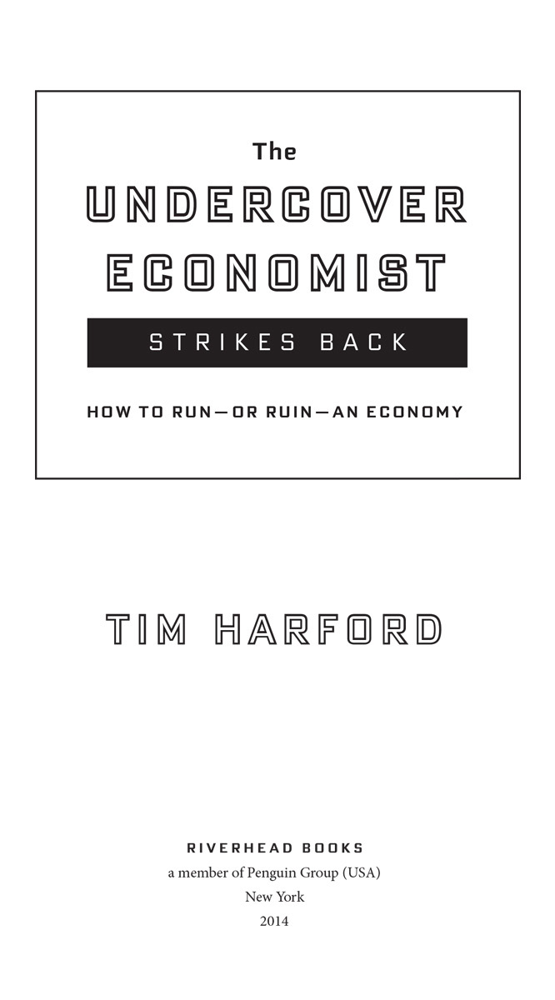

ALSO BY TIM HARFORD

*The Undercover Economist*

*The Logic of Life: The Rational Economics*

*of an Irrational World*

*Dear Undercover Economist*

*Adapt: Why Success Always Starts with Failure*

RIVERHEAD BOOKS

Published by the Penguin Group

Penguin Group (USA) LLC

375 Hudson Street

New York, New York 10014

USA • Canada • UK • Ireland • Australia • New Zealand • India • South Africa • China

[penguin.com](http://penguin.com)

A Penguin Random House Company

Copyright © 2013 by Tim Harford

First edition: Little, Brown Book Group 2013

First American edition: Riverhead Books 2014

Penguin supports copyright. Copyright fuels creativity, encourages diverse voices, promotes free speech, and creates a vibrant culture. Thank you for buying an authorized edition of this book and for complying with copyright laws by not reproducing, scanning, or distributing any part of it in any form without permission. You are supporting writers and allowing Penguin to continue to publish books for every reader.

ISBN 978-1-101-61388-7

While the author has made every effort to provide accurate telephone numbers, Internet addresses, and other contact information at the time of publication, neither the publisher nor the author assumes any responsibility for errors, or for changes that occur after publication. Further, the publisher does not have any control over and does not assume any responsibility for author or third-party websites or their content.

Version_1

To Herbie
