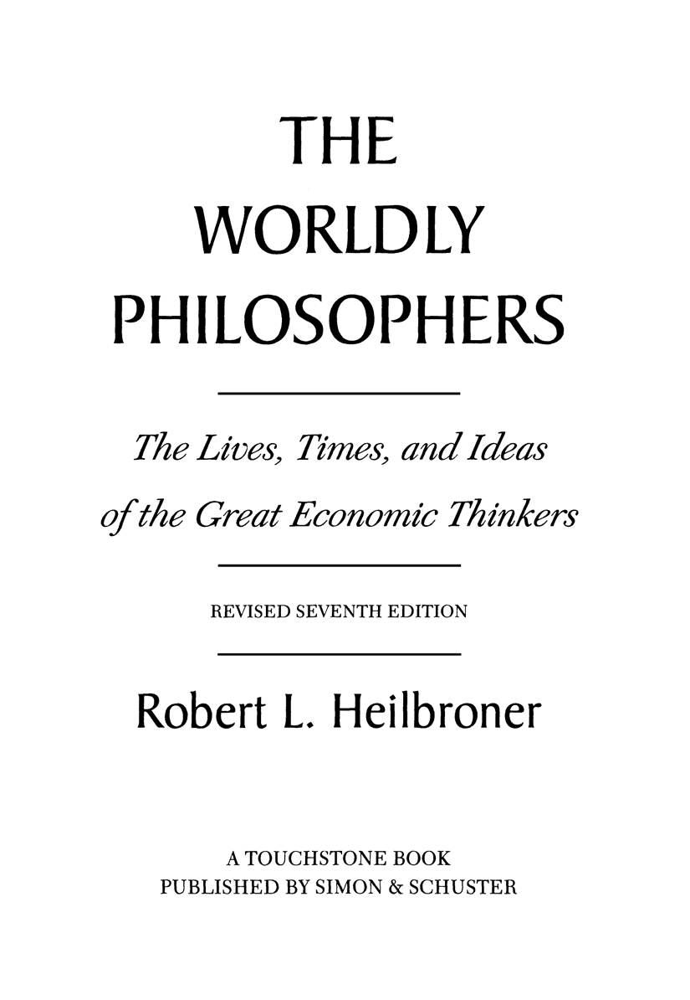
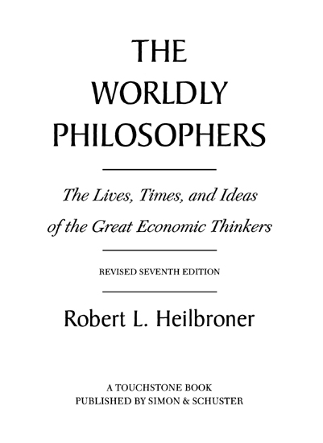
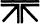

*By Robert L. Heilbroner*

THE WORLDLY PHILOSOPHERS

BEHIND THE VEIL OF ECONOMICS

THE ESSENTIAL ADAM SMITH

THE NATURE AND LOGIC OF CAPITALISM

THE FUTURE AS HISTORY

MARXISM, FOR AND AGAINST

AN INQUIRY INTO THE HUMAN PROSPECT

THE GREAT ASCENT

BETWEEN CAPITALISM AND SOCIALISM

THE LIMITS OF AMERICAN CAPITALISM

THE ECONOMIC PROBLEM  
(*with James Galbraith*)

ECONOMICS EXPLAINED  
(*with Lester C. Thurow*)

THE DEBT AND THE DEFICIT  
(*with Peter L. Bernstein*)

THE MAKING OF ECONOMIC SOCIETY  
(*with William Milberg*)

21ST CENTURY AMERICAN CAPITALISM

THE CRISIS OF VISION IN MODERN ECONOMIC THOUGHT  
(*with William Milberg*)

THE ECONOMIC TRANSFORMATION OF AMERICA  
(*with Aaron Singer*)

VISIONS OF THE FUTURE TEACHINGS FROM THE WORLDLY PHILOSOPHY

  
*TOUCHSTONE  
Rockefeller Center  
1230 Avenue of the Americas  
New York, NY 10020*  
<a href="http://www.SimonandSchuster.com" class="nounder">www.SimonandSchuster.com</a>

*Copyright* © 1953, *1961, 1967, 1972, 1980, 1992,  
1999 by Robert L. Heilbroner*

*Copyright renewed* © *1981, 1989, 1995 by Robert L. Heilbroner*

*All rights reserved,  
including the right of reproduction  
in whole or in part in any form*.

*Updated Seventh Edition*

*TOUCHSTONE and colophon are registered trademarks of Simon* & *Schuster Inc*.

*Manufactured in the United States of America*

*      19     20     18*

*Library of Congress Cataloging-in-Publication Data  
Heilbroner, Robert L.  
The worldly philosophers : the lives, times, and ideas of the  
great economic thinkers / Robert L. Heilbroner*.—*Rev. 7th ed.  
p.     cm.  
“A Touchstone book.”  
Includes bibliographical references and index.  
1. Economists*—*Biography. 2. Economics*—*History.  
I. Title.  
HB76.H4     1999  
330’.092’2—dc21*

*\[b\]                                                                            99-14050*  
                                                                                       *CIP*

*ISBN 0-684-86214-X*  
*eISBN 978-1-4391-4482-4*

*<big>**To my teachers**</big>*

## Preface to the Seventh Edition

This is the seventh revision of a book I wrote some forty-six years ago, making *The Worldly Philosophers* today a good deal older than I was when I wrote it. The altogether unforeseen life span of this venture, undertaken when I was still a graduate student, serves as an excuse briefly to tell its story, before saying a word with respect to important changes that have been made in this latest, and, I expect, last edition.

While pursuing my graduate studies in the early 1950s, I earned my living as a free-lance writer, ranging very far from economics when the need or the occasion presented itself. As a consequence of one or another such piece, Joseph Barnes, a senior editor at Simon & Schuster, asked me to lunch to explore various book ideas. None of them seemed quite right, and a pall fell as the salad arrived and I realized that my first publisher’s lunch was not likely to result in a book contract. Barnes, however, was not so easily discouraged. He began asking me about my graduate studies at the New School for Social Research and I found myself talking with enthusiasm about a particularly fascinating seminar on Adam Smith that I was taking under the inspired teaching of Adolph Lowe, of whom the reader will learn more later in this book. Before dessert had arrived we both knew that I had found my subject. After my next class I hastened to tell Professor Lowe of my determination to write a history of the evolution of economic thought.

The very exemplar of German scholarship at its formidable best, Lowe was aghast. “That you cannot do!” he declared with magisterial finality. But I had the strong conviction that I *could* do it—born, as I have written elsewhere, of the necessary combination of confidence and ignorance that only a graduate student could have possessed. Between free-lance assignments and further studies, I produced the first three chapters and with some trepidation showed them to Professor Lowe. It is a measure of that remarkable man (who remained, until his death at 102, my warmest and severest critic) that after he read the pages he said, “That you *must* do!” With his help, that is what I did.

The book written, it was necessary to find a title. I was aware that the word “economics” was death at the box office, and I racked my brains for a substitute. A second crucial lunch then took place with Frederick Lewis Allen, editor of *Harper’s* magazine, for whom I had done a number of pieces, and who had been extraordinarily kind and helpful to me. I told him about my title difficulties, and said that I was thinking of calling the book *The Money Philosophers*, although I knew “money” wasn’t quite right. “You mean ‘worldly,’” he said. I said, “I’ll buy lunch.”

My publishers were not as pleased with the title as I was, and after the book to everyone’s surprise began to sell, they suggested retitling it *The Great Economists*. Fortunately nothing came of this. Perhaps they anticipated that the public would not be able to master “worldly,” which has indeed been misspelled “wordly” on a thousand students’ papers, or perhaps they foresaw difficulties such as one about which I heard many years later. A student inquired at his college bookstore about a book whose author’s name he could not remember, but whose queer title was, to the best of his recollection, “A World Full of Lobsters.”

Over the years *The Worldly Philosophers* has sold more copies than I could have imagined possible, and has lured, I am told, tens of thousands of unsuspecting victims into a course on economics. I cannot answer for the pains that may have been experienced as a consequence, but I have had the pleasure of hearing from a number of economists that their interest was first aroused by the vision of economics conveyed by the book.

This edition differs from previous editions in two respects. The first is that, as before, a fresh look at its pages enables me to rectify the errors that inevitably creep into manuscripts or that are revealed by research after publication. It is a chance, as well, to alter emphases and interpretations that reflect my own evolving views. These changes are small, noticeable perhaps only to scholars in the field, and not of sufficient significance in themselves to warrant a new edition.

A second change is more important. For some time I had been considering whether there might not be an important thread missing from my book—a thread that would tie together its chapters more firmly than a mere chronology of remarkable men with interesting ideas. Then, a few years ago, I became convinced that precisely such a thread existed in the changing concepts—the “visions”—that lay behind all social analysis. That idea was broached in the 1950s by Josef Schumpeter, one of the most imaginative of the worldly philosophers. Insofar as Schumpeter himself did not apply his insight to the history of economic thought, I hope I may be forgiven for having missed it myself for so many years.

In this preface I do not want to discuss further this new view of the evolution of the worldly philosophy—that would be like announcing the plot of a mystery novel before the action had even begun. Hence, although the role of social vision will be mentioned many times as we go along, not until we reach our last chapter will we stop to consider its relevance for our own time.

That leads to a final remark. A reader who has already turned this page may have noted that that concluding chapter has a strange title: “The End of the Worldly Philosophy?” The question mark makes clear that this is not a pronouncement of doom, but it certainly implies a change in the character of our subject. As to what that change may be, we will have to wait until the very end of the book, not to tease the reader, but because only at the end—which is to say, today—does that change challenge the nature and significance of economic thought itself.

But all that remains to be demonstrated. Let me conclude this very personal salutation by thanking my readers, especially students and instructors, who have been thoughtful enough to send me notes of correction, disagreement, or approval, all equally welcomed, and to express my hope that *The Worldly Philosophers* will continue to open the vista of economics to readers who go on to become lobster fishermen or publishers, as well as to those braver souls who decide to become economists.

ROBERT L. HEILBRONER  
*New York, N.Y.  
July, 1998*

## Contents

|                                                    |                                                                                                            |
|----------------------------------------------------|------------------------------------------------------------------------------------------------------------|
| <a href="#chapter01.html" class="nounder">I</a>    | <a href="#chapter01.html" class="nounder">Introduction</a>                                                 |
| <a href="#chapter02.html" class="nounder">II</a>   | <a href="#chapter02.html" class="nounder">The Economic Revolution</a>                                      |
| <a href="#chapter03.html" class="nounder">III</a>  | <a href="#chapter03.html" class="nounder">The Wonderful World of Adam Smith</a>                            |
| <a href="#chapter04.html" class="nounder">IV</a>   | <a href="#chapter04.html" class="nounder">The Gloomy Presentiments of Parson Malthus and David Ricardo</a> |
| <a href="#chapter05.html" class="nounder">V</a>    | <a href="#chapter05.html" class="nounder">The Dreams of the Utopian Socialists</a>                         |
| <a href="#chapter06.html" class="nounder">VI</a>   | <a href="#chapter06.html" class="nounder">The Inexorable System of Karl Marx</a>                           |
| <a href="#chapter07.html" class="nounder">VII</a>  | <a href="#chapter07.html" class="nounder">The Victorian World and the Underworld of Economics</a>          |
| <a href="#chapter08.html" class="nounder">VIII</a> | <a href="#chapter08.html" class="nounder">The Savage Society of Thorstein Veblen</a>                       |
| <a href="#chapter09.html" class="nounder">IX</a>   | <a href="#chapter09.html" class="nounder">The Heresies of John Maynard Keynes</a>                          |
| <a href="#chapter10.html" class="nounder">X</a>    | <a href="#chapter10.html" class="nounder">The Contradictions of Joseph Schumpeter</a>                      |
| <a href="#chapter11.html" class="nounder">XI</a>   | <a href="#chapter11.html" class="nounder">The End of the Worldly Philosophy?</a>                           |
|                                                    |                                                                                                            |
|                                                    | <a href="#further.html" class="nounder">A Guide to Further Reading</a>                                     |
|                                                    | <a href="#notes.html" class="nounder">Notes</a>                                                            |
|                                                    | <a href="#index.html" class="nounder">Index</a>                     |

## i

## Introduction

This is a book about a handful of men with a curious claim to fame. By all the rules of schoolboy history books, they were nonentities: they commanded no armies, sent no men to their deaths, ruled no empires, took little part in history-making decisions. A few of them achieved renown, but none was ever a national hero; a few were roundly abused, but none was ever quite a national villain. Yet what they did was more decisive for history than many acts of statesmen who basked in brighter glory, often more profoundly disturbing than the shuttling of armies back and forth across frontiers, more powerful for good and bad than the edicts of kings and legislatures. It was this: they shaped and swayed men’s minds.

And because he who enlists a man’s mind wields a power even greater than the sword or the scepter, these men shaped and swayed the world. Few of them ever lifted a finger in action; they worked, in the main, as scholars—quietly, inconspicuously, and without much regard for what the world had to say about them. But they left in their train shattered empires and exploded continents; they buttressed and undermined political regimes; they set class against class and even nation against nation—not because they plotted mischief, but because of the extraordinary power of their ideas.

Who were these men? We know them as the Great Economists. But what is strange is how little we know about them. One would think that in a world torn by economic problems, a world that constantly worries about economic affairs and talks of economic issues, the great economists would be as familiar as the great philosophers or statesmen. Instead they are only shadowy figures of the past, and the matters they so passionately debated are regarded with a kind of distant awe. Economics, it is said, is undeniably important, but it is cold and difficult, and best left to those who are at home in abstruse realms of thought.

Nothing could be further from the truth. A man who thinks that economics is only a matter for professors forgets that this is the science that has sent men to the barricades. A man who has looked into an economics textbook and concluded that economics is boring is like a man who has read a primer on logistics and decided that the study of warfare must be dull.

No, the great economists pursued an inquiry as exciting—and as dangerous—as any the world has ever known. The ideas they dealt with, unlike the ideas of the great philosophers, did not make little difference to our daily working lives; the experiments they urged could not, like the scientists’, be carried out in the isolation of a laboratory. The notions of the great economists were world-shaking, and their mistakes nothing short of calamitous.

“The ideas of economists and political philosophers,” wrote Lord Keynes, himself a great economist, “both when they are right and when they are wrong, are more powerful than is commonly understood. Indeed the world is ruled by little else. Practical men, who believe themselves to be quite exempt from any intellectual influences, are usually the slaves of some defunct economist. Madmen in authority, who hear voices in the air, are distilling their frenzy from some academic scribbler of a few years back. I am sure that the power of vested interests is vastly exaggerated compared with the gradual encroachment of ideas.”

To be sure, not all the economists were such titans. Thousands of them wrote texts; some of them monuments of dullness, and explored minutiae with all the zeal of medieval scholars. If economics today has little glamour, if its sense of great adventure is often lacking, it has no one to blame but its own practitioners. For the great economists were no mere intellectual fusspots. They took the whole world as their subject and portrayed that world in a dozen bold attitudes—angry, desperate, hopeful. The evolution of their heretical opinions into common sense, and their exposure of common sense as superstition, constitute nothing less than the gradual construction of the intellectual architecture of much of contemporary life.

An odder group of men—one less apparently destined to remake the world—could scarcely be imagined.

There were among them a philosopher and a madman, a cleric and a stockbroker, a revolutionary and a nobleman, an aesthete, a skeptic, and a tramp. They were of every nationality, of every walk of life, of every turn of temperament. Some were brilliant, some were bores; some ingratiating, some impossible. At least three made their own fortunes, but as many could never master the elementary economics of their personal finances. Two were eminent businessmen, one was never much more than a traveling salesman, another frittered away his fortune.

Their viewpoints toward the world were as varied as their fortunes—there was never such a quarrelsome group of thinkers. One was a lifelong advocate of women’s rights; another insisted that women were demonstrably inferior to men. One held that “gentlemen” were only barbarians in disguise, whereas another maintained that nongentlemen were savages. One of them—who was very rich—urged the abolition of riches; another—quite poor—disapproved of charity. Several of them claimed that with all its shortcomings, this was the best of all possible worlds; several others devoted their lives to proving that it wasn’t.

All of them wrote books, but a more varied library has never been seen. One or two wrote best-sellers that reached to the mud huts of Asia; others had to pay to have their obscure works published and never touched an audience beyond the most restricted circles. A few wrote in language that stirred the pulse of millions; others—no less important to the world—wrote in a prose that fogs the brain.

Thus it was neither their personalities, their careers, their biases, nor even their ideas that bound them together. Their common denominator was something else: a common curiosity. They were all fascinated by the world about them, by its complexity and its seeming disorder, by the cruelty that it so often masked in sanctimony and the success of which it was equally often unaware. They were all of them absorbed in the behavior of their fellow man, first as he created material wealth, and then as he trod on the toes of his neighbor to gain a share of it.

Hence they can be called worldly philosophers, for they sought to embrace in a scheme of philosophy the most worldly of all of man’s activities—his drive for wealth. It is not, perhaps, the most elegant kind of philosophy, but there is no more intriguing or more important one. Who would think to look for Order and Design in a pauper family and a speculator breathlessly awaiting ruin, or seek Consistent Laws and Principles in a mob marching in a street and a greengrocer smiling at his customers? Yet it was the faith of the great economists that just such seemingly unrelated threads could be woven into a single tapestry, that at a sufficient distance the milling world could be seen as an orderly progression, and the tumult resolved into a chord.

A large order of faith, indeed! And yet, astonishingly enough, it turned out to be justified. Once the economists had unfolded their patterns before the eyes of their generations, the pauper and the speculator, the greengrocer and the mob were no longer incongruous actors inexplicably thrown together on a stage; but each was understood to play a role, happy or otherwise, that was essential for the advancement of the human drama itself. When the economists were done, what had been only a humdrum or a chaotic world, became an ordered society with a meaningful life history of its own.

It is this search for the order and meaning of social history that lies at the heart of economics. Hence it is the central theme of this book. We are embarked not on a lecture tour of principles, but on a journey through history-shaping ideas. We will meet not only pedagogues on our way, but many paupers, many speculators, both ruined and triumphant, many mobs, even here and there a grocer. We shall be going back to rediscover the roots of our own society in the welter of social patterns that the great economists discerned, and in so doing we shall come to know the great economists themselves—not merely because their personalities were often colorful, but because their ideas bore the stamp of their originators.

It would be convenient if we could begin straight off with the first of the great economists—Adam Smith himself. But Adam Smith lived at the time of the American Revolution, and we must account for the perplexing fact that six thousand years of recorded history had rolled by and no *worldly* philosopher had yet come to dominate the scene. An odd fact: Man had struggled with the economic problem since long before the time of the Pharaohs, and in these centuries he had produced philosophers by the score, scientists, political thinkers, historians, artists by the gross, statesmen by the hundred dozen. Why, then, were there no economists?

It will take us a chapter to find out. Until we have probed the nature of an earlier and far longer-lasting world than our own—a world in which an economist would have been not only unnecessary, but impossible—we cannot set the stage on which the great economists may take their places. Our main concern will be with the handful of men who lived in the last three centuries. First, however, we must understand the world that preceded their entrance and we must watch that earlier world give birth to the modern age—the age of the economists—amid all the upheaval and agony of a major revolution.

## ii

