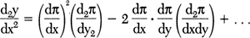
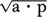

## vii

## The Victorian World and the Underworld of Economics

Karl Marx pronounced his sentence of doom on capitalism in the *Manifesto* of 1848; the system was diagnosed as the victim of an incurable disease, and although no timetable was given, it was presumed to be close enough to its final death struggle for the next of kin—the Communists—to listen avidly for the last gasp that would signal their inheritance of power. Even before the appearance of *Capital* in 1867, the deathwatch had begun, and with each bout of speculative fever or each siege of industrial depression, the hopeful drew nearer to the deathbed and told each other that the moment of Final Revolution would now be soon at hand.

But the system did not die. True, many of the Marxist laws of motion were verified by the march of events: big business did grow bigger and recurrent depressions and unemployment did plague society. But along with these confirmations of the prognosis of doom, another highly important and portentously phrased Marxist symptom was remarkable by its absence: the “increasing misery” of the proletariat failed to increase.

Actually, there has been a long debate among Marxists as to what Marx meant by that phrase. If he meant only that more and more of the working class would experience the “misery” of becoming proletarians—wage workers—he was right, as we have seen. But if he meant that their physical misery would worsen, he was wrong.

Indeed, a Royal Commission convened to look into the slump of 1886 expressed particular satisfaction with the condition of the working classes. And this was not just the patronizing cant of class apologists. Conditions *were* better—perceptibly and significantly better. Looking back on the situation from the 1880s, Sir Robert Giffen wrote: “What we have to consider is that fifty years ago, the working man with wages on the average about half, or not much more than half what they are now, had at times to contend with a fluctuation in the price of bread which implied sheer starvation. Periodic starvation was, in fact, the condition of the masses of working men throughout the kingdom fifty years ago.” But by the time Giffen wrote, although prices had risen, wages had risen faster. *For the first time*, the English working-man was making enough to keep body and soul together—a sorry commentary on the past, but a hopeful augury for the future.

And not only had wages gone up, but the very source of surplus value had diminished: hours were far shorter. At the Jarrow Shipyards and the New Castle Chemical Works, for example, the work week had fallen from sixty-one to fifty-four hours, while even in the sweated textile mills, the stint was reduced to only fifty-seven hours. Indeed the mill owners complained that their wage costs had risen by better than 20 percent. But while progress was expensive, it paid intangible dividends. For as conditions ameliorated, the mutterings of 1848 died down. “You cannot get them to talk of politics so long as they are well employed,” testified a Staffordshire manufacturer on the attitude of his working force.

Even Marx and Engels had to recognize the trend. “The English proletariat is actually becoming more and more bourgeois,” mourned Engels in a letter to Marx, “so that the ultimate aim of this most bourgeois of all nations would appear to be the possession, *alongside* the bourgeois, of a bourgeois aristocracy and a bourgeois proletariat.”

Clearly, Marx was premature in his expectation of impending doom. For the faithful, of course, the disconcerting turn of events could be swallowed in the comforting knowledge that “inevitable” still meant inevitable, and that a matter of a generation or two came to little in the grand march of history. But for the non-Marxist surveyors of the scene, the great Victorian boom meant something else. The world more and more appeared full of hope and promise, and the forebodings of a dissenter like Karl Marx seemed merely the ravings of a discontented radical. Hence the intellectual bombshell that Marx had prepared went off in almost total silence; instead of a storm of abuse, Marx met the far more crushing ignominy of indifference.

For economics had ceased to be the proliferation of world views that, in the hands of now a philosopher, now a financial trader, now a revolutionary, seemed to illuminate the whole avenue down which society was marching. It became instead the special province of professors, whose investigations threw out pinpoint beams rather than the wide-searching beacons of the earlier economists.

There was a reason for this: as we have seen, Victorian England had caught the steady trade winds of late-nineteenth-century progress and optimism. Improvement was in the air, and so quite naturally there seemed less cause to ask disturbing questions about the nature of the voyage. Hence the Victorian boom gave rise to a roster of elucidators, men who would examine the workings of the system in great detail, but not men who would express doubt as to its basic merits or make troublesome prognostications as to its eventual fate. A new professordom took over the main life of economic thought. Its contributions were often important, yet not vital. For in the minds of men like Alfred Marshall, Stanley Jevons, John Bates Clark, and the proliferating faculties that surrounded them, there were no wolves in the economic world anymore, and therefore no life-and-death activities for economic theory to elucidate. The world was peopled entirely with agreeable, if imaginary, sheep.

The sheep were never more clearly delineated than in a little volume entitled *Mathematical Psychics*, which appeared in 1881, just two years before Marx died. It was not written by the greatest of academicians, but perhaps by the most revealing of them—a strange, shy professor named Francis Ysidro Edgeworth, a nephew of that Maria Edge-worth who had once played charades with Ricardo.

Edgeworth was undoubtedly a brilliant scholar. In his final examinations at Oxford, when he was asked a particularly abstruse question, he inquired of his examiners, “Shall I answer briefly, or at length?” and then proceeded to hold forth for half an hour, punctuating his reply with excursions into Greek while his examiners gaped.

But Edgeworth was not fascinated with economics because it justified or explained or condemned the world, or because it opened new vistas, bright or gloomy, into the future. This odd soul was fascinated because economics dealt with *quantities* and because anything that dealt with quantities could be translated into *mathematics!* The process of translation required the abandonment of that tension-fraught world of the earlier economists, but it yielded in return a world of such neat precision and lovely exactness that the loss seemed amply compensated.

To build up such a mathematical mirror of reality, the world obviously had to be simplified. Edgeworth’s simplification was this assumption: *every man is a pleasure machine*. Jeremy Bentham had originated the conception in the early nineteenth century under the beguiling title of the Felicific Calculus, a philosophical view of humanity as so many living profit-and-loss calculators, each busily arranging his life to maximize the pleasure of his psychic adding machine. To this general philosophy Edgeworth now added the precision of mathematics to produce a kind of Panglossian Best of All Possible Worlds.

Of all men to have adopted such a view of society, Edge-worth seems a most unlikely choice. He himself was as ill-constructed a pleasure machine as can be imagined. Neurotically shy, he tended to flee from the pleasures of human company to the privacy of his club; unhappy about the burden of material things, he received few of the pleasures that for most people flow from possessions. His rooms were bare, his library was the public one, and his stock of material wealth did not include crockery, or stationery, or even stamps. Perhaps his greatest source of pleasure was in the construction of his lovely imaginary economic Xanadu.

But regardless of his motives, Edgeworth’s pleasure-machine assumption bore wonderful intellectual fruit. For if economics was defined to be the study of human pleasure-mechanisms competing for shares of society’s stock of pleasure, then it could be shown—with all the irrefutability of the differential calculus—that in a world of perfect competition each pleasure machine would achieve the highest amount of pleasure that could be meted out by society.

In other words, if this was not yet *quite* the best of all possible worlds, it could be. Unfortunately, the world was not organized as a game of perfect competition; men did have the lamentable habit of sticking together in foolish disregard of the beneficent consequences of stubbornly following their self-interest; trade unions, for example, were in direct controversion to the principle of each for himself, and the undeniable fact of inequalities of wealth and position did make the starting position of the game something less than absolutely neutral.

But never mind, said Edgeworth. Nature has taken care of that too. While trade unions might gain in the short run through combination, it could be shown that in the long run they must lose—they were only a transient imperfection in the ideal scheme of things. And if high birth and great wealth seemed at first to prejudice the outcome of the economic game, that could be reconciled with mathematical psychics, too. For while all individuals were pleasure machines, some were *better* pleasure machines than others. Men, for example, were better equipped to run up their psychic bank accounts than women, and the delicate sensibilities of the “aristocracy of skill and talent” were more responsive to the pleasures of good living than the clodlike pleasure machines of the laboring classes. Hence, the calculus of human mathematics could still function advantageously; indeed it positively justified those divisions of sex and status which one saw about him in the living world.

But mathematical psychics did more than rationalize the tenets of conservatism. Edgeworth actually believed that his algebraic insight into human activity might yield helpful results in the world of flesh and blood. His analysis involved such terms as these:

“Considerations so abstract,” wrote Edgeworth, “it would of course be ridiculous to fling upon the floodtide of practical politics. But they are not perhaps out of place when we remount to the little rills of sentiment and secret springs of motive where every course of action must be originated.”

“The little rills of sentiment,” indeed! What would Adam Smith have thought of this conversion of his pushy merchants, his greedy journeymen, and his multiplying laboring classes into so many categories of delicate pleasure-seekers? In fact, Henry Sidgwick, a contemporary of Edgeworth’s and a disciple of J. S. Mill, angrily announced that he ate his dinner not because he had toted up the satisfactions to be gained therefrom, but because he was hungry. But there was no use protesting: the scheme of mathematical psychics was so neat, so beguiling, so bereft of troublesome human intransigences, and so happily unbesmirched with considerations of human striving and social conflict, that its success was immediate.

Edgeworth’s was not the only such attempt to dehumanize political economy. Even during Marx’s lifetime a whole mathematical school of economics had grown up. In Germany an economist named von Thünen came up with a formula that yielded, he claimed, the precise just wage of labor:

Von Thünen liked it well enough to have it engraved on his tombstone; we do not know what the workingmen thought of it. In France a distinguished economist named Leon Walras proved that one could deduce by mathematics the exact prices that would just exactly clear the market; of course, in order to do this, one had to have the equation for every single economic good on the market and then the ability to solve a problem in which the number of equations would run into the hundreds of thousands—indeed, into the millions. But never mind the difficulties; theoretically the problem could be done. At the University of Manchester, a professor named W. Stanley Jevons wrote a treatise on political economy in which the struggle for existence was reduced to “a Calculus of Pleasure and Pain.” “My theory of Economics ... is purely mathematical in character,” wrote Jevons, and he turned out of his focus every aspect of economic life which was not reducible to the jigsaw precision of his scheme. Perhaps even more noteworthy, he planned to write (although he did not live to do so) a book called *Principles of Economics:* it is significant that political economy was now called economics, and its expositions were becoming texts.

It was not all foolishness, although too much of it was. Economics, after all, does concern the actions of aggregates of people, and human aggregates, like aggregates of atoms, do tend to display statistical regularities and laws of probability. Thus, as the professoriat turned its eyes to the exploration of the idea of *equilibrium*—the state toward which the market would tend as the result of the random collisions of individuals all seeking to maximize their utilities—it did in fact elucidate some tendencies of the social universe. The equations of Leon Walras are still used to depict the attributes of a social system at rest.

The question is, does a system “at rest” actually depict the realities—the fundamental realities—of the social universe? The earlier economists, from Smith through Mill and of course Marx, had a compelling image in their minds of a society that was by its nature *expansive*. True, its expansion might encounter barriers, or might run out of steam, or might develop into economic downturns, but the central force of the economic world was nonetheless inseparable from a political and psychological tendency toward growth.

It was this basic conception that was lacking in the new concentration on equilibrium as the most interesting, most revealing aspect of the system. Suddenly capitalism was no longer seen as an historic social vehicle under constant tension but as a static, rather historyless, mode of organization. The driving propulsion of the system—the propulsion that had fascinated all its prior investigators—was now overlooked, ignored, forgotten. Whatever aspects of a capitalist economy were illumined in the new perspective, its historic mission was not.

And so, as a counterpart to this pale world of equations, an underworld of economics flourished. There had always been such an underworld, a strange limbo of cranks and heretics, whose doctrines had failed to attain the stature of respectability. One such was the irrepressible Bernard Mandeville, who shocked the eighteenth century with a witty demonstration that virtue was vice and vice virtue. Mandeville merely pointed out that the profligate expenditure of the sinful rich gave work to the poor, while the stingy rectitude of the virtuous penny pincher did not; hence, said Mandeville, private immorality may redound to the public welfare, whereas private uprightness may be a social burden. The sophisticated lesson of his *Fable of the Bees* was too much for the eighteenth century to swallow; Mandeville’s book was convicted as a public nuisance by a grand jury in Middlesex in 1723, and Mandeville himself was roundly castigated by Adam Smith and everyone else.

But whereas the earlier eccentrics and charlatans were largely banished by the opinions of sturdy thinkers like Smith or Ricardo, now the underworld claimed its recruits for a different reason. There was simply no longer any room in the official world of economics for those who wanted to take the whole gamut of human behavior for their forum, and there was little tolerance in the stuffy world of Victorian correctness for those whose diagnosis of society left room for moral doubtings or seemed to indicate the need for radical reform.

And so the underworld took on new life. Marx went there because his doctrine was unpleasant. Malthus went there because his idea of “general gluts” was an arithmetical absurdity and because his doubts about the benefits of saving were totally at variance with the Victorian admiration for thrift. The Utopians went there because what they were talking about was arrant nonsense and wasn’t “economics” anyway, and finally anyone went there whose doctrines failed to accord with the elegant world that the academicians erected in their classrooms and fondly believed existed outside them.

It was a far more interesting place, this underworld, than the serene realms above. It abounded with wonderful personalities, and in it sprouted a weird and luxuriant tangle of ideas. There was, for example, a man who has been almost forgotten in the march of economic ideas. He is Frederic Bastiat, an eccentric Frenchman, who lived from 1801 to 1850, and who in that short space of time and an even shorter space of literary life—six years—brought to bear on economics that most devastating of all weapons: ridicule. Look at this madhouse of a world, says Bastiat. It goes to enormous efforts to tunnel underneath a mountain in order to connect two countries. And then what does it do? Having labored mightily to facilitate the interchange of goods, it sets up customs guards on both sides of the mountain and makes it as difficult as possible for merchandise to travel through the tunnel!

Bastiat had a gift for pointing out absurdities; his little book *Economic Sophisms* is as close to humor as economics has ever come. When, for example, the Paris-Madrid railroad was being debated in the French Assembly, one M. Simiot argued that it should have a gap at Bordeaux, because a break in the line there would redound greatly to the wealth of the Bordeaux porters, commissionaires, hotelkeepers, bargemen, and the like, and thus, by enriching Bordeaux, would enrich France. Bastiat seized on the idea with avidity. Fine, he said, but let’s not stop at Bordeaux alone. “If Bordeaux has a right to profit by a gap ... than Angoulême, Poitiers, Tours, Orléans ... should also demand gaps as being for the general interest.... In this way we shall succeed in having a railway composed of successive gaps, and which may be denominated a *Negative Railway.”*

Bastiat was a wit in the world of economics, but his private life was tragic. Born in Bayonne, he was orphaned at an early age and, worse yet, contracted tuberculosis. He studied at a university, and then tried business, but he had no head for commercial details. He turned to agriculture, but he fared equally badly there; like Tolstoi’s well-meaning count, the more he interfered in the running of his family estate, the worse it did. He dreamed of heroism, but his military adventures had a Don Quixote twist: when the Bourbons were run out of France in 1830, Bastiat rounded up six hundred young men and led them to storm a royalist citadel, regardless of cost. Poor Bastiat—the fortress meekly hauled down its flag and invited everyone in for a feast instead.

It seemed that he was doomed to disappointment. But his enforced idleness turned his interests to economics, and he began to read and discuss the topics of the day. A neighboring country gentleman urged him to put his ideas on paper, and Bastiat wrote an article on free trade and sent it in to a Parisian journal. His thoughts were original and his style wonderfully sharp. The article was printed, and overnight this mild scholar of the provinces was famous.

He came to Paris. “He had not had time to call in the assistance of a Parisian hatter and tailor,” writes M. de Molinari, “and with his long hair, his tiny hat, his ample frockcoat and his family umbrella, you would have been apt to mistake him for an honest peasant who came to town for the first time to see the metropolis.”

But the country scholar had a pen that bit. Every day he read the Paris papers in which the deputies and ministers of France argued for and defended their policies of selfishness and blind self-interest; then he would answer with a rejoinder that rocked Paris with laughter. For example, when the Chamber of Deputies in the 1840s legislated higher duties on all foreign goods in order to benefit French industry, Bastiat turned out this masterpiece of economic satire:

PETITION OF THE MANUFACTURERS OF CANDLES, WAXLIGHTS, LAMPS, CANDLESTICKS, STREET LAMPS, SNUFFERS, EXTINGUISHERS, AND OF THE PRODUCERS OF OIL, TALLOW, RESIN, ALCOHOL, AND GENERALLY EVERYTHING CONNECTED WITH LIGHTING

TO MESSIEURS THE MEMBERS OF THE CHAMBER OF DEPUTIES

GENTLEMEN,

... We are suffering from the intolerable competition of a foreign rival, placed, it would seem, in a condition so far superior to our own for the production of light, that he absolutely *inundates* our *national market* with it at a price fabulously reduced.... This rival ... is no other than the sun.

What we pray for, is, that it may please you to pass a law ordering the shutting up of all windows, skylights, dormer-windows, outside and inside shutters, curtains, blinds, bull’s-eyes; in a word of all openings, holes, chinks, and fissures.

... If you shut up as much as possible all access to natural light and create a demand for artificial light, which of our French manufacturers will not benefit by it?

... If more tallow is consumed, then there must be more oxen and sheep ... if more oil is consumed, then we shall have extended cultivation of the poppy, of the olive ... our heaths will be covered with resinous trees.

Make your choice, but be logical; for as long as you exclude, as you do, iron, corn, foreign fabrics, *in proportion* as their prices approximate to zero, what inconsistency it would be to admit the light of the sun, the price of which is already at *zero* during the entire day!

A more dramatic—if fantastic—defense of free trade has never been written. But it was not only against protective tariffs that Bastiat protested: this man laughed at every form of economic double-thinking. In 1848, when the Socialists began to propound their ideas for the salvation of society with more regard for passion than practicability, Bastiat turned against them the same weapons that he had used against the *ancien régime*. “Everyone wants to live at the expense of the state,” he wrote. “They forget that the state lives at the expense of everyone.”

But his special target, his most hated “sophism,” was the rationalization of private greed under the pretentious cover of a protective tariff erected for the “national good.” How he loved to demolish the specious thinking that argued for barriers to trade under the guise of liberal economics! When the French ministry proposed to raise the duty on imported cloth to “protect” the French workingman, Bastiat replied with this delicious paradox:

“Pass a law to this effect,” wrote Bastiat to the Minister of Commerce. “No one shall henceforth be permitted to employ any beams or rafters but such as are produced and fashioned by blunt hatchets.... Whereas at present we give a hundred blows of the axe, we shall then give three hundred. The work which we now do in an hour will then require three hours. What a powerful encouragement will thus be given to labor! ... Whoever shall henceforth desire to have a roof to cover him must comply with our exactions, just as at present whoever desires clothes to his back must comply with yours.”

His criticisms, for all their penetrating mockery, met with little practical success. He went to England to meet the leaders of the free-trade movement there and returned to organize a free-trade association in Paris. It lasted only eighteen months—Bastiat was never any good as an organizer.

But 1848 was now at hand and Bastiat was elected to the National Assembly. By then the danger seemed to him the other extreme—that men would pay too much attention to the imperfections of the system and would blindly choose socialism in its stead. He began a book entitled *Economic Harmonies* in which he was to show that the apparent disorder of the world was a disorder of the surface only; that underneath, the impetus of a thousand different self-seeking agents became transmuted in the marketplace into a higher social good. But his health was now disastrously bad. He could barely breathe, and his face was livid with the ravages of his disease. He moved to Pisa, where he read in the papers of his own death and of the commonplace expressions of regret which accompanied it: regret at the passing of “the great economist,” the “illustrious author.” He wrote a friend: “Thank God I am not dead. I assure you I should breathe my last without pain and almost with joy if I were certain of leaving to the friends who love me, not poignant regrets, but a gentle, affectionate, somewhat melancholy remembrance of me.” He struggled to finish his book before he himself should be finished. But it was too late. In 1850 he passed away, whispering at the end something that the listening priest thought was “Truth, truth ....”

He is a very small figure in the economic constellation. He was enormously conservative but not influential, even among conservatives. His function, it seems, was to prick the pomposities of his time; but beneath the raillery and the wit lies the more disturbing question: does the system always make sense? Are there paradoxes where the public and private weals collide? Can we trust the automatic mechanism of private interest when it is perverted at every turn by the far from automatic mechanism of the political structure it erects?

The questions were never squarely faced in the Elysian fields above. The official world of economics took little notice of the paradoxes proposed by its jester. Instead it sailed serenely on toward the development of the quantitative niceties of a pleasure-seeking world, and the questions raised by Bastiat remained unanswered. Certainly mathematical psychics was hardly the tool with which to unlock the dilemma of the Negative Railway and the Blunt Hatchet; Stanley Jevons, who with Edgeworth was the great proponent of making economics a “science,” admitted, “About politics, I confess myself in a fog.” Unfortunately, he was not alone.

And so the underworld continued to prosper. In 1879 it gained an American recruit, a bearded, gentle, fiercely self-sure man, who said that “Political Economy... as currently taught *is* hopeless and despairing. But this \[is\] because she has been degraded and shackled; her truths dislocated; her harmonies ignored; the word she would utter gagged in her mouth, and her protest against wrong turned into an indorsement of injustice.” And that was not all. For this heretic maintained not only that economics had failed to see the answer to the riddle of poverty although it was clearly laid out before her eyes, but that with his remedy, a whole new world stood ready to unfold: “Words fail the thought! It is the Golden Age of which poets have sung and high-raised seers have told in metaphor! ... It is the culmination of Christianity—the city of God with its walls of jasper and its gates of pearl!”

The newcomer was Henry George. No wonder he was in the underworld, for his early career must certainly have seemed an uncouth preparation for serious thinking to the cloistered keepers of the true doctrine. Henry George had been everything in life: adventurer, gold prospector, worker, sailor, compositor, journalist, government bureaucrat, and lecturer. He had never even gone to college; at thirteen he had left school to ship out as foremast boy on the 586-ton *Hindoo* bound for Australia and Calcutta. At a time when his contemporaries were learning Latin, he had bought a pet monkey and watched a man fall from the rigging, and become a thin, intense, independent boy with a wanderlust. Back from the East, he tried a job in a printing firm in his hometown of Philadelphia, and then at nineteen, shipped out again, this time to California, with the thought of gold in mind.

Before he left, he rated himself on a phrenological chart:

Amativeness. . . . . . . . . . . . . . . . . . . . . . . . . . . . . . . large

Philoprogenitiveness. . . . . . . . . . . . . . . . . . . . . .moderate

Adhesiveness. . . . . . . . . . . . . . . . . . . . . . . . . . . . . . .large

Inhabitiveness. . . . . . . . . . . . . . . . . . . . . . . . . . . . . . large

Concentrativeness. . . . . . . . . . . . . . . . . . . . . . . . . . .small

and so on, with a rating of “full” on Alimentativeness, “small” on Acquisitiveness, “large” on Self-esteem, and “small” on Mirthfulness. It was not a bad estimate in some respects—although it is odd to see Caution rated “large,” for when George reached San Francisco in 1858 he skipped ashore, although he had signed on for a year, and headed for Victoria and gold. He found gold—but it was fool’s gold, and he decided the life at sea was the life for him after all. Instead—his bump of Concentrativeness being small—he became a typesetter in a San Francisco shop, then a weigher in a rice mill, then, in his own words, “a tramp.” Another trek to the gold fields was equally unrewarding, and he returned to San Francisco impoverished.

He met Annie Fox, and eloped with her; she was a seventeen-year-old innocent and he a handsome young lad with a Bill Cody mustache and pointed beard. The trusting young Miss Fox took with her a bulky package on her secret marriage flight; the young adventurer thought it might be jewels, but it turned out to be only the *Household Book of Poetry* and other volumes.

There followed years of the most wretched poverty. Henry George was an odd-job printer, and work was hard to come by and ill paid at best. When Annie had her second child, George wrote: “I walked along the street and made up my mind to get money from the first man whose appearance might indicate he had it to give. I stopped a man—a stranger—and told him I wanted \$5. He asked me what I wanted it for. I told him my wife was confined and that I had nothing to give her to eat. He gave me the money. If he had not, I think I was desperate enough to have killed him.”

Now—at age twenty-six—he began to write. He landed a job in the composing room of the San Francisco *Times* and sent a piece upstairs to Noah Brooks, the editor. Brooks suspected that the boy had copied it, but when nothing resembling it appeared in any of the other newspapers for several days he printed it, and then went downstairs to look for George. He found him, a slight young man, rather undersized, standing on a board to raise himself to the height of his type case. George became a reporter.

Within a few years he left the *Times* to join the San Francisco *Post*, a crusading journal. George began to write about matters of more than routine interest: about the Chinese coolies and their indenture, and about the land grabbing of the railroads and the machinations of the local trusts. He wrote a long letter to J. S. Mill in France on the immigration question and was graced with a long affirmative reply. And in between his newly found political interests he had time for ventures in the best journalistic tradition: when the ship *Sunrise* came to town with a hushed-up story about a captain and mate who had hounded their crew until two men had leaped overboard to their death, George and the *Post* ferreted out the story and brought the officers to justice.

The newspaper was sold, and Henry George wangled himself a political sinecure—Inspector of Gas Meters. It was not that he wanted a life of leisure; rather, he had begun to read the great economists and his central interest was now clearly formed—already he was a kind of local authority. He needed time to study and to write and to deliver lectures to the working classes on the ideas of the great Mill.

When the University of California established a chair of political economy, he was widely considered as a strong candidate for the post. But to qualify he had to deliver a lecture before faculty and students, and George was rash enough to voice such sentiments as this: “The name of political economy has been constantly invoked against every effort of the working classes to increase their wages,” and then to compound the shock he added: “For the study of political economy, you need no special knowledge, no extensive library, no costly laboratory. You do not even need textbooks nor teachers, if you will but think for yourselves.”

That was the beginning and the end of his academic career. A more suitable candidate was found for the post, and George went back to pamphleteering and study. And then suddenly, “in daylight and in a city street, there came to me a thought, a vision, a call—give it what name you please.... It was that that impelled me to write *Progress and Poverty*, and that sustained me when else I should have failed. And when I had finished the last page, in the dead of night, when I was entirely alone, I flung myself on my knees and wept like a child.”

As might be expected, it was a book written from the heart, a cry of mingled protest and hope. And as might also be expected, it suffered from too much passion and too little professional circumspection. But what a contrast to the dull texts of the day—no wonder the guardians of economics could not seriously consider an argument that was couched in such a style as this:

Take now ... some hard-headed business man, who has no theories, but knows how to make money. Say to him: “Here is a little village; in ten years it will be a great city—in ten years the railroad will have taken the place of the stage coach, the electric light of the candle; it will abound with all the machinery and improvements that so enormously multiply the effective power of labor. Will, in ten years, interest be any higher?”

He will tell you, “No!”

“Will the wages of common labor be any higher ... ?”

He will tell you, “No, the wages of common labor will not be any higher....”

“What, then, will be higher?”

“Rent, the value of land. Go, get yourself a piece of ground, and hold possession.”

And if, under such circumstances, you take his advice, you need do nothing more. You may sit down and smoke your pipe; you may lie around like the *lazzaroni* of Naples or the *leperos* of Mexico; you may go up in a balloon or down a hole in the ground; and without doing one stroke of work, without adding one iota of wealth to the community, in ten years you will be rich! In the new city you may have a luxurious mansion, but among its public buildings will be an almshouse.

We need not spell out the whole emotionally charged argument; the crux of it lies in this passage. Henry George is outraged at the spectacle of men whose incomes—sometimes fabulous incomes—derive not from the services they have rendered the community, but merely from the fact that they have had the good fortune to hold advantageously situated soil.

Ricardo, of course, saw all this long before him. But at best, Ricardo had only claimed that the tendency of a growing society to enrich the holders of its land would redound to the misfortune of the capitalist. To Henry George, this was only the entering wedge. The injustice of rents not only robbed the capitalist of his honest profit but weighed on the shoulders of the workingman as well. More damaging yet, he found it to be the cause of those industrial “paroxysms,” as he called them, that from time to time shook society to its roots.

The argument was not too clearly delineated. Primarily it rested on the fact that since rent was assumed from the start to be a kind of social extortion, naturally it represented an unfair distribution of produce to landlords at the expense of workers and industrialists. And as for paroxysms—well, George was convinced that rent led inevitably to wild speculation in land values (as indeed it did on the West Coast) and just as inevitably to an eventual collapse which would bring the rest of the structure of prices tumbling down beside it.

Having discovered the true causes of poverty and the fundamental check to progress, it was simple for George to propose a remedy—a single massive tax. It would be a tax on land, a tax that would absorb all rents. And then, with the cancer removed from the body of society, the millenium could be allowed to come. The single tax would not only dispense with the need for all other kinds of taxes, but in abolishing rent it would “raise wages, increase the earnings of capital, extirpate pauperism, abolish poverty, give remunerative employment to whoever wishes it, afford free scope to human powers, purify government, and carry civilization to yet nobler heights.” It would be—there is no other word—the ultimate panacea.

It is an elusive thesis when we seek to evaluate it. Of course it is naive, and the equation of rent with sin could have occurred only to someone as messianic as George himself. Similarly, to put the blame for industrial depressions on land speculation is to blow up one small aspect of an expanding economy quite out of proportion to reality: land speculations can be troublesome, but severe depressions have taken place in countries where land values were anything but inflated.

So we need not linger here. But when we come to the central body of the thesis, we must pause. For while George’s mechanical diagnosis is superficial and faulty, his basic criticism of society is a moral and not a mechanistic one. Why, asks Henry George, should rent exist? Why should a man benefit merely from the fact of ownership, when he may render no services to the community in exchange? We may justify the rewards of an industrialist by describing his profits as the prize for his foresight and ingenuity, but where is the foresight of a man whose grandfather owned a pasture on which, two generations later, society saw fit to erect a skyscraper?

The question is provocative, but it is not so easy to condemn the institution of rent out of hand. For landlords are not the only passive beneficiaries of the growth of society. The stockholder in an expanding company, the workman whose productivity is enhanced by technical progress, the consumer whose real income rises as the nation prospers, all these are also beneficiaries of communal advancement. The unearned gains that accrue to a well-situated landlord are enjoyed in different forms by all of us. The problem is not just that of land rents, but of all unearned income; and while this is certainly a serious problem, it cannot be adequately approached through land ownership alone.

And then the rent problem is not so drastic as it was viewed by Henry George. A small, but steady flow of rents goes to farmers, homeowners, modest citizens. And even in the monopolistic area of rental incomes—in the real-estate operations of a metropolis—a shifting and fluid market is in operation. Rents are not frozen in archaic feudal patterns, but constantly pass from hand to hand as land is bought and sold, appraised and reappraised. Suffice it to point out that rental income in the United States has shrunk from 6 percent of the national income in 1929 to less than 2 percent today.

But no matter whether the thesis held together logically or whether its moral condemnation was fully justified. The book struck a tremendously responsive chord. *Progress and Poverty* became a best-seller, and overnight Henry George was catapulted into national prominence. “I consider *Progress and Poverty* as *the* book of this half-century,” said the reviewer in the San Francisco *Argonaut*, and the New York *Tribune* claimed that it had “no equal since the publication of the *Wealth of Nations* by Adam Smith.” Even those publications like the *Examiner* and *Chronicle*, which called it “the most pernicious treatise on political economy that has been published for many a day,” only served to enhance its fame.

George went to England; he returned after a lecture tour an international figure. He was drafted to run for mayor of New York, and in a three-cornered race he beat Theodore Roosevelt and only narrowly lost to the Tammany candidate.

The single tax was a religion to him by now. He organized Land and Labor Clubs and lectured to enthusiastic audiences here and in Great Britain. A friend asked him, “Does this mean war? Can you, unless dealing with craven conditions among men, hope to take land away from its owners without war?” “I do not see,” said George, “that a musket need be fired. But if necessary, war be it, then. There was never a holier cause. No, never a holier cause!”

“Here was the gentlest and kindest of men,” comments his friend, James Russell Taylor, “who would shrink from a gun fired in anger, ready for universal war rather than that his gospel should not be accepted. It was the courage ... which makes one a majority.”

Needless to say, the whole doctrine was anathema to the world of respectable opinion. A Catholic priest who had associated himself with George in his mayoralty fight was temporarily excommunicated; the Pope himself addressed an encyclical to the land question; and when George sent him an elaborately printed and bound reply, it was ignored. “I will not insult my readers by discussing a project so steeped in infamy,” wrote General Francis A. Walker, a leading professional economist in the United States; but while officialdom looked at his book with shock or with amused contempt, the man himself struck home to his audience. *Progress and Poverty* sold more copies than all the economic texts previously published in the country; in England, his name became a household word. Not only that, but the import of his ideas—albeit usually in watered form—became part of the heritage of men like Woodrow Wilson, John Dewey, Louis Brandeis. Indeed there is a devoted following of Henry George’s still active today.

In 1897, old, unwell, but still indomitable, he permitted himself to be drafted for a second mayoralty race, knowing full well that the strain of the campaign might be too much for his failing heart. It was; he was called “marauder,” “assailant of other people’s right,” “apostle of anarchy and destruction,” and he did die, on the eve of the election. His funeral was attended by thousands. He was a religious man; let us hope that his soul went straight to heaven. As for his reputation—that went straight into the underworld of economics, and there he exists today; almost-Messiah, semi-crackpot, and disturbing questioner of the morality of our economic institutions.

But something else was going on in the underworld, something more important than Henry George’s fulminations against rent and his ecstatic vision of a City of God to be built on the foundation of the single tax. A new and vigorous spirit was sweeping England and the Continent and even the United States, a spirit that manifested itself in the proliferation of such slogans as “The Anglo-Saxon race is infallibly destined to be the predominant force in the history and civilization of the world.” The spirit was not confined to England: across the Channel, Victor Hugo declared, “France is needed by humanity”; in Russia the spokesman for absolutism, Konstantin Pobyedonostsev, proclaimed that Russia’s freedom from the taint of Western decadence had given her the accolade of leadership for the East. In Germany the Kaiser was explaining how *der alte Gott* was on their side; and in the New World, Theodore Roosevelt was making himself the American spokesman for a similar philosophy.

The age of imperialism had begun, and the mapmakers were busy changing the colors that denoted ownership of the darker continents. Between 1870 and 1898 Britain added 4 million square miles and 88 million people to its empire; France gained nearly the same area of territory, with 40 million souls attached; Germany won a million miles and 16 million colonials; Belgium took 900,000 miles and 30 million people; even Portugal joined the race, with 800,000 miles of new lands and 9 million inhabitants.

In truth, three generations had changed the face of the earth. But more than that, they had witnessed an equally remarkable change in the attitude with which the West viewed that process of change. In the days of Adam Smith, it will be remembered, the Scots philosopher regarded with scorn the attempts of merchants to play the role of kings, and he urged the independence of the American Colonies. And Smith’s contempt for colonies was widely shared: James Mill, the father of John Stuart Mill, called the colonies “a vast system of outdoor relief for the upper classes,” and even Disraeli in 1852 had put himself on record as believing that “these wretched colonies are millstones around our necks.”

But now all this had changed. Britain had acquired her empire, as it had frequently been remarked, in a fit of absent-mindedness, but absentmindedness was replaced by single-mindedness as the pace of imperialism accelerated. Lord Rosebery epitomized the sentiment of the day when he called the British Empire “the greatest secular agency for good the world has ever known.” “Yes,” said Mark Twain, watching a Jubilee procession for Queen Victoria which proudly displayed the pomp of England’s possessions, “the English are mentioned in Scripture—‘Blessed are the meek, for they shall inherit the earth.’”

By most people, the race for empire was approvingly regarded. In England, Kipling was its poet laureate, and the popular sentiment was that of the music-hall song:

We don’t want to fight, but by jingo if we do,

We’ve got the ships, we’ve got the men, we’ve got the money too!

Another, rather different nod of approval came from those who agreed with Sir Charles Crossthwaite that the real question between Britain and Siam was “who was to get the trade with them, and how we could make the most of them, so as to find fresh markets for our goods and also employment for those superfluous articles of the present day, our boys.”

And then, too, the process of empire building brought with it prosperity for the empire builders. No small part of the gain in working-class amenities which had so pleased the Committee on Depression was the result of sweated labor overseas: the colonies were now the proletariat’s proletariat. No wonder imperialism was a popular policy.
