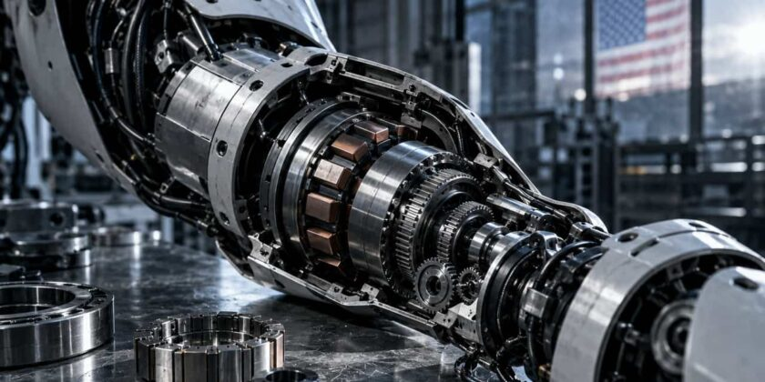

*A cluster of inference engines built for exactly one model and one GPU family are quietly outrunning the general-purpose tools most local AI builders default to, and the tradeoff they demand is one buyers rarely see coming.*

Over the past three months, a handful of what one developer calls "napkin runtimes" have shown up in the local AI scene: Strata, ninfer, DwarfStar, Splash, llamAmpere, and gufo. None of them are general-purpose. Most support a short, curated list of models and target one hardware family, while even the wider projects stay narrow by general-runtime standards. They're beating llama.cpp, vLLM, and Ollama by a wide margin in their narrow lane. That's according to a widely discussed blog post from developer Carteakey that's been making the rounds on r/LocalLLaMA.

The numbers are the reason people are paying attention. Carteakey's own benchmark on a consumer rig running Qwen3.8-Flash-Next, Alibaba's 125-billion-parameter mixture-of-experts model, found upstream llama.cpp master decoding at 20.8 tokens per second. Strata, a purpose-built engine for that exact model, hit 53.2 tokens per second at 60,000 tokens of context, with prefill throughput of 2,013 tokens per second. That's about 2.6x faster than upstream llama.cpp master on the same box, though Carteakey's updated technical write-up puts the sustained gap closer to 2x against his best MTP-assisted llama.cpp setup. Strata does this with a per-expert VRAM cache, carving out 5.04 GiB for 3,086 hot experts pulled from across all 48 layers of the model. It's a trick that only makes sense if you've built your entire engine around one model's architecture.

We covered Strata when it first let a 125-billion-parameter model run on a single gaming GPU with as little as 8GB of VRAM. The pattern repeating now is bigger than that one tool.

Here's the part worth getting right, because the Reddit framing of "overfit" can read like these engines are gaming benchmark leaderboards to look good on paper. That's not quite what's happening, and the distinction matters if you're the one signing off on infrastructure spend. Strata and its peers aren't tuning for a test set and then falling apart on real traffic. They're giving up generality on purpose: one model or a short model list, one hardware family or a narrow hardware set, and optimization passes aimed at those combinations. NInfer is a CUDA-only engine. It narrows its target to selected Qwen checkpoints on Nvidia hardware, while Splash does the inverse: built only for Apple Silicon, it reports 210 tokens per second on Qwen3.6-35B-A3B on a 48GB M5 Pro, a number a general engine chasing cross-platform support has no path to matching.

[China's OpenBMB Releases MiniCPM5-2B, Beating Every Open Model Under 4B](https://startupfortune.com/chinas-openbmb-releases-minicpm5-2b-beating-every-open-model-under-4b/)

OpenBMB released MiniCPM5-2B on September 7, a 2.52-billion-parameter open model that tops the Artificial Analysis Intelligence Index among all models under 4 billion parameters, beating Qwen3.5-4B despite having roughly half the size. The Tsinghua NLP Lab and ModelBest joint venture also published its full training data, RL corpus, and... - [open source small language models 2B parameters](https://startupfortune.com/chinas-openbmb-releases-minicpm5-2b-beating-every-open-model-under-4b/) - [MiniCPM5-2B beats Qwen3.5-4B benchmark performance](https://startupfortune.com/chinas-openbmb-releases-minicpm5-2b-beating-every-open-model-under-4b/)

So the real risk for a founder picking an inference stack isn't that the benchmark number is fake. It's that the number is real but conditional, and the condition is a sentence nobody puts in the README headline: this engine works for this model and this hardware class, and little else. Swap the model, change the GPU, or wait for the next Qwen release, and the tool you built your serving layer around may simply not support it. Carteakey's own post is explicit that none of these runtimes are general-purpose. The tradeoff is real, named, and already written down. It's just easy to skip past when a 4x number is sitting at the top of a fast-moving Reddit thread.

That tradeoff lands differently depending on who you are. A hobbyist running one model on one 3090 for personal use has almost nothing to lose by adopting Strata or Splash outright, since the narrow fit is exactly their use case. A startup's calculus is different. It needs infrastructure that can swap models as better ones ship, or that runs on whatever cloud GPU is cheapest that quarter. Locking the serving layer to a single model-hardware pair, in exchange for throughput that might be obsolete the day a new model drops, is a real bet either way.

This also complicates the broader "local AI is cheaper" argument SF has tracked through coverage of Bittensor and Strata itself. The headline throughput gains from these specialized engines are real, not manufactured. But the cost comparison that matters for a buyer isn't tokens per second on launch day. It's tokens per second averaged over the model's actual lifespan. That includes the version after this one, when a narrow engine's support list may not have caught up yet. vLLM and llama.cpp lag on peak throughput precisely because they carry that generality forward. Whether that's worth paying for depends entirely on how often you expect to change your mind about which model you're running.

**Also read:** [A Chinese Robot Ran 100 Meters Faster Than Usain Bolt Ever Did](https://startupfortune.com/a-chinese-robot-ran-100-meters-faster-than-usain-bolt-ever-did/) • [Tesla's Cybercab Hits an NHTSA Probe Just Hours Into Its Austin Launch](https://startupfortune.com/teslas-cybercab-hits-an-nhtsa-probe-just-hours-into-its-austin-launch/) • [Bessent tells AI labs to police themselves and kills their liability shield push](https://startupfortune.com/bessent-tells-ai-labs-to-police-themselves-and-kills-their-liability-shield-push/)

***This article is posted in [AI News](https://startupfortune.com/category/ai/), check it out for more related stories.***

## Join the discussion

TOPICS

[Carteakey](https://startupfortune.com/tag/carteakey/) [narrow AI inference engines outperforming vLLM](https://startupfortune.com/tag/narrow-ai-inference-engines-outperforming-vllm/) [Qwen3.8-Flash-Next](https://startupfortune.com/tag/qwen38-flash-next/) [specialized GPU runtime for local AI models](https://startupfortune.com/tag/specialized-gpu-runtime-for-local-ai-models/) [Strata](https://startupfortune.com/tag/strata/) [Strata expert cache VRAM explained](https://startupfortune.com/tag/strata-expert-cache-vram-explained/) [tradeoff of single model GPU inference engines](https://startupfortune.com/tag/tradeoff-of-single-model-gpu-inference-engines/) [why narrow AI inference engines beat llama.cpp](https://startupfortune.com/tag/why-narrow-ai-inference-engines-beat-llamacpp/)

Elroy is a digital marketer and developer from Goa, with over a decade of experience web development and marketing. He has been associated with several startups and serves currently as an Editor to the Asia Pacific Industrial magazine. He occasionally writes on Startup Fortune about technology and automation.

 [BUSINESS](https://startupfortune.com/category/business/) [FCC's ban on Chinese humanoid robots may starve the US firms it aims to help](https://startupfortune.com/fccs-ban-on-chinese-humanoid-robots-may-starve-the-us-firms-it-aims-to-help/)

5 min 570 reads

 [BUSINESS](https://startupfortune.com/category/business/) [PicPay stock has lost half its value since its Nasdaq debut in January](https://startupfortune.com/picpay-stock-has-lost-half-its-value-since-its-nasdaq-debut-in-january/)

5 min 614 reads

 [AI](https://startupfortune.com/category/ai/) [OpenAI's GPT-6 Astra jumped to 62.7% on AI's hardest reasoning test](https://startupfortune.com/openais-gpt-6-astra-jumped-to-627-on-ais-hardest-reasoning-test/)

5 min 803 reads
